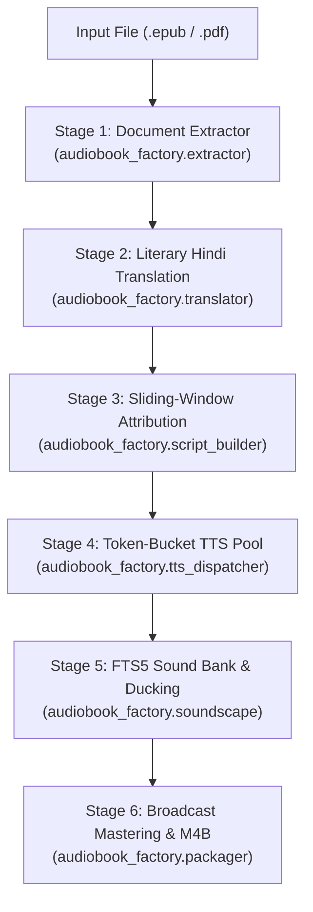

# Novel Audiobook Factory Skill

This skill governs autonomous, studio-grade audiobook production on the high-performance PC workstation. It converts full-length novels (50,000–100,000+ words) into multi-cast, cinematic M4B audiobooks with zero manual editing.

---

## 1. Zero-Friction One-Command Invocation

Whenever the user provides an input book file (`.epub`, `.pdf`, `.txt`, `.md`) and asks to produce an audiobook:

```bash
# In c:\Users\Suraj\Documents\Antigravity\Audiobook:
python audiobook_cli.py auto "C:/path/to/novel.epub" --hindi --dramatized --voice Aoede --workers 3
```

### Command Flags:
- `file`: Path to the input novel (`.epub` strongly preferred; `.pdf` parsed via Gemini multimodal document API).
- `--hindi`: Translates English prose into dramatic, spoken Hindustani using Two-Pass Glossary Memory (*Aap/Tum/Tu* honorific hierarchy). Omit for original language.
- `--dramatized`: Multi-voice character attribution mode using sliding-window chunking (no truncation).
- `--voice`: Lead narrator voice persona (`Aoede` female narrative, `Charon` deep male narrative).
- `--workers`: Number of concurrent TTS synthesis workers (default: `3`, tuned for 15 RPM free tier).
- `--cover`: Optional path to cover art image (`.jpg` / `.png`) to embed in the M4B container.

---

## 2. Core Architecture Pipeline



### Stage 1: Document Ingestion ([`extractor.py`](file:///C:/Users/Suraj/Documents/Antigravity/Audiobook/audiobook_factory/extractor.py))
- **EPUB**: Traverses `.opf` spine and table of contents with zero external pip dependencies.
- **PDF**: Uses Gemini multimodal vision API to digitize clean Markdown, automatically stripping running headers and footers.

### Stage 2: Sense-for-Sense Translation ([`translator.py`](file:///C:/Users/Suraj/Documents/Antigravity/Audiobook/audiobook_factory/translator.py))
- **Pass 1**: Extracts persistent character glossary (`translation/glossary.json`) defining Hindi spellings and honorific relationships (*Aap/Tum/Tu*).
- **Pass 2**: Sense-for-sense dramatic Hindustani translation suitable for spoken audio drama.

### Stage 3: Screenplay Attribution ([`script_builder.py`](file:///C:/Users/Suraj/Documents/Antigravity/Audiobook/audiobook_factory/script_builder.py))
- **Sliding-Window Parsing**: Chunks chapters into 1,200-word blocks with rolling context. Eliminates text truncation for long chapters.
- **Speaker Aliasing**: Resolves character nicknames and pronoun tags (*"the professor"* $\rightarrow$ *"Severus Snape"*).

### Stage 4: Concurrent Voice Synthesis ([`tts_dispatcher.py`](file:///C:/Users/Suraj/Documents/Antigravity/Audiobook/audiobook_factory/tts_dispatcher.py))
- **Engine**: Google Gemini 3.1 Flash TTS (`gemini-3.1-flash-tts-preview`) generating 24kHz raw PCM.
- **Rate-Limiter**: `TokenBucketRateLimiter` pacing requests across 3 workers to respect 15 RPM free tier limits without hard sleep.
- **Ledger**: Transaction-safe SQLite state (`project_state.db`) tracks every segment status.

### Stage 5: Soundscape & FTS5 Sound Bank ([`soundscape.py`](file:///C:/Users/Suraj/Documents/Antigravity/Audiobook/audiobook_factory/soundscape.py))
- **Mood Detection**: Scene tone classified into mood profiles (`peaceful`, `mysterious`, `tense`, `emotional`, `epic`).
- **SQLite FTS5 Sound Bank**: Instant keyword search for ambient beds and CC0 Foley sounds.
- **Sidechain Ducking**: FFmpeg dynamically compresses BGM by `-16dB` during vocal narration.

### Stage 6: Broadcast Mastering & Packaging ([`mastering.py`](file:///C:/Users/Suraj/Documents/Antigravity/Audiobook/audiobook_factory/mastering.py), [`packager.py`](file:///C:/Users/Suraj/Documents/Antigravity/Audiobook/audiobook_factory/packager.py))
- **5-Stage Studio Vocal Chain**: Highpass 60Hz $\rightarrow$ Neural Denoiser $\rightarrow$ De-esser (6-8.5kHz) $\rightarrow$ Lowpass 10.5kHz $\rightarrow$ EBU R128 (-19 LUFS).
- **Single-Pass Stream Copy**: Concat demuxer streams directly to `.m4b` container with embedded chapter timestamps.

---

## 3. Voice Persona Guide (Gemini 3.1 Flash TTS)

| Persona Name | Gender | Vocal Profile & Character Casting |
| :--- | :--- | :--- |
| **Aoede** | Female | Expressive, warm, highly melodious narrative lead. Perfect for classic literature, drama, and main storytelling. |
| **Charon** | Male | Deep, commanding, resonant baritone. Ideal for authoritative male narrators, villains, mentors, and dark fantasy. |
| **Kore** | Female | Soft, gentle, friendly, youthful female dialogue. |
| **Puck** | Male | Energetic, dynamic, conversational young male voice. |
| **Fenrir** | Male | Rugged, powerful, booming warrior/action character. |
| **Zephyr** | Female | Calm, ethereal, whisper-soft atmosphere narrator. |

---

## 4. Monitoring & Recovery Protocols

### Inspecting Production Progress via SQLite:
```python
from pathlib import Path
from audiobook_factory.state import ProjectStateLedger

ledger = ProjectStateLedger(Path("audiobooks/projects/<book_slug>"))
print(ledger.get_progress())
# Output: {'total_segments': 1420, 'completed': 890, 'progress_percent': 62.7, 'total_duration_min': 94.5}
```

### Resuming Interrupted Jobs:
If network drops or the PC reboots mid-synthesis, rerun the exact same command:
```bash
python audiobook_cli.py auto "C:/path/to/novel.epub" --hindi --dramatized
```
The pipeline automatically skips completed segments in under 5ms, re-attaching immediately to the first pending segment. Zero duplicated API calls, zero lost tokens.
