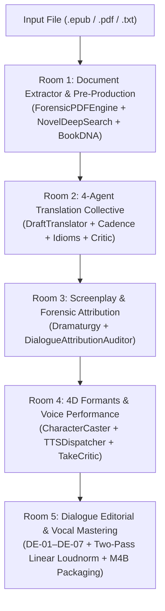

# Novel Audiobook Factory Skill (Pure Vocals-Only Engine v5.0)

This skill governs autonomous, studio-grade audiobook production on the high-performance PC workstation. It converts full-length novels (50,000–100,000+ words) into multi-cast, studio-mastered M4B audiobooks with zero manual editing.

> [!IMPORTANT]
> **Pure Vocals-Only Architectural Mandate**:
> On this branch, background music (BGM), sound effects (SFX), Archive.org sound bank harvesting, and 5-track multitrack mixdowns are **permanently decoupled and archived** in `archive/cinematic_audio/`.
> The engine is 100% focused on Audible-standard vocal clarity, multi-character acting, dialogue nuance, and broadcast-grade vocal mastering.

---

## 1. Zero-Friction One-Command Invocation

Whenever the user provides an input book file (`.epub`, `.pdf`, `.txt`, `.md`) and asks to produce an audiobook:

```bash
# In c:\Users\Suraj\Documents\antigravity\optimistic-kepler:
python audiobook_cli.py auto "C:/path/to/novel.epub" --hindi --dramatized --voice Aoede --workers 1
```

### Command Flags:
- `file`: Path to the input novel (`.epub` strongly preferred; `.pdf` parsed via layout-aware XY-cut engine).
- `--hindi`: Translates English prose into dramatic spoken Hindustani using the 4-Agent Translation Collective. Omit for original language.
- `--dramatized`: Multi-voice character casting with 4D acoustic formant modulation.
- `--voice`: Lead narrator voice persona (`Aoede` female narrative, `Charon` deep male narrative).
- `--workers`: Number of concurrent TTS synthesis workers (default: `1` sequential key rotation, backed by 124+ active rotating Gemini API keys).
- `--cover`: Optional path to cover art image (`.jpg` / `.png`) to embed in the M4B container.

---

## 2. Core Architecture Pipeline


```mermaid
flowchart TD
    A["Input File (.epub / .pdf / .txt)"] --> B["Room 1: Document Extractor & Pre-Production<br/>(ForensicPDFEngine + NovelDeepSearch + BookDNA)"]
    B --> C["Room 2: 4-Agent Translation Collective<br/>(DraftTranslator + Cadence + Idioms + Critic)"]
    C --> D["Room 3: Screenplay & Forensic Attribution<br/>(Dramaturgy + DialogueAttributionAuditor)"]
    D --> E["Room 4: 4D Formants & Voice Performance<br/>(CharacterCaster + TTSDispatcher + TakeCritic)"]
    E --> F["Room 5: Dialogue Editorial & Vocal Mastering<br/>(DE-01–DE-07 + Two-Pass Linear Loudnorm + M4B Packaging)"]
```

### Room 1: Document Ingestion & Pre-Production Intelligence
- **Pillar 1 Forensic Ingestion**: Geometric PDF layout XY-cut reading order (`PDFLayoutReconstructor`), character-accurate `SourceProvenance` indexing (`_PDFPageSpanRecord`), and fail-closed Gate 0.1 quality audits.
- **Novel DeepSearch Grounding**: Multi-angle factual dossier compilation (`NovelDeepSearchEngine`, `DeepSearchNovelDossier`) preventing hallucinations across world literature.
- **Book DNA Profiler**: Dynamically resolves `literary_tradition`, `source_fidelity_tier`, `regional_dialect_cadence`, and `profanity_policy` without hardcoded titles or biases.
- **Dramatis Personae & Phonetic Lexicon**: Character discovery and phonetic Devanagari transliteration locked in `book_bible.json` and `cast_lock.json`.

### Room 2: Sense-for-Sense Translation Collective & Tri-Partite Taxonomy
- **4-Agent Dramatic Translation Collective**:
  - `LiteraryDraftTranslator`: Dramatic prose preserving 70% canon sacredness.
  - `HindustaniCadenceSpecialist`: Natural actor breath pauses (`—`, `...`, `,`) and honorific status shifts (`TU <-> MAAI-BAAP`).
  - `SubtextAndIdiomDramaturge`: Earthy Hindustani metaphors and 19-to-21 unrated amplification.
  - `TranslationQualityCritic`: Anti-omission validation and BookBible terminology verification.
- **Tri-Partite Entity Partition**:
  - Proper Names: Phonetically transliterated into Devanagari.
  - Heraldic Monikers: Transliterated phonetically as proper names (e.g. *Silver Falcon* $\to$ *सिल्वर फाल्कन*), strictly banning literal calques (*चांदी का बाज़*).
  - Occupational Roles: Evocative natural Hindustani (*अजनबी, कसाई, सरायवाला*).
- **Living Somatic Register**: Spoken body language (*कमर, कूल्हे, नंगी/खुली बाँहें*), permanently banning Sanskrit tat-sama words (*नितंब, नग्न भुजाएँ*).

### Room 3: Screenplay Dramaturgy & Anti-Swap Attribution
- **Two-Pass Decoupled Screenplay Parser**: Deconstructs chapters into beat-aligned chunks, attributing dialogue turns, subtext actioning verbs, and spatial staging.
- **Dialogue Attribution Auditor**: Dedicated QA agent preventing $A \leftrightarrow B$ speaker turn inversions, quote misattributions to Narrator, and speech tag leakage (`"उसने कहा"`).

### Room 4: 4D Formants & Performance Restraint
- **Actor Overacting Elimination**: Strips theatrical `"acting to..."` directives; anchors delivery with physical vocal cues and universal restraint anchor `"understated natural dialogue (never theatrical)"`.
- **Narrator Transparency Invariant**: Narrator locked strictly to `"calm, steady, articulate, measured audiobook delivery"` at temperature `0.32` with zero melodrama.
- **Temperature Clamping (`0.30 - 0.52`)**: Eliminates pitch screeching, panting, and caricatures (dialogue `0.35 - 0.42`, climactic $\le 0.50$).
- **Dynamic 2,089 Voice Catalog (`VoiceCatalog`)**: Integrates all 2,089 verified voices (114 native Hindi voices, 120 regional Indian English personas, 215 English Gemini studio voices).
- **Elimination of WSOLA `atempo` Flange**: Speech tempo modulated through organic phrasing and punctuation rather than phase-destructive time-stretching.
- **124+ Key Gemini Flash TTS Pool**: Concurrent token-bucket rate limiting with anti-bot jitter and permanent `BLOCK_NONE` safety settings.
- **TakeAuditionCritic Realignment**: Judicial multi-take evaluation rewarding grounded human realism over theatrical melodrama.

### Room 5: Dialogue Editorial & Broadcast Vocal Mastering
- **Dialogue Editorial Layer (DE-01 - DE-07)**: Endpoint zero-crossing snapping (-52 dBFS speech floor), Hann micro-fades (12ms pre-speech, 18ms post-speech), and dramatic turn latency.
- **Two-Pass Measured Linear EBU R128 Loudnorm**:
  - Pass 1 measurement with `-f null -` extracts exact integrated loudness and speech threshold.
  - Pass 2 linear application (`linear=true`) with measured stats offset: **zero pause gain pumping or room-tone breathing**.
- **Consonant Clarity (Zero De-Esser)**: Eliminated destructive hardware de-essers, preserving 100% crispness for Hindi dental/aspirated sibilants (*स, श, छ, थ, ध*).
- **Post-Loudnorm Kaiser Sinc Resampling**: Strict 48kHz / 24-bit studio container positioned *after* loudnorm, eradicating 192kHz WAV bloat.
- **Chaptered M4B Container**: Streamlined packaging into `.m4b` container with FFMETADATA1 chapter markers, TOC navigation, and embedded high-resolution cover artwork.

---

## 3. Voice Persona Guide (Gemini Flash TTS)

| Persona / Archetype | Voice ID / Base | Dialect / Pitch | Character Casting Profile |
| :--- | :--- | :--- | :--- |
| **Supreme Narrator (3rd Person)** | `Aoede` | English / Warm Mid | Expressive, warm, melodious literary narrative benchmark. |
| **First-Person Male Narrator** | `Charon` / `hi-in-csagent-11` | English / Urdu Mid | Resonant, reflective protagonist narrator for first-person POV. |
| **Rustic Fighter / Teen Boy** | `hi-in-podcaster-12` | Haryanvi / Low | 22yo rustic fighter; agile apprentice, rough-and-tumble teen (14–17yo). |
| **Anime Seiyū Child Voice** | `hi-in-commercial-5` (+12% pitch) | Awadhi / High | Young child, young girl (<14yo); crisp, agile youth resonance. |
| **Lyrical Companion / Bard** | `Puck` / `hi-in-tutor-5` | English / Bhojpuri Mid | Energetic, witty, theatrical companion, charismatic youth. |
| **Hardened Veteran / Commander** | `Algenib` / `hi-in-advisor-9` | English / Bhojpuri Low | Gravelly, grounded, world-weary warrior, veteran captain. |
| **Dignified Matriarch / Sorceress** | `Leda` / `hi-in-training-2` | English / Bundeli Mid | Dignified, authoritative noble, wise scholar or sorceress. |
| **Gentle / Ethereal Ally** | `Kore` / `hi-in-tutor-3` | English / Awadhi Mid | Soft, warm, soothing healer or loyal apprentice. |

---

## 4. Monitoring & Recovery Protocols

### Inspecting Production Progress via SQLite:
```python
from pathlib import Path
from audiobook_factory.state import ProjectStateLedger

ledger = ProjectStateLedger(Path("audiobooks/projects/<book_slug>"))
print(ledger.get_progress())
# Output: {'total_segments': 1420, 'completed': 890, 'progress_percent': 62.7, 'total_duration_min': 94.5}
```

### Resuming Interrupted Jobs:
If network drops or the PC reboots mid-synthesis, rerun the exact same command:
```bash
python audiobook_cli.py auto "C:/path/to/novel.epub" --hindi --dramatized
```
The pipeline automatically skips completed segments in under 5ms, re-attaching immediately to the first pending segment. Zero duplicated API calls, zero lost tokens.
