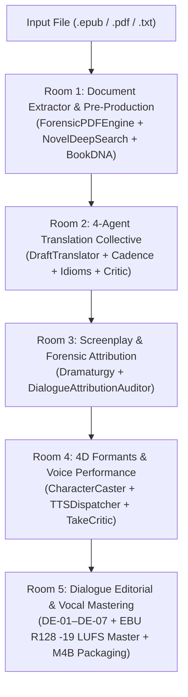

# Novel Audiobook Factory Skill (Pure Vocals-Only Engine v4.0)

This skill governs autonomous, studio-grade audiobook production on the high-performance PC workstation. It converts full-length novels (50,000–100,000+ words) into multi-cast, studio-mastered M4B audiobooks with zero manual editing.

> [!IMPORTANT]
> **Pure Vocals-Only Architectural Mandate**:
> On this branch, background music (BGM), sound effects (SFX), Archive.org sound bank harvesting, and 5-track multitrack mixdowns are **permanently decoupled and archived** in `archive/cinematic_audio/`.
> The engine is 100% focused on Audible-standard vocal clarity, multi-character acting, dialogue nuance, and broadcast-grade vocal mastering.

---

## 1. Zero-Friction One-Command Invocation

Whenever the user provides an input book file (`.epub`, `.pdf`, `.txt`, `.md`) and asks to produce an audiobook:

```bash
# In c:\Users\Suraj\Documents\antigravity\optimistic-kepler:
python audiobook_cli.py auto "C:/path/to/novel.epub" --hindi --dramatized --voice Aoede --workers 3
```

### Command Flags:
- `file`: Path to the input novel (`.epub` strongly preferred; `.pdf` parsed via layout-aware XY-cut engine).
- `--hindi`: Translates English prose into dramatic spoken Hindustani using the 4-Agent Translation Collective. Omit for original language.
- `--dramatized`: Multi-voice character casting with 4D acoustic formant modulation.
- `--voice`: Lead narrator voice persona (`Aoede` female narrative, `Charon` deep male narrative).
- `--workers`: Number of concurrent TTS synthesis workers (default: `3`, backed by 120+ active rotating Gemini API keys).
- `--cover`: Optional path to cover art image (`.jpg` / `.png`) to embed in the M4B container.

---

## 2. Core Architecture Pipeline


```mermaid
flowchart TD
    A["Input File (.epub / .pdf / .txt)"] --> B["Room 1: Document Extractor & Pre-Production<br/>(ForensicPDFEngine + NovelDeepSearch + BookDNA)"]
    B --> C["Room 2: 4-Agent Translation Collective<br/>(DraftTranslator + Cadence + Idioms + Critic)"]
    C --> D["Room 3: Screenplay & Forensic Attribution<br/>(Dramaturgy + DialogueAttributionAuditor)"]
    D --> E["Room 4: 4D Formants & Voice Performance<br/>(CharacterCaster + TTSDispatcher + TakeCritic)"]
    E --> F["Room 5: Dialogue Editorial & Vocal Mastering<br/>(DE-01–DE-07 + EBU R128 -19 LUFS Master + M4B Packaging)"]
```

### Room 1: Document Ingestion & Pre-Production Intelligence
- **Pillar 1 Forensic Ingestion**: Geometric PDF layout XY-cut reading order (`PDFLayoutReconstructor`), character-accurate `SourceProvenance` indexing (`_PDFPageSpanRecord`), and fail-closed Gate 0.1 quality audits.
- **Novel DeepSearch Grounding**: Multi-angle factual dossier compilation (`NovelDeepSearchEngine`, `DeepSearchNovelDossier`) preventing hallucinations across world literature.
- **Book DNA Profiler**: Dynamically resolves `literary_tradition`, `source_fidelity_tier`, `regional_dialect_cadence`, and `profanity_policy` without hardcoded titles or biases.
- **Dramatis Personae & Phonetic Lexicon**: Character discovery and phonetic Devanagari transliteration locked in `book_bible.json` and `cast_lock.json`.

### Room 2: Sense-for-Sense Translation Collective
- **4-Agent Dramatic Translation Collective**:
  - `LiteraryDraftTranslator`: Dramatic prose preserving 70% canon sacredness.
  - `HindustaniCadenceSpecialist`: Natural actor breath pauses (`—`, `...`, `,`) and honorific status shifts (`TU <-> MAAI-BAAP`).
  - `SubtextAndIdiomDramaturge`: Earthy Hindustani metaphors and 19-to-21 unrated amplification.
  - `TranslationQualityCritic`: Anti-omission validation and BookBible terminology verification.
- **The Dual-Rule Invariant ("Nothing Above Source")**:
  - *Classical / Heritage Literature*: Authorial dignity and sacred regional pathos without modern street slang.
  - *Raw Unrated Fiction*: 19-to-21 amplification of raw street curses, visceral combat gore, and unvarnished somatic intimacy.

### Room 3: Screenplay Dramaturgy & Anti-Swap Attribution
- **Two-Pass Decoupled Screenplay Parser**: Deconstructs chapters into 500-word beat-aligned chunks, attributing dialogue turns, subtext actioning verbs, and spatial staging.
- **Dialogue Attribution Auditor**: Dedicated QA agent preventing $A \leftrightarrow B$ speaker turn inversions, quote misattributions to Narrator, and speech tag leakage (`"उसने कहा"`).

### Room 4: 4D Formants & Voice Performance Realization
- **4D Acoustic Formant Modulation**: Pitch delta ($\pm 4-12\%$), tempo scaling, and 4D parametric EQ formant profiles (`equalizer=f=...`) dynamically applied via FFmpeg DSP to prevent vocal convergence when multiple characters share base voices.
- **Formant-Sensitive Hash Caching**: Filename hashing incorporates the active EQ formant profile for deterministic cache invalidation.
- **120+ Key Gemini Flash TTS Pool**: Concurrent token-bucket rate limiting with anti-bot jitter and permanent `BLOCK_NONE` safety settings.
- **TakeAuditionCritic**: Judicial multi-take evaluation on climactic scenes.

### Room 5: Dialogue Editorial & Broadcast Vocal Mastering
- **Dialogue Editorial Layer (DE-01 - DE-07)**: Endpoint zero-crossing snapping (-52 dBFS speech floor), Hann micro-fades (12ms pre-speech, 18ms post-speech), and dramatic turn latency.
- **Broadcast EBU R128 Vocal Master**: Standardized `-19.0 LUFS` ($\pm 0.5$ LU) integrated loudness and `-1.5 dBTP` true-peak ceiling at 48kHz / 24-bit.
- **Chaptered M4B Container**: Streamlined packaging into `.m4b` container with FFMETADATA1 chapter markers, TOC navigation, and embedded high-resolution cover artwork.

---

## 3. Voice Persona Guide (Gemini Flash TTS)

| Persona Name | Gender | Vocal Profile & Character Casting |
| :--- | :--- | :--- |
| **Aoede** | Female | Expressive, warm, melodious narrative lead. Perfect for classic literature, drama, and main storytelling. |
| **Charon** | Male | Deep, commanding, resonant baritone. Ideal for authoritative male narrators, villains, mentors, and dark fantasy. |
| **Kore** | Female | Soft, gentle, friendly, youthful female dialogue. |
| **Puck** | Male | Energetic, dynamic, conversational young male voice. |
| **Fenrir** | Male | Rugged, powerful, booming warrior/action character. |
| **Zephyr** | Female | Calm, ethereal, whisper-soft atmosphere narrator. |
| **Leda** | Female | Dignified, mature matriarch, noble or scholarly speaker. |
| **Orpheus** | Male | Lyrical, melancholic, philosophical orator or bard. |

---

## 4. Monitoring & Recovery Protocols

### Inspecting Production Progress via SQLite:
```python
from pathlib import Path
from audiobook_factory.state import ProjectStateLedger

ledger = ProjectStateLedger(Path("audiobooks/projects/<book_slug>"))
print(ledger.get_progress())
# Output: {'total_segments': 1420, 'completed': 890, 'progress_percent': 62.7, 'total_duration_min': 94.5}
```

### Resuming Interrupted Jobs:
If network drops or the PC reboots mid-synthesis, rerun the exact same command:
```bash
python audiobook_cli.py auto "C:/path/to/novel.epub" --hindi --dramatized
```
The pipeline automatically skips completed segments in under 5ms, re-attaching immediately to the first pending segment. Zero duplicated API calls, zero lost tokens.
