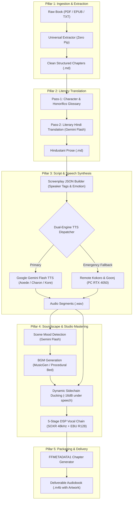

# 🎙️ Audiobook Maker (Audiobook Factory)

> **Studio-Grade Audiobook Production Engine with Literary Hindi Translation, Multi-Voice Character Casting, Dynamic BGM Scoring & Native M4B Packaging.**

[](https://www.python.org/)
[](https://ffmpeg.org/)
[](https://ai.google.dev/)
[](https://termux.dev/)
[](#)
[](LICENSE)

---

## 📖 Overview

**Audiobook Maker** is a production-grade, resource-aware audiobook production framework engineered to run seamlessly across mobile environments (**Android Termux PRoot ARM64**) and desktop AI workstations.

It automates the transformation of raw books (**EPUB, PDF, TXT, Markdown**) into dramatized, broadcast-ready audiobooks featuring literary Hindi translation, character-attributed voices, mood-matched musical soundscapes, and native chapterized `.m4b` containers.

---

## 🏛️ Architecture Pipeline



---

## ✨ Key Capabilities

### 1. Dual-Engine Resilient Speech Synthesis
- **Primary:** **Google Gemini Cloud Flash TTS API** (`gemini-2.5-flash-preview-tts` / `gemini-3.1-flash-tts-preview`). Expressive personas tailored for multilingual cadence:
  - `Aoede`: Polished, melodic feminine narration (top choice for Hindi / Hinglish).
  - `Charon`: Deep, authoritative, resonant masculine cadence (ideal for classic fantasy / dark themes).
  - `Orus` / `Fenrir` / `Puck`: Distinct character dialogue casting.
- **Emergency Standby:** Automatic persona-mapped fallback to local PC GPU **Kokoro & Goonj-1-82M** server if API quotas are exhausted or network drops.

### 2. Deep Foley & 5-Track Audio Drama Compositor (GraphicAudio Standard)
- **100% Free Local Sound Bank**: Curated Kenney CC0 RPG and Impact physical object libraries indexed via SQLite FTS5 (`audiobooks/sound_bank/`). Zero third-party API fees or subscriptions.
- **Deep Foley Miner (`foley_miner.py`)**: Automatically analyzes screenplay prose, extracts verbs/objects (swords, tankards, footsteps, door creaks, armor rustles, magic signs), micro-timing offsets (`offset_ms`), and spatial stereo coordinates (`pan`).
- **5-Track FFmpeg Timeline Compositor (`soundscape.py`)**:
  - **Track 1 (Voice Bus)**: Multi-cast dialogue with room impulse reverberation matching scene acoustics.
  - **Track 2 (Foley Bus)**: Sample-accurate physical object cues placed via FFmpeg `adelay`.
  - **Track 3 (Ambience Bus)**: Environmental room tone and weather beds.
  - **Track 4 (Music Bus)**: Dynamic score with **1.2kHz–3.2kHz spectral carving** (`equalizer=f=2200:t=q:w=1.5:g=-5.5`) ensuring music never masks speech, plus -16dB dynamic lookahead ducking.
  - **Master Bus**: SOXR 48kHz sinc resampler + EBU R128 (`-19 LUFS`) broadcast mastering.

### 3. Android 48,000 Hz Bit-Perfect Rule
- Android's native `AudioFlinger` and hardware DACs run strictly at **48,000 Hz**. Playing raw 24kHz streams triggers low-quality linear interpolation on Android.
- All speech chunks are resampled using FFmpeg's **SOXR polyphase sinc resampler** to 48,000 Hz, with highpass rumble cuts, de-essing, vocoder de-noising, and **EBU R128 international broadcast loudness normalization** (`-19 LUFS` for audiobooks, `-16 LUFS` for podcasts).

### 4. Zero Dependency Mobile Footprint
- Designed for mobile ARM64 (Termux): **100% Python Standard Library** (`urllib.request`, `json`, `subprocess`, `hashlib`).
- No bulky ML dependencies, no PyTorch overhead on mobile. High-performance compute is offloaded cleanly via HTTP/REST APIs.

---

## 📂 Project Structure

```text
audiobook-maker/
├── .agents/                      # Git-tracked Persistent Agent Memory Bank
│   ├── memory/
│   │   ├── activeContext.md      # Live sprint state & active context (budget <= 30 lines)
│   │   ├── decisions.md          # Architecture Decision Records (ADR-001 through ADR-007)
│   │   └── patterns.md           # Engineering patterns, FFmpeg tricks & gotchas
│   └── AGENTS.md                 # Autonomous Agent & Hybrid Workstation Protocol
├── audiobook_factory/            # Core Production Package
│   ├── __init__.py               # Package metadata and public exports (v2.1.0)
│   ├── extractor.py              # Universal Extractor (EPUB, PDF, TXT, Markdown)
│   ├── translator.py             # Two-Pass Literary Translation with Glossary
│   ├── script_builder.py         # Screenplay JSON converter with multi-cast attribution
│   ├── foley_miner.py            # Deep Foley & Acoustic Director Miner (.cue.json)
│   ├── tts_dispatcher.py         # Multi-Cast Dispatcher with TokenBucket & Stealth Cadence
│   ├── sound_bank.py             # SQLite FTS5 Sound Bank with CC0 Foley & Spot SFX
│   ├── soundscape.py             # 5-Track Timeline Compositor, Mood Detection & Ducking
│   ├── mastering.py              # Studio vocal concatenation, SOXR 48kHz & EBU R128
│   └── packager.py               # FFMETADATA1 chapter markers & M4B containerization
├── ffmpeg_mastering/             # Dedicated Audio DSP & Mastering Tools
│   ├── README.md                 # Complete Mastering & Signal Flow Documentation
│   ├── audio_master.py           # Standalone CLI audio mastering tool
│   ├── SKILL.md                  # Audio mastering agent skill specification
│   ├── mcp_tool_schema.json      # Model Context Protocol (MCP) tool schema
│   └── presets/                  # Production DSP presets
│       ├── audiobook_master.json # EBU R128 -19 LUFS broadcast master
│       ├── podcast_master.json   # -16 LUFS punchy vocal master
│       └── sidechain_ducking.json# Sidechain compression curve definitions
├── audiobook_cli.py              # Unified CLI runner (extract, translate, script, synth, bgm, master, package)
├── kokoro_client.py              # Standalone remote Kokoro/Goonj client
├── .env.example                  # Environment configuration template
├── .gitignore                    # Strict exclusion of API keys, tokens, and audio binaries
├── pyproject.toml                # Standard packaging specification
├── requirements.txt              # Zero-dependency specification
├── LICENSE                       # MIT License
└── README.md                     # This documentation
```

---

## 🚀 Quick Start

### 1. Requirements
- Python 3.10+
- FFmpeg 6.0+ (compiled with SOXR resampler & AAC/MP3 support)
- `poppler-utils` (for local PDF extraction)

### 2. Configuration
Copy the configuration template:
```bash
cp .env.example .env
```
Edit `.env` to provide your Gemini API key:
```env
GEMINI_API_KEY=your_gemini_api_key_here
TTS_PRIMARY_BACKEND=gemini_tts
GEMINI_TTS_MODEL=gemini-2.5-flash-preview-tts
GEMINI_DEFAULT_VOICE=Aoede

# Emergency Fallback (optional remote PC workstation)
KOKORO_API_URL=http://10.236.21.128:8880
ENABLE_EMERGENCY_FALLBACK=true
```

---

## 🛠️ CLI Usage

The unified CLI supports modular, step-by-step production or one-click autonomous execution.

### 🚀 The "1-Click" Autonomous Mode
For zero-touch end-to-end production (Extract ➔ Translate ➔ Script ➔ Synth ➔ BGM ➔ Master ➔ Package):
```bash
python3 audiobook_cli.py auto path/to/book.epub --hindi --dramatized --cover path/to/cover.jpg
```

### 🧱 Modular Step-by-Step Execution
```bash
# 1. Extract raw book into chapters:
python3 audiobook_cli.py extract path/to/book.epub

# 2. Translate chapters into Literary Hindi:
python3 audiobook_cli.py translate book_slug

# 3. Generate Screenplay Script with speaker tags:
python3 audiobook_cli.py script book_slug --hindi --dramatized

# 4. Generate Director Soundscape JSON Plans (Moods & SFX):
python3 audiobook_cli.py soundscape book_slug

# 5. Synthesize speech segments (with resume checkpointing):
python3 audiobook_cli.py synthesize book_slug --backend gemini_tts --voice Aoede

# 6. Master vocal track (48kHz SOXR + EBU R128):
python3 audiobook_cli.py master book_slug

# 7. Apply Cinematic BGM & Sidechain Ducking:
python3 audiobook_cli.py bgm book_slug --duck-db -16.0

# 8. Package final M4B audiobook with chapters and cover art:
python3 audiobook_cli.py package book_slug --cover path/to/cover.jpg
```

### 🎹 Sound Bank Management (FTS5 SQLite)
Manage your local soundscapes, SFX, and ambient beds:
```bash
# Scan and index new audio files into the Sound Bank
python3 audiobook_cli.py bank scan

# Search for specific moods or sounds
python3 audiobook_cli.py bank search "dark fantasy"

# View Sound Bank statistics
python3 audiobook_cli.py bank stats
```

---

## 🔒 Security & Safe Defaults

- **Zero Credentials Policy:** `.gitignore` strictly rejects `.env`, `*.key`, `*.pem`, `*.token`, and credentials JSON.
- **Media Binary Isolation:** Generated audio chunks (`.wav`, `.mp3`, `.m4a`, `.m4b`) and raw copyrighted book files are strictly excluded from git tracking.
- **Git Memory Bank:** `.agents/memory/` tracks architectural decisions and active sprints without leaking sensitive tokens.

---

## 🩺 Troubleshooting

- **FFmpeg Not Found:** Ensure `ffmpeg` is in your system `$PATH` and supports the `soxr` resampler. Check via `ffmpeg -filters | grep soxr`.
- **API Quota Exceeded:** The synthesis will automatically attempt to use the remote Kokoro PC fallback if configured in `.env`.
- **Missing Audiobooks Directory:** The `audiobooks/projects/` directory is automatically generated on your first extraction.

---

## 🤝 Contributing

We welcome contributions! Whether it's adding new TTS engines, refining DSP mastering presets, or squashing bugs.

Please read our [Contributing Guidelines](CONTRIBUTING.md) for details on setting up the local environment, testing, and submitting Pull Requests.

---

## 📜 License

Distributed under the **MIT License**. See [LICENSE](LICENSE) for details.

Developed with ❤️ by **[Suraj (naksh-07)](https://github.com/naksh-07)**.
