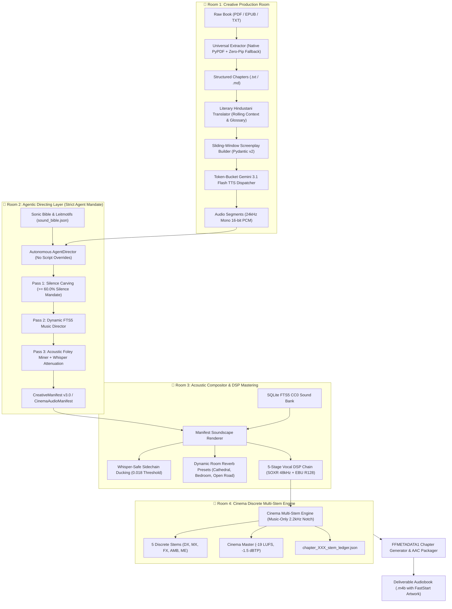

# 🎙️ Audiobook Maker (Audiobook Factory v4.0)

> **Autonomous Studio-Grade Cinematic Audio Drama Production Engine with Multi-Cast Character Attribution, Dynamic BGM Scoring, SQLite FTS5 Foley & Native M4B Packaging.**

[](https://www.python.org/)
[](https://ffmpeg.org/)
[](https://ai.google.dev/)
[-purple.svg)](docs/AUDIO_ENGINEERING.md)
[-brightgreen.svg)](tests/)
[](LICENSE)

---

## 📖 Overview

**Audiobook Maker v4.0** is an enterprise-grade, autonomous audiobook production system modeled after the high-end multi-track standards of **Audible Drama** and **GraphicAudio ("A Movie in Your Mind")**.

It transforms raw literature (**EPUB, PDF, TXT, Markdown**) into broadcast-ready dramatized audiobooks featuring literary Hindustani translation, multi-voice character casting, surgical mood-matched musical scoring, tactile Foley sound effects, and native chapterized `.m4b` containers.

---

## 🏛️ The 4-Room Audio Drama Architecture



---

## ✨ Key Technical Highlights

### 1. Cloud Speech Synthesis & Quota Isolation
- **Primary Engine:** **Google Gemini 3.1 Flash Cloud TTS API** (`gemini-3.1-flash-tts-preview`). Expressive personas tailored for multilingual cadence:
  - `Aoede`: Polished, melodic feminine narration (top choice for Hindi / Hinglish).
  - `Charon`: Deep, authoritative, resonant masculine cadence (ideal for fantasy / dark mystery).
  - `Orus` / `Fenrir` / `Puck` / `Zephyr`: Distinct character dialogue casting.
- **Quota Intelligence & Isolation:** Dedicated `service="text"` vs `service="tts"` key pool routing prevents auxiliary text prompts from depleting scarce 10 RPD Gemini TTS quotas. Multi-key persistent rotation pool with automatic date rollover, stealth cadence pacing, and automated `.env` quote stripping.

### 2. Multi-Gate Independent Verification Suite (Gates 0 - 6D)
Quality is mathematically audited at every stage of the pipeline:
- **Gate 0:** Source Text & Translation Coverage Parity
- **Gate 1:** Character Voice Casting & Collision Elimination
- **Gate 2:** Screenplay Scripting Schema & Prosody (Pydantic v2)
- **Gate 3 / 3.5:** Dynamic Manifest Feasibility Guard ($\ge 60\%$ acoustic silence mandate; accepts `CreativeManifest` & director-managed workflows)
- **Gate 5 / 5.2 / 5.3:** EBU R128 Master (standardized $\pm 1.0\text{ LU}$ tolerance), Dialogue-to-Music Ratio ($\text{DMR} \ge +12\text{ dB}$), and Stereo Phase ($r \ge 0.85$)
- **Gate 6A / 6B / 6C / 6D:** Cross-Chapter Voice Continuity, Inter-Chapter Loudness Consistency ($\le 1.0\text{ LU}$), TOC Monotonicity, and M4B Container Certification

### 3. Hollywood-Grade Acoustic DSP Mastering
- **Strict Agent Creative Mandate:** All creative acoustic choices (scoring, leitmotifs, Foley placement, pacing) belong strictly to autonomous agents (`AgentDirector`). Lower engine layers (`CinemaAudioEngine`, `ManifestRenderer`, DSP) are 100% deterministic execution runtimes with zero script overrides.
- **Music-Only 2.2kHz Spectral Notch EQ:** Parametric notch filter ($-5.5\text{ dB}$ at $2,200\text{ Hz}$, $Q=1.5$) is isolated strictly to the Music Bus `[0:a]`, preserving crisp Foley transients and expansive Ambience beds.
- **Whisper Collision Attenuation:** Foley cues triggered during quiet or whispered dialogue segments receive automatic $-6\text{ dBFS}$ attenuation via `attenuate_foley_whisper_collisions`.
- **Whisper-Safe Sidechain Ducking:** Detector calibrated to `0.018` linear (-34.9 dBFS) with $15\text{ ms}$ attack and $350\text{ ms}$ release, smoothly ducking music even during intimate whispers.
- **Dialogue Spatial Soundstage:** Constant-power stereo azimuth panning anchors Narrator dead-center ($pan = 0.0$) while subtly positioning cast characters across the stereo stage, maintaining 100% mono phase compatibility ($r \ge 0.85$).
- **Dynamic Headroom Calibration:** Explosive scenes tighten the limiter to `0.82` with True Peak ceiling `-2.0 dBTP`. Soft whisper scenes calibrate dynamic Loudness Range (`LRA = 6.0 LU`).
- **Auto-Janitor Safety Shield:** Raw WAV chunks are strictly preserved if master rendering or quality verification fails, protecting your API quota.

### 4. Container Reliability & Robust Orchestration
- **M4B AAC Packaging Safety:** Replaced brittle container copy with strict AAC validation (`is_all_aac`). Uncompressed WAV stems (`pcm_s16le`) or non-AAC assets are automatically transcoded to AAC (`-c:a aac -b:a 192k`) with `+faststart` MP4 metadata atom positioning.
- **Dynamic Vocal Track Inference:** Removed hardcoded paths; dynamically discovers vocal stems (`.wav` and `.m4a`) across project directory hierarchies.
- **Regex Chapter Parsing:** Script and audio chunk extraction utilizes robust regex `chapter_(\d+)` patterns, preventing chapter renumbering during partial runs.
- **Fast Zero-Quota PDF Extraction:** Integrated `pypdf>=5.0` for instantaneous local digital PDF parsing, bypassing the 8,192 token window before falling back to multimodal vision.

### 5. Adult Literary Fidelity & HBO/Manto Intimacy Framework
- **Unapologetic Raw Hindustani Street Grit & Period Profanity:** Eliminates prudish television euphemisms and sanitized bowdlerization (no more replacing 'bastard' with 'दुष्ट' or 'whore' with 'बुरी स्त्री'). Incorporates authentic, earthy Hindustani curses and dark tavern vitriol (`'गांड'`, `'भोसड़ीके'`, `'लंड'`, `'रांड'`, `'मादरचोद'`, `'बकचोदी'`, `'सूअर का पेशाब'`). Governed by the **19-to-21 Amplification Rule**, elevating mild source prose to visceral Desi impact for gut-punch delivery.
- **The 70/30 Anti-Parody Invariant:** Preserves a sacred **70% Canon Lore / 30% Sensory Desi Amplification** balance. European dark-fantasy mythos, monster classifications (specters, strigas, cursed beasts), and geographic realms remain untampered and un-corrupted; the 30% sensory layer is localized through organic tavern grit, Chambal/UP street idioms, and dynamic honorific power shifts (`तू` $\leftrightarrow$ `माई-बाप / सरकार`) without devolving into comic tapori spoofs.
- **Somatic Erotica & HBO Intimacy Standard:** Adapts sensual, passionate, or erotic scenes with visceral somatic realism—focusing on somatic touch, heat, skin friction, breath physics, and clothing mechanics (`'तपती कमर'`, `'पसलियों की लचक'`, `'कांपती उंगलियां'`, `'बेकाबू सांसें'`). Clinical forensic lab terminology (`'योनि'`, `'लिंग'`, `'स्तन'`, `'संभोग'`) and roadside smut are strictly banned.
- **ASMR Proximity Audio & "The Erotic Silence":** Intimate dialogue lines are staged with dedicated ASMR acoustic parameters: `spatial.proximity: "intimate_close"`, dead-center azimuth `spatial.pan: 0.0`, dynamic intensity `low`, `200-250ms` organic breath pre-roll, and music sidechain attenuation carved down to `-22.0 dB`.
- **Cynical Protagonist Grunt Engine & Duraangi Zubaan:** Encodes weary, cynical protagonist idiolects using signature neural grunts (`[growl] हूँ...`, `[sighs] हम्म...`) paired with `1000-1400ms` pregnant pauses. Models internal vs. external dissonance (*Duraangi Zubaan* inner monologues) via `[whispers] (मन में: ...)` rendered in `binaural_whisper` acoustic environments.
- **Configuration & Backward Compatibility:** Controlled via the `adult_literary_mode: bool = Field(default=True)` configuration flag in [`ProjectConfig`](file:///c:/Users/Suraj/Documents/Antigravity/Audiobook/audiobook_factory/contracts.py) and [`PipelineOrchestrator.run_autonomous_pipeline`](file:///c:/Users/Suraj/Documents/Antigravity/Audiobook/audiobook_factory/orchestrator.py), preserving 100% backward compatibility for standard literature projects.

---

## 📚 Complete Documentation Hub

| Document | Description |
|---|---|
| **[🏛️ Architecture Blueprint](docs/ARCHITECTURE.md)** | In-depth breakdown of the 4 rooms, 5 stems, 7 metadata bridges, Adult Literary Mode pipeline integration, and strict agent creative mandate. |
| **[🎓 End-to-End Tutorial & Cookbook](docs/TUTORIAL_E2E.md)** | Step-by-step recipes: 1-click runs, English audio drama, manual directing, quota resume, and DAW stems. |
| **[💻 CLI Reference](docs/CLI_REFERENCE.md)** | Full command reference for all 17 autonomous and modular production commands. |
| **[📚 API Reference](docs/API_REFERENCE.md)** | Pydantic v2 data models, public engine classes, Adult Literary contracts, and method signatures across 28 modules. |
| **[🎛️ Audio Engineering & DSP](docs/AUDIO_ENGINEERING.md)** | EBU R128 mastering, music-only 2.2kHz notch, whisper ducking, and dynamic reverb. |
| **[🛡️ Quality Gates Manual](docs/QUALITY_GATES.md)** | Complete specification of Gates 0 through 6D, thresholds, and CLI audit syntax. |
| **[🛡️ Audit Remediation & Hardening](docs/AUDIT_REMEDIATION_AND_HARDENING.md)** | Engineering report on P0 container safety, dynamic gates, routing fixes, and DSP isolation. |
| **[🎹 Sound Bank & Asset Catalog](docs/SOUND_BANK.md)** | SQLite FTS5 database schema, Sonic Genome indexing, UCS categories, and cloud CC0 seeding. |
| **[🤖 AI Agent & MCP Integration](docs/MCP_AGENT_INTEGRATION.md)** | Autonomous agent workflows, Agent Skills (`novel-audiobook-factory`, `audio-engineer-ffmpeg`), and MCP tools. |
| **[🛠️ Developer Guide](docs/DEVELOPER_GUIDE.md)** | Development environment setup, testing standards, and contribution guide. |

---

## 🚀 Quick Start

### 1. Requirements
- Python 3.10+
- FFmpeg 6.0+ (compiled with `libsoxr` and `aac` support)
- `pypdf>=5.0` (bundled dependency for fast, zero-quota digital PDF extraction)

### 2. Installation
```bash
git clone https://github.com/naksh-07/audiobook-maker.git
cd audiobook-maker
pip install -e .
```

### 3. Configuration
Copy the configuration template:
```bash
cp .env.example .env
```
Edit `.env` to provide your Gemini API key:
```env
GEMINI_API_KEY=your_gemini_api_key_here
TTS_PRIMARY_BACKEND=gemini_tts
GEMINI_TTS_MODEL=gemini-3.1-flash-tts-preview
GEMINI_DEFAULT_VOICE=Aoede
```

---

## 🛠️ Basic Usage

### 🚀 Autonomous 1-Click Production
Transform any EPUB or PDF novel into a fully dramatized, mastered `.m4b` audiobook:
```bash
python audiobook_cli.py auto books/my_novel.epub \
  --hindi \
  --dramatized \
  --voice Charon \
  --cover covers/cover.jpg \
  --workers 3
```

### 🛡️ Quality Audit Any Project
```bash
# Verify all quality gates across an entire book project
python audiobook_cli.py audit-book audiobooks/projects/my_novel

# Audit a specific chapter
python audiobook_cli.py audit my_novel --chapter 1
```

### 🎹 Manage the SQLite Sound Bank
```bash
# Ingest local audio assets into Sound Bank
python audiobook_cli.py bank ingest path/to/sound_assets/ --workers 4

# Search sound catalog
python audiobook_cli.py bank search "battle drums tension" --limit 5

# Check database statistics
python audiobook_cli.py bank stats
```

---

## 🧪 Verification & Test Suite

The codebase maintains **216 passing unit tests** across all modules with a zero-regression invariant (100% OK, 0 failures, 0 errors):

```powershell
# Run full regression suite
python -m unittest discover tests -p "test_*.py"
```

---

## 🤝 Contributing

We welcome contributions! Please review our [Contributing Guidelines](CONTRIBUTING.md) and [Developer Guide](docs/DEVELOPER_GUIDE.md) for details on engineering standards and pull requests.

---

## 📜 License

Distributed under the **MIT License**. See [LICENSE](LICENSE) for details.

Developed with ❤️ by **[Suraj (naksh-07)](https://github.com/naksh-07)**.
