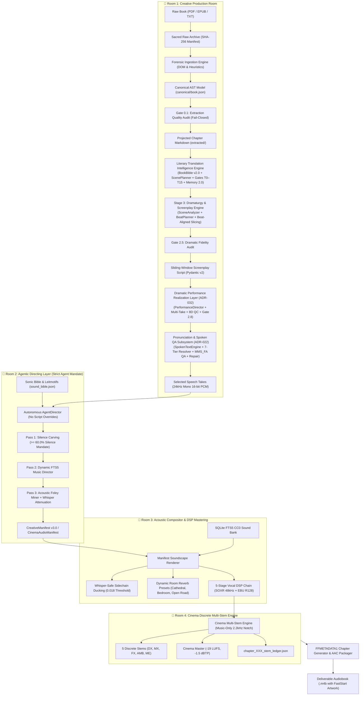

# 🎙️ Audiobook Maker (Audiobook Factory v4.0)

> **Autonomous Studio-Grade Cinematic Audio Drama Production Engine with Multi-Cast Character Attribution, Dynamic BGM Scoring, SQLite FTS5 Foley & Native M4B Packaging.**

[-orange.svg)](https://github.com/naksh-07/audiobook-maker/releases)
[](https://www.python.org/)
[](https://ffmpeg.org/)
[](docs/GEMINI_TTS_SYNTHESIS_AND_DIRECTING.md)
[](docs/VOICE_CASTING_DIRECTOR_GUIDE.md)
[-purple.svg)](docs/AUDIO_ENGINEERING.md)
[-brightgreen.svg)](tests/)
[](LICENSE)

---

## 📖 Overview

**Audiobook Maker v4.0** is an enterprise-grade, autonomous audiobook production system modeled after the high-end multi-track standards of **Audible Drama** and **GraphicAudio ("A Movie in Your Mind")**.

It transforms raw literature (**EPUB, PDF, TXT, Markdown**) into broadcast-ready dramatized audiobooks featuring literary Hindustani translation, multi-voice character casting, surgical mood-matched musical scoring, tactile Foley sound effects, and native chapterized `.m4b` containers.

---

## 🏛️ The 4-Room Audio Drama Architecture



---

### 🔄 The 6-Stage Autonomous Production Pipeline

The architecture orchestrates an end-to-end 6-stage lifecycle from raw document ingestion to mastered M4B packaging:

1. **Stage 1: Forensic Document Ingestion & Canonical AST** ([`docs/FORENSIC_DOCUMENT_INGESTION.md`](file:///c:/Users/Suraj/Documents/Antigravity/Audiobook/docs/FORENSIC_DOCUMENT_INGESTION.md)): Single-pass DOM traversal, layout-aware PDF reading order reconstruction, sacred raw archival, and fail-closed Gate 0.1 extraction audits.
2. **Stage 2: Literary Translation Intelligence & Memory 2.0** ([`docs/LITERARY_TRANSLATION_INTELLIGENCE.md`](file:///c:/Users/Suraj/Documents/Antigravity/Audiobook/docs/LITERARY_TRANSLATION_INTELLIGENCE.md)): Persistent BookBible v2.0, dual semantic maps, contextual Hindustani register, 7D calibrated intensity, World & Character Memory 2.0 epistemic continuity, and Gates T0–T15 certification.
3. **Stage 3: Dramatic Adaptation & Screenplay Engine (v1.1)** ([`docs/DRAMATIC_ADAPTATION_AND_SCREENPLAY.md`](file:///c:/Users/Suraj/Documents/Antigravity/Audiobook/docs/DRAMATIC_ADAPTATION_AND_SCREENPLAY.md)): Transforms flat prose into multi-cast dramatic screenplays via the **Dramaturgy Engine** (`audiobook_factory/dramaturgy/`). Deploys 10 refined dramatic capabilities (Beat Causality 'therefore/but' chaining, Dramatic State Deltas, Relationship Evolution, Power/Epistemic Dynamics, Physical Blocking, Narrative Mode & POV Nuance, Adaptation Fidelity Policy, Long-Range Story Connections, Conversational Dynamics, Dramatic Silence Intent), **Beat-Aligned Chunk Slicing** (`slice_chapter_by_beats`) eliminating the historical 1,200-word cut boundary flaw, `PerformanceBibleGenerator` for sociolect archetypes (`COLD_CYNIC`, `CAUSTIC_ARISTOCRAT`, `THARKI_BARD`), and fail-closed **Gate 2.5 Dramatic Fidelity** 8-pillar validation.
4. **Stage 3.5: Dramatic Performance Realization Layer & Gate 2.8 (ADR-032)** ([`docs/PERFORMANCE_REALIZATION_AND_ACTOR_DIRECTION.md`](file:///c:/Users/Suraj/Documents/Antigravity/Audiobook/docs/PERFORMANCE_REALIZATION_AND_ACTOR_DIRECTION.md)): Bridges Stage 3 dramatic beats into moment-level actor performance directions (`PerformanceDirection`), humanized timing and respiration (`TimingRealizer`), conversational chemistry turn coupling (`ConversationalChemistry`), provider-neutral synthesis with sacred text immutability (`GeminiTTSPerformanceAdapter`), priority-based multi-take banking (`TakeBank`), 8-dimensional acoustic/dramatic evaluation (`PerformanceEvaluator`), non-loudest best take selection (`IntelligentTakeSelector`), and fail-closed pre-mix certification via **Gate 2.8: Dramatic Performance Fidelity Gate**.
5. **Stage 3.8: Pronunciation & Spoken Language QA Subsystem (ADR-022)** ([`docs/PRONUNCIATION_AND_SPOKEN_LANGUAGE_QA.md`](file:///c:/Users/Suraj/Documents/Antigravity/Audiobook/docs/PRONUNCIATION_AND_SPOKEN_LANGUAGE_QA.md)): Decouples sacred literary prose (`ScreenplaySegment.text` strictly immutable) from phonetically resolved TTS payloads (`ScreenplaySegment.spoken_text`). Deploys the Deterministic 7-Tier Resolver, shields neural acting tags (`[whispers]`), executes post-synthesis acoustic QA with Meta MMS_FA CTC alignment, performs targeted single-take repairs with rhythmic micro-pause anchors and atomic WAV promotion, and enforces project-wide cross-chapter consistency (Gate 6E).
6. **Stage 4: Autonomous Directing & Gemini 3.8 Flash Speech Synthesis** ([`docs/GEMINI_TTS_SYNTHESIS_AND_DIRECTING.md`](file:///c:/Users/Suraj/Documents/Antigravity/Audiobook/docs/GEMINI_TTS_SYNTHESIS_AND_DIRECTING.md) & [`docs/VOICE_CASTING_DIRECTOR_GUIDE.md`](file:///c:/Users/Suraj/Documents/Antigravity/Audiobook/docs/VOICE_CASTING_DIRECTOR_GUIDE.md)): Autonomous 3-pass workflow executing $\ge 60\%$ acoustic silence carving, SQLite FTS5 leitmotif music scoring, and bilingual anchor Foley staging. Emits `CreativeManifest v3.0` and dispatches multi-cast speech synthesis via `TTSDispatcher` to `gemini-3.8-flash-tts` with turn-level theatrical style directing, physical inline vocal tags (`<gasp>`, `<sigh>`, `<sob>`), and zero voice drift.
7. **Stage 5: Acoustic Compositor & 5-Track DME Stem Mastering** ([`docs/AUDIO_ENGINEERING.md`](file:///c:/Users/Suraj/Documents/Antigravity/Audiobook/docs/AUDIO_ENGINEERING.md)): Manifest rendering with whisper-safe sidechain ducking (-34.9 dBFS / 0.018 threshold), isolated 2.2kHz spectral notch, dynamic IR reverb, and discrete 5-track DME stem export audited by Gates 5, 5.2, and 5.3.
8. **Stage 6: Master Packaging & M4B Delivery Container** ([`docs/ARCHITECTURE.md`](file:///c:/Users/Suraj/Documents/Antigravity/Audiobook/docs/ARCHITECTURE.md)): Multi-chapter FFMETADATA1 generation, AAC safety auto-transcode, FastStart artwork embedding, and Gate 6A–6E master certification.

---

## ✨ Key Technical Highlights

### 1. Gemini 3.8 Flash Cloud Speech Synthesis & Theatrical Voice Casting
*(See full technical guides: [`docs/GEMINI_TTS_SYNTHESIS_AND_DIRECTING.md`](file:///c:/Users/Suraj/Documents/Antigravity/Audiobook/docs/GEMINI_TTS_SYNTHESIS_AND_DIRECTING.md) and [`docs/VOICE_CASTING_DIRECTOR_GUIDE.md`](file:///c:/Users/Suraj/Documents/Antigravity/Audiobook/docs/VOICE_CASTING_DIRECTOR_GUIDE.md))*
- **Multimodal Generative Speech Modeling:** Powered by **Google Gemini 3.8 Flash TTS** (`models/gemini-3.8-flash-tts`) and **Gemini 3.8 Flash-Lite TTS** (`models/gemini-3.8-flash-lite-tts`). Replaces legacy phonemic text-splicing with an expansive **16,384 audio token output window** (~7–8 minutes of continuous dramatic audio per API invocation).
- **Dual-Channel Theatrical Directing Engine:** Complete physical separation of verbatim dialogue (`text`) from dramatic performance directives (`speechMetadata.style`: tonal pitch, emotional intensity, vocal posture, cultural dialects).
- **Physical Vocal Synthetics:** Native simulation of involuntary human vocal tract phenomena directly in speech text (`<breath>`, `<gasp>`, `<pant>`, `<sigh>`, `<laugh>`, `<sob>`, `<throat-clearing>`, `<short pause>`).
- **Universal Character-to-Voice Matrix:** Invariant acoustic timbre profiling across 30 flagship voices (`Algenib`, `Puck`, `Kore`, `Fenrir`, `Aoede`, `Charon`, `Alnilam`, `Zephyr`, `Achernar`, `Achird`, `Leda`, `Orus`) and 120 dedicated regional Indian personas (`en-IN`) mapped to universal novel archetypes (`COLD_CYNIC`, `THEATRICAL_WIT`, `AUTHORITATIVE_MATRIARCH`, etc.).
- **Zero Voice Drift Hardening (ADR-021):** Deterministic resolution of multi-script character aliases (English and Devanagari) via `character_roster.json` and `voice_registry.json`. Fails closed with zero-tolerance pre-flight sweeps before API dispatch.
- **Quota Intelligence & Concurrency:** Thread-safe `TokenBucketRateLimiter` with organic anti-bot jitter (350ms–850ms) and automatic global pause on HTTP 429 `RetryInfo`. Dedicated key pool routing (`service="text"` vs `service="tts"`) prevents auxiliary LLM calls from depleting scarce 10 RPD Gemini TTS quotas.

### 2. Forensic Literary Ingestion Engine & Canonical AST (Pillar 1 Upgrades)
*(See full technical guide: [`docs/FORENSIC_DOCUMENT_INGESTION.md`](file:///c:/Users/Suraj/Documents/Antigravity/Audiobook/docs/FORENSIC_DOCUMENT_INGESTION.md))*
- **Sacred Raw Archival:** Computes SHA-256 checksum and preserves a bit-for-bit verbatim replica in `raw/source_original.<ext>` with `raw/source_manifest.json` before extraction or normalization occurs.
- **Canonical Pydantic v2 AST:** Constructs a strongly typed document model ([`CanonicalBook`](file:///c:/Users/Suraj/Documents/Antigravity/Audiobook/audiobook_factory/book_model.py#L236-L355) $\rightarrow$ [`CanonicalChapter`](file:///c:/Users/Suraj/Documents/Antigravity/Audiobook/audiobook_factory/book_model.py#L92-L173) $\rightarrow$ [`CanonicalBlock`](file:///c:/Users/Suraj/Documents/Antigravity/Audiobook/audiobook_factory/book_model.py#L76-L90)) serialized to `canonical/book.json`. Preserves sacred raw text alongside normalized speech text and granular block-level forensic provenance ([`SourceProvenance`](file:///c:/Users/Suraj/Documents/Antigravity/Audiobook/audiobook_factory/book_model.py#L54-L74): page, page_end, line_start, line_end, column_index, spine item, HTML tag, anchor ID, character offset, reading order).
- **Non-Destructive Literary Normalizer:** Applies Unicode NFC normalization, zero-width stripping (`\u200b`, `\u200c`, `\u200d`, `\ufeff`, `\u2060`, `\u00ad`), and C0/C1 control code hygiene (`\x00`, `\x07`) strictly on `normalized_text` while leaving `raw_text` unmutated. Heals hyphenated linebreaks across line wraps in Latin, Accented Latin, and Devanagari.
- **PDF Reading Order & XY-Cut Layout Reconstructor:** Geometric span extraction from `pypdf` content streams (`PDFLayoutReconstructor`), baseline horizontal segment merging across gutters, recursive XY-cut multi-column (2-col, 3-col) and spanning banner decomposition, cross-column mid-sentence/hyphenation continuation joining, single-column dialogue/epigraph false-split prevention (`same_row_pairs`, dense column stacks), and whitespace-aligned fallback.
- **End-to-End PDF Provenance Indexing:** Character-accurate `_PDFPageSpanRecord` indexing (`ForensicPDFEngine`) mapping document ranges back to source pages, tracking cross-page mid-sentence paragraph continuations (`page_number` + `page_end`), and lossless forwarding into canonical chapters and blocks.
- **Multi-Signal Escalation Quality Gate:** Evaluates local vs. Gemini multimodal candidates (`PDFQualityAnalyzer`) using composite scoring ($0.40 \times \text{reading\_order} + 0.45 \times \text{text\_integrity} + 0.15 \times \text{sentence\_coherence}$) with hard disqualification guards for conversational LLM refusals, 4-gram repetition loops, replacement char (`\ufffd`) regressions, and prose truncation ($> 45\%$ clean word loss).
- **Literary Chapter vs. Production Chunk Architecture:** Explicitly distinguishes authentic authorial chapters (`unit_type="literary_chapter"`, `is_literary_chapter=True`) from artificial processing chunks (`unit_type="production_chunk"`), tracking `boundary_origin` (`detected_heading`, `toc_navigation`, `inferred_prologue`, `semantic_split_chunk`, `fallback_production_chunk`, `spine_fallback`). Provides `book.get_literary_chapters()` for unified reader TOCs and `book.get_production_chunks()` for execution limits.
- **Meso-Tier Chapter Splitter:** Multi-tier regex heading detection with uppercase dialogue shouting defense, enforcing a **12,000-word chapter ceiling** using a 5-tier semantic splitting hierarchy preserving section subheadings (`###`) and scene breaks (`* * *`).
- **Independent Ingestion Quality Gate (Gate 0.1):** Fail-closed audit evaluating word count floors ($> 50$ words), non-empty chapters ($> 5$ words), suspicious page ratios ($< 25\%$), and fallback chunk telemetry. Emits `canonical/quality_report.json` and raises actionable [`ExtractionGateAuditError`](file:///c:/Users/Suraj/Documents/Antigravity/Audiobook/audiobook_factory/book_model.py#L43-L52) upon `REVIEW` status (bypassable via `--force-gate`).
- **Dual-Layer Legacy Projection:** Deterministically projects canonical chapters into backward-compatible `extracted/chapter_XXX.md` and `metadata.json` for seamless execution across all downstream pipeline stages.

### 3. Literary Translation Intelligence Engine & Multi-Gate Certification (Pillar 2 Upgrade)
*(See full technical guide: [`docs/LITERARY_TRANSLATION_INTELLIGENCE.md`](file:///c:/Users/Suraj/Documents/Antigravity/Audiobook/docs/LITERARY_TRANSLATION_INTELLIGENCE.md))*
- **Persistent Canonical Book Bible (`v2.0.0`) & Entity Discovery:** Single source of truth in `book_bible.json` with deterministic 16-char SHA-256 versioning, novel-agnostic `terminology_variants`, backward-compatible `export_legacy_glossary()`, and stopword-hardened [`EntityDiscoveryEngine`](file:///c:/Users/Suraj/Documents/Antigravity/Audiobook/audiobook_factory/translation/entity_discovery.py) (`confidence >= 0.80` auto-commit).
- **Contextual Hindustani Register (*"Aate mein Namak jitni Urdu"*):** [`HindustaniRegisterEngine`](file:///c:/Users/Suraj/Documents/Antigravity/Audiobook/audiobook_factory/translation/hindustani_register.py) replaces rigid numeric Urdu quotas with organic, genre-adaptive seasoning across 4 lexical categories (`atmosphere_words`, `passion_and_somatics`, `combat_and_grit`, `scholastic_and_courtly`).
- **Universal Character Voice Profiles & 7D Relationship Engine:** 8 novel-agnostic sociolect archetypes ([`character_profile.py`](file:///c:/Users/Suraj/Documents/Antigravity/Audiobook/audiobook_factory/translation/character_profile.py)) paired with [`RelationshipStateEngine`](file:///c:/Users/Suraj/Documents/Antigravity/Audiobook/audiobook_factory/translation/relationship_state.py) to dynamically resolve Hindi pronouns (`आप`, `तुम`, `तू`) across 7 interpersonal dimensions.
- **Transition-Driven Scene Segmentation, Dual Semantic Maps & Semantic Alignment:** [`ScenePlanner`](file:///c:/Users/Suraj/Documents/Antigravity/Audiobook/audiobook_factory/translation/scene_planner.py) segments chapters on genuine temporal/spatial transitions rather than arbitrary character chunks. [`SourceSemanticMap`](file:///c:/Users/Suraj/Documents/Antigravity/Audiobook/audiobook_factory/translation/source_semantic_map.py) extracts atomic propositions (`WHO -> DID WHAT -> TO WHOM -> OBJECT -> NEGATION -> TIME/LOC`) with guaranteed non-empty actions and quotation tracking, aligned beat-to-beat against [`TargetSemanticMap`](file:///c:/Users/Suraj/Documents/Antigravity/Audiobook/audiobook_factory/translation/source_semantic_map.py) via `SemanticAligner` with proportional paragraph mapping, expanded lexical negation parity (including *नहीं, मत, ना, न, बिना, बग़ैर, कभी नहीं, कुछ नहीं, कोई नहीं, इनकार, रोका, मना, नाकाम*), and paragraph-indexed auditing (`affected_paragraphs`).
- **12-Gate Independent Certification (Gates T0–T11), 4-Tier State Machine & Tiered Repair:** [`TranslationCertifier`](file:///c:/Users/Suraj/Documents/Antigravity/Audiobook/audiobook_factory/translation/certification.py) audits word sanity, terminology, negation/semantic fidelity, quote parity/omissions, hallucinated additions, character voice, 7D intensity with calibrated variance ($\pm 0.75$ soft `WARN`, $> 2.0$ hard `FAIL`), and literary naturalness with **Non-Destructive Sanitizer Separation** (preserving authentic rustic greetings like *नमस्ते, राम-राम, दारू* while repairing unambiguous calques like *सुनहरी लड़की, कुंवारी चोटी, डिप्रेशन*). Resolves to `PASS`, `PASS_WITH_WARNINGS`, `AUTO_REPAIR`, `REVIEW_REQUIRED`, or `BLOCKED` with fail-closed gate halting. Self-heals via [`TieredRepairEngine`](file:///c:/Users/Suraj/Documents/Antigravity/Audiobook/audiobook_factory/translation/repair_engine.py) (Level 1 deterministic regex/lexicon $\rightarrow$ Level 2 surgical paragraph rewrite $\rightarrow$ Level 3 scene retranslation) and seals an 11-dimension SHA-256 composite cache key.
- **World & Character Memory 2.0 (Production Hardened & Dual-Audited):** *(See full technical guide: [`docs/WORLD_AND_CHARACTER_MEMORY_2_0.md`](file:///c:/Users/Suraj/Documents/Antigravity/Audiobook/docs/WORLD_AND_CHARACTER_MEMORY_2_0.md))* Pure deterministic event-driven continuity engine (`audiobook_factory/translation/memory/`) separating Hard Canon (`BookBible` immutability) from Dynamic State (`MemoryStore`). Features fail-closed persistence safety with verified `.bak` recovery (`MemoryPersistenceError`), transactional deep snapshot rollback (`model_copy(deep=True)`), epistemic isolation with Strict Event Atomicity (transmitting unpossessed secrets rejected; companion deltas purged on conflict), multi-script Devanagari/Latin Director Supremacy (`has_paren_tag` Unicode protection), narrative-salience retrieval ($\le 800$ tokens budget over 1,000+ events), and downstream acoustic performance guidance into Screenplay segments and Gemini Cloud TTS.

### 4. Pronunciation & Spoken Language QA Subsystem (ADR-022)
*(See full technical guide: [`docs/PRONUNCIATION_AND_SPOKEN_LANGUAGE_QA.md`](file:///c:/Users/Suraj/Documents/Antigravity/Audiobook/docs/PRONUNCIATION_AND_SPOKEN_LANGUAGE_QA.md))*
- **Dual-Layer Text Decoupling:** Complete physical separation of sacred literary prose (`ScreenplaySegment.text`, strictly immutable for subtitles, reading displays, and archival provenance) from phonetically resolved TTS payloads (`ScreenplaySegment.spoken_text` + `pronunciation_metadata`).
- **Unicode-Safe Script & Dialect Classifier:** Analyzes character sets and lexical textures to distinguish Perso-Arabic loanword phonemes (*nukta* consonants like `क़`, `ख़`, `ग़`, `ज़`, `फ़`) from Sanskrit Tatsama conjuncts (`क्ष`, `त्र`, `ज्ञ`, `श्र`) and native Hindi retroflex flaps. Enforces **Option 1A Hybrid Mode** for foreign proper nouns in Hindi dialogue.
- **Deterministic 7-Tier Pronunciation Resolver:** Audits sensitive words across 7 strict tiers: Tier 1 Manual Override $\rightarrow$ Tier 2 Canonical BookBible $\rightarrow$ Tier 3 Verified Project History $\rightarrow$ Tier 4 Canonical Lexicon Entry $\rightarrow$ Tier 5 Deterministic Rules (currency expansion `₹500` $\rightarrow$ `पाँच सौ रुपये`, percentages, Devanagari/Latin numerals up to 100M, compound units `10km` $\rightarrow$ `दस किलोमीटर`, acronym initialisms `FBI` $\rightarrow$ `एफ़.बी.आई.`) $\rightarrow$ Tier 6 Model-Assisted Inference $\rightarrow$ Tier 7 `REVIEW_REQUIRED` (zero silent pass on unknown foreign tokens).
- **Neural Acting Tag Shield:** Regex isolation (`ACTING_TAG_PATTERN`) passes bracketed theatrical performance directives (`[whispers]`, `[gasp]`, `[shouting]`, `[growl]`) through verbatim without phonetic corruption or verbalization.
- **Acoustic Forced Alignment QA & Forensic Telemetry:** Meta MMS_FA CTC alignment on GPU/CPU (with proportional energy valley fallback) computes frame-level start/end spans for sensitive entities. Detects swallowed/omitted tokens ($< \max(60, \text{syllables} \times 45)\text{ms}$), stutter repetitions ($> \max(1200, \text{syllables} \times 350)\text{ms}$), and rushed/dragging cadence anomalies.
- **Targeted Single-Take Repair Engine:** Surgical single-take retry bounded by a strict circuit breaker (max 1 retry), injecting rhythmic acoustic micro-pauses (commas) around omitted tokens and atomically promoting `.tmp.wav` files upon verified audio QA passage.
- **Cross-Chapter Pronunciation Drift Auditor:** Tracks recurring entities across all chapter screenplay scripts, flagging unauthorized phonetic variances (audited at scene level by Gate T15 and fail-closed at master level by Gate 6E).
- **The Golden Pronunciation Regression Bank (20 Cases):** Permanent regression suite (`tests/pronunciation/test_golden_pronunciation_cases.py`) verifying 20 high-difficulty edge cases across 8 linguistic dimensions with 100% precision.

### 5. Multi-Gate Independent Verification Suite (Gates 0.1 - 6E & Gates T0 - T15)
Quality is mathematically audited at every stage of the pipeline:
- **Gate 0.1:** Forensic Document Extraction Quality Gate (Document completeness, word count floor, empty chapter guard, OCR noise ratio $< 25\%$; fails closed on `REVIEW` with `--force-gate` override)
- **Gates T0 – T15:** Literary Translation Intelligence & Spoken Language Certification Suite (Source sanity, BookBible terminology & Latin leak checks, dual semantic map beat alignment & expanded negation parity, quote parity & omission detection, addition detection, character sociolect & pronoun honorifics, 7D calibrated intensity preservation, literary naturalness, Gate T10 Hindustani register balance $0.2\% - 8.0\%$, Gate T12 Spoken Language QA, Gate T13 Pronunciation Plan QA, Gate T14 Pronunciation Audio QA, Gate T15 Cross-Chapter Pronunciation Consistency, 4-tier state machine with fail-closed blocking, and 11-dimension SHA-256 provenance seal)
- **Gate 0:** Source Text & Translation Coverage Parity
- **Gate 1:** Character Voice Casting & Collision Elimination
- **Gate 2:** Screenplay Scripting Schema & Prosody (Pydantic v2)
- **Gate 2.5:** Dramatic Fidelity & Character Arc Validator (8-pillar fail-closed audit across structural integrity, character epistemics/unknown secrets, anti-emotional teleportation, dialogue quote parity, creative overreach, beat causality chains, dramatic state deltas, and adaptation fidelity policy)
- **Gate 2.8:** Dramatic Performance Fidelity Pre-Mix Gate (Pre-mix QC across $\ge 0.70$ composite quality floor, $\ge 0.65$ naturalness, zero emotional teleportation, and sacred text immutability)
- **Gate 3 / 3.5:** Dynamic Manifest Feasibility Guard ($\ge 60\%$ acoustic silence mandate; accepts `CreativeManifest` & director-managed workflows)
- **Gate 4.5:** Master Timeline & Audio Transcript Ledger (Monotonicity and physical chunk validation)
- **Gate 5 / 5.2 / 5.3:** EBU R128 Master (standardized $\pm 1.0\text{ LU}$ tolerance), Dialogue-to-Music Ratio ($\text{DMR} \ge +12\text{ dB}$), and Stereo Phase ($r \ge 0.85$)
- **Gate 6A / 6B / 6C / 6D / 6E:** Cross-Chapter Voice Continuity, Inter-Chapter Loudness Consistency ($\le 1.0\text{ LU}$), TOC Monotonicity, M4B Container Certification, and Gate 6E Cross-Chapter Pronunciation Consistency (Book Master)

### 6. Hollywood-Grade Acoustic DSP Mastering
- **Strict Agent Creative Mandate:** All creative acoustic choices (scoring, leitmotifs, Foley placement, pacing) belong strictly to autonomous agents (`AgentDirector`). Lower engine layers (`CinemaAudioEngine`, `ManifestRenderer`, DSP) are 100% deterministic execution runtimes with zero script overrides.
- **Music-Only 2.2kHz Spectral Notch EQ:** Parametric notch filter ($-5.5\text{ dB}$ at $2,200\text{ Hz}$, $Q=1.5$) is isolated strictly to the Music Bus `[0:a]`, preserving crisp Foley transients and expansive Ambience beds.
- **Whisper Collision Attenuation:** Foley cues triggered during quiet or whispered dialogue segments receive automatic $-6\text{ dBFS}$ attenuation via `attenuate_foley_whisper_collisions`.
- **Whisper-Safe Sidechain Ducking:** Detector calibrated to `0.018` linear (-34.9 dBFS) with $15\text{ ms}$ attack and $350\text{ ms}$ release, smoothly ducking music even during intimate whispers.
- **Dialogue Spatial Soundstage:** Constant-power stereo azimuth panning anchors Narrator dead-center ($pan = 0.0$) while subtly positioning cast characters across the stereo stage, maintaining 100% mono phase compatibility ($r \ge 0.85$).
- **Dynamic Headroom Calibration:** Explosive scenes tighten the limiter to `0.82` with True Peak ceiling `-2.0 dBTP`. Soft whisper scenes calibrate dynamic Loudness Range (`LRA = 6.0 LU`).
- **Auto-Janitor Safety Shield:** Raw WAV chunks are strictly preserved if master rendering or quality verification fails, protecting your API quota.

### 7. Container Reliability & Robust Orchestration
- **M4B AAC Packaging Safety:** Replaced brittle container copy with strict AAC validation (`is_all_aac`). Uncompressed WAV stems (`pcm_s16le`) or non-AAC assets are automatically transcoded to AAC (`-c:a aac -b:a 192k`) with `+faststart` MP4 metadata atom positioning.
- **Dynamic Vocal Track Inference:** Removed hardcoded paths; dynamically discovers vocal stems (`.wav` and `.m4a`) across project directory hierarchies.
- **Regex Chapter Parsing:** Script and audio chunk extraction utilizes robust regex `chapter_(\d+)` patterns, preventing chapter renumbering during partial runs.
- **Fast Zero-Quota PDF Extraction:** Integrated `pypdf>=5.0` for instantaneous local digital PDF parsing, bypassing the 8,192 token window before falling back to multimodal vision.

### 8. Adult Literary Fidelity & HBO/Manto Intimacy Framework (ADR-016 & ADR-019)
- **Unapologetic Raw Hindustani Street Grit & Period Profanity:** Eliminates prudish television euphemisms and sanitized bowdlerization (no more replacing 'bastard' with 'दुष्ट' or 'whore' with 'बुरी स्त्री'). Incorporates authentic, earthy Hindustani curses and dark tavern vitriol (`'गांड'`, `'भोसड़ीके'`, `'लंड'`, `'रांड'`, `'मादरचोद'`, `'बकचोदी'`, `'सूअर का पेशाब'`). Governed by the **19-to-21 Amplification Rule**, elevating mild source prose to visceral Desi impact for gut-punch delivery.
- **The 70/30 Anti-Parody Invariant:** Preserves a sacred **70% Canon Lore / 30% Sensory Desi Amplification** balance. European dark-fantasy mythos, monster classifications (specters, strigas, cursed beasts), and geographic realms remain untampered and un-corrupted; the 30% sensory layer is localized through organic tavern grit, Chambal/UP street idioms, and dynamic honorific power shifts (`तू` $\leftrightarrow$ `माई-बाप / सरकार`) without devolving into comic tapori spoofs.
- **Rule 8 Somatic Intimacy, Dirty Banter & Raw Erotica:** Mandates visceral erotic vocabulary, somatic friction, and bedroom dirty talk (`'लंड'`, `'चूत'`, `'गांड'`, `'चोदना'`, `'मसलना'`, `'तपती कमर'`, `'भीगी प्यास'`, `'बेकाबू सांसें'`) during passionate encounters.
- **The "Nothing Above Source" & "Anti-Cringe" Invariants:** Respects narrative truth—never fabricates explicit sexual acts out of thin air if characters are merely conversing. But when the source contains sexual tension, nudity, or passion, it renders with full Desi heat. Clinical biology-textbook words (`'योनि'`, `'लिंग'`) that sound like hospital autopsy reports remain permanently banned.
- **Permanent Gemini Flash TTS Safety Unlock:** Explicitly passes `safetySettings: [BLOCK_NONE]` across all 4 categories (`HARM_CATEGORY_HARASSMENT`, `HARM_CATEGORY_HATE_SPEECH`, `HARM_CATEGORY_SEXUALLY_EXPLICIT`, `HARM_CATEGORY_DANGEROUS_CONTENT`) in [`tts_dispatcher.py`](file:///c:/Users/Suraj/Documents/Antigravity/Audiobook/audiobook_factory/tts_dispatcher.py), eliminating false-positive censorship blocks while maintaining 100% synthesis success.
- **ASMR Proximity Audio & "The Erotic Silence":** Intimate dialogue lines are staged with dedicated ASMR acoustic parameters: `spatial.proximity: "intimate_close"`, dead-center azimuth `spatial.pan: 0.0`, dynamic intensity `low`, `200-250ms` organic breath pre-roll, and music sidechain attenuation carved down to `-22.0 dB`.
- **Cynical Protagonist Grunt Engine & Duraangi Zubaan:** Encodes weary, cynical protagonist idiolects using signature neural grunts (`[growl] हूँ...`, `[sighs] हम्म...`) paired with `1000-1400ms` pregnant pauses. Models internal vs. external dissonance (*Duraangi Zubaan* inner monologues) via `[whispers] (मन में: ...)` rendered in `binaural_whisper` acoustic environments.
- **Configuration & Backward Compatibility:** Controlled via the `adult_literary_mode: bool = Field(default=True)` configuration flag in [`ProjectConfig`](file:///c:/Users/Suraj/Documents/Antigravity/Audiobook/audiobook_factory/contracts.py) and [`PipelineOrchestrator.run_autonomous_pipeline`](file:///c:/Users/Suraj/Documents/Antigravity/Audiobook/audiobook_factory/orchestrator.py), preserving 100% backward compatibility for standard literature projects.

### 9. Hollywood & AAA-Game Combat Sound Design & Action Acoustics (ADR-017)
- **The 3-Layer Combat Sandwich:** Crafts heart-stopping kinetic strikes across 3 distinct frequency bands:
  - *Layer 1 (Transient Bite):* 2.0 kHz – 7.5 kHz razor-sharp blade clangs, arrow releases, and armor parries.
  - *Layer 2 (Anatomical Body):* 180 Hz – 1.4 kHz visceral flesh lacerations, bone crunches, and heavy body thuds.
  - *Layer 3 (LFE Sub-Thump):* 45 Hz – 85 Hz tuned 52Hz sub-bass solar plexus shockwave.
- **Action-Beat Splitting (Temporal Isolation):** Major kinetic strikes never collide with spoken dialogue. The screenplay builder automatically isolates combat choreography into dedicated 800ms – 1500ms speech-free intervals (`speaker: "Foley"`, `text: "[ACTION]"`).
- **Dual-Perspective Spatial Staging:** Attacker strikes/vocals pan Left ($-0.6$), Defender parries/reactions pan Right ($+0.6$), and Fatal Clashes land Dead Center ($0.0$).
- **Strict Mono Sub-Bass Anchor (< 90Hz):** All LFE drops, warhammer thumps, and blast waves are centered at pan $0.0$ and summed to mono, guaranteeing mean phase correlation $r \ge 0.85$ and zero phase cancellation on mono speakers.
- **Dynamic Ducking & Tinnitus Shockwave:** `PROFILE_COMBAT_SHOCK` ($-24\text{ dB}$ attenuation, $4000\text{ ms}$ release) and `PROFILE_COMBAT` ($-22\text{ dB}$, $250\text{ ms}$ release) in `acoustic_bus_matrix.py`. "The Smother Cut" applies 150–250ms of hard digital silence right before fatal impacts.
- **Staccato Combat Prose & Neural Tags:** Narrative sentences fracture into rapid 2–4 word staccato beats ('कदम पीछे। तलवार का पैंतरा। वार। चूक गया!'), paired with validated neural tags: `[bellowing battlecry]`, `[combat strain]`, `[diaphragm strain]`, `[guttural grunt on blade deflect]`, `[spits blood]`, `[choked gasp]`, `[ragged heaving pant]`, `[slow motion]`.

### 10. Harry Potter / Pottermore Grade 4-Stem Decoupled Scene Acoustics (ADR-018)
- **4-Stem Decoupled Scene Acoustics:** Replaces flat single-loop ambience with 4 distinct stems per scene managed via [`SceneSoundscapeManifest`](file:///c:/Users/Suraj/Documents/Antigravity/Audiobook/audiobook_factory/scene_acoustics.py):
  - *Stem 1 (Base Room Tone):* Architectural cavity resonance ($-34$ to $-36\text{ LUFS}$, stereo width 1.35).
  - *Stem 2 (Weather & Macro World):* Exterior storm, gale, blizzard, or rain ($-30$ to $-32\text{ LUFS}$, stereo width 1.40).
  - *Stem 3 (Crowd & Life Wallah):* Taverns, castle halls, cutlery, murmurs ($-28$ to $-30\text{ LUFS}$, stereo width 1.30).
  - *Stem 4 (Stochastic Spot Transients):* Subtle micro-events ($-22$ to $-26\text{ dBFS}$) triggered in dialogue pauses.
- **Acoustic Barrier Occlusion (< 18kHz):** Dynamic low-pass barrier filter ($1200\text{ Hz} - 1500\text{ Hz}$) naturally muffles exterior weather stems when characters are indoors, sweeping cleanly to $18\text{ kHz}$ upon door open action beats.
- **Zero-Token Local Stochastic Transient Generator:** Procedurally discovers $\ge 600\text{ ms}$ speech pauses from `TimelineLedger`, scattering non-repetitive micro-events (distant owls, candle sparks, floor creaks, ticking clocks) without consuming LLM tokens.
- **Voice Limiter & Priority Stealing:** `filter_concurrency_window` ($200\text{ ms}$ window, max 3 concurrent Foley cues) eliminates transient clutter, collisions, and acoustic mud.
- **Dialogue-to-Masking Ratio (DMR $\ge +10.0$ dB) Validation:** Automated proxy verification in `CinemaAudioEngine` and `StemLedger` guarantees dialogue clarity over the composite background bed.
- **Offline Foley & Magic Composite Asset Baker:** [`scripts/bake_foley_composites.py`](file:///c:/Users/Suraj/Documents/Antigravity/Audiobook/scripts/bake_foley_composites.py) pre-renders multi-phase magic spells (`magic_lumos_light.wav`, `magic_expelliarmus_kinetic.wav`) and tactile props (`tactile_parchment_quill_scratch.wav`), indexing them permanently in SQLite FTS5 for zero-latency retrieval with zero runtime FFmpeg graph bloat.

### 11. Forensic Audit Remediation & Comprehensive Engine Hardening (ADR-020)
Post-integration forensic testing revealed 13 critical edge cases across production pipelines, all mathematically remediated and verified:
- **Contract Deserialization Rehydration:** Added `@model_validator(mode="after")` to [`CreativeManifest`](file:///c:/Users/Suraj/Documents/Antigravity/Audiobook/audiobook_factory/contracts.py) ensuring nested `scene_acoustics` automatically reinstantiates as a [`SceneSoundscapeManifest`](file:///c:/Users/Suraj/Documents/Antigravity/Audiobook/audiobook_factory/scene_acoustics.py) instance upon JSON deserialization.
- **Screenplay Dict Unpacking:** CLI commands and orchestrators unpack dictionary-wrapped scripts (`{"script_version": "2.0", "segments": [...]}`) safely without attribute errors.
- **Defensive TTS Safety & FinishReason Parsing:** Guarded [`tts_dispatcher.py`](file:///c:/Users/Suraj/Documents/Antigravity/Audiobook/audiobook_factory/tts_dispatcher.py) against empty candidate arrays and explicit finish reasons (`SAFETY`, `RECITATION`, `BLOCKLIST`), raising informative `ValueError` with `promptFeedback` context instead of unhandled `IndexError`.
- **Atomic Audio Generation & Verification:** Gemini TTS writes to `.tmp.wav`, validates Signal-to-Noise Ratio (SNR), clipping distortion, and silent DC corruptions, automatically unlinking corrupted files and promoting verified audio atomically via `.replace()`.
- **Text Service Backoff Cooldown:** Extends temporary quota cooldown handling in [`PersistentKeyPool`](file:///c:/Users/Suraj/Documents/Antigravity/Audiobook/audiobook_factory/key_manager.py) to all service routes (`service="text"` and `service="tts"`), eliminating false daily exhaustion exceptions.
- **Dynamic Filter Complex Scripting (>6000 Chars):** Multi-layered ambient scene graphs exceeding 6,000 characters automatically pipe to `-filter_complex_script`, bypassing Windows 8,191-character shell command limit crashes in [`cinema_audio_engine.py`](file:///c:/Users/Suraj/Documents/Antigravity/Audiobook/audiobook_factory/cinema_audio_engine.py).
- **Gate 3.5 & 4.5 Robustness:** Gate 3.5 seamlessly falls back to Sound Bank FTS5 queries when cue asset paths contain file extensions. Gate 4.5 sets a 44-byte WAV header floor for `[ACTION]` and `Foley` pacing segments, preventing zero-audio beats from failing audits.
- **Sanitizer Bracketed Tag Shield:** Strips bracketed tags before evaluating Latin word counts, allowing heavily-tagged combat battlecries (`[bellowing battlecry] [guttural grunt on blade deflect] वार!`) to pass without being discarded as English leakage.
- **Multi-Layer Stochastic Spacing:** Enforces minimum 250ms spacing between Layer 4 ambient spot transients in [`scene_acoustics.py`](file:///c:/Users/Suraj/Documents/Antigravity/Audiobook/audiobook_factory/scene_acoustics.py).
- **FFMETADATA1 Special Character Escaping:** Special characters (`=`, `;`, `#`, `\`) in book titles and chapter markers are escaped cleanly via `_escape_ffmetadata()` in [`packager.py`](file:///c:/Users/Suraj/Documents/Antigravity/Audiobook/audiobook_factory/packager.py).
- **CLI Segment Take Deduplication:** Prevents multiple takes per segment index from being concatenated into final chapter masters in `audiobook_cli.py`.

### 12. Zero-Voice-Drift Hardening & Deterministic Speaker Attribution (ADR-021)
Production testing of complex multi-character dialogical exchanges revealed subtle risks of characters drifting into Narrator voice assignments. ADR-021 establishes strict deterministic attribution:
- **Fail-Closed Unregistered Speaker Protection:** In [`tts_dispatcher.py`](file:///c:/Users/Suraj/Documents/Antigravity/Audiobook/audiobook_factory/tts_dispatcher.py), dialogue segments requesting an unregistered speaker raise a typed `UnregisteredSpeakerError` with fuzzy match suggestions (`Did you mean: ...?`). Silent fallback to `Aoede` (Narrator) is strictly prohibited.
- **Dynamic Character Roster & Voice Registry Auto-Discovery:** `TTSDispatcher` automatically loads and parses `character_roster.json` and `voice_registry.json`, dynamically mapping aliases (English, Devanagari, underscore, and space variations) directly to canonical voice models (`Charon`, `Kore`, `Puck`, `Fenrir`).
- **Pre-Flight Chapter Voice Validation:** `TTSDispatcher.synthesize_chapter_script()` executes a zero-cost dry-run pre-flight validation pass across all dialogue segments before initiating any external API calls, halting immediately if an unmapped speaker is detected.
- **Gate 2 Whitelist Enforcement:** [`audit_gate2_script()`](file:///c:/Users/Suraj/Documents/Antigravity/Audiobook/audiobook_factory/gate_auditor.py) auto-discovers project catalogs and validates speaker keys against the canonical whitelist, failing early before synthesis starts.
- **Gate 1 Acoustic Gender Alignment:** [`audit_gate1_roster()`](file:///c:/Users/Suraj/Documents/Antigravity/Audiobook/audiobook_factory/gate_auditor.py) verifies persona gender alignment, generating warnings if male characters are assigned female voice personas or vice versa.
- **Two-Pass Screenplay Pronoun & Alias Normalization:** [`clean_screenplay_pass2()`](file:///c:/Users/Suraj/Documents/Antigravity/Audiobook/audiobook_factory/script_builder.py) disambiguates conversational pronouns in both English (`he`, `she`, `the man`, `the woman`) and Hindi (`उसने`, `वह`, `आदमी`, `लड़की`, `महिला`), and strips parenthetical actor annotations (e.g. `Geralt (Witcher)` $\rightarrow$ `Geralt`).

### 13. Audio Drama Timeline Sync, Bilingual Foley Staging & Soundscape Partitioning (ADR-022)
Elimates timeline drift, Foley placement anomalies, and acoustic masking across full-novel productions:
- **Cumulative Timeline Drift Elimination:** Standardized `pre_roll_breath_ms` across contracts ([`TimelineSegment`](file:///c:/Users/Suraj/Documents/Antigravity/Audiobook/audiobook_factory/contracts.py)), ledger ([`timeline_ledger.py`](file:///c:/Users/Suraj/Documents/Antigravity/Audiobook/audiobook_factory/timeline_ledger.py)), and director ([`agent_director.py`](file:///c:/Users/Suraj/Documents/Antigravity/Audiobook/audiobook_factory/agent_director.py)). Breath intakes are fully synchronized (`start_ms = curr_t_ms + pre_breath`), eradicating cumulative timeline skew across hundreds of dialogue lines.
- **Zero Dead-Center Foley Trap & Bilingual Anchor Mapping:** Replaced rigid 50% midpoint offsets in [`_compute_word_level_offset()`](file:///c:/Users/Suraj/Documents/Antigravity/Audiobook/audiobook_factory/agent_director.py) with comprehensive bilingual synonym expansion (`BILINGUAL_ANCHOR_MAP`). Unmatched preparatory actions land early ($\sim 15\%$), while physical impacts land on climax windows ($\sim 75\%$), eliminating dead-center sound effect placement.
- **Domestic Tableware vs. Combat Weaponry Taxonomy Isolation:** Universal Category System (UCS) lookup in [`acoustic_bus_matrix.py`](file:///c:/Users/Suraj/Documents/Antigravity/Audiobook/audiobook_factory/acoustic_bus_matrix.py) isolates domestic dining (`DOMETabl`: plate, dish, bowl, spoon, tableware, थाली, कटोरा) and anatomical gore (`GOREAnat`: bone, cartilage, हड्डी) from weaponry (`WEAPSwd`), strictly prohibiting combat sword clashes during banquet dining scenes.
- **Scene-Bound BGM Underscore:** Upgraded Pass 2 Music Director in [`agent_director.py`](file:///c:/Users/Suraj/Documents/Antigravity/Audiobook/audiobook_factory/agent_director.py) to support `until_segment` duration calculation, allowing musical cues to span full narrative scenes (25s to 240s) rather than arbitrary 30s chops, bounded by a strict 40% chapter music budget.
- **Dynamic Multi-Scene Ambience Bed Partitioning:** In [`_partition_script_ambience_scenes()`](file:///c:/Users/Suraj/Documents/Antigravity/Audiobook/audiobook_factory/agent_director.py), shifts in screenplay `acoustic_env` (e.g. Castle Bath $\rightarrow$ Royal Banquet Hall $\rightarrow$ Dense Forest Night) automatically partition chapters into distinct acoustic environments, replacing flat 106-minute monolithic ambience loops.

---

## 📚 Complete Documentation Hub

| Document | Description |
|---|---|
| **[📜 Forensic Literary Ingestion (Pillar 1)](docs/FORENSIC_DOCUMENT_INGESTION.md)** | Authoritative guide to the CanonicalBook AST, sacred raw archival, structural EPUB/PDF engines, and Gate 0.1 extraction audits. |
| **[🧠 Literary Translation Intelligence (Pillar 2)](docs/LITERARY_TRANSLATION_INTELLIGENCE.md)** | Complete guide to BookBible v2.0, Contextual Hindustani Register, 7D Relationship & Intensity models, Gates T0–T11, Tiered Repair, and Memory 2.0. |
| **[🎭 Dramatic Adaptation & Screenplay (Stage 3)](docs/DRAMATIC_ADAPTATION_AND_SCREENPLAY.md)** | Deep dive into the Stage 3 Dramaturgy Engine, SceneAnalyzer, BeatPlanner, beat-aligned chunk slicing, Performance Bible, and Gate 2.5 fidelity audits. |
| **[🎭 Performance Realization & Gate 2.8](docs/PERFORMANCE_REALIZATION_AND_ACTOR_DIRECTION.md)** | Authoritative guide to moment-level actor performance directions, multi-take banking, 8D acoustic evaluation, and Gate 2.8 pre-mix verification. |
| **[🗣️ Pronunciation & Spoken QA (ADR-022)](docs/PRONUNCIATION_AND_SPOKEN_LANGUAGE_QA.md)** | Complete architectural guide to dual-layer text decoupling, 7-tier resolution, MMS_FA CTC acoustic alignment, single-take repairs, and Gate 6E cross-chapter drift audits. |
| **[🏛️ Architecture Blueprint](docs/ARCHITECTURE.md)** | In-depth breakdown of the 4 rooms, 5 stems, 10 metadata bridges, Adult Literary Mode pipeline integration, and strict agent creative mandate. |
| **[🎬 Cinematic Sound Design & Adult Fidelity](docs/CINEMATIC_SOUND_DESIGN_AND_ADULT_FIDELITY.md)** | Authoritative guide to Hollywood 3-layer combat design (ADR-017), Pottermore 4-stem decoupled scene acoustics (ADR-018), and unfiltered adult intimacy (ADR-019). |
| **[🎓 End-to-End Tutorial & Cookbook](docs/TUTORIAL_E2E.md)** | Step-by-step recipes: 1-click runs, English audio drama, manual directing, quota resume, and DAW stems. |
| **[💻 CLI Reference](docs/CLI_REFERENCE.md)** | Full command reference for all 17 autonomous and modular production commands. |
| **[📚 API Reference](docs/API_REFERENCE.md)** | Pydantic v2 data models, public engine classes, Translation Intelligence contracts, and method signatures across 60+ modules. |
| **[🎛️ Audio Engineering & DSP](docs/AUDIO_ENGINEERING.md)** | EBU R128 mastering, music-only 2.2kHz notch, whisper ducking, barrier occlusion, dynamic filter scripts, and reverb. |
| **[🛡️ Quality Gates Manual](docs/QUALITY_GATES.md)** | Complete specification of Gates 0.1 through 6E and Translation Gates T0 through T15, thresholds, and CLI audit syntax. |
| **[🛡️ Audit Remediation & Hardening](docs/AUDIT_REMEDIATION_AND_HARDENING.md)** | Comprehensive engineering report on P0-P3 fixes and all 13 ADR-020 forensic audit remediations. |
| **[🎹 Sound Bank & Asset Catalog](docs/SOUND_BANK.md)** | SQLite FTS5 database schema, Sonic Genome indexing, UCS categories, and cloud CC0 seeding. |
| **[🤖 AI Agent & MCP Integration](docs/MCP_AGENT_INTEGRATION.md)** | Autonomous agent workflows, Agent Skills (`novel-audiobook-factory`, `audio-engineer-ffmpeg`), and MCP tools. |
| **[🛠️ Developer Guide](docs/DEVELOPER_GUIDE.md)** | Development environment setup, testing standards, and contribution guide. |

---

## 🚀 Quick Start

### 1. Requirements
- Python 3.10+
- FFmpeg 6.0+ (compiled with `libsoxr` and `aac` support)
- `pypdf>=5.0` (bundled dependency for fast, zero-quota digital PDF extraction)

### 2. Installation
```bash
git clone https://github.com/naksh-07/audiobook-maker.git
cd audiobook-maker
pip install -e .
```

### 3. Configuration
Copy the configuration template:
```bash
cp .env.example .env
```
Edit `.env` to provide your Gemini API key:
```env
GEMINI_API_KEY=your_gemini_api_key_here
TTS_PRIMARY_BACKEND=gemini_tts
GEMINI_TTS_MODEL=gemini-3.1-flash-tts-preview
GEMINI_DEFAULT_VOICE=Aoede
```

---

## 🛠️ Basic Usage

### 🚀 Autonomous 1-Click Production
Transform any EPUB or PDF novel into a fully dramatized, mastered `.m4b` audiobook:
```bash
python audiobook_cli.py auto books/my_novel.epub \
  --hindi \
  --dramatized \
  --voice Charon \
  --cover covers/cover.jpg \
  --workers 3
```

### 🛡️ Quality Audit Any Project
```bash
# Verify all quality gates across an entire book project
python audiobook_cli.py audit-book audiobooks/projects/my_novel

# Audit a specific chapter
python audiobook_cli.py audit my_novel --chapter 1
```

### 🎹 Manage the SQLite Sound Bank
```bash
# Ingest local audio assets into Sound Bank
python audiobook_cli.py bank ingest path/to/sound_assets/ --workers 4

# Search sound catalog
python audiobook_cli.py bank search "battle drums tension" --limit 5

# Check database statistics
python audiobook_cli.py bank stats
```

---

## 🧪 Verification & Test Suite

The codebase maintains **443 passed unit tests (100% green)** across all test suites with a zero-regression, multi-script zero-hardcoding invariant (443/443 passed, 0 failures, 0 errors):

```powershell
# Run full regression suite across all test suites (443 tests)
pytest tests/
python -m unittest discover tests -p "test_*.py"

# Run Dramatic Performance Realization & Gate 2.8 suite (23 tests, ADR-032)
pytest tests/test_performance_realization.py -v

# Run Stage 3 Dramaturgy, Beat Planner & Dramatic Fidelity suites (7 test suites)
pytest tests/dramaturgy/ -v

# Run Crucial Benchmark Proof & 10 Golden Scenes suite
pytest tests/dramaturgy/test_golden_scenes.py -v

# Run World + Character Memory 2.0 test suites (7 test suites)
python -m unittest discover tests/translation/memory -p "test_*.py"

# Run Literary Translation Intelligence & Memory 2.0 suites (Pillar 2)
python -m unittest discover tests/translation -p "test_*.py"

# Run Multi-Script (Latin + Devanagari) Zero-Hardcoding AST Contract suite
python -m unittest tests/test_zero_hardcoding_contracts.py

# Run Zero-Voice-Drift Hardening & Speaker Attribution suite (ADR-021)
python -m unittest tests/test_zero_voice_drift_adr021.py

# Run Audio Drama Sync, Foley Staging & Soundscape Remediation suite (ADR-022)
python -m unittest tests/test_audio_sync_and_soundscape_remediation.py
```

---

## 🤝 Contributing

We welcome contributions! Please review our [Contributing Guidelines](CONTRIBUTING.md) and [Developer Guide](docs/DEVELOPER_GUIDE.md) for details on engineering standards and pull requests.

---

## 📜 License

Distributed under the **MIT License**. See [LICENSE](LICENSE) for details.

Developed with ❤️ by **[Suraj (naksh-07)](https://github.com/naksh-07)**.
