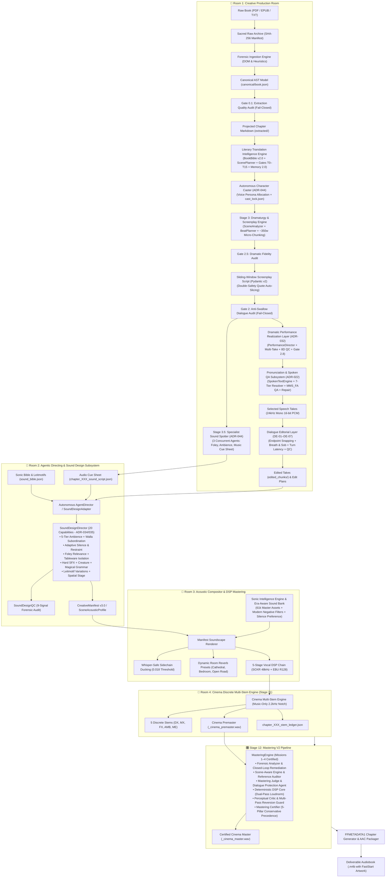

# 🎙️ Audiobook Maker (Audiobook Factory v4.0)

> **Autonomous Studio-Grade Cinematic Audio Drama Production Engine with Multi-Cast Character Attribution, Dynamic BGM Scoring, SQLite FTS5 Foley & Native M4B Packaging.**

[-orange.svg)](https://github.com/naksh-07/audiobook-maker/releases)
[](https://www.python.org/)
[](https://ffmpeg.org/)
[](docs/GEMINI_TTS_SYNTHESIS_AND_DIRECTING.md)
[](docs/VOICE_CASTING_DIRECTOR_GUIDE.md)
[-purple.svg)](docs/AUDIO_ENGINEERING.md)
[-brightgreen.svg)](tests/)
[-blue.svg)](docs/TTS_GENERATION_ARCHITECTURE.md)
[-purple.svg)](docs/CINEMATIC_SOUND_DESIGN_SUBSYSTEM.md)
[](LICENSE)

---

## 📖 Overview

**Audiobook Maker v4.0** is an enterprise-grade, autonomous audiobook production system modeled after the high-end multi-track standards of **Audible Drama** and **GraphicAudio ("A Movie in Your Mind")**.

It transforms raw literature (**EPUB, PDF, TXT, Markdown**) into broadcast-ready dramatized audiobooks featuring literary Hindustani translation, multi-voice character casting, surgical mood-matched musical scoring, tactile Foley sound effects, and native chapterized `.m4b` containers.

---

## 🏛️ The 4-Room Audio Drama Architecture


```mermaid
flowchart TD
    subgraph Room1["🚪 Room 1: Creative Production Room"]
        Book["Raw Book (PDF / EPUB / TXT)"] --> RawArchive["Sacred Raw Archive (SHA-256 Manifest)"]
        RawArchive --> Extractor["Forensic Ingestion Engine (DOM & Heuristics)"]
        Extractor --> AST["Canonical AST Model (canonical/book.json)"]
        Gate01["Gate 0.1: Extraction Quality Audit (Fail-Closed)"]
        AST --> Gate01
        Gate01 --> Chapters["Projected Chapter Markdown (extracted/)"]
        Chapters --> Translator["Literary Translation Intelligence Engine<br/>(BookBible v2.0 + ScenePlanner + Gates T0–T15 + Memory 2.0)"]
        Translator --> CharacterCaster["Autonomous Character Caster (ADR-044)<br/>(Voice Persona Allocation + cast_lock.json)"]
        CharacterCaster --> Dramaturgy["Stage 3: Dramaturgy & Screenplay Engine<br/>(SceneAnalyzer + BeatPlanner + ~350w Micro-Chunking)"]
        Dramaturgy --> Gate25["Gate 2.5: Dramatic Fidelity Audit"]
        Gate25 --> ScriptBuilder["Sliding-Window Screenplay Script (Pydantic v2)<br/>(Double-Safety Quote Auto-Slicing)"]
        ScriptBuilder --> Gate2["Gate 2: Anti-Swallow Dialogue Audit (Fail-Closed)"]
        Gate2 --> SoundSpotter["Stage 3.5: Specialist Sound Spotter (ADR-044)<br/>(3 Concurrent Agents: Foley, Ambience, Music Cue Sheet)"]
        Gate2 --> PerfRealization["Dramatic Performance Realization Layer (ADR-032)<br/>(PerformanceDirector + Multi-Take + 8D QC + Gate 2.8)"]
        PerfRealization --> PronunciationQA["Pronunciation & Spoken QA Subsystem (ADR-022)<br/>(SpokenTextEngine + 7-Tier Resolver + MMS_FA QA + Repair)"]
        PronunciationQA --> AudioChunks["Selected Speech Takes (24kHz Mono 16-bit PCM)"]
        AudioChunks --> Editorial["Dialogue Editorial Layer (DE-01–DE-07)<br/>(Endpoint Snapping + Breath & Sob + Turn Latency + QC)"]
        Editorial --> EditedChunks["Edited Takes (edited_chunks/) & Edit Plans"]
    end

    subgraph Room2["🚪 Room 2: Agentic Directing & Sound Design Subsystem"]
        SoundSpotter --> CueSheet["Audio Cue Sheet (chapter_XXX_sound_script.json)"]
        Bible["Sonic Bible & Leitmotifs (sound_bible.json)"] --> Director["Autonomous AgentDirector / SoundDesignAdapter"]
        CueSheet --> Director
        EditedChunks --> Director
        Director --> SoundDirector["SoundDesignDirector (20 Capabilities - ADR-034/035)<br/>• 5-Tier Ambience + Walla Subordination<br/>• Adaptive Silence & Restraint<br/>• Foley Relevance + Tableware Isolation<br/>• Hard SFX + Creature + Magical Grammar<br/>• Leitmotif Variations + Spatial Stage"]
        SoundDirector --> QCReport["SoundDesignQC (9-Signal Forensic Audit)"]
        SoundDirector --> Manifest["CreativeManifest v3.0 / SceneAcousticProfile"]
    end

    subgraph Room3["🚪 Room 3: Acoustic Compositor & DSP Mastering"]
        Manifest --> Renderer["Manifest Soundscape Renderer"]
        SoundBank["Sonic Intelligence Engine & Era-Aware Sound Bank<br/>(61k Master Assets + Modern Negative Filters + Silence Preference)"] --> Renderer
        Renderer --> Ducking["Whisper-Safe Sidechain Ducking (0.018 Threshold)"]
        Renderer --> Reverb["Dynamic Room Reverb Presets (Cathedral, Bedroom, Open Road)"]
        Renderer --> VocalDSP["5-Stage Vocal DSP Chain (SOXR 48kHz + EBU R128)"]
    end

    subgraph Room4["🚪 Room 4: Cinema Discrete Multi-Stem Engine (Stage 11)"]
        VocalDSP --> CinemaEngine["Cinema Multi-Stem Engine (Music-Only 2.2kHz Notch)"]
        CinemaEngine --> Stems["5 Discrete Stems (DX, MX, FX, AMB, ME)"]
        CinemaEngine --> Premaster["Cinema Premaster (_cinema_premaster.wav)"]
        CinemaEngine --> Ledger["chapter_XXX_stem_ledger.json"]
    end

    subgraph Room5["🎛️ Stage 12: Mastering V2 Pipeline"]
        Premaster --> MasterEngine["MasteringEngine (Missions 1–4 Certified)<br/>• Forensic Analyzer & Closed-Loop Remediation<br/>• Scene-Aware Engine & Reference Auditor<br/>• Mastering Judge & Dialogue Protection Agent<br/>• Deterministic DSP Core (Dual-Pass Loudnorm)<br/>• Perceptual Critic & Multi-Pass Reversion Guard<br/>• Mastering Certifier (5-Pillar Conservative Precedence)"]
        MasterEngine --> FullMaster["Certified Cinema Master (_cinema_master.wav)"]
    end

    Room4 --> Room5
    Room5 --> Packager["FFMETADATA1 Chapter Generator & AAC Packager"]
    Packager --> M4B["Deliverable Audiobook (.m4b with FastStart Artwork)"]
```

---

### 🔄 The Autonomous Production Pipeline Lifecycle

The architecture orchestrates an end-to-end multi-stage lifecycle from raw document ingestion to mastered M4B packaging:

1. **Stage 1: Forensic Document Ingestion & Canonical AST** ([`docs/FORENSIC_DOCUMENT_INGESTION.md`](file:///c:/Users/Suraj/Documents/Antigravity/Audiobook/docs/FORENSIC_DOCUMENT_INGESTION.md)): Single-pass DOM traversal, layout-aware PDF reading order reconstruction, sacred raw archival, and fail-closed Gate 0.1 extraction audits.
2. **Stage 2: Literary Translation Intelligence & Memory 2.0 (ADR-045)** ([`docs/LITERARY_TRANSLATION_INTELLIGENCE.md`](file:///c:/Users/Suraj/Documents/Antigravity/Audiobook/docs/LITERARY_TRANSLATION_INTELLIGENCE.md)): Persistent BookBible v2.0, **3 Concurrent Specialist Discovery Agents** (`Character Lexicographer`, `Sociolect Dramaturge`, `World Lore Translator` via `ThreadPoolExecutor`), **Context-Calibrated Scene Prompt Routing** (`COMBAT`, `INTIMATE`, `DIALOGUE`, `LORE`), contextual Hindustani register, 7D calibrated intensity, World & Character Memory 2.0 epistemic continuity, and Gates T0–T15 certification.
3. **Stage 2.9: Autonomous Character Caster & Voice Lock (ADR-044)** ([`docs/VOICE_CASTING_DIRECTOR_GUIDE.md`](file:///c:/Users/Suraj/Documents/Antigravity/Audiobook/docs/VOICE_CASTING_DIRECTOR_GUIDE.md)): Pre-production book-wide character discovery scanning chapter texts to assign unique, non-colliding Gemini voice models (`Puck`, `Fenrir`, `Charon`, `Kore`, `Aoede`, etc.) into `character_roster.json` and `cast_lock.json`.
4. **Stage 3: Dramaturgy & Decoupled Two-Pass Screenplay Engine (ADR-045)** ([`docs/DRAMATIC_ADAPTATION_AND_SCREENPLAY.md`](file:///c:/Users/Suraj/Documents/Antigravity/Audiobook/docs/DRAMATIC_ADAPTATION_AND_SCREENPLAY.md)): Authentic dramatic comprehension (`SceneAnalyzer` + `BeatPlanner` with canned heuristic templates purged), **~350-word micro-chunking** on beat boundaries, **Two-Pass Decoupled Screenplay Parser** (*Pass 1*: Pure dialogue isolation, character attribution & vocal tags; *Pass 2*: Stanislavski subtext, actioning verbs, dynamic headroom intensity & stereo azimuth panning), deterministic double-safety quote auto-slicing in `clean_screenplay_pass2`, and fail-closed **Gate 2 Anti-Swallow Dialogue Audit** (rejection of quotation marks in narration) alongside Gate 2.5 Dramatic Fidelity Audit.
5. **Stage 3.5: Specialist Multi-Agent Sound Spotting Engine (ADR-044 & ADR-045)** ([`docs/CINEMATIC_SOUND_DESIGN_SUBSYSTEM.md`](file:///c:/Users/Suraj/Documents/Antigravity/Audiobook/docs/CINEMATIC_SOUND_DESIGN_SUBSYSTEM.md)): Decoupled acoustic spotting leveraging the 100+ rotating API key pool without prompt bloat. 3 parallel specialist LLM agents (Foley & Prop Spotter, Ambience Bed Designer, Music Scoring Director) synthesize `chapter_XXX_sound_script.json` (Audio Cue Sheet) ingested directly into `CreativeManifest`. Purged all 4-word domestic Foley regex guessing in `AgentDirector`.
6. **Stage 3.6: Dramatic Performance Realization Layer & Studio Performance QC 2.0 (ADR-032 / ADR-024)** ([`docs/PERFORMANCE_REALIZATION_AND_ACTOR_DIRECTION.md`](file:///c:/Users/Suraj/Documents/Antigravity/Audiobook/docs/PERFORMANCE_REALIZATION_AND_ACTOR_DIRECTION.md) & [`docs/TTS_GENERATION_ARCHITECTURE.md`](file:///c:/Users/Suraj/Documents/Antigravity/Audiobook/docs/TTS_GENERATION_ARCHITECTURE.md)): Bridges Stage 3 dramatic beats into moment-level actor performance directions (`PerformanceDirection`), humanized timing and respiration (`TimingRealizer`), provider-neutral synthesis with sacred text immutability (`GeminiTTSPerformanceAdapter`), priority-based multi-take banking (`TakeBank`), **Forced Alignment 2.0** with frame-accurate MMS_FA CTC word token spans and 7 pause classes (`WorkstationForcedAligner`), **Performance Evaluator 2.0** with autocorrelation F0 tracking, crest dynamic range, monotonic pitch-lock detection, and restraint enforcement (`PerformanceEvaluator`), **Hierarchical Evidence Fusion 2.0** with an 8-layer stack and fail-closed technical/alignment/drift layers (`EvidenceFusionEngine`), **Auxiliary Perceptual Judging** (`PerceptualPerformanceJudge`), **Take Selection 2.0** with authoritative `NO_ACCEPTABLE_TAKE` decision policies, 6-mode contextual scoring, pairwise judicial deliberation (`PairwiseTakeJudge`), and explainable reason codes (`TakeSelectionResult`), **Whole-Scene Arc Selection** (`select_scene_takes`), conversational chemistry turn coupling (`ConversationalChemistry`), character pace continuity tracking (`PerformanceContinuityTracker`), 18-category golden benchmarks, genuine human calibration ($r, \rho$, FAR, FRR), and fail-closed pre-mix certification via **Gate 2.8: Dramatic Performance Fidelity Gate**.
7. **Stage 3.8: Pronunciation & Spoken Language QA Subsystem (ADR-022)** ([`docs/PRONUNCIATION_AND_SPOKEN_LANGUAGE_QA.md`](file:///c:/Users/Suraj/Documents/Antigravity/Audiobook/docs/PRONUNCIATION_AND_SPOKEN_LANGUAGE_QA.md)): Decouples sacred literary prose (`ScreenplaySegment.text` strictly immutable) from phonetically resolved TTS payloads (`ScreenplaySegment.spoken_text`). Deploys the Deterministic 7-Tier Resolver, shields neural acting tags (`[whispers]`), executes post-synthesis acoustic QA with Meta MMS_FA CTC alignment, performs targeted single-take repairs with rhythmic micro-pause anchors and atomic WAV promotion, and enforces project-wide cross-chapter consistency (Gate 6E).
8. **Stage 3.9: Dialogue Editorial Layer (DE-01 through DE-07)** ([`docs/DIALOGUE_EDITORIAL_LAYER.md`](file:///c:/Users/Suraj/Documents/Antigravity/Audiobook/docs/DIALOGUE_EDITORIAL_LAYER.md)): Bridges individual speech takes into a seamless, organic dramatic performance. Ingests raw takes from `audio_chunks/` non-destructively to `edited_chunks/` using intelligent endpoint trimming (sub-millisecond zero-crossing snapping, speech floor to -52 dBFS, stop plosive burst protection), conservative breath evaluation (KEEP/REDUCE/REMOVE) with suppressed sob safeguards (`restraint >= 0.85`), dynamic contextual turn latencies (25ms interruption floor to 1800ms emotional freeze), em-dash tragic aposiopesis preservation, power-dynamic turn pacing, multi-format loading (16/24/32-bit), true Hann micro-fades, deterministic TPDF dither, and fail-closed QC (`DialogueEditingQC`) with unedited raw fallback.
9. **Stage 4: Autonomous Directing & Gemini 3.8 Flash Speech Synthesis** ([`docs/GEMINI_TTS_SYNTHESIS_AND_DIRECTING.md`](file:///c:/Users/Suraj/Documents/Antigravity/Audiobook/docs/GEMINI_TTS_SYNTHESIS_AND_DIRECTING.md) & [`docs/VOICE_CASTING_DIRECTOR_GUIDE.md`](file:///c:/Users/Suraj/Documents/Antigravity/Audiobook/docs/VOICE_CASTING_DIRECTOR_GUIDE.md)): Prioritizes `chapter_XXX_sound_script.json` directly into `CreativeManifest v3.0`, executes SQLite FTS5 leitmotif music scoring and bilingual anchor Foley staging with modern-era negative filtering. Dispatches multi-cast speech synthesis via `TTSDispatcher` to `gemini-3.8-flash-tts` with turn-level theatrical style directing, physical inline vocal tags (`<gasp>`, `<sigh>`, `<sob>`), and zero voice drift.
10. **Stage 4.5 / Stage 10: Commercial Cinematic Sound Design Subsystem (ADR-034 & ADR-035)** ([`docs/CINEMATIC_SOUND_DESIGN_SUBSYSTEM.md`](file:///c:/Users/Suraj/Documents/Antigravity/Audiobook/docs/CINEMATIC_SOUND_DESIGN_SUBSYSTEM.md)): Deploys the 20-capability audio drama engine (`audiobook_factory/sound_design/`). Features 5-tier decoupled ambience with cross-scene loop continuity, subordinated crowd walla with solitary restraint, intentional negative sound design with scene-dependent adaptive density budgets, multi-factor Foley relevance scoring with blanket trivial verb suppression, character locomotion physics and domestic tableware vs. weapon clash isolation, transient-body-LFE narrative hard SFX, canonical magical spell grammar (`CHARGE -> RELEASE -> IMPACT`), dynamic leitmotif variation across 6 narrative modes, virtual soundstage spatial continuity (azimuth $[-0.8, +0.8]$, narrator locked to $0.0$), and multi-signal 9-pillar QC auditing (`SoundDesignQCAuditor`) connected via clean adapter boundary (`SoundDesignAdapter`).
11. **Stage 11: Cinematic Mix v2 (Prompts 1–5 Certified)** ([`docs/CINEMATIC_MIX_ARCHITECTURE.md`](file:///c:/Users/Suraj/Documents/Antigravity/Audiobook/docs/CINEMATIC_MIX_ARCHITECTURE.md)): Transforms static bus rendering into an intelligent cinematic mixing layer. Governed by typed `SceneMixIntent` and `AttentionMap`, unified `MixAutomation` timeline (Hierarchy Levels 10–50), formant-targeted dynamic masking (`MAX_NOTCH_DEPTH_DB = -6.5 dB`), stem interaction matrices, three behavioral directors (`PerspectiveDirector`, `SilenceDirector`, `ImpactDirector`), a 12-category multi-signal `MixJudge` evaluating physical audio integrity (True Peak $\le 0.0\text{ dBTP}$, SciPy Butterworth vocal corridor DMR, phase correlation), bounded remediation loop (`RemixController`, max 2 attempts, $\Delta S \ge 0.04$ convergence guard), in-memory stat-based analysis caching, and 20-scenario Golden Regression Suite certification. Produces unmastered `CINEMATIC_MIX_PREMASTER` (`_cinema_premaster.wav`).
12. **Stage 12: Mastering V2 Pipeline & Delivery Packaging (Missions 1–4 Certified)** ([`docs/AUDIO_ENGINEERING.md`](file:///c:/Users/Suraj/Documents/Antigravity/Audiobook/docs/AUDIO_ENGINEERING.md)): Decouples premaster boundary (`_cinema_premaster.wav`), deploys 4-stage deterministic DSP core (subsonic HPF, dual-pass linear-phase loudnorm, true-peak lookahead limiter, SOXR sinc dither), closed-loop forensic remediation, P1 intelligence (`MasteringJudge` with 7 defect categories, `DialogueProtectionAgent`, `BookMasterProfile`, `ChapterConsistencyAuditor`), P4 perceptual premium layer (`PerceptualCritic` across 7 aesthetic axes, `ReferenceMasteringAuditor` across 7 canonical profiles, `SceneAwareDecisionEngine` dynamics protection, multi-pass snapshot reversion guard, and 5-pillar conservative `MasteringCertifier`), followed by AAC safety packaging with FastStart artwork.

---

## ✨ Key Technical Highlights

### 1. Gemini 3.8 Flash Cloud Speech Synthesis & Theatrical Voice Casting
*(See full technical guides: [`docs/GEMINI_TTS_SYNTHESIS_AND_DIRECTING.md`](file:///c:/Users/Suraj/Documents/Antigravity/Audiobook/docs/GEMINI_TTS_SYNTHESIS_AND_DIRECTING.md) and [`docs/VOICE_CASTING_DIRECTOR_GUIDE.md`](file:///c:/Users/Suraj/Documents/Antigravity/Audiobook/docs/VOICE_CASTING_DIRECTOR_GUIDE.md))*
- **Multimodal Generative Speech Modeling:** Powered by **Google Gemini 3.8 Flash TTS** (`models/gemini-3.8-flash-tts`) and **Gemini 3.8 Flash-Lite TTS** (`models/gemini-3.8-flash-lite-tts`). Replaces legacy phonemic text-splicing with an expansive **16,384 audio token output window** (~7–8 minutes of continuous dramatic audio per API invocation).
- **Dual-Channel Theatrical Directing Engine:** Complete physical separation of verbatim dialogue (`text`) from dramatic performance directives (`speechMetadata.style`: tonal pitch, emotional intensity, vocal posture, cultural dialects).
- **Physical Vocal Synthetics:** Native simulation of involuntary human vocal tract phenomena directly in speech text (`<breath>`, `<gasp>`, `<pant>`, `<sigh>`, `<laugh>`, `<sob>`, `<throat-clearing>`, `<short pause>`).
- **Universal Character-to-Voice Matrix:** Invariant acoustic timbre profiling across 30 flagship voices (`Algenib`, `Puck`, `Kore`, `Fenrir`, `Aoede`, `Charon`, `Alnilam`, `Zephyr`, `Achernar`, `Achird`, `Leda`, `Orus`) and 120 dedicated regional Indian personas (`en-IN`) mapped to universal novel archetypes (`COLD_CYNIC`, `THEATRICAL_WIT`, `AUTHORITATIVE_MATRIARCH`, etc.).
- **Zero Voice Drift Hardening (ADR-021):** Deterministic resolution of multi-script character aliases (English and Devanagari) via `character_roster.json` and `voice_registry.json`. Fails closed with zero-tolerance pre-flight sweeps before API dispatch.
- **Quota Intelligence & Concurrency:** Thread-safe `TokenBucketRateLimiter` with organic anti-bot jitter (350ms–850ms) and automatic global pause on HTTP 429 `RetryInfo`. Dedicated key pool routing (`service="text"` vs `service="tts"`) prevents auxiliary LLM calls from depleting scarce 10 RPD Gemini TTS quotas.

### 2. Forensic Literary Ingestion Engine & Canonical AST (Pillar 1 Upgrades)
*(See full technical guide: [`docs/FORENSIC_DOCUMENT_INGESTION.md`](file:///c:/Users/Suraj/Documents/Antigravity/Audiobook/docs/FORENSIC_DOCUMENT_INGESTION.md))*
- **Sacred Raw Archival:** Computes SHA-256 checksum and preserves a bit-for-bit verbatim replica in `raw/source_original.<ext>` with `raw/source_manifest.json` before extraction or normalization occurs.
- **Canonical Pydantic v2 AST:** Constructs a strongly typed document model ([`CanonicalBook`](file:///c:/Users/Suraj/Documents/Antigravity/Audiobook/audiobook_factory/book_model.py#L236-L355) $\rightarrow$ [`CanonicalChapter`](file:///c:/Users/Suraj/Documents/Antigravity/Audiobook/audiobook_factory/book_model.py#L92-L173) $\rightarrow$ [`CanonicalBlock`](file:///c:/Users/Suraj/Documents/Antigravity/Audiobook/audiobook_factory/book_model.py#L76-L90)) serialized to `canonical/book.json`. Preserves sacred raw text alongside normalized speech text and granular block-level forensic provenance ([`SourceProvenance`](file:///c:/Users/Suraj/Documents/Antigravity/Audiobook/audiobook_factory/book_model.py#L54-L74): page, page_end, line_start, line_end, column_index, spine item, HTML tag, anchor ID, character offset, reading order).
- **Non-Destructive Literary Normalizer:** Applies Unicode NFC normalization, zero-width stripping (`\u200b`, `\u200c`, `\u200d`, `\ufeff`, `\u2060`, `\u00ad`), and C0/C1 control code hygiene (`\x00`, `\x07`) strictly on `normalized_text` while leaving `raw_text` unmutated. Heals hyphenated linebreaks across line wraps in Latin, Accented Latin, and Devanagari.
- **PDF Reading Order & XY-Cut Layout Reconstructor:** Geometric span extraction from `pypdf` content streams (`PDFLayoutReconstructor`), baseline horizontal segment merging across gutters, recursive XY-cut multi-column (2-col, 3-col) and spanning banner decomposition, cross-column mid-sentence/hyphenation continuation joining, single-column dialogue/epigraph false-split prevention (`same_row_pairs`, dense column stacks), and whitespace-aligned fallback.
- **End-to-End PDF Provenance Indexing:** Character-accurate `_PDFPageSpanRecord` indexing (`ForensicPDFEngine`) mapping document ranges back to source pages, tracking cross-page mid-sentence paragraph continuations (`page_number` + `page_end`), and lossless forwarding into canonical chapters and blocks.
- **Multi-Signal Escalation Quality Gate:** Evaluates local vs. Gemini multimodal candidates (`PDFQualityAnalyzer`) using composite scoring ($0.40 \times \text{reading\_order} + 0.45 \times \text{text\_integrity} + 0.15 \times \text{sentence\_coherence}$) with hard disqualification guards for conversational LLM refusals, 4-gram repetition loops, replacement char (`\ufffd`) regressions, and prose truncation ($> 45\%$ clean word loss).
- **Literary Chapter vs. Production Chunk Architecture:** Explicitly distinguishes authentic authorial chapters (`unit_type="literary_chapter"`, `is_literary_chapter=True`) from artificial processing chunks (`unit_type="production_chunk"`), tracking `boundary_origin` (`detected_heading`, `toc_navigation`, `inferred_prologue`, `semantic_split_chunk`, `fallback_production_chunk`, `spine_fallback`). Provides `book.get_literary_chapters()` for unified reader TOCs and `book.get_production_chunks()` for execution limits.
- **Meso-Tier Chapter Splitter:** Multi-tier regex heading detection with uppercase dialogue shouting defense, enforcing a **12,000-word chapter ceiling** using a 5-tier semantic splitting hierarchy preserving section subheadings (`###`) and scene breaks (`* * *`).
- **Independent Ingestion Quality Gate (Gate 0.1):** Fail-closed audit evaluating word count floors ($> 50$ words), non-empty chapters ($> 5$ words), suspicious page ratios ($< 25\%$), and fallback chunk telemetry. Emits `canonical/quality_report.json` and raises actionable [`ExtractionGateAuditError`](file:///c:/Users/Suraj/Documents/Antigravity/Audiobook/audiobook_factory/book_model.py#L43-L52) upon `REVIEW` status (bypassable via `--force-gate`).
- **Dual-Layer Legacy Projection:** Deterministically projects canonical chapters into backward-compatible `extracted/chapter_XXX.md` and `metadata.json` for seamless execution across all downstream pipeline stages.

### 3. Literary Translation Intelligence Engine & Multi-Gate Certification (Pillar 2 Upgrade)
*(See full technical guide: [`docs/LITERARY_TRANSLATION_INTELLIGENCE.md`](file:///c:/Users/Suraj/Documents/Antigravity/Audiobook/docs/LITERARY_TRANSLATION_INTELLIGENCE.md))*
- **Persistent Canonical Book Bible (`v2.0.0`) & Entity Discovery:** Single source of truth in `book_bible.json` with deterministic 16-char SHA-256 versioning, novel-agnostic `terminology_variants`, backward-compatible `export_legacy_glossary()`, and stopword-hardened [`EntityDiscoveryEngine`](file:///c:/Users/Suraj/Documents/Antigravity/Audiobook/audiobook_factory/translation/entity_discovery.py) (`confidence >= 0.80` auto-commit).
- **Contextual Hindustani Register (*"Aate mein Namak jitni Urdu"*):** [`HindustaniRegisterEngine`](file:///c:/Users/Suraj/Documents/Antigravity/Audiobook/audiobook_factory/translation/hindustani_register.py) replaces rigid numeric Urdu quotas with organic, genre-adaptive seasoning across 4 lexical categories (`atmosphere_words`, `passion_and_somatics`, `combat_and_grit`, `scholastic_and_courtly`).
- **Universal Character Voice Profiles & 7D Relationship Engine:** 8 novel-agnostic sociolect archetypes ([`character_profile.py`](file:///c:/Users/Suraj/Documents/Antigravity/Audiobook/audiobook_factory/translation/character_profile.py)) paired with [`RelationshipStateEngine`](file:///c:/Users/Suraj/Documents/Antigravity/Audiobook/audiobook_factory/translation/relationship_state.py) to dynamically resolve Hindi pronouns (`आप`, `तुम`, `तू`) across 7 interpersonal dimensions.
- **Transition-Driven Scene Segmentation, Dual Semantic Maps & Semantic Alignment:** [`ScenePlanner`](file:///c:/Users/Suraj/Documents/Antigravity/Audiobook/audiobook_factory/translation/scene_planner.py) segments chapters on genuine temporal/spatial transitions rather than arbitrary character chunks. [`SourceSemanticMap`](file:///c:/Users/Suraj/Documents/Antigravity/Audiobook/audiobook_factory/translation/source_semantic_map.py) extracts atomic propositions (`WHO -> DID WHAT -> TO WHOM -> OBJECT -> NEGATION -> TIME/LOC`) with guaranteed non-empty actions and quotation tracking, aligned beat-to-beat against [`TargetSemanticMap`](file:///c:/Users/Suraj/Documents/Antigravity/Audiobook/audiobook_factory/translation/source_semantic_map.py) via `SemanticAligner` with proportional paragraph mapping, expanded lexical negation parity (including *नहीं, मत, ना, न, बिना, बग़ैर, कभी नहीं, कुछ नहीं, कोई नहीं, इनकार, रोका, मना, नाकाम*), and paragraph-indexed auditing (`affected_paragraphs`).
- **12-Gate Independent Certification (Gates T0–T11), 4-Tier State Machine & Tiered Repair:** [`TranslationCertifier`](file:///c:/Users/Suraj/Documents/Antigravity/Audiobook/audiobook_factory/translation/certification.py) audits word sanity, terminology, negation/semantic fidelity, quote parity/omissions, hallucinated additions, character voice, 7D intensity with calibrated variance ($\pm 0.75$ soft `WARN`, $> 2.0$ hard `FAIL`), and literary naturalness with **Non-Destructive Sanitizer Separation** (preserving authentic rustic greetings like *नमस्ते, राम-राम, दारू* while repairing unambiguous calques like *सुनहरी लड़की, कुंवारी चोटी, डिप्रेशन*). Resolves to `PASS`, `PASS_WITH_WARNINGS`, `AUTO_REPAIR`, `REVIEW_REQUIRED`, or `BLOCKED` with fail-closed gate halting. Self-heals via [`TieredRepairEngine`](file:///c:/Users/Suraj/Documents/Antigravity/Audiobook/audiobook_factory/translation/repair_engine.py) (Level 1 deterministic regex/lexicon $\rightarrow$ Level 2 surgical paragraph rewrite $\rightarrow$ Level 3 scene retranslation) and seals an 11-dimension SHA-256 composite cache key.
- **World & Character Memory 2.0 (Production Hardened & Dual-Audited):** *(See full technical guide: [`docs/WORLD_AND_CHARACTER_MEMORY_2_0.md`](file:///c:/Users/Suraj/Documents/Antigravity/Audiobook/docs/WORLD_AND_CHARACTER_MEMORY_2_0.md))* Pure deterministic event-driven continuity engine (`audiobook_factory/translation/memory/`) separating Hard Canon (`BookBible` immutability) from Dynamic State (`MemoryStore`). Features fail-closed persistence safety with verified `.bak` recovery (`MemoryPersistenceError`), transactional deep snapshot rollback (`model_copy(deep=True)`), epistemic isolation with Strict Event Atomicity (transmitting unpossessed secrets rejected; companion deltas purged on conflict), multi-script Devanagari/Latin Director Supremacy (`has_paren_tag` Unicode protection), narrative-salience retrieval ($\le 800$ tokens budget over 1,000+ events), and downstream acoustic performance guidance into Screenplay segments and Gemini Cloud TTS.

### 4. Pronunciation & Spoken Language QA Subsystem (ADR-022)
*(See full technical guide: [`docs/PRONUNCIATION_AND_SPOKEN_LANGUAGE_QA.md`](file:///c:/Users/Suraj/Documents/Antigravity/Audiobook/docs/PRONUNCIATION_AND_SPOKEN_LANGUAGE_QA.md))*
- **Dual-Layer Text Decoupling:** Complete physical separation of sacred literary prose (`ScreenplaySegment.text`, strictly immutable for subtitles, reading displays, and archival provenance) from phonetically resolved TTS payloads (`ScreenplaySegment.spoken_text` + `pronunciation_metadata`).
- **Unicode-Safe Script & Dialect Classifier:** Analyzes character sets and lexical textures to distinguish Perso-Arabic loanword phonemes (*nukta* consonants like `क़`, `ख़`, `ग़`, `ज़`, `फ़`) from Sanskrit Tatsama conjuncts (`क्ष`, `त्र`, `ज्ञ`, `श्र`) and native Hindi retroflex flaps. Enforces **Option 1A Hybrid Mode** for foreign proper nouns in Hindi dialogue.
- **Deterministic 7-Tier Pronunciation Resolver:** Audits sensitive words across 7 strict tiers: Tier 1 Manual Override $\rightarrow$ Tier 2 Canonical BookBible $\rightarrow$ Tier 3 Verified Project History $\rightarrow$ Tier 4 Canonical Lexicon Entry $\rightarrow$ Tier 5 Deterministic Rules (currency expansion `₹500` $\rightarrow$ `पाँच सौ रुपये`, percentages, Devanagari/Latin numerals up to 100M, compound units `10km` $\rightarrow$ `दस किलोमीटर`, acronym initialisms `FBI` $\rightarrow$ `एफ़.बी.आई.`) $\rightarrow$ Tier 6 Model-Assisted Inference $\rightarrow$ Tier 7 `REVIEW_REQUIRED` (zero silent pass on unknown foreign tokens).
- **Neural Acting Tag Shield:** Regex isolation (`ACTING_TAG_PATTERN`) passes bracketed theatrical performance directives (`[whispers]`, `[gasp]`, `[shouting]`, `[growl]`) through verbatim without phonetic corruption or verbalization.
- **Acoustic Forced Alignment QA & Forensic Telemetry:** Meta MMS_FA CTC alignment on GPU/CPU (with proportional energy valley fallback) computes frame-level start/end spans for sensitive entities. Detects swallowed/omitted tokens ($< \max(60, \text{syllables} \times 45)\text{ms}$), stutter repetitions ($> \max(1200, \text{syllables} \times 350)\text{ms}$), and rushed/dragging cadence anomalies.
- **Targeted Single-Take Repair Engine:** Surgical single-take retry bounded by a strict circuit breaker (max 1 retry), injecting rhythmic acoustic micro-pauses (commas) around omitted tokens and atomically promoting `.tmp.wav` files upon verified audio QA passage.
- **Cross-Chapter Pronunciation Drift Auditor:** Tracks recurring entities across all chapter screenplay scripts, flagging unauthorized phonetic variances (audited at scene level by Gate T15 and fail-closed at master level by Gate 6E).
- **The Golden Pronunciation Regression Bank (20 Cases):** Permanent regression suite (`tests/pronunciation/test_golden_pronunciation_cases.py`) verifying 20 high-difficulty edge cases across 8 linguistic dimensions with 100% precision.

### 5. Dialogue Editorial Layer & Organic Human Assembly (DE-01 through DE-04)
*(See full technical guide: [`docs/DIALOGUE_EDITORIAL_LAYER.md`](file:///c:/Users/Suraj/Documents/Antigravity/Audiobook/docs/DIALOGUE_EDITORIAL_LAYER.md))*
- **Non-Destructive Dialogue Refinement:** Bridges individual generated speech clips into a cohesive, uninterrupted dramatic performance. Unedited speech takes in `audio_chunks/` remain completely immutable; refined takes and cryptographic edit plans output non-destructively to `edited_chunks/`.
- **Intelligent Endpoint Snapping & C2PA Burst Protection:** Dynamically tracks RMS energy down to `-52 dBFS` to safeguard quiet whispers and vocal fry decay. Snaps trim boundaries to sub-millisecond waveform zero crossings (`_snap_trim_to_zero_crossing`), and discriminates genuine stop plosive consonants (/p/, /t/, /k/) from vocoder artifacts using forced-alignment word boundaries and minimum 100ms valley closures.
- **Conservative Multi-Signal Breath Intent:** Replaces blind RMS silencing with tri-state decisions (`KEEP` 0dB, `REDUCE` -6dB, `REMOVE` -36dB). Preserves directed inhalations, combat panting, and emotional sobbing while providing an iron-restraint safeguard (`restraint >= 0.85`) that protects involuntary shuddering intakes during suppressed grief.
- **Dynamic Contextual Turn Latency & Tragic Aposiopesis:** Derives speech gaps from dramatic context rather than rigid static timers (25ms interruption floors to 1800ms emotional freezes). Trailing em-dashes (`—`) on grief/freeze lines preserve full aposiopesis silences (1200–1800ms) rather than rapid cutoffs. Dynamically adjusts latency based on conversational authority (subordinates respond promptly with `0.90x` compression; authorities deliberate with `1.20x` expansion), textured with deterministic SHA-256 pseudo-jitter ($\pm 25$ms).
- **Studio Multi-Format Ingestion & TPDF Dithering:** Unpacks 16-bit PCM, 24-bit packed PCM (3-byte bitshift), 32-bit float, and stereo-to-mono downmixes. Applies true Hann raised-cosine micro-fades, gain leveling, deterministic TPDF dither, and zero-sample boundary pinning (`samples[0] = samples[-1] = 0`).
- **Fail-Closed Editorial QC & Plan Cleansing:** Audits edited audio against speech truncation, negative durations, rail clipping, NaN/Inf instability, and chapter cadence anomalies. Automatically discards rejected edit plans (`edit_plans = None`) and reverts to raw takes upon hard failure.

### 6. Sonic Intelligence Engine & Virtual Sound Bank (Phases 1–4 Complete & Certified)
*(See full technical manual: [`docs/SOUND_BANK.md`](file:///c:/Users/Suraj/Documents/Antigravity/Audiobook/docs/SOUND_BANK.md))*
- **Phase 1: Deterministic Audio Analysis & Sonic Genome v2.1:** 14 physical ground-truth metrics measured directly from waveforms (BS.1770-4 integrated LUFS, true peak dBTP, Welch spectral centroid, spectral roll-off/flux, zero-crossing rate, attack/decay times, voice masking risk, whisper compatibility) stored in SQLite `sound_catalog`, `sound_analysis_runs`, and `sound_temporal_events`.
- **Phase 2: AI Enrichment (AudioSet 527 & LAION-CLAP 512-d):** Dedicated audio classification via AST (`MIT/ast-finetuned-audioset-10-10-0.4593`), 512-d open-vocabulary dual acoustic/text embeddings via LAION-CLAP (`laion/clap-htsat-unfused`), thread-safe VRAM model management ([`SonicModelManager`](file:///c:/Users/Suraj/Documents/Antigravity/Audiobook/audiobook_factory/sonic_model_manager.py)) with CUDA/CPU fallback & explicit cache clearing, and 2,048-byte SQLite vector BLOB storage.
- **Phase 3: Sound Intelligence (Retrieval + Planning + Agent Sound Cards v3.0):**
  - Vernacular Hindustani & multilingual query normalizer ([`HinglishQueryNormalizer`](file:///c:/Users/Suraj/Documents/Antigravity/Audiobook/audiobook_factory/sonic_query_planner.py)) with English homophone collision protection (*"door"* vs *"dur"*).
  - 15-intent query planner and compound multi-action decomposer ([`SonicQueryPlanner`](file:///c:/Users/Suraj/Documents/Antigravity/Audiobook/audiobook_factory/sonic_query_planner.py)).
  - Re-entrant thread-safe LRU query cache ([`QueryEmbeddingCache`](file:///c:/Users/Suraj/Documents/Antigravity/Audiobook/audiobook_factory/query_embedding_cache.py)) guarded by `threading.RLock()`.
  - Multi-source candidate pool aggregator ([`CandidatePoolAggregator`](file:///c:/Users/Suraj/Documents/Antigravity/Audiobook/audiobook_factory/sonic_candidate_generators.py)) synthesizing FTS5 BM25, structured filters, classifier tags, CLAP 512-d vector dot-products, and deterministic DSP bounds while preserving granular `CandidateEvidence`.
  - Deterministic linear reranker ([`SonicHybridReranker`](file:///c:/Users/Suraj/Documents/Antigravity/Audiobook/audiobook_factory/sonic_hybrid_reranker.py)) with confirmed negative evidence penalties (speech/music exclusion) and collection diversity filtering (`diversity_threshold`).
  - Epistemically honest [`AgentSoundCard`](file:///c:/Users/Suraj/Documents/Antigravity/Audiobook/audiobook_factory/agent_sound_card.py) (v3.0) separating `[MEASURED DSP]`, `[CLASSIFIER INFERENCE]`, `[CLAP SEMANTIC]`, `[SOURCE METADATA]`, and `[KEYWORD INFERRED]` facts with itemized `why_matched` explanations.
- **Phase 4: Sonic Intelligence Library Harvesting Subsystem (~200GB Scale):**
  - Non-destructive container metadata extraction ([`AudioMetadataExtractor`](file:///c:/Users/Suraj/Documents/Antigravity/Audiobook/audiobook_factory/embedded_metadata_harvester.py)): ID3v1/ID3v2, BWF `bext`, RIFF INFO, Vorbis comments, Universal Category System (UCS) grammar, folder taxonomy tokens, and companion variation clustering (`raw_metadata` 100% preserved).
  - 11-stage pipeline ([`SonicLibraryHarvester`](file:///c:/Users/Suraj/Documents/Antigravity/Audiobook/audiobook_factory/sonic_harvester.py)): Rapid 64KB header SHA-256 fingerprinting, idempotent skip/resume, stage selectivity (`all`, `metadata_dsp`, `ai_only`), error isolation for corrupt audio streams, and immediate GPU VRAM eviction.
  - Length-aware multi-scale DSP and AI: Centered active-region windowing with 10ms Hann micro-fades for micro-SFX ($<1.0\text{s}$), composite 3-window spectral pooling and multi-window energy-weighted CLAP embeddings for long-form tracks ($>30\text{s}$).
  - Epistemic Non-Fabrication Invariant: Zero invented metadata; all 7 creative dimensions remain strictly `UNASSIGNED`/`UNASSESSED`.
- **Adversarial Audit Certified:** 11/11 adversarial stress tests passing (10k chars, Unicode/emojis, FTS syntax, 20-thread concurrency), 10/10 library harvester tests passing across 16 golden fixtures, and 67/67 engine-wide regression tests green.

### 7. Multi-Gate Independent Verification Suite (Gates 0.1 - 6E & Gates T0 - T15)
Quality is mathematically audited at every stage of the pipeline:
- **Gate 0.1:** Forensic Document Extraction Quality Gate (Document completeness, word count floor, empty chapter guard, OCR noise ratio $< 25\%$; fails closed on `REVIEW` with `--force-gate` override)
- **Gates T0 – T15:** Literary Translation Intelligence & Spoken Language Certification Suite (Source sanity, BookBible terminology & Latin leak checks, dual semantic map beat alignment & expanded negation parity, quote parity & omission detection, addition detection, character sociolect & pronoun honorifics, 7D calibrated intensity preservation, literary naturalness, Gate T10 Hindustani register balance $0.2\% - 8.0\%$, Gate T12 Spoken Language QA, Gate T13 Pronunciation Plan QA, Gate T14 Pronunciation Audio QA, Gate T15 Cross-Chapter Pronunciation Consistency, 4-tier state machine with fail-closed blocking, and 11-dimension SHA-256 provenance seal)
- **Gate 0:** Source Text & Translation Coverage Parity
- **Gate 1:** Character Voice Casting & Collision Elimination
- **Gate 2:** Screenplay Scripting Schema & Prosody (Pydantic v2)
- **Gate 2.5:** Dramatic Fidelity & Character Arc Validator (8-pillar fail-closed audit across structural integrity, character epistemics/unknown secrets, anti-emotional teleportation, dialogue quote parity, creative overreach, beat causality chains, dramatic state deltas, and adaptation fidelity policy)
- **Gate 2.8:** Dramatic Performance Fidelity Pre-Mix Gate (Pre-mix QC across $\ge 0.70$ composite quality floor, $\ge 0.65$ naturalness, zero emotional teleportation, and sacred text immutability)
- **Gate: DialogueEditingQC:** Dialogue Editorial Quality Gate (Fail-closed speech truncation, negative duration, NaN/Inf instability, rail clipping, and chapter cadence standard deviation audit with automatic unedited fallback and plan cleansing)
- **Gate 3 / 3.5:** Dynamic Manifest Feasibility Guard ($\ge 60\%$ acoustic silence mandate; accepts `CreativeManifest` & director-managed workflows)
- **Gate 4.5:** Master Timeline & Audio Transcript Ledger (Monotonicity and physical chunk validation)
- **Gate 5 / 5.2 / 5.3:** EBU R128 Master (standardized $\pm 1.0\text{ LU}$ tolerance), Dialogue-to-Music Ratio ($\text{DMR} \ge +12\text{ dB}$), and Stereo Phase ($r \ge 0.85$)
- **Gate 6A / 6B / 6C / 6D / 6E:** Cross-Chapter Voice Continuity, Inter-Chapter Loudness Consistency ($\le 1.0\text{ LU}$), TOC Monotonicity, M4B Container Certification, and Gate 6E Cross-Chapter Pronunciation Consistency (Book Master)

### 8. Hollywood-Grade Acoustic DSP Mastering
- **Strict Agent Creative Mandate:** All creative acoustic choices (scoring, leitmotifs, Foley placement, pacing) belong strictly to autonomous agents (`AgentDirector`). Lower engine layers (`CinemaAudioEngine`, `ManifestRenderer`, DSP) are 100% deterministic execution runtimes with zero script overrides.
- **Music-Only 2.2kHz Spectral Notch EQ:** Parametric notch filter ($-5.5\text{ dB}$ at $2,200\text{ Hz}$, $Q=1.5$) is isolated strictly to the Music Bus `[0:a]`, preserving crisp Foley transients and expansive Ambience beds.
- **Whisper Collision Attenuation:** Foley cues triggered during quiet or whispered dialogue segments receive automatic $-6\text{ dBFS}$ attenuation via `attenuate_foley_whisper_collisions`.
- **Whisper-Safe Sidechain Ducking:** Detector calibrated to `0.018` linear (-34.9 dBFS) with $15\text{ ms}$ attack and $350\text{ ms}$ release, smoothly ducking music even during intimate whispers.
- **Dialogue Spatial Soundstage:** Constant-power stereo azimuth panning anchors Narrator dead-center ($pan = 0.0$) while subtly positioning cast characters across the stereo stage, maintaining 100% mono phase compatibility ($r \ge 0.85$).
- **Dynamic Headroom Calibration:** Explosive scenes tighten the limiter to `0.82` with True Peak ceiling `-2.0 dBTP`. Soft whisper scenes calibrate dynamic Loudness Range (`LRA = 6.0 LU`).
- **Auto-Janitor Safety Shield:** Raw WAV chunks are strictly preserved if master rendering or quality verification fails, protecting your API quota.

### 9. Container Reliability & Robust Orchestration
- **M4B AAC Packaging Safety:** Replaced brittle container copy with strict AAC validation (`is_all_aac`). Uncompressed WAV stems (`pcm_s16le`) or non-AAC assets are automatically transcoded to AAC (`-c:a aac -b:a 192k`) with `+faststart` MP4 metadata atom positioning.
- **Dynamic Vocal Track Inference:** Removed hardcoded paths; dynamically discovers vocal stems (`.wav` and `.m4a`) across project directory hierarchies.
- **Regex Chapter Parsing:** Script and audio chunk extraction utilizes robust regex `chapter_(\d+)` patterns, preventing chapter renumbering during partial runs.
- **Fast Zero-Quota PDF Extraction:** Integrated `pypdf>=5.0` for instantaneous local digital PDF parsing, bypassing the 8,192 token window before falling back to multimodal vision.

### 9. Adult Literary Fidelity & HBO/Manto Intimacy Framework (ADR-016 & ADR-019)
- **Unapologetic Raw Hindustani Street Grit & Period Profanity:** Eliminates prudish television euphemisms and sanitized bowdlerization (no more replacing 'bastard' with 'दुष्ट' or 'whore' with 'बुरी स्त्री'). Incorporates authentic, earthy Hindustani curses and dark tavern vitriol (`'गांड'`, `'भोसड़ीके'`, `'लंड'`, `'रांड'`, `'मादरचोद'`, `'बकचोदी'`, `'सूअर का पेशाब'`). Governed by the **19-to-21 Amplification Rule**, elevating mild source prose to visceral Desi impact for gut-punch delivery.
- **The 70/30 Anti-Parody Invariant:** Preserves a sacred **70% Canon Lore / 30% Sensory Desi Amplification** balance. European dark-fantasy mythos, monster classifications (specters, strigas, cursed beasts), and geographic realms remain untampered and un-corrupted; the 30% sensory layer is localized through organic tavern grit, Chambal/UP street idioms, and dynamic honorific power shifts (`तू` $\leftrightarrow$ `माई-बाप / सरकार`) without devolving into comic tapori spoofs.
- **Rule 8 Somatic Intimacy, Dirty Banter & Raw Erotica:** Mandates visceral erotic vocabulary, somatic friction, and bedroom dirty talk (`'लंड'`, `'चूत'`, `'गांड'`, `'चोदना'`, `'मसलना'`, `'तपती कमर'`, `'भीगी प्यास'`, `'बेकाबू सांसें'`) during passionate encounters.
- **The "Nothing Above Source" & "Anti-Cringe" Invariants:** Respects narrative truth—never fabricates explicit sexual acts out of thin air if characters are merely conversing. But when the source contains sexual tension, nudity, or passion, it renders with full Desi heat. Clinical biology-textbook words (`'योनि'`, `'लिंग'`) that sound like hospital autopsy reports remain permanently banned.
- **Permanent Gemini Flash TTS Safety Unlock:** Explicitly passes `safetySettings: [BLOCK_NONE]` across all 4 categories (`HARM_CATEGORY_HARASSMENT`, `HARM_CATEGORY_HATE_SPEECH`, `HARM_CATEGORY_SEXUALLY_EXPLICIT`, `HARM_CATEGORY_DANGEROUS_CONTENT`) in [`tts_dispatcher.py`](file:///c:/Users/Suraj/Documents/Antigravity/Audiobook/audiobook_factory/tts_dispatcher.py), eliminating false-positive censorship blocks while maintaining 100% synthesis success.
- **ASMR Proximity Audio & "The Erotic Silence":** Intimate dialogue lines are staged with dedicated ASMR acoustic parameters: `spatial.proximity: "intimate_close"`, dead-center azimuth `spatial.pan: 0.0`, dynamic intensity `low`, `200-250ms` organic breath pre-roll, and music sidechain attenuation carved down to `-22.0 dB`.
- **Cynical Protagonist Grunt Engine & Duraangi Zubaan:** Encodes weary, cynical protagonist idiolects using signature neural grunts (`[growl] हूँ...`, `[sighs] हम्म...`) paired with `1000-1400ms` pregnant pauses. Models internal vs. external dissonance (*Duraangi Zubaan* inner monologues) via `[whispers] (मन में: ...)` rendered in `binaural_whisper` acoustic environments.
- **Configuration & Backward Compatibility:** Controlled via the `adult_literary_mode: bool = Field(default=True)` configuration flag in [`ProjectConfig`](file:///c:/Users/Suraj/Documents/Antigravity/Audiobook/audiobook_factory/contracts.py) and [`PipelineOrchestrator.run_autonomous_pipeline`](file:///c:/Users/Suraj/Documents/Antigravity/Audiobook/audiobook_factory/orchestrator.py), preserving 100% backward compatibility for standard literature projects.

### 10. Hollywood & AAA-Game Combat Sound Design & Action Acoustics (ADR-017)
- **The 3-Layer Combat Sandwich:** Crafts heart-stopping kinetic strikes across 3 distinct frequency bands:
  - *Layer 1 (Transient Bite):* 2.0 kHz – 7.5 kHz razor-sharp blade clangs, arrow releases, and armor parries.
  - *Layer 2 (Anatomical Body):* 180 Hz – 1.4 kHz visceral flesh lacerations, bone crunches, and heavy body thuds.
  - *Layer 3 (LFE Sub-Thump):* 45 Hz – 85 Hz tuned 52Hz sub-bass solar plexus shockwave.
- **Action-Beat Splitting (Temporal Isolation):** Major kinetic strikes never collide with spoken dialogue. The screenplay builder automatically isolates combat choreography into dedicated 800ms – 1500ms speech-free intervals (`speaker: "Foley"`, `text: "[ACTION]"`).
- **Dual-Perspective Spatial Staging:** Attacker strikes/vocals pan Left ($-0.6$), Defender parries/reactions pan Right ($+0.6$), and Fatal Clashes land Dead Center ($0.0$).
- **Strict Mono Sub-Bass Anchor (< 90Hz):** All LFE drops, warhammer thumps, and blast waves are centered at pan $0.0$ and summed to mono, guaranteeing mean phase correlation $r \ge 0.85$ and zero phase cancellation on mono speakers.
- **Dynamic Ducking & Tinnitus Shockwave:** `PROFILE_COMBAT_SHOCK` ($-24\text{ dB}$ attenuation, $4000\text{ ms}$ release) and `PROFILE_COMBAT` ($-22\text{ dB}$, $250\text{ ms}$ release) in `acoustic_bus_matrix.py`. "The Smother Cut" applies 150–250ms of hard digital silence right before fatal impacts.
- **Staccato Combat Prose & Neural Tags:** Narrative sentences fracture into rapid 2–4 word staccato beats ('कदम पीछे। तलवार का पैंतरा। वार। चूक गया!'), paired with validated neural tags: `[bellowing battlecry]`, `[combat strain]`, `[diaphragm strain]`, `[guttural grunt on blade deflect]`, `[spits blood]`, `[choked gasp]`, `[ragged heaving pant]`, `[slow motion]`.

### 11. Harry Potter / Pottermore Grade 4-Stem Decoupled Scene Acoustics (ADR-018)
- **4-Stem Decoupled Scene Acoustics:** Replaces flat single-loop ambience with 4 distinct stems per scene managed via [`SceneSoundscapeManifest`](file:///c:/Users/Suraj/Documents/Antigravity/Audiobook/audiobook_factory/scene_acoustics.py):
  - *Stem 1 (Base Room Tone):* Architectural cavity resonance ($-34$ to $-36\text{ LUFS}$, stereo width 1.35).
  - *Stem 2 (Weather & Macro World):* Exterior storm, gale, blizzard, or rain ($-30$ to $-32\text{ LUFS}$, stereo width 1.40).
  - *Stem 3 (Crowd & Life Wallah):* Taverns, castle halls, cutlery, murmurs ($-28$ to $-30\text{ LUFS}$, stereo width 1.30).
  - *Stem 4 (Stochastic Spot Transients):* Subtle micro-events ($-22$ to $-26\text{ dBFS}$) triggered in dialogue pauses.
- **Acoustic Barrier Occlusion (< 18kHz):** Dynamic low-pass barrier filter ($1200\text{ Hz} - 1500\text{ Hz}$) naturally muffles exterior weather stems when characters are indoors, sweeping cleanly to $18\text{ kHz}$ upon door open action beats.
- **Zero-Token Local Stochastic Transient Generator:** Procedurally discovers $\ge 600\text{ ms}$ speech pauses from `TimelineLedger`, scattering non-repetitive micro-events (distant owls, candle sparks, floor creaks, ticking clocks) without consuming LLM tokens.
- **Voice Limiter & Priority Stealing:** `filter_concurrency_window` ($200\text{ ms}$ window, max 3 concurrent Foley cues) eliminates transient clutter, collisions, and acoustic mud.
- **Dialogue-to-Masking Ratio (DMR $\ge +10.0$ dB) Validation:** Automated proxy verification in `CinemaAudioEngine` and `StemLedger` guarantees dialogue clarity over the composite background bed.
- **Offline Foley & Magic Composite Asset Baker:** [`scripts/bake_foley_composites.py`](file:///c:/Users/Suraj/Documents/Antigravity/Audiobook/scripts/bake_foley_composites.py) pre-renders multi-phase magic spells (`magic_lumos_light.wav`, `magic_expelliarmus_kinetic.wav`) and tactile props (`tactile_parchment_quill_scratch.wav`), indexing them permanently in SQLite FTS5 for zero-latency retrieval with zero runtime FFmpeg graph bloat.

### 12. Overloaded LLM Prompt Decomposition, Non-Hammering Key Pool & Anti-Fake Creative Hardening (ADR-045)
- **Centralized Non-Hammering Key Pool Client ([`llm_client.py`](file:///c:/Users/Suraj/Documents/Antigravity/Audiobook/audiobook_factory/llm_client.py)):**
  - Routes all Gemini generative requests strictly through [`PersistentKeyPool.get_key(service="text")`](file:///c:/Users/Suraj/Documents/Antigravity/Audiobook/audiobook_factory/key_manager.py) with true round-robin scheduling (`ORDER BY last_used ASC NULLS FIRST`).
  - Enforces random 100ms–350ms pacing jitter and exponential backoff between calls, eliminating server hammering across 100+ rotating API keys.
  - Automatically categorizes errors (`DAILY_QUOTA_EXHAUSTED`, `RPM_RATE_LIMIT`, `TRANSIENT_SERVER_ERROR`) with intelligent per-key cooldowns.
  - Applies permanent `BLOCK_NONE` safety thresholds across all four categories to prevent false-positive truncation of legitimate dramatic literature.
- **Two-Pass Decoupled Screenplay Parser ([`script_builder.py`](file:///c:/Users/Suraj/Documents/Antigravity/Audiobook/audiobook_factory/script_builder.py)):**
  - Completely deconstructs the legacy 12-attribute monolithic screenplay prompt into two focused, single-responsibility passes:
    - *Pass 1 (`_parse_dialogue_turns_llm`):* 100% focused on dialogue turn isolation, canonical character roster attribution, clean spoken text, and neural vocal tags (`[whispers]`, `[bellowing rage]`).
    - *Pass 2 (`_enrich_performance_and_staging_llm`):* 100% focused on Stanislavski subtext, transitive actioning verbs, dynamic headroom intensity, delivery styles, and spatial azimuth panning ($-0.8$ to $+0.8$).
- **Concurrent Specialist Glossary Discovery & Scene Prompt Routing ([`translator.py`](file:///c:/Users/Suraj/Documents/Antigravity/Audiobook/audiobook_factory/translator.py)):**
  - Deconstructs `generate_book_glossary()` into 3 parallel specialist sub-agents running concurrently via `ThreadPoolExecutor(max_workers=3)`: *Character Lexicographer*, *Sociolect & Honorific Dramaturge*, and *World Lore Translator*.
  - Routes context-calibrated translation prompts with scene-specific directives: `COMBAT` (staccato clauses, visceral gore), `INTIMATE` (somatic passion, Manto realism), `DIALOGUE` (street idioms, power-dynamic honorific shifts), and `LORE` (atmospheric noir Urdu flavor).
- **Purge of Canned Creative Heuristics & Fail-Closed Invariant:**
  - Completely purged canned Stanislavski psychological templates (`underlying_desire`, `core_fear`, `strategy`) in `beat_planner.py` and `scene_analyzer.py`.
  - Purged 4-word domestic Foley regex guessing (`door`, `gate`, `cup`, `tea`) in `agent_director.py`; cues now strictly originate from `SoundSpotter` Audio Cue Sheets.
  - Purged fake 1.0 PASS audit fallbacks in `gate_auditor.py`; Gate 1 anti-censorship operates via 3 parallel specialist adversarial checkers (Profanity, Combat, Intimacy).
  - Enforces strict fail-closed halts ([`LLMUnavailableError`](file:///c:/Users/Suraj/Documents/Antigravity/Audiobook/audiobook_factory/model_manager.py)) across all creative pipelines in production if LLM services fail, eliminating silent quality degradation.

### 13. Forensic Audit Remediation & Comprehensive Engine Hardening (ADR-020)
Post-integration forensic testing revealed 13 critical edge cases across production pipelines, all mathematically remediated and verified:
- **Contract Deserialization Rehydration:** Added `@model_validator(mode="after")` to [`CreativeManifest`](file:///c:/Users/Suraj/Documents/Antigravity/Audiobook/audiobook_factory/contracts.py) ensuring nested `scene_acoustics` automatically reinstantiates as a [`SceneSoundscapeManifest`](file:///c:/Users/Suraj/Documents/Antigravity/Audiobook/audiobook_factory/scene_acoustics.py) instance upon JSON deserialization.
- **Screenplay Dict Unpacking:** CLI commands and orchestrators unpack dictionary-wrapped scripts (`{"script_version": "2.0", "segments": [...]}`) safely without attribute errors.
- **Defensive TTS Safety & FinishReason Parsing:** Guarded [`tts_dispatcher.py`](file:///c:/Users/Suraj/Documents/Antigravity/Audiobook/audiobook_factory/tts_dispatcher.py) against empty candidate arrays and explicit finish reasons (`SAFETY`, `RECITATION`, `BLOCKLIST`), raising informative `ValueError` with `promptFeedback` context instead of unhandled `IndexError`.
- **Atomic Audio Generation & Verification:** Gemini TTS writes to `.tmp.wav`, validates Signal-to-Noise Ratio (SNR), clipping distortion, and silent DC corruptions, automatically unlinking corrupted files and promoting verified audio atomically via `.replace()`.
- **Text Service Backoff Cooldown:** Extends temporary quota cooldown handling in [`PersistentKeyPool`](file:///c:/Users/Suraj/Documents/Antigravity/Audiobook/audiobook_factory/key_manager.py) to all service routes (`service="text"` and `service="tts"`), eliminating false daily exhaustion exceptions.
- **Dynamic Filter Complex Scripting (>6000 Chars):** Multi-layered ambient scene graphs exceeding 6,000 characters automatically pipe to `-filter_complex_script`, bypassing Windows 8,191-character shell command limit crashes in [`cinema_audio_engine.py`](file:///c:/Users/Suraj/Documents/Antigravity/Audiobook/audiobook_factory/cinema_audio_engine.py).
- **Gate 3.5 & 4.5 Robustness:** Gate 3.5 seamlessly falls back to Sound Bank FTS5 queries when cue asset paths contain file extensions. Gate 4.5 sets a 44-byte WAV header floor for `[ACTION]` and `Foley` pacing segments, preventing zero-audio beats from failing audits.
- **Sanitizer Bracketed Tag Shield:** Strips bracketed tags before evaluating Latin word counts, allowing heavily-tagged combat battlecries (`[bellowing battlecry] [guttural grunt on blade deflect] वार!`) to pass without being discarded as English leakage.
- **Multi-Layer Stochastic Spacing:** Enforces minimum 250ms spacing between Layer 4 ambient spot transients in [`scene_acoustics.py`](file:///c:/Users/Suraj/Documents/Antigravity/Audiobook/audiobook_factory/scene_acoustics.py).
- **FFMETADATA1 Special Character Escaping:** Special characters (`=`, `;`, `#`, `\`) in book titles and chapter markers are escaped cleanly via `_escape_ffmetadata()` in [`packager.py`](file:///c:/Users/Suraj/Documents/Antigravity/Audiobook/audiobook_factory/packager.py).
- **CLI Segment Take Deduplication:** Prevents multiple takes per segment index from being concatenated into final chapter masters in `audiobook_cli.py`.

### 14. Zero-Voice-Drift Hardening & Deterministic Speaker Attribution (ADR-021)
Production testing of complex multi-character dialogical exchanges revealed subtle risks of characters drifting into Narrator voice assignments. ADR-021 establishes strict deterministic attribution:
- **Fail-Closed Unregistered Speaker Protection:** In [`tts_dispatcher.py`](file:///c:/Users/Suraj/Documents/Antigravity/Audiobook/audiobook_factory/tts_dispatcher.py), dialogue segments requesting an unregistered speaker raise a typed `UnregisteredSpeakerError` with fuzzy match suggestions (`Did you mean: ...?`). Silent fallback to `Aoede` (Narrator) is strictly prohibited.
- **Dynamic Character Roster & Voice Registry Auto-Discovery:** `TTSDispatcher` automatically loads and parses `character_roster.json` and `voice_registry.json`, dynamically mapping aliases (English, Devanagari, underscore, and space variations) directly to canonical voice models (`Charon`, `Kore`, `Puck`, `Fenrir`).
- **Pre-Flight Chapter Voice Validation:** `TTSDispatcher.synthesize_chapter_script()` executes a zero-cost dry-run pre-flight validation pass across all dialogue segments before initiating any external API calls, halting immediately if an unmapped speaker is detected.
- **Gate 2 Whitelist Enforcement:** [`audit_gate2_script()`](file:///c:/Users/Suraj/Documents/Antigravity/Audiobook/audiobook_factory/gate_auditor.py) auto-discovers project catalogs and validates speaker keys against the canonical whitelist, failing early before synthesis starts.
- **Gate 1 Acoustic Gender Alignment:** [`audit_gate1_roster()`](file:///c:/Users/Suraj/Documents/Antigravity/Audiobook/audiobook_factory/gate_auditor.py) verifies persona gender alignment, generating warnings if male characters are assigned female voice personas or vice versa.
- **Two-Pass Screenplay Pronoun & Alias Normalization:** [`clean_screenplay_pass2()`](file:///c:/Users/Suraj/Documents/Antigravity/Audiobook/audiobook_factory/script_builder.py) disambiguates conversational pronouns in both English (`he`, `she`, `the man`, `the woman`) and Hindi (`उसने`, `वह`, `आदमी`, `लड़की`, `महिला`), and strips parenthetical actor annotations (e.g. `Geralt (Witcher)` $\rightarrow$ `Geralt`).

### 15. Audio Drama Timeline Sync, Bilingual Foley Staging & Soundscape Partitioning (ADR-022)
Elimates timeline drift, Foley placement anomalies, and acoustic masking across full-novel productions:
- **Cumulative Timeline Drift Elimination:** Standardized `pre_roll_breath_ms` across contracts ([`TimelineSegment`](file:///c:/Users/Suraj/Documents/Antigravity/Audiobook/audiobook_factory/contracts.py)), ledger ([`timeline_ledger.py`](file:///c:/Users/Suraj/Documents/Antigravity/Audiobook/audiobook_factory/timeline_ledger.py)), and director ([`agent_director.py`](file:///c:/Users/Suraj/Documents/Antigravity/Audiobook/audiobook_factory/agent_director.py)). Breath intakes are fully synchronized (`start_ms = curr_t_ms + pre_breath`), eradicating cumulative timeline skew across hundreds of dialogue lines.
- **Zero Dead-Center Foley Trap & Bilingual Anchor Mapping:** Replaced rigid 50% midpoint offsets in [`_compute_word_level_offset()`](file:///c:/Users/Suraj/Documents/Antigravity/Audiobook/audiobook_factory/agent_director.py) with comprehensive bilingual synonym expansion (`BILINGUAL_ANCHOR_MAP`). Unmatched preparatory actions land early ($\sim 15\%$), while physical impacts land on climax windows ($\sim 75\%$), eliminating dead-center sound effect placement.
- **Domestic Tableware vs. Combat Weaponry Taxonomy Isolation:** Universal Category System (UCS) lookup in [`acoustic_bus_matrix.py`](file:///c:/Users/Suraj/Documents/Antigravity/Audiobook/audiobook_factory/acoustic_bus_matrix.py) isolates domestic dining (`DOMETabl`: plate, dish, bowl, spoon, tableware, थाली, कटोरा) and anatomical gore (`GOREAnat`: bone, cartilage, हड्डी) from weaponry (`WEAPSwd`), strictly prohibiting combat sword clashes during banquet dining scenes.
- **Scene-Bound BGM Underscore:** Upgraded Pass 2 Music Director in [`agent_director.py`](file:///c:/Users/Suraj/Documents/Antigravity/Audiobook/audiobook_factory/agent_director.py) to support `until_segment` duration calculation, allowing musical cues to span full narrative scenes (25s to 240s) rather than arbitrary 30s chops, bounded by a strict 40% chapter music budget.
- **Dynamic Multi-Scene Ambience Bed Partitioning:** In [`_partition_script_ambience_scenes()`](file:///c:/Users/Suraj/Documents/Antigravity/Audiobook/audiobook_factory/agent_director.py), shifts in screenplay `acoustic_env` (e.g. Castle Bath $\rightarrow$ Royal Banquet Hall $\rightarrow$ Dense Forest Night) automatically partition chapters into distinct acoustic environments, replacing flat 106-minute monolithic ambience loops.

### 16. Commercial Studio Voice Casting, Identity & Acting Intelligence (ADR-023 / Waves 1–6)
*(See authoritative architecture manuals: [`docs/TTS_CASTING_ARCHITECTURE.md`](docs/TTS_CASTING_ARCHITECTURE.md) and [`docs/TTS_GENERATION_ARCHITECTURE.md`](docs/TTS_GENERATION_ARCHITECTURE.md))*
- **Multi-Pillar Voice Casting Engine (`audiobook_factory/casting/`)**:
  - `CharacterCastingProfile`: 10-dimensional casting profiling (age bracket, gender, role hierarchy, vocal weight, texture, baseline pace, energy, restraint, dialect, emotional flexibility).
  - `VoiceCandidateEngine`: Evaluates candidates against 12 flagship and regional personas, ranking by multi-dimensional distance.
  - `VoiceAuditionEngine`: Tests candidate voices across 10 audition modes (`exposition`, `dramatic_climax`, `whisper`, `banter`, `grief`, `menace`, `sarcasm`, `fatigue`, `tenderness`, `urgent`).
  - `CastingEvaluator` & `CastLockManager`: Evaluates timbre match, dynamic range, and vocal distinction. Atomically locks character-to-voice attribution in `cast_lock.json` with recast cache invalidation and automatic `voice_registry.json` backward compatibility.
- **Acoustic Voice Identity & Drift Defense (`audiobook_factory/identity/`)**:
  - `VoiceDNA`: 4-layer specification (Core Identity, Behavioral Rules, Emotional Elasticity, Forbidden Registers).
  - `ReferenceVoiceBank`: Extracts and persists reference acoustic signatures ($F_0$ median/IQR via normalized autocorrelation with energy thresholding, spectral centroid, spectral flatness, RMS) into `reference_signatures.json`.
  - `VoiceIdentityAnalyzer`: Calibrated pitch/timbre drift detector guarding against voice drift across 100+ chapter books.
- **Acting Intelligence & Dramatic Continuity (`audiobook_factory/performance/`)**:
  - `SceneEmotionalStateTracker`: Tracks 6D emotional vectors (`valence`, `arousal`, `dominance`, `tension`, `energy`, `restraint`) with trajectory smoothing.
  - `PerformanceConstraintResolver`: Resolves scene context into concise, prioritized acting directives, eliminating adjective bloat.
  - `Continuous Generation Risk Engine`: Evaluates scene difficulty $R \in [0.0, 1.0]$ based on emotional volatility, physical strain, dialogue speed, and multi-speaker density, triggering single vs. multi-take generation strategies.
  - `TakeBank`: Generates targeted variants (`more_restrained`, `more_vulnerable`, `slower_heavier`, `colder`, `more_urgent`).

### 16. Commercial Studio Quality Upgrade (ADR-024 / Waves A–E)
*(See comprehensive architecture manual: [`docs/TTS_GENERATION_ARCHITECTURE.md`](docs/TTS_GENERATION_ARCHITECTURE.md))*
- **Wave A — Forced Alignment 2.0 (`audiobook_factory/forced_aligner.py`, `alignment_contracts.py`)**:
  - First-class contracts: [`AlignmentResult`](file:///c:/Users/Suraj/Documents/Antigravity/Audiobook/audiobook_factory/alignment_contracts.py#L147-L189), [`WordAlignment`](file:///c:/Users/Suraj/Documents/Antigravity/Audiobook/audiobook_factory/alignment_contracts.py#L130-L146), [`PauseInterval`](file:///c:/Users/Suraj/Documents/Antigravity/Audiobook/audiobook_factory/alignment_contracts.py#L109-L129), [`SpeechRegion`](file:///c:/Users/Suraj/Documents/Antigravity/Audiobook/audiobook_factory/alignment_contracts.py#L96-L108).
  - Extracts millisecond-accurate word token spans ($\pm 20\text{ms}$) via Meta MMS_FA CTC emissions on CUDA RTX 4050 GPU with standard-library wave tensor loader.
  - `align_batch_detailed()` executes full segment-by-segment token spans, CTC confidence, and pause intelligence under MMS_FA; returns explicit, honest fallback provenance (`method="energy_fallback"`, `confidence <= 0.50`, `confidence_category="LOW"`, `FALLBACK_ALIGNMENT` diagnostic) without fabricated timings or fake `0.88`/`mms_fa_ctc`.
  - 7 pause classes: `natural_pause`, `dramatic_pause`, `hesitation`, `interruption_gap`, `breath_pause`, `dead_air`, `synthetic_gap`.
  - 5-signal calibrated confidence: $C_{\text{align}} = 0.35 C_{\text{phonetic}} + 0.25 C_{\text{coverage}} + 0.20 C_{\text{timing}} + 0.10 C_{\text{speech}} + 0.10 C_{\text{boundary}}$.
  - Language-aware Devanagari romanization map (`DEVA_TO_ROMAN_MAP`), conjunct normalization, and transparent acoustic energy-valley fallback.
- **Wave B — Performance Evidence & Evaluator 2.0 (`audiobook_factory/performance/evaluator.py`, `contracts.py`)**:
  - Empirical telemetry models: [`PerformanceEvidence`](file:///c:/Users/Suraj/Documents/Antigravity/Audiobook/audiobook_factory/performance/contracts.py#L108-L122), [`AcousticEvidence`](file:///c:/Users/Suraj/Documents/Antigravity/Audiobook/audiobook_factory/performance/contracts.py#L49-L64), [`ProsodyEvidence`](file:///c:/Users/Suraj/Documents/Antigravity/Audiobook/audiobook_factory/performance/contracts.py#L65-L79), [`PacingEvidence`](file:///c:/Users/Suraj/Documents/Antigravity/Audiobook/audiobook_factory/performance/contracts.py#L80-L93), [`VoiceIdentityEvidence`](file:///c:/Users/Suraj/Documents/Antigravity/Audiobook/audiobook_factory/performance/contracts.py#L94-L107).
  - Alignment wiring: `PerformanceEvidence.alignment_confidence` is `Optional[float] = Field(default=None)` — missing alignment is strictly unverified, never assumed 1.0; low alignment confidence ($< 0.35$) and critical alignment diagnostics fail take evaluation (`passed = False`), while confidence $< 0.40$ applies severe penalties.
  - Normalized autocorrelation fundamental pitch ($F_0$) tracking across 50ms frames with 25ms hops ($60\text{Hz} \le F_0 \le 400\text{Hz}$).
  - Crest factor dynamic range ($20 \log_{10}(\text{peak}/\text{RMS})$) and robotic monotonic pitch-lock detection ($\sigma_{F0} < 5.0\text{Hz}$ with whisper exemption).
  - Dramatic restraint vs. overacting enforcement: penalizes loud shouting ($peak \ge 31,000$ and $RMS > -15\text{dBFS}$) under high restraint ($\ge 0.75$).
  - Two-tier voice identity gates: catastrophic drift hard gate (similarity $< 0.45$ or $F_0$ shift $> 60\%$) vs. soft preference bonus ($+0.05$ on similarity $\ge 0.85$).
- **Wave C — Take Selection 2.0 & Judicial Deliberation (`audiobook_factory/performance/take_selector.py`)**:
  - Staged 1-3 hard gates: technical audio integrity ($\ge 12$ pinned samples, DC offset $> 1500$, duration $< 0.25\text{s}$ or $> 3.5\times$, dead air $> 2.0\text{s}$), alignment validity (confidence $< 0.35$ or critical diagnostics), catastrophic voice drift (similarity $< 0.45$).
  - Single-take path gate integrity: solitary candidates are never assumed acceptable; they must pass all 3 hard gates and evaluation criteria (`ev.passed`). Any gate or evaluation defect flags `review_required=True` with degraded confidence ($0.35$).
  - Auto-alignment: `IntelligentTakeSelector` auto-aligns unaligned candidate takes when equipped with an aligner.
  - Stage 4 contextual scoring: 6 dramatic modes (Exposition, Climax, Whisper, Anger, Grief, Standard Dialogue).
  - Stage 5 Pairwise Judicial Deliberation: [`PairwiseTakeJudge`](file:///c:/Users/Suraj/Documents/Antigravity/Audiobook/audiobook_factory/performance/take_selector.py#L34-L248) breaks close margins ($\Delta \le 0.05$) and climactic beats by deliberating on acoustic restraint, dramatic pauses vs. dead air, subtext, intent, voice stability, and chemistry, with None-safe alignment handling.
  - Stage 6 First-Class Result: [`TakeSelectionResult`](file:///c:/Users/Suraj/Documents/Antigravity/Audiobook/audiobook_factory/performance/contracts.py#L374-L390) with machine-readable reason codes (`BETTER_RESTRAINT`, `BETTER_DRAMATIC_PAUSE`, `BETTER_SUBTEXT`, `BETTER_VOICE_CONTINUITY`, `BETTER_CHEMISTRY`), runner-up provenance, and review flags. Circular recursion eliminated with `repr=False`.
- **Wave D — Whole-Scene Selection & Ensemble Coupling (`audiobook_factory/performance/take_selector.py`, `chemistry.py`, `continuity.py`)**:
  - `select_scene_takes()` coordinates candidate takes across whole-scene performance arcs (`energy_curve`, `pace_curve`, `tension_curve`).
  - Listener fatigue defense: penalizes consecutive high-energy takes ($\ge 0.80$) after 3+ loud lines; rewards controlled acoustic breathing room ($+0.04$).
  - Premature climax guard: suppresses explosive takes in opening 35% of scenes; climactic release reward ($+0.04$) in finales.
  - Interpersonal turn-taking modeling, latency adjustment based on power dynamics/tension, and realistic interruption snapping ($\le 40\text{ms}$) via `ConversationalChemistry`.
  - Character pace continuity tracking via `PerformanceContinuityTracker` with atomic persistence in `character_continuity.json`.
- **Wave E — Golden Behavioral Benchmark Suite (`tests/test_golden_take_selection_benchmark.py`, `tests/test_alignment_and_take_selection_fixes.py`)**:
  - 7 behavioral benchmark proofs verifying that restraint beats loudness, dramatic pause beats dead air, voice stability beats pitch drift, chemistry beats isolated score, scene arc beats segment score, naturalness beats distortion, and subtext beats generic aggressive yelling.
  - 10 targeted regression proofs for alignment fallback honesty, missing alignment unverified handling, single-take gate enforcement, and auto-alignment.
  - 100% AST zero-hardcoding compliance verified by `tests/test_zero_hardcoding_contracts.py`.
### 17. Sonic Intelligence Master Sound Bank & Franchise Affinity System (Phases 1–5 Certified)
*(See authoritative architecture manual: [`docs/SOUND_BANK.md`](docs/SOUND_BANK.md))*
- **Unified Master Sound Bank (61,048 Tracks, 44,940 Embeddings)**:
  - High-performance SQLite FTS5 database (`audiobooks/sound_bank/sound_bank.db`) with sub-millisecond lexical and semantic retrieval.
  - Combines BBC Sound Archive (32,015 records), The Witcher 3 Game SFX (26,906 assets), Incompetech orchestral tracks (1,442 tracks), The Witcher 3 OST (230 tracks), and curated foley/SFX packs.
  - 44,940 512-dimensional CLAP neural embeddings for hybrid semantic + lexical search on RTX 4050 Tensor Cores.
- **The Witcher 3 Studio Audio Vault Ingestion (Option A)**:
  - 26,906 CD PROJEKT RED studio audio assets (22.25 GB) fully analyzed with 12-worker CPU DSP and batched RTX 4050 GPU CLAP inference.
  - Zero Audio Touch Invariant: 100% in-place processing with zero duplicate audio files created on disk.
- **IP Lore & Franchise Affinity System**:
  - `franchise_affinity = 'the_witcher'`, `ip_priority = 1.0`, and deep lore tags (`sign_igni`, `sign_aard`, `monster_leshen`, `geralt`, `ciri`, `novigrad`, `skellige`) tagged on all 26,906 game sounds + 230 Witcher OST tracks for automatic priority during universe-specific audiobook production.
- **Sliding-Window Ephemeral Streaming Ingest Pipeline**:
  - Ingests massive remote audio archives in 5–10 GB batches: downloads to ephemeral scratch, extracts DSP facts & CLAP vectors, commits to SQLite, and immediately purges scratch files for zero permanent disk bloat.

### 18. Mastering V2 Pipeline: Stage 11 Premaster Decoupling, Deterministic DSP Core, Multi-Signal Intelligence, and Perceptual Release Certification (Missions 1–4)
*(See comprehensive manual: [`docs/AUDIO_ENGINEERING.md`](docs/AUDIO_ENGINEERING.md) and complete audit: [`MASTERING_V2_AUDIT.md`](MASTERING_V2_AUDIT.md))*
- **Stage 11 Premaster Boundary Decoupling:** Stage 11 produces unmastered `_cinema_premaster.wav` alongside 5 discrete DME stems; Stage 12 Mastering owns the final broadcast master (`_cinema_master.wav`).
- **P0 Deterministic DSP Core (`audiobook_factory/mastering_engine.py`):** Subsonic 28Hz 18dB/oct HPF, dual-pass linear-phase EBU R128 loudnorm (`linear=true`), true-peak lookahead limiter (-1.5 dBTP), and SOXR 48kHz sinc resampling with TPDF dither. Bounded closed-loop remediation iterates up to 3 passes.
- **P1 Multi-Signal Intelligence & Book Consistency:**
  - `MasteringJudge`: 7 prioritized defect categories with strictly clamped `SAFETY_BOUNDS` ($\pm 1.5$ LUFS, $-0.8$ dBTP, $+12$ Hz HPF).
  - `DialogueProtectionAgent`: Audits vocal anchor ratio, protects speech masking ($DMR \ge +6.0\text{ dB}$), and preserves dramatic dynamic contrast.
  - `BookMasterProfile` & `ChapterConsistencyAuditor`: Robust median/IQR book-level consistency auditing across 5 dimensions ($DEVIATION \neq ERROR$).
  - `GoldenMasteringSuite`: 10 canonical golden fixtures permanently governed under `golden_mastering_baseline.json`.
- **P4 Perceptual Premium Layer & Release Certification:**
  - `PerceptualCritic`: 7 aesthetic dimensions (Intelligibility, Naturalness, Tonal Balance, Dynamic Integrity, Emotional Preservation, Spatial Coherence, Fatigue Risk Indicators) with explicit confidence scoring.
  - `ReferenceMasteringAuditor`: 7 canonical reference profiles ($REFERENCE \neq TRUTH$) with mismatch rejection.
  - `SceneAwareDecisionEngine`: Bounded narrative adjustments ($quiet \neq bad$, $loud \neq good$).
  - Multi-pass snapshot reversion guard: Immediate rollback if 2nd-pass refinement degrades score or fails QC.
  - `MasteringCertifier`: 5-pillar conservative hierarchy (`CERTIFIED`, `WARNINGS`, `REVIEW_REQUIRED`, `REJECTED`) with actionable `HumanReviewItem` packaging.

### 19. Production Hardening, Telemetry Ledger & Fail-Closed Safety Suite (ADR-036)
- **Production Telemetry Ledger (`audiobook_factory/telemetry.py`):** Multi-stage telemetry logging backed by SQLite WAL (`audiobooks/telemetry.db`) with zero table-locking overhead. Captures monotonic stage durations, Gemini API latency and token consumption, rate-limit cooldown events, and acoustic facts (True Peak, integrated LUFS, stereo phase correlation). Emits formatted production summaries to `audiobooks/TELEMETRY_REPORT.json`.
- **Fail-Closed Quality Gates:** Rigid gating on Gate 0.1 (Extraction), Gate 1 (Character Roster & Voice Alignment), Gate 2.5 (Dramatic Fidelity), Gate 3.5 (Sound Bank Asset Verification), Gate 4.5 (Action Beat & Segment Pacing), Gate 5 (Master Acoustic Compliance), and Gate 6A–6D (Final Packaging Verification). Gate failures raise structured `GateAuditError` to prevent bad audio from propagating.
- **Sample-Accurate Pre-Roll Breath Alignment:** Audio frames in `stitch_dialogue_track_from_ledger()` and timeline offsets in `resolve_timeline_start_offsets()` explicitly account for `pre_roll_breath_ms`, eliminating subtle micro-drifts between dialogue speech and Foley/BGM trigger points.
- **DSP Inter-Sample Peak & Headroom Defense:** Lookahead peak limiting (`alimiter=limit=0.95`) injected into intermediate stem sum graphs (`cmd_me`, `cmd_premaster`) prevents 16-bit integer clipping prior to Stage 12 mastering; mastering filter graph inverted to `aresample -> loudnorm -> alimiter` to protect True Peak ceilings against sinc interpolation overshoots.
- **Win32 Shell Overflow Shield:** Large multi-cue soundscape graphs automatically offload to temporary script files via `-filter_complex_script`, completely eliminating Windows 8,191-character command-line limits.
- **Atomic File Writing with Lock Retry:** `atomic_write_json()` in `orchestrator.py` and M4B packaging in `packager.py` employ retry backoff to survive transient Windows indexing and antivirus file locks.
- **Resilient CLAP GPU Fallback:** Graceful VRAM recovery and CPU inference fallback during PyTorch CUDA memory pressure, preventing pipeline termination or corrupted dummy embeddings.
- **Security & Integrity:** Zero API keys or secrets in repository; `shell=False` enforced across subprocess calls, dynamic SQLite DDL column sanitization, and HTTP error socket lifecycle management.

### 20. Dynamic Model Intelligence, Concurrent Health Pings & Fail-Closed Halts (ADR-043)
- **Central Dynamic Model Manager ([`audiobook_factory/model_manager.py`](file:///c:/Users/Suraj/Documents/Antigravity/Audiobook/audiobook_factory/model_manager.py)):** Eliminates all hardcoded generative model strings across the engine. Dynamically queries the Google Gemini `v1beta/models` API at runtime, filtering out specialized non-generative models (`-tts`, `deep-research`, `robotics`, `lyria`, `computer-use`, `customtools`).
- **3-Tier Semantic Capability Taxonomy:**
  - *Tier 1 Flagship (`ModelTier.TIER_1_FLAGSHIP`):* Deep reasoning models (`gemini-3.8-flash`, `gemini-3.7-flash`, `gemini-2.5-pro`) for high-subtext Stanislavski dramaturgy, dialectical nuance, and multi-turn conversational tension.
  - *Tier 2 Balanced (`ModelTier.TIER_2_BALANCED`):* High-speed production models (`gemini-3.6-flash`, `gemini-3.5-flash`, `gemini-2.5-flash`, `gemini-flash-latest`) for balanced speed and nuanced scene acoustics.
  - *Tier 3 Utility (`ModelTier.TIER_3_UTILITY`):* Lightweight parameter models (`gemini-3.1-flash-lite`, `gemma-2-9b-it`) reserved strictly for mechanical normalization and utility formatting.
- **Strict Minimum Quality Floors (`ModelTierFloorBreachError`):** Creative production tasks (`Translation`, `Screenplay`, `Dramaturgy`, `Directing`, `Sound Design`, `Auditing`, `Extraction`) strictly require at least **Tier 2 Balanced**. If available healthy models drop below the required floor during an outage, the engine refuses to produce degraded output and raises `ModelTierFloorBreachError`.
- **Concurrent Multi-Model Health Pings:** Rather than suffering sequential HTTP timeouts, `ModelManager` batches top favorable candidates (2–3 at a time) and fires parallel dry-run probes via `ThreadPoolExecutor`. Measures latency and HTTP response status, instantly routing to the healthiest, lowest-latency model (e.g. bypassing 503s on `3.8-flash` in favor of healthy ~120ms `3.6-flash`).
- **Strict Fail-Closed Production Halts (`LLMUnavailableError`):** Completely purges silent script heuristics across all creative pipelines. Screenplay parsing, dramatic beat planning, agentic directing, soundscape planning, and chapter translation strictly raise `LLMUnavailableError` on failure rather than producing un-dramatized flat audio.
- **AST Zero-Hardcoding Invariant:** Verified by automated AST parser test suite (`tests/test_model_manager_and_strict_halt.py`, 13/13 passing) asserting 0 hardcoded model strings outside speech synthesis TTS models.

### 21. Autonomous Character Caster, Screenplay Anti-Swallow Guard & Multi-Agent Sound Spotter (ADR-044)
*(See full technical guides: [`docs/QUALITY_GATES.md`](docs/QUALITY_GATES.md), [`docs/DRAMATIC_ADAPTATION_AND_SCREENPLAY.md`](docs/DRAMATIC_ADAPTATION_AND_SCREENPLAY.md), and [`docs/CINEMATIC_SOUND_DESIGN_SUBSYSTEM.md`](docs/CINEMATIC_SOUND_DESIGN_SUBSYSTEM.md))*
- **Autonomous Book-Wide Character Caster ([`audiobook_factory/character_caster.py`](file:///c:/Users/Suraj/Documents/Antigravity/Audiobook/audiobook_factory/character_caster.py)):** Runs pre-production discovery across source chapters, extracting character rosters and assigning collision-free Gemini voice personas (`Puck`, `Fenrir`, `Charon`, `Kore`, `Aoede`, etc.) into `character_roster.json` and locking identities in `cast_lock.json`. Eliminates voice collisions and prevents secondary characters from drifting to the narrator.
- **Beat-Aligned Micro-Chunking (~350-Word Ceiling):** Solves LLM token fatigue in [`script_builder.py`](file:///c:/Users/Suraj/Documents/Antigravity/Audiobook/audiobook_factory/script_builder.py) by slashing chunk size from 1,200 words down to ~350 words (`max_chunk_words = 350`) aligned to natural scene and beat boundaries. Strips SFX and music bloat from the screenplay prompt so Gemini focuses 100% on dialogue fidelity and actor emotion.
- **5-Layer Conversational Context Stack:** Guarantees zero out-of-context drift across micro-chunks via:
  1. `rolling_context` forwarding tail 3 dialogue turns from chunk $N-1$ into chunk $N$.
  2. `BeatPlanner` boundary slicing on natural dramatic scene transitions.
  3. Macro scene context (location, conflict, stakes, audience irony).
  4. Project-wide character roster hint embedded in prompt.
  5. Pass 2 continuous pronoun tracking (`last_male_character`, `last_female_character`).
- **Fail-Closed Gate 2 Anti-Swallow Dialogue Audit:** In [`gate_auditor.py`](file:///c:/Users/Suraj/Documents/Antigravity/Audiobook/audiobook_factory/gate_auditor.py), scans all narration segments for spoken quote marks (`"` or `“`). Raises `GateAuditError` if direct dialogue quotes remain swallowed in narration. Backed by deterministic double-safety quote auto-slicing in `clean_screenplay_pass2()`.
- **Decoupled Specialist Multi-Agent Sound Spotting Engine ([`audiobook_factory/sound_spotter.py`](file:///c:/Users/Suraj/Documents/Antigravity/Audiobook/audiobook_factory/sound_spotter.py)):** Decouples acoustic spotting from screenplay generation. In Stage 3.5, spins up 3 parallel specialist LLM agents across the 100+ rotating API key pool (`key_manager.py`):
  1. *Foley & Prop Specialist:* Spots character physical interactions, tactile props, footsteps, and environmental movement.
  2. *Ambience Bed Designer:* Identifies architectural room tone, exterior weather layers, and continuous atmospheric beds.
  3. *Music Scoring Director:* Spots scene underscoring, tension motifs, and enforces dramatic silence.
  Outputs clean, inspectable `chapter_XXX_sound_script.json` (Audio Cue Sheet) ingested directly into `CreativeManifest v3.0`.
- **Era-Aware Negative Keyword Sound Bank Filtering ([`audiobook_factory/sound_bank.py`](file:///c:/Users/Suraj/Documents/Antigravity/Audiobook/audiobook_factory/sound_bank.py)):** Injects `era` and `negative_tags` filters in SQLite FTS5 queries. In `MODERN` era scenes, bans medieval keywords (`swamp`, `bog`, `crypt`, `sword`, `armor`, `tavern_brawl`), falling back to natural acoustic silence rather than playing anachronistic sounds.

### 22. Master Modernization, Monolith Decomposition & Storage Abstraction (ADR-047)
*(See full technical guide: [`docs/ARCHITECTURE.md`](file:///c:/Users/Suraj/Documents/Antigravity/Audiobook/docs/ARCHITECTURE.md))*
- **Monolith Deconstruction of Core Production Subsystems:**
  - `contracts.py` $\rightarrow$ [`audiobook_factory/contracts/`](file:///c:/Users/Suraj/Documents/Antigravity/Audiobook/audiobook_factory/contracts/) (`base.py`, `screenplay.py`, `manifest.py`, `timeline.py`, `album.py`, `sonic_genome.py`).
  - `sound_bank.py` $\rightarrow$ [`audiobook_factory/sound_bank/`](file:///c:/Users/Suraj/Documents/Antigravity/Audiobook/audiobook_factory/sound_bank/) (`db.py`, `search.py`, `resolver.py`, `sound_card.py`, `indexer.py`, `downloader.py`, `harvester.py`, `dsp_metrics.py`).
  - `tts_dispatcher.py` $\rightarrow$ [`audiobook_factory/tts/`](file:///c:/Users/Suraj/Documents/Antigravity/Audiobook/audiobook_factory/tts/) (`dispatcher.py`, `rate_limiter.py`, `audio_slicer.py`, `constants.py`, `providers/gemini.py`, `providers/winrt.py`).
  - `gate_auditor.py` $\rightarrow$ [`audiobook_factory/gates/`](file:///c:/Users/Suraj/Documents/Antigravity/Audiobook/audiobook_factory/gates/) (`contracts.py`, `literary.py`, `screenplay.py`, `acoustics.py`, `album.py`, `orchestrator.py`).
  - `pdf_engine.py` $\rightarrow$ [`audiobook_factory/pdf/`](file:///c:/Users/Suraj/Documents/Antigravity/Audiobook/audiobook_factory/pdf/) (`models.py`, `layout_reconstructor.py`, `quality_analyzer.py`, `vision_extractor.py`, `forensic_engine.py`).
  - `agent_director.py` $\rightarrow$ [`audiobook_factory/director/`](file:///c:/Users/Suraj/Documents/Antigravity/Audiobook/audiobook_factory/director/) (`director.py`, `dramaturgy.py`, `music_director.py`, `foley_director.py`, `scene_acoustics.py`).
  - `audiobook_cli.py` $\rightarrow$ [`audiobook_factory/cli/`](file:///c:/Users/Suraj/Documents/Antigravity/Audiobook/audiobook_factory/cli/) (modular command routing across `pipeline.py`, `audio.py`, `audit.py`, `bank.py`, `context.py`).
- **Storage Abstraction Layer ([`audiobook_factory/storage/`](file:///c:/Users/Suraj/Documents/Antigravity/Audiobook/audiobook_factory/storage/)):**
  - Abstract storage interface (`IStorageBackend`, `LocalStorageBackend`) providing zero hardcoded filesystem dependencies.
  - Safe atomic write operations (`.tmp` write + rename), path traversal defenses, and cross-platform POSIX path normalization.
- **Fail-Closed Quality Gates & Retention Shield:**
  - Converted Gates 5, 5.2, 5.3, and 6A–6D to strictly fail-closed architectures.
  - Implemented `AUDIOBOOK_RETAIN_CHUNKS` retention shield preventing automatic purge of intermediate audio chunks (`PURGE_INTERMEDIATE_CHUNKS=false`), safeguarding scarce API quotas during mix retries.

### 23. Complete Deconstruction of Remaining God Objects & Creative Stamina (Sprint 2 / ADR-048)
- **Centralized Creative Chunking Policy ([`audiobook_factory/chunking_policy.py`](file:///c:/Users/Suraj/Documents/Antigravity/Audiobook/audiobook_factory/chunking_policy.py)):**
  - Standardizes LLM context windows to eliminate prompt fatigue and dialogue truncation:
    - `TRANSLATION_MAX_WORDS = 750` (slashed from 2,200 words; prevents dropped paragraphs and silent translation omissions).
    - `SCREENPLAY_MAX_WORDS = 350` (micro-chunking aligned to scene beats).
    - `DRAMATURGY_SCENE_MAX_CHARS = 3500`.
  - Removes silent exception handling in `translator.py`, enforcing fail-closed reporting.
  - Decoupled `scene_analyzer.py` into 2-pass micro-prompts.
- **Top 5 Remaining God Objects Modularized:**
  1. [`cinematic_mix/judge.py`](file:///c:/Users/Suraj/Documents/Antigravity/Audiobook/audiobook_factory/cinematic_mix/judge.py) (1,183 lines $\rightarrow$ 481 lines): decomposed into [`remediation_planner.py`](file:///c:/Users/Suraj/Documents/Antigravity/Audiobook/audiobook_factory/cinematic_mix/remediation_planner.py) and modular rules engine [`cinematic_mix/rules/`](file:///c:/Users/Suraj/Documents/Antigravity/Audiobook/audiobook_factory/cinematic_mix/rules/) (`technical_rules.py`, `acoustic_rules.py`, `cinematic_rules.py`).
  2. [`soundscape.py`](file:///c:/Users/Suraj/Documents/Antigravity/Audiobook/audiobook_factory/soundscape.py) (1,286 lines $\rightarrow$ 53 lines facade): decomposed into [`audiobook_factory/soundscape_engine/`](file:///c:/Users/Suraj/Documents/Antigravity/Audiobook/audiobook_factory/soundscape_engine/) (`probe.py`, `mood_detector.py`, `sound_resolver.py`, `ducking.py`, `whisper_guard.py`, `planner.py`, `mixer.py`).
  3. [`script_builder.py`](file:///c:/Users/Suraj/Documents/Antigravity/Audiobook/audiobook_factory/script_builder.py) (1,090 lines $\rightarrow$ 27 lines facade): decomposed into [`audiobook_factory/script/`](file:///c:/Users/Suraj/Documents/Antigravity/Audiobook/audiobook_factory/script/) (`normalizer.py`, `dialogue_parser.py`, `staging_enricher.py`, `screenplay_cleaner.py`, `dramatized_builder.py`, `project_generator.py`).
  4. [`forced_aligner.py`](file:///c:/Users/Suraj/Documents/Antigravity/Audiobook/audiobook_factory/forced_aligner.py) (1,072 lines $\rightarrow$ 35 lines facade): decomposed into [`audiobook_factory/alignment/`](file:///c:/Users/Suraj/Documents/Antigravity/Audiobook/audiobook_factory/alignment/) (`text_utils.py`, `audio_io.py`, `pause_classifier.py`, `diagnostics.py`, `energy_fallback.py`, `mms_aligner.py`).
  5. [`orchestrator.py`](file:///c:/Users/Suraj/Documents/Antigravity/Audiobook/audiobook_factory/orchestrator.py) (723 lines $\rightarrow$ 483 lines facade): decomposed into [`audiobook_factory/orchestration/`](file:///c:/Users/Suraj/Documents/Antigravity/Audiobook/audiobook_factory/orchestration/) (`gates.py`, `janitor.py`, `dialogue_runner.py`).
- **Engine Hardening & Windows Compatibility:**
  - MMS Aligner CUDA VRAM optimization (`del waveform, emission; torch.cuda.empty_cache()`).
  - Windows CLI 8,191-character command line limit protection in `cinema_audio_engine.py` using `-filter_complex_script`.
  - Transient network glitch loop recovery in `ffmpeg_agent.py`.
  - Unified `call_gemini` routing through `llm_client.py` with payload error extraction.
- **Production Certification Harness ([`audiobook_factory/production_certification_harness.py`](file:///c:/Users/Suraj/Documents/Antigravity/Audiobook/audiobook_factory/production_certification_harness.py)):**
  - 10 Production Quality Gates verified across 24 verification points in a clean-room sandbox.
  - 1,130+ unit, integration, and golden regression tests passing (100% green).

---

## 📚 Complete Documentation Hub

| Document | Description |
|---|---|
| **[📜 Forensic Literary Ingestion (Pillar 1)](docs/FORENSIC_DOCUMENT_INGESTION.md)** | Authoritative guide to the CanonicalBook AST, sacred raw archival, structural EPUB/PDF engines, and Gate 0.1 extraction audits. |
| **[🧠 Literary Translation Intelligence (Pillar 2)](docs/LITERARY_TRANSLATION_INTELLIGENCE.md)** | Complete guide to BookBible v2.0, Contextual Hindustani Register, 7D Relationship & Intensity models, Gates T0–T11, Tiered Repair, and Memory 2.0. |
| **[🎭 Dramatic Adaptation & Screenplay (Stage 3)](docs/DRAMATIC_ADAPTATION_AND_SCREENPLAY.md)** | Deep dive into the Stage 3 Dramaturgy Engine, SceneAnalyzer, BeatPlanner, beat-aligned chunk slicing, Performance Bible, and Gate 2.5 fidelity audits. |
| **[🎭 Performance Realization & Gate 2.8](docs/PERFORMANCE_REALIZATION_AND_ACTOR_DIRECTION.md)** | Authoritative guide to moment-level actor performance directions, multi-take banking, 8D acoustic evaluation, and Gate 2.8 pre-mix verification. |
| **[🎙️ Commercial Studio Voice Casting Architecture](docs/TTS_CASTING_ARCHITECTURE.md)** | Complete architectural guide to Voice Candidate Engine, Audition Engine, Casting Evaluator, Cast Lock Manager (`cast_lock.json`), VoiceDNA, and Reference Voice Bank. |
| **[🎬 Commercial Studio TTS Generation & Acting Intelligence](docs/TTS_GENERATION_ARCHITECTURE.md)** | Authoritative guide to Scene Emotional State Tracker (6D vectors), Constraint Resolver, Risk Engine ($R \in [0.0, 1.0]$), Multi-Take Banking, Dialogue Chemistry, and Continuity Tracking. |
| **[🗣️ Pronunciation & Spoken QA (ADR-022)](docs/PRONUNCIATION_AND_SPOKEN_LANGUAGE_QA.md)** | Complete architectural guide to dual-layer text decoupling, 7-tier resolution, MMS_FA CTC acoustic alignment, single-take repairs, and Gate 6E cross-chapter drift audits. |
| **[🏛️ Architecture Blueprint](docs/ARCHITECTURE.md)** | In-depth breakdown of the 4 rooms, 5 stems, 10 metadata bridges, Adult Literary Mode pipeline integration, and strict agent creative mandate. |
| **[🎬 Cinematic Sound Design & Adult Fidelity](docs/CINEMATIC_SOUND_DESIGN_AND_ADULT_FIDELITY.md)** | Authoritative guide to Hollywood 3-layer combat design (ADR-017), Pottermore 4-stem decoupled scene acoustics (ADR-018), and unfiltered adult intimacy (ADR-019). |
| **[🎓 End-to-End Tutorial & Cookbook](docs/TUTORIAL_E2E.md)** | Step-by-step recipes: 1-click runs, English audio drama, manual directing, quota resume, and DAW stems. |
| **[💻 CLI Reference](docs/CLI_REFERENCE.md)** | Full command reference for all 17 autonomous and modular production commands. |
| **[📚 API Reference](docs/API_REFERENCE.md)** | Pydantic v2 data models, public engine classes, Translation Intelligence contracts, and method signatures across 60+ modules. |
| **[🎛️ Audio Engineering & DSP Mastering (Stage 12)](docs/AUDIO_ENGINEERING.md)** | EBU R128 mastering, Stage 11 premaster boundary decoupling, Mastering V2 4-stage DSP core, P1 Intelligence, P4 Perceptual Critic, and 5-pillar Certification. |
| **[🛡️ Mastering V2 Complete Audit & Blueprint](MASTERING_V2_AUDIT.md)** | Comprehensive audit report covering Missions 1–4, DSP baseline, Stage 11/12 boundary decoupling, contracts, closed-loop remediation, and 109 passing tests. |
| **[🛡️ Quality Gates Manual](docs/QUALITY_GATES.md)** | Complete specification of Gates 0.1 through 6E and Translation Gates T0 through T15, thresholds, and CLI audit syntax. |
| **[🛡️ Audit Remediation & Hardening](docs/AUDIT_REMEDIATION_AND_HARDENING.md)** | Comprehensive engineering report on P0-P3 fixes and all 13 ADR-020 forensic audit remediations. |
| **[🎹 Sonic Intelligence Catalog & Master Sound Bank](docs/SOUND_BANK.md)** | SQLite FTS5 database schema, 61,048 master tracks, 44,940 CLAP vectors, IP Lore & Franchise Affinity System, Witcher 3 Studio Audio Vault, and Ephemeral Streaming Ingest. |
| **[🤖 AI Agent & MCP Integration](docs/MCP_AGENT_INTEGRATION.md)** | Autonomous agent workflows, Agent Skills (`novel-audiobook-factory`, `audio-engineer-ffmpeg`), and MCP tools. |
| **[🛠️ Developer Guide](docs/DEVELOPER_GUIDE.md)** | Development environment setup, testing standards, and contribution guide. |

---

## 🚀 Quick Start

### 1. Requirements
- Python 3.10+
- FFmpeg 6.0+ (compiled with `libsoxr` and `aac` support)
- `pypdf>=5.0` (bundled dependency for fast, zero-quota digital PDF extraction)

### 2. Installation
```bash
git clone https://github.com/naksh-07/audiobook-maker.git
cd audiobook-maker
pip install -e .
```

### 3. Configuration
Copy the configuration template:
```bash
cp .env.example .env
```
Edit `.env` to provide your Gemini API key:
```env
GEMINI_API_KEY=your_gemini_api_key_here
TTS_PRIMARY_BACKEND=gemini_tts
GEMINI_TTS_MODEL=gemini-3.1-flash-tts-preview
GEMINI_DEFAULT_VOICE=Aoede
```

---

## 🛠️ Basic Usage

### 🚀 Autonomous 1-Click Production
Transform any EPUB or PDF novel into a fully dramatized, mastered `.m4b` audiobook:
```bash
python audiobook_cli.py auto books/my_novel.epub \
  --hindi \
  --dramatized \
  --voice Charon \
  --cover covers/cover.jpg \
  --workers 3
```

### 🛡️ Quality Audit Any Project
```bash
# Verify all quality gates across an entire book project
python audiobook_cli.py audit-book audiobooks/projects/my_novel

# Audit a specific chapter
python audiobook_cli.py audit my_novel --chapter 1
```

### 🎹 Manage the Sonic Intelligence Catalog & JIT Sound Bank
```bash
# View virtual catalog statistics and LRU cache capacity
python audiobook_cli.py bank virtual-status

# Search sound catalog with explainable Sonic Genome scoring
python audiobook_cli.py bank search "battle drums tension" --limit 5

# Inspect complete 9D Sonic Genome for a specific sound asset
python audiobook_cli.py bank inspect 8563

# Prune LRU cache to disk budget (e.g. 1 GB)
python audiobook_cli.py bank prune-cache --target-mb 1000

# Ingest local audio assets or third-party source collection
python audiobook_cli.py bank ingest-source path/to/sound_archive/ --source sonniss
```

---

## 🧪 Verification & Test Suite

The codebase maintains **1,000+ passed unit and integration tests (100% green, 0 regressions)** across all test suites with a zero-regression, multi-script zero-hardcoding invariant:

```powershell
# Run Stage 12 Mastering V2 Full Suite (64 tests across Missions 1–4)
pytest tests/test_mastering_contracts.py tests/test_mastering_analyzer.py tests/test_mastering_engine.py tests/test_mastering_closed_loop.py tests/test_mastering_judge.py tests/test_dialogue_protection.py tests/test_book_master_profile.py tests/test_chapter_consistency.py tests/test_perceptual_critic.py tests/test_reference_mastering.py tests/test_scene_aware_mastering.py tests/test_mastering_certification.py tests/test_golden_mastering_regression.py -v

# Run Stage 11 Cinematic Mix Automation Suites (45 tests)
pytest tests/test_cinematic_mix_automation.py tests/test_uncompromised_cinema_audio.py -v

# Commercial Studio Quality Upgrade Waves A-E Benchmark Suite (50 tests)
pytest tests/test_golden_take_selection_benchmark.py tests/test_take_selection_2.py tests/test_performance_evidence_and_evaluator_2.py tests/test_scene_selection_and_continuity.py tests/test_golden_alignment_benchmark.py -v

# Commercial Studio Voice Casting, Identity & Generation Suites (Waves 1-6, 77 tests)
pytest tests/test_wave1_casting.py tests/test_wave2_voice_identity.py tests/test_wave3_acting_intelligence.py tests/test_wave4_generation_quality.py tests/test_wave5_ensemble_performance.py -v

# Golden Audio Regression Suite (18 dramatic cases offline)
pytest tests/test_golden_audio_regression_suite.py -v

# Run Dramatic Performance Realization & Gate 2.8 suite (23 tests, ADR-032)
pytest tests/test_performance_realization.py -v

# Run Stage 3 Dramaturgy, Beat Planner & Dramatic Fidelity suites (7 test suites)
pytest tests/dramaturgy/ -v

# Run Crucial Benchmark Proof & 10 Golden Scenes suite
pytest tests/dramaturgy/test_golden_scenes.py -v

# Run World + Character Memory 2.0 test suites (7 test suites)
python -m unittest discover tests/translation/memory -p "test_*.py"

# Run Literary Translation Intelligence & Memory 2.0 suites (Pillar 2)
python -m unittest discover tests/translation -p "test_*.py"

# Run Autonomous Character Caster & Voice Collision Suite (ADR-044)
python -m unittest tests/test_character_caster.py -v

# Run Gate 2 Anti-Swallow Dialogue Guard Suite (ADR-044)
python -m unittest tests/test_gate2_dialogue_guard.py -v

# Run Specialist Multi-Agent Sound Spotter & Era Filter Suite (ADR-044)
python -m unittest tests/test_sound_spotter.py -v

# Run Dynamic Model Intelligence & Strict Production Halt Suite (ADR-043, 13 tests)
python -m unittest tests/test_model_manager_and_strict_halt.py -v

# Run Multi-Script (Latin + Devanagari) Zero-Hardcoding AST Contract suite
python -m unittest tests/test_zero_hardcoding_contracts.py

# Run Zero-Voice-Drift Hardening & Speaker Attribution suite (ADR-021)
python -m unittest tests/test_zero_voice_drift_adr021.py

# Run Audio Drama Sync, Foley Staging & Soundscape Remediation suite (ADR-022)
python -m unittest tests/test_audio_sync_and_soundscape_remediation.py
```

---

## 🤝 Contributing

We welcome contributions! Please review our [Contributing Guidelines](CONTRIBUTING.md) and [Developer Guide](docs/DEVELOPER_GUIDE.md) for details on engineering standards and pull requests.

---

## 📜 License

Distributed under the **MIT License**. See [LICENSE](LICENSE) for details.

Developed with ❤️ by **[Suraj (naksh-07)](https://github.com/naksh-07)**.
