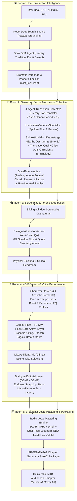

# 🎙️ Audiobook Maker (Vocals-Only Studio Engine v4.0)

> **Autonomous Studio-Grade Multi-Voice Audiobook Production Engine with 4D Acoustic Formants, Anti-Swap Dialogue Attribution, Gemini Flash TTS & Broadcast EBU R128 (-19 LUFS) M4B Packaging.**

[](https://www.python.org/)
[](https://ffmpeg.org/)
[](docs/GEMINI_TTS_SYNTHESIS_AND_DIRECTING.md)
[](docs/VOICE_CASTING_DIRECTOR_GUIDE.md)
[-purple.svg)](docs/AUDIO_ENGINEERING.md)
[-brightgreen.svg)](tests/)
[](LICENSE)

---

## 📖 Overview

**Audiobook Maker (Vocals-Only Studio Engine v4.0)** is an enterprise-grade, autonomous audiobook production system engineered specifically for **crystal-clear, multi-voice character acting and pristine vocal narration** modeled after the benchmark standards of **Audible Studios**.

It ingests raw literature (**EPUB, PDF, TXT, Markdown**) and autonomously produces chapterized `.m4b` audiobooks with rich chapter markers and cover art in one command.

### 🚫 The Pure Vocals-Only Mandate
On this branch, background music (BGM), sound effects (SFX), 5-track stem mixdowns, and Archive.org sound bank harvesting are **permanently decoupled and archived** in `archive/cinematic_audio/`. 

Rather than masking spoken dialogue with noisy background beds or suffering from broken external sound downloaders, this engine channels 100% of its compute into **Google Gemini Flash TTS**, **4D acoustic formant modulation**, **Stanislavski acting direction**, and **broadcast-grade vocal mastering**.

---

## 🏛️ The 5-Room Pure Vocals-Only Architecture


```mermaid
flowchart TD
    subgraph Room1["🌍 Room 1: Pre-Production Intelligence"]
        RawBook["Raw Book (PDF / EPUB / TXT)"] --> DeepSearch["Novel DeepSearch Engine (Factual Grounding)"]
        DeepSearch --> BookDNA["Book DNA Agent (Literary Tradition, Era & Dialect)"]
        BookDNA --> Personae["Dramatis Personae & Phonetic Lexicon (cast_lock.json)"]
    end

    subgraph Room2["🧠 Room 2: Sense-for-Sense Translation Collective"]
        Personae --> Collective["4-Agent Translation Collective<br/>• LiteraryDraftTranslator (70/30 Canon Sacredness)<br/>• HindustaniCadenceSpecialist (Spoken Flow & Pauses)<br/>• SubtextAndIdiomDramaturge (Earthy Desi Grit & 19-to-21)<br/>• TranslationQualityCritic (Anti-Omission & Terminology)"]
        Collective --> DualRule["Dual-Rule Invariant ('Nothing Above Source')<br/>Classic Reverent Pathos vs Raw Unrated Realism"]
    end

    subgraph Room3["🎭 Room 3: Screenplay & Forensic Attribution"]
        DualRule --> Screenplay["Sliding-Window Screenplay Dramaturgy"]
        Screenplay --> Auditor["DialogueAttributionAuditor (Anti-Swap QA)<br/>0% Speaker Flips & Quote Disentanglement"]
        Auditor --> Blocking["Physical Blocking & Spatial Headroom"]
    end

    subgraph Room4["🎙️ Room 4: 4D Formants & Voice Performance"]
        Blocking --> Caster["Character Caster (4D Acoustic Formants)<br/>Pitch Δ, Tempo, Bass Boost & Parametric EQ Profiles"]
        Caster --> TTS["Gemini Flash TTS Key Pool (120+ Active Keys)<br/>Prosodic Acting, Speech Tags & Breath Marks"]
        TTS --> Critic["TakeAuditionCritic (Climax Scene Take Selection)"]
        Critic --> Editorial["Dialogue Editorial Layer (DE-01 - DE-07)<br/>Endpoint Snapping, Hann Micro-Fades & Turn Latency"]
    end

    subgraph Room5["🎛️ Room 5: Broadcast Vocal Mastering & Packaging"]
        Editorial --> VocalMaster["Studio Vocal Mastering Engine<br/>SOXR 48kHz / 24-bit + Dual-Pass Loudnorm EBU R128 (-19 LUFS)"]
        VocalMaster --> Packager["FFMETADATA1 Chapter Generator & AAC Packager"]
        Packager --> Deliverable["Deliverable M4B Audiobook (Chapter Markers & Cover Art)"]
    end

    Room1 --> Room2
    Room2 --> Room3
    Room3 --> Room4
    Room4 --> Room5
```

---

## 🧭 Command-Line Interface (`audiobook_cli.py`)

Run autonomous end-to-end production with a single command or execute granular stages step-by-step:

```bash
# 1-Click Autonomous End-to-End Production:
python audiobook_cli.py auto "C:/path/to/novel.epub" --hindi --dramatized --voice Aoede --workers 3

# Or step-by-step modular commands:
python audiobook_cli.py extract "C:/path/to/novel.epub"
python audiobook_cli.py translate <book_slug>
python audiobook_cli.py script <book_slug> --hindi --dramatized
python audiobook_cli.py synthesize <book_slug> --voice Aoede
python audiobook_cli.py master <book_slug>
python audiobook_cli.py package <book_slug> --cover "cover.jpg"
```

### 🧭 Command Matrix

| Subcommand | Scope | Description |
|---|---|---|
| **`auto`** | Full Book | 1-Click autonomous pipeline (Extract $\rightarrow$ Translate $\rightarrow$ Script $\rightarrow$ Synth $\rightarrow$ Master $\rightarrow$ Package). |
| **`produce`** | Chapter / All | Produces mastered vocal chapters with EBU R128 (-19 LUFS) loudness and timeline ledger. |
| **`extract`** | Ingestion | Ingests EPUB, PDF, TXT, or MD documents into clean Markdown chapters. |
| **`translate`** | Translation | Translates extracted chapters into literary dramatic Hindustani via Translation Collective. |
| **`script`** | Screenplay | Parses prose into standardized screenplay JSON with speaker attribution and acting tags. |
| **`synthesize`** | Audio (TTS) | Synthesizes dialogue chunks using Google Gemini Flash Cloud TTS and 4D formants. |
| **`master`** | Mastering | Concatenates vocal chunks with 5-stage DSP chain and EBU R128 loudness normalization. |
| **`package`** | Delivery | Packages all mastered chapters into a chapterized `.m4b` container with cover art. |
| **`audit`** | QA (Chapter) | Runs Multi-Gate Independent Verification (Gates 0, 1, 2, 2.5, 2.8) on a specific chapter. |
| **`audit-book`** | QA (Macro) | Runs Macro-Tier Gate 6 certification (Voice Continuity, Loudness, TOC Monotonicity). |

---

## ✨ Key Technical Highlights

### 1. 4D Acoustic Formant Casting & Zero Voice Convergence
*(See [`character_caster.py`](file:///c:/Users/Suraj/Documents/antigravity/optimistic-kepler/audiobook_factory/character_caster.py) & [`dispatcher.py`](file:///c:/Users/Suraj/Documents/antigravity/optimistic-kepler/audiobook_factory/tts/dispatcher.py))*
- **Dynamic 2,089 Voice Catalog (`VoiceCatalog`)**: Integrates all 2,089 verified voices (including 114 native Hindi voices, 120 regional Indian English personas, and 215 English Gemini studio voices).
- **LLM Dialect-Aware Casting**: Dynamically matches characters to regional cadences (Awadhi, Bhojpuri, Haryanvi, Bundeli, Urdu/Delhi, Mumbaiya, Dakhini) based on LLM narrative profiles without hardcoding.
- **Child & Adolescent Voice Solutions**:
  - *Anime Seiyū Child Engine*: Young children and girls are dynamically voiced using high-pitch female base voices modulated with $+10\text{--}15\%$ pitch shift and youthful resonance EQ curves (`equalizer=f=...`), replicating Japanese anime voice acting traditions.
  - *Rustic Teen Fighter Profile*: Adolescent boys (14–17yo) utilize young 22yo rustic male bases (Haryanvi/Bhojpuri) with physical EQ curves rather than artificial chipmunk warping.
- **POV-Aware Narrator Alignment**: Automatically selects matching gendered protagonist voices for first-person novels while strictly preserving `Aoede` as the supreme default for third-person literary prose.
- **4D Acoustic Vector Modulation**: When multiple characters share base voice models, the engine modulates:
  1. $F_0$ Pitch Delta ($\pm 4-12\%$) via `asetrate` and `aresample`.
  2. Tempo compensation via `atempo`.
  3. Bass/presence boost and clarity reduction.
  4. 4D Parametric EQ formant profiles chaining distinct acoustic timbres.
- **Formant-Sensitive Hash Caching**: Filename hashes incorporate the active EQ formant profile to guarantee deterministic cache invalidation.

### 2. Room 3 Forensic Screenplay Engine & Anti-Swap Attribution
*(See [`dialogue_attribution_auditor.py`](file:///c:/Users/Suraj/Documents/antigravity/optimistic-kepler/audiobook_factory/script/agents/dialogue_attribution_auditor.py) & [`screenplay_cleaner.py`](file:///c:/Users/Suraj/Documents/antigravity/optimistic-kepler/audiobook_factory/script/screenplay_cleaner.py))*
- **Multi-Agent Screenplay Room**: Deconstructs script writing across 4 specialized agents:
  - `DialogueTurnIsolator`: Extracts pristine spoken text and isolates speech turns.
  - `StanislavskiSubtextDirector`: Injects emotional subtext, actioning verbs, and speech tags.
  - `PhysicalBlockingDirector`: Encodes spatial proximity and stereo azimuth panning.
  - `DramaturgyConsistencyJudge`: Evaluates dramatic continuity and emotional arcs.
- **Forensic Anti-Swap Auditor**: Dedicated LLM QA agent that catches $A \leftrightarrow B$ speaker turn inversions, corrects quotes mistakenly assigned to Narrator, and scrubs leaked speech tags (e.g. `"उसने कहा"`).
- **Chronological Action-Blocking Protection**: Split-quote stitching is strictly bounded to short speech tags ($\le 6$ words with explicit speech verbs), ensuring authentic physical narrative sequences (`Dialogue 1 -> Physical Action -> Dialogue 2`) are never inverted or compressed.

### 3. Room 2 4-Agent Translation Collective & Dual-Rule Invariant
*(See [`collective.py`](file:///c:/Users/Suraj/Documents/antigravity/optimistic-kepler/audiobook_factory/translation/agents/collective.py) & [`translator.py`](file:///c:/Users/Suraj/Documents/antigravity/optimistic-kepler/audiobook_factory/translator.py))*
- **4-Agent Collective**:
  - `LiteraryDraftTranslator`: Sense-for-sense dramatic prose maintaining 70% canon sacredness.
  - `HindustaniCadenceSpecialist`: Natural actor breath pauses (`—`, `...`, `,`) and `TU <-> MAAI-BAAP` power shifts.
  - `SubtextAndIdiomDramaturge`: Earthy Hindustani metaphors and 19-to-21 unrated amplification.
  - `TranslationQualityCritic`: Anti-omission checks and BookBible terminology verification.
- **The Dual-Rule Invariant ("Nothing Above Source")**:
  - *Classic / Heritage Fiction*: Preserves sacred authorial dignity, emotional pathos, and authentic regional cadence with zero modern street slang.
  - *Raw Unrated Fiction*: 19-to-21 amplification of raw street curses, visceral combat gore, and somatic intimacy without puritanical moralizing.
- **Creative Autonomy Preservation**: Preserves expressive acting directives (`[ironic smirk]`, `[hesitates, catches breath]`) for TTS delivery and protects in-story bilingual/code-switching dialogue.

### 4. High-Concurrency Gemini TTS Pool & Quota Shield
*(See [`model_manager.py`](file:///c:/Users/Suraj/Documents/antigravity/optimistic-kepler/audiobook_factory/model_manager.py) & [`key_manager.py`](file:///c:/Users/Suraj/Documents/antigravity/optimistic-kepler/audiobook_factory/key_manager.py))*
- **Persistent SQLite Round-Robin Pool**: Rotates across 120+ active Gemini API keys with token-bucket rate limiting and anti-bot jitter.
- **Quota Trap Shield**: Excludes 10 RPD quota-trap models (`omni`, `gemma`, `-pro`, `gemini-pro`) from general tasks, keeping production locked to high-limit, lightning-fast Flash tiers.
- **Permanent Developer Permissive Threshold (`BLOCK_NONE`)**: Automatically sets `BLOCK_NONE` across all 4 harm categories, preventing false-positive censorship of legitimate dramatic literature.

### 5. Dialogue Editorial Layer (DE-01 - DE-07)
*(See [`docs/DIALOGUE_EDITORIAL_LAYER.md`](docs/DIALOGUE_EDITORIAL_LAYER.md))*
- **Endpoint Zero-Crossing Snapping**: Tracks speech floor down to -52 dBFS and snaps boundaries to sub-millisecond zero crossings.
- **Hann Micro-Fades**: True 12ms pre-speech and 18ms post-speech raised-cosine micro-fades eliminate clicks and pops.
- **Contextual Turn Latency**: Calculates realistic pauses between speakers based on dramatic tension (25ms interruption floor to 1800ms emotional freeze).

### 6. Broadcast Vocal Mastering & Chaptered M4B Container
*(See [`mastering.py`](file:///c:/Users/Suraj/Documents/antigravity/optimistic-kepler/audiobook_factory/mastering.py) & [`packager.py`](file:///c:/Users/Suraj/Documents/antigravity/optimistic-kepler/audiobook_factory/packager.py))*
- **EBU R128 Loudness Target**: Broadcast-compliant `-19.0 LUFS` integrated loudness ($\pm 0.5$ LU) and `-1.5 dBTP` true-peak ceiling.
- **Uniform 2-Channel Stereo Mastering**: Under spatial staging, all vocal segments (including center-panned narrator) render into identical 2-channel stereo streams, eradicating mono/stereo FFmpeg concat crashes.
- **SOXR Resampling**: High-quality 48kHz / 24-bit studio pipeline.
- **Chaptered M4B Container**: Assembles final `.m4b` container with FFMETADATA1 chapter markers, TOC navigation, and embedded high-resolution cover artwork.

---

## 🧪 Test Verification

The entire repository is certified with **100% green test passing**:
```bash
python -m pytest
# ============ 805 passed, 8 skipped, 1 warning in 302.52s ============
```

---

## 📚 Documentation Hub

| Document | Description |
|---|---|
| **[📜 Forensic Literary Ingestion (Pillar 1)](docs/FORENSIC_DOCUMENT_INGESTION.md)** | Authoritative guide to the CanonicalBook AST, sacred raw archival, and Gate 0.1 extraction audits. |
| **[🧠 Literary Translation Intelligence (Pillar 2)](docs/LITERARY_TRANSLATION_INTELLIGENCE.md)** | Complete guide to BookBible v2.0, Contextual Hindustani Register, and the 4-Agent Collective. |
| **[🎭 Dramatic Adaptation & Screenplay (Stage 3)](docs/DRAMATIC_ADAPTATION_AND_SCREENPLAY.md)** | Authoritative guide to the Stage 3 Dramaturgy Engine and DialogueAttributionAuditor. |
| **[🎙️ Gemini Flash TTS Engine & Directing (Stage 4)](docs/GEMINI_TTS_SYNTHESIS_AND_DIRECTING.md)** | Authoritative guide to multimodal generative speech, speech tags, and token bucket key pool. |
| **[🎭 Voice Casting Director Manual & 4D Formants](docs/VOICE_CASTING_DIRECTOR_GUIDE.md)** | Guide to 4D acoustic formant matrices, character dossiers, and non-colliding voice allocation. |
| **[🇮🇳 Complete Hindi Voice Catalog](docs/HINDI_VOICE_CATALOG.md)** | Directory of 114 native Hindi voices, regional dialects, age categories, and timbres. |
| **[✂️ Dialogue Editorial Layer (DE-01 - DE-07)](docs/DIALOGUE_EDITORIAL_LAYER.md)** | Zero-crossing snapping, Hann micro-fades, and contextual turn latencies. |
| **[🎛️ Audio Engineering & Vocal Mastering](docs/AUDIO_ENGINEERING.md)** | Broadcast EBU R128 (-19 LUFS) vocal loudness mastering and FFmpeg filter graphs. |
| **[🛡️ Audit Remediation & Hardening](docs/AUDIT_REMEDIATION_AND_HARDENING.md)** | Exhaustive engineering record of Phases 1 through 6 forensic audit fixes and zero-hardcoding invariants. |
| **[💻 CLI Reference](docs/CLI_REFERENCE.md)** | Complete CLI syntax and flags for all 10 production commands. |
| **[🛠️ Developer Guide](docs/DEVELOPER_GUIDE.md)** | Local environment setup, test suites, and contribution standards. |

---

## 📦 Decoupled & Archived Subsystems

The legacy 5-track cinematic audio engine (dynamic BGM scoring, SQLite FTS5 sound bank harvesting, and multitrack stem mixdowns) has been safely decoupled and archived in `archive/cinematic_audio/`.
The active production pipeline on `Voculs` is **100% focused on pure vocal excellence**.
