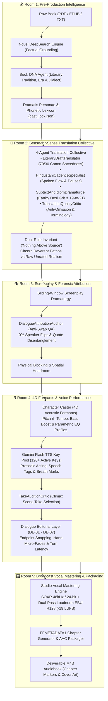

# 🎙️ Audiobook Studio (Antigravity Plugin & Studio Engine v5.2)

> **Autonomous Studio-Grade Multi-Voice Audiobook Production Engine & Google Antigravity Plugin with Gemini Flash TTS, 4D Formant Actor Performance, Two-Pass Linear EBU R128 Mastering, Anti-Swap Dialogue Attribution & Interactive Sidecar Studio Panel.**

[](plugin.json)
[](https://www.python.org/)
[](https://ffmpeg.org/)
[](docs/GEMINI_TTS_SYNTHESIS_AND_DIRECTING.md)
[](docs/VOICE_CASTING_DIRECTOR_GUIDE.md)
[-purple.svg)](docs/AUDIO_ENGINEERING.md)
[](tests/)
[](LICENSE)

---

## 📖 Overview

**Audiobook Studio** is an enterprise-grade, autonomous audiobook production system and a first-class **Google Antigravity Plugin**. Engineered specifically for **grounded, natural multi-voice character acting and pristine vocal narration** modeled after the benchmark standards of **Audible Studios**, it transforms raw literature (**EPUB, PDF, TXT, Markdown**) into chapterized, broadcast-compliant `.m4b` audiobooks with zero corporate fluff or tedious manual editing.

Audiobook Studio operates both as:
1. **A Native Antigravity Plugin**: Direct with conversational directing via the `@audiobook-director` agent, interactive Webview Studio Panel sidecar, and full multi-skill workflows.
2. **A Standalone CLI & Python Framework**: Programmatic scripting, batch processing, and headless production pipelines.

---

## 🚫 The Pure Vocals-Only Mandate

Background music (BGM), sound effects (SFX), 5-track stem mixdowns, and external sound scraping are **permanently decoupled and archived** in `archive/cinematic_audio/`.

Rather than masking spoken dialogue with noisy background beds or suffering from broken external sound downloaders, this engine channels 100% of its compute into:
- **Google Gemini Flash TTS** with token-bucket rotating key pools.
- **4D Acoustic Formant Modulation** (Pitch $\pm 4-12\%$, tempo, and 4D parametric EQ curves) eliminating vocal convergence.
- **Stanislavski Directing Anchors** and temperature clamping (`0.30 - 0.52`) to prevent histrionic screeching.
- **Broadcast EBU R128 Vocal Mastering** (-19.0 LUFS, -1.5 dBTP) with Hann micro-fades.

---

## 🏛️ The 5-Room Pure Vocals-Only Architecture


```mermaid
flowchart TD
    subgraph Room1["🌍 Room 1: Pre-Production Intelligence"]
        RawBook["Raw Book (PDF / EPUB / TXT)"] --> DeepSearch["Novel DeepSearch Engine (Factual Grounding)"]
        DeepSearch --> BookDNA["Book DNA Agent (Literary Tradition, Era & Dialect)"]
        BookDNA --> Personae["Dramatis Personae & Phonetic Lexicon (cast_lock.json)"]
    end

    subgraph Room2["🧠 Room 2: Sense-for-Sense Translation Collective"]
        Personae --> Collective["4-Agent Translation Collective<br/>• LiteraryDraftTranslator (70/30 Canon Sacredness)<br/>• HindustaniCadenceSpecialist (Spoken Flow & Pauses)<br/>• SubtextAndIdiomDramaturge (Earthy Desi Grit & 19-to-21)<br/>• TranslationQualityCritic (Anti-Omission & Terminology)"]
        Collective --> DualRule["Dual-Rule Invariant ('Nothing Above Source')<br/>Classic Reverent Pathos vs Raw Unrated Realism"]
    end

    subgraph Room3["🎭 Room 3: Screenplay & Forensic Attribution"]
        DualRule --> Screenplay["Sliding-Window Screenplay Dramaturgy"]
        Screenplay --> Auditor["DialogueAttributionAuditor (Anti-Swap QA)<br/>0% Speaker Flips & Quote Disentanglement"]
        Auditor --> Blocking["Physical Blocking & Spatial Headroom"]
    end

    subgraph Room4["🎙️ Room 4: 4D Formants & Voice Performance"]
        Blocking --> Caster["Character Caster (4D Acoustic Formants)<br/>Pitch Δ, Tempo, Bass Boost & Parametric EQ Profiles"]
        Caster --> TTS["Gemini Flash TTS Key Pool (120+ Active Keys)<br/>Prosodic Acting, Speech Tags & Breath Marks"]
        TTS --> Critic["TakeAuditionCritic (Climax Scene Take Selection)"]
        Critic --> Editorial["Dialogue Editorial Layer (DE-01 - DE-07)<br/>Endpoint Snapping, Hann Micro-Fades & Turn Latency"]
    end

    subgraph Room5["🎛️ Room 5: Broadcast Vocal Mastering & Packaging"]
        Editorial --> VocalMaster["Studio Vocal Mastering Engine<br/>SOXR 48kHz / 24-bit + Dual-Pass Loudnorm EBU R128 (-19 LUFS)"]
        VocalMaster --> Packager["FFMETADATA1 Chapter Generator & AAC Packager"]
        Packager --> Deliverable["Deliverable M4B Audiobook (Chapter Markers & Cover Art)"]
    end

    Room1 --> Room2
    Room2 --> Room3
    Room3 --> Room4
    Room4 --> Room5
```

---

## 🔌 Antigravity Plugin Ecosystem

Audiobook Studio installs seamlessly into Google Antigravity as an all-in-one production plugin:

```text
audiobook-studio/
├── plugin.json                 # Core Antigravity plugin manifest
├── assets/
│   └── logo.svg                # Studio branding icon
├── rules/
│   └── AGENTS.md               # Studio domain invariants & vocal engineering guardrails
├── agents/
│   └── audiobook-director.md   # Studio Audiobook Director persona (@audiobook-director)
├── skills/
│   ├── audiobook-studio/       # Operational directs, project DB inspect, zero-CLI API
│   ├── audio-engineer-ffmpeg/  # FFmpeg DSP, 4D formants, EBU R128 mastering curves
│   └── novel-audiobook-factory/# Autonomous novel ingestion, translation & production
└── sidecars/
    └── studio-panel/           # Webview Aux-Pane UI Extension & Soundboard
        ├── sidecar.json        # Sidecar lifecycle & UI entrypoint
        ├── main.mjs            # Express server + SSE event hub
        ├── index.html          # Clean dark studio interface
        ├── app.js              # State streaming, live waveform, casting board
        └── styles.css          # Studio theme typography and layout
```

### 1. The `@audiobook-director` Agent
Eliminate memorizing CLI flags. Speak directly to the director:
- *"Produce next chapter with multi-cast Gemini Flash voices"*
- *"Show active audiobook projects and progress"*
- *"Audition character voices and verify cast roster"*
- *"Run Gate 6 loudness and speech attribution audit on chapter 3"*

### 2. The Interactive Studio Panel (Sidecar Webview)
The embedded Webview runs in Antigravity's auxiliary side pane, providing:
- **Live SSE Event Stream**: Real-time progress bars for translation, scripting, TTS chunking, and mastering.
- **Character Casting Matrix**: Visual character roster, assigned acoustic formants (pitch shift, tempo, EQ contour), and 0% collision verification.
- **Waveform Audition Soundboard**: Preview raw takes vs mastered speech segments directly inside the IDE.

---

## 🎛️ Studio Vocal Engineering & Mastering (EBU R128)

Audiobook Studio strictly adheres to international broadcast and Audible production standards:

| Parameter | Benchmark Target | Engine Implementation |
|---|---|---|
| **Integrated Loudness** | **-19.0 LUFS** ($\pm 0.5$ LUFS) | Two-pass measured linear loudnorm (`-f null -` pass 1, `linear=true` pass 2). |
| **True Peak Ceiling** | $\le$ **-1.5 dBTP** | Hard limiter ceiling with Kaiser Sinc 48kHz / 24-bit post-loudnorm resampling. |
| **Consonant Clarity** | Zero de-esser degradation | Dynamic sibilance de-essers are banned; crisp Hindi dental/aspirated consonants (स, श, छ, थ, ध) are preserved. |
| **Phase Coherence** | Natural tempo phrasing | WSOLA time-stretching banned during playback; pacing modulated naturally via punctuation. |
| **Micro-Fades** | Zero-crossing snapping | 12ms pre-speech fade-in and 18ms post-speech fade-out at -52 dBFS noise floor. |
| **Output Container** | Audible-compatible `.m4b` | AAC-LC 128-192 kbps, embedded chapters (`FFMETADATA1`), and high-res cover art. |

---

## 🚀 Quickstart & Installation

### Requirements
- **Python**: 3.10+ (tested on Python 3.10 – 3.13)
- **FFmpeg**: 6.0+ with SOXR support (installed and available in `PATH`)
- **Node.js**: 18+ (for the Webview sidecar panel)
- **Google Gemini API Key(s)**: 1 or more Gemini API keys (supports 120+ key pool)

### 1. Clone & Set Up Python Environment
```bash
git clone https://github.com/naksh-07/audiobook-studio.git
cd audiobook-studio

# Create and activate virtual environment
python -m venv .venv
source .venv/bin/activate  # On Windows: .venv\Scripts\activate

# Install dependencies
pip install -e .
```

### 2. Configure Credentials
Create a `.env` file in the root directory:
```env
# Primary API key or comma-separated pool
GEMINI_API_KEY=your_gemini_api_key_here
# Optional multiple keys for rotating pool:
# GEMINI_API_KEYS=key1,key2,key3
```

### 3. Install into Google Antigravity
To install as a local Antigravity plugin:
```bash
# Link or copy to Antigravity plugin directory:
# On Windows:
xcopy /E /I /Y . "%USERPROFILE%\.gemini\config\plugins\audiobook-studio"
# On Linux / macOS:
# cp -r . ~/.gemini/config/plugins/audiobook-studio
```
Restart Antigravity or open Plugins Manager to see **Audiobook Studio** live!

---

## 💻 Command-Line Interface (`audiobook_cli.py`)

Run autonomous end-to-end production with a single command or execute granular stages step-by-step:

```bash
# 1-Click Autonomous End-to-End Production:
audiobook-studio auto "path/to/novel.epub" --hindi --dramatized --voice Aoede --workers 3

# Or step-by-step modular pipeline:
audiobook-studio extract "path/to/novel.epub"
audiobook-studio translate <book_slug>
audiobook-studio script <book_slug> --hindi --dramatized
audiobook-studio synthesize <book_slug> --voice Aoede --workers 3
audiobook-studio master <book_slug>
audiobook-studio package <book_slug> --cover "cover.jpg"
```

### Command Matrix

| Subcommand | Scope | Description |
|---|---|---|
| **`auto`** | Full Book | 1-Click autonomous pipeline (Extract $\rightarrow$ Translate $\rightarrow$ Script $\rightarrow$ Synth $\rightarrow$ Master $\rightarrow$ Package). |
| **`produce`** | Chapter / All | Produces mastered vocal chapters with EBU R128 (-19 LUFS) loudness and timeline ledger. |
| **`extract`** | Ingestion | Ingests EPUB, PDF, TXT, or MD documents into clean Markdown chapters. |
| **`translate`** | Translation | Translates extracted chapters into literary dramatic Hindustani via Translation Collective. |
| **`script`** | Screenplay | Parses prose into standardized screenplay JSON with speaker attribution and acting tags. |
| **`synthesize`** | Audio (TTS) | Synthesizes dialogue chunks using Google Gemini Flash Cloud TTS and 4D formants. |
| **`master`** | Mastering | Concatenates vocal chunks with 5-stage DSP chain and EBU R128 loudness normalization. |
| **`package`** | Delivery | Packages all mastered chapters into a chapterized `.m4b` container with cover art. |
| **`audit`** | QA (Chapter) | Runs Multi-Gate Independent Verification (Gates 0, 1, 2, 2.5, 2.8) on a specific chapter. |
| **`audit-book`** | QA (Macro) | Runs Macro-Tier Gate 6 certification (Voice Continuity, Loudness, TOC Monotonicity). |

---

## 🧪 Verification & Quality Testing

Audiobook Studio maintains strict architectural anti-tamper and regression suites:

```bash
# Run complete test suite (800+ isolated tests)
pytest tests/ -v
```

All quality gates are fail-closed:
- **Gate 0.1**: Forensic Ingestion & Reading Order AST Validation.
- **Gate 1**: Dramatis Personae & 0% Voice Collision Casting.
- **Gate 2**: DialogueAttributionAuditor (0% Speaker Turn Swaps).
- **Gate 2.5**: Stanislavski Acting Restraint (clamped temp, physical vocal anchors).
- **Gate 5**: Dialogue Editorial Snapping & Hann Micro-fades.
- **Gate 6**: Two-Pass Linear Loudnorm Certification (-19.0 LUFS, -1.5 dBTP).

---

## 📚 Documentation Index

For exhaustive technical guides, visit the [`docs/`](docs/) directory:
- [🏛️ Architecture Blueprint](docs/ARCHITECTURE.md)
- [🎛️ Audio Engineering & Mastering](docs/AUDIO_ENGINEERING.md)
- [🎙️ Gemini Flash TTS Synthesis & Directing](docs/GEMINI_TTS_SYNTHESIS_AND_DIRECTING.md)
- [🎭 Voice Casting Director Guide](docs/VOICE_CASTING_DIRECTOR_GUIDE.md)
- [🇮🇳 Complete Hindi Voice Catalog](docs/HINDI_VOICE_CATALOG.md)
- [🧠 Literary Translation Intelligence](docs/LITERARY_TRANSLATION_INTELLIGENCE.md)
- [🎭 Dramatic Adaptation & Screenplay](docs/DRAMATIC_ADAPTATION_AND_SCREENPLAY.md)
- [✂️ Dialogue Editorial Layer](docs/DIALOGUE_EDITORIAL_LAYER.md)
- [💻 CLI Reference Manual](docs/CLI_REFERENCE.md)
- [🛡️ Quality Gates Specifications](docs/QUALITY_GATES.md)

---

## 📄 License

This project is licensed under the [MIT License](LICENSE).

---

*Built with ❤️ for Google Antigravity by Suraj ([@naksh-07](https://github.com/naksh-07))*
