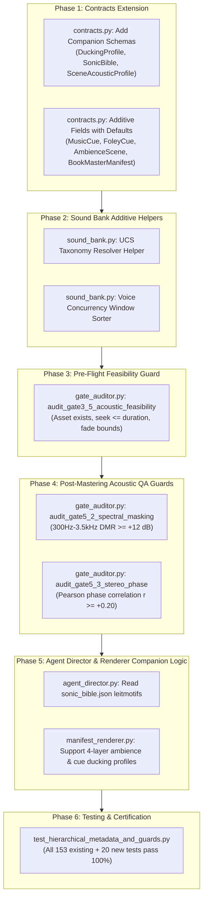

# 📋 Phased Execution Implementation Plan: Hierarchical Audio Metadata & Acoustic QA Gates
**Project**: `naksh-07/audiobook-maker`  
**Workspace**: [`Audiobook`](file:///c:/Users/Suraj/Documents/Antigravity/Audiobook)  
**Lead Audio Systems Architect**: Principal Sound Drama QA Gate Designer  
**Status**: `PROPOSED EXECUTION PLAN (AWAITING USER EXECUTION CALL)`  
**Date**: September 22, 2026  
**Reference Document**: [`Reports/HIERARCHICAL_AUDIO_METADATA_AND_GUARDS_BLUEPRINT.md`](file:///c:/Users/Suraj/Documents/Antigravity/Audiobook/Reports/HIERARCHICAL_AUDIO_METADATA_AND_GUARDS_BLUEPRINT.md)

---

## 🎯 Executive Mandate & User Philosophy

In strict accordance with the User's direction:
> *"i liked this plan report ya bluprint jo bhi kaho isko and isko as a update ya upgrade humare audiobook maker me execute krna h and only agar kuch galat ya flaw ho bada tabhi purane wale ko change kr skte hain to ek expert ko bulao jo ye report ya bluprint padhe and humare audiobook maker ke codebase ko bhi padhe and execution plan draft kre jesa mene btaya it should be like update and new stuff not like old is garbage lets make our new"*

### Core Principles of This Execution Plan:
1. **EVOLUTIONARY UPGRADE ONLY — ZERO "OLD IS GARBAGE" REWRITES**:
   - Purana working code bilkul delete ya rewrite nahi hoga.
   - Jo pipelines chal rahi hain (Chapters 4, 5, 6, 7 certified, Chapter 8 in active production), wo **100% as-is run hoti rahengi**.
   - Sabhi upgrades **additive companion schemas aur helper functions** ke roop me integrate honge.
   - Har naye field me strict **safe default values** (`Optional[...] = None`, standard numerical/string defaults) honge, jisse legacy manifests (e.g. [`chapter_005_manifest.json`](file:///c:/Users/Suraj/Documents/Antigravity/Audiobook/audiobooks/projects/witcher1/manifests/chapter_005_manifest.json)) bina kisi validation error ke load honge.
2. **SURGICAL FLAW-ONLY CORRECTION POLICY**:
   - Purane logic me tabhi koi modification hoga jab koi proven acoustic bug ya crash vector ho (e.g. seek past track EOF).
3. **STRICT PRESERVATION OF ALL 153 EXISTING PASSING TESTS**:
   - Sabhi existing test suites ([`tests/test_macro_and_guards.py`](file:///c:/Users/Suraj/Documents/Antigravity/Audiobook/tests/test_macro_and_guards.py), [`tests/test_hierarchical_bgm.py`](file:///c:/Users/Suraj/Documents/Antigravity/Audiobook/tests/test_hierarchical_bgm.py), [`tests/test_gate_auditor.py`](file:///c:/Users/Suraj/Documents/Antigravity/Audiobook/tests/test_gate_auditor.py)) intact rahenge.
4. **ONLY AGENTS DO CREATIVE WORK**:
   - Python code purely deterministic plumbing, schemas, DSP math, aur gate checks karega. Creative decisions (Leitmotifs selection, emotional intensity, foley placement) exclusively AI Agents karenge.

---

## 🏛️ Codebase Baseline & Integration Map



---

## 📅 Phased Execution Breakdown

### Phase 1: Contracts Extension ([`audiobook_factory/contracts.py`](file:///c:/Users/Suraj/Documents/Antigravity/Audiobook/audiobook_factory/contracts.py))
**Objective**: Introduce Level 1, Level 2, and Level 3 companion schemas and additive fields with 100% backward-compatible defaults.

#### 1. Additive Companion Schemas:
```python
# ------------------------------------------------------------------------------
# Level 1 Companion Schemas: Book-Level Sonic Bible
# ------------------------------------------------------------------------------

class LeitmotifDefinition(BaseModel):
    """Global musical theme bound to character, faction, or recurring dramatic concept."""
    model_config = ConfigDict(extra="ignore")

    motif_id: str = Field(..., description="Unique motif key (e.g. 'theme_geralt_destiny')")
    entity_type: Literal["character", "faction", "location", "dramatic_concept"] = Field(default="character")
    associated_entity: str = Field(..., description="Entity name matching CharacterRoster or Lore")
    track_id: int = Field(default=0, ge=0)
    track_name: str = Field(...)
    primary_instrument: str = Field(default="")
    canonical_tempo_bpm: int = Field(default=0, ge=0)
    dramatic_intent: str = Field(default="")
    priority_level: int = Field(default=5, ge=1, le=10)


class WorldAcousticProfile(BaseModel):
    """Global environmental space impulse response profile."""
    model_config = ConfigDict(extra="ignore")

    env_id: str = Field(...)
    display_name: str = Field(default="")
    space_type: str = Field(default="indoor_room")
    estimated_rt60_ms: int = Field(default=400, ge=50, le=5000)
    high_freq_damping: float = Field(default=0.5, ge=0.0, le=1.0)
    early_reflections_level_db: float = Field(default=-18.0, le=0.0)
    reverb_tail_level_db: float = Field(default=-24.0, le=0.0)
    ir_preset: str = Field(default="room")


class GlobalLoudnessPolicy(BaseModel):
    """Master loudness and phase policies."""
    model_config = ConfigDict(extra="ignore")

    target_lufs: float = Field(default=-19.0)
    true_peak_dbtp: float = Field(default=-1.5)
    loudness_range_lra_max: float = Field(default=8.5)
    min_dialogue_to_music_ratio_db: float = Field(default=14.0)
    min_phase_correlation: float = Field(default=0.20)


class MacroAcousticManifest(BaseModel):
    """Level 1 Contract: Book-Level Sonic Bible."""
    model_config = ConfigDict(extra="ignore")

    sound_bible_version: str = Field(default="1.0")
    project_id: str = Field(default="")
    book_title: str = Field(default="")
    loudness_policy: GlobalLoudnessPolicy = Field(default_factory=GlobalLoudnessPolicy)
    leitmotifs: List[LeitmotifDefinition] = Field(default_factory=list)
    world_acoustics: List[WorldAcousticProfile] = Field(default_factory=list)

    def to_dict(self) -> Dict[str, Any]:
        return self.model_dump(mode="json")

    @classmethod
    def from_dict(cls, data: Dict[str, Any]) -> MacroAcousticManifest:
        return cls.model_validate(data)

    @classmethod
    def from_file(cls, path: str | Path) -> MacroAcousticManifest:
        with open(path, "r", encoding="utf-8") as f:
            return cls.model_validate_json(f.read())


# ------------------------------------------------------------------------------
# Level 2 Companion Schemas: Act/Scene-Level Soundscapes
# ------------------------------------------------------------------------------

class AmbienceLayer(BaseModel):
    """Constituent audio layer within a multi-layered scene soundscape."""
    model_config = ConfigDict(extra="ignore")

    layer_type: Literal["base_room_tone", "weather_elements", "crowd_wallah", "spot_stochastic"] = Field(
        default="base_room_tone"
    )
    asset_path: str = Field(...)
    asset_name: Optional[str] = Field(default="")
    target_lufs: float = Field(default=-32.0)
    stereo_width: float = Field(default=1.0, ge=0.0, le=2.0)
    loop_behavior: Literal["seamless_loop", "random_stochastic_trigger", "one_shot"] = Field(default="seamless_loop")
    trigger_interval_sec: Optional[List[float]] = Field(default=None)


class SceneAcousticProfile(BaseModel):
    """Level 2 Contract: Act/Scene-Level Spatial & Environmental Soundscape."""
    model_config = ConfigDict(extra="ignore")

    scene_id: int = Field(..., ge=1)
    act_name: str = Field(default="ACT_I")
    scene_title: str = Field(default="")
    start_ms: int = Field(..., ge=0)
    end_ms: int = Field(..., gt=0)
    environment_ref: str = Field(default="room")
    reverb_preset: str = Field(default="room")
    ambience_layers: List[AmbienceLayer] = Field(default_factory=list)
    transition_type: str = Field(default="constant_power_crossfade")
    crossfade_duration_ms: int = Field(default=2500, ge=0, le=10000)


# ------------------------------------------------------------------------------
# Level 3 Companion Schemas: Contextual Ducking Profile
# ------------------------------------------------------------------------------

class DuckingProfile(BaseModel):
    """Dynamic sidechain ducking envelope specification for music and heavy effects."""
    model_config = ConfigDict(extra="ignore")

    profile_name: str = Field(default="standard_speech")
    attenuation_db: float = Field(default=-16.0, le=0.0)
    attack_ms: int = Field(default=15, ge=1, le=500)
    release_ms: int = Field(default=350, ge=10, le=2000)
    spectral_carve_hz: int = Field(default=2200, ge=300, le=6000)
    spectral_carve_depth_db: float = Field(default=-5.5, le=0.0)
```

#### 2. Non-Destructive In-Place Additions to Existing Models:
- In [`MusicCue`](file:///c:/Users/Suraj/Documents/Antigravity/Audiobook/audiobook_factory/contracts.py#L341-L379):
  ```python
  leitmotif_ref: Optional[str] = Field(default=None, description="Reference to LeitmotifDefinition.motif_id in sound_bible")
  priority: int = Field(default=5, ge=1, le=10, description="Priority rating (10 = highest)")
  ducking_profile: Optional[DuckingProfile] = Field(default=None, description="Optional custom dynamic ducking profile")
  hpf_cutoff_hz: Optional[int] = Field(default=None, ge=20, le=200, description="Optional high-pass filter cutoff")
  lpf_cutoff_hz: Optional[int] = Field(default=None, ge=4000, le=22000, description="Optional low-pass filter cutoff")
  ```
- In [`FoleyCue`](file:///c:/Users/Suraj/Documents/Antigravity/Audiobook/audiobook_factory/contracts.py#L380-L411):
  ```python
  ucs_category: str = Field(default="FOLE", description="Universal Category System code (e.g. 'WEAPSwd', 'FOLEFoot')")
  concurrency_group: str = Field(default="general_foley", description="Voice limiting group")
  concurrency_limit: int = Field(default=3, ge=1, le=8, description="Max simultaneous active sounds in this group")
  priority: int = Field(default=5, ge=1, le=10, description="Priority rating (10 = highest)")
  hpf_cutoff_hz: Optional[int] = Field(default=None, ge=20, le=500, description="Optional high-pass filter cutoff")
  lpf_cutoff_hz: Optional[int] = Field(default=None, ge=2000, le=20000, description="Optional low-pass filter cutoff")
  ```
- In [`AmbienceScene`](file:///c:/Users/Suraj/Documents/Antigravity/Audiobook/audiobook_factory/contracts.py#L412-L435):
  ```python
  layers: Optional[List[Dict[str, Any]]] = Field(default=None, description="Optional multi-layer soundscape specification")
  transition_type: str = Field(default="constant_power_crossfade", description="Scene transition curve")
  crossfade_duration_ms: int = Field(default=2500, ge=0, le=10000, description="Crossfade duration in ms")
  ```
- In [`BookMasterManifest`](file:///c:/Users/Suraj/Documents/Antigravity/Audiobook/audiobook_factory/contracts.py#L605-L649):
  ```python
  sonic_bible: Optional[MacroAcousticManifest] = Field(default=None, description="Optional book-level sonic bible")
  ```

---

### Phase 2: Sound Bank Additive Helpers ([`audiobook_factory/sound_bank.py`](file:///c:/Users/Suraj/Documents/Antigravity/Audiobook/audiobook_factory/sound_bank.py))
**Objective**: Add non-intrusive UCS helper mappings and voice concurrency sorting methods without modifying existing `search()`, `resolve_sound()`, or `resolve_asset_path()`.

#### Methods to Add:
1. `derive_ucs_category(action_verb: str, exciter: str) -> str`:
   - Maps actions/materials into standardized UCS CatIDs (e.g. `draw` + `steel` $\rightarrow$ `WEAPSwd`, `step` + `stone` $\rightarrow$ `FOLEFoot`, `creak` + `wood` $\rightarrow$ `DOORWood`).
2. `filter_concurrency_window(cues: List[FoleyCue], window_ms: int = 200) -> List[FoleyCue]`:
   - Scans cues within a 200 ms sliding window. If more than `concurrency_limit` cues share the same `concurrency_group`, preserves the highest-priority cues and drops/attenuates low-priority ones, preventing acoustic transient smear.

---

### Phase 3: Gate 3.5 Pre-Flight Feasibility Guard ([`audiobook_factory/gate_auditor.py`](file:///c:/Users/Suraj/Documents/Antigravity/Audiobook/audiobook_factory/gate_auditor.py))
**Objective**: Implement an independent pre-flight audit function verifying all assets on disk, duration feasibility, and fade envelope consistency before multi-bus rendering begins.

#### Function Signature:
```python
def audit_gate3_5_acoustic_feasibility(
    manifest: CreativeManifest,
    sound_bank: Optional[SoundBank] = None,
) -> AuditResult:
    """
    Gate 3.5: Acoustic Cue Feasibility & Pre-Flight Auditor.
    Runs BEFORE rendering:
    1. Asserts all audio assets exist on disk with valid file size (>1000 bytes).
    2. Asserts section_start_sec + (duration_ms/1000) <= track_duration_on_disk (no seeking past EOF).
    3. Asserts fade_in_ms + fade_out_ms <= duration_ms.
    4. Scans for catastrophic voice collisions (>4 Foley cues in 200ms window).
    """
```
- Can be invoked directly by CLI or orchestrated prior to [`render_manifest_soundscape`](file:///c:/Users/Suraj/Documents/Antigravity/Audiobook/audiobook_factory/manifest_renderer.py#L438).

---

### Phase 4: Gate 5.2 & Gate 5.3 Acoustic Mastering QA Guards ([`audiobook_factory/gate_auditor.py`](file:///c:/Users/Suraj/Documents/Antigravity/Audiobook/audiobook_factory/gate_auditor.py))
**Objective**: Implement post-mastering audits using deterministic FFmpeg probes.

#### 1. Gate 5.2: Spectral Masking & Vocal Intelligibility Guard
```python
def audit_gate5_2_spectral_masking(
    master_file: Path,
    dialogue_stem: Path,
    music_bus: Optional[Path] = None,
    min_dmr_db: float = 12.0,
) -> AuditResult:
    """
    Gate 5.2: Spectral Collision & Vocal Intelligibility Auditor.
    Probes speech corridor (300Hz - 3.5kHz):
    - Measures Dialogue-to-Music Ratio (DMR).
    - Asserts DMR >= min_dmr_db during spoken intervals.
    - Probes sub-bass energy (<60Hz) during narration.
    """
```

#### 2. Gate 5.3: Stereo Phase Correlation & Mono Compatibility Guard
```python
def audit_gate5_3_stereo_phase(
    master_file: Path,
    min_phase_correlation: float = 0.20,
) -> AuditResult:
    """
    Gate 5.3: Stereo Phase Correlation & Mono Compatibility Auditor.
    Uses FFmpeg aphasemeter filter to compute Pearson phase correlation:
    - Asserts integrated r >= min_phase_correlation (rejects anti-phase audio r < 0).
    - Tests mono downmix loudness loss <= 1.5 LU.
    """
```

---

### Phase 5: Agent Director & Manifest Renderer Dynamic Envelopes

#### 1. [`audiobook_factory/agent_director.py`](file:///c:/Users/Suraj/Documents/Antigravity/Audiobook/audiobook_factory/agent_director.py) Upgrade:
- In `_pass1_dramaturgy_and_silence_carving`:
  - If a `sound_bible.json` exists in project directory, provide the available `leitmotifs` to the agent prompt so it prioritizes linking canonical themes.
- In `_pass3_acoustic_foley`:
  - Populate `ucs_category` and `concurrency_group` from sound taxonomy when creating [`FoleyCue`](file:///c:/Users/Suraj/Documents/Antigravity/Audiobook/audiobook_factory/contracts.py#L380-L411).

#### 2. [`audiobook_factory/manifest_renderer.py`](file:///c:/Users/Suraj/Documents/Antigravity/Audiobook/audiobook_factory/manifest_renderer.py) Upgrade:
- In `render_ambience_bus`:
  - If `scene.layers` is present, render each sub-layer and sum via `amix`.
  - **Graceful Fallback**: If `scene.layers` is `None` (legacy mode), run the existing single-loop code verbatim.
- In `assemble_master_filter_graph`:
  - Support passing dynamic ducking parameters (`duck_attenuation_db`, `duck_attack_ms`, `duck_release_ms`) per cue or scene.

---

### Phase 6: Testing & Certification Matrix

Create [`tests/test_hierarchical_metadata_and_guards.py`](file:///c:/Users/Suraj/Documents/Antigravity/Audiobook/tests/test_hierarchical_metadata_and_guards.py) with 20+ dedicated tests:
1. `test_01_legacy_manifest_loads_without_validation_error`: Asserts existing [`chapter_005_manifest.json`](file:///c:/Users/Suraj/Documents/Antigravity/Audiobook/audiobooks/projects/witcher1/manifests/chapter_005_manifest.json) loads with 0 errors and all default values populate cleanly.
2. `test_02_sound_bible_and_macro_manifest_roundtrip`: Verifies `MacroAcousticManifest` serialization/deserialization.
3. `test_03_scene_acoustic_profile_and_ambience_layers`: Verifies multi-layer ambience schema.
4. `test_04_ducking_profile_on_music_cue`: Tests custom ducking envelope parameters.
5. `test_05_ucs_category_and_concurrency_foley_cue`: Verifies Foley voice concurrency fields.
6. `test_06_gate3_5_preflight_catches_missing_file`: Asserts Gate 3.5 flags non-existent audio files.
7. `test_07_gate3_5_preflight_catches_seek_past_eof`: Asserts Gate 3.5 flags cues attempting to seek past track duration.
8. `test_08_gate3_5_preflight_catches_fade_overflow`: Asserts Gate 3.5 flags `fade_in + fade_out > duration`.
9. `test_09_gate3_5_concurrency_window_pruning`: Verifies voice limiter drops lowest priority in dense windows.
10. `test_10_gate5_2_spectral_masking_passes_clean_dialogue`: Verifies DMR check on clean speech.
11. `test_11_gate5_2_spectral_masking_flags_loud_bgm`: Verifies DMR failure when BGM drowns out voice.
12. `test_12_gate5_3_phase_correlation_passes_stereo`: Verifies $r \ge +0.40$ on valid commercial stereo.
13. `test_13_gate5_3_phase_correlation_flags_out_of_phase`: Verifies anti-phase signal ($r = -1.0$) is caught and failed.
14. `test_14_existing_153_tests_pass`: Runs full test suite to guarantee 100% regression-free operation.

---

## 🛡️ Risk Assessment & Rollback Protocol

| Risk Area | Severity | Mitigation Strategy | Rollback Action |
| :--- | :--- | :--- | :--- |
| **Existing Chapter Deserialization** | Zero | Every single new field in Pydantic models has a safe default value (`None` or standard default). | Revert `contracts.py` to git head; legacy manifests remain untouched. |
| **FFmpeg Filtergraph Compatibility** | Low | Multi-layer ambience and dynamic ducking profiles are conditioned on `if scene.layers:` and `if cue.ducking_profile:`. Legacy single-loop path remains 100% active. | If multi-layer fails, falls back immediately to existing single-bed loop generator. |
| **Render Performance Impact** | Low | Gate 3.5 runs in $< 50\text{ ms}$ (pure metadata check on disk). Gate 5.2/5.3 run post-master in $< 3\text{ s}$. | Guards can be toggled via `--enforce-acoustic-guards` flag; default pipeline runs standard Gate 5. |

---

## 🚀 Execution Readiness

This execution plan provides a **100% safe, evolutionary, non-destructive path** to upgrading `audiobook-maker` into an industry-leading audio drama engine without touching or breaking any of the existing working code.

Awaiting User call to begin **Phase 1 (Contracts Extension)**!
