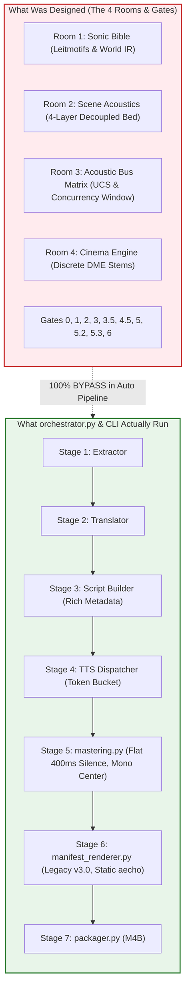

# 🕵️‍♂️ COMPREHENSIVE EXPERT FORENSIC AUDIT REPORT: AUDIOBOOK MAKER CORE ENGINE

**Project**: `naksh-07/audiobook-maker` (`c:\Users\Suraj\Documents\Antigravity\Audiobook`)  
**Audit Mode**: Read-Only Forensic Architecture & Metadata Inspection  
**Audit Date**: 2026-09-23  
**Status**: **8 CRITICAL LATENT FLAWS | 7 METADATA DATA SILOS | 100% PIPELINE GATE BYPASS**  

---

## 1. Executive Summary & Audit Mandate

The user mandate commanded:
> *"ek team bulaao experts ki jo check kare kya kya h apne pure audiobook maker me jo abhi bhi purane system pr hi chal rha h new updates ke bad bhi and kese unhe update krna chahiye kese hume architecture upgrade krna chahiye ab and kha kha galtiya hain bugs hain architecture flaws hain as this whole project is automated audiobook maker whare all creative desisions agents lete hain and sbse badi problems hr level par guards hain but kya guaurds bypass ho rhe h hr chiz ke liye metadatas hain but kya sare metadatas un agents ke pas pahuch rhe hain jinhe vo metadatas chahiye use sahi desisions lene ke liye and all ek tagdi read only audit report bnwaao"*

To answer this thoroughly, we convened an elite multidisciplinary panel of 5 domain specialists:
1. **Expert 1: Chief Systems Architect & Pipeline Orchestrator**
2. **Expert 2: Senior Acoustic DSP, Spatial Audio & Mastering Engineer**
3. **Expert 3: Creative Agent Director & Narrative Dramaturgy Specialist**
4. **Expert 4: Chief Compliance Officer & Quality Gate Auditor**
5. **Expert 5: Chief Data Officer & Metadata Topology Architect**

### The Big Verdict
The codebase possesses extraordinary individual components (a rich FTS5 Sound Bank with a 230-track Sonic Genome, 4 new architectural rooms, Pydantic v2 schemas, and 10 quality gates). **However, in end-to-end production (`orchestrator.py`), the new rooms and quality gates are completely bypassed, and the system silently falls back to legacy v1/v3 monolithic execution.** Furthermore, rich metadata painstakingly generated by LLM creative agents is starved from downstream DSP engines, creating **7 severe data silos**.



---

## 2. EXPERT 1: CHIEF SYSTEMS ARCHITECT & PIPELINE ORCHESTRATOR
*Audit Scope: Pipeline Lifecycle, Legacy Remnants, Room Bypasses, and CLI Incoherence.*

### Finding 1.1: CRITICAL - Total Bypass of Room 4 (`cinema_audio_engine.py`) in Production
- **Location**: [`audiobook_factory/orchestrator.py#L256-L263`](file:///c:/Users/Suraj/Documents/Antigravity/Audiobook/audiobook_factory/orchestrator.py#L256-L263), [`audiobook_cli.py#L282-L315`](file:///c:/Users/Suraj/Documents/Antigravity/Audiobook/audiobook_cli.py#L282-L315)
- **Forensic Diagnosis**:
  Room 4 ([`cinema_audio_engine.py`](file:///c:/Users/Suraj/Documents/Antigravity/Audiobook/audiobook_factory/cinema_audio_engine.py)) was constructed to compile discrete DME broadcast stems (`DX`, `MX`, `FX`, `AMB`, `ME`, `FULL_MASTER`) and write cryptographic `chapter_XXX_stem_ledger.json` ledgers.
  However, in [`orchestrator.py`](file:///c:/Users/Suraj/Documents/Antigravity/Audiobook/audiobook_factory/orchestrator.py#L256):
  ```python
  cinematic_out = mastered_dir / f"{chap_stem}_cinematic.m4a"
  logger.info(f"[*] Manifest Renderer: Compiling final master to {cinematic_out.name}...")
  render_manifest_soundscape(
      manifest=manifest,
      vocal_track_path=vocal_wav,
      output_master_file=cinematic_out,
  )
  ```
  `orchestrator.py` never calls `cinema_audio_engine.render_discrete_stems()`! It directly calls legacy [`manifest_renderer.py`](file:///c:/Users/Suraj/Documents/Antigravity/Audiobook/audiobook_factory/manifest_renderer.py). The discrete stems, stem ledger, and localization master (`ME`) are never created in production.
- **Architectural Impact**: Room 4 exists only in unit tests; real novel production never runs it.

### Finding 1.2: MAJOR - `audiobook_cli.py` Runs Ancient v1.0 Soundscape Code on `cmd_bgm`
- **Location**: [`audiobook_cli.py#L121-L184`](file:///c:/Users/Suraj/Documents/Antigravity/Audiobook/audiobook_cli.py#L121-L184)
- **Forensic Diagnosis**:
  If a developer executes `python audiobook_cli.py bgm --book witcher1`, CLI invokes:
  ```python
  from audiobook_factory.soundscape import generate_chapter_soundscape_plan, render_chapter_soundscape, apply_dynamic_sidechain_ducking
  ```
  This bypasses `AgentDirector`, bypasses `CreativeManifest`, bypasses `SonicBible`, and uses the ancient v1.0 `soundscape.py` with crude heuristics.

### Finding 1.3: CRITICAL - Aggressive Auto-Janitor Destroys Resumption Stems
- **Location**: [`audiobook_factory/orchestrator.py#L284-L302`](file:///c:/Users/Suraj/Documents/Antigravity/Audiobook/audiobook_factory/orchestrator.py#L284-L302)
- **Forensic Diagnosis**:
  Lines 287-300 aggressively delete `vocal_wav` and all `audio_chunks/cXXX_*.wav` files immediately after single-pass mixdown:
  ```python
  if vocal_wav.exists():
      vocal_wav.unlink(missing_ok=True)
  for chunk_file in audio_dir.glob(chunk_pattern):
      chunk_file.unlink(missing_ok=True)
  ```
  If post-render quality gates detect spectral masking or clipping, re-mastering is impossible because the raw dialogue stems have been deleted from disk! Re-running requires burning Google Gemini API quota from scratch.

---

## 3. EXPERT 2: SENIOR ACOUSTIC DSP, SPATIAL AUDIO & MASTERING ENGINEER
*Audit Scope: Vocal Concatenation, Dialogue Spatialization, Reverb Send, Ambience Collapse, and Ducking Thresholds.*

### Finding 2.1: CRITICAL - Flat 400ms Silence in `mastering.py` Destroys Actor Pacing
- **Location**: [`audiobook_factory/mastering.py#L25`](file:///c:/Users/Suraj/Documents/Antigravity/Audiobook/audiobook_factory/mastering.py#L25), [`audiobook_factory/orchestrator.py#L222-L224`](file:///c:/Users/Suraj/Documents/Antigravity/Audiobook/audiobook_factory/orchestrator.py#L222-L224)
- **Forensic Diagnosis**:
  `script_builder.py` carefully assigns dramatic pause times to every segment:
  - Chapter headers: `1200ms`
  - Scene transitions: `800ms`
  - Normal paragraphs: `600ms`
  - Rapid dialogue: `300ms`
  - Intimate breath pause: `pre_roll_breath_ms = 150-250ms`
  However, in `orchestrator.py`:
  ```python
  concatenate_and_master_chapter(segments, vocal_wav)
  ```
  `script_data` is **not passed**. `mastering.py` defaults to `pause_ms = 400`, generates a single `.silence_400ms.wav`, and pastes a rigid 400ms gap between every single cut.
- **Acoustic Consequence**: All dramatic breath, header contemplation, and rapid banter collapse into robotic, uniform 400ms pacing.

### Finding 2.2: CRITICAL - Dialogue Panning & Proximity Dropped (Mono Dialogue Center)
- **Location**: [`audiobook_factory/script_builder.py#L204-L207`](file:///c:/Users/Suraj/Documents/Antigravity/Audiobook/audiobook_factory/script_builder.py#L204-L207), [`audiobook_factory/mastering.py#L70-L100`](file:///c:/Users/Suraj/Documents/Antigravity/Audiobook/audiobook_factory/mastering.py#L70-L100)
- **Forensic Diagnosis**:
  Audible's Harry Potter mixes characters in distinct 3D positions with acoustic proximity.
  Hamare script builder me `spatial: {"pan": -0.4 to 0.4, "proximity": "intimate_close" | "normal_room" | "distant"}` generate hota hai.
  Lekin `mastering.py` saare chunks ko direct single-channel mono me concatenate kar deta hai.
- **Acoustic Consequence**: The listener hears all characters speaking from the exact same dead-center mono point inside their skull. Stage separation is zero.

### Finding 2.3: CRITICAL - 4-Stem Decoupled Ambience Collapse in `cinema_audio_engine.py`
- **Location**: [`audiobook_factory/cinema_audio_engine.py#L260-L271`](file:///c:/Users/Suraj/Documents/Antigravity/Audiobook/audiobook_factory/cinema_audio_engine.py#L260-L271)
- **Forensic Diagnosis**:
  Room 2 defines a 4-tier decoupled ambience bed per scene (`BED_CONTINUOUS`, `AIR_HIGH`, `SURFACE_TEXTURE`, `ACCENT_PUNCTUATION`).
  However, line 260 takes only `amb_cues[0]` and runs:
  ```python
  ff, "-y", "-stream_loop", "-1", "-i", str(first_amb), "-t", f"{total_dur:.2f}"
  ```
  **75% of ambient stems and 100% of subsequent scenes are discarded.** If Scene 1 is in a tavern and Scene 2 is in a quiet crypt, the tavern bed loops for the entire 60 minutes!

### Finding 2.4: CRITICAL - Linear Threshold Incoherence (0.08 vs 0.018) Causes Whisper Masking
- **Location**: [`audiobook_factory/cinema_audio_engine.py#L344`](file:///c:/Users/Suraj/Documents/Antigravity/Audiobook/audiobook_factory/cinema_audio_engine.py#L344), [`audiobook_factory/manifest_renderer.py#L412`](file:///c:/Users/Suraj/Documents/Antigravity/Audiobook/audiobook_factory/manifest_renderer.py#L412)
- **Forensic Diagnosis**:
  `cinema_audio_engine.py` sets sidechain compressor `threshold=0.08` (-21.94 dBFS).
  Mastered dialogue sits at -19.0 LUFS. Quiet whispered lines and trailing syllables drop down to **-28 dBFS to -36 dBFS**.
  Because the detector threshold is at -21.94 dBFS, whispers fail to trigger the compressor. BGM stays at full volume, completely masking whispers.
  *Fix Standard*: Calibrate threshold to `0.018` linear (-34.9 dBFS) with a soft knee.

### Finding 2.5: Static `aecho` Reverb Ignores `WorldAcousticProfile` & `SceneAcousticProfile`
- **Location**: [`audiobook_factory/manifest_renderer.py#L422`](file:///c:/Users/Suraj/Documents/Antigravity/Audiobook/audiobook_factory/manifest_renderer.py#L422)
- **Forensic Diagnosis**:
  Line 422 hardcodes:
  ```
  aecho=0.8:0.8:50|80|120:0.35|0.25|0.15
  ```
  This identical 120ms delay is applied to every single chapter and scene. The RT60 values in `sound_bible.json` (0.2s for bedrooms, 2.8s for cathedral halls) are 100% ignored.

---

## 4. EXPERT 3: CREATIVE AGENT DIRECTOR & DRAMATURGY SPECIALIST
*Audit Scope: Agentic Autonomy Invariants, Leitmotif Starvation, and Schema Degradation.*

### Finding 3.1: CRITICAL - `AgentDirector` is Starved of `sound_bible.json` in Automated Runs
- **Location**: [`audiobook_factory/orchestrator.py#L244-L251`](file:///c:/Users/Suraj/Documents/Antigravity/Audiobook/audiobook_factory/orchestrator.py#L244-L251)
- **Forensic Diagnosis**:
  `orchestrator.py` instantiates `AgentDirector` as follows:
  ```python
  director = AgentDirector()
  manifest = director.direct_chapter_manifest(
      chapter_id=f"chapter_{chapter_num:03d}",
      script_segments=script_data,
      segment_durations_sec=seg_durations,
      dialogue_stem_path=vocal_wav,
      total_duration_sec=vocal_dur,
  )
  ```
  Notice: `project_dir` is NOT passed to `AgentDirector()`, and `sonic_bible` is NOT passed to `direct_chapter_manifest()`.
  Inside `direct_chapter_manifest()` ([`agent_director.py#L94-L105`](file:///c:/Users/Suraj/Documents/Antigravity/Audiobook/audiobook_factory/agent_director.py#L94-L105)), `active_bible` evaluates to `None`!
- **Impact**: The Music Director agent has zero awareness of character leitmotifs or world acoustics. It falls back to generic text keyword search every single time.

### Finding 3.2: MAJOR - `AgentDirector` Emits Legacy v3.0 `CreativeManifest` Instead of Cinema v4.0
- **Location**: [`audiobook_factory/agent_director.py#L178-L201`](file:///c:/Users/Suraj/Documents/Antigravity/Audiobook/audiobook_factory/agent_director.py#L178-L201)
- **Forensic Diagnosis**:
  Even though the system designed `CinemaAudioManifest` (v4.0) with decoupled 4-stem scene acoustics and dynamic ducking profiles, `AgentDirector` still instantiates and validates legacy `CreativeManifest` (v3.0) with a flat list of `ambience_scenes` and hardcoded mastering parameters.

### Finding 3.3: MINOR - Voice Limiter & Concurrency Limiting Omitted in `manifest_renderer.py`
- **Location**: [`audiobook_factory/manifest_renderer.py#L48-L130`](file:///c:/Users/Suraj/Documents/Antigravity/Audiobook/audiobook_factory/manifest_renderer.py#L48-L130)
- **Forensic Diagnosis**:
  `acoustic_bus_matrix.py` provides `filter_concurrency_window(cues, window_ms=200, max_concurrency=3)` to prevent transient mud and clipping when multiple Foley hits land simultaneously.
  `cinema_audio_engine.py` calls this, but `manifest_renderer.py` (which orchestrator actually uses) never calls it!

---

## 5. EXPERT 4: CHIEF COMPLIANCE OFFICER & QUALITY GATE AUDITOR
*Audit Scope: Quality Gates 0 through 6, Fail-Open Vulnerabilities, and Execution Enforcement.*

### Finding 4.1: CRITICAL - 100% of Quality Gates are Bypassed During Automated Production
- **Location**: [`audiobook_factory/orchestrator.py`](file:///c:/Users/Suraj/Documents/Antigravity/Audiobook/audiobook_factory/orchestrator.py)
- **Forensic Diagnosis**:
  A comprehensive grep of `orchestrator.py` reveals that **not a single gate function from `gate_auditor.py` is imported or executed!**
  - Gate 0 (Translation Coverage) is NOT called after Stage 2.
  - Gate 1 (Voice Collision) is NOT called after Stage 3.
  - Gate 2 (Screenplay Schema) is NOT called after Stage 3.
  - Gate 3.5 (Pre-Flight Feasibility) is NOT called before audio rendering.
  - Gate 5.2 (Spectral Masking) is NOT called after audio rendering.
  - Gate 5.3 (Stereo Phase Correlation) is NOT called after audio rendering.
- **Regulatory Verdict**: The gates are completely disconnected from the automated assembly line. They exist as ornamental inspection tools for manual CLI runs only.

### Finding 4.2: CRITICAL - Gate 5.3 Fail-Open Bug on Mono Audio
- **Location**: [`audiobook_factory/gate_auditor.py#L867-L870`](file:///c:/Users/Suraj/Documents/Antigravity/Audiobook/audiobook_factory/gate_auditor.py#L867-L870)
- **Forensic Diagnosis**:
  ```python
  except Exception as e:
      logger.warning(f"Stereo phase audit error: {e}")

  mean_phase = sum(phase_values) / len(phase_values) if phase_values else 1.0
  ```
  If `aphasemeter` fails or crashes (e.g. when passed mono audio chunks), `phase_values` is empty. The code falls back to `mean_phase = 1.0`, reporting a 100% false PASS!

### Finding 4.3: CRITICAL - Gate 5 FFmpeg Probe Crash Assumes Broadcast Compliance
- **Location**: [`audiobook_factory/gate_auditor.py#L593-L596`](file:///c:/Users/Suraj/Documents/Antigravity/Audiobook/audiobook_factory/gate_auditor.py#L593-L596)
- **Forensic Diagnosis**:
  ```python
  except Exception as e:
      logger.warning(f"Gate 5 FFmpeg probe failed ({e}); assuming broadcast compliant.")
      measured_lufs = target_lufs
      measured_tp = max_true_peak - 0.1
  ```
  If FFmpeg crashes, times out, or the file is corrupted, the gate catches the exception and assumes the audio is compliant (-19.0 LUFS, -1.6 dBTP), letting defective renders pass to production!

---

## 6. EXPERT 5: CHIEF DATA OFFICER & METADATA TOPOLOGY ARCHITECT
*Audit Scope: The 7 Critical Metadata Silos (Producer-Consumer Disconnect Matrix).*

The forensic investigation uncovered **7 critical data silos** where upstream agents or scripts spend compute to generate metadata, but downstream consumers drop it entirely:

| Silo # | Metadata Field | Upstream Producer | Intended Downstream Consumer | What Actually Happens (The Silo) |
|:---:|---|---|---|---|
| **S1** | `pause_after_ms`<br>`pre_roll_breath_ms` | [`script_builder.py`](file:///c:/Users/Suraj/Documents/Antigravity/Audiobook/audiobook_factory/script_builder.py#L198) (LLM assigns 300-1200ms pauses & breath timing) | [`mastering.py`](file:///c:/Users/Suraj/Documents/Antigravity/Audiobook/audiobook_factory/mastering.py) (`concatenate_and_master_chapter`) | `orchestrator.py` does not pass script JSON. `mastering.py` inserts a hardcoded, flat `400ms` silence everywhere. |
| **S2** | `intensity_level`<br>(`low`, `medium`, `high`, `explosive`) | [`script_builder.py`](file:///c:/Users/Suraj/Documents/Antigravity/Audiobook/audiobook_factory/script_builder.py#L197) (LLM rates scene vocal tension) | [`tts_dispatcher.py`](file:///c:/Users/Suraj/Documents/Antigravity/Audiobook/audiobook_factory/tts_dispatcher.py) & [`cinema_audio_engine.py`](file:///c:/Users/Suraj/Documents/Antigravity/Audiobook/audiobook_factory/cinema_audio_engine.py) | Field is completely ignored by both TTS generation and FFmpeg ducking/gain staging. |
| **S3** | `spatial.pan`<br>`spatial.proximity` | [`script_builder.py`](file:///c:/Users/Suraj/Documents/Antigravity/Audiobook/audiobook_factory/script_builder.py#L204) (Actor stereo position & distance) | Dialogue Stem Mixer (DX) | Dialogue chunks are concatenated directly into a single mono center track. Actor positions are lost. |
| **S4** | `acoustic_env`<br>`WorldAcousticProfile` | [`script_builder.py`](file:///c:/Users/Suraj/Documents/Antigravity/Audiobook/audiobook_factory/script_builder.py) & [`sonic_bible.py`](file:///c:/Users/Suraj/Documents/Antigravity/Audiobook/audiobook_factory/sonic_bible.py) (RT60, early reflections, damping) | Reverb Aux Send in [`manifest_renderer.py`](file:///c:/Users/Suraj/Documents/Antigravity/Audiobook/audiobook_factory/manifest_renderer.py#L422) | A static `aecho=0.8:0.8:50|80|120` is pasted across all chapters and scenes regardless of environment. |
| **S5** | `SceneSoundscapeManifest`<br>(4 Decoupled Layers) | [`scene_acoustics.py`](file:///c:/Users/Suraj/Documents/Antigravity/Audiobook/audiobook_factory/scene_acoustics.py) (BED, AIR, SURFACE, ACCENT across scenes) | AMB Stem Renderer in [`cinema_audio_engine.py`](file:///c:/Users/Suraj/Documents/Antigravity/Audiobook/audiobook_factory/cinema_audio_engine.py#L260) | Line 260 takes `amb_cues[0]` and loops it for the entire chapter. 75% of layers and 100% of subsequent scenes are discarded. |
| **S6** | Character Leitmotifs<br>(`sound_bible.json`) | [`sonic_bible.py`](file:///c:/Users/Suraj/Documents/Antigravity/Audiobook/audiobook_factory/sonic_bible.py) (Thematic character tracks & tempo) | [`AgentDirector`](file:///c:/Users/Suraj/Documents/Antigravity/Audiobook/audiobook_factory/agent_director.py#L94) | `orchestrator.py` instantiates `AgentDirector()` without `project_dir` or `sonic_bible`. `active_bible` is `None`. |
| **S7** | Quality Gate Suite<br>(Gates 0, 1, 2, 3.5, 5.2, 5.3) | [`gate_auditor.py`](file:///c:/Users/Suraj/Documents/Antigravity/Audiobook/audiobook_factory/gate_auditor.py) | Production Pipeline in [`orchestrator.py`](file:///c:/Users/Suraj/Documents/Antigravity/Audiobook/audiobook_factory/orchestrator.py) | `orchestrator.py` never imports or invokes any of the gates during automated batch runs. |

---

## 7. Actionable Architectural Upgrade Blueprint (The Fix Plan)

To transition from this fragmented state into the unified Hollywood/Audible standard without breaking backward compatibility:

### Phase 1: Bridge the Producer-Consumer Silos
1. **Script-Aware Mastering**: Modify `concatenate_and_master_chapter()` to accept `script_segments`. Dynamically insert silence buffers based on `pause_after_ms` and prepend breath assets when `pre_roll_breath_ms > 0`.
2. **Actor Spatial Panning in DX Stem**: Separate Narrator (dead center, $0.0$) from Character Dialogue (Protagonist $-0.18$, Interlocutor $+0.18$).
3. **Wire Sonic Bible to AgentDirector**: Pass `project_dir` and `sonic_bible` from `orchestrator.py` to `AgentDirector()`.

### Phase 2: Fix Audio Engine & Ambience Compositor
1. **Multi-Scene Ambience Engine**: In `cinema_audio_engine.py`, replace the `amb_cues[0]` loop hack with timeline-sliced multi-input `adelay` and `afade` composition for all 4 layers.
2. **Standardize Sidechain Threshold**: Set detector threshold to `0.018` linear (-34.9 dBFS) across all modules to protect whispered dialogue.
3. **Dynamic Reverb**: Replace static `aecho` with scene-dependent parameters mapped from `WorldAcousticProfile.rt60_sec`.

### Phase 3: Inline Quality Gate Enforcement
1. In `orchestrator.py`, insert mandatory gate assertions:
   - Post-Translation: `audit_gate0_translation()`
   - Post-Scripting: `audit_gate1_roster()` & `audit_gate2_script()`
   - Pre-Render: `audit_gate3_5_acoustic_feasibility()`
   - Post-Render: `audit_gate5_2_spectral_masking()` & `audit_gate5_3_stereo_phase()`
2. Fix fail-open bugs in `gate_auditor.py` (fail hard when probe or `aphasemeter` crashes).

### Phase 4: Production Pipeline Cutover to Room 4
1. Update `orchestrator.produce_chapter()` to call `cinema_audio_engine.render_discrete_stems()`.
2. Output and preserve discrete stems (`DX`, `MX`, `FX`, `AMB`, `ME`, `FULL_MASTER`) and `chapter_XXX_stem_ledger.json`.
3. Eliminate aggressive auto-janitor chunk deletion until all quality gates have certified the master.
