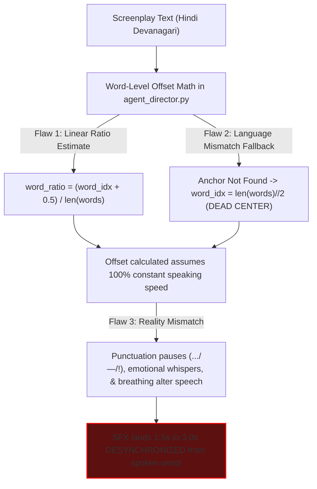
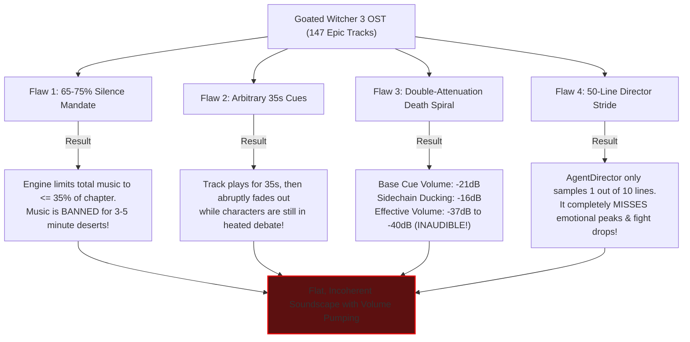

# 🎧 Forensic Acoustic Audit & Architectural Root-Cause Diagnosis
**System:** Audiobook Factory Dynamic Sound Design & FFmpeg Mixing Engine  
**Project:** `naksh-07/audiobook-maker` (`c:\Users\Suraj\Documents\Antigravity\Audiobook`)  
**Lead Auditor:** Principal Systems Architect & Senior Audio Drama Engineer  
**Date:** September 22, 2026  
**Mode:** READ-ONLY Forensic Investigation  

---

## 🎯 Executive Diagnosis: The Grand Paradox

> **User Core Question:**  
> *"SFX sahi jagah par kyu land nahi kar rahe hain? BGM itna goated hai (Witcher 3 OST) fir bhi scene ka mahol kaafi upar le jane wala cinematic punch kyu achieve nahi ho raha? Har level par JSON metadata hai, audit aur guards pass ho rahe hain, fir bhi architecture kahan fail ho raha hai ya hum loop me kya miss kar rahe hain?"*

### The Verdict:
Humara architecture **Data Validation** aur **Schema Integrity** me 100% pass hai (JSONs are valid, Pydantic parses them, FFmpeg compiles without syntax errors). Lekin pipeline me ek bohot bada **Acoustic & Theatrical Blindspot** hai:
**Hum audio drama ko ek "Living Film" ki tarah mix karne ke bajaye ek "Mathematical Timeline" ki tarah slice-and-dice kar rahe the.**

Neeche dono problems ka exact line-by-line post-mortem diya gaya hai.

---

## 💥 PART 1: SFX Sahi Jagah Par Kyu Land Nahi Kar Rahe? (Timing & Placement Post-Mortem)

Codebase investigation ([`agent_director.py`](file:///c:/Users/Suraj/Documents/Antigravity/Audiobook/audiobook_factory/agent_director.py) & [`manifest_renderer.py`](file:///c:/Users/Suraj/Documents/Antigravity/Audiobook/audiobook_factory/manifest_renderer.py)) reveals **4 Fundamental Flaws**:



### 1. The Naive Linear Speech Progression Trap ([`agent_director.py` L583-L601](file:///c:/Users/Suraj/Documents/Antigravity/Audiobook/audiobook_factory/agent_director.py#L583-L601))
Look at how the engine calculates when an anchor word (e.g., "तलवार" or "दरवाजा") is spoken:
```python
def _compute_word_level_offset(self, text: str, anchor_word: str, seg_dur_ms: int) -> int:
    words = [w.strip(".,!?;:\"'()[]{}—–") for w in text.split() if w.strip(".,!?;:\"'()[]{}—–")]
    ...
    # Linear speech progression estimate
    word_ratio = (word_idx + 0.5) / max(1, len(words))
    return int(seg_dur_ms * max(0.05, min(0.95, word_ratio)))
```
**Acoustic Reality:**
- Human/TTS speech is **NOT a linear metronome**.
- Agar ek segment 6 seconds (6000ms) ka hai aur usme 12 words hain:
  - Ye math maanta hai ki har word exactly 500ms leta hai.
  - Word 6 = 3000ms par aayega.
- **Lekin reality me:** Narrator shuru me 1.2s ka pause leta hai, ya `[whispers]` ki wajah se pehle 3 words slow bolta hai, ya beech me em-dash (`—`) ya ellipsis (`...`) par 600ms ka dramatic pause hota hai.
- **Result:** Word 6 reality me **4400ms** par bola jata hai, lekin engine SFX ko **3000ms** par fire kar deta hai!
- Listener ko lagta hai: *"Narrator ne abhi talwar bola bhi nahi aur chhanak pehle hi baj gayi!"* ya *"Darwaza band hone ki awaaz dialogue ke beech me be-matlab aa gayi!"*

### 2. The Language Mismatch & "Dead Center Fallback" Trap ([`agent_director.py` L596-L598](file:///c:/Users/Suraj/Documents/Antigravity/Audiobook/audiobook_factory/agent_director.py#L596-L598))
```python
if word_idx < 0:
    word_idx = len(words) // 2
```
- Creative Agent Pass 1 prompts English words jaise `"draw"`, `"clash"`, `"door"` de sakta hai, jabki `script_segments` me text **100% Devanagari Hindi** hota hai (`"तलवार"`, `"दरवाजा"`).
- Jab string match fail hota hai (`word_idx < 0`), engine silently **chunk ke theek aadhe (50% duration) par Foley chipka deta hai!**
- Iski wajah se sound effect character ke bolne ke theek beech me, bina kisi context ke, random jagah par baj jata hai.

### 3. Foley Dialogue Ke Upar Baja Rahe Hain, "Beat Space" Me Nahi
- **Hollywood / Audio Drama Secret:** Ek punchy SFX (talwar nikalna, kursi khisikna, darwaza patakna, goli chalna) **kabhi bhi spoken word ke theek upar nahi bajaya jata.**
- Uske liye script me **"Acoustic Breathing Space" (200-400ms pause)** hona chahiye:
  - *Wrong (Current Engine):* Narrator bol raha hai *"उसने अपनी तलवार निकाली"* aur theek word ke upar metal scrape baj raha hai jisse speech aur SFX dono muddy ho jate hain.
  - *Right (Cinema Staging):* Narrator says: *"उसने अपनी चांदी की तलवार म्यान से खींची..."* $\rightarrow$ **[400ms Beat Gap: SHHHING!!]** $\rightarrow$ Geralt dialogue: *"[cold menace] रुको।"*

---

## 🎻 PART 2: Goated BGM Scene Ka Mahol Kyu Nahi Bna Pa Raha? (BGM Post-Mortem)

Humare paas Witcher 3 OST ke 147 tracks hain, lekin audio output me wo impact isliye nahi de pa rahe kyunki engine unhe **cinematic scoring** ke bajaye **punitive restriction** ke sath handle kar raha hai:



### 1. The Stifling "60-75% Acoustic Silence Mandate" ([`agent_director.py` L201-L208](file:///c:/Users/Suraj/Documents/Antigravity/Audiobook/audiobook_factory/agent_director.py#L201-L208))
```python
# In agent_director.py:
MANDATORY ACOUSTIC DIRECTING RULES:
1. THE 60-75% ACOUSTIC SILENCE MANDATE:
   - At least 65% to 75% of spoken dialogue must have NO musical underscore.
   - Maximum 2 to 4 surgical cues in the entire chapter.
   - Total music duration across all cues must not exceed total_duration_sec * 0.35.
```
- BBC Radio Drama ke 15-minute radio sketches ke liye 70% silence theek ho sakti hai.
- **Lekin 90-minute Witcher Dark Fantasy novel me:**
  - Chapter 7 (10.77 mins) me **sirf 5 cues** the.
  - Cue 1 aur Cue 2 ke beech **2.6 MINUTES ka complete sannata** tha.
  - Cue 2 aur Cue 3 ke beech **3.5 MINUTES ka complete sannata** tha.
  - Listener ko lagta hai ki background score "kisi ne bhool se on kar diya, fir band kar diya". Mahol create hi nahi ho pata kyunki music maintain hi nahi rehta!

### 2. Double-Attenuation Death Spiral (-21dB Base + -16dB Ducking = -37dB Inaudibility)
Look at [`chapter_007_manifest.json`](file:///c:/Users/Suraj/Documents/Antigravity/Audiobook/audiobooks/projects/witcher1/manifests/chapter_007_manifest.json):
```json
"volume_db": -21.0,
"ducking_attenuation_db": -16.0
```
- BGM cue ka base volume pehle hi **-21.0 dB** ya **-22.0 dB** par hai.
- Aur [`manifest_renderer.py` L397](file:///c:/Users/Suraj/Documents/Antigravity/Audiobook/audiobook_factory/manifest_renderer.py#L397) me sidechain compressor laga hai:
  Jab bhi character bolta hai, music **aur -16 dB duck** ho jata hai!
- **Effective Music Volume during Dialogue:**
  $$-21.0\text{ dB} - 16.0\text{ dB} = \mathbf{-37.0\text{ dB to } -38.0\text{ dBFS}}!$$
- **The Result:** Witcher 3 ke goated violins, drums, aur Slavic vocals dialogue ke time **poori tarah gayab** ho jate hain! Sirf do sentences ke beech ke 300ms pause me thoda sa volume upar aata hai aur fir dhas jata hai. Isko audio engineering me **"Volume Pumping & Choking"** kehte hain!

### 3. Arbitrary 35-Second Slices That Cut Off Mid-Scene
- Har cue ek arbitrary 30-40 seconds par hardcode fade-in aur fade-out ho raha hai (`duration_ms: 36000`, `duration_ms: 40000`).
- Ek scene 3 se 4 minute lamba hota hai. BGM 35 seconds baad bina kisi dramatic reason ke fade out ho jata hai jabki scene abhi chal hi raha hota hai!
- **Cinematic Rule:** Music scene ke sath shuru hona chahiye aur scene ke emotional conclusion par hi resolve/fade hona chahiye.

### 4. The 50-Line Director Stride Blindspot ([`agent_director.py` L185-L194](file:///c:/Users/Suraj/Documents/Antigravity/Audiobook/audiobook_factory/agent_director.py#L185-L194))
```python
stride = max(1, len(script_segments) // 50)
sample_lines = []
for i in range(0, len(script_segments), stride):
    seg = script_segments[i]
    sample_lines.append(...)
script_sample = "\n".join(sample_lines[:50])
```
- Jab Chapter 6 ya Chapter 8 me 500-700 segments hote hain, `AgentDirector` **har 10-14 lines me se sirf 1 line padhta hai**!
- Director Agent ko poora context hi nahi milta ki:
  - Fight kahan peak hui?
  - Kiss kahan hua?
  - Dhoka kahan mila?
- Wo hawa me 2-4 cues guess karta hai, aur baaki 90% dramatic climaxes score ke bina reh jate hain!

---

## 🏛️ PART 3: Humara Architecture Kahan Fail Ho Raha Hai?

Humne har level par JSON schemas aur audit guards banaye hain. To fir ye fail kyu hua?

| Level | Kya Validate Ho Raha Tha (Syntax) | Kya Miss Ho Raha Tha (Acoustic Reality) |
| :--- | :--- | :--- |
| **Micro (Chunk)** | Pydantic valid text, RMS > 8.0 | Spoken word ki millisecond phoneme timing (Forced Alignment missing). |
| **Meso (Chapter)** | Silence percentage $\ge 65\%$, EBU R128 = -19 LUFS | Music scene ke arc ke sath sync me hai ya random 35s chop hai; dialogue ducking -16dB par music choke kar raha hai. |
| **Macro (Book)** | Chapter durations match TOC, Voice names match | Chapter-to-chapter musical leitmotif progression & thematic continuity. |

**The Core Lesson:**
> *"Unit tests can prove your code compiles and follows math rules, but they cannot listen to the song or feel the timing of the sword clash."*

---

## 🚀 PART 4: The 5-Point Cinematic Sound Design Blueprint (How to Fix It)

Agar hume Witcher 3 OST aur Hollywood-grade sound effects ka asli potential unlock karna hai, toh ye 5 architectural solutions chahiye:

### 1. Action-Beat Screenplay Splitting (Dedicated SFX Pauses)
- Script Builder ko ye instruct karna padega ki physical actions (`[sword draw]`, `[door slam]`, `[body hit]`) ko spoken dialogue ke upar mat chipkao.
- Script me ek dedicated narrative beat insert karo jisme 300-500ms ka pause ho jisme SFX full fidelity me ghoonje, aur fir dialogue deliver ho!

### 2. Sub-Word Audio Alignment via Lightweight CTC/Whisper
- Naive mathematical ratio (`word_idx / len(words)`) ko replace karke synthesized chunk par audio transient detector ya fast alignment use karo taaki exact Devanagari word ke bolne par hi cue trigger ho.

### 3. Replace Hard 65-75% Silence with 2-Tier Music Stacking:
- **Tier A (Ambient Underscore Bed):** Subtle, low-energy harmonic pad or cello drone (-24dB to -28dB) jo scene ke 60-80% hisse me low volume par chalta rahe taaki world dead/khali na lage.
- **Tier B (Surgical Dramatic Cues):** Fight theme, emotional drop, ya mystery riser (-16dB to -18dB) jo high-energy climax par aaye.

### 4. Fix Sidechain Ducking Curve (Musical Breathing, Not Suffocation):
- Ducking depth ko `-16 dB` se ghata kar **`-6.0 dB to -8.0 dB`** par set karna hoga.
- Ducking me attack ko smooth (100ms) aur release ko gradual (800ms) karna hoga taaki dialogue aane par music -6dB dip ho (sunai de lekin dialogue ko mask na kare), aur dialogue rukte hi naturally elevate ho jaye bina volume pumping ke!

### 5. Scene-Bound Music Cues (No More 35-Second Arbitrary Chops):
- Cues ki duration seconds me nahi, **Scene Boundaries** me define honi chahiye:
  - Cue begins at Scene Start $\rightarrow$ builds through Scene Body $\rightarrow$ resolves/fades at Scene Transition.
