# 🏛️ Architecture: The 4-Room Cinematic Audio Drama Engine

## Executive Overview

**Audiobook Maker (Audiobook Factory v4.0)** is an autonomous, studio-grade audiobook production system modeled after the high-end multi-track standards of **Audible Drama** and **GraphicAudio ("A Movie in Your Mind")**.

Unlike legacy audiobook generators that simply pipe unformatted text into a Text-to-Speech (TTS) engine and append speech files together, Audiobook Maker implements a **modular 4-Room Architecture** with **6 Quality Verification Gates**, **5 Discrete Audio Stems**, and an **Autonomous Agentic Director**.

---

## 🏗️ High-Level 4-Room Blueprint

```mermaid
flowchart TB
    subgraph Room1["🚪 Room 1: Creative Production Room"]
        direction TB
        RawBook["Raw Book File<br/>(EPUB / PDF / TXT / Markdown)"] --> RawArchive["Sacred Raw Archive<br/>(raw/source_original + SHA-256)"]
        RawArchive --> Extractor["Forensic Ingestion Engine (Pillar 1)<br/>(audiobook_factory/extractor.py)<br/>• Single-pass EPUB DOM & Anchor Slicing<br/>• Layout-Aware PDF + 4-Signal Heuristic<br/>• Non-Destructive Unicode Normalizer"]
        Extractor --> AST["Canonical AST Model<br/>(canonical/book.json & quality_report.json)"]
        AST --> Gate01{"Gate 0.1:<br/>Ingestion Quality Gate<br/>(Fail-Closed on REVIEW)"}
        Gate01 -->|PASS / WARN| Chapters["Projected Chapter Markdown<br/>(extracted/chapter_XXX.md)"]
        Chapters --> Translator["Literary Translation Intelligence Engine (Hardening v2.0)<br/>(audiobook_factory/translation/ & translator.py)<br/>• BookBible v2.0 + EntityDiscoveryEngine<br/>• SourceSemanticMap v2.0 & TargetSemanticMap Alignment<br/>• Contextual Hindustani & 7D Calibrated Intensity<br/>• World & Character Memory 2.0 (Epistemic Continuity)"]
        Translator --> Certifier{"Gates T0–T15:<br/>4-Tier Certification State Machine &<br/>TieredRepairEngine (L1/L2/L3)"}
        Certifier -->|Certified + 11-Dim Provenance Seal| Sanitizer["Linguistic Sanitizer & Literary Register Guardrail<br/>(audiobook_factory/sanitizer.py & advisory_lexicon.py)<br/>• Non-Destructive Rustic Voice Preservation"]
        Sanitizer --> Dramaturgy["Stage 3: Dramaturgy & Screenplay Engine<br/>(audiobook_factory/dramaturgy/ & script_builder.py)<br/>• Organic SceneAnalyzer & Actioning BeatPlanner<br/>• Beat-Aligned Chunk Slicer (Zero Cut Boundary Flaw)<br/>• PerformanceBibleGenerator (Sociolect Archetypes)"]
        Dramaturgy --> Gate25{"Gate 2.5:<br/>Dramatic Fidelity Audit<br/>(Fail-Closed 8 Pillars)"}
        Gate25 -->|PASS| Scripts["Standardized Screenplay Script JSON<br/>(Speaker, Emotion, Spatial Pan, Intensity, Breath)"]
        Scripts --> PerfRealization["Dramatic Performance Realization Layer (ADR-032)<br/>(audiobook_factory/performance/)<br/>• PerformanceDirector & TimingRealizer<br/>• ConversationalChemistry Turn Coupling<br/>• Priority Multi-Take Synthesis (TakeBank)<br/>• 8D Evaluator & Intelligent Take Selector"]
        PerfRealization --> PronunciationQA["Pronunciation & Spoken QA Subsystem (ADR-022)<br/>(audiobook_factory/pronunciation/)<br/>• Dual-Layer SpokenTextEngine & Tag Shield<br/>• Deterministic 7-Tier Resolver (T1–T7)<br/>• Meta MMS_FA CTC Alignment QA & Repair"]
        PronunciationQA --> Gate28{"Gate 2.8:<br/>Performance Fidelity Gate<br/>(Fail-Closed Pre-Mix QC)"}
        Gate28 -->|PASS| Chunks["Selected Speech Takes (24kHz Mono PCM) &<br/>PerformanceDirection Stems"]
        Chunks --> Editorial["Dialogue Editorial Layer (DE-01–DE-04)<br/>(audiobook_factory/dialogue_editing/)<br/>• Non-Destructive Endpoint Snapping & C2PA Scrub<br/>• Conservative Breath & Sob Safeguards<br/>• Contextual Turn Latency & Aposiopesis<br/>• Fail-Closed DialogueEditingQC & TPDF Dither"]
        Editorial --> EditedChunks["Edited Takes (edited_chunks/) &<br/>DialogueEditPlan Manifests"]
    end

    subgraph Room2["🚪 Room 2: Agentic Directing Layer (Strict Agent Mandate)"]
        direction TB
        Bible["Global Lore & Sonic Bible<br/>(sound_bible.json)"] --> Director["AgentDirector 3-Pass Workflow<br/>(audiobook_factory/agent_director.py)<br/>• No Script Overrides"]
        Scripts --> Director
        EditedChunks --> Director
        Director --> Pass1["Pass 1: Dramaturgy & Silence Carving<br/>(>= 60.0% Silence Mandate)"]
        Pass1 --> Pass2["Pass 2: Music Director<br/>(FTS5 Search & Character Leitmotifs)"]
        Pass2 --> Pass3["Pass 3: Acoustic Foley Miner<br/>(Word Alignment & -6dB Whisper Attenuation)"]
        Pass3 --> Manifest["CreativeManifest v3.0 / CinemaAudioManifest"]
    end

    subgraph Room3["🚪 Room 3: Acoustic Compositor & DSP Mastering"]
        direction TB
        Manifest --> Renderer["Manifest Soundscape Renderer<br/>(audiobook_factory/manifest_renderer.py)"]
        SoundBank["SQLite FTS5 Sound Bank<br/>(audiobooks/sound_bank/)"] --> Renderer
        Renderer --> Ducking["Whisper-Safe Sidechain Ducking<br/>(Threshold 0.018 linear / -34.9 dBFS)"]
        Renderer --> Reverb["Dynamic Room Reverb Presets<br/>(Cathedral, Bedroom, Open Road, Stone Hall)"]
        Renderer --> DSPMaster["5-Stage DSP Mastering Chain<br/>(audiobook_factory/mastering.py)"]
    end

    subgraph Room4["🚪 Room 4: Cinema Discrete Multi-Stem Engine"]
        direction TB
        Manifest --> CinemaEngine["Cinema Audio Engine<br/>(audiobook_factory/cinema_audio_engine.py)<br/>• Music-Only 2.2kHz Notch EQ"]
        DSPMaster --> CinemaEngine
        CinemaEngine --> Stems["Discrete 5-Track DME Stems:<br/>- stem_DX.wav (Dialogue)<br/>- stem_MX.wav (Music)<br/>- stem_FX.wav (Foley/SFX)<br/>- stem_AMB.wav (Ambience)<br/>- stem_ME.wav (Music & FX)"]
        CinemaEngine --> FullMaster["Cinema Broadcast Master<br/>(EBU R128: -19 LUFS, -1.5 dBTP)"]
        CinemaEngine --> StemLedger["chapter_XXX_stem_ledger.json"]
    end

    Room1 --> Room2
    Room2 --> Room3
    Room2 --> Room4
    Room3 --> Room4
    Room4 --> Packager["M4B Container Packager<br/>(audiobook_factory/packager.py)<br/>• AAC Safety Auto-Transcode"]
    Packager --> Deliverable["Final M4B Audiobook<br/>(Chapter Navigation + FastStart Artwork)"]
```

---

## 🚪 Deep-Dive: The Four Production Rooms

### 1. Room 1: Creative Production Room
*Purpose: Convert unstructured literature into structured, attributed dramatic screenplay assets.*

- **Forensic Document Ingestion Engine & Universal Extractor ([`audiobook_factory/extractor.py`](file:///c:/Users/Suraj/Documents/Antigravity/Audiobook/audiobook_factory/extractor.py))** *(Pillar 1 Upgrades; see [`docs/FORENSIC_DOCUMENT_INGESTION.md`](file:///c:/Users/Suraj/Documents/Antigravity/Audiobook/docs/FORENSIC_DOCUMENT_INGESTION.md))*:
  - **Sacred Raw Source Archival:** Computes SHA-256 checksum and preserves a bit-for-bit verbatim replica in `raw/source_original.<ext>` accompanied by `raw/source_manifest.json` before any extraction or normalization begins.
  - **Canonical Book AST ([`audiobook_factory/book_model.py`](file:///c:/Users/Suraj/Documents/Antigravity/Audiobook/audiobook_factory/book_model.py)):** Assembles a strongly typed Pydantic v2 document graph ([`CanonicalBook`](file:///c:/Users/Suraj/Documents/Antigravity/Audiobook/audiobook_factory/book_model.py#L236-L355) $\rightarrow$ [`CanonicalChapter`](file:///c:/Users/Suraj/Documents/Antigravity/Audiobook/audiobook_factory/book_model.py#L92-L173) $\rightarrow$ [`CanonicalBlock`](file:///c:/Users/Suraj/Documents/Antigravity/Audiobook/audiobook_factory/book_model.py#L76-L90)) serialized to `canonical/book.json`. Preserves sacred raw text alongside speech-normalized text and block-level forensic provenance ([`SourceProvenance`](file:///c:/Users/Suraj/Documents/Antigravity/Audiobook/audiobook_factory/book_model.py#L54-L74): page, page_end, line_start, line_end, column_index, spine item, HTML tag, anchor ID, character offset, reading order).
  - **Non-Destructive Literary Normalizer ([`audiobook_factory/normalizer.py`](file:///c:/Users/Suraj/Documents/Antigravity/Audiobook/audiobook_factory/normalizer.py)):** Applies Unicode NFC normalization, zero-width stripping (`\u200b`, `\u200c`, `\u200d`, `\ufeff`, `\u2060`, `\u00ad`), and C0/C1 control code hygiene (`[\x00-\x08\x0b\x0c\x0e-\x1f\x7f-\x9f]`, e.g. `\x00`, `\x07`) strictly on `normalized_text` while leaving `raw_text` unmutated. Heals hyphenated linebreaks across line wraps in Latin, Accented Latin (`\u00C0-\u024F\u1E00-\u1EFF`), and Devanagari (`\u0900-\u097F`).
  - **PDF Reading Order & Layout Reconstruction ([`PDFLayoutReconstructor`](file:///c:/Users/Suraj/Documents/Antigravity/Audiobook/audiobook_factory/pdf_engine.py#L53-L580)):** Geometric span extraction from `pypdf` content streams (`TextStateManager`), baseline horizontal segment merging across gutters, recursive XY-cut multi-column (2-column, 3-column) and spanning banner decomposition, cross-column mid-sentence/hyphenation continuation joining, single-column dialogue/epigraph false-split prevention (`same_row_pairs`, dense column stacks), and layout whitespace-aligned fallback (`reconstruct_multicolumn_text`).
  - **End-to-End PDF Provenance Indexing ([`ForensicPDFEngine`](file:///c:/Users/Suraj/Documents/Antigravity/Audiobook/audiobook_factory/pdf_engine.py#L1196-L1655)):** Character-accurate `_PDFPageSpanRecord` indexing mapping document ranges `[doc_char_start, doc_char_end)` back to source pages, handling cross-page mid-sentence paragraph joining (`page_number` + `page_end`), and lossless forwarding into canonical chapters and blocks.
  - **Multi-Signal Escalation Quality Gate ([`PDFQualityAnalyzer`](file:///c:/Users/Suraj/Documents/Antigravity/Audiobook/audiobook_factory/pdf_engine.py#L628-L960)):** Evaluates local vs. Gemini multimodal candidates using composite scoring ($0.40 \times \text{reading\_order} + 0.45 \times \text{text\_integrity} + 0.15 \times \text{sentence\_coherence}$) with hard disqualification guards for conversational LLM refusals, 4-gram repetition loops, replacement char (`\ufffd`) regressions, and prose truncation ($> 45\%$ clean word loss).
  - **Literary Chapter vs. Production Chunk Architecture:** Explicitly distinguishes authentic authorial chapters (`unit_type="literary_chapter"`, `is_literary_chapter=True`) from artificial processing chunks (`unit_type="production_chunk"`), tracking `boundary_origin` (`detected_heading`, `toc_navigation`, `inferred_prologue`, `semantic_split_chunk`, `fallback_production_chunk`, `spine_fallback`). Provides `book.get_literary_chapters()` for unified reader TOCs and `book.get_production_chunks()` for execution limits.
  - **Meso-Tier Chapter Segmentation & Semantic Splitter ([`audiobook_factory/chapter_segmenter.py`](file:///c:/Users/Suraj/Documents/Antigravity/Audiobook/audiobook_factory/chapter_segmenter.py)):** Multi-tier regex heading recognition with uppercase dialogue shouting defense, enforcing a **12,000-word chapter ceiling** using a 5-tier semantic splitting hierarchy preserving section subheadings (`###`) and scene breaks (`* * *`).
  - **Independent Ingestion Quality Gate (Gate 0.1) ([`audiobook_factory/quality_gate.py`](file:///c:/Users/Suraj/Documents/Antigravity/Audiobook/audiobook_factory/quality_gate.py)):** Independent fail-closed audit evaluating word count floors ($> 50$ words), non-empty chapters ($> 5$ words), suspicious page ratios ($< 25\%$), and fallback chunk telemetry. Emits `canonical/quality_report.json` and raises actionable [`ExtractionGateAuditError`](file:///c:/Users/Suraj/Documents/Antigravity/Audiobook/audiobook_factory/book_model.py#L43-L52) upon `REVIEW` status (bypassable via `--force-gate`).
  - **Dual-Layer Legacy Projection:** Deterministically projects canonical chapters into backward-compatible `extracted/chapter_XXX.md` and `metadata.json` for seamless execution across all downstream pipeline stages.
- **Literary Translation Intelligence Engine & Hindustani Translator ([`audiobook_factory/translation/`](file:///c:/Users/Suraj/Documents/Antigravity/Audiobook/audiobook_factory/translation/) & [`audiobook_factory/translator.py`](file:///c:/Users/Suraj/Documents/Antigravity/Audiobook/audiobook_factory/translator.py))** *(Pillar 2 Hardening v2.0; see [`docs/LITERARY_TRANSLATION_INTELLIGENCE.md`](file:///c:/Users/Suraj/Documents/Antigravity/Audiobook/docs/LITERARY_TRANSLATION_INTELLIGENCE.md))*:
  - **Persistent Canonical Book Bible (`v2.0.0`) & Entity Discovery:** Stores canonical characters, locations, organizations, creatures, titles, and decoupled `terminology_variants` in `book_bible.json` with deterministic 16-char SHA-256 versioning (`get_version_hash()`) and backward-compatible `export_legacy_glossary()`. Stopword-hardened [`EntityDiscoveryEngine`](file:///c:/Users/Suraj/Documents/Antigravity/Audiobook/audiobook_factory/translation/entity_discovery.py) auto-commits high-confidence entities ($\ge 0.80$) and logs `FlaggedConflict` records on contradictions.
  - **Transition-Driven Scene Segmentation & Dual Semantic Maps:** [`ScenePlanner`](file:///c:/Users/Suraj/Documents/Antigravity/Audiobook/audiobook_factory/translation/scene_planner.py) segments chapters on genuine temporal/spatial transitions rather than arbitrary token boundaries. [`SourceSemanticMap`](file:///c:/Users/Suraj/Documents/Antigravity/Audiobook/audiobook_factory/translation/source_semantic_map.py) extracts atomic propositions (`WHO -> DID WHAT -> TO WHOM -> OBJECT -> NEGATION -> TIME/LOC`) with guaranteed non-empty actions and quotation tracking. [`TargetSemanticMap`](file:///c:/Users/Suraj/Documents/Antigravity/Audiobook/audiobook_factory/translation/source_semantic_map.py) mirrors Devanagari propositions.
  - **Beat-to-Beat Semantic Alignment (`SemanticAligner`):** Conducts proportional paragraph mapping under count divergence, verifies lexical negation parity (including *नहीं, मत, ना, न, बिना, बग़ैर, कभी नहीं, कुछ नहीं, कोई नहीं, इनकार, रोका, मना, नाकाम*), and outputs paragraph-indexed audit records (`affected_paragraphs: List[int]`).
  - **Contextual Hindustani Register (*"Aate mein Namak jitni Urdu"*):** [`HindustaniRegisterEngine`](file:///c:/Users/Suraj/Documents/Antigravity/Audiobook/audiobook_factory/translation/hindustani_register.py) replaces rigid numeric Urdu quotas with genre-adaptive lexical seasoning across `atmosphere_words`, `passion_and_somatics`, `combat_and_grit`, and `scholastic_and_courtly` domains, audited by Gate `T10` ($0.2\% - 8.0\%$).
  - **World & Character Memory 2.0 ([`audiobook_factory/translation/memory/`](file:///c:/Users/Suraj/Documents/Antigravity/Audiobook/audiobook_factory/translation/memory/))** *(See comprehensive guide: [`docs/WORLD_AND_CHARACTER_MEMORY_2_0.md`](file:///c:/Users/Suraj/Documents/Antigravity/Audiobook/docs/WORLD_AND_CHARACTER_MEMORY_2_0.md))*:
    - **6-Stage Scene Lifecycle (`READ -> ACT -> EXTRACT -> CALCULATE DELTAS -> VALIDATE -> COMMIT`):**
      1. *READ:* Pre-translation selective 7-tier retrieval (`MemoryRetriever.retrieve_for_scene()`) respecting an 800-token budget ceiling.
      2. *ACT:* Translation and screenplay synthesis guided by epistemic `MUST_NOT_KNOW` constraints and relationship honorific dynamics.
      3. *EXTRACT:* Change-triggered event detection (`SceneChangeDetector`) with noun/verb trigger matching, transitive attacker vs. victim disambiguation, and gated LLM event proposal with deterministic fallback and deduplication.
      4. *CALCULATE DELTAS:* Deterministic projection of StoryEvents into typed `StateDelta` objects across 5 domains (`CHARACTER`, `RELATIONSHIP`, `KNOWLEDGE`, `WORLD`, `NARRATIVE`), strictly preserving damaged/destroyed location conditions across movement events.
      5. *VALIDATE:* Enforces 7 contradiction guardrails (`CANON`, `TIMELINE`, `DEAD_CHARACTER`, `PHYSICAL_IMPOSSIBILITY`, `RELATIONSHIP_JUMP`, `KNOWLEDGE_LEAKAGE`, `WORLD_RULE`), producing a `MemoryValidationReport`.
      6. *COMMIT:* Versioned atomic commits (`memory_store.json`), isolating rejected contradictory events in `rejected_events` (preventing ghost event pollution in active timelines or salience queries) and synchronizing dynamic state with `BookBible`.
    - **Downstream Consumer Wiring:** Directly feeds conservative performance context (`memory_vocal_constraint`, `recommended_pronoun`, `recommended_register`) into `ScreenplaySegment` contracts ([`contracts.py`](file:///c:/Users/Suraj/Documents/Antigravity/Audiobook/audiobook_factory/contracts.py)), audited by Gate `T6_relationship_memory` ([`certification.py`](file:///c:/Users/Suraj/Documents/Antigravity/Audiobook/audiobook_factory/translation/certification.py)), persisted back to disk in `orchestrator.py`, and rendered as vocal style descriptors in `TTSDispatcher` speech synthesis.
  - **12-Gate Independent Certification & 4-Tier State Machine:** [`TranslationCertifier`](file:///c:/Users/Suraj/Documents/Antigravity/Audiobook/audiobook_factory/translation/certification.py) audits Gates T0–T11 across length, terminology, semantic fidelity, omissions, additions, character voice, 7D intensity ($\pm 0.75$ soft `WARN`, $> 2.0$ hard `FAIL`), and literary naturalness. Resolves to `PASS`, `PASS_WITH_WARNINGS`, `AUTO_REPAIR`, `REVIEW_REQUIRED`, or `BLOCKED` with fail-closed gate halting.
  - **Multi-Tier `TieredRepairEngine`:** Level 1 deterministic Book Bible/calque fix (0ms) $\rightarrow$ Level 2 surgical paragraph rewrite on `affected_paragraphs` (`MAX_PARAGRAPH_ATTEMPTS=2`) $\rightarrow$ Level 3 scene retranslation (`MAX_SCENE_ATTEMPTS=1`). Sealed by an 11-dimension SHA-256 `composite_cache_key`.
  - **Default Pipeline Orchestration:** [`translate_book_project`](file:///c:/Users/Suraj/Documents/Antigravity/Audiobook/audiobook_factory/translator.py) defaults directly to [`IntelligentTranslationPipeline`](file:///c:/Users/Suraj/Documents/Antigravity/Audiobook/audiobook_factory/translation/orchestrator.py), invoked automatically during Stage 2.
  - **Adult Literary Mode & HBO/Manto Intimacy Framework (`ADULT_LITERARY_MODE=True`):**
    - **Anti-Bowdlerization & 70/30 Anti-Parody Invariant:** Preserves 70% canon lore alongside 30% visceral Hindustani sensory amplification without sanitizing combat, tavern curses, or somatic intimacy (`Rule 8` & `Rule 9`, **"Nothing Above Source"** principle).
- **Non-Destructive Linguistic Sanitizer & Literary Register Guardrail ([`audiobook_factory/sanitizer.py`](file:///c:/Users/Suraj/Documents/Antigravity/Audiobook/audiobook_factory/sanitizer.py) & [`audiobook_factory/advisory_lexicon.py`](file:///c:/Users/Suraj/Documents/Antigravity/Audiobook/audiobook_factory/advisory_lexicon.py))**:
  - **Non-Destructive Sanitizer Separation:** Unambiguous calques and clinical loanwords (`डिप्रेशन` $\rightarrow$ `उदासी का साया`, `ट्रॉमा` $\rightarrow$ `गहरा सदमा`, `स्ट्रेस` $\rightarrow$ `तनाव`, `सुनहरी लड़की` $\rightarrow$ `गोरी-चिट्टी लड़की`, `कुंवारी चोटी` $\rightarrow$ `कमसिन लड़की की चोटी`) are normalized in Tier 1 (`apply_substitutions=True`), while authentic rustic vocabulary and greetings (`नमस्ते`, `राम-राम`, `नमस्कार`, `दारू`, `सोने की लड़की`) are preserved unconditionally for character voice under `CONTEXTUAL_REGISTER_ADVISORIES`.
  - **Raw Profanity & Intimacy Preservation:** Zero-loss preservation of earthy Hindustani vocabulary, slang, and somatic erotic textures—never misclassifying raw literary realism as harmful content.
  - **Expanded Neural Vocal & Combat Tags:** Validates and preserves expressive inline tags recognized natively by Gemini 3.1 Flash TTS:
    - *Intimacy & Prosody:* `[whispers]`, `[intimate, breathy]`, `[sighs]`, `[gasp]`, `[trembling voice]`, `[growl]`, `[groan]`, `[spits]`, `[mocking chuckle]`.
    - *Combat & Action (ADR-017):* `[bellowing battlecry]`, `[combat strain]`, `[diaphragm strain]`, `[guttural grunt on blade deflect]`, `[spits blood]`, `[choked gasp]`, `[ragged heaving pant]`, `[slow motion]`.
  - **Defense-in-Depth Stripping:** Recursively removes LLM meta-commentary, conversational refusals, Devanagari non-vocal stage directions, markdown fences, and conversational preambles/postambles.
- **Stage 3: Dramatic Adaptation & Screenplay Engine ([`audiobook_factory/dramaturgy/`](file:///c:/Users/Suraj/Documents/Antigravity/Audiobook/audiobook_factory/dramaturgy/) & [`audiobook_factory/script_builder.py`](file:///c:/Users/Suraj/Documents/Antigravity/Audiobook/audiobook_factory/script_builder.py))** *(See comprehensive manual: [`docs/DRAMATIC_ADAPTATION_AND_SCREENPLAY.md`](file:///c:/Users/Suraj/Documents/Antigravity/Audiobook/docs/DRAMATIC_ADAPTATION_AND_SCREENPLAY.md))*:
  - **Dramaturgy Data Contracts ([`audiobook_factory/dramaturgy/contracts.py`](file:///c:/Users/Suraj/Documents/Antigravity/Audiobook/audiobook_factory/dramaturgy/contracts.py)):** Strictly typed Pydantic v2 schemas: [`DramaticBeat`](file:///c:/Users/Suraj/Documents/Antigravity/Audiobook/audiobook_factory/dramaturgy/contracts.py), [`SceneDramaticPlan`](file:///c:/Users/Suraj/Documents/Antigravity/Audiobook/audiobook_factory/dramaturgy/contracts.py), [`DramaticPlan`](file:///c:/Users/Suraj/Documents/Antigravity/Audiobook/audiobook_factory/dramaturgy/contracts.py), [`DramaticStateDelta`](file:///c:/Users/Suraj/Documents/Antigravity/Audiobook/audiobook_factory/dramaturgy/contracts.py), [`RelationshipShift`](file:///c:/Users/Suraj/Documents/Antigravity/Audiobook/audiobook_factory/dramaturgy/contracts.py), [`PhysicalBlocking`](file:///c:/Users/Suraj/Documents/Antigravity/Audiobook/audiobook_factory/dramaturgy/contracts.py), [`StoryConnectionRecord`](file:///c:/Users/Suraj/Documents/Antigravity/Audiobook/audiobook_factory/dramaturgy/contracts.py), [`ConversationalDynamic`](file:///c:/Users/Suraj/Documents/Antigravity/Audiobook/audiobook_factory/dramaturgy/contracts.py), [`DramaticSilenceIntent`](file:///c:/Users/Suraj/Documents/Antigravity/Audiobook/audiobook_factory/dramaturgy/contracts.py), [`AdaptationFidelityPolicy`](file:///c:/Users/Suraj/Documents/Antigravity/Audiobook/audiobook_factory/dramaturgy/contracts.py), [`PerformanceBible`](file:///c:/Users/Suraj/Documents/Antigravity/Audiobook/audiobook_factory/dramaturgy/contracts.py), and [`DramaticValidationResult`](file:///c:/Users/Suraj/Documents/Antigravity/Audiobook/audiobook_factory/dramaturgy/contracts.py).
  - **The 10 Refined Dramatic Capabilities (ADR-031):**
    1. *Beat Causality:* Unbroken causal chaining connecting stimulus $\rightarrow$ character response $\rightarrow$ consequence across beats using South Park (*"therefore"* / *"but"*) causality.
    2. *Dramatic State Delta:* Explicit representation of net transformation between scene entry and exit (`knowledge_delta`, `relationship_shifts`, `power_shift`, `danger_level_delta`, `decisions_made`, `emotional_trajectory`).
    3. *Relationship Evolution:* Tracks beat-level shifts in interpersonal dynamics (trust, hostility, cooperation, intimacy, fear, dominance).
    4. *Power & Information Dynamics:* Tracks tactical leverage holders, vulnerable characters, and audience dramatic irony (`listener_knowledge_state`).
    5. *Meaningful Physical Blocking:* Preserves material physical staging (threat display, barrier creation, territorial control) while filtering trivial fidgets.
    6. *Narrative Mode & Distance:* Distinguishes direct dialogue, narrator exposition, internal monologue (*duraangi zubaan*), and reported speech without flattening POV.
    7. *Explicit Adaptation & Fidelity Policy:* Enforces immutable source invariants (`AdaptationFidelityPolicy`), preventing fabricated plot events or reveals.
    8. *Long-Range Story Connections:* Connects beats and scenes to setup, foreshadowing, callbacks, and motifs without a separate redundant database.
    9. *Conversational Dynamics:* Captures turn-taking cutoffs (`--`, `—`), hesitation pauses (`...`), avoidance, and mid-dialogue strategy pivots.
    10. *Dramatic Silence Intent:* Identifies the narrative purpose of pauses (`shock`, `realization`, `grief`, `anticipation`) while strictly deferring DSP audio timing to Stage 10.
  - **Novel-Scale Beat-Aligned Chunk Slicing ([`slice_chapter_by_beats()`](file:///c:/Users/Suraj/Documents/Antigravity/Audiobook/audiobook_factory/dramaturgy/beat_planner.py#L321-L429)):** Aligns processing chunks strictly to natural scene breaks and intra-scene beat boundaries, preserving complete dramatic arcs.
  - **Performance Bible Generator ([`PerformanceBibleGenerator`](file:///c:/Users/Suraj/Documents/Antigravity/Audiobook/audiobook_factory/dramaturgy/performance_bible.py)):** Projects canonical character lore into actionable vocal delivery directives across 6 sociolect presets (`'COLD_CYNIC'`, `'CAUSTIC_ARISTOCRAT'`, `'THARKI_BARD'`, `'RUSTIC_WARRIOR'`, `'VULNERABLE_SCHOLAR'`, `'DEFAULT_DRAMATIC'`).
  - **Fail-Closed Gate 2.5 Dramatic Fidelity & Character Arc Validator ([`DramaticValidator`](file:///c:/Users/Suraj/Documents/Antigravity/Audiobook/audiobook_factory/dramaturgy/dramatic_validator.py) & [`audit_gate2_5_dramatic_fidelity()`](file:///c:/Users/Suraj/Documents/Antigravity/Audiobook/audiobook_factory/gate_auditor.py#L305-L371)):** 8-pillar independent verification audit enforcing structural integrity, character epistemics, anti-emotional teleportation, dialogue coverage, creative overreach guard, beat causality, state deltas, and fail-closed adaptation fidelity.
  - **Duraangi Zubaan (Inner Monologues):** Encodes unspoken internal thoughts contrasting outward speech as `[whispers] (मन में: ...)`, paired with `spatial.proximity: 'intimate_close'` and `acoustic_env: 'binaural_whisper'`.
  - **Cynical Protagonist Grunt Engine:** Automatically tags weary, cynical protagonist reactions with signature neural grunts (`[growl] हूँ...`, `[sighs] हम्म...`) and enforces `pause_after_ms` of 1000–1400ms for dramatic pregnant pause prosody.
  - **ASMR Intimacy Staging:** Automatically assigns `spatial.proximity: "intimate_close"`, dead-center `spatial.pan: 0.0`, dynamic intensity `low`, `pre_roll_breath_ms: 200-250`, and music sidechain attenuation of `-22.0 dB` ("The Erotic Silence").
  - **Combat Action-Beat Splitting & Dual-Perspective Staging (ADR-017):** Splits major kinetic strikes into dedicated 800ms – 1500ms speech-free intervals (`speaker: "Foley"`, `text: "[ACTION]"`), staging Attacker actions Left ($-0.6$), Defender parries Right ($+0.6$), and Fatal Clashes Center ($0.0$).
  - **Zero-Voice-Drift Hardening & Two-Pass Attribution (ADR-021):** Direct roster injection with explicit gender markers, and two-pass pronoun disambiguation ([`clean_screenplay_pass2()`](file:///c:/Users/Suraj/Documents/Antigravity/Audiobook/audiobook_factory/script_builder.py#L629-L853)) resolving both English (`he`, `she`, `the man`, `the woman`) and Hindi (`उसने`, `वह`, `आदमी`, `लड़की`, `महिला`) pronouns to the most recently active matching character, stripping parenthetical annotations (`Geralt (Witcher)` $\rightarrow$ `Geralt`), normalizing alias variants, and enriching segments with dramatic plan metadata.
- **Stage 3.5: Dramatic Performance Realization Layer & Gate 2.8 ([`audiobook_factory/performance/`](file:///c:/Users/Suraj/Documents/Antigravity/Audiobook/audiobook_factory/performance/))** *(ADR-032; see authoritative manual: [`docs/PERFORMANCE_REALIZATION_AND_ACTOR_DIRECTION.md`](file:///c:/Users/Suraj/Documents/Antigravity/Audiobook/docs/PERFORMANCE_REALIZATION_AND_ACTOR_DIRECTION.md))*:
  - **First-Class PerformanceDirection Contract ([`PerformanceDirection`](file:///c:/Users/Suraj/Documents/Antigravity/Audiobook/audiobook_factory/performance/contracts.py#L59-L154)):** Strongly typed Pydantic v2 contract decoupling author dialogue and dramatic intent from provider-specific TTS engines. Encapsulates 6 operational domains: Identity/Provenance, Dramatic State (objective, actioning, surface/underlying emotion, subtext), Relationship Dynamics (power position, leverage, vulnerability, social mask, intimacy), Vocal Behavior (pace, energy, pitch contour, resonance, texture, restraint), Timing & Respiration (pauses, breaths, hesitation, turn-taking), and Priority Take Allocation.
  - **Commercial Studio Voice Casting & Cast Lock Engine ([`audiobook_factory/casting/`](file:///c:/Users/Suraj/Documents/Antigravity/Audiobook/audiobook_factory/casting/))** *(ADR-023 / Waves 1-2)*:
    - **10-Dimensional Character Casting Profiler ([`CharacterCastingProfile`](file:///c:/Users/Suraj/Documents/Antigravity/Audiobook/audiobook_factory/casting/contracts.py)):** Quantifies character requirements across age bracket, gender, role hierarchy, vocal weight, texture, baseline pace, energy, restraint, dialect, and emotional flexibility.
    - **Multi-Pillar Candidate Ranking Engine ([`VoiceCandidateEngine`](file:///c:/Users/Suraj/Documents/Antigravity/Audiobook/audiobook_factory/casting/candidate_engine.py)):** Evaluates candidates against 12 flagship and regional personas, ranking by multi-dimensional Euclidean acoustic distance.
    - **Dynamic Audition Engine ([`VoiceAuditionEngine`](file:///c:/Users/Suraj/Documents/Antigravity/Audiobook/audiobook_factory/casting/audition_engine.py)):** Tests candidate voices across 10 audition modes (`exposition`, `dramatic_climax`, `whisper`, `banter`, `grief`, `menace`, `sarcasm`, `fatigue`, `tenderness`, `urgent`).
    - **Authoritative Cast Lock Manager ([`CastLockManager`](file:///c:/Users/Suraj/Documents/Antigravity/Audiobook/audiobook_factory/casting/cast_lock.py)):** Atomically seals character voice attributions in `cast_lock.json` with temporary file swaps, invalidates affected audio chunks upon recasting, and syncs backward-compatible `voice_registry.json`.
  - **Acoustic Voice Identity & Drift Defense ([`audiobook_factory/identity/`](file:///c:/Users/Suraj/Documents/Antigravity/Audiobook/audiobook_factory/identity/))**:
    - **4-Layer Voice DNA Specification ([`VoiceDNA`](file:///c:/Users/Suraj/Documents/Antigravity/Audiobook/audiobook_factory/identity/voice_dna.py)):** Encapsulates Core Acoustic Identity, Behavioral Delivery Rules, Emotional Elasticity bounds, and Forbidden Registers.
    - **Reference Voice Bank & Signature Extractor ([`ReferenceVoiceBank`](file:///c:/Users/Suraj/Documents/Antigravity/Audiobook/audiobook_factory/identity/reference_bank.py)):** Extracts $F_0$ median/IQR via normalized autocorrelation with energy thresholding (`energy < 1e6`), spectral centroid, spectral flatness, and RMS, persisting into `reference_signatures.json`.
    - **Voice Drift Analyzer ([`VoiceIdentityAnalyzer`](file:///c:/Users/Suraj/Documents/Antigravity/Audiobook/audiobook_factory/identity/voice_drift_analyzer.py)):** Audits synthesized audio against baseline acoustic signatures to detect and flag pitch or timbre drift over long books.
  - **Acting Intelligence Subsystem ([`audiobook_factory/performance/`](file:///c:/Users/Suraj/Documents/Antigravity/Audiobook/audiobook_factory/performance/))**:
    - **6D Scene Emotional Vector Tracking ([`SceneEmotionalStateTracker`](file:///c:/Users/Suraj/Documents/Antigravity/Audiobook/audiobook_factory/performance/scene_emotional_state.py)):** Models valence, arousal, dominance, tension, energy, and restraint with exponential smoothing trajectory convergence.
    - **Performance Constraint Resolver ([`PerformanceConstraintResolver`](file:///c:/Users/Suraj/Documents/Antigravity/Audiobook/audiobook_factory/performance/constraint_resolver.py)):** Resolves scene tension and character objectives into prioritized, actionable directives without adjective bloat.
    - **Continuous Generation Risk Engine ([`GenerationRiskEngine`](file:///c:/Users/Suraj/Documents/Antigravity/Audiobook/audiobook_factory/performance/risk_engine.py)):** Computes difficulty $R \in [0.0, 1.0]$ based on emotional volatility, physical strain, dialogue pace, and multi-speaker density, driving dynamic take strategies (`ISOLATED_SINGLE_TAKE`, `ISOLATED_MULTI_TAKE`, `CRITICAL_SCENE_TAKE`).
  - **Humanized Timing Realizer ([`TimingRealizer`](file:///c:/Users/Suraj/Documents/Antigravity/Audiobook/audiobook_factory/performance/timing_realizer.py)):** Translates Stage 3 dramatic silence intents into calibrated pause durations (shock: 1600ms, grief: 1800ms, realization: 1400ms), calculates organic pre-roll and post-roll breath intakes (150ms–280ms) for high tension or physical combat strain, and shapes power-position pause cadence.
  - **Actor Direction & Sociolect Archetype Projection ([`PerformanceDirector`](file:///c:/Users/Suraj/Documents/Antigravity/Audiobook/audiobook_factory/performance/director.py)):** Projects character sociolect profiles (`COLD_CYNIC`, `CAUSTIC_ARISTOCRAT`, `THARKI_BARD`) into vocal delivery directives, modulating restraint, pitch contour (`low_resonant`, `high_tense`), and resonance placement (`chest`, `whisper_air`).
  - **Anti-Emotional Teleportation Defense:** Actively intercepts volatile ungrounded emotional transitions across consecutive dialogue turns by the same character without explicit causal triggers (e.g. `calm` $\rightarrow$ `bellowing_rage`), dampening leaps into tense suppression with low-resonant chest grounding.
  - **Conversational Chemistry & Turn Coupling ([`ConversationalChemistry`](file:///c:/Users/Suraj/Documents/Antigravity/Audiobook/audiobook_factory/performance/chemistry.py)):** Dynamically couples adjacent dialogue turns between characters, enforcing zero-latency interruption snapping (`pause_before_ms = 0`), delayed hesitation on intimidation/threat, and intimate proximity acoustic resonance.
  - **Provider-Neutral TTS Performance Adapter ([`GeminiTTSPerformanceAdapter`](file:///c:/Users/Suraj/Documents/Antigravity/Audiobook/audiobook_factory/performance/tts_adapter.py)):** Translates performance directions into evocative, multi-token `speechMetadata.style` descriptors and calibrated micro-entropy temperatures while enforcing the **Sacred Spoken Text Immutability Guarantee** (`payload["part_payload"]["text"] == original_text`).
  - **Priority-Based Multi-Take Banking ([`TakeBank`](file:///c:/Users/Suraj/Documents/Antigravity/Audiobook/audiobook_factory/performance/take_bank.py)):** Generates candidate performance takes scaled by dramatic priority: `standard` (1 take), `focused` (2 takes), `high` (2-3 takes), and `climactic` (3-4 takes across `standard`, `more_restrained`, `more_vulnerable`, `slower_heavier`, `colder`, `more_urgent` variants).
  - **4-Pillar Performance QC Evaluator ([`PerformanceEvaluator`](file:///c:/Users/Suraj/Documents/Antigravity/Audiobook/audiobook_factory/performance/evaluator.py)):** Evaluates candidate takes across 4 pillars (Acoustic Quality 25%, Performance Match 30%, Voice Identity 25%, Relational Coherence 20%) with mathematical signal analysis.
  - **Intelligent Take Selector ([`IntelligentTakeSelector`](file:///c:/Users/Suraj/Documents/Antigravity/Audiobook/audiobook_factory/performance/take_selector.py)):** Enforces the **Non-Loudest Best Evaluation Principle**, selecting the winning performance take using composite scoring with restraint bonuses ($+0.06$) and relationship bonuses ($+0.04$) to prevent acoustic volume traps, accompanied by human-readable explainable audit trails.
  - **Long-Range Performance Continuity Tracker ([`PerformanceContinuityTracker`](file:///c:/Users/Suraj/Documents/Antigravity/Audiobook/audiobook_factory/performance/continuity.py)):** Maintains running character telemetry across scenes, issuing alerts when a character's average scene pace shifts by $> 30\%$ without dramatic motivation. Persists state atomically in `character_continuity.json` with bounded memory profiles (`paces[-200:]`).
  - **Fail-Closed Gate 2.8 Pre-Mix Performance Fidelity Gate ([`PerformanceFidelityGate`](file:///c:/Users/Suraj/Documents/Antigravity/Audiobook/audiobook_factory/performance/gate.py) & [`audit_gate2_8_performance_fidelity()`](file:///c:/Users/Suraj/Documents/Antigravity/Audiobook/audiobook_factory/gate_auditor.py#L373-L418)):** Audits chapter directions and selected takes prior to dialogue stem mastering, enforcing $\ge 0.70$ average composite score, $\ge 0.65$ naturalness floor, zero emotional teleportation violations, sacred text immutability, and $\ge 90\%$ take coverage.
- **Stage 3.8: Pronunciation & Spoken Language QA Subsystem (ADR-022)** ([`audiobook_factory/pronunciation/`](file:///c:/Users/Suraj/Documents/Antigravity/Audiobook/audiobook_factory/pronunciation/)) *(See authoritative manual: [`docs/PRONUNCIATION_AND_SPOKEN_LANGUAGE_QA.md`](file:///c:/Users/Suraj/Documents/Antigravity/Audiobook/docs/PRONUNCIATION_AND_SPOKEN_LANGUAGE_QA.md))*:
  - **Dual-Layer Text Decoupling:** Complete physical separation of sacred literary prose (`ScreenplaySegment.text`, strictly immutable for subtitles, display, and archive) from phonetically normalized TTS delivery payloads (`ScreenplaySegment.spoken_text` + `pronunciation_metadata`).
  - **Unicode-Safe Script & Dialect Classifier ([`language_detector.py`](file:///c:/Users/Suraj/Documents/Antigravity/Audiobook/audiobook_factory/pronunciation/language_detector.py) & [`code_switch.py`](file:///c:/Users/Suraj/Documents/Antigravity/Audiobook/audiobook_factory/pronunciation/code_switch.py)):** Distinguishes Perso-Arabic loanwords (`URDU_NUKTA_PATTERNS`: क़, ख़, ग़, ज़, फ़) from Sanskrit Tatsama conjuncts (क्ष, त्र, ज्ञ, श्र) and native Hindi retroflex flaps. Enforces **Option 1A Hybrid Mode** for foreign proper nouns in Hindi dialogue.
  - **Deterministic 7-Tier Pronunciation Resolver ([`PronunciationResolver`](file:///c:/Users/Suraj/Documents/Antigravity/Audiobook/audiobook_factory/pronunciation/resolver.py)):** Audits sensitive words across 7 strict tiers: Tier 1 Manual Override $\rightarrow$ Tier 2 Canonical BookBible $\rightarrow$ Tier 3 Verified Project History $\rightarrow$ Tier 4 Canonical Lexicon Entry $\rightarrow$ Tier 5 Deterministic Rules (currency expansion, percentages, Devanagari/Latin numerals up to 100M, compound units, acronym initialisms) $\rightarrow$ Tier 6 Model-Assisted Inference $\rightarrow$ Tier 7 `REVIEW_REQUIRED` (zero silent pass on unknown foreign tokens).
  - **Neural Acting Tag Shield:** Regex isolation (`ACTING_TAG_PATTERN`) passes bracketed theatrical cues (`[whispers]`, `[gasp]`, `[shouting]`, `[growl]`) through verbatim without phonetic corruption or verbalization.
  - **Acoustic Forced Alignment QA ([`PronunciationAudioQA`](file:///c:/Users/Suraj/Documents/Antigravity/Audiobook/audiobook_factory/pronunciation/auditor.py)):** Meta MMS_FA CTC alignment on GPU/CPU (with proportional energy valley fallback) computes frame-level start/end spans for sensitive entities. Detects swallowed/omitted tokens ($< \max(60, \text{syllables} \times 45)\text{ms}$), stutter repetitions ($> \max(1200, \text{syllables} \times 350)\text{ms}$), and rushed/dragging cadence anomalies.
  - **Targeted Single-Take Repair Engine ([`PronunciationRepairEngine`](file:///c:/Users/Suraj/Documents/Antigravity/Audiobook/audiobook_factory/pronunciation/repair.py)):** Surgical single-take retry bounded by a strict circuit breaker (max 1 retry), injecting rhythmic acoustic micro-pauses (commas) around omitted tokens and atomically promoting `.tmp.wav` files upon verified audio QA passage.
  - **Cross-Chapter Pronunciation Drift Auditor ([`CrossChapterConsistencyAuditor`](file:///c:/Users/Suraj/Documents/Antigravity/Audiobook/audiobook_factory/pronunciation/consistency.py)):** Tracks recurring entities across all chapter screenplay scripts, flagging unauthorized phonetic variances (audited at scene level by Gate T15 and fail-closed at master level by Gate 6E).
  - **Cryptographic Lexicon Provenance ([`PronunciationProvenanceTracker`](file:///c:/Users/Suraj/Documents/Antigravity/Audiobook/audiobook_factory/pronunciation/provenance.py)):** Computes deterministic 16-char SHA-256 hash of active lexicon entries, sealing it into the 11-dimension translation composite key to cleanly invalidate downstream cached takes upon pronunciation edits.
- **Precision Speech Synthesizer ([`audiobook_factory/tts_dispatcher.py`](file:///c:/Users/Suraj/Documents/Antigravity/Audiobook/audiobook_factory/tts_dispatcher.py))**:
  *(See authoritative manuals: [`docs/GEMINI_TTS_SYNTHESIS_AND_DIRECTING.md`](file:///c:/Users/Suraj/Documents/Antigravity/Audiobook/docs/GEMINI_TTS_SYNTHESIS_AND_DIRECTING.md) and [`docs/VOICE_CASTING_DIRECTOR_GUIDE.md`](file:///c:/Users/Suraj/Documents/Antigravity/Audiobook/docs/VOICE_CASTING_DIRECTOR_GUIDE.md))*
  - **Generative Audio Modeling**: Google Gemini 3.8 Flash TTS API (`models/gemini-3.8-flash-tts` & `models/gemini-3.8-flash-lite-tts`) featuring an expansive **16,384 audio token output window** (~7–8 minutes of continuous dramatic speech per call).
  - **Dual-Channel Theatrical Directing**: Complete physical separation of spoken text from acting performance directives (`speechMetadata.style`) and endogenous biological vocal synthetics (`<gasp>`, `<sigh>`, `<sob>`, `<laugh>`, `<pant>`).
  - **Universal Character-to-Voice Matrix**: 30 flagship voices (`Algenib`, `Puck`, `Kore`, `Fenrir`, `Aoede`, `Charon`, etc.) and 120 regional Indian personas (`en-IN`) matched to universal novel archetypes (`COLD_CYNIC`, `THEATRICAL_WIT`).
  - **Permanent Safety Filter Unlock (ADR-019):** Configures explicit `safetySettings: [BLOCK_NONE]` across all 4 harm categories (`HARM_CATEGORY_HARASSMENT`, `HARM_CATEGORY_HATE_SPEECH`, `HARM_CATEGORY_SEXUALLY_EXPLICIT`, `HARM_CATEGORY_DANGEROUS_CONTENT`), permanently preventing false-positive censorship on mature literature.
  - **Fail-Closed Voice Registry Validation (ADR-021):** Pre-flights all segments before API dispatch, raising `UnregisteredSpeakerError` on unmapped dialogue speakers. Strictly prohibits silent fallback to Narrator (`Aoede`), auto-resolving canonical character aliases and checking gender alignment.
  - **Token-Bucket Concurrency & Quota Isolation**: Thread-safe `TokenBucketRateLimiter` with organic anti-bot jitter (350ms–850ms) and automatic global pause on HTTP 429 `RetryInfo`. Dedicated `service="text"` vs `service="tts"` key pool routing prevents auxiliary LLM prompts from depleting scarce 10 RPD Gemini TTS quotas.
  - **Mathematical Audio SNR Gatekeeper**: Probes PCM waveform for flat-top clipping ($\ge 6$ rail samples), DC offset bias, faint amplitude, and dead air silence runs ($\ge 4\text{s}$).
- **Stage 3.9: Dialogue Editorial Layer (DE-01 through DE-04) ([`audiobook_factory/dialogue_editing/`](file:///c:/Users/Suraj/Documents/Antigravity/Audiobook/audiobook_factory/dialogue_editing/))** *(See authoritative manual: [`docs/DIALOGUE_EDITORIAL_LAYER.md`](file:///c:/Users/Suraj/Documents/Antigravity/Audiobook/docs/DIALOGUE_EDITORIAL_LAYER.md))*:
  - **Non-Destructive Assembly Architecture:** Ingests selected speech takes from `audio_chunks/` and outputs refined audio to `edited_chunks/` alongside cryptographic `DialogueEditPlan[]` manifests, leaving raw source takes 100% immutable.
  - **Intelligent Endpoint Editor ([`EndpointEditor`](file:///c:/Users/Suraj/Documents/Antigravity/Audiobook/audiobook_factory/dialogue_editing/endpoint_editor.py)):**
    - Dynamic floating speech floor down to `-52 dBFS`, preserving whispers, dying breaths, and natural vocal fry decay tails.
    - Sub-millisecond zero-crossing snapping (`_snap_trim_to_zero_crossing`), eliminating sample-offset truncation clicks.
    - Plosive stop consonant protection against C2PA burst scrub heuristics, ensuring unvoiced stop releases (/p/, /t/, /k/) are never clipped.
    - Extended 180–200ms buffers with gentle 50ms raised-cosine decays for weeping, panting, and emotional releases.
  - **Conservative Breath Editor ([`BreathEditor`](file:///c:/Users/Suraj/Documents/Antigravity/Audiobook/audiobook_factory/dialogue_editing/breath_editor.py)):**
    - Tri-action intent engine (`KEEP` 0dB, `REDUCE` -6dB, `REMOVE` -36dB) evaluating multi-signal direction, physical strain, and relative acoustic deltas.
    - Iron-restraint sob/tremor safeguard (`restraint >= 0.85`), protecting involuntary shuddering intakes during suppressed grief.
    - High-confidence surgical excision reserved strictly for synthetic vocoder clicks on neutral lines.
  - **Contextual Turn-Taking & Pause Editor ([`PauseEditor`](file:///c:/Users/Suraj/Documents/Antigravity/Audiobook/audiobook_factory/dialogue_editing/pause_editor.py)):**
    - Dynamic latency derivation replacing rigid static defaults (25ms interruption floors to 1800ms emotional freezes).
    - Trailing em-dash (`—`) tragic aposiopesis preservation (1200–1800ms) over rapid cutoffs for grief and dramatic freezes.
    - Conversational status and leverage pacing: prompt subordinate responses (`0.90x`) vs. deliberate authority pauses (`1.20x`).
    - Deterministic SHA-256 pseudo-jitter ($\pm 25$ms) preventing machine-like cadence monotony.
  - **Fail-Closed Editorial QC ([`DialogueEditingQC`](file:///c:/Users/Suraj/Documents/Antigravity/Audiobook/audiobook_factory/dialogue_editing/qc.py)):**
    - Rigid checks for speech truncation, negative durations, severe rail clipping, NaN/Inf instability, and empty sample buffers.
    - Chapter-wide cadence standard deviation audit across scenes $\ge 5$ segments.
    - Automatic fallback rollback: cleanses rejected plans (`edit_plans = None`) and reverts to unedited takes upon hard failure.
  - **Multi-Format 16-Bit PCM Renderer ([`DialogueEditor`](file:///c:/Users/Suraj/Documents/Antigravity/Audiobook/audiobook_factory/dialogue_editing/editor.py)):**
    - Multi-format waveform loading: 16-bit PCM, 24-bit packed PCM, 32-bit float, and stereo-to-mono downmix.
    - True Hann raised-cosine micro-fades, gain balancing, deterministic TPDF dither, and boundary zero sample pinning.

---

### 2. Room 2: Agentic Directing Layer
*Purpose: Autonomous soundscape dramaturgy, silence carving, and musical thematic scoring.*

> [!IMPORTANT]
> **STRICT ARCHITECTURAL MANDATE: Complete Creative Autonomy for Agents**
> Only autonomous AI agents are permitted to make creative decisions. Downstream scripts, DSP routines, and CLI pipelines must NOT override agent directives. `AgentDirector` creates the `CreativeManifest` autonomously; `CinemaAudioEngine`, `ManifestRenderer`, and audio DSP chains operate strictly as deterministic, reproducible execution runtimes.

- **Sonic Bible ([`audiobook_factory/sonic_bible.py`](file:///c:/Users/Suraj/Documents/Antigravity/Audiobook/audiobook_factory/sonic_bible.py))**:
  - Maintains a persistent `sound_bible.json` per project.
  - Registers character leitmotifs (associated track, instrument timbre, canonical tempo BPM, dramatic intent, track offset).
  - Specifies spatial acoustic profiles (`WorldAcousticProfile`) defining reverberation and room physics.
- **Autonomous Agent Director ([`audiobook_factory/agent_director.py`](file:///c:/Users/Suraj/Documents/Antigravity/Audiobook/audiobook_factory/agent_director.py))**:
  - **Pass 1 (Dramaturgy & Silence Carving)**: Enforces the **broadcast audio drama standard of at least 60.0% acoustic silence**. Music is carved surgically around dramatic peaks; non-stop wall-to-wall music is strictly banned.
  - **Pass 1.5 (Dynamic Multi-Scene Partitioning & 4-Stem Decoupled Acoustics - ADR-018 & ADR-022)**:
    - Analyzes shifts in `acoustic_env` across screenplay segments via [`_partition_script_ambience_scenes()`](file:///c:/Users/Suraj/Documents/Antigravity/Audiobook/audiobook_factory/agent_director.py), segmenting the chapter into contiguous scene blocks (e.g. Castle Bath $\rightarrow$ Royal Banquet Hall $\rightarrow$ Forest Night) instead of flat monolithic 106-minute loops.
    - Resolves rich, decoupled environmental soundscapes through [`_resolve_scene_acoustics()`](file:///c:/Users/Suraj/Documents/Antigravity/Audiobook/audiobook_factory/agent_director.py), building a `SceneSoundscapeManifest` with Base Room Tone, Weather Elements, Crowd Wallah, and Stochastic Spots.
    - Persists the scene acoustics model automatically to disk as `{chapter_id}_scene_acoustics.json`.
  - **Pass 2 (Music Director & Scene-Bound Underscore - ADR-022)**: Dynamically formulates FTS5 queries against the sound catalog for valence, arousal, tempo, and timbre. Supports `until_segment` duration calculation, allowing musical cues to span full narrative scenes (25s to 240s) rather than arbitrary 30s chops, bounded by a strict 40% chapter music budget. Injects character leitmotifs bound to the Sonic Bible.
  - **Pass 3 (Acoustic Foley, Bilingual Anchoring & Dead-Center Elimination - ADR-022)**: Analyzes dialogue verbs and objects using [`BILINGUAL_ANCHOR_MAP`](file:///c:/Users/Suraj/Documents/Antigravity/Audiobook/audiobook_factory/agent_director.py). Unmatched preparatory actions land early ($\sim 15\%$), while physical impacts land on climax windows ($\sim 75\%$), eliminating the 50% dead-center trap. Calls `attenuate_foley_whisper_collisions` to apply $-6\text{ dBFS}$ attenuation to Foley cues coinciding with whispered dialogue.
  - **Domestic Tableware vs. Combat Foley Taxonomy Isolation (ADR-022)**: Universal Category System (UCS) lookup strictly classifies domestic tableware (`DOMETabl`: plate, dish, bowl, tableware, थाली, कटोरा) separately from combat weapons (`WEAPSwd`), prohibiting sword clash audio during banquets.
  - **Stochastic Spot Transient Merging (ADR-018)**: Calls `scene_acoustics.generate_stochastic_cues` to insert non-repetitive micro-events (`anchor_word="[STOCHASTIC]"`) into pause gaps ($\ge 600\text{ ms}$).
  - **Commercial Cinematic Sound Design Subsystem ([`audiobook_factory/sound_design/`](file:///c:/Users/Suraj/Documents/Antigravity/Audiobook/audiobook_factory/sound_design/) - ADR-034, ADR-035 & ADR-036)**:
    - **20 Commercial Sound Design Capabilities**: Integrated through [`SoundDesignAdapter`](file:///c:/Users/Suraj/Documents/Antigravity/Audiobook/audiobook_factory/sound_design/adapter.py) to prevent god-object bloat on `AgentDirector`.
    - **Separation of Sound Design Intent vs. Final Mixing**: Emits pure creative intent (`RelativeIntensity`, `AttentionPriority`, `MixIntent`, `SpatialMetadata`) without hardcoding final DSP decibels, LUFS targets, or compression curves (Track 11 owns actual mixing).
    - **Narrative Event $\rightarrow$ Precise Sound Timing (ADR-036)**: Eradicated heuristic mechanical shortcuts (35% creature / 40% magic placement); all events are anchored to authentic screenplay segments and dramatic beats with explicit `source_segment_index`, `timing_rationale`, and `dramatic_purpose`.
    - **Real Asset Resolution via FTS5 (ADR-036)**: Eradicated fake audio paths (`foley_*.wav`, `creature_*.wav`). Resolves 100% of events against the local SQLite FTS5 Sound Bank with SHA-256 provenance or marks them explicitly with `is_resolved=False` and audit trail `unresolved_reason`.
    - **Cross-System Interaction & 7-Phase Dramatic State Machine ([`SceneAcousticDramaticStateManager`](file:///c:/Users/Suraj/Documents/Antigravity/Audiobook/audiobook_factory/sound_design/scene_state.py) - ADR-036)**: Dynamic shared state coordinates stem interactions in real time: creature proximity suppresses walla crowd noise; magical incantations duck music and thin room ambience; stealth contexts reduce foley rustle; and dramatic progression drives 7 canonical narrative phases (`CALM -> UNEASE -> TENSION -> THREAT -> EVENT -> AFTERMATH -> RECOVERY`).
    - **Scene-Dependent Adaptive Density & Intentional Silence**: Replaces naive universal $\ge 60\%$ quotas with contextual dramatic restraint profiles (`high`, `moderate`, `dense`) and first-class negative sound design events (`ambient_drop_suspense`, `foley_suppression_stealth`, `reveal_breath`, `aftermath_contemplation`).
    - **5-Tier Decoupled Environmental Ambience**: Categorizes room sound into `BASE`, `MIDGROUND`, `FOREGROUND`, `DISTANT`, and `MICRO_TEXTURE`, preserving continuous ambient loops across scenes sharing the same physical environment.
    - **Contextual Walla with Solitary Restraint**: Models human background activity (`tavern_murmur`, `court_whispers`, `market_bustle`), automatically suppressed in solitary wilderness, stealth, or intimate settings, and strictly subordinated under primary dialogue (`duck_under_dialogue=True`).
    - **Foley Relevance Engine & Tableware Isolation**: Scores physical action verbs against dramatic relevance ($0.0 - 1.0$), enforces blanket rejection on trivial motions (`blink`, `sigh`, `fidget`) under high tension, and strictly isolates domestic tableware (`DOMETabl`) from weapon clashes (`WEAPSwd`).
    - **Narrative Hard SFX & 4-Tier Creature Entities**: Directs major concussive impacts with segment-anchored scheduling (eliminating 0.0s clumping) and models non-human creature vocalizations, respiration, locomotion, and body textures across behavioral states.
    - **Supernatural & Magical Sound Language**: Structured spell deconstruction (`CHARGE -> RELEASE -> IMPACT / SHIELD / TELEPORT / CURSE`) maintaining consistent acoustic identity across recurring magic.
    - **Dynamic Leitmotif Evolution**: Transforms character themes across 6 variation modes (`INTIMATE`, `MYSTERIOUS`, `TRAGIC`, `TENSE`, `CLIMAX`, `AFTERMATH`) with boundary-clamped cue durations preventing cross-scene bleed.
    - **Virtual Soundstage Geography**: Enforces spatial continuity across dialogue turns with azimuth coordinates $[-0.8, +0.8]$ and narrator locked to center ($0.0$).
    - **Independent Forensic QC Auditor ([`SoundDesignQCAuditor`](file:///c:/Users/Suraj/Documents/Antigravity/Audiobook/audiobook_factory/sound_design/qc.py) - ADR-036)**: Audits blueprints and timelines against 9 forensic signals with fail-closed PASS/WARN/FAIL reporting, including orphan event detection, synthetic path rejection, and non-negative coordinate/timestamp bounds verification.
  - Emits the validated **[`CreativeManifest`](file:///c:/Users/Suraj/Documents/Antigravity/Audiobook/audiobook_factory/contracts.py)** (supporting direct `.save_to_file()` and `.from_file()` serialization).

---

### 3. Room 3: Acoustic Compositor & DSP Mastering
*Purpose: Surgical multitrack assembly, sidechain ducking, acoustic impulse response, and EBU R128 mastering.*

- **SQLite FTS5 Sound Bank ([`audiobook_factory/sound_bank.py`](file:///c:/Users/Suraj/Documents/Antigravity/Audiobook/audiobook_factory/sound_bank.py))**:
  - 100% free CC0/royalty-free local audio asset warehouse indexed with SQLite Full-Text Search (FTS5).
  - Categorizes tracks into `BGM`, `AMB`, and `SFX` with metadata: BPM, valence, arousal, dominant instruments, and duration.
  - Features pre-baked composite assets created offline via [`scripts/bake_foley_composites.py`](file:///c:/Users/Suraj/Documents/Antigravity/Audiobook/scripts/bake_foley_composites.py) for zero-latency retrieval.
- **Manifest Soundscape Renderer ([`audiobook_factory/manifest_renderer.py`](file:///c:/Users/Suraj/Documents/Antigravity/Audiobook/audiobook_factory/manifest_renderer.py))**:
  - Constructs complex dynamic FFmpeg `filter_complex` graphs.
  - **Whisper-Safe Sidechain Ducking**: Detector threshold set to `0.018` linear (-34.9 dBFS) with 15ms attack and 350ms release. Seamlessly accommodates **-22.0 dB "Erotic Silence"** ASMR cues and whispered dialogue without false gating or music pumping.
  - **Combat Shock Ducking (ADR-017)**: Employs `PROFILE_COMBAT_SHOCK` (-24dB attenuation, 4000ms release) and `PROFILE_COMBAT` (-22dB attenuation, 250ms release) for concussion impacts and ear-ringing tinnitus beds.
  - **The 3-Layer Combat Sandwich (ADR-017)**: Compiles multi-layer kinetic soundscapes across Transient Bite (2.0-7.5 kHz), Anatomical Body (180-1.4 kHz), and LFE 52Hz Sub-Thump.
  - **Strict Mono Sub-Bass Anchor (< 90Hz)**: Centered at pan 0.0 and mono-summed for strict mono phase compatibility ($r \ge 0.85$).
  - **Acoustic Barrier Occlusion & Stereo Width (ADR-018)**: Applies low-pass barrier filter (1200–1500 Hz) to exterior weather stems when indoor, and expands stereo width (`stereotools=mlev=1.00:slev=1.15`) to carve out center space for speech.
  - **Music-Only 2.2kHz Spectral Notch Carving**: Carves a -5.5 dB notch (`equalizer=f=2200:t=q:w=1.5:g=-5.5`) strictly into the music stem `[0:a]`, preserving the high-frequency snap of Foley cues and the spatial depth of Ambience beds without vocal masking.
  - **Dynamic Impulse Response Reverb**: Adapts wet send volume and delay reflections to scene presets (`cathedral`, `bedroom`, `open_road`, `stone_hall`, `binaural_whisper`).
- **DSP Vocal Mastering ([`audiobook_factory/mastering.py`](file:///c:/Users/Suraj/Documents/Antigravity/Audiobook/audiobook_factory/mastering.py))**:
  - Ingests `edited_segments` and `DialogueEditPlan[]` from Stage 3.9, dynamically applying pre-roll breath pauses (`pause_before_ms`) and contextual turn gaps (`pause_after_ms`).
  - 5-stage DSP chain:
    1. SOXR 48kHz sinc resampling
    2. Highpass subsonic filter (60Hz cut)
    3. Neural vocoder broadband denoiser (`afftdn`)
    4. De-esser filter (6.7kHz sibilance control)
    5. Lowpass ultrasonic filter (14kHz air ceiling)
  - **Adult Literary Mode DSP Calibration**:
    - **Organic Breath Preservation:** Intimate pre-roll breaths (`pre_roll_breath_ms: 200-250`) and Grunt Engine pause buffers (`pause_after_ms: 1000-1400ms`) pass transparently through the mastering chain without noise-gate truncation or clipping.
    - **Dynamic Headroom Calibration:** Explosive combat cries trigger `limiter=0.82`, `attack=2ms`, `TP=-2.0 dBTP`. Soft whisper/erotic scenes calibrate `effective_lra = 6.0` to preserve close-mic nuance.
    - **Dialogue Spatial Staging & ASMR Centering:** Constant-power stereo azimuth panning anchors Narrator and intimate ASMR lines dead-center ($pan = 0.0$, `intimate_close`) while subtly staging cast members across the stereo panorama ($r \ge 0.85$).
- **Master Timeline Ledger ([`audiobook_factory/orchestrator.py`](file:///c:/Users/Suraj/Documents/Antigravity/Audiobook/audiobook_factory/orchestrator.py))**:
  - Standardized Gate 4.5 ledger written canonically to `scripts/chapter_XXX_timeline_ledger.json` and mirrored to `soundscapes/chapter_XXX_timeline_ledger.json` for reliable downstream validation.

---

### 4. Room 4: Cinema Discrete Multi-Stem Engine
*Purpose: Professional film/broadcast stem separation and delivery package certification.*

- **Cinema Audio Engine ([`audiobook_factory/cinema_audio_engine.py`](file:///c:/Users/Suraj/Documents/Antigravity/Audiobook/audiobook_factory/cinema_audio_engine.py))**:
  - Renders and preserves **5 discrete stems** standardized to 48,000 Hz 16-bit stereo PCM:
    1. **`stem_DX.wav`**: Dialogue & Voice Acting (preserving full dynamic range for grunts, whispers, and visceral shouts)
    2. **`stem_MX.wav`**: Musical Score & Cues (with isolated 2.2kHz notch)
    3. **`stem_FX.wav`**: Physical Foley & SFX (tactile tavern, magic, and combat impacts)
    4. **`stem_AMB.wav`**: Environmental Background Ambience (with barrier occlusion and stereo widening)
    5. **`stem_ME.wav`**: Combined Music & Effects
  - **Dialogue-to-Masking Ratio (DMR $\ge +10.0$ dB) Verification (ADR-018)**:
    Computes $\text{DMR} = \text{LUFS}_{\text{DX}} - \text{LUFS}_{\text{ME}}$, ensuring the background composite bed never exceeds speech intelligibility thresholds.
  - Generates the unified **`chapter_XXX_stem_ledger.json`** recording duration, integrated LUFS, true peak, and DMR compliance across every stem.
- **M4B Container Packager ([`audiobook_factory/packager.py`](file:///c:/Users/Suraj/Documents/Antigravity/Audiobook/audiobook_factory/packager.py))**:
  - Assembles all mastered chapters into a single chapterized `.m4b` container with embedded cover artwork and `FFMETADATA1` chapter markers.
  - **AAC Packaging Safety**: Inspects all input chapters with `is_all_aac`. Non-AAC or uncompressed WAV (`pcm_s16le`) chapters are automatically transcoded to high-fidelity AAC (`-c:a aac -b:a 192k`), preventing FFmpeg container multiplexer crashes.
  - Guarantees strict timeline monotonicity and clean seekability (`+faststart`) in Audible, Apple Books, and Smart AudioBook Player.

---

## 🌉 The 10 Metadata Bridges (Silo Elimination Matrix)

The system bridges all 10 critical producer-consumer metadata silos:

| Silo # | Metadata Produced | Upstream Producer | Downstream Consumer | How It Is Bridged in v4.0 |
|:---:|---|---|---|---|
| **S1** | `pause_after_ms` `pre_roll_breath_ms` | `script_builder.py` | `mastering.py` `timeline_ledger.py` `agent_director.py` | Passed to `concatenate_and_master_chapter`, generating micro-silence, 1000–1400ms Grunt Engine pauses, & 200–250ms ASMR breath intake pre-rolls. Synchronized in `TimelineSegment` (`start_ms = curr_t_ms + pre_breath`), eradicating cumulative timeline drift. |
| **S2** | `intensity_level` (`low`, `medium`, `explosive`) | `script_builder.py` | `mastering.py` | Explosive combat lines trigger True Peak ceiling -2.0 dBTP and limiter 0.82; whisper/erotic lines (`low`) tighten LRA to 6.0 LU. |
| **S3** | `spatial.pan` `spatial.proximity` | `script_builder.py` | `mastering.py` | `spatial_staging=True` renders constant-power stereo panning (Narrator & `intimate_close` ASMR dead-center 0.0, cast dynamically panned). |
| **S4** | `acoustic_env` IR Presets | `script_builder.py` | `manifest_renderer.py` | Dynamic reverb presets (`cathedral`, `bedroom`, `open_road`) adapt decay and wet mix. |
| **S5** | `SceneSoundscapeManifest` (4 Stems, Occlusion, Stochastic) | `scene_acoustics.py` | `cinema_audio_engine.py` | 4-stem decoupled environmental beds, lowpass occlusion (< 18kHz), and pause-slot stochastic spots. |
| **S6** | Character Leitmotifs | `sonic_bible.py` | `agent_director.py` | Loaded via `project_dir / "sound_bible.json"` and bound to Pass 2 music cues. |
| **S7** | Quality Gate Suite | `gate_auditor.py` | `orchestrator.py` | Wired inline across pipeline stages (Gates 0, 1, 6A, 6C, 6E) and chapter production (Gates 2, 2.5, 2.8, 3.5, 5, 5.2, 5.3, T0–T15). |
| **S8** | Combat Action Staging & LFE Sub-Drop | `script_builder.py` | `manifest_renderer.py` | Foley cues with `is_lfe_sub_drop=True` and action-beat splitting trigger 52Hz mono sub-bass boost and `PROFILE_COMBAT_SHOCK`. |
| **S9** | `PerformanceDirection` `TakeVariant` `Gate 2.8 Report` | `performance/director.py` `performance/take_selector.py` | `tts_adapter.py` `cinema_audio_engine.py` `gate_auditor.py` | Bridges Stage 3 dramatic beats into moment-level actor performance directions, priority multi-take synthesis, 8D acoustic evaluation, intelligent take selection, and fail-closed Gate 2.8 pre-mix verification before dialogue stems are mastered. |
| **S10** | `spoken_text` `pronunciation_metadata` `Gate T13-T15 / Gate 6E` | `pronunciation/spoken_text.py` `pronunciation/resolver.py` | `tts_dispatcher.py` `performance/gate.py` `gate_auditor.py` | Decouples sacred literary prose (`ScreenplaySegment.text`, strictly immutable) from phonetically resolved TTS payloads (`ScreenplaySegment.spoken_text`). Passes 7-tier resolved phonetic Devanagari guides, numerals, currencies, and units to Gemini Cloud TTS while shielding neural acting tags (`[whispers]`), verifies acoustic articulation with Meta MMS_FA CTC alignment, executes single-take repairs, and enforces project-wide cross-chapter pronunciation consistency (Gate 6E). |
