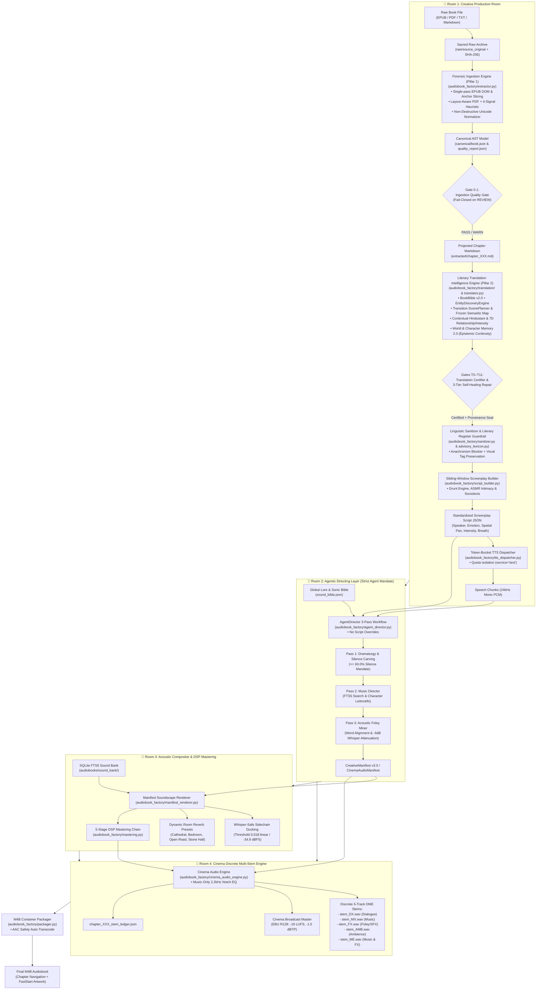

# 🏛️ Architecture: The 4-Room Cinematic Audio Drama Engine

## Executive Overview

**Audiobook Maker (Audiobook Factory v4.0)** is an autonomous, studio-grade audiobook production system modeled after the high-end multi-track standards of **Audible Drama** and **GraphicAudio ("A Movie in Your Mind")**.

Unlike legacy audiobook generators that simply pipe unformatted text into a Text-to-Speech (TTS) engine and append speech files together, Audiobook Maker implements a **modular 4-Room Architecture** with **6 Quality Verification Gates**, **5 Discrete Audio Stems**, and an **Autonomous Agentic Director**.

---

## 🏗️ High-Level 4-Room Blueprint

---

## 🚪 Deep-Dive: The Four Production Rooms

### 1. Room 1: Creative Production Room
*Purpose: Convert unstructured literature into structured, attributed dramatic screenplay assets.*

- **Forensic Document Ingestion Engine & Universal Extractor ([`audiobook_factory/extractor.py`](file:///c:/Users/Suraj/Documents/Antigravity/Audiobook/audiobook_factory/extractor.py))** *(Pillar 1 Upgrade; see [`docs/FORENSIC_DOCUMENT_INGESTION.md`](file:///c:/Users/Suraj/Documents/Antigravity/Audiobook/docs/FORENSIC_DOCUMENT_INGESTION.md))*:
  - **Sacred Raw Source Archival:** Computes SHA-256 checksum and preserves a bit-for-bit verbatim replica in `raw/source_original.<ext>` accompanied by `raw/source_manifest.json` before any extraction or normalization begins.
  - **Canonical Book AST ([`audiobook_factory/book_model.py`](file:///c:/Users/Suraj/Documents/Antigravity/Audiobook/audiobook_factory/book_model.py)):** Assembles a strongly typed Pydantic v2 document graph ([`CanonicalBook`](file:///c:/Users/Suraj/Documents/Antigravity/Audiobook/audiobook_factory/book_model.py#L182-L262) $\rightarrow$ [`CanonicalChapter`](file:///c:/Users/Suraj/Documents/Antigravity/Audiobook/audiobook_factory/book_model.py#L80-L122) $\rightarrow$ [`CanonicalBlock`](file:///c:/Users/Suraj/Documents/Antigravity/Audiobook/audiobook_factory/book_model.py#L64-L79)) serialized to `canonical/book.json`. Preserves sacred raw text alongside speech-normalized text and block-level forensic provenance ([`SourceProvenance`](file:///c:/Users/Suraj/Documents/Antigravity/Audiobook/audiobook_factory/book_model.py#L44-L63): spine item, HTML tag, anchor ID, line number, character offset, reading order).
  - **Non-Destructive Literary Normalizer ([`audiobook_factory/normalizer.py`](file:///c:/Users/Suraj/Documents/Antigravity/Audiobook/audiobook_factory/normalizer.py)):** Applies Unicode NFC normalization, purges invisible zero-width characters (`\u200b`, `\u200c`, `\u200d`, `\ufeff`, `\u2060`), heals hyphenated linebreaks across line wraps (`"impor-\ntant"` $\rightarrow$ `"important"` in Latin & Devanagari), standardizes typographic quotes and spaced dashes, strips footnote references (`[1]`, `[23]`), and cleans running header/footer artifacts.
  - **Single-Pass Structural EPUB Parser ([`audiobook_factory/epub_parser.py`](file:///c:/Users/Suraj/Documents/Antigravity/Audiobook/audiobook_factory/epub_parser.py)):** Single-pass OPF manifest and spine traversal (zero redundant unzipping), Nav & NCX landmark navigation with anchor slicing and opening angle-bracket (`<`) backtracking to prevent tag destruction, and structural DOM block parsing.
  - **Layout-Aware PDF Engine & Quality Analyzer ([`audiobook_factory/pdf_engine.py`](file:///c:/Users/Suraj/Documents/Antigravity/Audiobook/audiobook_factory/pdf_engine.py)):** Native `pypdf>=5.0` extraction coupled with [`PDFQualityAnalyzer`](file:///c:/Users/Suraj/Documents/Antigravity/Audiobook/audiobook_factory/pdf_engine.py#L44-L140) evaluating 4 forensic quality signals (interior low density, OCR symbol noise $> 8\%$, Unicode replacement `\ufffd`, multi-column line wrap). Eliminates running headers/footers occurring across $\ge 3$ pages. Deploys single-page selective vision escalation via Gemini (`gemini-3.8-flash`) only on flagged pages.
  - **Meso-Tier Chapter Segmentation & Semantic Splitter ([`audiobook_factory/chapter_segmenter.py`](file:///c:/Users/Suraj/Documents/Antigravity/Audiobook/audiobook_factory/chapter_segmenter.py)):** Multi-tier regex heading recognition (English, Hindi, Roman numerals, word numbers, story landmarks) with conservative false-positive defense against uppercase dialogue. Automatically enforces a **12,000-word chapter ceiling** using a 5-tier semantic splitting hierarchy (Scene break $\rightarrow$ Section heading $\rightarrow$ Paragraph boundary $\rightarrow$ Sentence boundary $\rightarrow$ Emergency word split).
  - **Independent Ingestion Quality Gate (Gate 0.1) ([`audiobook_factory/quality_gate.py`](file:///c:/Users/Suraj/Documents/Antigravity/Audiobook/audiobook_factory/quality_gate.py)):** Independent fail-closed audit evaluating word count floors ($> 50$ words), non-empty chapters ($> 5$ words), and suspicious page ratios ($< 25\%$). Emits `canonical/quality_report.json` and raises actionable [`ExtractionGateAuditError`](file:///c:/Users/Suraj/Documents/Antigravity/Audiobook/audiobook_factory/book_model.py#L33-L43) upon `REVIEW` status (bypassable via `--force-gate`).
  - **Dual-Layer Legacy Projection:** Deterministically projects canonical chapters into backward-compatible `extracted/chapter_XXX.md` and `metadata.json` for seamless execution across all downstream pipeline stages.
- **Literary Translation Intelligence Engine & Hindustani Translator ([`audiobook_factory/translation/`](file:///c:/Users/Suraj/Documents/Antigravity/Audiobook/audiobook_factory/translation/) & [`audiobook_factory/translator.py`](file:///c:/Users/Suraj/Documents/Antigravity/Audiobook/audiobook_factory/translator.py))** *(Pillar 2 Upgrade; see [`docs/LITERARY_TRANSLATION_INTELLIGENCE.md`](file:///c:/Users/Suraj/Documents/Antigravity/Audiobook/docs/LITERARY_TRANSLATION_INTELLIGENCE.md))*:
  - **Persistent Canonical Book Bible (`v2.0.0`) & Entity Discovery:** Stores canonical characters, locations, organizations, creatures, titles, and decoupled `terminology_variants` in `book_bible.json` with deterministic 16-char SHA-256 versioning (`get_version_hash()`) and backward-compatible `export_legacy_glossary()`. Stopword-hardened [`EntityDiscoveryEngine`](file:///c:/Users/Suraj/Documents/Antigravity/Audiobook/audiobook_factory/translation/entity_discovery.py) auto-commits high-confidence entities ($\ge 0.80$) and logs `FlaggedConflict` records on contradictions.
  - **Transition-Driven Scene Segmentation & Frozen Source Semantic Map:** [`ScenePlanner`](file:///c:/Users/Suraj/Documents/Antigravity/Audiobook/audiobook_factory/translation/scene_planner.py) segments chapters on genuine temporal/spatial transitions rather than arbitrary token boundaries. [`SourceSemanticMapEngine`](file:///c:/Users/Suraj/Documents/Antigravity/Audiobook/audiobook_factory/translation/source_semantic_map.py) extracts and freezes per-beat propositions, actors, speakers, and negation markers (`semantic_map.json`).
  - **Contextual Hindustani Register (*"Aate mein Namak jitni Urdu"*):** [`HindustaniRegisterEngine`](file:///c:/Users/Suraj/Documents/Antigravity/Audiobook/audiobook_factory/translation/hindustani_register.py) replaces rigid numeric Urdu quotas with genre-adaptive lexical seasoning across `atmosphere_words`, `passion_and_somatics`, `combat_and_grit`, and `scholastic_and_courtly` domains.
  - **World & Character Memory 2.0 ([`audiobook_factory/translation/memory/`](file:///c:/Users/Suraj/Documents/Antigravity/Audiobook/audiobook_factory/translation/memory/))** *(See comprehensive guide: [`docs/WORLD_AND_CHARACTER_MEMORY_2_0.md`](file:///c:/Users/Suraj/Documents/Antigravity/Audiobook/docs/WORLD_AND_CHARACTER_MEMORY_2_0.md))*:
    - **6-Stage Scene Lifecycle (`READ -> ACT -> EXTRACT -> CALCULATE DELTAS -> VALIDATE -> COMMIT`):**
      1. *READ:* Pre-translation selective 7-tier retrieval (`MemoryRetriever.retrieve_for_scene()`) respecting an 800-token budget ceiling.
      2. *ACT:* Translation and screenplay synthesis guided by epistemic `MUST_NOT_KNOW` constraints and relationship honorific dynamics.
      3. *EXTRACT:* Change-triggered event detection (`SceneChangeDetector`) with noun/verb trigger matching, transitive attacker vs. victim disambiguation, and gated LLM event proposal with deterministic fallback and deduplication.
      4. *CALCULATE DELTAS:* Deterministic projection of StoryEvents into typed `StateDelta` objects across 5 domains (`CHARACTER`, `RELATIONSHIP`, `KNOWLEDGE`, `WORLD`, `NARRATIVE`), strictly preserving damaged/destroyed location conditions across movement events.
      5. *VALIDATE:* Enforces 7 contradiction guardrails (`CANON`, `TIMELINE`, `DEAD_CHARACTER`, `PHYSICAL_IMPOSSIBILITY`, `RELATIONSHIP_JUMP`, `KNOWLEDGE_LEAKAGE`, `WORLD_RULE`), producing a `MemoryValidationReport`.
      6. *COMMIT:* Versioned atomic commits (`memory_store.json`), isolating rejected contradictory events in `rejected_events` (preventing ghost event pollution in active timelines or salience queries) and synchronizing dynamic state with `BookBible`.
    - **Downstream Consumer Wiring:** Directly feeds conservative performance context (`memory_vocal_constraint`, `recommended_pronoun`, `recommended_register`) into `ScreenplaySegment` contracts ([`contracts.py`](file:///c:/Users/Suraj/Documents/Antigravity/Audiobook/audiobook_factory/contracts.py)), audited by Gate `T6_relationship_memory` ([`certification.py`](file:///c:/Users/Suraj/Documents/Antigravity/Audiobook/audiobook_factory/translation/certification.py)), persisted back to disk in `orchestrator.py`, and rendered as vocal style descriptors in `TTSDispatcher` speech synthesis.
  - **12-Gate Independent Certification (Gates T0–T11) & 3-Tier Self-Healing Repair:** [`TranslationCertifier`](file:///c:/Users/Suraj/Documents/Antigravity/Audiobook/audiobook_factory/translation/certification.py) verifies word sanity, terminology, deterministic negation & LLM semantic fidelity, quote parity & omissions, additions, character voice, 7D intensity ($\pm 0.75$ soft `WARN`, $> 2.0$ hard `FAIL`), and literary naturalness. [`TieredRepairEngine`](file:///c:/Users/Suraj/Documents/Antigravity/Audiobook/audiobook_factory/translation/repair_engine.py) heals failures via Tier 1 (0ms Regex & SQLite `AdvisoryLexiconDB`), Tier 2 (surgical single-paragraph LLM rewrite), and Tier 3 (full scene retranslation), sealed by a 6-part SHA-256 `composite_cache_key`.
  - **Adult Literary Mode & HBO/Manto Intimacy Framework (`ADULT_LITERARY_MODE=True`):**
    - **Anti-Bowdlerization & 70/30 Anti-Parody Invariant:** Preserves 70% canon lore alongside 30% visceral Hindustani sensory amplification without sanitizing combat, tavern curses, or somatic intimacy (`Rule 8` & `Rule 9`, **"Nothing Above Source"** principle).
- **Linguistic Sanitizer & Literary Register Guardrail ([`audiobook_factory/sanitizer.py`](file:///c:/Users/Suraj/Documents/Antigravity/Audiobook/audiobook_factory/sanitizer.py) & [`audiobook_factory/advisory_lexicon.py`](file:///c:/Users/Suraj/Documents/Antigravity/Audiobook/audiobook_factory/advisory_lexicon.py))**:
  - **Deterministic Literary Register Auditor:** [`audit_literary_register()`](file:///c:/Users/Suraj/Documents/Antigravity/Audiobook/audiobook_factory/sanitizer.py) and [`apply_literary_register_replacements()`](file:///c:/Users/Suraj/Documents/Antigravity/Audiobook/audiobook_factory/sanitizer.py) block modern clinical English loanwords (`डिप्रेशन` $\rightarrow$ `उदासी का साया`, `ट्रॉमा` $\rightarrow$ `गहरा सदमा`, `स्ट्रेस` $\rightarrow$ `तनाव`), literal calques (`सुनहरी लड़की` $\rightarrow$ `गोरी-चिट्टी लड़की`), and anachronistic greetings (`नमस्ते` $\rightarrow$ `सलाम`), backed by the self-learning SQLite [`AdvisoryLexiconDB`](file:///c:/Users/Suraj/Documents/Antigravity/Audiobook/audiobook_factory/advisory_lexicon.py).
  - **Raw Profanity & Intimacy Preservation:** Zero-loss preservation of earthy Hindustani vocabulary, slang, and somatic erotic textures—never misclassifying raw literary realism as harmful content.
  - **Expanded Neural Vocal & Combat Tags:** Validates and preserves expressive inline tags recognized natively by Gemini 3.1 Flash TTS:
    - *Intimacy & Prosody:* `[whispers]`, `[intimate, breathy]`, `[sighs]`, `[gasp]`, `[trembling voice]`, `[growl]`, `[groan]`, `[spits]`, `[mocking chuckle]`.
    - *Combat & Action (ADR-017):* `[bellowing battlecry]`, `[combat strain]`, `[diaphragm strain]`, `[guttural grunt on blade deflect]`, `[spits blood]`, `[choked gasp]`, `[ragged heaving pant]`, `[slow motion]`.
  - **Defense-in-Depth Stripping:** Recursively removes LLM meta-commentary, conversational refusals, Devanagari non-vocal stage directions, markdown fences, and conversational preambles/postambles.
- **Sliding-Window Screenplay Builder ([`audiobook_factory/script_builder.py`](file:///c:/Users/Suraj/Documents/Antigravity/Audiobook/audiobook_factory/script_builder.py))**:
  - Dissects prose into discrete `ScreenplaySegment` records with Hollywood Dramaturgy Director prompts.
  - **Sociolect Traits Integration:** Binds character profiles to distinct sociolect idiolects (`sociolect_trait` in `CharacterProfile`, e.g. `'COLD_CYNIC'`, `'CAUSTIC_ARISTOCRAT'`, `'THARKI_BARD'`).
  - **Cynical Protagonist Grunt Engine:** Automatically tags weary, cynical protagonist reactions with signature neural grunts (`[growl] हूँ...`, `[sighs] हम्म...`) and enforces `pause_after_ms` of 1000–1400ms for dramatic pregnant pause prosody.
  - **Duraangi Zubaan (Inner Monologues):** Encodes unspoken internal thoughts contrasting outward speech as `[whispers] (मन में: ...)`, paired with `spatial.proximity: 'intimate_close'` and `acoustic_env: 'binaural_whisper'`.
  - **ASMR Intimacy Staging:** Automatically assigns `spatial.proximity: "intimate_close"`, dead-center `spatial.pan: 0.0`, dynamic intensity `low`, `pre_roll_breath_ms: 200-250`, and music sidechain attenuation of `-22.0 dB` ("The Erotic Silence").
  - **Combat Action-Beat Splitting & Dual-Perspective Staging (ADR-017):**
    - Splits major kinetic strikes into dedicated 800ms – 1500ms speech-free intervals (`speaker: "Foley"`, `text: "[ACTION]"`).
    - Stages Attacker actions Left ($-0.6$), Defender parries Right ($+0.6$), and Fatal Clashes Center ($0.0$).
  - Employs a sliding-window character memory bank to eliminate narrator fallback and preserve character continuity across multi-chapter novels.
  - **Zero-Voice-Drift Hardening & Two-Pass Attribution (ADR-021):**
    - Screenplay generation injects canon characters directly from `character_roster.json` with explicit gender markers (`Hero [male, aliases: ...]`).
    - Two-pass pronoun disambiguation ([`clean_screenplay_pass2()`](file:///c:/Users/Suraj/Documents/Antigravity/Audiobook/audiobook_factory/script_builder.py)) resolves both English (`he`, `she`, `the man`, `the woman`) and Hindi (`उसने`, `वह`, `आदमी`, `लड़की`, `महिला`) pronouns to the most recently active matching character, strips parenthetical annotations (`Geralt (Witcher)` $\rightarrow$ `Geralt`), and normalizes alias variants.
- **Precision Speech Synthesizer ([`audiobook_factory/tts_dispatcher.py`](file:///c:/Users/Suraj/Documents/Antigravity/Audiobook/audiobook_factory/tts_dispatcher.py))**:
  - Primary: Google Gemini 3.1 Flash Cloud TTS API (`gemini-2.5-flash-preview-tts` / `gemini-3.1-flash-tts-preview`).
  - Personas: `Aoede` (melodic narration), `Charon` (dark authoritative male), `Puck`, `Fenrir`, `Orus`, `Zephyr`.
  - **Permanent Safety Filter Unlock (ADR-019):** Configures explicit `safetySettings: [BLOCK_NONE]` across all 4 harm categories (`HARM_CATEGORY_HARASSMENT`, `HARM_CATEGORY_HATE_SPEECH`, `HARM_CATEGORY_SEXUALLY_EXPLICIT`, `HARM_CATEGORY_DANGEROUS_CONTENT`), permanently preventing false-positive censorship on mature dark-fantasy literature.
  - **Fail-Closed Voice Registry Validation (ADR-021):** Pre-flights all segments before API dispatch, raising `UnregisteredSpeakerError` on unmapped dialogue speakers. Strictly prohibits silent fallback to Narrator (`Aoede`), auto-resolving canonical character aliases and checking gender alignment.
  - Token-Bucket concurrency pool with exponential backoff on HTTP 429 quota exhaustion.
  - Multi-key rotation pool with persistent state tracking, automated date-rollover, and stealth cadence pacing.
  - **Quota Isolation**: Dedicated `service="text"` key pool routing for auxiliary LLM prompts (mood analysis, dramaturgy) isolates text requests from depleting scarce 10 RPD Gemini TTS quotas.
  - Automatic `.env` key sanitization (`strip("'\"")`) prevents malformed header HTTP 400 errors.

---

### 2. Room 2: Agentic Directing Layer
*Purpose: Autonomous soundscape dramaturgy, silence carving, and musical thematic scoring.*

> [!IMPORTANT]
> **STRICT ARCHITECTURAL MANDATE: Complete Creative Autonomy for Agents**
> Only autonomous AI agents are permitted to make creative decisions. Downstream scripts, DSP routines, and CLI pipelines must NOT override agent directives. `AgentDirector` creates the `CreativeManifest` autonomously; `CinemaAudioEngine`, `ManifestRenderer`, and audio DSP chains operate strictly as deterministic, reproducible execution runtimes.

- **Sonic Bible ([`audiobook_factory/sonic_bible.py`](file:///c:/Users/Suraj/Documents/Antigravity/Audiobook/audiobook_factory/sonic_bible.py))**:
  - Maintains a persistent `sound_bible.json` per project.
  - Registers character leitmotifs (associated track, instrument timbre, canonical tempo BPM, dramatic intent, track offset).
  - Specifies spatial acoustic profiles (`WorldAcousticProfile`) defining reverberation and room physics.
- **Autonomous Agent Director ([`audiobook_factory/agent_director.py`](file:///c:/Users/Suraj/Documents/Antigravity/Audiobook/audiobook_factory/agent_director.py))**:
  - **Pass 1 (Dramaturgy & Silence Carving)**: Enforces the **broadcast audio drama standard of at least 60.0% acoustic silence**. Music is carved surgically around dramatic peaks; non-stop wall-to-wall music is strictly banned.
  - **Pass 1.5 (Dynamic Multi-Scene Partitioning & 4-Stem Decoupled Acoustics - ADR-018 & ADR-022)**:
    - Analyzes shifts in `acoustic_env` across screenplay segments via [`_partition_script_ambience_scenes()`](file:///c:/Users/Suraj/Documents/Antigravity/Audiobook/audiobook_factory/agent_director.py), segmenting the chapter into contiguous scene blocks (e.g. Castle Bath $\rightarrow$ Royal Banquet Hall $\rightarrow$ Forest Night) instead of flat monolithic 106-minute loops.
    - Resolves rich, decoupled environmental soundscapes through [`_resolve_scene_acoustics()`](file:///c:/Users/Suraj/Documents/Antigravity/Audiobook/audiobook_factory/agent_director.py), building a `SceneSoundscapeManifest` with Base Room Tone, Weather Elements, Crowd Wallah, and Stochastic Spots.
    - Persists the scene acoustics model automatically to disk as `{chapter_id}_scene_acoustics.json`.
  - **Pass 2 (Music Director & Scene-Bound Underscore - ADR-022)**: Dynamically formulates FTS5 queries against the sound catalog for valence, arousal, tempo, and timbre. Supports `until_segment` duration calculation, allowing musical cues to span full narrative scenes (25s to 240s) rather than arbitrary 30s chops, bounded by a strict 40% chapter music budget. Injects character leitmotifs bound to the Sonic Bible.
  - **Pass 3 (Acoustic Foley, Bilingual Anchoring & Dead-Center Elimination - ADR-022)**: Analyzes dialogue verbs and objects using [`BILINGUAL_ANCHOR_MAP`](file:///c:/Users/Suraj/Documents/Antigravity/Audiobook/audiobook_factory/agent_director.py). Unmatched preparatory actions land early ($\sim 15\%$), while physical impacts land on climax windows ($\sim 75\%$), eliminating the 50% dead-center trap. Calls `attenuate_foley_whisper_collisions` to apply $-6\text{ dBFS}$ attenuation to Foley cues coinciding with whispered dialogue.
  - **Domestic Tableware vs. Combat Foley Taxonomy Isolation (ADR-022)**: Universal Category System (UCS) lookup strictly classifies domestic tableware (`DOMETabl`: plate, dish, bowl, tableware, थाली, कटोरा) separately from combat weapons (`WEAPSwd`), prohibiting sword clash audio during banquets.
  - **Stochastic Spot Transient Merging (ADR-018)**: Calls `scene_acoustics.generate_stochastic_cues` to insert non-repetitive micro-events (`anchor_word="[STOCHASTIC]"`) into pause gaps ($\ge 600\text{ ms}$).
  - **Voice Limiter & Priority Stealing (ADR-018)**: Invokes `filter_concurrency_window(foley_cues, window_ms=200, max_concurrency=3)` in `acoustic_bus_matrix.py` to prevent transient clumping and acoustic mud.
  - Emits the validated **[`CreativeManifest`](file:///c:/Users/Suraj/Documents/Antigravity/Audiobook/audiobook_factory/contracts.py)** (supporting direct `.save_to_file()` and `.from_file()` serialization).

---

### 3. Room 3: Acoustic Compositor & DSP Mastering
*Purpose: Surgical multitrack assembly, sidechain ducking, acoustic impulse response, and EBU R128 mastering.*

- **SQLite FTS5 Sound Bank ([`audiobook_factory/sound_bank.py`](file:///c:/Users/Suraj/Documents/Antigravity/Audiobook/audiobook_factory/sound_bank.py))**:
  - 100% free CC0/royalty-free local audio asset warehouse indexed with SQLite Full-Text Search (FTS5).
  - Categorizes tracks into `BGM`, `AMB`, and `SFX` with metadata: BPM, valence, arousal, dominant instruments, and duration.
  - Features pre-baked composite assets created offline via [`scripts/bake_foley_composites.py`](file:///c:/Users/Suraj/Documents/Antigravity/Audiobook/scripts/bake_foley_composites.py) for zero-latency retrieval.
- **Manifest Soundscape Renderer ([`audiobook_factory/manifest_renderer.py`](file:///c:/Users/Suraj/Documents/Antigravity/Audiobook/audiobook_factory/manifest_renderer.py))**:
  - Constructs complex dynamic FFmpeg `filter_complex` graphs.
  - **Whisper-Safe Sidechain Ducking**: Detector threshold set to `0.018` linear (-34.9 dBFS) with 15ms attack and 350ms release. Seamlessly accommodates **-22.0 dB "Erotic Silence"** ASMR cues and whispered dialogue without false gating or music pumping.
  - **Combat Shock Ducking (ADR-017)**: Employs `PROFILE_COMBAT_SHOCK` (-24dB attenuation, 4000ms release) and `PROFILE_COMBAT` (-22dB attenuation, 250ms release) for concussion impacts and ear-ringing tinnitus beds.
  - **The 3-Layer Combat Sandwich (ADR-017)**: Compiles multi-layer kinetic soundscapes across Transient Bite (2.0-7.5 kHz), Anatomical Body (180-1.4 kHz), and LFE 52Hz Sub-Thump.
  - **Strict Mono Sub-Bass Anchor (< 90Hz)**: Centered at pan 0.0 and mono-summed for strict mono phase compatibility ($r \ge 0.85$).
  - **Acoustic Barrier Occlusion & Stereo Width (ADR-018)**: Applies low-pass barrier filter (1200–1500 Hz) to exterior weather stems when indoor, and expands stereo width (`stereotools=mlev=1.00:slev=1.15`) to carve out center space for speech.
  - **Music-Only 2.2kHz Spectral Notch Carving**: Carves a -5.5 dB notch (`equalizer=f=2200:t=q:w=1.5:g=-5.5`) strictly into the music stem `[0:a]`, preserving the high-frequency snap of Foley cues and the spatial depth of Ambience beds without vocal masking.
  - **Dynamic Impulse Response Reverb**: Adapts wet send volume and delay reflections to scene presets (`cathedral`, `bedroom`, `open_road`, `stone_hall`, `binaural_whisper`).
- **DSP Vocal Mastering ([`audiobook_factory/mastering.py`](file:///c:/Users/Suraj/Documents/Antigravity/Audiobook/audiobook_factory/mastering.py))**:
  - 5-stage DSP chain:
    1. SOXR 48kHz sinc resampling
    2. Highpass subsonic filter (60Hz cut)
    3. Neural vocoder broadband denoiser (`afftdn`)
    4. De-esser filter (6.7kHz sibilance control)
    5. Lowpass ultrasonic filter (14kHz air ceiling)
  - **Adult Literary Mode DSP Calibration**:
    - **Organic Breath Preservation:** Intimate pre-roll breaths (`pre_roll_breath_ms: 200-250`) and Grunt Engine pause buffers (`pause_after_ms: 1000-1400ms`) pass transparently through the mastering chain without noise-gate truncation or clipping.
    - **Dynamic Headroom Calibration:** Explosive combat cries trigger `limiter=0.82`, `attack=2ms`, `TP=-2.0 dBTP`. Soft whisper/erotic scenes calibrate `effective_lra = 6.0` to preserve close-mic nuance.
    - **Dialogue Spatial Staging & ASMR Centering:** Constant-power stereo azimuth panning anchors Narrator and intimate ASMR lines dead-center ($pan = 0.0$, `intimate_close`) while subtly staging cast members across the stereo panorama ($r \ge 0.85$).
- **Master Timeline Ledger ([`audiobook_factory/orchestrator.py`](file:///c:/Users/Suraj/Documents/Antigravity/Audiobook/audiobook_factory/orchestrator.py))**:
  - Standardized Gate 4.5 ledger written canonically to `scripts/chapter_XXX_timeline_ledger.json` and mirrored to `soundscapes/chapter_XXX_timeline_ledger.json` for reliable downstream validation.

---

### 4. Room 4: Cinema Discrete Multi-Stem Engine
*Purpose: Professional film/broadcast stem separation and delivery package certification.*

- **Cinema Audio Engine ([`audiobook_factory/cinema_audio_engine.py`](file:///c:/Users/Suraj/Documents/Antigravity/Audiobook/audiobook_factory/cinema_audio_engine.py))**:
  - Renders and preserves **5 discrete stems** standardized to 48,000 Hz 16-bit stereo PCM:
    1. **`stem_DX.wav`**: Dialogue & Voice Acting (preserving full dynamic range for grunts, whispers, and visceral shouts)
    2. **`stem_MX.wav`**: Musical Score & Cues (with isolated 2.2kHz notch)
    3. **`stem_FX.wav`**: Physical Foley & SFX (tactile tavern, magic, and combat impacts)
    4. **`stem_AMB.wav`**: Environmental Background Ambience (with barrier occlusion and stereo widening)
    5. **`stem_ME.wav`**: Combined Music & Effects
  - **Dialogue-to-Masking Ratio (DMR $\ge +10.0$ dB) Verification (ADR-018)**:
    Computes $\text{DMR} = \text{LUFS}_{\text{DX}} - \text{LUFS}_{\text{ME}}$, ensuring the background composite bed never exceeds speech intelligibility thresholds.
  - Generates the unified **`chapter_XXX_stem_ledger.json`** recording duration, integrated LUFS, true peak, and DMR compliance across every stem.
- **M4B Container Packager ([`audiobook_factory/packager.py`](file:///c:/Users/Suraj/Documents/Antigravity/Audiobook/audiobook_factory/packager.py))**:
  - Assembles all mastered chapters into a single chapterized `.m4b` container with embedded cover artwork and `FFMETADATA1` chapter markers.
  - **AAC Packaging Safety**: Inspects all input chapters with `is_all_aac`. Non-AAC or uncompressed WAV (`pcm_s16le`) chapters are automatically transcoded to high-fidelity AAC (`-c:a aac -b:a 192k`), preventing FFmpeg container multiplexer crashes.
  - Guarantees strict timeline monotonicity and clean seekability (`+faststart`) in Audible, Apple Books, and Smart AudioBook Player.

---

## 🌉 The 8 Metadata Bridges (Silo Elimination Matrix)

The system bridges all 8 critical producer-consumer metadata silos:

| Silo # | Metadata Produced | Upstream Producer | Downstream Consumer | How It Is Bridged in v4.0 |
|:---:|---|---|---|---|
| **S1** | `pause_after_ms` `pre_roll_breath_ms` | `script_builder.py` | `mastering.py` `timeline_ledger.py` `agent_director.py` | Passed to `concatenate_and_master_chapter`, generating micro-silence, 1000–1400ms Grunt Engine pauses, & 200–250ms ASMR breath intake pre-rolls. Synchronized in `TimelineSegment` (`start_ms = curr_t_ms + pre_breath`), eradicating cumulative timeline drift. |
| **S2** | `intensity_level` (`low`, `medium`, `explosive`) | `script_builder.py` | `mastering.py` | Explosive combat lines trigger True Peak ceiling -2.0 dBTP and limiter 0.82; whisper/erotic lines (`low`) tighten LRA to 6.0 LU. |
| **S3** | `spatial.pan` `spatial.proximity` | `script_builder.py` | `mastering.py` | `spatial_staging=True` renders constant-power stereo panning (Narrator & `intimate_close` ASMR dead-center 0.0, cast dynamically panned). |
| **S4** | `acoustic_env` IR Presets | `script_builder.py` | `manifest_renderer.py` | Dynamic reverb presets (`cathedral`, `bedroom`, `open_road`) adapt decay and wet mix. |
| **S5** | `SceneSoundscapeManifest` (4 Stems, Occlusion, Stochastic) | `scene_acoustics.py` | `cinema_audio_engine.py` | 4-stem decoupled environmental beds, lowpass occlusion (< 18kHz), and pause-slot stochastic spots. |
| **S6** | Character Leitmotifs | `sonic_bible.py` | `agent_director.py` | Loaded via `project_dir / "sound_bible.json"` and bound to Pass 2 music cues. |
| **S7** | Quality Gate Suite | `gate_auditor.py` | `orchestrator.py` | Wired inline across pipeline stages (Gates 0, 1, 6A, 6C) and chapter production (Gates 2, 3.5, 5, 5.2, 5.3). |
| **S8** | Combat Action Staging & LFE Sub-Drop | `script_builder.py` | `manifest_renderer.py` | Foley cues with `is_lfe_sub_drop=True` and action-beat splitting trigger 52Hz mono sub-bass boost and `PROFILE_COMBAT_SHOCK`. |
