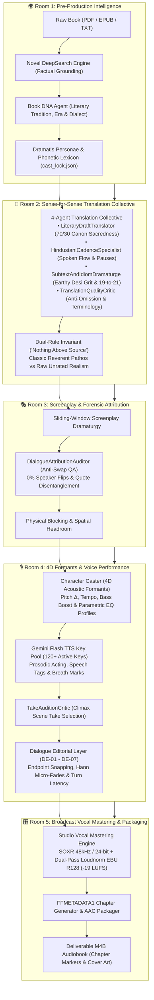

# 🏛️ Architecture: The 5-Room Pure Vocals-Only Studio Audiobook Engine

## Executive Overview

**Audiobook Maker (Vocals-Only Studio Engine v4.0)** is an autonomous, studio-grade audiobook production framework engineered specifically for **crystal-clear, multi-voice character acting and pristine vocal narration** modeled after the benchmark standards of **Audible Studios**.

> [!IMPORTANT]
> **Active Production Engine: Pure Vocals-Only**:
> On branch `prestable-v4.0-baseline`, background music (BGM), sound effects (SFX), 5-track stem mixdowns, and Archive.org sound bank harvesting are **permanently decoupled and archived** in `archive/cinematic_audio/`.
> The engine is 100% focused on Audible-standard vocal clarity, multi-character acting, dialogue nuance, and broadcast-grade vocal mastering.

---

## 🏗️ High-Level 5-Room Vocals-Only Blueprint

```mermaid
flowchart TD
    subgraph Room1["🌍 Room 1: Pre-Production Intelligence"]
        RawBook["Raw Book (PDF / EPUB / TXT)"] --> DeepSearch["Novel DeepSearch Engine (Factual Grounding)"]
        DeepSearch --> BookDNA["Book DNA Agent (Literary Tradition, Era & Dialect)"]
        BookDNA --> Personae["Dramatis Personae & Phonetic Lexicon (cast_lock.json)"]
    end

    subgraph Room2["🧠 Room 2: Sense-for-Sense Translation Collective"]
        Personae --> Collective["4-Agent Translation Collective<br/>• LiteraryDraftTranslator (70/30 Canon Sacredness)<br/>• HindustaniCadenceSpecialist (Spoken Flow & Pauses)<br/>• SubtextAndIdiomDramaturge (Earthy Desi Grit & 19-to-21)<br/>• TranslationQualityCritic (Anti-Omission & Terminology)"]
        Collective --> DualRule["Dual-Rule Invariant ('Nothing Above Source')<br/>Classic Reverent Pathos vs Raw Unrated Realism"]
    end

    subgraph Room3["🎭 Room 3: Screenplay & Forensic Attribution"]
        DualRule --> Screenplay["Sliding-Window Screenplay Dramaturgy"]
        Screenplay --> Auditor["DialogueAttributionAuditor (Anti-Swap QA)<br/>0% Speaker Flips & Quote Disentanglement"]
        Auditor --> Blocking["Physical Blocking & Spatial Headroom"]
    end

    subgraph Room4["🎙️ Room 4: 4D Formants & Voice Performance"]
        Blocking --> Caster["Character Caster (4D Acoustic Formants)<br/>Pitch Δ, Tempo, Bass Boost & Parametric EQ Profiles"]
        Caster --> TTS["Gemini Flash TTS Key Pool (120+ Active Keys)<br/>Prosodic Acting, Speech Tags & Breath Marks"]
        TTS --> Critic["TakeAuditionCritic (Climax Scene Take Selection)"]
        Critic --> Editorial["Dialogue Editorial Layer (DE-01 - DE-07)<br/>Endpoint Snapping, Hann Micro-Fades & Turn Latency"]
    end

    subgraph Room5["🎛️ Room 5: Broadcast Vocal Mastering & Packaging"]
        Editorial --> VocalMaster["Studio Vocal Mastering Engine<br/>SOXR 48kHz / 24-bit + Dual-Pass Loudnorm EBU R128 (-19 LUFS)"]
        VocalMaster --> Packager["FFMETADATA1 Chapter Generator & AAC Packager"]
        Packager --> Deliverable["Deliverable M4B Audiobook (Chapter Markers & Cover Art)"]
    end

    Room1 --> Room2
    Room2 --> Room3
    Room3 --> Room4
    Room4 --> Room5
```

---

## 🚪 Deep-Dive: The 5 Production Rooms

### Room 1: Pre-Production World & Lore Ingestion Studio
*Modules: `audiobook_factory/preproduction/` (`novel_deepsearch.py`, `book_dna_agent.py`, `dramatis_personae_agent.py`, `phonetic_lexicon_dramaturge.py`)*

1. **Novel DeepSearch Grounding**: Multi-angle factual dossier compilation (`NovelDeepSearchEngine`, `DeepSearchNovelDossier`) executing grounded web analysis to build an immutable canonical dossier before production runs, eliminating hallucinations.
2. **Universal Book DNA Profiling**: Analyzes literary tradition, source fidelity tier (`CLASSIC_REVERENT` vs `RAW_UNRATED`), regional dialect cadence, and profanity policy without hardcoded titles or era biases.
3. **Dramatis Personae & Phonetic Lexicon**: Extracts novel characters, sociolect traits, vocal weight, and phonetic Devanagari transliterations into `book_bible.json` and `cast_lock.json`.

### Room 2: Sense-for-Sense Translation Collective
*Modules: `audiobook_factory/translation/` & `audiobook_factory/translation/agents/`*

1. **4-Agent Collective Architecture**:
   - `LiteraryDraftTranslator`: Generates sense-for-sense dramatic prose maintaining 70% canon sacredness.
   - `HindustaniCadenceSpecialist`: Tunes spoken actor pauses (`—`, `...`, `,`) and honorific status transitions (`TU <-> MAAI-BAAP`).
   - `SubtextAndIdiomDramaturge`: Crafts authentic Hindustani metaphors and 19-to-21 unrated amplification for gritty fiction.
   - `TranslationQualityCritic`: Audits anti-omission parity and verifies BookBible terminology.
2. **Dual-Rule Invariant ("Nothing Above Source")**:
   - *Classical Literature*: Dignified authorial voice, emotional pathos, and sacred regional cadences.
   - *Raw Unrated Fiction*: Unapologetic preservation of raw street curses, visceral combat gore, and unvarnished somatic intimacy.

### Room 3: Screenplay Dramaturgy & Forensic Attribution
*Modules: `audiobook_factory/script/` & `audiobook_factory/script/agents/`*

1. **Sliding-Window Screenplay Dramaturgy**: Parses chapters into 500-word beat-aligned micro-chunks with 5-layer context stack, attributing dialogue turns, actioning verbs, and dramatic delivery styles.
2. **Dialogue Attribution Auditor**: Dedicated QA agent preventing $A \leftrightarrow B$ speaker turn inversions, quote misattributions to Narrator, and speech tag leakage (`"उसने कहा"`).
3. **Physical Blocking & Staging**: Encodes character blocking (`sitting`, `standing`, `leaning_close`, `retreating`) and stereo azimuth panning.

### Room 4: 4D Formants & Voice Performance Realization
*Modules: `audiobook_factory/character_caster.py`, `audiobook_factory/tts/`, `audiobook_factory/performance/take_critic.py`*

1. **4D Acoustic Formant Modulation**: Pitch delta ($\pm 4-12\%$), tempo scaling, bass boost, and parametric EQ curves (`equalizer=f=...`) dynamically applied via FFmpeg DSP to prevent vocal convergence when multiple characters share base voices.
2. **Formant-Sensitive Hash Caching**: Filename hashing incorporates the active EQ formant profile for deterministic cache invalidation.
3. **120+ Key Gemini Flash TTS Pool**: Concurrent token-bucket rate limiting with anti-bot jitter and permanent `BLOCK_NONE` safety settings.
4. **TakeAuditionCritic**: Judicial multi-take evaluation on climactic scenes.

### Room 5: Dialogue Editorial & Broadcast Vocal Mastering
*Modules: `audiobook_factory/dialogue_editing/`, `audiobook_factory/mastering.py`, `audiobook_factory/packager.py`*

1. **Dialogue Editorial Layer (DE-01 - DE-07)**: Endpoint zero-crossing snapping (-52 dBFS speech floor), Hann micro-fades (12ms pre-speech, 18ms post-speech), and dramatic turn latency.
2. **Broadcast EBU R128 Vocal Master**: Standardized `-19.0 LUFS` ($\pm 0.5$ LU) integrated loudness and `-1.5 dBTP` true-peak ceiling at 48kHz / 24-bit.
3. **Chaptered M4B Container**: Streamlined packaging into `.m4b` container with FFMETADATA1 chapter markers, TOC navigation, and embedded high-resolution cover artwork.

---

## 📦 Decoupled & Archived Subsystems

The legacy 5-track cinematic audio engine (dynamic BGM scoring, SQLite FTS5 sound bank harvesting, and multitrack stem mixdowns) has been safely decoupled and archived in `archive/cinematic_audio/`.
The active production pipeline on `prestable-v4.0-baseline` is **100% focused on pure vocal excellence**.
