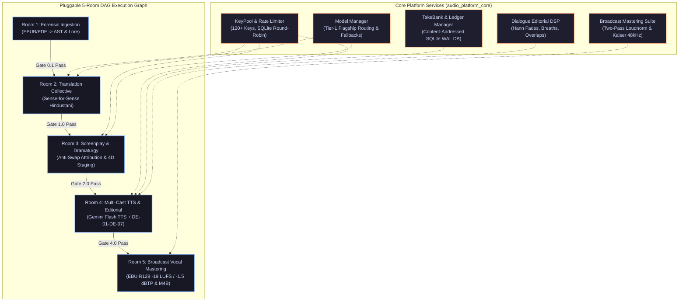
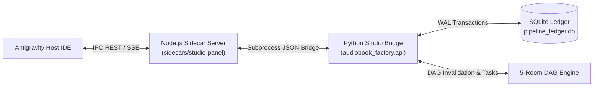

# 🏛️ Master System Architecture Specification (MAS-001)

**System**: Studio Audio Production & Vocal Mastering Engine (Decoupled 5-Room DAG Platform)  
**Standard**: `v6.0-ENTERPRISE-DAG`  
**Classification**: High-Precision Autonomous Audio & Linguistic Processing Infrastructure  

---

## 📑 Document Navigation & Overview

```
├── SECTION 1: MASTER ARCHITECTURE SPECIFICATION (MAS-001)
│   ├── 1.1 Architectural Invariants & Guarantees
│   ├── 1.2 Hexagonal System Topology (Mermaid)
│   ├── 1.3 2-Tier Content-Addressed Caching Architecture
│   ├── 1.4 Global State & Persistence Ledger Schema (SQLite WAL)
│   └── 1.5 Official Architectural Decision Record (ADR-008)
│
├── SECTION 2: CORE PLATFORM FOUNDATION (audio_platform_core)
│   ├── 2.1 KeyPool & Model Management Engine
│   ├── 2.2 2-Tier TakeBank Cache & Ledger Engine
│   ├── 2.3 Dialogue Editorial DSP Engine (DE-01 - DE-07)
│   └── 2.4 Broadcast Mastering & Container Packaging Engine
│
├── SECTION 3: SUBSYSTEMS SPECIFICATION (Rooms 1 – 5)
│   ├── Room 1: Forensic Ingestion & Lore (room1_ingest)
│   ├── Room 2: Translation Collective (room2_translate)
│   ├── Room 3: Screenplay & Anti-Swap Dramaturgy (room3_screenplay)
│   ├── Room 4: Multi-Cast TTS & Dialogue Editorial (room4_synth)
│   └── Room 5: Broadcast Vocal Mastering (room5_master)
│
├── SECTION 4: DYNAMIC PIPELINE PRESETS & ORCHESTRATION ENGINE (dag_orchestration)
│   ├── Preset A: Full Studio Novel Audiobook (5 Rooms)
│   ├── Preset B: English-Only Audiobook (Room 2 Bypassed)
│   ├── Preset C: Multi-Host Research-to-Podcast Engine
│   └── Preset D: Standalone Translation & TTS Micro-Runners
│
└── SECTION 5: IMPLEMENTATION, MIGRATION & TESTING BLUEPRINT
```

---

## 1.1 Architectural Invariants & Guarantees

The `v6.0-ENTERPRISE-DAG` architecture is governed by five non-negotiable operational invariants:

1. **Artifact-First Isolation**:
   Subsystems (Rooms 1 through 5) communicate **exclusively** via immutable, validated JSON and WAV artifact files complying with `schema_version: "2.0"`. Direct in-memory state leakage across room boundaries is strictly banned. Each room can be invoked independently from the CLI or Python API with valid inbound artifacts.
2. **Pure Vocals-Only Mandate**:
   Vocal production focuses 100% on Audible/EBU R128 broadcast clarity, multi-character voice acting, 4D formants, and dialogue editorial transitions. Background music (BGM), sound effects (SFX), Archive.org sound scraping, and Foley mixdowns remain permanently decoupled and archived.
3. **2-Tier Content-Addressed Caching**:
   - **Tier 1 (Audio Take Cache)**:
     $$\text{Take Hash} = \text{SHA-256}(\text{Text} + \text{Speaker} + \text{Voice} + \text{Formants} + \text{Speed} + \text{Temperature})$$
     Takes matching this hash are cached in `.audiobook_cache/takes/<hash>.wav` and are 100% reusable across pipeline runs.
   - **Tier 2 (Zero-Cost Assembly Graph)**:
     Local DSP timeline reconstruction, Hann micro-fades (12ms pre-speech / 18ms post-speech), and monotonic timestamp synchronization execute locally in $< 2.0$ seconds with 0 API tokens consumed.
4. **Universal Domain-Agnostic Design**:
   Zero hardcoded novel lore, character rosters, file hashes, or era biases in core code. All entities, accents, and pronunciation rules are dynamically harvested from source texts and stored in `book_bible.json` and `cast_lock.json`.
5. **Human Director Override Preservation**:
   Segments marked with `provenance.user_locked: true` are immutable. Downstream reconciliation passes will never overwrite human-directed casting, formants, or audio takes.

---

## 1.2 Hexagonal System Topology


```mermaid
flowchart TD
    subgraph CorePlatform["Core Platform Services (audio_platform_core)"]
        KP["KeyPool & Rate Limiter<br/>(120+ Keys, SQLite Round-Robin)"]
        MM["Model Manager<br/>(Tier-1 Flagship Routing & Fallbacks)"]
        TB["TakeBank & Ledger Manager<br/>(Content-Addressed SQLite WAL DB)"]
        DSP["Dialogue Editorial DSP<br/>(Hann Fades, Breaths, Overlaps)"]
        MST["Broadcast Mastering Suite<br/>(Two-Pass Loudnorm & Kaiser 48kHz)"]
    end

    subgraph DAGPipeline["Pluggable 5-Room DAG Execution Graph"]
        R1["Room 1: Forensic Ingestion<br/>(EPUB/PDF -> AST & Lore)"]
        R2["Room 2: Translation Collective<br/>(Sense-for-Sense Hindustani)"]
        R3["Room 3: Screenplay & Dramaturgy<br/>(Anti-Swap Attribution & 4D Staging)"]
        R4["Room 4: Multi-Cast TTS & Editorial<br/>(Gemini Flash TTS + DE-01-DE-07)"]
        R5["Room 5: Broadcast Vocal Mastering<br/>(EBU R128 -19 LUFS / -1.5 dBTP & M4B)"]

        R1 -->|"Gate 0.1 Pass"| R2
        R2 -->|"Gate 1.0 Pass"| R3
        R3 -->|"Gate 2.0 Pass"| R4
        R4 -->|"Gate 4.0 Pass"| R5
    end

    KP -.-> R2
    KP -.-> R3
    KP -.-> R4
    MM -.-> R2
    MM -.-> R3
    TB -.-> R4
    DSP -.-> R4
    MST -.-> R5

    classDef coreStyle fill:#1e1e2e,stroke:#fab387,stroke-width:2px,color:#cdd6f4;
    classDef dagStyle fill:#181825,stroke:#89b4fa,stroke-width:2px,color:#cdd6f4;

    class KP,MM,TB,DSP,MST coreStyle;
    class R1,R2,R3,R4,R5 dagStyle;
```

---

## 1.3 2-Tier Content-Addressed Caching Architecture


```mermaid
flowchart LR
    subgraph Tier1["Tier 1: Audio Take Cache (TakeBank)"]
        InTake["Input Segment Data"] --> HashCalc["SHA-256 Hash<br/>(Text + Voice + Formants + Temp)"]
        HashCalc --> Lookup{"TakeBank<br/>Hit?"}
        Lookup -- Yes --> LoadWAV["Load from Cache<br/>.audiobook_cache/takes/<hash>.wav"]
        Lookup -- No --> TTSCall["Gemini Flash TTS Network Call"]
        TTSCall --> SaveWAV["Save to TakeBank<br/>Register in SQLite"]
    end

    subgraph Tier2["Tier 2: Zero-Cost Assembly Graph (Local DSP)"]
        LoadWAV --> Stitch["Concatenation Engine"]
        SaveWAV --> Stitch
        Stitch --> Fade["Apply 12ms / 18ms Hann Micro-Fades"]
        Fade --> Pause["Apply DE-04 Pause Timing"]
        Pause --> Ledger["Recalculate Monotonic Timestamps<br/>(timeline_ledger.json)"]
        Ledger --> MasterWAV["Lossless Master Dialogue Stem<br/>(chapter_XXX_dialogue.wav)"]
    end

    classDef t1Style fill:#1e1e2e,stroke:#a6e3a1,stroke-width:2px,color:#cdd6f4;
    classDef t2Style fill:#181825,stroke:#89b4fa,stroke-width:2px,color:#cdd6f4;

    class InTake,HashCalc,Lookup,LoadWAV,TTSCall,SaveWAV t1Style;
    class Stitch,Fade,Pause,Ledger,MasterWAV t2Style;
```

### Hash Serialization Specification

The Tier 1 cache key is deterministically generated using canonical UTF-8 JSON serialization:

$$\text{take\_content\_hash} = \text{SHA256}(\text{CanonicalJSON}(\{ \text{text}, \text{speaker}, \text{voice\_id}, \text{formant\_signature}, \text{pitch\_shift}, \text{speed\_multiplier}, \text{temperature} \}))$$

```python
import hashlib
import json

def compute_take_hash(segment: dict) -> str:
    payload = {
        "text": segment["text"].strip(),
        "speaker": segment["speaker"].strip(),
        "voice_id": segment["voice_id"].strip(),
        "formant_signature": segment.get("formant_signature", "p0_t0_eq0"),
        "pitch_shift": round(float(segment.get("pitch_shift", 0.0)), 3),
        "speed_multiplier": round(float(segment.get("speed_multiplier", 1.0)), 3),
        "temperature": round(float(segment.get("temperature", 0.35)), 3),
    }
    serialized = json.dumps(payload, sort_keys=True, separators=(",", ":"), ensure_ascii=False)
    return hashlib.sha256(serialized.encode("utf-8")).hexdigest()
```

---

## 1.4 Global State & Persistence Ledger Schema (SQLite WAL)

The system maintains a single-source-of-truth database `pipeline_ledger.db` with SQLite WAL mode enabled.

```sql
PRAGMA journal_mode = WAL;
PRAGMA synchronous = NORMAL;
PRAGMA foreign_keys = ON;

-- 1. Project Global Master Record
CREATE TABLE IF NOT EXISTS project_metadata (
    project_id TEXT PRIMARY KEY,
    source_file_path TEXT NOT NULL,
    title TEXT NOT NULL,
    author TEXT DEFAULT 'Unknown Author',
    default_language TEXT DEFAULT 'hi',
    book_bible_path TEXT NOT NULL,
    cast_lock_path TEXT NOT NULL,
    preset_name TEXT DEFAULT 'AUDIOBOOK_STUDIO',
    created_at DATETIME DEFAULT CURRENT_TIMESTAMP,
    updated_at DATETIME DEFAULT CURRENT_TIMESTAMP
);

-- 2. Stage Execution DAG Ledger
CREATE TABLE IF NOT EXISTS chapter_stage_ledger (
    chapter_stage_uid TEXT PRIMARY KEY, -- e.g., "ch003_room3_screenplay"
    project_id TEXT NOT NULL,
    chapter_id INTEGER NOT NULL,
    room_name TEXT NOT NULL CHECK(room_name IN ('ROOM1_INGEST', 'ROOM2_TRANSLATE', 'ROOM3_SCREENPLAY', 'ROOM4_SYNTH', 'ROOM5_MASTER')),
    input_contract_hash TEXT NOT NULL,
    output_contract_hash TEXT,
    status TEXT NOT NULL CHECK(status IN ('IDLE', 'RUNNING', 'COMPLETED', 'FAILED', 'DIRTY', 'SKIPPED')),
    error_message TEXT,
    started_at DATETIME,
    completed_at DATETIME,
    FOREIGN KEY(project_id) REFERENCES project_metadata(project_id) ON DELETE CASCADE
);

-- 3. Stage Artifact Registry
CREATE TABLE IF NOT EXISTS stage_artifacts (
    artifact_uid TEXT PRIMARY KEY,
    chapter_stage_uid TEXT NOT NULL,
    artifact_type TEXT NOT NULL CHECK(artifact_type IN ('JSON_MANIFEST', 'SCREENPLAY_SCRIPT', 'DIALOGUE_WAV', 'TIMELINE_LEDGER', 'MASTERED_M4A', 'CONTAINER_M4B')),
    relative_file_path TEXT NOT NULL,
    sha256_checksum TEXT NOT NULL,
    file_size_bytes INTEGER NOT NULL,
    schema_version TEXT DEFAULT '2.0',
    created_at DATETIME DEFAULT CURRENT_TIMESTAMP,
    FOREIGN KEY(chapter_stage_uid) REFERENCES chapter_stage_ledger(chapter_stage_uid) ON DELETE CASCADE
);

-- 4. Tier 1 TakeBank Audio Cache
CREATE TABLE IF NOT EXISTS segment_take_cache (
    take_content_hash TEXT PRIMARY KEY, -- sha256(text + speaker + voice + formants + speed + temp)
    project_id TEXT NOT NULL,
    chapter_id INTEGER NOT NULL,
    segment_uid TEXT NOT NULL,
    speaker TEXT NOT NULL,
    voice_id TEXT NOT NULL,
    formant_signature TEXT NOT NULL,
    text_content TEXT NOT NULL,
    take_wav_path TEXT NOT NULL,
    duration_sec REAL NOT NULL,
    measured_lufs REAL,
    is_valid INTEGER DEFAULT 1,
    created_at DATETIME DEFAULT CURRENT_TIMESTAMP,
    FOREIGN KEY(project_id) REFERENCES project_metadata(project_id) ON DELETE CASCADE
);

-- 5. Gate Audit Records & Forensic Metrics
CREATE TABLE IF NOT EXISTS gate_audit_records (
    audit_uid TEXT PRIMARY KEY,
    chapter_stage_uid TEXT NOT NULL,
    gate_name TEXT NOT NULL,
    decision TEXT NOT NULL CHECK(decision IN ('PASSED', 'FAILED', 'REVIEW_REQUIRED')),
    metrics_json TEXT NOT NULL,
    evaluated_at DATETIME DEFAULT CURRENT_TIMESTAMP,
    FOREIGN KEY(chapter_stage_uid) REFERENCES chapter_stage_ledger(chapter_stage_uid) ON DELETE CASCADE
);

-- Performance Indexes
CREATE INDEX IF NOT EXISTS idx_stage_lookup ON chapter_stage_ledger(project_id, chapter_id, room_name);
CREATE INDEX IF NOT EXISTS idx_cache_hash ON segment_take_cache(take_content_hash);
CREATE INDEX IF NOT EXISTS idx_cache_proj_chap ON segment_take_cache(project_id, chapter_id);
```

---

## 1.5 Official Architectural Decision Record (ADR-008)

```markdown
# ADR-008: Transition to Contract-Driven Decoupled 5-Room DAG Platform

## Status
ACCEPTED & RATIFIED

## Context
The previous monolithic pipeline executed Ingestion, Translation, Dramaturgy, TTS, and Mastering in 
a single tightly bound runtime loop. Minor upstream adjustments (such as editing a single translated 
dialogue sentence) triggered full-chapter re-runs of 120+ audio chunks, burning daily Gemini API quota 
and preventing isolated audio engineering workflows.

## Decision
1. Deconstruct the pipeline into 5 discrete, standalone subsystems (Rooms 1 through 5).
2. Enforce Pydantic v2 artifact boundaries (`schema_version: "2.0"`).
3. Implement a 2-Tier Caching System (Tier 1 TakeBank Audio Cache + Tier 2 Local Assembly Graph).
4. Extract Core Platform Services (`audio_platform_core`) to enable standalone usage in external 
   applications (e.g. Podcasts, English-only novels, Standalone Translation).
5. Establish a transaction-safe SQLite persistence ledger with WAL mode (`pipeline_ledger.db`).

## Consequences
- **Positive**: 0% blast radius, 90%+ API quota savings on edits, sub-15-second surgical patch re-renders, 
  and multi-domain pipeline composability (audiobooks, podcasts, standalone micro-tools).
- **Negative**: Strict requirement for schema validation on all boundary files; disk space management 
  via an LRU TakeBank cache policy.
```

---

## 1.6 Antigravity Plugin UI & Studio Sidecar Architecture

The **Audiobook Studio Plugin** delivers a first-class visual workspace embedded directly inside the Google Antigravity IDE (Aux Pane Webview Sidecar).


```mermaid
flowchart LR
    IDE["Antigravity Host IDE"] <-->|"IPC REST / SSE"| Sidecar["Node.js Sidecar Server<br/>(sidecars/studio-panel)"]
    Sidecar <-->|"Subprocess JSON Bridge"| Bridge["Python Studio Bridge<br/>(audiobook_factory.api)"]
    Bridge <-->|"WAL Transactions"| Ledger[("SQLite Ledger<br/>pipeline_ledger.db")]
    Bridge <-->|"DAG Invalidation & Tasks"| DAG["5-Room DAG Engine"]
```

### Key UI Features:
1. **Interactive 5-Room DAG Stepper**: Visual stage status (`PASS`, `DIRTY`, `RUNNING`, `FAILED`) with 1-click stage execution.
2. **Dual-Column Translation Studio**: Side-by-side English vs Hindi translation editor with surgical single-beat patching.
3. **4D Formant Cast Board**: Real-time voice assignment, pitch/tempo sliders, user-lock toggles, and instant single-sentence auditions ($< 1.5$s).
4. **TakeBank Audio Grid**: Visual color-coded matrix showing cached takes (green), dirty takes (amber), and un-synthesized chunks (gray).
5. **Sticky Broadcast Master Dock**: Lossless 48kHz audio streaming with real-time EBU R128 (-19.0 LUFS) and True Peak (-1.5 dBTP) compliance gauges.

---

## 1.7 Documentation Suite Links

- [Antigravity Plugin UI & Studio Sidecar Specification](file:///c:/Users/Suraj/Documents/antigravity/optimistic-kepler/docs/STUDIO_UI_AND_SIDECAR_SPECIFICATION.md)
- [Core Platform Foundation Specification](file:///c:/Users/Suraj/Documents/antigravity/optimistic-kepler/docs/CORE_PLATFORM_SPECIFICATION.md)
- [Subsystem Specifications (Rooms 1 to 5)](file:///c:/Users/Suraj/Documents/antigravity/optimistic-kepler/docs/SUBSYSTEM_SPECIFICATIONS.md)
- [Data Contracts & Schema Specification](file:///c:/Users/Suraj/Documents/antigravity/optimistic-kepler/docs/CONTRACTS_AND_SCHEMAS.md)
- [DAG Orchestration & Dynamic Presets Specification](file:///c:/Users/Suraj/Documents/antigravity/optimistic-kepler/docs/DAG_ORCHESTRATION_AND_PRESETS.md)
- [Implementation, Migration & Testing Blueprint](file:///c:/Users/Suraj/Documents/antigravity/optimistic-kepler/docs/plans/v6_implementation_and_migration_blueprint.md)
- [Developer & Contributor Guide](file:///c:/Users/Suraj/Documents/antigravity/optimistic-kepler/docs/DEVELOPER_GUIDE.md)

