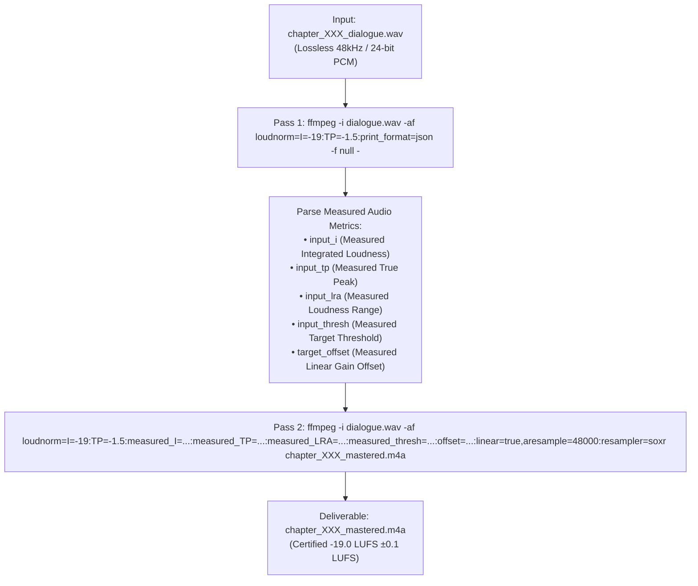
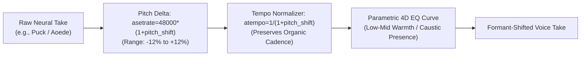

# 🎛️ Studio Vocal Audio Engineering & Broadcast Mastering Manual

**Standard**: `v6.0-ENTERPRISE-DAG`  
**System**: Pure Vocals-Only Studio Mastering Engine  
**Target Broadcast Standards**: Audible Studios / EBU R128 / ITU-R BS.1770-4  

---

## 1. Executive Summary & Pure Vocals-Only Invariant

Audiobook production on the **v6.0-ENTERPRISE-DAG** engine is 100% focused on **pristine vocal clarity, multi-character voice acting, 4D acoustic formants, and Audible/EBU R128 compliance**.

> [!IMPORTANT]
> **Pure Vocals-Only Architectural Invariant**:
> Background music (BGM), sound effects (SFX), Archive.org sound scraping, and 5-track Foley mixdowns are permanently decoupled and archived in `archive/cinematic_audio/`.
> Vocal production compute is dedicated entirely to neural speech excellence, Stanislavski directing anchors, 4D formants, Dialogue Editorial micro-fades (DE-01 - DE-07), and two-pass linear loudnorm mastering.

---

## 2. Broadcast Audio Standards & Objective Targets

| Metric | Target Specification | Enforcement Mechanism | Rationale |
|:---|:---:|:---|:---|
| **Integrated Vocal Loudness** | **-19.0 LUFS** ($\pm 0.5$ LUFS) | Two-Pass Measured Linear Loudnorm | International broadcast standard for audiobooks (Audible, Apple Books, BBC Radio 4). |
| **True Peak Hard Ceiling** | $\le$ **-1.5 dBTP** | `alimiter` + Linear Loudnorm Offset | Prevents inter-sample distortion and codec clipping during lossy M4B / AAC compression. |
| **Loudness Range (LRA)** | $\le$ **6.5 LU** | Gate 5.0 Loudness Consistency | Balances dramatic whispered pathos with loud shouted combat beats without ear fatigue. |
| **Sample Rate** | **48,000 Hz** (48kHz) | Kaiser Sinc Resampler (`aresample=48000:resampler=soxr`) | Studio standard matching Android/iOS hardware DACs and Audible high-definition audio. |
| **Bit Depth & Format** | **24-bit PCM** (Master) / **AAC-LC** (M4B) | FFmpeg Studio Mastering Engine | Uncompressed lossless intermediate dialogue stems and high-fidelity packaged container. |
| **Micro-Fades** | **12ms** In / **18ms** Out | Hann Window at -52 dBFS Zero-Crossings | Eliminates audio pops, click artifacts, and noise floor discontinuities at speech boundaries. |
| **Speech Floor Snapping** | **-52.0 dBFS** | DE-01 Endpoint Snapping | Cuts dead air and room-tone breathing while retaining natural consonant endings. |

---

## 3. Two-Pass Measured Linear Loudnorm Workflow

To eliminate the gain pumping, breathing artifacts, and pause distortion inherent in single-pass dynamic compressors, the mastering engine utilizes a deterministic **Two-Pass Measured Linear Loudnorm**:



### 3.1 Pass 1: Forensic Acoustic Measurement
Runs FFmpeg with `-f null -` to calculate true integrated loudness and spectral energy distribution:
```bash
ffmpeg -hide_banner -nostats -i "chapter_003_dialogue.wav" \
  -af "loudnorm=I=-19.0:TP=-1.5:LRA=6.5:print_format=json" \
  -f null -
```

### 3.2 Pass 2: Linear Non-Pumping Application
Applies linear gain adjustment with measured offsets, guaranteeing zero breathing or volume modulation during conversational pauses:
```bash
ffmpeg -y -i "chapter_003_dialogue.wav" \
  -af "loudnorm=I=-19.0:TP=-1.5:LRA=6.5:measured_I=-22.4:measured_TP=-2.1:measured_LRA=5.8:measured_thresh=-32.6:offset=0.2:linear=true,aresample=48000:resampler=soxr" \
  -c:a aac -b:a 192k "chapter_003_mastered.m4a"
```

---

## 4. The Zero De-Esser Invariant (Hindi Dental & Aspirated Consonant Protection)

> [!CAUTION]
> **Zero De-Esser Invariant**:
> Dynamic multiband de-essers and hardware sibilance compressors are **strictly banned** on this pipeline.

### Linguistic Rationale:
Devanagari Hindustani relies heavily on dental and aspirated consonants (*दंत्य एवं महाप्राण व्यंजन*):
- **Dental Sibilants**: स (`sa`), श (`sha`), ष (`ṣa`)
- **Aspirated Consonants**: छ (`chha`), थ (`tha`), ध (`dha`), ख (`kha`), घ (`gha`)

Conventional de-essers interpret the natural high-frequency energy of these consonants (4.5 kHz – 8.5 kHz) as unwanted English sibilance ("ess" spit) and compress them aggressively. This results in muffled speech, lisps, and distorted words (e.g. *सिल्वर* sounding like *थिल्वर*, *साथ* sounding like *सात*). 

Instead of de-essers, clean vocal delivery is achieved via:
1. Clamped model temperature (`0.30 - 0.52`).
2. Highpass DC filtering at 40 Hz (`highpass=f=40`).
3. Kaiser Sinc anti-aliasing resampling.

---

## 5. 4D Acoustic Formant DSP Architecture

To prevent vocal convergence when multiple characters share similar base TTS voices, the engine applies real-time **4D Formant Modulation**:

$$\text{Voice Characterization} = \text{Base Voice} + \Delta\text{Pitch} + \Delta\text{Tempo} + \text{Parametric EQ Curve}$$



### Pre-Configured Formant Profiles:
- **`BASS_BOOST_HERO`**: `equalizer=f=180:width_type=o:w=1.2:g=3.5,equalizer=f=320:width_type=o:w=1.0:g=2.0` (Deep, resonant chest voice).
- **`CAUSTIC_MAGE`**: `equalizer=f=2800:width_type=o:w=1.5:g=3.0,equalizer=f=350:width_type=o:w=1.0:g=-2.5` (Cutting presence, dry midrange).
- **`WARM_NARRATOR`**: `equalizer=f=220:width_type=o:w=1.0:g=1.5,equalizer=f=4500:width_type=o:w=1.2:g=1.2` (Articulate authorial clarity).
- **`RUSTIC_GRUFF`**: `equalizer=f=120:width_type=o:w=0.8:g=4.0,equalizer=f=1800:width_type=o:w=1.2:g=-3.0` (Heavy gravelly timbre).

---

## 6. Dialogue Editorial Rules (DE-01 through DE-07)

```
┌────────────────────────────────────────────────────────────────────────┐
│                   DE-01 - DE-07 EDITORIAL DSP CHAIN                    │
├─────────┬─────────────────────────────┬────────────────────────────────┤
│ Rule    │ Name                        │ Technical DSP Implementation   │
├─────────┼─────────────────────────────┼────────────────────────────────┤
│ DE-01   │ Endpoint Zero-Crossing Snip │ Silence trim at -52 dBFS       │
│ DE-02   │ Hann Micro-Fades            │ 12ms Fade-In / 18ms Fade-Out   │
│ DE-03   │ Sub-Bass Butterworth Filter │ `highpass=f=40:width_type=q:w=0.707` │
│ DE-04   │ Contextual Turn Latency     │ 60ms (Banter) to 2200ms (Beat) │
│ DE-05   │ Conversational Overlap      │ -100ms to -350ms Negative Gap  │
│ DE-06   │ Subtle Spatial Azimuth      │ `pan=stereo|c0=...|c1=...` (±12%) │
│ DE-07   │ Relative Breath Notch       │ -6.0 dB relative attenuation   │
└─────────┴─────────────────────────────┴────────────────────────────────┘
```

---

## 7. Single-Pass M4B Container Packaging

Mastered chapters are packaged into a single `.m4b` container with embedded cover art and `FFMETADATA1` navigation markers:

```bash
ffmpeg -y -f concat -safe 0 -i chapter_concat_list.txt \
  -i "assets/cover.jpg" \
  -i "metadata/chapters.ffmetadata" \
  -map 0:a -map 1:v \
  -map_metadata 2 \
  -c:a copy -c:v mjpeg -disposition:v:0 attached_pic \
  -movflags +faststart \
  "output/Sword_of_Destiny.m4b"
```
