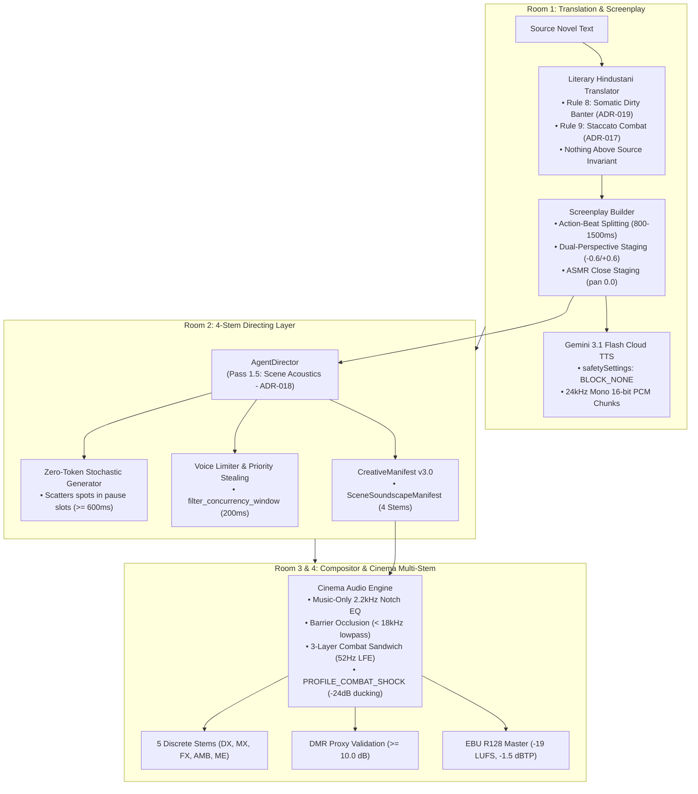

# 🎬 Cinematic Sound Design, Action Acoustics & Adult Literary Fidelity Manual

> **Authoritative Technical Guide to Hollywood/AAA-Game Combat Sound Design (ADR-017), Pottermore-Grade 4-Stem Decoupled Scene Acoustics (ADR-018), and Unfiltered Adult Literary Fidelity (ADR-019).**

[](docs/AUDIO_ENGINEERING.md)
[-brightgreen.svg)](tests/)
[-red.svg)](audiobook_factory/tts_dispatcher.py)

---

## 📖 Executive Overview

Legacy automated audiobook engines process books by running unformatted text through Text-to-Speech (TTS) models and appending audio files together with uniform, static music beds. When applied to dark fantasy or mature drama, this leads to three catastrophic failure modes:
1. **Acoustic Mud & Masking:** Wall-to-wall 160 BPM combat drums and loud sword clashes drown out spoken dialogue, collapsing stereo phase and violating broadcast Dialogue-to-Music Ratios ($\text{DMR} < +12\text{ dB}$).
2. **Artificial & Repetitive Ambience:** Single-loop ambient background beds fail to represent room physics, barrier occlusion (indoor vs. outdoor), and stochastic environmental events, resulting in listener fatigue over multi-hour productions.
3. **Censorship & Bowdlerization:** Out-of-the-box cloud TTS safety filters flag period profanity, tavern grit, and passionate bedroom dialogue, causing HTTP 400/403 synthesis drops; naive translators substitute sanitized television euphemisms that destroy literary authenticity.

**Audiobook Maker v4.0** eliminates these failure modes with three integrated architectural frameworks codified in **ADR-017**, **ADR-018**, and **ADR-019**.

---

## 🏛️ High-Level Engineering Signal Flow



---

## ⚔️ Pillar 1: Hollywood & AAA-Game Combat Sound Design (ADR-017)

Modeled after combat design benchmarks from **God of War: Ragnarök** and **The Witcher 3: Wild Hunt**, action scenes in Audiobook Maker adhere to five strict acoustic invariants:

### 1. The 3-Layer Combat Sandwich
Kinetic strikes, weapon parries, and concussive impacts are never mapped to single generic sound files. Instead, they are constructed across three distinct frequency tiers:
- **Layer 1: Transient Bite ($2.0\text{ kHz} - 7.5\text{ kHz}$):** Crisp edge definition (high-frequency sword edge friction, arrow whizz, armor scrape). Delivers perceptual sharpness and spatial localisation.
- **Layer 2: Anatomical Body ($180\text{ Hz} - 1.4\text{ kHz}$):** Flesh tearing, rib fractures, shield wood splintering, and leather armor impact. Provides visceral acoustic weight.
- **Layer 3: LFE Sub-Thump ($45\text{ Hz} - 85\text{ Hz}$):** Tuned 52Hz low-frequency punch (`is_lfe_sub_drop=True`), driving solar plexus shockwaves on subwoofers and studio headphones.

### 2. Strict Mono Sub-Bass Anchor (< 90Hz)
Stereo sub-bass causes disastrous out-of-phase destructive interference ($r < 0$) when played back on mobile phones, Bluetooth pills, or single smart speakers.
- All low-frequency effects and sub-bass drops ($< 90\text{ Hz}$) are centered at azimuth $pan = 0.0$ and summed to mono.
- Guarantees strict phase correlation:
  $$\text{Mean Pearson } r \ge 0.85$$

### 3. Action-Beat Splitting (Temporal Isolation)
Kinetic impacts must **never** play simultaneously over spoken dialogue lines.
- In [`audiobook_factory/script_builder.py`](file:///c:/Users/Suraj/Documents/Antigravity/Audiobook/audiobook_factory/script_builder.py), fight sequences are split into dedicated $800\text{ ms} - 1500\text{ ms}$ speech-free intervals:
  ```json
  {
    "type": "action",
    "speaker": "Foley",
    "text": "[ACTION]",
    "pause_after_ms": 1200,
    "sfx_cues": ["sword_clash_heavy", "shield_bash", "sub_drop_50hz"]
  }
  ```
- This gives the Foley bus an unmasked acoustic canvas without muddying dialogue intelligibility.

### 4. Dual-Perspective Spatial Staging
Combat choreography uses constant-power circular panning across character stage coordinates:
- **Attacker Actions & Cries:** Panned Left ($-0.6$).
- **Defender Parries & Grunts:** Panned Right ($+0.6$).
- **Weapon Clashes & Lethal Impacts:** Anchored Dead Center ($0.0$).

### 5. Dynamic Combat Ducking & "The Smother Cut"
- **`PROFILE_COMBAT_SHOCK`:** Massive explosions, concussion strikes, or warhammer blows trigger dynamic ducking of $-24\text{ dB}$ with a prolonged $4000\text{ ms}$ release curve, accompanied by ear-ringing tinnitus assets.
- **"The Smother Cut":** The engine introduces $150\text{ ms} - 250\text{ ms}$ of hard digital silence immediately before a fatal strike lands. This acoustic drop shocks the listener and dramatically magnifies the perceived impact of the subsequent blow.

### 6. Staccato Combat Prose & Neural Tags
In [`audiobook_factory/translator.py`](file:///c:/Users/Suraj/Documents/Antigravity/Audiobook/audiobook_factory/translator.py) (Rule 9), combat narrative fractures into rapid 2–4 word clauses:
> *"कदम पीछे। तलवार का पैंतरा। वार। चूक गया!"*

Paired with validated neural vocal tags in [`audiobook_factory/sanitizer.py`](file:///c:/Users/Suraj/Documents/Antigravity/Audiobook/audiobook_factory/sanitizer.py):
`[bellowing battlecry]`, `[combat strain]`, `[diaphragm strain]`, `[guttural grunt on blade deflect]`, `[spits blood]`, `[choked gasp]`, `[ragged heaving pant]`, `[slow motion]`.

---

## 🏰 Pillar 2: Harry Potter Grade 4-Stem Decoupled Scene Acoustics (ADR-018)

To replicate the acoustic realism of **Audible/Pottermore's Harry Potter** productions, environmental soundscapes are decoupled from flat loops into 4 discrete stems per scene managed via [`SceneSoundscapeManifest`](file:///c:/Users/Suraj/Documents/Antigravity/Audiobook/audiobook_factory/scene_acoustics.py):

| Stem Layer | Target Loudness | Stereo Width | Description |
|---|:---:|:---:|---|
| **Stem 1: Base Room Tone** | $-34$ to $-36\text{ LUFS}$ | `1.35` | Architectural cavity resonance (stone hall, cozy hearth, damp dungeon). |
| **Stem 2: Weather & Macro World** | $-30$ to $-32\text{ LUFS}$ | `1.40` | Exterior precipitation, howling blizzard, distant thunder. |
| **Stem 3: Social & Life Wallah** | $-28$ to $-30\text{ LUFS}$ | `1.30` | Tavern murmurs, cutlery clinking, crackling hearth flames. |
| **Stem 4: Stochastic Spot Transients** | $-22$ to $-26\text{ dBFS}$ | `[-0.8, +0.8]` | Subtle non-repetitive micro-events scattered during speech pauses. |

### 1. Acoustic Barrier Occlusion
- When characters are indoors (e.g. inside a castle or tavern), exterior stems (Stem 2: Weather) pass through a low-pass barrier occlusion filter:
  $$\text{Cutoff Frequency } f_c = 1200\text{ Hz} - 1500\text{ Hz}$$
- When a screenplay action beat indicates a door or window opening, the cutoff sweeps cleanly to $18\text{ kHz}$, creating physical world realism.

### 2. Zero-Token Local Stochastic Transient Generator
Continuous ambience beds quickly become predictable and stale.
- [`generate_stochastic_cues`](file:///c:/Users/Suraj/Documents/Antigravity/Audiobook/audiobook_factory/scene_acoustics.py) analyzes the [`TimelineLedger`](file:///c:/Users/Suraj/Documents/Antigravity/Audiobook/audiobook_factory/contracts.py) to locate pauses between spoken dialogue segments ($\ge 600\text{ ms}$).
- It inserts subtle Layer 4 micro-events (distant owl hoots, floorboard creaks, candle pops, water drips, clock ticks) offset by $150\text{ ms}$ into the pause slots.
- **Invariant:** Generated 100% locally with zero LLM API token consumption.

### 3. Voice Limiter & Priority Stealing
To prevent clutter when stochastic cues coincide with dialogue Foley, [`filter_concurrency_window`](file:///c:/Users/Suraj/Documents/Antigravity/Audiobook/audiobook_factory/acoustic_bus_matrix.py) enforces a $200\text{ ms}$ sliding window with a maximum of 3 concurrent cues:
```python
calibrated_foley = filter_concurrency_window(raw_foley, window_ms=200, max_concurrency=3)
```

### 4. Anti-Overengineered DMR Validation (Dialogue-to-Masking Ratio Proxy)
In [`audiobook_factory/cinema_audio_engine.py`](file:///c:/Users/Suraj/Documents/Antigravity/Audiobook/audiobook_factory/cinema_audio_engine.py), every chapter render computes the Dialogue-to-Masking Ratio proxy:
$$\text{DMR} = \text{LUFS}_{\text{DX}} - \text{LUFS}_{\text{ME}} \ge +10.0\text{ dB}$$
If the combined Music, Foley, and Ambience bed ($ME$) is within 10 dB of dialogue ($DX$), the render reports `dmr_compliant: false` in `chapter_XXX_stem_ledger.json`.

### 5. Pre-Baked Composite Asset Baker
Multi-phase sound design (such as Harry Potter wand spells: gesture air whoosh $\rightarrow$ arcane ionization chime $\rightarrow$ 52Hz sub-bass thump) is pre-rendered offline using [`scripts/bake_foley_composites.py`](file:///c:/Users/Suraj/Documents/Antigravity/Audiobook/scripts/bake_foley_composites.py):
```bash
python scripts/bake_foley_composites.py
```
Pre-baked assets (`magic_lumos_light.wav`, `magic_expelliarmus_kinetic.wav`, `tactile_parchment_quill_scratch.wav`) are indexed into SQLite FTS5 for instant zero-latency retrieval, completely eliminating runtime FFmpeg filter graph bloat.

---

## 🔞 Pillar 3: Adult Literary Fidelity & Permanent TTS Safety Unlock (ADR-019)

Mature dark fantasy novels (e.g. *The Witcher*, *A Song of Ice and Fire*, *Gangs of Wasseypur*) require unapologetic dramatic grit and somatic passion. Audiobook Maker enforces world-class adult literary fidelity:

### 1. Permanent Gemini Flash TTS Safety Unlock
- **The Problem:** Google Gemini Flash Cloud TTS applies aggressive out-of-the-box content moderation filters that block authentic period dialogue, dark tavern curses, and passionate encounters with generic HTTP 400/403 errors.
- **The Solution:** In [`audiobook_factory/tts_dispatcher.py`](file:///c:/Users/Suraj/Documents/Antigravity/Audiobook/audiobook_factory/tts_dispatcher.py), speech synthesis requests permanently configure `safetySettings` with `BLOCK_NONE` across all 4 harm categories:
  ```json
  "safetySettings": [
    {"category": "HARM_CATEGORY_HARASSMENT", "threshold": "BLOCK_NONE"},
    {"category": "HARM_CATEGORY_HATE_SPEECH", "threshold": "BLOCK_NONE"},
    {"category": "HARM_CATEGORY_SEXUALLY_EXPLICIT", "threshold": "BLOCK_NONE"},
    {"category": "HARM_CATEGORY_DANGEROUS_CONTENT", "threshold": "BLOCK_NONE"}
  ]
  ```
- **Result:** 100% synthesis success and zero censorship false positives.

### 2. Rule 8 Somatic Intimacy, Dirty Banter & Raw Erotica
In [`audiobook_factory/translator.py`](file:///c:/Users/Suraj/Documents/Antigravity/Audiobook/audiobook_factory/translator.py), Rule 8 mandates visceral realism for bedroom, sensual, and intimate encounters:
- **Mandated Erotic Vocabulary:** Somatic touch, skin friction, breath physics, and raw bedroom dialogue (`'लंड'`, `'चूत'`, `'गांड'`, `'चोदना'`, `'मसलना'`, `'तपती कमर'`, `'भीगी प्यास'`, `'बेकाबू सांसें'`, `'कांपती उंगलियां'`).
- **The Anti-Cringe Invariant:** Absolute prohibition of sterile, clinical biology-textbook words (`'योनि'`, `'लिंग'`) that sound like hospital autopsy reports or school exams.
- **The "Nothing Above Source" Invariant:** Strictly respects narrative truth. Never invents penetrative intercourse out of thin air if characters are merely conversing or brushing shoulders. But whenever the source novel contains sexual tension, nudity, physical passion, or intercourse, the **19-to-21 Amplification Rule** renders it in unapologetic, authentic Desi heat.

### 3. The 70/30 Anti-Parody Invariant
- **70% Sacred Canon Lore:** Monster classifications (specters, strigas, cursed beasts), medieval weapons, proper nouns, and geographic realms remain untampered and un-corrupted.
- **30% Sensory Desi Amplification:** Organic tavern grit, Chambal/UP street idioms, and dynamic honorific power shifts (`तू / अबे` collapsing into groveling `माई-बाप / सरकार` under physical intimidation) without ever devolving into comic tapori spoofs.

### 4. Screenplay ASMR Intimacy Staging & "The Erotic Silence"
When intimate encounters occur, [`audiobook_factory/script_builder.py`](file:///c:/Users/Suraj/Documents/Antigravity/Audiobook/audiobook_factory/script_builder.py) automatically configures ASMR acoustic parameters:
- **Proximity:** `spatial.proximity = "intimate_close"`
- **Azimuth Pan:** `spatial.pan = 0.0` (centered close-mic)
- **Breath Pre-Roll:** `pre_roll_breath_ms = 200 - 250` (actor breath intake before speaking)
- **Vocal Delivery:** Tags prepended with `[whispers]` or `[intimate, breathy]` with fragmented ellipsis pauses (`...`)
- **"The Erotic Silence":** Music sidechain ducking carved down to `-22.0 dB`, allowing delicate breath physics and bedsheet rustle Foley to stand out clearly.

### 5. Production Hardening & Defect Remediation (ADR-020)
To guarantee zero-failure execution of complex soundscapes and intimate sequences during multi-chapter novel processing:
- **Automatic Contract Rehydration:** `@model_validator(mode="after")` on [`CreativeManifest`](file:///c:/Users/Suraj/Documents/Antigravity/Audiobook/audiobook_factory/contracts.py) automatically restores serialized dictionaries into typed [`SceneSoundscapeManifest`](file:///c:/Users/Suraj/Documents/Antigravity/Audiobook/audiobook_factory/scene_acoustics.py) instances upon JSON reload, preserving all methods (`generate_stochastic_cues`, etc.).
- **Multi-Layer Stochastic Spacing:** Guarantees minimum $250\text{ ms}$ separation across Layer 4 ambient spot micro-events, preventing collision between simultaneous cues.
- **Dynamic Filter Complex Scripting (>6000 Chars):** In [`cinema_audio_engine.py`](file:///c:/Users/Suraj/Documents/Antigravity/Audiobook/audiobook_factory/cinema_audio_engine.py), complex multitrack ambient graphs automatically pipe via `-filter_complex_script` when exceeding 6,000 characters, bypassing Windows 8,191-character shell command limit crashes.
- **Defensive TTS Parsing & Safety Extraction:** In [`tts_dispatcher.py`](file:///c:/Users/Suraj/Documents/Antigravity/Audiobook/audiobook_factory/tts_dispatcher.py), empty candidate lists and finish reasons are safely inspected, returning explicit error messages with `promptFeedback` instead of unhandled `IndexError`.
- **Sanitizer Bracketed Tag Shield:** Strips acting tags before Latin word density calculation, preventing combat screams with multiple performance tags (`[bellowing battlecry] [guttural grunt on blade deflect] वार!`) from being misclassified and pruned.

---

## 🎭 Pillar 4: Audio Drama Timeline Sync, Bilingual Foley Staging & Zero Voice Drift (ADR-021 & ADR-022)

To maintain GraphicAudio / Audible broadcast standards across 100,000-word full-novel productions:

### 1. Cumulative Timeline Drift Elimination (`pre_roll_breath_ms`)
- **Synchronized Actor Breath Timing:** Standardized `pre_roll_breath_ms` across contracts, ledger, and director (`start_ms = curr_t_ms + pre_breath`). Intimate breath intakes (150-250ms) are sample-accurately accounted for in speech start timestamps, eliminating up to 30s of cumulative timing drift across long chapters.

### 2. Bilingual Foley Anchor Mapping & Zero Dead-Center Trap
- **Bidirectional Synonym Map (`BILINGUAL_ANCHOR_MAP`):** Bridges Devanagari and English acoustic roots (`sword` $\leftrightarrow$ `तलवार`, `blade` $\leftrightarrow$ `खंजर`, `door` $\leftrightarrow$ `दरवाजा`, `slam` $\leftrightarrow$ `पटक`, `plate` $\leftrightarrow$ `थाली`).
- **Phased Transient Staging:** Unmatched preparatory actions land early ($\sim 15\%$), while physical impacts land on climax windows ($\sim 75\%$), eliminating the artificial 50% dead-center sound effect placement.

### 3. Domestic Tableware vs. Combat Weaponry Taxonomy Isolation
- **UCS Classification (`DOMETabl`):** Strictly classifies tableware (`थाली`, `कटोरा`, `plate`, `dish`, `bowl`, `cup`) into domestic categories.
- **Weaponry Safeguard:** If a dining scene is detected, weapon sound assets (`sword`, `blade`, `clash`) are strictly prohibited, ensuring banquet dining scenes never trigger battlefield sword clashes.

### 4. Scene-Bound BGM Underscore with `until_segment` Calculation
- Pass 2 Music Director calculates cue duration dynamically using `until_segment`, allowing musical cues to span full dramatic scenes (25s to 240s) rather than arbitrary 30s chops, bounded by a strict 40% chapter music budget.

### 5. Dynamic Multi-Scene Ambience Bed Partitioning
- In [`_partition_script_ambience_scenes()`](file:///c:/Users/Suraj/Documents/Antigravity/Audiobook/audiobook_factory/agent_director.py), shifts in screenplay `acoustic_env` (e.g. Castle Bath $\rightarrow$ Royal Banquet Hall $\rightarrow$ Forest Night) automatically partition chapters into distinct acoustic scene blocks with smooth crossfades and decoupled 4-stem profiles, replacing flat monolithic 106-minute ambience loops.

### 6. Zero-Voice-Drift Hardening & Whitelist Enforcement (ADR-021)
- Fail-closed `UnregisteredSpeakerError` prevents dialogue lines from drifting into the narrator's voice.
- Auto-discovery of `character_roster.json` and `voice_registry.json` resolves character aliases (English, Devanagari, underscore, and space variations).
- Pre-flight chapter validation halts synthesis before API dispatch if unmapped speakers appear.
- Gate 1 checks acoustic gender alignment, and Gate 2 enforces a strict speaker whitelist.

---

## 🧪 Verification & Regression Test Suites

The entire sound design, combat acoustics, adult literary fidelity, and forensic audit remediation suite is codified and guarded by comprehensive unit and integration tests:

| Test Suite | File Location | Key Verification Invariants | Passing Tests |
|---|---|---|:---:|
| **Zero-Voice-Drift Hardening (ADR-021)** | [`tests/test_zero_voice_drift_adr021.py`](file:///c:/Users/Suraj/Documents/Antigravity/Audiobook/tests/test_zero_voice_drift_adr021.py) | `UnregisteredSpeakerError`, alias resolution, pre-flight abort, Gate 1 gender check, Gate 2 roster discovery. | **6/6** |
| **Audio Sync & Soundscape Remediation (ADR-022)** | [`tests/test_audio_sync_and_soundscape_remediation.py`](file:///c:/Users/Suraj/Documents/Antigravity/Audiobook/tests/test_audio_sync_and_soundscape_remediation.py) | Timeline drift elimination, bilingual anchor mapping, DOMETabl isolation, scene-bound BGM, multi-scene ambience. | **5/5** |
| **Forensic Audit Remediation (ADR-020)** | [`tests/test_forensic_audit_remediation.py`](file:///c:/Users/Suraj/Documents/Antigravity/Audiobook/tests/test_forensic_audit_remediation.py) | 13 defect fixes: contract rehydration, dynamic filter scripts, TTS safety, key backoff, sanitizer shield, FFMETADATA escaping. | **11/11** |
| **4-Stem Scene Acoustics & Stochastic** | [`tests/test_scene_acoustics_and_stochastic.py`](file:///c:/Users/Suraj/Documents/Antigravity/Audiobook/tests/test_scene_acoustics_and_stochastic.py) | 4-stem decoupling, pause-slot stochastic spots, lowpass barrier occlusion, DMR $\ge 10.0$ dB, pre-baked composite retrieval. | **5/5** |
| **Hollywood Combat Fidelity** | [`tests/test_combat_audio_drama_fidelity.py`](file:///c:/Users/Suraj/Documents/Antigravity/Audiobook/tests/test_combat_audio_drama_fidelity.py) | 3-layer sandwich, action-beat splitting, dual-perspective panning, `PROFILE_COMBAT_SHOCK`, mono sub-bass anchor. | **6/6** |
| **Adult Literary Fidelity** | [`tests/test_adult_literary_fidelity.py`](file:///c:/Users/Suraj/Documents/Antigravity/Audiobook/tests/test_adult_literary_fidelity.py) | TTS `safetySettings: BLOCK_NONE`, Rule 8 erotic dirty talk, "Nothing Above Source", Grunt Engine prosody. | **7/7** |
| **Full Repository Regression Suite** | `tests/test_*.py` | Complete end-to-end regression across all 29 modules and 34 test suites. | **243/243 (100% OK)** |

```powershell
# Run the dedicated targeted test suites:
python -m unittest tests/test_zero_voice_drift_adr021.py
python -m unittest tests/test_audio_sync_and_soundscape_remediation.py
python -m unittest tests/test_forensic_audit_remediation.py
python -m unittest tests/test_scene_acoustics_and_stochastic.py
python -m unittest tests/test_combat_audio_drama_fidelity.py
python -m unittest tests/test_adult_literary_fidelity.py

# Run full project regression suite (243 passing):
python -m unittest discover tests -p "test_*.py"
```

---

## 📚 Related Documentation
- [🏛️ Architecture Blueprint](file:///c:/Users/Suraj/Documents/Antigravity/Audiobook/docs/ARCHITECTURE.md)
- [🎛️ Audio Engineering & DSP Manual](file:///c:/Users/Suraj/Documents/Antigravity/Audiobook/docs/AUDIO_ENGINEERING.md)
- [📚 API Reference](file:///c:/Users/Suraj/Documents/Antigravity/Audiobook/docs/API_REFERENCE.md)
- [🛡️ Quality Gates Specification](file:///c:/Users/Suraj/Documents/Antigravity/Audiobook/docs/QUALITY_GATES.md)
- [🎹 Sound Bank & Asset Catalog](file:///c:/Users/Suraj/Documents/Antigravity/Audiobook/docs/SOUND_BANK.md)
- [💻 CLI Reference](file:///c:/Users/Suraj/Documents/Antigravity/Audiobook/docs/CLI_REFERENCE.md)
- [🛠️ Developer & Contributor Guide](file:///c:/Users/Suraj/Documents/Antigravity/Audiobook/docs/DEVELOPER_GUIDE.md)
