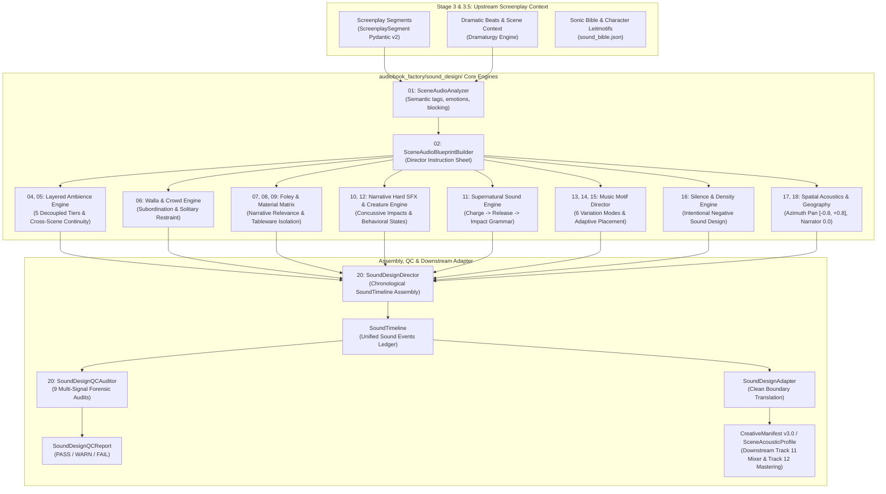

# 🎬 Commercial Cinematic Sound Design Subsystem Manual

> **Authoritative Technical Guide to the 20 Commercial Audio Drama Sound Design Capabilities (Phases A–G, ADR-034), Forensic Adversarial Audit Remediation (ADR-035), Next-Gen Production Upgrades (ADR-036), and Studio Quality Upgrades (ADR-037).**

[](docs/AUDIO_ENGINEERING.md)
[](tests/)
[](docs/ARCHITECTURE.md)
[](audiobook_factory/sound_design/contracts.py)

---

## 📖 Executive Summary

The **Commercial Cinematic Sound Design Subsystem** (`audiobook_factory/sound_design/`) elevates Audiobook Maker from basic dialogue-and-music narration to **full-cast commercial audio drama quality**, benchmarked directly against productions such as the *Harry Potter / Pottermore* full-cast series, BBC Radio 4 dramas, and AAA-game cinematic soundscapes.

Unlike greenfield rewrites, this subsystem integrates seamlessly into the existing repository architecture through a clean, non-invasive adapter boundary ([`SoundDesignAdapter`](file:///c:/Users/Suraj/Documents/Antigravity/Audiobook/audiobook_factory/sound_design/adapter.py)). It operates strictly upstream of downstream stem mixing (Track 11) and broadcast mastering (Track 12), ensuring complete separation of creative sound design intent from final DSP rendering.

---

## 🏛️ Subsystem Architecture & Signal Flow



---

## 🎯 The 20 Commercial Sound Design Capabilities

The subsystem modularly implements all 20 commercial sound design capabilities across 7 phases:

| Capability | Module | Core Functionality |
| :--- | :--- | :--- |
| **01. Scene Audio Understanding** | [`scene_understanding.py`](file:///c:/Users/Suraj/Documents/Antigravity/Audiobook/audiobook_factory/sound_design/scene_understanding.py) | Parses dramatic text, screenplay tags, and blocking into structured acoustic intent without mandatory generative API cost. |
| **02. Scene Audio Blueprint** | [`blueprint.py`](file:///c:/Users/Suraj/Documents/Antigravity/Audiobook/audiobook_factory/sound_design/blueprint.py) | Compiles persistent director instruction sheets (`SceneAudioBlueprint`) specifying staging, layers, and restraint targets. |
| **03. Environment World Profiles** | [`environment_profiles.py`](file:///c:/Users/Suraj/Documents/Antigravity/Audiobook/audiobook_factory/sound_design/environment_profiles.py) | 12 canonical world profiles (Great Hall, Crypt, Deep Forest, Mountain Blizzard, Swamp, etc.) extending `WorldAcousticProfile`. |
| **04. Layered Ambience Engine** | [`ambience_engine.py`](file:///c:/Users/Suraj/Documents/Antigravity/Audiobook/audiobook_factory/sound_design/ambience_engine.py) | Decouples environment beds across 5 tiers: `BASE`, `MIDGROUND`, `FOREGROUND`, `DISTANT`, and `MICRO_TEXTURE`. |
| **05. Ambience Evolution & Continuity** | [`ambience_engine.py`](file:///c:/Users/Suraj/Documents/Antigravity/Audiobook/audiobook_factory/sound_design/ambience_engine.py) | Tracks persistent acoustic state across scene boundaries to prevent jarring loop restarts in recurring environments. |
| **06. Contextual Walla (Crowd)** | [`walla_engine.py`](file:///c:/Users/Suraj/Documents/Antigravity/Audiobook/audiobook_factory/sound_design/walla_engine.py) | Models background human activity (`tavern_murmur`, `market_bustle`, etc.) with strict dialogue subordination and solitary scene restraint. |
| **07. Foley Intelligence & Relevance** | [`foley_engine.py`](file:///c:/Users/Suraj/Documents/Antigravity/Audiobook/audiobook_factory/sound_design/foley_engine.py) | Multi-factor narrative relevance scoring ($0.0 - 1.0$) with conscious blanket rejection of trivial low-value verbs (`blink`, `sigh`). |
| **08. Character Foley Profiles** | [`foley_character_material.py`](file:///c:/Users/Suraj/Documents/Antigravity/Audiobook/audiobook_factory/sound_design/foley_character_material.py) | Models character physics (body mass, footwear, armor weight, condition) governing locomotion sound design. |
| **09. Material Interaction Matrix** | [`foley_character_material.py`](file:///c:/Users/Suraj/Documents/Antigravity/Audiobook/audiobook_factory/sound_design/foley_character_material.py) | Surface acoustic resonators $\times$ footwear/exciter physics with strict tableware vs. weapon clash acoustic isolation. |
| **10. Narrative Hard SFX Impacts** | [`narrative_sfx.py`](file:///c:/Users/Suraj/Documents/Antigravity/Audiobook/audiobook_factory/sound_design/narrative_sfx.py) | High-attention narrative physical events (explosions, gate slams, structural crashes) with transient bite, body, and LFE. |
| **11. Magical Sound Language** | [`magical_sound.py`](file:///c:/Users/Suraj/Documents/Antigravity/Audiobook/audiobook_factory/sound_design/magical_sound.py) | Deconstructs supernatural acts into canonical stages: `CHARGE -> RELEASE -> IMPACT / SHIELD / TELEPORT / CURSE`. |
| **12. Creature Sound Entities** | [`narrative_sfx.py`](file:///c:/Users/Suraj/Documents/Antigravity/Audiobook/audiobook_factory/sound_design/narrative_sfx.py) | 4-layer non-human creature entities (vocalizations, respiration, locomotion, body mass) tied to behavioral states. |
| **13. Leitmotif Thematic Identity** | [`music_motif_director.py`](file:///c:/Users/Suraj/Documents/Antigravity/Audiobook/audiobook_factory/sound_design/music_motif_director.py) | Persistent musical signatures bound to characters and themes, extending `LeitmotifDefinition`. |
| **14. Dynamic Motif Variations** | [`music_motif_director.py`](file:///c:/Users/Suraj/Documents/Antigravity/Audiobook/audiobook_factory/sound_design/music_motif_director.py) | 6 dramatic variation modes: `INTIMATE`, `MYSTERIOUS`, `TRAGIC`, `TENSE`, `CLIMAX`, and `AFTERMATH`. |
| **15. Adaptive Music Cue Placement** | [`music_motif_director.py`](file:///c:/Users/Suraj/Documents/Antigravity/Audiobook/audiobook_factory/sound_design/music_motif_director.py) | Context-aware cue scheduling with boundary clamping to prevent cross-scene spill. |
| **16. Silence / Negative Sound Design** | [`silence_engine.py`](file:///c:/Users/Suraj/Documents/Antigravity/Audiobook/audiobook_factory/sound_design/silence_engine.py) | First-class negative sound events (ambient drops, foley suppression, walla drops, reveal breaths) & adaptive density budgets. |
| **17. Abstract Room Acoustics** | [`spatial_acoustics.py`](file:///c:/Users/Suraj/Documents/Antigravity/Audiobook/audiobook_factory/sound_design/spatial_acoustics.py) | Abstract propagation physics (RT60, absorption, reflections, barrier occlusion) without hardcoded DSP filters. |
| **18. Spatial Soundstage Geography** | [`spatial_acoustics.py`](file:///c:/Users/Suraj/Documents/Antigravity/Audiobook/audiobook_factory/sound_design/spatial_acoustics.py) | Coordinate management across stereo azimuth $[-0.8, +0.8]$, narrator locked to $0.0$, and spatial continuity across turns. |
| **19. Semantic Sound Retrieval** | [`asset_retriever.py`](file:///c:/Users/Suraj/Documents/Antigravity/Audiobook/audiobook_factory/sound_design/asset_retriever.py) | SQLite FTS5 semantic indexing, SHA-256 checksum provenance, zero unvetted JIT downloads, and DSP sanity checks. |
| **20. Master Sound Director & QC** | [`sound_director.py`](file:///c:/Users/Suraj/Documents/Antigravity/Audiobook/audiobook_factory/sound_design/sound_director.py), [`qc.py`](file:///c:/Users/Suraj/Documents/Antigravity/Audiobook/audiobook_factory/sound_design/qc.py) | Assembles chronological `SoundTimeline` and audits 9 forensic signals with fail-closed QC. |

---

## 🔒 Mandatory Architectural Invariants

### 1. Separation of Sound Intent vs. Final Mixing (Track 11 DSP Ownership)
Sound Design operates strictly at the level of creative intent. It **never** contains hardcoded LUFS targets, True Peak thresholds, fixed ducking decibels, or 2.2kHz notch EQ filters in its data structures.
- **Sound Design Outputs:** Relative intensity (`whisper_quiet`, `subtle_bed`, `normal`, `prominent`, `explosive_impact`), attention priority (`CRITICAL`, `HIGH`, `MEDIUM`, `LOW`, `TEXTURE`), mix intent flags (`duck_under_dialogue`, `swell_in_dialogue_pauses`, `sidechain_trigger`), and abstract spatial placement (`SpatialMetadata`).
- **Downstream Track 11/12 Owns:** Actual convolution reverb IR loading, gain staging in dBFS, compressor thresholds, and EBU R128 master rendering.

### 2. Scene-Adaptive Acoustic Density & Silence (No Rigid Universal 60% Rule)
The legacy rigid rule requiring $\ge 60\%$ silence across every scene was discarded. In its place, the [`SilenceEngine`](file:///c:/Users/Suraj/Documents/Antigravity/Audiobook/audiobook_factory/sound_design/silence_engine.py) calculates adaptive density targets:
- **`high` restraint** (intimate, stealth, horror, mystery): Target silence ratio $\approx 65\%$, active density $[15\%, 45\%]$.
- **`moderate` restraint** (standard dialogue, classroom, investigation): Target silence ratio $\approx 45\%$, active density $[35\%, 70\%]$.
- **`dense` restraint** (action climax, battle, panic, festival): Target silence ratio $\approx 20\%$, active density $[60\%, 88\%]$.

### 3. Domestic Tableware vs. Weapon Clash Acoustic Isolation
In dining scenes or tavern meals, domestic utensils (`plate`, `cup`, `goblet`, `थाली`, `कटोरा`) must **never** trigger metallic sword parry or weapon clash audio assets.
- Enforced at retrieval level in [`SoundAssetRetriever.resolve_foley_asset()`](file:///c:/Users/Suraj/Documents/Antigravity/Audiobook/audiobook_factory/sound_design/asset_retriever.py) by rejecting weapon keywords.
- Enforced at physical matrix level in [`MaterialMatrixEngine.is_weapon_vs_tableware_collision()`](file:///c:/Users/Suraj/Documents/Antigravity/Audiobook/audiobook_factory/sound_design/foley_character_material.py).
- Audited in [`SoundDesignQCAuditor`](file:///c:/Users/Suraj/Documents/Antigravity/Audiobook/audiobook_factory/sound_design/qc.py).

### 4. Zero Hardcoded Character Entities (AST Contract Compliance)
The subsystem complies 100% with [`tests/test_zero_hardcoding_contracts.py`](file:///c:/Users/Suraj/Documents/Antigravity/Audiobook/tests/test_zero_hardcoding_contracts.py). No character names, book-specific terms, or chapter branching hacks exist in `audiobook_factory/sound_design/`.

---

## 🛡️ Adversarial Expert Panel Audit Remediation (ADR-035)

Following initial implementation, an adversarial expert panel (Re-Recording Mixer, Systems Architect, DSP Specialist, and Adversarial QA Lead) conducted a forensic code audit, identifying 8 critical and major flaws that were surgically remediated:

### 1. P0-1: Absolute vs Relative Timestamp Collapse in Silence Density Engine
- **Vulnerability:** When a scene occurred at an absolute chapter offset (e.g. `start_ms = 45000ms`, `duration = 30000ms`), `evaluate_scene_density` clamped event spans directly against `total_duration_ms` (`30000ms`). Every event was dropped because $s \ge e$, causing density to collapse to $0.0\%$ in multi-scene chapters.
- **Remediation:** Added `scene_start_ms` parameter and automatic base-offset deduction to [`SilenceEngine.evaluate_scene_density()`](file:///c:/Users/Suraj/Documents/Antigravity/Audiobook/audiobook_factory/sound_design/silence_engine.py). Spans are now correctly normalized to scene-relative coordinates before clamping.

### 2. P0-2: Music Cue Duration Boundary Overflow Clamping
- **Vulnerability:** In short scenes ($< 10\text{s}$), `MusicCueDirector` added start delays without clamping duration against remaining scene span, causing score cues to overshoot scene boundaries into subsequent scenes.
- **Remediation:** Added dynamic ceiling clamping in [`MusicCueDirector.direct_scene_cues()`](file:///c:/Users/Suraj/Documents/Antigravity/Audiobook/audiobook_factory/sound_design/music_motif_director.py):
  $$\text{cue\_dur} = \min(\text{max\_avail\_ms}, \text{target\_dur})$$
  Fade durations are proportionally scaled to $\le \text{cue\_dur} // 2$.

### 3. P0-3: Spatial Trajectory Literal Typo Alignment
- **Vulnerability:** `spatial_acoustics.py` checked for `"passing_left_to_right"` instead of canonical contract literal `"left_to_right"`, causing trajectory pan updates to silently no-op or trigger Pydantic `ValidationError`.
- **Remediation:** Aligned trajectory matching in [`SpatialGeographyEngine.apply_trajectory()`](file:///c:/Users/Suraj/Documents/Antigravity/Audiobook/audiobook_factory/sound_design/spatial_acoustics.py) with canonical literals.

### 4. P1-1: Adapter Duplicate Ambience Generation & State Mutation
- **Vulnerability:** `SoundDesignAdapter.direct_and_adapt_scene` invoked `build_scene_ambience` a second time, discarding the scene's calculated tension and doubling `accumulated_duration_ms` in the persistent chapter tracker.
- **Remediation:** Replaced duplicate call with direct extraction and reconstruction from existing `timeline.events` in [`adapter.py`](file:///c:/Users/Suraj/Documents/Antigravity/Audiobook/audiobook_factory/sound_design/adapter.py).

### 5. P1-2: Hard SFX 0.0s Stacking & Concurrency Collision
- **Vulnerability:** Standard `ScreenplaySegment` dictionaries lack a `start_ms` key. Hard SFX events defaulted to `0ms`, stacking all impacts at second $0.0$ and triggering concurrency warnings.
- **Remediation:** Derived start time proportionally from `segment_index` with a $300\text{ms}$ stagger in [`SoundDesignDirector.direct_scene()`](file:///c:/Users/Suraj/Documents/Antigravity/Audiobook/audiobook_factory/sound_design/sound_director.py).

### 6. P1-3: Narrator Center-Lock Case-Sensitivity Bypass
- **Vulnerability:** `qc.py` checked `if "narrator" in staged_chars:`. When staged as `"Narrator"` (capitalized), the center-lock check bypassed silently.
- **Remediation:** Implemented case-insensitive inspection across all staged character keys in [`SoundDesignQCAuditor`](file:///c:/Users/Suraj/Documents/Antigravity/Audiobook/audiobook_factory/sound_design/qc.py).

### 7. P1-4: Blanket Rejection of Trivial Verbs Under Elevated Tension
- **Vulnerability:** In climax scenes ($\text{tension} \ge 0.8$), trivial actions (`blink`, `sigh`, `fidget`) achieved calculated scores $\ge 0.40$, sneaking past restraint gates into the audio cue schedule.
- **Remediation:** Enforced strict blanket rejection on all trivial motion verbs in [`FoleyEngine.evaluate_candidate()`](file:///c:/Users/Suraj/Documents/Antigravity/Audiobook/audiobook_factory/sound_design/foley_engine.py) unless explicitly flagged as authorial blocking.

### 8. P1-5: False-Positive Token Substring Avoidance & Deduplication
- **Vulnerability:** Substring checking `verb_kw in tok` matched words like `"drawer"` to `"draw"` (steel) and `"radish"` to `"dish"`, and emitted multiple identical cues within a single segment.
- **Remediation:** Replaced with exact and inflectional prefix matching, explicit exclusion sets, and per-segment verb deduplication in [`SceneAudioAnalyzer`](file:///c:/Users/Suraj/Documents/Antigravity/Audiobook/audiobook_factory/sound_design/scene_understanding.py).

---

## 🚀 Next-Gen Production Upgrade: 5 Priorities, Shared State Machine & Forensic QC (ADR-036)

Building on the foundation of ADR-034 and ADR-035, the subsystem underwent a comprehensive commercial production upgrade targeting 5 core priorities to eliminate heuristic planning shortcuts in favor of deeply integrated, evidence-grounded cinematic sound design:

### Priority 1: Narrative Event → Precise Sound Timing
- **Shortcut Eradicated:** Elimination of static percentage offsets (such as arbitrary creature sounds at $35\%$ or magical incantations at $40\%$ into the scene).
- **Segment-Level Acoustic Anchoring:** Every sound event is bound to an authentic screenplay segment (`source_segment_index`) with full contextual attribution:
  - `timing_rationale`: Explicit justification for why the sound occurs at this timestamp (e.g. `"incantation_release_climax"` or `"stalking_locomotion_stride"`).
  - `dramatic_purpose`: The emotional or narrative intent of the cue.
  - `confidence`: Confidence rating in the alignment.
- **Segment Timing Mapping:** [`SceneAcousticDramaticStateManager.compute_segment_timing_map()`](file:///c:/Users/Suraj/Documents/Antigravity/Audiobook/audiobook_factory/sound_design/scene_state.py) calculates precise chronological boundaries for each segment, aligning foley, creature movements, and spell sequences to exact dialogue pauses and action beats.

### Priority 2: Real Asset Resolution for Every Event
- **Fake Paths Eradicated:** Elimination of synthetic placeholders (e.g. `foley_{action}_{material}.wav` or `creature_{spec.creature_type}.wav`).
- **Semantic FTS5 Retrieval:** All events (Foley, Hard SFX, Creatures, Magic, Walla, and Music) are resolved against the local SQLite FTS5 Sound Bank using semantic queries, returning actual audio files verified with SHA-256 checksums.
- **Strict Resolution Accounting:** When a matching asset is absent from the sound library:
  - `is_resolved` is explicitly set to `False`.
  - `unresolved_reason` provides an auditable diagnostic trail (e.g. `"no_matching_asset_in_sound_bank"`).
  - Fake or stub paths are **strictly prohibited** from entering the production timeline.

### Priority 3: Cross-System Cinematic Interaction
- **Shared State Machine:** Introduces [`SceneAcousticDramaticStateManager`](file:///c:/Users/Suraj/Documents/Antigravity/Audiobook/audiobook_factory/sound_design/scene_state.py) to dynamically coordinate interactions across all audio stems in real time:
  - **Creature Proximity $\rightarrow$ Walla Suppression:** When a predator or monster approaches (`CREATURE_APPROACH`), human background murmur is automatically attenuated by $-12\text{ dB}$ or silenced entirely as the crowd freezes.
  - **Magic Incantations $\rightarrow$ Score Subordination & Ambient Thinning:** High-intensity spells trigger an acoustic vortex, ducking background music and stripping high frequencies from room ambience to give the supernatural transient full focus.
  - **Stealth $\rightarrow$ Foley & Ambience Restraint:** In stealth contexts, footsteps and clothing rustle are suppressed by $-8\text{ dB}$, while ambient room details are lowered to heighten dramatic tension.
  - **Climax Coordination:** Major narrative events coordinate Hard SFX concussive impacts with musical stingers and dramatic silence drops.

### Priority 4: Deeper Scene-Aware Evolution (7-Phase Narrative Model)
Scenes evolve through 7 canonical dramatic phases ([`DramaticNarrativePhase`](file:///c:/Users/Suraj/Documents/Antigravity/Audiobook/audiobook_factory/sound_design/contracts.py)):
$$\text{CALM} \longrightarrow \text{UNEASE} \longrightarrow \text{TENSION} \longrightarrow \text{THREAT} \longrightarrow \text{EVENT} \longrightarrow \text{AFTERMATH} \longrightarrow \text{RECOVERY}$$
- The state manager automatically transitions phases based on narrative text, emotional tags, and character blocking.
- Transitions dynamically modulate leitmotif variation modes (`INTIMATE` $\rightarrow$ `TENSE` $\rightarrow$ `CLIMAX` $\rightarrow$ `AFTERMATH`), acoustic density budgets, and negative sound design cues.

### Priority 5: Evidence-Based Sound Design QC
[`SoundDesignQCAuditor`](file:///c:/Users/Suraj/Documents/Antigravity/Audiobook/audiobook_factory/sound_design/qc.py) was enhanced with rigorous forensic timeline inspection:
- **Orphan Event Detection:** Rejects events whose timestamps fall outside valid scene boundaries ($t < \text{scene\_start}$ or $t > \text{scene\_end}$).
- **Fake Asset Detection:** Audits event paths and flags synthetic stubs (`foley_*.wav`, `creature_*.wav`) as hard errors.
- **Non-Negative Bounds Checking:** Audits that all timestamps, durations, and spatial coordinates strictly obey non-negative and valid numerical bounds.
- **Low-Value Verb Restraint:** Flags and prevents generic, low-relevance actions from cluttering the cue schedule.

---

## 🧪 Quality Control & Verification Battery

The sound design subsystem is verified across 56 dedicated automated tests:

| Test Suite | Tests | Description |
| :--- | :---: | :--- |
| **`tests/test_sound_design_phase_a.py`** | 5 | Validates contracts, schema serialization, scene audio understanding, and blueprint compilation. |
| **`tests/test_sound_design_phase_b.py`** | 5 | Validates 12 world profiles, FTS5 retrieval, SHA-256 provenance, and DSP sanity checks. |
| **`tests/test_sound_design_phase_c.py`** | 4 | Validates 5-tier ambience, walla dialogue subordination, solitary restraint, and silence budgets. |
| **`tests/test_sound_design_phase_d.py`** | 2 | Validates foley relevance scoring, character physics, surface matrix, and tableware isolation. |
| **`tests/test_sound_design_phase_e.py`** | 2 | Validates hard SFX impacts, creature behavioral audio, and canonical magic spell grammar. |
| **`tests/test_sound_design_phase_f.py`** | 2 | Validates leitmotif variations, music cue placement, and virtual soundstage spatial continuity. |
| **`tests/test_sound_design_phase_g.py`** | 2 | Validates master sound director timeline assembly, 9-signal QC auditor, and adapter boundary. |
| **`tests/test_golden_sound_design_regression.py`** | 15 | **15 Commercial Audio Drama Scenarios** (Tavern Brawl, Royal Banquet Dining, Crypt Stealth, Striga Combat, Great Hall Revelation, etc.). |
| **`tests/test_sound_design_adversarial_audit.py`** | 9 | Dedicated adversarial audit regression tests covering all P0, P1, and P2 remediations. |
| **`tests/test_sound_design_cinematic_upgrade.py`** | 6 | **Next-Gen Production Upgrade Verification** (narrative timing, real asset resolution, cross-system interaction, 7-phase evolution, forensic QC). |
| **`tests/test_zero_hardcoding_contracts.py`** | 4 | AST validation verifying 0 forbidden character names or chapter hacks across the repo. |
| **Full Repository Test Suite** | **718** | **718 passed, 17 subtests passed, 0 failures (100% green).** |

---

## 💻 Developer & Directing Agent Usage

### Python API Integration

```python
from audiobook_factory.sound_design import (
    get_sound_design_director,
    get_sound_design_adapter,
    get_sound_design_qc_auditor,
)

# 1. Initialize Director & Adapter
director = get_sound_design_director()
adapter = get_sound_design_adapter()
qc = get_sound_design_qc_auditor()

# 2. Direct a dramatic scene
blueprint, timeline = director.direct_scene(
    scene_id="scene_03_crypt",
    chapter_id="chapter_01",
    segments=screenplay_segments,
    start_ms=45000,
    end_ms=75000,
    dramatic_plan=dramatic_plan,
)

# 3. Audit Sound Design Quality
qc_report = qc.audit_scene_sound_design(blueprint, timeline)
if qc_report.status == "FAIL":
    raise ValueError(f"Sound design QC failed: {qc_report.errors}")

# 4. Adapt for downstream CreativeManifest & Stem Mixing
manifest_data = adapter.direct_and_adapt_scene(
    scene_id="scene_03_crypt",
    chapter_id="chapter_01",
    segments=screenplay_segments,
    start_ms=45000,
    end_ms=75000,
    dramatic_plan=dramatic_plan,
)
```

---

## 💎 Sound Design Quality Upgrade (ADR-037)

The final studio quality upgrade delivers commercial Pottermore-grade realism across 10 distinct phases:

1. **Dramatic-Beat-Aware Music Cue Intelligence (P0)**:
   - Eradicated fixed percentage offsets (`0.25 * duration`).
   - Music cues anchor to dramatic turning points (`revelation`, `turn`, `climax`, `crisis`) with pre-roll lead time (`pre_roll_ms=800-1500ms`) and calibrated release envelopes (`fade_out`, `sharp_cutoff`, `reverb_spill`).
   - Authentic **NO MUSIC** decisions in quiet, restrained, or grief-stricken scenes to preserve acoustic negative space.

2. **5-Tier Layered Ambience Architecture (P0)**:
   - Structured into `BASE` (room tone), `MIDGROUND` (active weather/hearth), `FOREGROUND` (close details), `DISTANT` (world depth), and `MICRO_TEXTURE` (subtle surfaces).
   - Dynamically modulated across 7 narrative phases (`CALM -> UNEASE -> TENSION -> THREAT -> EVENT -> AFTERMATH -> RECOVERY`). In `THREAT` phase, base tone drops to `whisper_quiet` while high frequencies thin to heighten dread.
   - Room tone continuity preserved across consecutive scenes within the same environment.

3. **Cross-System Choreography Engine (P0)**:
   - 12 canonical interaction policies in [`scene_state.py`](file:///c:/Users/Suraj/Documents/Antigravity/Audiobook/audiobook_factory/sound_design/scene_state.py) mediating multi-system acoustic reactions:
     - `creature_approach`: Attenuates background ambience and thins distant walla.
     - `magical_attack`: Subordinates music score priority and spectrally carves ambience for spell charge clarity.
     - `authority_enters_crowd`: Drops crowd walla to whisper-quiet hush (25% volume).
     - `major_reveal`: Ducks ambience by -6dB and transitions music into stunned silence.
     - `stealth_infiltration`: Completely suppresses walla and elevates intimate foley.

4. **Scene Context & Manner-of-Action Foley (P1)**:
   - Extracts execution style (`stealth`, `forceful`, `hesitant`, `urgent`) from prose context and inflections.
   - Stealth actions receive `whisper_quiet` intensity and `intimate` proximity; forceful movements receive `prominent` intensity and `HIGH` priority.

5. **Persistent Creature & Magic Sonic Identities (P1)**:
   - [`CreatureSonicIdentityRegistry`](file:///c:/Users/Suraj/Documents/Antigravity/Audiobook/audiobook_factory/sound_design/narrative_sfx.py): Preserves consistent vocal timbres, breathing cadences, and locomotion weights across recurring beasts (`striga`, `wolf_pack`, `ghoul`, `dragon`).
   - [`MagicalSonicIdentityRegistry`](file:///c:/Users/Suraj/Documents/Antigravity/Audiobook/audiobook_factory/sound_design/magical_sound.py): Preserves spell lineages (`kinetic_telekinetic`, `fire_pyromancy`, `force_barrier`, `mind_charm`) with multi-stage progressions (`charge_hum -> release_burst -> impact_strike`).

6. **Asset Pipeline Integrity (P1)**:
   - Zero placeholder paths (`foley.wav`, `temp.wav`). Unresolved events cleanly set `asset_path=""` and record explicit `unresolved_reason`.

7. **Forensic QC Auditor & Explainable Violations (P1)**:
   - Structured [`QCViolationRecord`](file:///c:/Users/Suraj/Documents/Antigravity/Audiobook/audiobook_factory/sound_design/contracts.py) outputs with detailed expected vs. actual comparisons.
   - Deep tableware vs. weapon context checking (catches domestic dining actions assigned weapon clashes).
   - Multi-scene chapter continuity checking via `audit_chapter_sound_design`.

8. **Expanded 20 Golden Benchmark Regression Suite (P2)**:
   - Covers 20 canonical audio drama scenarios in [`golden_benchmarks.py`](file:///c:/Users/Suraj/Documents/Antigravity/Audiobook/audiobook_factory/sound_design/golden_benchmarks.py) and [`tests/test_golden_sound_design_regression.py`](file:///c:/Users/Suraj/Documents/Antigravity/Audiobook/tests/test_golden_sound_design_regression.py).
   - Dedicated validation suite: [`tests/test_sound_design_quality_upgrade.py`](file:///c:/Users/Suraj/Documents/Antigravity/Audiobook/tests/test_sound_design_quality_upgrade.py).

---

## ⚡ Quick Links
- Subsystem Code: [`audiobook_factory/sound_design/`](file:///c:/Users/Suraj/Documents/Antigravity/Audiobook/audiobook_factory/sound_design/)
- Data Contracts: [`audiobook_factory/sound_design/contracts.py`](file:///c:/Users/Suraj/Documents/Antigravity/Audiobook/audiobook_factory/sound_design/contracts.py)
- Architecture Decisions: [ADR-034](file:///c:/Users/Suraj/Documents/Antigravity/Audiobook/.agents/memory/decisions.md), [ADR-035](file:///c:/Users/Suraj/Documents/Antigravity/Audiobook/.agents/memory/decisions.md), [ADR-036](file:///c:/Users/Suraj/Documents/Antigravity/Audiobook/.agents/memory/decisions.md) & [ADR-037](file:///c:/Users/Suraj/Documents/Antigravity/Audiobook/.agents/memory/decisions.md)
- Test Suites: [`tests/`](file:///c:/Users/Suraj/Documents/Antigravity/Audiobook/tests/)
