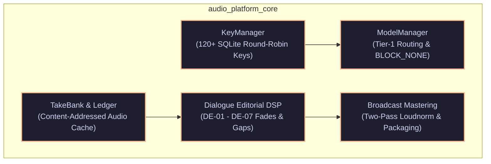
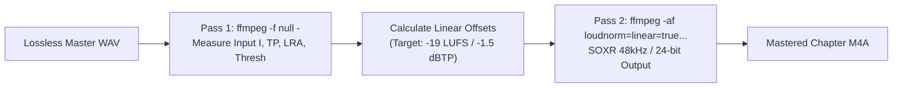

# ⚙️ Core Platform Foundation Specification (`audio_platform_core`)

**Standard**: `v6.0-ENTERPRISE-DAG`  
**Package Namespace**: `audiobook_factory.core`  
**Status**: Decoupled, Standalone Shared Platform Services  

---

## 1. Overview & Architectural Role

The **Core Platform Foundation** (`audio_platform_core`) provides shared, decoupled infrastructure services utilized by the 5 production rooms and external client applications (such as podcast creators, translation microservices, and batch speech engines). 

Modules within `audio_platform_core` maintain **zero dependencies** on top-level audiobook orchestrators and can be imported and executed standalone.



---

## 2. KeyPool & Model Management Engine

### 2.1 KeyPool Architecture (`core.key_manager`)
- **Key Capacity**: Pool of 120+ active Google Gemini API keys stored in SQLite round-robin rotation.
- **Smart Health & Cool-down Tracking**:
  - Automatically isolates keys returning HTTP `429 Too Many Requests` or `ResourceExhausted`.
  - Implements exponential backoff with cool-down buckets (5m, 15m, 1h, 24h reset).
  - Raises `AllKeysExhaustedTodayError` only when 100% of keys in the rotation pool are depleted.
- **Token-Bucket Concurrency**: Controls requests per minute (RPM) and tokens per minute (TPM) across parallel workers.

```python
# Standalone Example: KeyPool Rotation
from audiobook_factory.core.key_manager import get_persistent_key_pool

key_pool = get_persistent_key_pool(db_path="~/.gemini/api_keys.db")

# Acquire next healthy key with anti-bot jitter
with key_pool.acquire_key_context() as api_key:
    # Execute network request
    print(f"Using active key: {api_key[:8]}...")
```

### 2.2 Model Tier Routing & Permissive Config (`core.model_manager`)
- **Tier-1 Flagship Routing**: Binds creative tasks (`TRANSLATION`, `SCREENPLAY`, `DRAMATURGY`) strictly to Tier-1 models (`gemini-3.8-flash` or `gemini-3.7-flash`).
- **Blacklist of Flat Models**: Explicitly blacklists lower-capability models (`gemini-3.5-flash`, `gemini-lite`) for nuanced literary workflows.
- **Permissive Safety Filter Invariant (`BLOCK_NONE`)**: Configures all safety harm categories to `BLOCK_NONE` by default, eliminating false-positive truncation of visceral combat choreography, rustic dialogue, or intense fiction.

```python
# Standalone Example: Tier-1 Flagship Client
from audiobook_factory.core.model_manager import ModelManager, ModelTier
from google.genai import types

client = ModelManager.get_client_for_tier(ModelTier.TIER_1_FLAGSHIP)
safety_settings = ModelManager.get_permissive_safety_settings()

response = client.models.generate_content(
    model="gemini-3.8-flash",
    contents="Translate dramatic beat into Devanagari Hindustani...",
    config=types.GenerateContentConfig(
        safety_settings=safety_settings,
        temperature=0.35
    )
)
```

---

## 3. 2-Tier TakeBank Cache & Ledger Engine (`core.cache`)

### 3.1 Content-Addressed TakeBank (`core.cache.take_bank`)
The TakeBank avoids redundant TTS network synthesis by indexing audio takes with a SHA-256 hash derived from the exact acoustic and linguistic parameters.

$$\text{take\_content\_hash} = \text{SHA-256}(\text{Text} + \text{Speaker} + \text{VoiceID} + \text{FormantSignature} + \text{Pitch} + \text{Speed} + \text{Temp})$$

- **Storage Location**: `.audiobook_cache/takes/<take_content_hash>.wav`.
- **Database Schema**: Logged in SQLite table `segment_take_cache`.
- **LRU Disk Eviction Policy**: Monitors cache directory size. When storage exceeds the limit (default: 10 GB), least recently accessed takes with `is_valid = 1` and no active project locks are safely pruned.

```python
# Standalone Example: TakeBank Hash Lookup & Storage
from audiobook_factory.core.cache.take_bank import TakeBank

take_bank = TakeBank(cache_dir="./.audiobook_cache", db_path="./pipeline_ledger.db")

segment_spec = {
    "text": "विचर ने तलवार निकाली।",
    "speaker": "Geralt",
    "voice_id": "Puck",
    "formant_signature": "p-4_t0.95_eq_bass_boost",
    "pitch_shift": -4.0,
    "speed_multiplier": 0.95,
    "temperature": 0.35
}

cached_take = take_bank.lookup_take(segment_spec)
if cached_take:
    print(f"Cache Hit! WAV at: {cached_take.take_wav_path}")
else:
    # Synthesize via TTS and store
    take_bank.store_take(segment_spec, generated_wav_bytes)
```

---

## 4. Dialogue Editorial DSP Engine (`core.dialogue_editorial`)

The Dialogue Editorial DSP Engine implements seven precision audio rules (DE-01 through DE-07) to transform isolated TTS clips into a cohesive, conversational master dialogue stem.

```
┌────────────────────────────────────────────────────────────────────────┐
│                   DE-01 - DE-07 EDITORIAL DSP RULES                    │
├─────────┬─────────────────────────────┬────────────────────────────────┤
│ Rule    │ Name                        │ Audio Engineering Action       │
├─────────┼─────────────────────────────┼────────────────────────────────┤
│ DE-01   │ Endpoint Zero-Crossing Snip │ Trim silence at -52 dBFS       │
│ DE-02   │ Hann Micro-Fades            │ 12ms Fade-In / 18ms Fade-Out   │
│ DE-03   │ DC Offset & Sub-Bass Filter │ Highpass Butterworth at 40 Hz  │
│ DE-04   │ Contextual Pause Realization│ 60ms (Banter) to 2200ms (Beat) │
│ DE-05   │ Conversational Overlap      │ -100ms to -350ms Negative Gap  │
│ DE-06   │ Cross-Speaker Panning       │ Subtle ±12% Azimuth Headroom   │
│ DE-07   │ Organic Breath Attenuation  │ Relative Breath Notch (-6.0dB) │
└─────────┴─────────────────────────────┴────────────────────────────────┘
```

### 4.1 DSP Implementation Details

```python
# Standalone Example: Applying Editorial DSP to Audio Takes
from audiobook_factory.core.dialogue_editorial import DialogueEditorialEngine, EditorialPlan

engine = DialogueEditorialEngine()

plan = EditorialPlan(
    pre_speech_fade_ms=12.0,
    post_speech_fade_ms=18.0,
    speech_floor_dbfs=-52.0,
    highpass_freq_hz=40.0
)

# Lossless segment boundary conditioning
conditioned_wav = engine.apply_editorial_conditioning(
    input_wav_path="raw_take.wav",
    plan=plan
)
```

---

## 5. Broadcast Mastering Engine (`core.mastering`)

The Mastering Engine applies studio-grade vocal mastering and packages deliverables according to international broadcast standards.

### 5.1 Standards & Guarantees
- **Loudness Target**: EBU R128 integrated vocal target of **-19.0 LUFS** ($\pm 0.5$ LUFS).
- **True Peak Hard Ceiling**: **-1.5 dBTP** (prevents inter-sample clipping on lossy MP4/AAC transcoding).
- **Loudness Range (LRA)**: Dynamic consistency $\le 6.5\text{ LU}$.
- **Zero De-Esser Invariant**: Hardware de-essers and aggressive multi-band sibilance compressors are strictly prohibited to preserve delicate Hindi dental and aspirated consonants (स, श, छ, थ, ध).
- **Kaiser Sinc Resampling**: Post-loudnorm conversion to 48kHz / 24-bit PCM.

### 5.2 Two-Pass Linear Loudnorm Workflow



```python
# Standalone Example: Broadcast Mastering
from audiobook_factory.core.mastering import MasterEngine, MasteringSpec

spec = MasteringSpec(
    target_lufs=-19.0,
    true_peak_ceiling=-1.5,
    loudness_range=6.5,
    sample_rate=48000
)

master_engine = MasterEngine(spec)
master_artifact = master_engine.master_dialogue_stem(
    input_wav="chapter_003_dialogue.wav",
    output_m4a="chapter_003_mastered.m4a"
)

print(f"Mastered: {master_artifact.compliance.integrated_lufs} LUFS, TP: {master_artifact.compliance.true_peak_dbfs} dBTP")
```

### 5.3 M4B Chaptered Container Packaging

```python
# Standalone Example: Packaging Final M4B Container
from audiobook_factory.core.mastering.packager import M4BPackager, ChapterMetadata

packager = M4BPackager()

chapters = [
    ChapterMetadata(title="Chapter 1: The Bounds of Reason", start_ms=0, end_ms=1124000),
    ChapterMetadata(title="Chapter 2: A Shard of Ice", start_ms=1124000, end_ms=2350000)
]

m4b_path = packager.package_container(
    audio_files=["ch01_mastered.m4a", "ch02_mastered.m4a"],
    chapters=chapters,
    output_m4b="Sword_of_Destiny.m4b",
    cover_image_path="assets/cover.jpg",
    book_title="Sword of Destiny",
    author="Andrzej Sapkowski"
)
```
