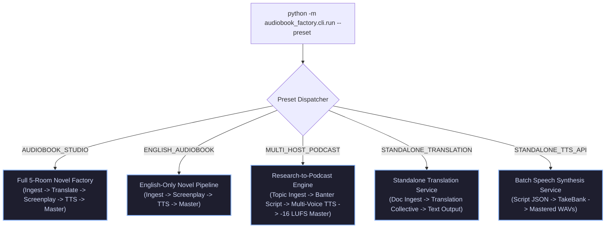
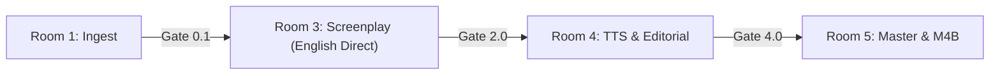
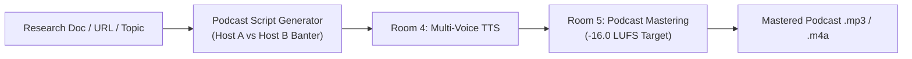
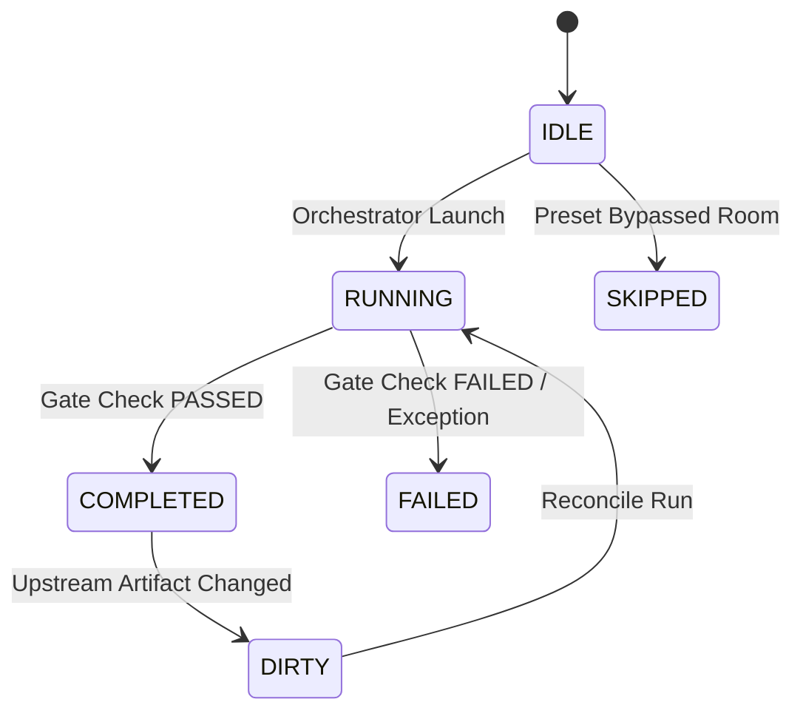

# 🎛️ Dynamic Pipeline Presets & DAG Orchestration Specification

**Standard**: `v6.0-ENTERPRISE-DAG`  
**Package Namespace**: `audiobook_factory.dag`  
**Status**: Autonomous Pipeline Dispatcher & Invalidation Engine  

---

## 1. Overview & Execution Architecture

The **DAG Orchestration Engine** provides high-level automated execution across the 5 standalone production rooms. Rather than executing rigid monolithic scripts, it analyzes input source contracts, checks the SQLite persistence ledger (`pipeline_ledger.db`), resolves cache hits from the TakeBank, and dynamically runs only the stages that are dirty or missing.



---

## 2. Pipeline Presets Configuration Matrix

| Preset Identifier | Active Rooms | Translation Layer | Audio Loudness Target | Primary Deliverable | Use Case |
| :--- | :--- | :--- | :--- | :--- | :--- |
| `AUDIOBOOK_STUDIO` | Rooms 1, 2, 3, 4, 5 | 4-Agent Hindustani Collective | **-19.0 LUFS** / -1.5 dBTP | Chaptered `.m4b` + `.m4a` | Full English-to-Hindi studio novel production |
| `ENGLISH_AUDIOBOOK`| Rooms 1, 3, 4, 5 | **SKIPPED (Bypassed)** | **-19.0 LUFS** / -1.5 dBTP | Chaptered `.m4b` + `.m4a` | Native English multi-voice novel production |
| `MULTI_HOST_PODCAST`| Ingest, Script, 4, 5 | Optional / Direct Script | **-16.0 LUFS** / -1.0 dBTP | Mastered `.mp3` / `.m4a` | Multi-host research summaries & banter podcasts |
| `STANDALONE_TRANSLATION` | Rooms 1, 2 | 4-Agent Hindustani Collective | N/A | `.json` / `.txt` / `.md` | High-fidelity literary document translation |
| `STANDALONE_TTS_API`| Rooms 4, 5 | N/A | Configurable (-19 or -16 LUFS) | Stems `.wav` / `.m4a` | High-throughput multi-voice batch synthesis |

---

## 3. Preset Execution Topologies

### Preset A: `AUDIOBOOK_STUDIO` (Default 5-Room Factory)

- **Execution Flow**: Ingests novel $\to$ Generates `book_bible.json` and `cast_lock.json` $\to$ Translates each chapter via 4-Agent Collective $\to$ Parses prose into screenplay with anti-swap QA $\to$ Synthesizes via TakeBank and Gemini Flash TTS $\to$ Masters to -19.0 LUFS and packages `.m4b`.

### Preset B: `ENGLISH_AUDIOBOOK` (Bypassed Translation)

- **Execution Flow**: Room 2 is completely bypassed. Room 3 directly converts the AST `RawBookManifest` from Room 1 into an English `ScreenplayScript`.

### Preset C: `MULTI_HOST_PODCAST`

- **Execution Flow**: Ingests reference materials, generates dual-host banter script, synthesizes with rapid conversational turn latencies (-150ms overlap), and masters to podcast industry standard -16.0 LUFS.

---

## 4. Stage Status Lifecycle & State Machine

Every stage record in `chapter_stage_ledger` transitions through a deterministic state machine:



### Stage Status Definitions:
- `IDLE`: Stage is pending execution.
- `RUNNING`: Subsystem currently processing chapter.
- `COMPLETED`: Processing finished; artifact registered and gate passed.
- `FAILED`: Execution or quality gate verification failed; error logged.
- `DIRTY`: Upstream input contract hash changed; downstream artifact is stale.
- `SKIPPED`: Stage bypassed by active preset configuration.

---

## 5. Smart Diff Reconciliation Engine (`diff_reconciler.py`)

The Diff Reconciler eliminates full-pipeline re-runs by calculating the exact blast radius of upstream edits.

### Invalidation Algorithm:
1. **Hash Verification**: Compares the SHA-256 hash of the inbound contract with `input_contract_hash` stored in `chapter_stage_ledger`.
2. **Dirty Flagging**: If hashes differ, marks current stage as `DIRTY`.
3. **Cascading Propagation**: Automatically marks all dependent downstream stages for that specific chapter as `DIRTY`.
4. **TakeBank Protection**: Unchanged dialogue segments retain identical SHA-256 take hashes and are resolved instantly from TakeBank during Room 4 re-runs.

```python
# Standalone Example: Running Diff Reconciliation
from audiobook_factory.dag.diff_reconciler import DiffReconciler

reconciler = DiffReconciler(db_path="./pipeline_ledger.db")
dirty_plan = reconciler.evaluate_project_dirty_stages(project_id="sword-of-destiny")

print(f"Chapters requiring re-run: {dirty_plan.dirty_chapter_count}")
for stage in dirty_plan.stages_to_execute:
    print(f" - Chapter {stage.chapter_id}: {stage.room_name} ({stage.reason})")
```

---

## 6. Top-Level CLI Command Reference

```bash
# 1. Run Full 5-Room Audiobook Pipeline
python -m audiobook_factory.cli.run \
    --preset AUDIOBOOK_STUDIO \
    --source "books/Sword_of_Destiny.epub" \
    --project-dir "./projects/sword_of_destiny" \
    --workers 4

# 2. Run English-Only Novel Pipeline (Room 2 Bypassed)
python -m audiobook_factory.cli.run \
    --preset ENGLISH_AUDIOBOOK \
    --source "books/Dune.epub" \
    --project-dir "./projects/dune"

# 3. Reconcile Dirty Stages After Manual Script / Translation Edits
python -m audiobook_factory.cli.run \
    --reconcile-dirty \
    --project-dir "./projects/sword_of_destiny"

# 4. Generate Multi-Host Podcast
python -m audiobook_factory.cli.run \
    --preset MULTI_HOST_PODCAST \
    --source "papers/quantum_computing.pdf" \
    --project-dir "./projects/quantum_podcast" \
    --target-lufs -16.0
```
