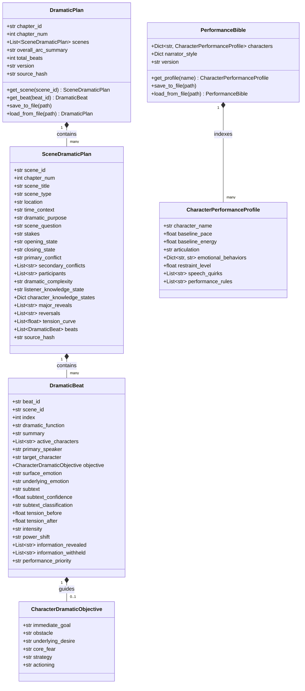
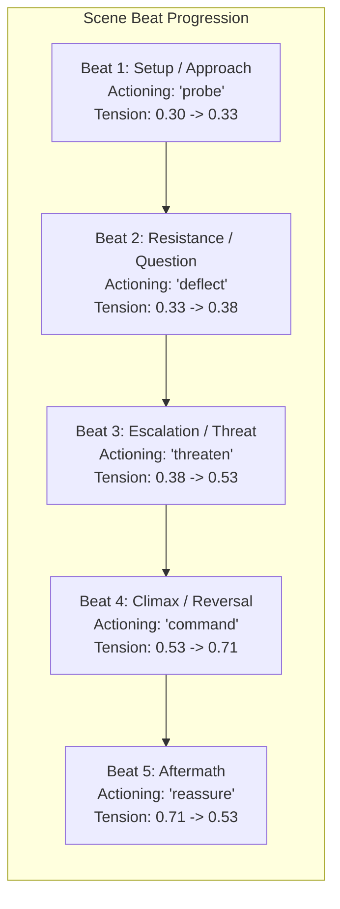
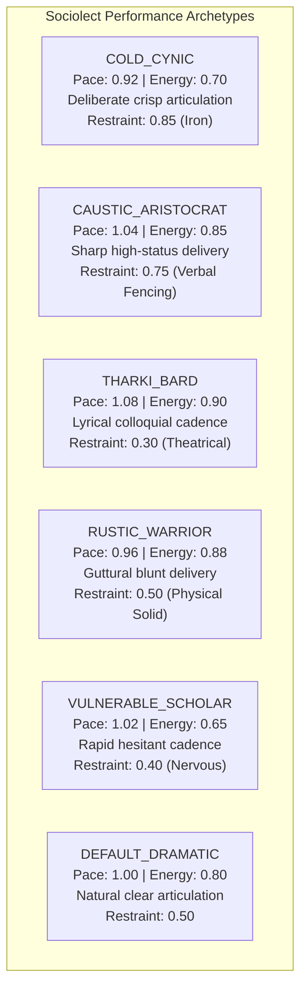
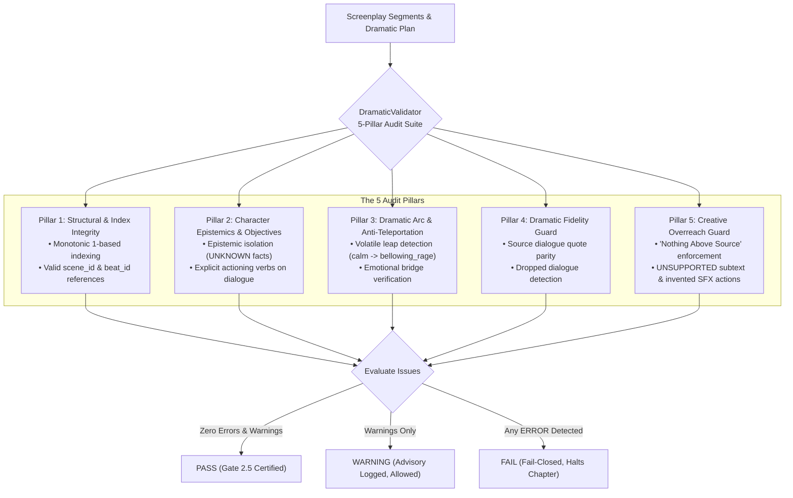
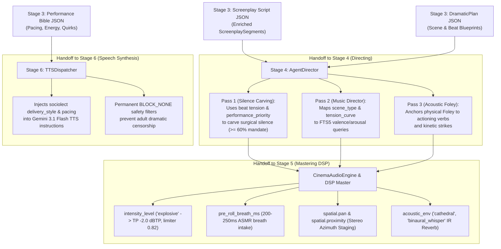

# 🎭 Dramatic Adaptation & Screenplay Engine (Stage 3): Architectural Manual & Reference Guide

## Executive Overview: Dramatic Intelligence vs. Mechanical Text-Splitting

In traditional automated audiobook pipelines, the transition from text to speech is treated as a trivial formatting problem: text is broken into sentences or fixed-token chunks, stripped of quotes, and piped directly into a Text-to-Speech (TTS) synthesizer. The catastrophic consequences of this naive approach are well-documented:
1. **Flat Emotional Monotony:** The TTS model receives unadorned dialogue without dramatic context, delivering high-stakes ultimatums, tender bedroom intimacy, and casual tavern banter with the exact same detached, neutral cadence.
2. **Context Blindness & Subtext Oblivion:** Characters speak the literal words of the text, but the true unstated human subtext—deception, suppressed terror, sexual attraction, or moral hesitation—is completely lost.
3. **Arbitrary Beat Severing:** Historical word-count splitters (such as arbitrary 1,200-word cuts) slice through the middle of dramatic climaxes, severing cause from effect, separating combat strikes from reactions, and producing jarring pacing discontinuities.
4. **Emotional Teleportation:** Characters abruptly shift from whispering dread to screaming fury within consecutive lines because the engine lacks memory of psychological inertia or transitional dramatic bridges.

**Audiobook Maker v4.0 Stage 3 (Dramatic Adaptation & Screenplay Engine)** resolves this by replacing mechanical text splitting with a **Dramatic Intelligence Layer** rooted in classical dramaturgy, Stanislavski actioning, Mamet practical aesthetics, and Hollywood screenwriting principles. 

Implemented in [`audiobook_factory/dramaturgy/`](file:///c:/Users/Suraj/Documents/Antigravity/Audiobook/audiobook_factory/dramaturgy/), Stage 3 analyzes the narrative structure of chapters, extracts organic scenes, derives tactical character objectives, computes continuous tension trajectories, and builds a comprehensive project-level **Performance Bible**. It ensures that every line of spoken dialogue carries explicit acting instructions, dynamic intensity headroom, spatial staging, and organic prosody tags before a single byte of audio is synthesized.

---

## 🏛️ Stage 3 in the 6-Stage Pipeline Lifecycle

Stage 3 occupies the pivotal creative bridge between upstream textual intelligence and downstream acoustic rendering:

```mermaid
flowchart TD
    subgraph S1["Stage 1: Forensic Document Ingestion"]
        Raw["Raw Book (EPUB / PDF / TXT)"] --> AST["Canonical AST Model (canonical/book.json)"]
        AST --> G01{"Gate 0.1:<br/>Extraction Audit"}
        G01 -->|PASS| Extracted["Extracted Chapter Markdown (extracted/)"]
    end

    subgraph S2["Stage 2: Literary Translation Intelligence"]
        Extracted --> TransPipe["Intelligent Translation Pipeline<br/>(BookBible v2.0 + Memory 2.0)"]
        TransPipe --> GT{"Gates T0–T11 & Gate 0:<br/>Translation Certification"}
        GT -->|PASS| Translated["Localized Hindustani Text (translation/)"]
    end

    subgraph S3["Stage 3: Screenplay & Dramatic Adaptation (Dramaturgy Engine)"]
        Translated --> SA["SceneAnalyzer:<br/>Organic Scene Discovery & Conflicts"]
        SA --> BP["BeatPlanner:<br/>Tactical Objectives & Actioning Verbs"]
        BP --> ChunkSlice["Beat-Aligned Chunk Slicer:<br/>Zero-Cut Beat Preservation"]
        ChunkSlice --> PBG["PerformanceBibleGenerator:<br/>Sociolect Archetypes & Delivery Rules"]
        PBG --> ScriptClean["clean_screenplay_pass2:<br/>Dramatic Plan Metadata Enrichment"]
        ScriptClean --> DV["DramaticValidator:<br/>5-Pillar Arc & Epistemic Audit"]
        DV --> G25{"Gate 2.5:<br/>Dramatic Fidelity Audit"}
    end

    subgraph S4["Stage 4: Autonomous Directing Layer"]
        G25 -->|PASS| Dir["AgentDirector (3 Passes):<br/>Silence Carving (>= 60%) + BGM + Foley"]
        Dir --> Manifest["CreativeManifest v3.0"]
    end

    subgraph S5["Stage 5: Acoustic Compositor & Mastering"]
        Manifest --> Renderer["Manifest Soundscape Renderer & DSP Master<br/>(Sidechain Ducking + 2.2kHz Notch + EBU R128)"]
        Renderer --> Stems["5 Discrete DME Stems (DX, MX, FX, AMB, ME)"]
    end

    subgraph S6["Stage 6: Packaging & Delivery"]
        Stems --> M4BPack["M4B Packager & Container Specs (Gate 6D)"]
        M4BPack --> FinalM4B["Final Chapterized M4B Audiobook"]
    end
```



---

## 🧩 Core Architecture of `audiobook_factory/dramaturgy/`

The dramaturgy system is encapsulated in five core modules operating over strictly typed Pydantic v2 schemas:

```
audiobook_factory/dramaturgy/
├── __init__.py               # Public API exports
├── contracts.py              # Pydantic v2 schemas: DramaticBeat, SceneDramaticPlan, DramaticPlan, etc.
├── scene_analyzer.py         # Organic scene discovery, multi-signal classification & stakes
├── beat_planner.py           # Atomic beat breakdown, actioning verbs, tension curves & chunk slicing
├── performance_bible.py      # Character performance profiles, sociolect presets & narrator styles
└── dramatic_validator.py     # 5-pillar dramatic audit, anti-teleportation & Gate 2.5 validator
```

---

### 1. Data Contracts & Strict Schemas (`contracts.py`)

All dramaturgical data models are defined in [`audiobook_factory/dramaturgy/contracts.py`](file:///c:/Users/Suraj/Documents/Antigravity/Audiobook/audiobook_factory/dramaturgy/contracts.py) using Pydantic v2 with `ConfigDict(extra="ignore")` for forward and backward compatibility.



#### Contract Definitions

1. **[`DramaticBeat`](file:///c:/Users/Suraj/Documents/Antigravity/Audiobook/audiobook_factory/dramaturgy/contracts.py#L85-L113):** The atomic dramatic unit representing a meaningful change in state, leverage, or emotion. It tracks entry and exit tension indices ($0.0$ to $1.0$), active speaker, target counterpart, functional classification (`setup`, `threat`, `escalation`, `climax`, `reversal`, `aftermath`), and performance priority (`background`, `standard`, `high_focus`, `climactic`).
2. **[`CharacterDramaticObjective`](file:///c:/Users/Suraj/Documents/Antigravity/Audiobook/audiobook_factory/dramaturgy/contracts.py#L70-L83):** The immediate tactical objective of a character during a beat, answering: *"What does this character want right now, and what prevents them?"* Encodes `immediate_goal`, `obstacle`, `underlying_desire`, `core_fear`, behavioral `strategy`, and transitive `actioning` verb.
3. **[`SceneDramaticPlan`](file:///c:/Users/Suraj/Documents/Antigravity/Audiobook/audiobook_factory/dramaturgy/contracts.py#L118-L147):** The macro dramatic architecture of an individual scene. Encodes `dramatic_purpose`, driving `scene_question`, physical/emotional `stakes`, `opening_state` $\rightarrow$ `closing_state` transformations, primary/secondary conflicts, dramatic complexity (`LOW`, `MEDIUM`, `HIGH`, `CRITICAL`), and audience epistemic context (`listener_knowledge_state`).
4. **[`DramaticPlan`](file:///c:/Users/Suraj/Documents/Antigravity/Audiobook/audiobook_factory/dramaturgy/contracts.py#L149-L202):** The durable chapter blueprint persisted atomically as `dramaturgy/chapter_XXX_dramatic_plan.json`. Contains all constituent scene plans, holistic chapter arc summaries, beat counts, and source text SHA-256 validation hashes.
5. **[`CharacterPerformanceProfile`](file:///c:/Users/Suraj/Documents/Antigravity/Audiobook/audiobook_factory/dramaturgy/contracts.py#L207-L225):** The performance-oriented projection of a character, strictly decoupled from lore/memory facts. Encodes vocal performance parameters: `baseline_pace` (0.5 to 2.0), `baseline_energy` (0.0 to 1.0), `articulation`, `emotional_behaviors` mapping, `restraint_level` (0.0=raw expression, 1.0=iron suppression), `speech_quirks`, and `performance_rules`.
6. **[`PerformanceBible`](file:///c:/Users/Suraj/Documents/Antigravity/Audiobook/audiobook_factory/dramaturgy/contracts.py#L227-L272):** The project-level authority persisted as `performance_bible.json`, mapping all characters to their delivery profiles and establishing standard narrator delivery styles.
7. **[`DramaticValidationResult`](file:///c:/Users/Suraj/Documents/Antigravity/Audiobook/audiobook_factory/dramaturgy/contracts.py#L290-L323):** Strongly typed validation report holding `status` (`PASS`, `WARNING`, `FAIL`), passed boolean, and a structured array of [`DramaticValidationIssue`](file:///c:/Users/Suraj/Documents/Antigravity/Audiobook/audiobook_factory/dramaturgy/contracts.py#L278-L289) records with machine-readable codes and severities (`INFO`, `WARNING`, `ERROR`).
8. **Screenplay Integration ([`ScreenplaySegment`](file:///c:/Users/Suraj/Documents/Antigravity/Audiobook/audiobook_factory/contracts.py#L201-L216)):** Extends standard screenplay lines with optional dramatic metadata: `scene_id`, `beat_id`, `dramatic_function`, `character_objective`, `actioning`, `subtext`, `subtext_confidence`, `surface_emotion`, `underlying_emotion`, `tension_before`, `tension_after`, `listener_knowledge_state`, and `performance_priority`.

---

### 2. Scene Analysis Engine (`SceneAnalyzer`)

The [`SceneAnalyzer`](file:///c:/Users/Suraj/Documents/Antigravity/Audiobook/audiobook_factory/dramaturgy/scene_analyzer.py) transforms raw chapter text into an ordered sequence of [`SceneDramaticPlan`](file:///c:/Users/Suraj/Documents/Antigravity/Audiobook/audiobook_factory/dramaturgy/contracts.py#L118-L147) blueprints.

#### Organic Scene Boundary Discovery
Rather than splitting text by word count or token limits, [`_discover_scene_boundaries`](file:///c:/Users/Suraj/Documents/Antigravity/Audiobook/audiobook_factory/dramaturgy/scene_analyzer.py#L80-L119) detects authentic narrative transitions:
- **Temporal Markers:** Regular expression scans for English and Devanagari temporal transitions (`TIME_PATTERNS`):
  - English: `the next morning`, `at dawn`, `by dusk`, `several hours later`, `weeks passed`, `as darkness fell`.
  - Hindustani: `अगली सुबह`, `दोपहर को`, `शाम ढलते ही`, `रात के वक्त`, `कुछ देर बाद`, `कई दिनों बाद`.
- **Spatial Markers:** Setting movement patterns (`LOCATION_PATTERNS`):
  - English: `left the`, `entered the`, `arrived at`, `in the courtyard`, `in the tavern`, `into the chamber`.
  - Hindustani: `कमरे से बाहर`, `सड़क पर`, `दरवाजे पर`, `जंगल में`, `महल के भीतर`, `सराय में`.
- **Explicit Scene Dividers:** Traditional typographic breaks (`DIVIDER_PATTERNS`: `***`, `---`, `* * *`, `~~~`).
- **Depth Buffering:** Enforces a minimum paragraph accumulation floor ($\ge 280$ words or $\ge 3$ paragraphs) before evaluating narrative shifts, preventing false micro-splits during rapid dialogue exchanges.

#### Multi-Signal Scored Classification
The analyzer scores text across genre categories using lexical density models:
- Categories: `combat`, `confrontation`, `revelation`, `romance`, `investigation`, `horror`, `comedy`, `introspection`, `dialogue`.
- Complexity Rating: Evaluated as `LOW`, `MEDIUM`, `HIGH`, or `CRITICAL` based on character count concurrency ($\ge 3$ active characters), combat lethality, and narrative climax markers.

#### Epistemic State & Dramatic Irony
Cross-references participants with upstream [`World & Character Memory 2.0`](file:///c:/Users/Suraj/Documents/Antigravity/Audiobook/docs/WORLD_AND_CHARACTER_MEMORY_2_0.md) epistemic constraints. If character $A$ knows a secret tagged `UNKNOWN` for character $B$, `listener_knowledge_state` is automatically flagged as:
> *"Dramatic irony: Audience and Character A aware of hidden truth that Character B does not know."*

This informs downstream delivery: the informed character delivers lines with guarded calculation, while the audience experiences mounting dramatic tension.

---

### 3. Beat Planning & Actioning (`BeatPlanner`)

The [`BeatPlanner`](file:///c:/Users/Suraj/Documents/Antigravity/Audiobook/audiobook_factory/dramaturgy/beat_planner.py) decomposes each scene into an ordered sequence of dramatic beats representing tactical shifts in initiative, leverage, or emotion.



#### Transitive Actioning Verbs
Following practical acting theory, characters never "just speak"; they use dialogue as an active instrument to achieve a tactical objective against an obstacle. The planner assigns transitive actioning verbs from a standardized lexicon:
- Lexicon: `threaten`, `deflect`, `reassure`, `confess`, `plead`, `probe`, `manipulate`, `comfort`, `test`, `intimidate`, `negotiate`, `scold`, `mock`, `command`, `surrender`, `seduce`, `evade`, `challenge`, `provoke`, `warn`, `conceal`.

#### Dual-Layer Emotional Modeling
Human speech rarely exhibits pure, unmasked emotion. Stage 3 explicitly isolates outward delivery from internal psychological reality:

| Actioning Verb | Surface Emotion (Outward Exhibition) | Underlying Emotion (Suppressed Internal State) |
|---|---|---|
| `threaten` | `cold_menace` | `mounting_fear` |
| `intimidate` | `bellowing_rage` | `insecurity` |
| `deflect` | `calm_irony` | `suppressed_panic` |
| `probe` | `detached_curiosity` | `deep_suspicion` |
| `confess` | `resigned_sorrow` | `trembling_guilt` |
| `seduce` | `tender_warmth` | `calculating_ambition` |
| `challenge` | `confident_scorn` | `adrenalin_strain` |
| `reassure` | `gentle_composure` | `internal_exhaustion` |
| `command` | `austere_authority` | `desperate_urgency` |
| `conceal` | `flat_stoicism` | `racing_anxiety` |

#### Conservative Subtext & Epistemic Confidence
Subtext is the unspoken meaning vibrating beneath the spoken dialogue. To prevent creative hallucination, subtext is strictly classified into 4 confidence tiers:
1. `SOURCE_SUPPORTED`: Directly corroborated by narration, inner monologue, or explicit story facts.
2. `CONTEXTUAL_INFERENCE`: Reasonably deduced from conflicting character objectives and stakes.
3. `CREATIVE_INTERPRETATION`: Plausible psychological nuance for acting flavor; never treated as canon.
4. `UNSUPPORTED`: Speculative interpretations flagged by validation guards if assigned high confidence.

#### Sampled Tension Trajectories
Tension is modeled as a continuous scalar curve ($0.05$ to $0.98$) sampled across beats. Each dramatic function applies calibrated deltas:
- `threat`: $+0.15$
- `escalation`: $+0.12$
- `climax`: $+0.18$
- `reversal`: $+0.10$
- `reveal`: $+0.08$
- `question`: $+0.04$
- `emotional_turn`: $-0.05$
- `aftermath`: $-0.18$
- `decision`: $-0.06$

These trajectories directly drive downstream acoustic mastering (e.g., dynamic headroom, limiter thresholds, and sidechain ducking depths).

---

### 4. Beat-Aligned Chunk Slicing (`slice_chapter_by_beats`)

#### The Historical 1,200-Word Cut Boundary Flaw
In legacy pipelines, long chapters exceeding LLM token contexts were sliced by raw word counts (e.g., every 1,200 words). This mechanical slicing created severe defects:
- An explosive combat sequence was chopped in two, leaving an attacker's strike in Chunk 1 and the victim's reaction in Chunk 2.
- A critical secret reveal occurred across a chunk boundary, causing the LLM in Chunk 2 to attribute dialogue to the wrong speaker or misunderstand the sudden shift in character status.

#### The Beat-Aligned Solution
[`BeatPlanner.slice_chapter_by_beats()`](file:///c:/Users/Suraj/Documents/Antigravity/Audiobook/audiobook_factory/dramaturgy/beat_planner.py#L321-L429) enforces **Beat-Aligned Chunking**:
1. If the entire chapter is under `max_words` (default 1,200 words), it is processed as a single unified chunk.
2. If the chapter spans multiple scenes and individual scenes are under `max_words`, slicing occurs strictly at **scene boundaries**.
3. If an individual scene exceeds `max_words`, slicing occurs strictly along **beat boundaries** (`paras_per_beat`). A chunk is never closed in the middle of a beat.
4. Each chunk payload retains metadata:
   ```json
   {
     "chunk_index": 1,
     "text": "...",
     "scene_id": "scene_001",
     "beat_ids": ["scene_001_b001", "scene_001_b002"],
     "word_count": 940,
     "is_scene_start": true,
     "is_scene_end": false
   }
   ```
5. **Rolling Conversational Memory:** The tail 3 dialogue turns of each chunk are formatted and injected as preceding conversational context into the next chunk's prompt. This enables the LLM to resolve opening pronouns (`he`, `she`, `उसने`, `वह`) and maintains character voice attribution across chunk boundaries without drift.

---

### 5. Performance Bible Generator (`PerformanceBibleGenerator`)

The [`PerformanceBibleGenerator`](file:///c:/Users/Suraj/Documents/Antigravity/Audiobook/audiobook_factory/dramaturgy/performance_bible.py) constructs a project-level [`PerformanceBible`](file:///c:/Users/Suraj/Documents/Antigravity/Audiobook/audiobook_factory/dramaturgy/contracts.py#L227-L272) by projecting canonical `BookBible` profiles and `character_roster.json` entries into concrete vocal delivery directives.

#### Sociolect Presets

The generator maps characters to calibrated sociolect archetypes:



1. **`COLD_CYNIC` (e.g., Geralt, weary mercenaries, hardened inquisitors):**
   - Baseline Pace: `0.92` | Baseline Energy: `0.70` | Articulation: `deliberate_crisp` | Restraint: `0.85`
   - Emotional Delivery: Anger is expressed as `cold_menace`; fear as `silent_vigilance`; sadness as `weary_resignation`.
   - Speech Quirks: Cynical grunt prosody (`[growl] हूँ...`, `[sighs] हम्म...`), $1.2\text{s}$ pregnant pauses before retorts.
   - Performance Rules: Never shout unless physically mortally wounded; maintain low, resonant chest register; subsume emotional outbursts into laconic understatements.
2. **`CAUSTIC_ARISTOCRAT` (e.g., royal courtiers, high sorceresses, arrogant lords):**
   - Baseline Pace: `1.04` | Baseline Energy: `0.85` | Articulation: `sharp_high_status` | Restraint: `0.75`
   - Emotional Delivery: Anger expressed as `cutting_condescension`; fear as `brittle_disdain`; humor as `wry_amused_sneer`.
   - Speech Quirks: Elongated elegant vowels, rapid dismissive cadence.
   - Performance Rules: Emphasize precise consonants to convey superiority; treat dialogue as verbal fencing where every pause asserts status.
3. **`THARKI_BARD` (e.g., Dandelion / Jaskier, roguish poets, charismatic gamblers):**
   - Baseline Pace: `1.08` | Baseline Energy: `0.90` | Articulation: `lyrical_colloquial` | Restraint: `0.30`
   - Emotional Delivery: Anger expressed as `theatrical_indignation`; fear as `dramatic_flustered_panic`; affection as `effusive_flirtatious_warmth`.
   - Speech Quirks: Melodic upward pitch inflections, audible dramatic gasps.
   - Performance Rules: Maximize dynamic vocal range and performative flair; speak with theatrical urgency even during mundane observations.
4. **`RUSTIC_WARRIOR` (e.g., dwarven brawlers, tavern veterans, frontier captains):**
   - Baseline Pace: `0.96` | Baseline Energy: `0.88` | Articulation: `guttural_blunt` | Restraint: `0.50`
   - Emotional Delivery: Anger expressed as `bellowing_rage`; fear as `defiant_combat_strain`; affection as `clumsy_gruff_warmth`.
   - Speech Quirks: Guttural exhalations, short punchy phrasing.
   - Performance Rules: Lean into diaphragm strain on aggressive lines; clip sentence endings abruptly to convey physical solidity.
5. **`VULNERABLE_SCHOLAR` (e.g., young apprentices, cloistered archivists, nervous alchemists):**
   - Baseline Pace: `1.02` | Baseline Energy: `0.65` | Articulation: `rapid_hesitant` | Restraint: `0.40`
   - Emotional Delivery: Anger expressed as `trembling_indignation`; fear as `breathless_stammer`; sadness as `quiet_withdrawn_despair`.
   - Speech Quirks: Frequent self-corrections, breath intakes on high tension.
   - Performance Rules: Inject subtle hesitations and ellipses when under scrutiny; pitch shifts upward under direct intimidation.
6. **`DEFAULT_DRAMATIC`:**
   - Standard cinematic benchmark (`pace: 1.0`, `energy: 0.80`, `articulation: natural`, `restraint: 0.50`).

#### Narrator Standard Style
The Narrator is calibrated as an **Objective Cinematic Observer**:
- Baseline Pace: `1.0` | Tone: `objective_cinematic_observer` | Pause Multiplier: `1.0` | Room Impulse: `neutral_studio` | Delivery: `authoritative_restrained`.

---

### 6. Dramatic Validator & Fidelity Guards (`DramaticValidator`)

The [`DramaticValidator`](file:///c:/Users/Suraj/Documents/Antigravity/Audiobook/audiobook_factory/dramaturgy/dramatic_validator.py) enforces a rigorous **5-Pillar Fail-Closed Audit** over screenplay segments and dramatic plans before TTS synthesis begins.



#### Pillar 1: Structural & Index Integrity
- Checks that segment indices start at $1$ and increase monotonically without gaps or duplicates (`NON_MONOTONIC_INDEX`).
- Verifies that all `scene_id` and `beat_id` references exist in the accompanying `DramaticPlan` (`ORPHAN_SCENE_REF`, `ORPHAN_BEAT_REF`).

#### Pillar 2: Character Objectives & Epistemic Sanity
- Ensures dialogue lines carry non-empty `actioning` verbs or `character_objective` descriptions (`MISSING_CHARACTER_OBJECTIVE`).
- **Epistemic Isolation Bound:** Audits spoken dialogue against upstream `MemoryContext.epistemic_constraints`. If a character mentions a lore fact marked `UNKNOWN` in their epistemic memory, the validator emits an immediate critical error (`EPISTEMIC_ISOLATION_BREACH`), preventing characters from acting upon secrets they do not know.

#### Pillar 3: Dramatic Arc Continuity & Anti-Emotional Teleportation
- Compares consecutive dialogue lines spoken by the same character.
- Flags volatile emotional transitions (`EMOTIONAL_TELEPORTATION`) that lack intermediate dramatic bridges:
  - `("calm", "bellowing_rage")`
  - `("peaceful", "explosive")`
  - `("gentle_tender", "bellowing_battlecry")`
  - `("whispering", "bellowing_rage")`

#### Pillar 4: Dramatic Fidelity Guard
- Compares source narrative quotes ($\ge 12$ characters) against the final screenplay dialogue text.
- If $3$ or more source quotes are missing from the dialogue stream, flags a potential omission warning (`DROPPED_SOURCE_DIALOGUE`).

#### Pillar 5: Creative Overreach Guard
- Enforces the **"Nothing Above Source"** principle.
- **Subtext Overreach:** Flags any subtext marked `UNSUPPORTED` that has a confidence rating $> 0.60$ (`CREATIVE_OVERREACH_SUBTEXT`).
- **Invented Actions:** Inspects Foley action segments for extreme acoustic cues (e.g. `explosion`, `gunshot`, `laser`) not supported by the source text (`CREATIVE_OVERREACH_ACTION`).

---

### 7. Gate 2.5: Dramatic Fidelity Audit (`gate_auditor.py`)

Gate 2.5 is implemented in [`audiobook_factory/gate_auditor.py#audit_gate2_5_dramatic_fidelity`](file:///c:/Users/Suraj/Documents/Antigravity/Audiobook/audiobook_factory/gate_auditor.py#L305-L371). It acts as the official independent verification checkpoint between Screenplay Scripting (Gate 2) and Manifest Feasibility (Gate 3).

```python
def audit_gate2_5_dramatic_fidelity(
    script_file: Path,
    dramatic_plan_file: Optional[Path] = None,
    source_file: Optional[Path] = None,
    project_dir: Optional[Path] = None,
) -> Dict[str, Any]:
    """
    Audit Gate 2.5: Dramatic Fidelity & Character Arc Validator.
    Verifies dramatic beat consistency, anti-emotional teleportation,
    character objectives, and creative overreach guards.
    """
```

If any validation issue has severity `ERROR` (such as non-monotonic indices or epistemic isolation breaches), Gate 2.5 raises a fail-closed [`GateAuditError`](file:///c:/Users/Suraj/Documents/Antigravity/Audiobook/audiobook_factory/gate_auditor.py#L40-L42), halting chapter synthesis before TTS API calls are initiated.

---

## 🔬 The Crucial Benchmark Proof: One Line, Four Realities

The ultimate proof of Stage 3 dramatic intelligence is demonstrated in [`tests/dramaturgy/test_golden_scenes.py#test_benchmark_proof_identical_dialogue_distinct_dramaturgy`](file:///c:/Users/Suraj/Documents/Antigravity/Audiobook/tests/dramaturgy/test_golden_scenes.py#L29-L212).

### The Challenge
A naive text-to-speech system delivers the four-word sentence **"Don't touch it."** identically regardless of context. Stage 3, however, analyzes the narrative scene, stakes, objectives, and tension to produce radically distinct acting delivery, tension trajectories, intensity headroom, and acoustic staging:

```
"Don't touch it."
```

### The 4 Scenarios

1. **Scenario A: Immediate Danger (Mortal Threat / Unstable Magic Core)**
   - *Source Narrative:* Elena reaches toward a violently hissing black runic crystal with glowing hairline emerald cracks. Marcus lunges forward, blade knocking her arm away, shouting the line.
2. **Scenario B: Mild Annoyance (Meticulous Scholar / Wet Ink)**
   - *Source Narrative:* Master Corvo adjusts his spectacles over a meticulously arranged ledger. Julian hovers a fingertip near the drying wet ink. Corvo clears his throat with a dry click of his tongue.
3. **Scenario C: Guarded Secrecy (Concealed Treason / Clandestine Cache)**
   - *Source Narrative:* In dim shadows beneath floorboards lies a forged royal cipher. Royal guards march outside the heavy wooden door. Brother Thomas bends to inspect the secret cache. Julian grips Thomas's wrist like iron and whispers.
4. **Scenario D: Protective Instinct (Shielding Frail Child)**
   - *Source Narrative:* A child gazes in wonder at jagged blackened glass embedded in an ancient altar. Tender warmth fills Aurelia's eyes as she kneels gently and takes his small trembling hand into her own.

---

### Multidimensional Comparative Matrix

| Parameter | Scenario A: Immediate Danger | Scenario B: Mild Annoyance | Scenario C: Guarded Secrecy | Scenario D: Protective Instinct |
|---|---|---|---|---|
| **Scene Classification** | `combat` / `confrontation` | `dialogue` / `comedy` | `revelation` / `investigation` | `dialogue` / `romance` |
| **Dramatic Complexity** | `CRITICAL` | `LOW` | `HIGH` | `MEDIUM` |
| **Tactical Actioning Verb** | `threaten` / `command` | `deflect` / `persuade` | `warn` / `conceal` | `comfort` / `reassure` |
| **Immediate Goal** | Force Elena to freeze and avoid mortal vaporization | Protect wet ledger ink from smudging | Prevent guards outside from hearing the discovery | Shield child from physical laceration |
| **Surface Emotion** | `cold_menace` / `angry` | `neutral` / `controlled` | `whispering` / `tense` | `gentle_tender` / `warmth` |
| **Underlying Emotion** | `mounting_fear` | `mild_irritation` | `racing_anxiety` | `protective_love` |
| **Subtext** | *"I cannot afford to let you take another step or we both perish."* | *"You are disturbing my meticulous order."* | *"If they hear us, we will hang for treason."* | *"I will protect you from harm with my life."* |
| **Subtext Classification** | `CONTEXTUAL_INFERENCE` | `CONTEXTUAL_INFERENCE` | `SOURCE_SUPPORTED` | `SOURCE_SUPPORTED` |
| **Tension Entering Beat** | $0.65$ | $0.30$ | $0.45$ | $0.25$ |
| **Tension Exiting Beat** | $0.80$ | $0.33$ | $0.57$ | $0.20$ |
| **Dynamic Intensity** | `explosive` | `low` | `medium` | `low` |
| **Acting Delivery Style** | `bellowing_rage` | `calm_authoritative` | `whispering_fear` | `gentle_tender` |
| **Pacing Multiplier** | `1.15` (Rapid urgency) | `0.95` (Deliberate) | `0.90` (Cautious whisper) | `0.92` (Tender, soft) |
| **Post-Line Pause (`pause_after_ms`)** | $300\text{ ms}$ (Abrupt shock) | $800\text{ ms}$ (Measured cadence) | $1,100\text{ ms}$ (Pregnant silence) | $700\text{ ms}$ (Gentle breath) |
| **Spatial Proximity** | `standard` (Stereo pan $0.0$) | `standard` (Stereo pan $+0.3$) | `intimate_close` (Stereo pan $-0.2$) | `intimate_close` (Stereo pan $0.0$) |
| **Acoustic Environment** | `stone_hall` | `library` | `binaural_whisper` | `cathedral` |

### Benchmark Assertions Verified in Test Suite
The automated test [`test_benchmark_proof_identical_dialogue_distinct_dramaturgy`](file:///c:/Users/Suraj/Documents/Antigravity/Audiobook/tests/dramaturgy/test_golden_scenes.py#L29-L212) mathematically verifies:
1. `danger_line["tension_before"] > annoy_line["tension_before"]` ($0.65 > 0.30$)
2. `danger_line["intensity_level"] == "explosive"` vs `annoy_line["intensity_level"] == "low"`
3. Distinct delivery styles: `bellowing_rage` vs `calm_authoritative` vs `whispering_fear` vs `gentle_tender`
4. Pacing contrast: `danger_line["acting"]["pacing"] > secret_line["acting"]["pacing"]` ($1.15 > 0.90$)
5. Conspiratorial silence contrast: `secret_line["pause_after_ms"] > danger_line["pause_after_ms"]` ($1100\text{ ms} > 300\text{ ms}$)

---

## 🗄️ Durable Artifacts & Storage Layout

When Stage 3 executes during chapter production (via `--dramatized` or autonomous pipeline runs), it generates durable artifacts organized cleanly in the project directory:

```
audiobooks/projects/<project_name>/
├── performance_bible.json                  # Project-level performance profiles
├── dramaturgy/                             # Chapter-level dramatic plans & audits
│   ├── chapter_001_dramatic_plan.json      # Complete SceneDramaticPlan & DramaticBeat tree
│   ├── chapter_001_validation.json         # 5-Pillar DramaticValidator audit results
│   ├── chapter_002_dramatic_plan.json
│   └── chapter_002_validation.json
└── scripts/                                # Standardized screenplay scripts
    ├── chapter_001_hi_script.json          # ScreenplaySegment JSON with dramatic fields
    └── chapter_002_hi_script.json
```

### 1. `performance_bible.json`
Constructed once per project by [`PerformanceBibleGenerator.generate_bible_for_project()`](file:///c:/Users/Suraj/Documents/Antigravity/Audiobook/audiobook_factory/dramaturgy/performance_bible.py#L137-L197). It provides the acoustic blueprint for every character across all chapters.

### 2. `dramaturgy/chapter_XXX_dramatic_plan.json`
Serialized via [`DramaticPlan.save_to_file()`](file:///c:/Users/Suraj/Documents/Antigravity/Audiobook/audiobook_factory/dramaturgy/contracts.py#L179-L194) using atomic write operations (`.tmp` write followed by atomic filesystem replacement). Contains all scenes, beats, objectives, and tension curves.

### 3. `dramaturgy/chapter_XXX_validation.json`
Serialized via [`DramaticValidationResult.save_to_file()`](file:///c:/Users/Suraj/Documents/Antigravity/Audiobook/audiobook_factory/dramaturgy/contracts.py#L303-L318). Contains detailed issues, severities, and validation summaries.

### 4. `scripts/chapter_XXX_script.json`
The primary operational screenplay consumed downstream. Produced by [`clean_screenplay_pass2()`](file:///c:/Users/Suraj/Documents/Antigravity/Audiobook/audiobook_factory/script_builder.py#L629-L853).

---

## 🤝 Downstream Handoff Guidelines

The dramatic intelligence synthesized in Stage 3 feeds directly into downstream stages through standardized contracts:



### 1. Handoff to Stage 4: `AgentDirector`
- **Silence Carving:** Pass 1 inspects `performance_priority` (`background`, `standard`, `high_focus`, `climactic`) and `tension_before` $\rightarrow$ `tension_after`. Dialogue with low priority or declining tension receives zero musical underscore, enforcing the $\ge 60\%$ acoustic silence standard.
- **Musical Scoring:** Pass 2 maps `scene_type` (`combat`, `horror`, `romance`) and tension indices directly to SQLite FTS5 music search queries for tempo, valence, and arousal.
- **Acoustic Foley:** Pass 3 utilizes `actioning` verbs (`threaten`, `probe`, `challenge`) and action beat splits (`speaker: "Foley"`, `text: "[ACTION]"`) to place tactile sound effects at accurate temporal offsets ($\sim 15\%$ for preparation, $\sim 75\%$ for kinetic impact).

### 2. Handoff to Stage 5: Audio Mastering & DSP
- **Dynamic Headroom:** Master DSP chains read `intensity_level`. Lines tagged `explosive` trigger tighter limiter settings (`limiter=0.82`, True Peak ceiling $-2.0\text{ dBTP}$); lines tagged `low` adjust Loudness Range (`LRA = 6.0 LU`) to preserve intimate close-mic textures.
- **Spatial Panning:** `spatial.pan` ($-0.6$ attacker left, $+0.6$ defender right, $0.0$ center) and `spatial.proximity` (`intimate_close`) direct stereo azimuth staging without mono phase cancellation ($r \ge 0.85$).
- **Acoustic Environment:** `acoustic_env` tags (`cathedral`, `stone_hall`, `binaural_whisper`) select dynamic impulse response (IR) convolution reverb profiles.

### 3. Handoff to Stage 6: Precision TTS Synthesizer
- **Voice Guidance:** `TTSDispatcher` injects character `acting.delivery_style`, `pacing`, and `restraint_level` directly into Gemini Flash TTS system prompts.
- **Prosody Tags:** Neural vocal tags validated in Stage 3 (`[whispers]`, `[growl]`, `[bellowing battlecry]`, `[combat strain]`) are synthesized natively by Gemini 3.1 Flash without censorship blocks.
