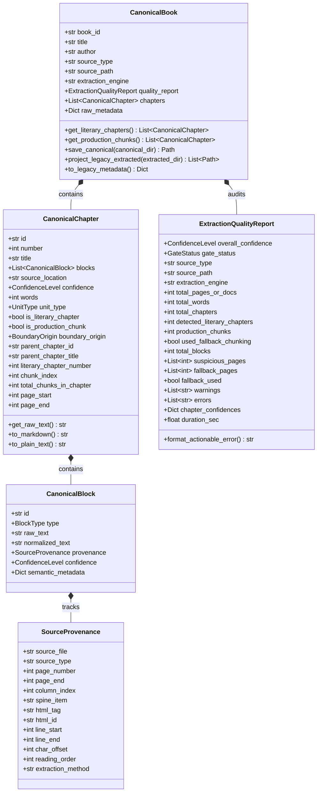
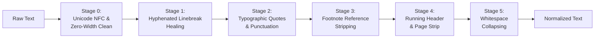
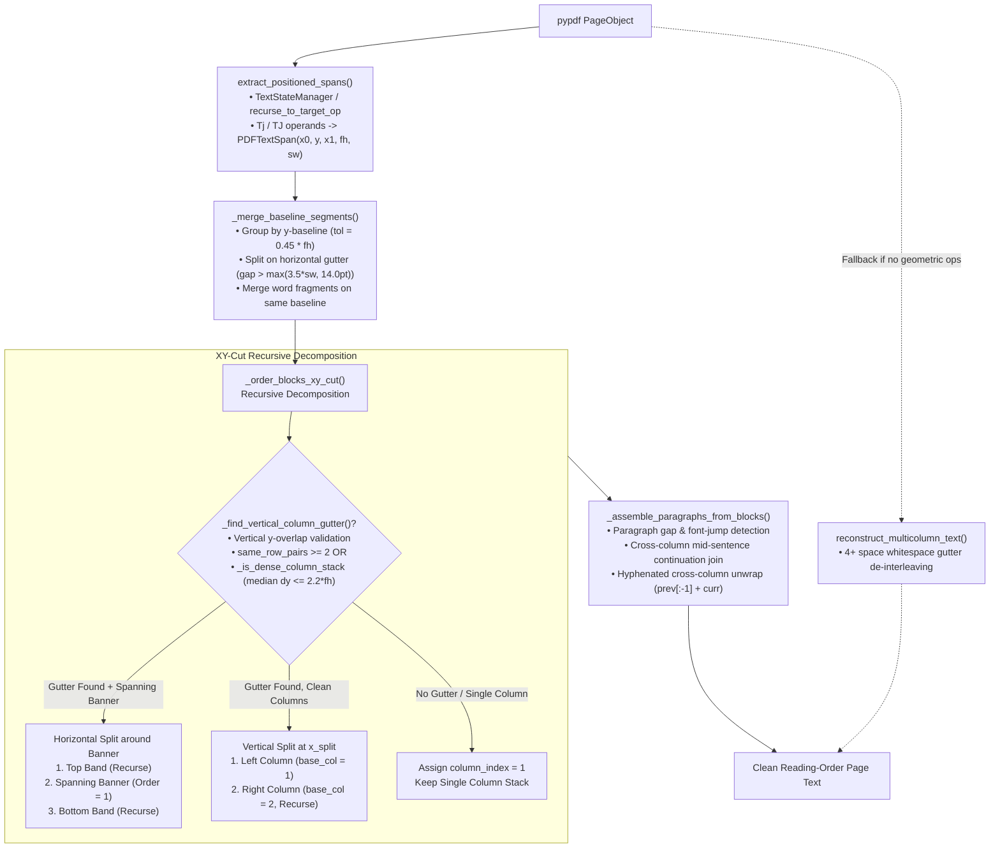
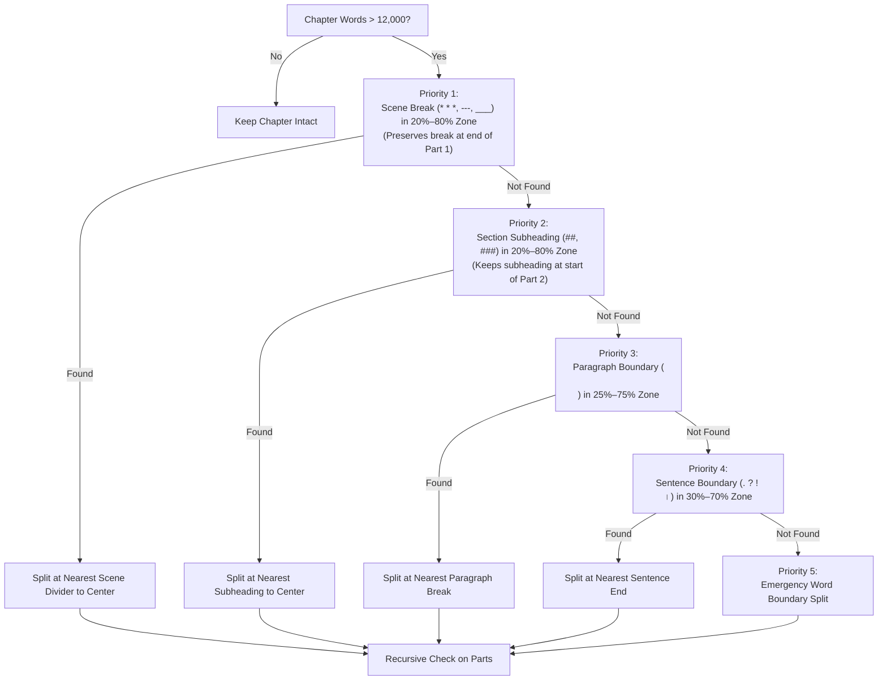

# 📜 Forensic Literary Document Ingestion & Canonical AST Engine (Pillar 1)

## Executive Summary

The **Forensic Literary Document Ingestion Engine** represents the foundational architectural upgrade (Pillar 1) of **Audiobook Maker v4.0**. In high-end cinematic audiobook and audio drama production, downstream stages—such as literary Hindustani translation, multi-cast screenplay attribution, neural speech synthesis (Google Gemini 3.1 Flash Cloud TTS), acoustic Foley placement, and EBU R128 mastering—are fundamentally constrained by the fidelity and structural integrity of the ingested source text.

Traditional audiobook extractors suffer from severe architectural flaws:
- **Destructive Flattening:** Arbitrary regex and naive string stripping erase scene dividers (`* * *`), section headings, typographic dialogue quotes, and structural hierarchy.
- **Lost Forensic Provenance:** Extracted paragraphs cannot be traced back to their exact origin (e.g. EPUB spine item, anchor, or PDF page number).
- **Silent Failures & Hallucination Cascades:** OCR noise, corrupted scanned pages, multi-column interleaving, and table-of-contents misfires pass silently into downstream LLM translation and TTS stages, burning scarce API quotas on corrupted text.
- **Uncontrolled Context Explosions:** Mammoth chapters ($> 12,000$ words) overflow LLM attention windows, causing truncated speech or context degradation.

The Pillar 1 engine resolves these challenges through a **Dual-Layer Architecture**:
1. **Sacred Canonical Layer (`canonical/book.json`):** Strongly typed Pydantic v2 AST capturing the immutable, sacred raw source text, clean normalized text, hierarchical chapter-block relationships, and granular block-level forensic provenance.
2. **Backward-Compatible Projection Layer (`extracted/chapter_XXX.md`):** Deterministic markdown projection guaranteeing 100% interoperability with downstream translation, screenplay parsing, and packaging stages.
3. **Independent Fail-Closed Ingestion Gate (Gate 0.1):** Rigorous heuristic audit evaluating document completeness, word counts, and page layout/OCR noise before downstream execution begins.

---

## 🏛️ Ingestion Pipeline Architecture

The following diagram illustrates the complete ingestion lifecycle from raw multi-format book containers to the audited canonical AST and downstream legacy markdown projections.

```mermaid
flowchart TD
    subgraph Input["📥 Input Stage"]
        Doc["Raw Book Document<br/>(.epub, .pdf, .txt, .md)"]
    end

    subgraph Archival["🔒 Source Preservation"]
        Doc --> IngestFacade["Universal Extractor Facade<br/>process_book_file()"]
        IngestFacade --> SHA["Compute SHA-256"]
        SHA --> RawDir["raw/ Archive<br/>• source_original.ext<br/>• source_manifest.json"]
    end

    subgraph Parsing["⚙️ Structural Parsers"]
        IngestFacade -->|EPUB| EPUBParser["ForensicEPUBParser<br/>• Single-pass OPF & Spine<br/>• Nav/NCX Anchor Slicing<br/>• Bracket Backtracking<br/>• Spine Fallback Tagging"]
        IngestFacade -->|PDF| PDFEngine["ForensicPDFEngine<br/>• PDFLayoutReconstructor (XY-Cut)<br/>• _PDFPageSpanRecord Indexing<br/>• PDFQualityAnalyzer (Multi-Signal)<br/>• Candidate Comparison Gate"]
        IngestFacade -->|TXT / MD| TextParser["Text / Markdown Parser<br/>• clean_book_text()<br/>• Provenance Offsets"]
    end

    subgraph Normalization["🧹 Non-Destructive Normalizer"]
        EPUBParser --> Norm["normalizer.py<br/>• Unicode NFC Normalization<br/>• Zero-Width & Control Stripping (\\x00, \\x07, \\u00ad)<br/>• Latin / Devanagari Hyphen Healing<br/>• Sacred raw_text Unmutated"]
        PDFEngine --> Norm
        TextParser --> Norm
    end

    subgraph Segmentation["✂️ Chapter Segmentation & Meso Guard"]
        Norm --> Segmenter["chapter_segmenter.py<br/>• Multi-Tier Regex (EN / HI / Roman / Words)<br/>• is_valid_heading_candidate() Guard<br/>• Literary vs. Chunk Tracking"]
        Segmenter --> MesoGuard["Meso-Tier Semantic Splitter<br/>• 12,000 Word Ceiling<br/>• Scene Break (* * *) -> Subheading (###)<br/>• Paragraph -> Sentence -> Word"]
    end

    subgraph AST["📦 Canonical AST Assembly"]
        MesoGuard --> CanBook["CanonicalBook AST<br/>• SourceProvenance (page_end, line, col)<br/>• CanonicalChapter[] (unit_type, boundary_origin)<br/>• CanonicalBlock[] (sacred raw + normalized)<br/>• get_literary_chapters() & get_production_chunks()"]
    end

    subgraph GateAudit["🛡️ Gate 0.1: Extraction Quality Gate"]
        CanBook --> Gate["ExtractionQualityAuditor<br/>• Evaluates Literary & Chunk Telemetry<br/>• Status: PASS / WARN / REVIEW<br/>• Fail-Closed Guard"]
        Gate -->|REVIEW (Default)| Error["ExtractionGateAuditError<br/>• Actionable Diagnostics<br/>• Affected Pages & Chunks Ledger"]
        Gate -->|REVIEW + --force-gate| Override["Bypass Override Logged"]
        Gate -->|PASS / WARN| DiskPersist["Persistence Stage"]
        Override --> DiskPersist
    end

    subgraph Storage["💾 Project Storage Layout"]
        DiskPersist --> SaveCanonical["canonical/<br/>• book.json<br/>• quality_report.json"]
        DiskPersist --> ProjectLegacy["extracted/<br/>• chapter_001.md<br/>• chapter_002.md..."]
        DiskPersist --> SaveMeta["metadata.json<br/>(Legacy Project State)"]
    end
```

---

## 📂 Project Storage Hierarchy

When [`process_book_file`](file:///c:/Users/Suraj/Documents/Antigravity/Audiobook/audiobook_factory/extractor.py#L146-L401) processes an input file, it creates an isolated project workspace under `audiobooks/projects/<BOOK_SLUG>/` structured into three distinct layers:

```
audiobooks/projects/<BOOK_SLUG>/
├── raw/                                  # Sacred unmutated archive
│   ├── source_original.epub              # Bit-for-bit verbatim source copy
│   └── source_manifest.json              # Forensic metadata, file size, SHA-256 hash
├── canonical/                            # Pillar 1 Strongly-Typed AST
│   ├── book.json                         # Complete CanonicalBook Pydantic v2 JSON
│   └── quality_report.json               # ExtractionQualityReport machine audit
├── extracted/                            # Backward-compatible projection layer
│   ├── chapter_001.md                    # Standard markdown for Translation & Scripting
│   ├── chapter_002.md
│   └── chapter_003.md
└── metadata.json                         # Backward-compatible project metadata summary
```

### 1. Raw Source Manifest (`raw/source_manifest.json`)
Before any byte parsing or extraction occurs, the original file is hashed using SHA-256 and copied to `raw/source_original.<ext>`. The manifest locks the provenance:

```json
{
  "book_id": "the_last_wish",
  "original_path": "C:/Books/the_last_wish.epub",
  "source_format": "epub",
  "file_size_bytes": 1459203,
  "sha256": "4a7d1e8e50b86a87c18a9ef388f8d689b9d3b4b8a1c890f576e3efb6a78c0012",
  "archived_copy": "C:/.../audiobooks/projects/the_last_wish/raw/source_original.epub",
  "ingested_at": "2026-09-24T22:40:00Z"
}
```

---

## 🧬 Canonical AST Data Models

Defined in [`audiobook_factory/book_model.py`](file:///c:/Users/Suraj/Documents/Antigravity/Audiobook/audiobook_factory/book_model.py), the Canonical AST is built with **Pydantic v2** (`BaseModel`, `ConfigDict(extra="ignore")`) and establishes the single source of truth for the entire pipeline.



### Core Schema Specifications

| Class | Purpose | Key Attributes & Methods |
|---|---|---|
| [`CanonicalBook`](file:///c:/Users/Suraj/Documents/Antigravity/Audiobook/audiobook_factory/book_model.py#L236-L355) | Top-level representation of an entire literary volume | `book_id`, `title`, `author`, `source_type`, `chapters`, `quality_report`, `raw_metadata`, `get_literary_chapters()`, `get_production_chunks()`, `save_canonical()`, `project_legacy_extracted()` |
| [`CanonicalChapter`](file:///c:/Users/Suraj/Documents/Antigravity/Audiobook/audiobook_factory/book_model.py#L92-L173) | Structured chapter or production chunk container | `id`, `number`, `title`, `blocks`, `source_location`, `confidence`, `words`, `unit_type`, `is_literary_chapter`, `is_production_chunk`, `boundary_origin`, `parent_chapter_id`, `page_start`, `page_end` |
| [`CanonicalBlock`](file:///c:/Users/Suraj/Documents/Antigravity/Audiobook/audiobook_factory/book_model.py#L76-L90) | Atomic content unit (e.g. paragraph, heading, scene break) | `id`, `type`, `raw_text` (sacred/unmutated), `normalized_text` (sanitized speech), `provenance`, `confidence`, `semantic_metadata` |
| [`SourceProvenance`](file:///c:/Users/Suraj/Documents/Antigravity/Audiobook/audiobook_factory/book_model.py#L54-L74) | Forensic origin tracking (Where did this come from?) | `source_file`, `source_type`, `page_number`, `page_end`, `column_index`, `spine_item`, `html_tag`, `html_id`, `line_start`, `line_end`, `char_offset`, `reading_order`, `extraction_method` |
| [`ExtractionQualityReport`](file:///c:/Users/Suraj/Documents/Antigravity/Audiobook/audiobook_factory/book_model.py#L174-L235) | Machine-readable ingestion quality audit | `overall_confidence`, `gate_status`, `total_words`, `total_chapters`, `detected_literary_chapters`, `production_chunks`, `used_fallback_chunking`, `suspicious_pages`, `warnings`, `errors` |
| [`ExtractionGateAuditError`](file:///c:/Users/Suraj/Documents/Antigravity/Audiobook/audiobook_factory/book_model.py#L43-L52) | Exception raised when Gate 0.1 fails closed | Subclass of `ValueError`, encapsulates `ExtractionQualityReport` and actionable formatting |

### Enumerated Literal Types
- **`BlockType`**: `"paragraph" | "heading" | "dialogue" | "scene_break" | "quote" | "poetry" | "list" | "note" | "unknown"` (Conservative: defaults to `"paragraph"` or `"unknown"` unless structural evidence is unambiguous).
- **`UnitType`**: `"literary_chapter" | "production_chunk"` (Distinguishes authentic source literary chapters from artificial chunks created for processing limits or fallback chunking).
- **`BoundaryOrigin`**: `"detected_heading" | "toc_navigation" | "inferred_prologue" | "semantic_split_chunk" | "fallback_production_chunk" | "spine_fallback"`.
- **`ConfidenceLevel`**: `"HIGH" | "MEDIUM" | "LOW"`
- **`GateStatus`**: `"PASS" | "WARN" | "REVIEW"`

---

## 🧹 Non-Destructive Literary Normalizer

Implemented in [`audiobook_factory/normalizer.py`](file:///c:/Users/Suraj/Documents/Antigravity/Audiobook/audiobook_factory/normalizer.py), the normalizer sanitizes literary prose for speech synthesis without destroying source fidelity or muting literary typography.

### Normalization Pipeline Stages



1. **Stage 0: Unicode NFC Normalization, Invisible Zero-Width & Control Character Hygiene:**
   - Applies canonical decomposition followed by canonical composition (`unicodedata.normalize("NFC", text)`).
   - Purges invisible zero-width characters and soft hyphens that disrupt tokenizer encodings: `\u200b` (Zero-Width Space), `\u200c` (ZWNJ), `\u200d` (ZWJ), `\ufeff` (Byte Order Mark), `\u2060` (Word Joiner), and `\u00ad` (Soft Hyphen).
   - Sanitizes C0/C1 binary and terminal control codes via `CONTROL_CHARS_RE = re.compile(r"[\x00-\x08\x0b\x0c\x0e-\x1f\x7f-\x9f]")`, eliminating null bytes (`\x00`), bell alerts (`\x07`), and line noise in `normalized_text`.
   - **Sacred Source Invariant:** These sanitizations apply strictly to `normalized_text` for neural speech synthesis; `CanonicalBlock.raw_text` preserves the bit-accurate original source text untouched.
2. **Stage 1: Hyphenated Linebreak Healing:**
   - Detects words broken across line wraps (common in justified book typography) and welds them seamlessly across ASCII, Accented Latin (`\u00C0-\u024F\u1E00-\u1EFF`), and Devanagari (`\u0900-\u097F`) Unicode scripts:
     ```python
     re.sub(
         r"(\b[a-zA-Z\u00C0-\u024F\u1E00-\u1EFF\u0900-\u097F]{2,})-\n+([a-zA-Z\u00C0-\u024F\u1E00-\u1EFF\u0900-\u097F]{2,}\b)",
         r"\1\2",
         text,
     )
     ```
   - Heals `"impor-\ntant"` to `"important"`, `"dé-\njà"` to `"déjà"`, and `"प्र-\nस्तावना"` to `"प्रस्तावना"`.
3. **Stage 2: Typographic Quote & Dash Normalization:**
   - Standardizes directional curly quotes (`\u2018`, `\u2019` $\rightarrow$ `'`, `\u201c`, `\u201d` $\rightarrow$ `"`).
   - Spaces em dashes (`\u2014` $\rightarrow$ ` — `) and en dashes (`\u2013` $\rightarrow$ ` – `) to give neural TTS models natural cadence pauses.
   - Converts ellipses (`\u2026` $\rightarrow$ `...`).
   - Supports `preserve_literary_quotes=True` when raw typographic quotes are desired.
4. **Stage 3: Footnote Reference Removal:**
   - Strips non-spoken citation brackets such as `[1]`, `[23]`, and `[104]` using `re.sub(r"\[\d{1,3}\]", "", text)`.
5. **Stage 4: Running Header & Page Number Stripping:**
   - Strips isolated lines matching `"Page X of Y"`, `"- 42 -"`, or bare page integers.
6. **Stage 5: Whitespace Collapsing:**
   - Collapses consecutive spaces and tabs (`[ \t]+` $\rightarrow$ `" "`).
   - Preserves double newline paragraph breaks while collapsing $\ge 3$ newlines to `\n\n`.

### Public APIs
- [`clean_book_text(text: str, preserve_literary_quotes: bool = False) -> str`](file:///c:/Users/Suraj/Documents/Antigravity/Audiobook/audiobook_factory/normalizer.py#L29-L71)
- [`normalize_block_text(raw_text: str, preserve_literary_quotes: bool = False) -> Tuple[str, List[str]]`](file:///c:/Users/Suraj/Documents/Antigravity/Audiobook/audiobook_factory/normalizer.py#L73-L94): Returns normalized text along with forensic warning diagnostics (e.g. presence of Unicode replacement `\ufffd`, excessive broken hyphens).

---

## 📖 Single-Pass Structural EPUB Parser

Implemented in [`audiobook_factory/epub_parser.py`](file:///c:/Users/Suraj/Documents/Antigravity/Audiobook/audiobook_factory/epub_parser.py), [`ForensicEPUBParser`](file:///c:/Users/Suraj/Documents/Antigravity/Audiobook/audiobook_factory/epub_parser.py#L184-L463) solves the duplicate unzipping, anchor desynchronization, and scene-break flattening flaws found in standard EPUB parsers.

### Key Capabilities

1. **Single-Pass OPF & Spine Traversal:**
   - Locates `META-INF/container.xml` to discover the OPF package rootfile.
   - Extracts metadata (`dc:title`, `dc:creator`, `dc:language`) and maps the manifest ID-to-href dictionary.
   - Follows the `<spine>` reading order (`<itemref idref="...">`) to read each document exactly once, caching offsets in a contiguous virtual memory map (`file_offsets`, `file_lengths`, `full_html`).
2. **Nav & NCX Landmark Anchor Slicing with Opening Bracket Backtracking:**
   - When table of contents entries target HTML anchors (e.g. `chapter1.xhtml#section_2`), naive string splitters cut inside HTML tags, leaving broken tags like `id="section_2">`.
   - The forensic parser scans backwards from the anchor match to locate the last unmatched opening angle bracket (`<`):
     ```python
     last_open = file_slice.rfind('<', 0, m.start())
     last_close = file_slice.rfind('>', 0, m.start())
     if last_open != -1 and last_open > last_close:
         pos = base_offset + last_open
     else:
         pos = base_offset + m.start()
     ```
   - This ensures clean DOM boundary slicing without dangling tag fragments.
3. **DOM-Aware Structural Parsing ([`EPUBStructuralHTMLParser`](file:///c:/Users/Suraj/Documents/Antigravity/Audiobook/audiobook_factory/epub_parser.py#L34-L182)):**
   - Subclasses `html.parser.HTMLParser` to parse XHTML fragments directly into ordered [`CanonicalBlock`](file:///c:/Users/Suraj/Documents/Antigravity/Audiobook/audiobook_factory/book_model.py#L64-L79) elements.
   - Automatically detects:
     - Heading levels (`h1` through `h6` $\rightarrow$ `type="heading"`, `metadata={"level": N}`).
     - Scene dividers (`<hr>` or paragraphs containing `* * *`, `---`, `___` $\rightarrow$ `type="scene_break"`).
     - Blockquotes (`<blockquote>` $\rightarrow$ `type="quote"`).
     - Standard paragraphs (`<p>` $\rightarrow$ `type="paragraph"`).
   - Attaches precise source provenance: `spine_item`, `html_tag`, `html_id` (anchor name), `line_start`, `char_offset`, and global `reading_order`.
4. **Sequential Fallback Recovery:**
   - If an EPUB lacks both NCX and Nav TOC structures, the parser automatically falls back to sequential spine traversal, inferring chapter boundaries from top-level headings or minimum word thresholds ($\ge 30$ words).

---

## 📄 Layout-Aware PDF Engine & Quality Analyzer

Implemented in [`audiobook_factory/pdf_engine.py`](file:///c:/Users/Suraj/Documents/Antigravity/Audiobook/audiobook_factory/pdf_engine.py), the PDF engine combines ultra-fast local digital extraction, recursive XY-cut geometric reading order reconstruction, character-accurate end-to-end source provenance, and multi-signal quality gate evaluation with selective multimodal vision escalation.

---

### 🧩 Upgrade 1: PDF Reading Order & Multi-Column XY-Cut (`PDFLayoutReconstructor`)

Multi-column layouts (e.g. 2-column academic papers, 3-column anthologies, or chapter openings with spanning banners) cause naive extractors to interleave text horizontally across columns, corrupting sentence grammar and destroying narrative cadence. [`PDFLayoutReconstructor`](file:///c:/Users/Suraj/Documents/Antigravity/Audiobook/audiobook_factory/pdf_engine.py#L53-L580) reconstructs natural human reading order:



#### Key Algorithmic Mechanics:
1. **Geometric Content Stream Extraction ([`extract_positioned_spans`](file:///c:/Users/Suraj/Documents/Antigravity/Audiobook/audiobook_factory/pdf_engine.py#L61-L142)):**
   - Intercepts PDF operator streams using `pypdf.generic.ContentStream`, `TextStateManager`, and `recurse_to_target_op`.
   - Resolves font matrices (`Tf`), displacements (`displaced_tx`), vertical coordinate flips (`flip_vertical`), and font heights (`font_height`) into structured [`PDFTextSpan`](file:///c:/Users/Suraj/Documents/Antigravity/Audiobook/audiobook_factory/pdf_engine.py#L40-L51) objects with `(x0, y, x1, font_height, space_width, seq_order)`.
2. **Baseline Horizontal Segment Merging ([`_merge_baseline_segments`](file:///c:/Users/Suraj/Documents/Antigravity/Audiobook/audiobook_factory/pdf_engine.py#L144-L225)):**
   - Clusters glyph and word spans lying on the same horizontal baseline within vertical tolerance $\pm 0.45 \times \max(fh, 8.0)$.
   - Merges intra-line words while detecting column gutters: whenever the horizontal gap between adjacent segments exceeds $\max(3.5 \times sw, 14.0\text{ pt})$, it splits into separate column line segments.
3. **Vertical Gutter Detection & Single-Column False-Split Prevention ([`_find_vertical_column_gutter`](file:///c:/Users/Suraj/Documents/Antigravity/Audiobook/audiobook_factory/pdf_engine.py#L227-L349)):**
   - To prevent false-positive column splits on centered poetry, indented single-column dialogue, or epigraphs, the detector mandates:
     - **Vertical Y-Extent Overlap:** Left and right groups must overlap vertically within the page band.
     - **Side-by-Side Parallel Row Pairs:** Requires $\ge 2$ independent spans sharing matching horizontal baselines across the gutter (`same_row_pairs \ge 2`), **OR**
     - **Dense Column Stacks:** Both sides must form dense, independent line stacks with median line spacing $\le 2.2 \times fh$ (`_is_dense_column_stack`).
     - **Spanning Dominance Guard:** Multi-column spans in band must strictly dominate any crossing banner text ($col\_count > 2 \times crossing\_count$).
4. **Recursive XY-Cut Multi-Column Decomposition ([`_order_blocks_xy_cut`](file:///c:/Users/Suraj/Documents/Antigravity/Audiobook/audiobook_factory/pdf_engine.py#L351-L412)):**
   - Recursively cuts horizontally around full-width or centered spanning banners/headers/footers, and vertically across column gutters (Left Column $\rightarrow$ Right Column), supporting 2-column, 3-column, and arbitrary multi-tier column structures.
5. **Cross-Column Mid-Sentence & Hyphenation Joining ([`_assemble_paragraphs_from_blocks`](file:///c:/Users/Suraj/Documents/Antigravity/Audiobook/audiobook_factory/pdf_engine.py#L414-L495)):**
   - If the bottom of a left column ends mid-sentence (no terminal punctuation) and the top of the adjacent right column begins with a lowercase letter, paragraphs are seamlessly merged (`prev_p + "\n" + curr_p`).
   - If the left column ends with a trailing hyphen (`-`), the hyphen is stripped and the broken word is healed across the column divide (`prev_p[:-1] + curr_p`).
6. **Whitespace-Aligned Fallback ([`reconstruct_multicolumn_text`](file:///c:/Users/Suraj/Documents/Antigravity/Audiobook/audiobook_factory/pdf_engine.py#L508-L580)):**
   - If geometric content streams are absent or encrypted, the engine falls back to analyzing layout-spaced text, detecting 4+ space whitespace gutters and de-interleaving column bands while leaving standard single-column text untouched.

---

### 📍 Upgrade 2: End-to-End PDF Source Provenance (`ForensicPDFEngine`)

A major flaw in traditional PDF processing is "loss of origin": once pages are extracted, paragraphs become anonymous strings detached from their source page, lines, and character positions. [`ForensicPDFEngine`](file:///c:/Users/Suraj/Documents/Antigravity/Audiobook/audiobook_factory/pdf_engine.py#L1196-L1655) establishes unbreakable end-to-end provenance:

1. **Character-Accurate Span Indexing ([`_PDFPageSpanRecord`](file:///c:/Users/Suraj/Documents/Antigravity/Audiobook/audiobook_factory/pdf_engine.py#L1184-L1194)):**
   - As pages are extracted and joined, [`_build_page_provenance_index`](file:///c:/Users/Suraj/Documents/Antigravity/Audiobook/audiobook_factory/pdf_engine.py#L1269-L1335) constructs a contiguous character memory map:
     ```python
     @dataclass
     class _PDFPageSpanRecord:
         page_number: int
         doc_char_start: int
         doc_char_end: int
         page_text: str
         line_offsets: List[Tuple[int, int, int]]  # (page_rel_start, page_rel_end, line_1based)
         confidence: ConfidenceLevel
         extraction_method: str
     ```
2. **Cross-Page Mid-Sentence Block Joining (`page_number` + `page_end`):**
   - When a paragraph spans across a page turn, the engine connects the pages with a single `\n` (rather than `\n\n`), and resolves the resulting [`CanonicalBlock`](file:///c:/Users/Suraj/Documents/Antigravity/Audiobook/audiobook_factory/book_model.py#L76-L90) with multi-page bounds:
     - `provenance.page_number`: Starting page (e.g. `41`)
     - `provenance.page_end`: Ending page (e.g. `42`)
     - `provenance.line_start`: Line on start page
     - `provenance.line_end`: Line on end page
     - `semantic_metadata["page_span"]`: `[41, 42]`
3. **Lossless Forwarding into Canonical Chapters ([`segment_into_canonical_chapters`](file:///c:/Users/Suraj/Documents/Antigravity/Audiobook/audiobook_factory/pdf_engine.py#L1496-L1655)):**
   - Preserves `page_number`, `page_end`, `line_start`, `line_end`, `char_offset`, `reading_order`, `extraction_method`, and `confidence` through chapter segmentation and Meso-tier splitting.
   - Chapter source locations are summarized automatically (e.g. `source_location="pages 41-58"`).
4. **Sacred Source Invariant vs. Non-Destructive Normalization:**
   - `CanonicalBlock.raw_text` preserves the exact, sacred source text as extracted from the page.
   - `CanonicalBlock.normalized_text` removes C0/C1 control characters (`[\x00-\x08\x0b\x0c\x0e-\x1f\x7f-\x9f]`, e.g. `\x00`, `\x07`) and soft hyphens (`\u00ad`), guaranteeing speech synthesis purity without mutating source truth.

---

### 🛡️ Upgrade 3: Multi-Signal Gemini Escalation Quality Gate (`PDFQualityAnalyzer`)

Instead of naively accepting multimodal LLM extraction whenever a local extraction has anomalies, [`PDFQualityAnalyzer`](file:///c:/Users/Suraj/Documents/Antigravity/Audiobook/audiobook_factory/pdf_engine.py#L628-L960) performs rigorous multi-signal evaluation and candidate comparison:

#### 1. Candidate Quality Scoring ([`evaluate_extraction_quality`](file:///c:/Users/Suraj/Documents/Antigravity/Audiobook/audiobook_factory/pdf_engine.py#L647-L817))
Evaluates candidate page text across four normalized sub-scores in $[0.0, 1.0]$:

$$\text{Composite Score} = 0.40 \times \text{Reading Order} + 0.45 \times \text{Text Integrity} + 0.15 \times \text{Sentence Coherence}$$

- **Text Integrity Score ($\text{weight}=0.45$):**
  - Deducts for OCR symbol noise:
    $$\text{Noise Ratio} = \frac{\text{Symbols}}{\text{Total Characters}} \quad (\text{symbols} \notin \text{ASCII} \cup \text{Accented Latin } \texttt{\\u00C0-\\u024F\\u1E00-\\u1EFF} \cup \text{Devanagari } \texttt{\\u0900-\\u097F})$$
  - Deducts for Unicode replacement characters (`\ufffd`).
  - Deducts for mixed-alphanumeric OCR glitch tokens (e.g. `th3r3`, `1lI0O`).
  - Heavily penalizes conversational LLM refusal leakage or repetition loops.
- **Reading Order Score ($\text{weight}=0.40$):**
  - Measures the ratio of fragmented short lines ($< 35$ characters) ending without terminal punctuation followed by capitalized lines.
  - Penalizes unresolved wide horizontal whitespace gutters ($\ge 5$ spaces).
- **Sentence Coherence Score ($\text{weight}=0.15$):**
  - Audits valid terminal punctuation (`.`, `!`, `?`, `।`, `"`, `'`) and sentence boundary flow.

#### 2. Candidate Comparison & Disqualification Guards ([`compare_extraction_candidates`](file:///c:/Users/Suraj/Documents/Antigravity/Audiobook/audiobook_factory/pdf_engine.py#L819-L960))
The quality gate compares the local extraction candidate against the Gemini multimodal vision escalation candidate. **It explicitly does NOT blindly pick whichever candidate has more words.**

Gemini escalation output is immediately disqualified and rejected if:
1. **Conversational Refusal / Preamble Leakage:** Matches patterns like `"I cannot extract"`, `"As an AI"`, or conversational fences (`"Here is the markdown..."`, `^``` `).
2. **Repetition Loop Anomaly:** Any 4-gram repeated $\ge 5\times$ constituting $> 30\%$ of the extracted page word count.
3. **Character Corruption Regression:** Escalation candidate introduces new `\ufffd` replacement characters.
4. **Low Text Integrity:** Integrity score $< 0.65$ and not strictly superior to local extraction.
5. **Content Truncation Guard:** If local extraction had substantial clean prose ($\ge 25$ clean words, integrity $\ge 0.70$), the escalation candidate is **rejected if it loses $> 45\%$ of clean words** ($\text{gemini\_words} < 0.55 \times \text{local\_words}$).
6. **Tie-Breaking Rule:** If both candidates are valid, Gemini is only accepted if its composite score improves over local by at least $+0.05$ or resolves active local layout anomalies.

#### 3. Running Header & Footer Elimination
To prevent page headers (e.g. `"The Fellowship of the Ring"`) and footers from contaminating audiobook narration, [`audit_pages`](file:///c:/Users/Suraj/Documents/Antigravity/Audiobook/audiobook_factory/pdf_engine.py#L51-L140) tracks candidates across all pages. Any line matching across $\ge 3$ distinct pages is classified as a running header/footer and cleanly filtered out before block assembly.

---

## ✂️ Multi-Tier Chapter Segmentation & Meso-Tier Splitter

Implemented in [`audiobook_factory/chapter_segmenter.py`](file:///c:/Users/Suraj/Documents/Antigravity/Audiobook/audiobook_factory/chapter_segmenter.py), this component accurately segments continuous book text into dramatic chapters and enforces the **Meso-Tier 12,000-word ceiling**.

### 1. Multi-Tier Heading Recognition Patterns

```python
CHAPTER_PATTERNS = [
    # Tier 1: Markdown Headings (# The Boy Who Lived, ## The Council of Elrond)
    r"^#{1,2}\s+[A-Z0-9\u0900-\u097F][^\n]{1,80}$",
    # Tier 2: English Chapter / Book / Part / Act / Scene (Chapter 1, Book 2, Act III)
    r"^(?:\s*#+\s*)?(?:chapter|book|part|act|scene)\s+(?:\d+|[ivxlcdm]+|[a-z]+)\b.*$",
    # Tier 3: Story Landmarks (Prologue, Epilogue, Interlude, Introduction, Afterword)
    r"^(?:\s*#+\s*)?(?:prologue|epilogue|interlude|introduction|preface|afterword)\b.*$",
    # Tier 4: Devanagari / Hindi Markers (अध्याय, भाग, खंड, काण्ड, प्रस्तावना, उपसंहार)
    r"^(?:\s*#+\s*)?(?:अध्याय|भाग|खंड|काण्ड|प्रस्तावना|उपसंहार)\s*(?:\d+|[०-९]+|[a-z]+)?\b.*$",
    # Tier 5: Standalone Roman Numerals (IV., XIV, I - The Awakening)
    r"^(?:[IVXLCDM]{1,8}(?:\.|\s*[\-–—]\s*[A-Z][^\n]{2,60})?)$",
    # Tier 6: Standalone Word Numbers (ONE, TWENTY-TWO, THREE: The Journey)
    r"^(?:(?:ONE|TWO|THREE|...|TWENTY)(?:\s*[\:\-–—]\s*[A-Z][^\n]{2,60})?)$",
]
```

### 2. Conservative False-Positive Validation ([`is_valid_heading_candidate`](file:///c:/Users/Suraj/Documents/Antigravity/Audiobook/audiobook_factory/chapter_segmenter.py#L36-L61))
To prevent uppercase dialogue shouting (`"STOP!"`, `"NO!"`) or poetic lines from being falsely classified as chapter boundaries, every candidate match must pass strict boundary tests:
- **Length Constraint:** Between $1$ and $90$ characters.
- **Punctuation Immunity:** Must not start or end with quotation marks (`"`, `'`, `“`, `‘`), dashes (`—`, `-`), or clause punctuation (`,`, `;`).
- **Preceding Boundary:** Must be bounded by start of document or a double newline (`\n\n`).
- **Subsequent Content Floor:** Must be followed by at least $5$ words of body prose.

### 3. Meso-Tier 12,000-Word Semantic Splitter ([`split_large_chapter_on_semantic_boundary`](file:///c:/Users/Suraj/Documents/Antigravity/Audiobook/audiobook_factory/chapter_segmenter.py#L149-L241))
LLMs used in downstream translation and screenplay attribution degrade when processing prompt contexts exceeding 12,000 words. When a chapter exceeds this threshold, it is recursively partitioned into `"(Part 1)"` and `"(Part 2)"` using a **5-Tier Priority Hierarchy**:



---

### 📚 Upgrade 4: Literary Chapter vs. Production Chunk Distinction

Audiobook pipelines routinely confuse two distinct concepts:
1. **Literary Chapters:** Authentic structural boundaries authored by the novelist (e.g. *"Chapter 1: The Witcher"*, *"Prologue"*, *"Chapter 14"*).
2. **Production Chunks:** Ephemeral processing units created strictly to prevent LLM attention saturation ($> 12,000$ words) or fallback chunks (`"Production Chunk 1"`, `"Production Chunk 2"`) generated when a raw plain text or poorly-tagged PDF document lacks detectable headings.

Pillar 1 models this distinction explicitly across [`CanonicalBook`](file:///c:/Users/Suraj/Documents/Antigravity/Audiobook/audiobook_factory/book_model.py#L236-L355), [`CanonicalChapter`](file:///c:/Users/Suraj/Documents/Antigravity/Audiobook/audiobook_factory/book_model.py#L92-L173), and [`ChapterSegmenter`](file:///c:/Users/Suraj/Documents/Antigravity/Audiobook/audiobook_factory/chapter_segmenter.py):

#### 1. Explicit Data Contracts
```python
class CanonicalChapter(BaseModel):
    unit_type: Literal["literary_chapter", "production_chunk"]
    is_literary_chapter: bool
    is_production_chunk: bool
    boundary_origin: Literal[
        "detected_heading",          # Found via regex chapter patterns
        "toc_navigation",            # Found via EPUB NCX / Nav landmarks
        "inferred_prologue",         # Inferred pre-chapter text zone
        "semantic_split_chunk",      # Meso-tier 12k split chunk
        "fallback_production_chunk", # Plaintext / PDF fallback chunk
        "spine_fallback",            # EPUB un-headed spine fallback
    ]
    parent_chapter_id: Optional[str]         # e.g. "lit-ch-001"
    parent_chapter_title: Optional[str]      # Original unified title
    literary_chapter_number: Optional[int]   # 1-indexed source chapter number
    chunk_index: Optional[int]               # 1-indexed part number
    total_chunks_in_chapter: Optional[int]   # Total parts created
```

#### 2. Subheading & Scene Break Preservation
During Meso-Tier splitting of oversized chapters (>12k words) across all formats (EPUB, PDF, TXT, Markdown), the splitter preserves:
- **Priority 1 (Scene Breaks `* * *`, `---`, `___`):** Stays at the tail of Part 1.
- **Priority 2 (Markdown Subheadings `###`, `##`):** Placed at the top of Part 2 with the `#` prefix intact, so that screenplay and translation engines understand the section context.

#### 3. Dual Accessors on CanonicalBook
- **[`book.get_literary_chapters()`](file:///c:/Users/Suraj/Documents/Antigravity/Audiobook/audiobook_factory/book_model.py#L253-L325):**
  - Unites any multi-part production chunks (`Part 1`, `Part 2`) back into single canonical literary chapters with combined blocks and continuous provenance.
  - Strips artificial fallback production chunks.
  - Sorts strictly by `literary_chapter_number`.
  - Used for table-of-contents generation, reader summaries, and M4B metadata packaging.
- **[`book.get_production_chunks()`](file:///c:/Users/Suraj/Documents/Antigravity/Audiobook/audiobook_factory/book_model.py#L327-L330):**
  - Returns only artificial production chunks created for processing limits or fallback chunking.
  - Used by LLM translation dispatchers and multi-worker TTS pipelines.

#### 4. Gate Auditing Telemetry
[`ExtractionQualityReport`](file:///c:/Users/Suraj/Documents/Antigravity/Audiobook/audiobook_factory/book_model.py#L174-L235) records:
- `detected_literary_chapters`: Exact count of genuine authorial chapters.
- `production_chunks`: Count of artificial execution chunks.
- `used_fallback_chunking`: Flagged `True` if no headings were discovered in the source and the document was partitioned into fallback chunks. If fallback chunking is used, Gate 0.1 logs an informational warning without failing closed.

---

## 🛡️ Ingestion Quality Gate (Gate 0.1 / Forensic Gate)

Implemented in [`audiobook_factory/quality_gate.py`](file:///c:/Users/Suraj/Documents/Antigravity/Audiobook/audiobook_factory/quality_gate.py), [`ExtractionQualityAuditor`](file:///c:/Users/Suraj/Documents/Antigravity/Audiobook/audiobook_factory/quality_gate.py#L21-L111) acts as an independent, fail-closed gate keeper evaluating the canonical book model before any downstream stages can run.

### Gate Audit Statuses
- **`PASS`**: All chapters exceed word count floors; zero empty chapters; page noise ratio $\le 0\%$; overall confidence `HIGH`.
- **`WARN`**: Minor anomalies detected (e.g. $1$ to $25\%$ of pages exhibit layout or OCR noise, healed via escalation); overall confidence `MEDIUM`. Pipeline proceeds with logged warnings.
- **`REVIEW`**: Critical quality defects detected; overall confidence `LOW`. **The pipeline fails closed and aborts immediately with [`ExtractionGateAuditError`](file:///c:/Users/Suraj/Documents/Antigravity/Audiobook/audiobook_factory/book_model.py#L33-L43)**.

### Critical Defect Triggers (Status: `REVIEW`)
1. **Zero Chapters Detected:** Document failed chapter regex and semantic chunking fallback.
2. **Dangerously Low Word Count:** Total extracted text $< 50$ words for EPUB or PDF documents.
3. **Empty or Stub Chapters:** Any chapter contains $< 5$ words.
4. **High Suspicious Page Ratio:** Suspicious pages exceed $25\%$ of total document pages ($\frac{\text{suspicious}}{\text{total}} > 0.25$).

### Actionable Diagnostic Failure Report
When Gate 0.1 fails closed, it produces an actionable terminal diagnostic detailing exactly what failed, which pages are affected, and the remediation path:

```
==============================================================================
  [FATAL] EXTRACTION QUALITY GATE AUDIT: REVIEW REQUIRED
==============================================================================
Source Document : books/corrupted_scan.pdf
Format / Engine : PDF via pdf_layout_selective
Extraction Stats: 0 chapters, 24 words, 2 blocks
Overall Status  : REVIEW (Confidence: LOW)

CRITICAL QUALITY DEFECTS DETECTED:
  • Zero chapters were detected in the source document.
  • Total extracted word count (24 words) is below the minimum threshold for literary documents.
  • Severe layout/OCR anomalies detected on 18/20 pages (90.0%).

Affected Suspicious Pages (18): [1, 2, 3, 4, 5, 6, 7, 8, 9, 10, 11, 12, 13, 14, 15, 16, 17, 18]

RECOMMENDED REMEDIATION:
  1. Verify the source file integrity (e.g. check for corrupt scanned pages, DRM, or multi-column layout).
  2. For scanned or complex layout PDFs, ensure GEMINI_API_KEY is configured to enable visual OCR escalation.
  3. If you have verified the extracted chapters manually and wish to proceed anyway,
     rerun with the '--force-gate' flag to bypass the Quality Gate fail-closed check.
==============================================================================
```

### The `--force-gate` Override
For edge cases where an operator has manually inspected the extracted markdown files and chooses to proceed despite gate warnings, the fail-closed behavior can be explicitly bypassed using the `--force-gate` CLI flag.

---

## 💻 CLI Usage Guide

### 1. Extracting a Book Document (`extract`)

Extracts an EPUB, PDF, TXT, or Markdown book into the canonical AST, archives raw sources, and projects legacy markdown chapters:

```bash
# Standard extraction with fail-closed gate enforcement
python audiobook_cli.py extract books/the_witcher.epub

# PDF extraction with automatic layout analysis
python audiobook_cli.py extract books/dracula.pdf

# Bypassing Quality Gate REVIEW failure (operator override)
python audiobook_cli.py extract books/scanned_book.pdf --force-gate
```

### 2. Autonomous End-to-End Pipeline (`auto`)

Runs all 6 production stages in a single command, incorporating Gate 0.1 before translation:

```bash
# Autonomous run with default fail-closed protection
python audiobook_cli.py auto books/the_witcher.epub \
  --hindi \
  --dramatized \
  --voice Charon \
  --cover covers/witcher.jpg

# Autonomous run with Quality Gate override
python audiobook_cli.py auto books/unorthodox_layout.epub \
  --hindi \
  --dramatized \
  --voice Aoede \
  --force-gate
```

---

## 🔬 Python API Reference & Quickstart

Programmatic integration via the unified extractor facade:

```python
from pathlib import Path
from audiobook_factory.extractor import process_book_file
from audiobook_factory.book_model import CanonicalBook, ExtractionGateAuditError

projects_base = Path("audiobooks/projects")
input_file = Path("books/dune.epub")

try:
    # Ingest document, enforce Gate 0.1, archive raw, and project markdown
    metadata = process_book_file(
        input_file=input_file,
        output_base_dir=projects_base,
        force_gate=False,
    )
    print(f"Ingested {metadata['title']} ({metadata['total_chapters']} chapters)")

except ExtractionGateAuditError as e:
    print(f"Extraction halted by Quality Gate:\n{e}")
    # Inspect the machine-readable report
    report = e.report
    print(f"Suspicious pages: {report.suspicious_pages}")
```

### Direct Canonical AST Deserialization

```python
import json
from pathlib import Path
from audiobook_factory.book_model import CanonicalBook

book_json_path = Path("audiobooks/projects/dune/canonical/book.json")
with open(book_json_path, "r", encoding="utf-8") as f:
    book_ast = CanonicalBook.model_validate_json(f.read())

print(f"Book: {book_ast.title} by {book_ast.author}")
for chapter in book_ast.chapters:
    print(f"  Chapter {chapter.number}: {chapter.title} ({chapter.words} words, {len(chapter.blocks)} blocks)")
    for block in chapter.blocks[:3]:
        print(f"    [{block.type}] (Origin: {block.provenance.spine_item or block.provenance.page_number}) -> {block.normalized_text[:50]}...")
```

---

## 📊 Summary of Architectural Upgrades (Pillar 1)

| Capability | Legacy Pipeline (v3.x) | Forensic Ingestion Engine (Pillar 1 Complete Architecture) |
|---|---|---|
| **Data Representation** | Ephemeral, flat string chunks | Strongly typed Pydantic v2 AST ([`CanonicalBook`](file:///c:/Users/Suraj/Documents/Antigravity/Audiobook/audiobook_factory/book_model.py#L236-L355)) with sacred raw text and clean normalized text |
| **PDF Multi-Column Layout** | Left-to-right interleaving across columns; severed sentences | Geometric XY-cut decomposition ([`PDFLayoutReconstructor`](file:///c:/Users/Suraj/Documents/Antigravity/Audiobook/audiobook_factory/pdf_engine.py#L53-L580)), gutter detection, spanning banner cuts, and column wrap healing |
| **Source Provenance** | None (lost upon extraction) | Character-accurate `_PDFPageSpanRecord` indexing, tracking `page_number`, `page_end`, `line_start`, `line_end`, `char_offset`, `reading_order`, `extraction_method` |
| **Source Preservation** | None (ephemeral) | Sacred `raw/` archive with SHA-256 verification manifest; unmutated `raw_text` vs sanitized `normalized_text` (purging `\x00`, `\x07`, `\u00ad`) |
| **EPUB Parsing** | Double zip read, naive regex split, broken tags | Single-pass OPF/spine, Nav/NCX anchor slicing with bracket backtracking, spine fallback tagging |
| **PDF Escalation Evaluation** | Naive word count comparison or blind acceptance | Multi-signal quality gate ([`PDFQualityAnalyzer.compare_extraction_candidates`](file:///c:/Users/Suraj/Documents/Antigravity/Audiobook/audiobook_factory/pdf_engine.py#L819-L960)), composite scoring, and hard disqualifiers (refusal, 4-gram loop, truncation) |
| **Chapter Architecture** | Monolithic strings or ambiguous chunks | Explicit distinction between `literary_chapter` and `production_chunk`, boundary origin tracking, parent reconstruction in `get_literary_chapters()`, and production chunk query in `get_production_chunks()` |
| **Oversized Chapters** | Context overflow or abrupt mid-word truncation | Meso-tier 12k word ceiling with 5-tier priority semantic splitting (preserving `###` subheadings and `* * *` scene breaks) |
| **Quality Verification** | None (corrupted text passed downstream) | Independent fail-closed **Gate 0.1** ([`ExtractionQualityAuditor`](file:///c:/Users/Suraj/Documents/Antigravity/Audiobook/audiobook_factory/quality_gate.py#L21-L111)) auditing word floors, empty chapters, suspicious pages, and chunk telemetry |
| **Downstream Compatibility** | `extracted/chapter_XXX.md` | 100% backward-compatible projection via `project_legacy_extracted()` and `metadata.json` |
