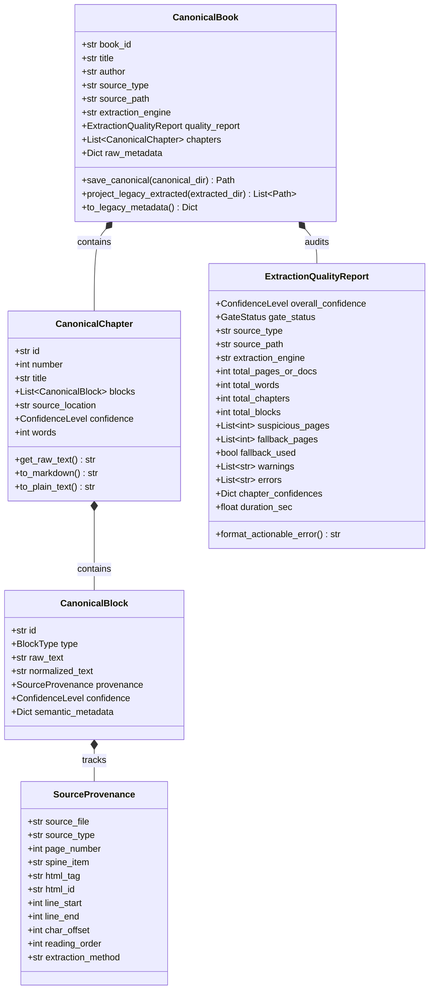
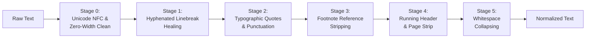
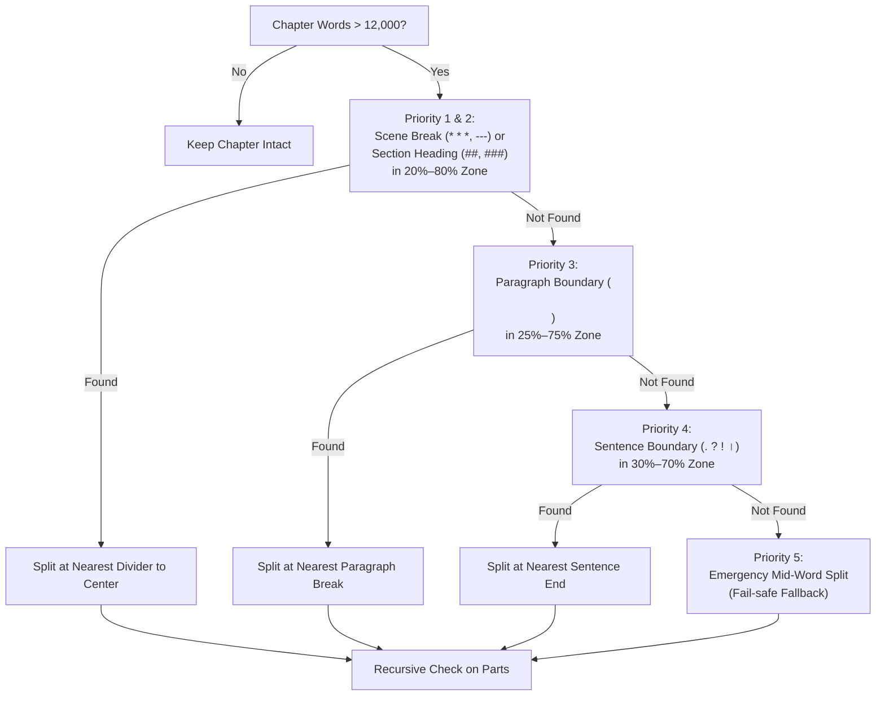

# 📜 Forensic Literary Document Ingestion & Canonical AST Engine (Pillar 1)

## Executive Summary

The **Forensic Literary Document Ingestion Engine** represents the foundational architectural upgrade (Pillar 1) of **Audiobook Maker v4.0**. In high-end cinematic audiobook and audio drama production, downstream stages—such as literary Hindustani translation, multi-cast screenplay attribution, neural speech synthesis (Google Gemini 3.1 Flash Cloud TTS), acoustic Foley placement, and EBU R128 mastering—are fundamentally constrained by the fidelity and structural integrity of the ingested source text.

Traditional audiobook extractors suffer from severe architectural flaws:
- **Destructive Flattening:** Arbitrary regex and naive string stripping erase scene dividers (`* * *`), section headings, typographic dialogue quotes, and structural hierarchy.
- **Lost Forensic Provenance:** Extracted paragraphs cannot be traced back to their exact origin (e.g. EPUB spine item, anchor, or PDF page number).
- **Silent Failures & Hallucination Cascades:** OCR noise, corrupted scanned pages, multi-column interleaving, and table-of-contents misfires pass silently into downstream LLM translation and TTS stages, burning scarce API quotas on corrupted text.
- **Uncontrolled Context Explosions:** Mammoth chapters ($> 12,000$ words) overflow LLM attention windows, causing truncated speech or context degradation.

The Pillar 1 engine resolves these challenges through a **Dual-Layer Architecture**:
1. **Sacred Canonical Layer (`canonical/book.json`):** Strongly typed Pydantic v2 AST capturing the immutable, sacred raw source text, clean normalized text, hierarchical chapter-block relationships, and granular block-level forensic provenance.
2. **Backward-Compatible Projection Layer (`extracted/chapter_XXX.md`):** Deterministic markdown projection guaranteeing 100% interoperability with downstream translation, screenplay parsing, and packaging stages.
3. **Independent Fail-Closed Ingestion Gate (Gate 0.1):** Rigorous heuristic audit evaluating document completeness, word counts, and page layout/OCR noise before downstream execution begins.

---

## 🏛️ Ingestion Pipeline Architecture

The following diagram illustrates the complete ingestion lifecycle from raw multi-format book containers to the audited canonical AST and downstream legacy markdown projections.

```mermaid
flowchart TD
    subgraph Input["📥 Input Stage"]
        Doc["Raw Book Document<br/>(.epub, .pdf, .txt, .md)"]
    end

    subgraph Archival["🔒 Source Preservation"]
        Doc --> IngestFacade["Universal Extractor Facade<br/>process_book_file()"]
        IngestFacade --> SHA["Compute SHA-256"]
        SHA --> RawDir["raw/ Archive<br/>• source_original.ext<br/>• source_manifest.json"]
    end

    subgraph Parsing["⚙️ Structural Parsers"]
        IngestFacade -->|EPUB| EPUBParser["ForensicEPUBParser<br/>• Single-pass OPF & Spine<br/>• Nav/NCX Anchor Slicing<br/>• Bracket Backtracking"]
        IngestFacade -->|PDF| PDFEngine["ForensicPDFEngine<br/>• pypdf Fast Local Extraction<br/>• PDFQualityAnalyzer (4 Signals)<br/>• Selective Vision Escalation"]
        IngestFacade -->|TXT / MD| TextParser["Text / Markdown Parser<br/>• clean_book_text()<br/>• Provenance Offsets"]
    end

    subgraph Normalization["🧹 Non-Destructive Normalizer"]
        EPUBParser --> Norm["normalizer.py<br/>• Unicode NFC Normalization<br/>• Zero-Width Stripping<br/>• Hyphenated Linebreak Healing<br/>• Footnote Removal"]
        PDFEngine --> Norm
        TextParser --> Norm
    end

    subgraph Segmentation["✂️ Chapter Segmentation & Meso Guard"]
        Norm --> Segmenter["chapter_segmenter.py<br/>• Multi-Tier Regex (EN / HI / Roman / Words)<br/>• is_valid_heading_candidate() Guard"]
        Segmenter --> MesoGuard["Meso-Tier Semantic Splitter<br/>• 12,000 Word Ceiling<br/>• Scene Break -> Heading -> Para -> Sentence"]
    end

    subgraph AST["📦 Canonical AST Assembly"]
        MesoGuard --> CanBook["CanonicalBook AST<br/>• SourceProvenance (Per Block)<br/>• CanonicalChapter[]<br/>• CanonicalBlock[]"]
    end

    subgraph GateAudit["🛡️ Gate 0.1: Extraction Quality Gate"]
        CanBook --> Gate["ExtractionQualityAuditor<br/>• Status: PASS / WARN / REVIEW<br/>• Fail-Closed Guard"]
        Gate -->|REVIEW (Default)| Error["ExtractionGateAuditError<br/>• Actionable Diagnostics<br/>• Affected Pages Ledger"]
        Gate -->|REVIEW + --force-gate| Override["Bypass Override Logged"]
        Gate -->|PASS / WARN| DiskPersist["Persistence Stage"]
        Override --> DiskPersist
    end

    subgraph Storage["💾 Project Storage Layout"]
        DiskPersist --> SaveCanonical["canonical/<br/>• book.json<br/>• quality_report.json"]
        DiskPersist --> ProjectLegacy["extracted/<br/>• chapter_001.md<br/>• chapter_002.md..."]
        DiskPersist --> SaveMeta["metadata.json<br/>(Legacy Project State)"]
    end
```

---

## 📂 Project Storage Hierarchy

When [`process_book_file`](file:///c:/Users/Suraj/Documents/Antigravity/Audiobook/audiobook_factory/extractor.py#L146-L401) processes an input file, it creates an isolated project workspace under `audiobooks/projects/<BOOK_SLUG>/` structured into three distinct layers:

```
audiobooks/projects/<BOOK_SLUG>/
├── raw/                                  # Sacred unmutated archive
│   ├── source_original.epub              # Bit-for-bit verbatim source copy
│   └── source_manifest.json              # Forensic metadata, file size, SHA-256 hash
├── canonical/                            # Pillar 1 Strongly-Typed AST
│   ├── book.json                         # Complete CanonicalBook Pydantic v2 JSON
│   └── quality_report.json               # ExtractionQualityReport machine audit
├── extracted/                            # Backward-compatible projection layer
│   ├── chapter_001.md                    # Standard markdown for Translation & Scripting
│   ├── chapter_002.md
│   └── chapter_003.md
└── metadata.json                         # Backward-compatible project metadata summary
```

### 1. Raw Source Manifest (`raw/source_manifest.json`)
Before any byte parsing or extraction occurs, the original file is hashed using SHA-256 and copied to `raw/source_original.<ext>`. The manifest locks the provenance:

```json
{
  "book_id": "the_last_wish",
  "original_path": "C:/Books/the_last_wish.epub",
  "source_format": "epub",
  "file_size_bytes": 1459203,
  "sha256": "4a7d1e8e50b86a87c18a9ef388f8d689b9d3b4b8a1c890f576e3efb6a78c0012",
  "archived_copy": "C:/.../audiobooks/projects/the_last_wish/raw/source_original.epub",
  "ingested_at": "2026-09-24T22:40:00Z"
}
```

---

## 🧬 Canonical AST Data Models

Defined in [`audiobook_factory/book_model.py`](file:///c:/Users/Suraj/Documents/Antigravity/Audiobook/audiobook_factory/book_model.py), the Canonical AST is built with **Pydantic v2** (`BaseModel`, `ConfigDict(extra="ignore")`) and establishes the single source of truth for the entire pipeline.



### Core Schema Specifications

| Class | Purpose | Key Attributes |
|---|---|---|
| [`CanonicalBook`](file:///c:/Users/Suraj/Documents/Antigravity/Audiobook/audiobook_factory/book_model.py#L182-L262) | Top-level representation of an entire literary volume | `book_id`, `title`, `author`, `source_type`, `chapters`, `quality_report`, `raw_metadata` |
| [`CanonicalChapter`](file:///c:/Users/Suraj/Documents/Antigravity/Audiobook/audiobook_factory/book_model.py#L80-L122) | Structured chapter container | `id`, `number`, `title`, `blocks`, `source_location`, `confidence`, `words` |
| [`CanonicalBlock`](file:///c:/Users/Suraj/Documents/Antigravity/Audiobook/audiobook_factory/book_model.py#L64-L79) | Atomic content unit (e.g. paragraph, heading, scene break) | `id`, `type`, `raw_text`, `normalized_text`, `provenance`, `confidence`, `semantic_metadata` |
| [`SourceProvenance`](file:///c:/Users/Suraj/Documents/Antigravity/Audiobook/audiobook_factory/book_model.py#L44-L63) | Forensic origin tracking (Where did this come from?) | `source_file`, `source_type`, `page_number`, `spine_item`, `html_tag`, `html_id`, `line_start`, `char_offset`, `reading_order` |
| [`ExtractionQualityReport`](file:///c:/Users/Suraj/Documents/Antigravity/Audiobook/audiobook_factory/book_model.py#L123-L180) | Machine-readable ingestion quality audit | `overall_confidence`, `gate_status`, `total_words`, `total_chapters`, `suspicious_pages`, `warnings`, `errors` |
| [`ExtractionGateAuditError`](file:///c:/Users/Suraj/Documents/Antigravity/Audiobook/audiobook_factory/book_model.py#L33-L43) | Exception raised when Gate 0.1 fails closed | Subclass of `ValueError`, encapsulates `ExtractionQualityReport` and actionable formatting |

### Enumerated Literal Types
- **`BlockType`**: `"paragraph" | "heading" | "dialogue" | "scene_break" | "quote" | "poetry" | "list" | "note" | "unknown"` (Conservative: defaults to `"paragraph"` or `"unknown"` unless structural evidence is unambiguous).
- **`ConfidenceLevel`**: `"HIGH" | "MEDIUM" | "LOW"`
- **`GateStatus`**: `"PASS" | "WARN" | "REVIEW"`

---

## 🧹 Non-Destructive Literary Normalizer

Implemented in [`audiobook_factory/normalizer.py`](file:///c:/Users/Suraj/Documents/Antigravity/Audiobook/audiobook_factory/normalizer.py), the normalizer sanitizes literary prose for speech synthesis without destroying source fidelity or muting literary typography.

### Normalization Pipeline Stages



1. **Stage 0: Unicode NFC Normalization & Zero-Width Hygiene:**
   - Applies canonical decomposition followed by canonical composition (`unicodedata.normalize("NFC", text)`).
   - Purges invisible zero-width characters that disrupt tokenizer encodings: `\u200b` (Zero-Width Space), `\u200c` (ZWNJ), `\u200d` (ZWJ), `\ufeff` (Byte Order Mark), `\u2060` (Word Joiner).
2. **Stage 1: Hyphenated Linebreak Healing:**
   - Detects words broken across line wraps (common in justified book typography) and welds them seamlessly while supporting both Latin and Devanagari Unicode scripts:
     ```python
     re.sub(r"(\b[a-zA-Z\u0900-\u097F]{2,})-\n+([a-zA-Z\u0900-\u097F]{2,}\b)", r"\1\2", text)
     ```
   - Heals `"impor-\ntant"` to `"important"`.
3. **Stage 2: Typographic Quote & Dash Normalization:**
   - Standardizes directional curly quotes (`\u2018`, `\u2019` $\rightarrow$ `'`, `\u201c`, `\u201d` $\rightarrow$ `"`).
   - Spaces em dashes (`\u2014` $\rightarrow$ ` — `) and en dashes (`\u2013` $\rightarrow$ ` – `) to give neural TTS models natural cadence pauses.
   - Converts ellipses (`\u2026` $\rightarrow$ `...`).
   - Supports `preserve_literary_quotes=True` when raw typographic quotes are desired.
4. **Stage 3: Footnote Reference Removal:**
   - Strips non-spoken citation brackets such as `[1]`, `[23]`, and `[104]` using `re.sub(r"\[\d{1,3}\]", "", text)`.
5. **Stage 4: Running Header & Page Number Stripping:**
   - Strips isolated lines matching `"Page X of Y"`, `"- 42 -"`, or bare page integers.
6. **Stage 5: Whitespace Collapsing:**
   - Collapses consecutive spaces and tabs (`[ \t]+` $\rightarrow$ `" "`).
   - Preserves double newline paragraph breaks while collapsing $\ge 3$ newlines to `\n\n`.

### Public APIs
- [`clean_book_text(text: str, preserve_literary_quotes: bool = False) -> str`](file:///c:/Users/Suraj/Documents/Antigravity/Audiobook/audiobook_factory/normalizer.py#L29-L71)
- [`normalize_block_text(raw_text: str, preserve_literary_quotes: bool = False) -> Tuple[str, List[str]]`](file:///c:/Users/Suraj/Documents/Antigravity/Audiobook/audiobook_factory/normalizer.py#L73-L94): Returns normalized text along with forensic warning diagnostics (e.g. presence of Unicode replacement `\ufffd`, excessive broken hyphens).

---

## 📖 Single-Pass Structural EPUB Parser

Implemented in [`audiobook_factory/epub_parser.py`](file:///c:/Users/Suraj/Documents/Antigravity/Audiobook/audiobook_factory/epub_parser.py), [`ForensicEPUBParser`](file:///c:/Users/Suraj/Documents/Antigravity/Audiobook/audiobook_factory/epub_parser.py#L184-L463) solves the duplicate unzipping, anchor desynchronization, and scene-break flattening flaws found in standard EPUB parsers.

### Key Capabilities

1. **Single-Pass OPF & Spine Traversal:**
   - Locates `META-INF/container.xml` to discover the OPF package rootfile.
   - Extracts metadata (`dc:title`, `dc:creator`, `dc:language`) and maps the manifest ID-to-href dictionary.
   - Follows the `<spine>` reading order (`<itemref idref="...">`) to read each document exactly once, caching offsets in a contiguous virtual memory map (`file_offsets`, `file_lengths`, `full_html`).
2. **Nav & NCX Landmark Anchor Slicing with Opening Bracket Backtracking:**
   - When table of contents entries target HTML anchors (e.g. `chapter1.xhtml#section_2`), naive string splitters cut inside HTML tags, leaving broken tags like `id="section_2">`.
   - The forensic parser scans backwards from the anchor match to locate the last unmatched opening angle bracket (`<`):
     ```python
     last_open = file_slice.rfind('<', 0, m.start())
     last_close = file_slice.rfind('>', 0, m.start())
     if last_open != -1 and last_open > last_close:
         pos = base_offset + last_open
     else:
         pos = base_offset + m.start()
     ```
   - This ensures clean DOM boundary slicing without dangling tag fragments.
3. **DOM-Aware Structural Parsing ([`EPUBStructuralHTMLParser`](file:///c:/Users/Suraj/Documents/Antigravity/Audiobook/audiobook_factory/epub_parser.py#L34-L182)):**
   - Subclasses `html.parser.HTMLParser` to parse XHTML fragments directly into ordered [`CanonicalBlock`](file:///c:/Users/Suraj/Documents/Antigravity/Audiobook/audiobook_factory/book_model.py#L64-L79) elements.
   - Automatically detects:
     - Heading levels (`h1` through `h6` $\rightarrow$ `type="heading"`, `metadata={"level": N}`).
     - Scene dividers (`<hr>` or paragraphs containing `* * *`, `---`, `___` $\rightarrow$ `type="scene_break"`).
     - Blockquotes (`<blockquote>` $\rightarrow$ `type="quote"`).
     - Standard paragraphs (`<p>` $\rightarrow$ `type="paragraph"`).
   - Attaches precise source provenance: `spine_item`, `html_tag`, `html_id` (anchor name), `line_start`, `char_offset`, and global `reading_order`.
4. **Sequential Fallback Recovery:**
   - If an EPUB lacks both NCX and Nav TOC structures, the parser automatically falls back to sequential spine traversal, inferring chapter boundaries from top-level headings or minimum word thresholds ($\ge 30$ words).

---

## 📄 Layout-Aware PDF Engine & Quality Analyzer

Implemented in [`audiobook_factory/pdf_engine.py`](file:///c:/Users/Suraj/Documents/Antigravity/Audiobook/audiobook_factory/pdf_engine.py), the PDF engine combines ultra-fast local digital extraction with intelligent heuristic quality analysis and selective multimodal escalation.

### The 4 Quality Audit Signals ([`PDFQualityAnalyzer`](file:///c:/Users/Suraj/Documents/Antigravity/Audiobook/audiobook_factory/pdf_engine.py#L44-L140))

Every extracted page is evaluated against four forensic layout and OCR defect signals:

| Signal | Detection Rule | Root Cause Flagged | Action Taken |
|---|---|---|---|
| **1. Low Text Density** | $0 < \text{word\_count} < 15$ and $\text{char\_count} < 80$ | Blank page, decorative illustration, or failed PDF font encoding | Flagged as `is_suspicious=True`, confidence lowered to `LOW` |
| **2. OCR Symbol Noise Ratio** | $\frac{\text{symbols}}{\text{char\_count}} > 0.08$ (excluding standard prose & punctuation) | Scanned image noise, garbage glyphs, or OCR misreads | Flagged as `is_suspicious=True`, triggers vision escalation |
| **3. Unicode Replacement Character** | `"\ufffd"` in page text | Corrupted character mapping or font decode failure | Flagged as `is_suspicious=True` |
| **4. Multi-Column / Broken Line Wrapping** | $\ge 50\%$ short lines ($< 30$ chars) and $> 4$ lines starting with lowercase | Two-column layout read across columns or fragmented hard linebreaks | Flagged as `is_suspicious=True` |

### Running Header & Footer Elimination
To prevent page headers (e.g. `"The Fellowship of the Ring"`) and footers from contaminating audiobook narration, [`audit_pages`](file:///c:/Users/Suraj/Documents/Antigravity/Audiobook/audiobook_factory/pdf_engine.py#L51-L140) tracks candidates across all pages. Any line matching across $\ge 3$ distinct pages is classified as a running header/footer and cleanly filtered out before block assembly.

### Selective Multimodal Vision Escalation ([`GeminiVisionPDFExtractor`](file:///c:/Users/Suraj/Documents/Antigravity/Audiobook/audiobook_factory/pdf_engine.py#L150-L220))
Instead of naively sending an entire 400-page book to a multimodal vision model (which exhausts quotas and costs thousands of tokens), the engine uses **surgical page escalation**:
1. Only pages flagged as `is_suspicious=True` are candidates for escalation.
2. If `pypdf` is available, the engine extracts *only that single page* into an in-memory buffer (`pypdf.PdfWriter()`).
3. The single page is transmitted to Google Gemini (`gemini-3.8-flash` multimodal document API).
4. Prompt: *"Extract all prose text from this book page in clean Markdown reading order. Strip running headers and footers. Do not summarize."*
5. If the vision result heals the defect and increases valid word density, the page is upgraded to `ConfidenceLevel="HIGH"`, and recorded in `quality_report.fallback_pages`.

---

## ✂️ Multi-Tier Chapter Segmentation & Meso-Tier Splitter

Implemented in [`audiobook_factory/chapter_segmenter.py`](file:///c:/Users/Suraj/Documents/Antigravity/Audiobook/audiobook_factory/chapter_segmenter.py), this component accurately segments continuous book text into dramatic chapters and enforces the **Meso-Tier 12,000-word ceiling**.

### 1. Multi-Tier Heading Recognition Patterns

```python
CHAPTER_PATTERNS = [
    # Tier 1: Markdown Headings (# The Boy Who Lived, ## The Council of Elrond)
    r"^#{1,2}\s+[A-Z0-9\u0900-\u097F][^\n]{1,80}$",
    # Tier 2: English Chapter / Book / Part / Act / Scene (Chapter 1, Book 2, Act III)
    r"^(?:\s*#+\s*)?(?:chapter|book|part|act|scene)\s+(?:\d+|[ivxlcdm]+|[a-z]+)\b.*$",
    # Tier 3: Story Landmarks (Prologue, Epilogue, Interlude, Introduction, Afterword)
    r"^(?:\s*#+\s*)?(?:prologue|epilogue|interlude|introduction|preface|afterword)\b.*$",
    # Tier 4: Devanagari / Hindi Markers (अध्याय, भाग, खंड, काण्ड, प्रस्तावना, उपसंहार)
    r"^(?:\s*#+\s*)?(?:अध्याय|भाग|खंड|काण्ड|प्रस्तावना|उपसंहार)\s*(?:\d+|[०-९]+|[a-z]+)?\b.*$",
    # Tier 5: Standalone Roman Numerals (IV., XIV, I - The Awakening)
    r"^(?:[IVXLCDM]{1,8}(?:\.|\s*[\-–—]\s*[A-Z][^\n]{2,60})?)$",
    # Tier 6: Standalone Word Numbers (ONE, TWENTY-TWO, THREE: The Journey)
    r"^(?:(?:ONE|TWO|THREE|...|TWENTY)(?:\s*[\:\-–—]\s*[A-Z][^\n]{2,60})?)$",
]
```

### 2. Conservative False-Positive Validation ([`is_valid_heading_candidate`](file:///c:/Users/Suraj/Documents/Antigravity/Audiobook/audiobook_factory/chapter_segmenter.py#L36-L61))
To prevent uppercase dialogue shouting (`"STOP!"`, `"NO!"`) or poetic lines from being falsely classified as chapter boundaries, every candidate match must pass strict boundary tests:
- **Length Constraint:** Between $1$ and $90$ characters.
- **Punctuation Immunity:** Must not start or end with quotation marks (`"`, `'`, `“`, `‘`), dashes (`—`, `-`), or clause punctuation (`,`, `;`).
- **Preceding Boundary:** Must be bounded by start of document or a double newline (`\n\n`).
- **Subsequent Content Floor:** Must be followed by at least $5$ words of body prose.

### 3. Meso-Tier 12,000-Word Semantic Splitter ([`split_large_chapter_on_semantic_boundary`](file:///c:/Users/Suraj/Documents/Antigravity/Audiobook/audiobook_factory/chapter_segmenter.py#L149-L241))
LLMs used in downstream translation and screenplay attribution degrade when processing prompt contexts exceeding 12,000 words. When a chapter exceeds this threshold, it is recursively partitioned into `"(Part 1)"` and `"(Part 2)"` using a **5-Tier Priority Hierarchy**:



---

## 🛡️ Ingestion Quality Gate (Gate 0.1 / Forensic Gate)

Implemented in [`audiobook_factory/quality_gate.py`](file:///c:/Users/Suraj/Documents/Antigravity/Audiobook/audiobook_factory/quality_gate.py), [`ExtractionQualityAuditor`](file:///c:/Users/Suraj/Documents/Antigravity/Audiobook/audiobook_factory/quality_gate.py#L21-L111) acts as an independent, fail-closed gate keeper evaluating the canonical book model before any downstream stages can run.

### Gate Audit Statuses
- **`PASS`**: All chapters exceed word count floors; zero empty chapters; page noise ratio $\le 0\%$; overall confidence `HIGH`.
- **`WARN`**: Minor anomalies detected (e.g. $1$ to $25\%$ of pages exhibit layout or OCR noise, healed via escalation); overall confidence `MEDIUM`. Pipeline proceeds with logged warnings.
- **`REVIEW`**: Critical quality defects detected; overall confidence `LOW`. **The pipeline fails closed and aborts immediately with [`ExtractionGateAuditError`](file:///c:/Users/Suraj/Documents/Antigravity/Audiobook/audiobook_factory/book_model.py#L33-L43)**.

### Critical Defect Triggers (Status: `REVIEW`)
1. **Zero Chapters Detected:** Document failed chapter regex and semantic chunking fallback.
2. **Dangerously Low Word Count:** Total extracted text $< 50$ words for EPUB or PDF documents.
3. **Empty or Stub Chapters:** Any chapter contains $< 5$ words.
4. **High Suspicious Page Ratio:** Suspicious pages exceed $25\%$ of total document pages ($\frac{\text{suspicious}}{\text{total}} > 0.25$).

### Actionable Diagnostic Failure Report
When Gate 0.1 fails closed, it produces an actionable terminal diagnostic detailing exactly what failed, which pages are affected, and the remediation path:

```
==============================================================================
  [FATAL] EXTRACTION QUALITY GATE AUDIT: REVIEW REQUIRED
==============================================================================
Source Document : books/corrupted_scan.pdf
Format / Engine : PDF via pdf_layout_selective
Extraction Stats: 0 chapters, 24 words, 2 blocks
Overall Status  : REVIEW (Confidence: LOW)

CRITICAL QUALITY DEFECTS DETECTED:
  • Zero chapters were detected in the source document.
  • Total extracted word count (24 words) is below the minimum threshold for literary documents.
  • Severe layout/OCR anomalies detected on 18/20 pages (90.0%).

Affected Suspicious Pages (18): [1, 2, 3, 4, 5, 6, 7, 8, 9, 10, 11, 12, 13, 14, 15, 16, 17, 18]

RECOMMENDED REMEDIATION:
  1. Verify the source file integrity (e.g. check for corrupt scanned pages, DRM, or multi-column layout).
  2. For scanned or complex layout PDFs, ensure GEMINI_API_KEY is configured to enable visual OCR escalation.
  3. If you have verified the extracted chapters manually and wish to proceed anyway,
     rerun with the '--force-gate' flag to bypass the Quality Gate fail-closed check.
==============================================================================
```

### The `--force-gate` Override
For edge cases where an operator has manually inspected the extracted markdown files and chooses to proceed despite gate warnings, the fail-closed behavior can be explicitly bypassed using the `--force-gate` CLI flag.

---

## 💻 CLI Usage Guide

### 1. Extracting a Book Document (`extract`)

Extracts an EPUB, PDF, TXT, or Markdown book into the canonical AST, archives raw sources, and projects legacy markdown chapters:

```bash
# Standard extraction with fail-closed gate enforcement
python audiobook_cli.py extract books/the_witcher.epub

# PDF extraction with automatic layout analysis
python audiobook_cli.py extract books/dracula.pdf

# Bypassing Quality Gate REVIEW failure (operator override)
python audiobook_cli.py extract books/scanned_book.pdf --force-gate
```

### 2. Autonomous End-to-End Pipeline (`auto`)

Runs all 6 production stages in a single command, incorporating Gate 0.1 before translation:

```bash
# Autonomous run with default fail-closed protection
python audiobook_cli.py auto books/the_witcher.epub \
  --hindi \
  --dramatized \
  --voice Charon \
  --cover covers/witcher.jpg

# Autonomous run with Quality Gate override
python audiobook_cli.py auto books/unorthodox_layout.epub \
  --hindi \
  --dramatized \
  --voice Aoede \
  --force-gate
```

---

## 🔬 Python API Reference & Quickstart

Programmatic integration via the unified extractor facade:

```python
from pathlib import Path
from audiobook_factory.extractor import process_book_file
from audiobook_factory.book_model import CanonicalBook, ExtractionGateAuditError

projects_base = Path("audiobooks/projects")
input_file = Path("books/dune.epub")

try:
    # Ingest document, enforce Gate 0.1, archive raw, and project markdown
    metadata = process_book_file(
        input_file=input_file,
        output_base_dir=projects_base,
        force_gate=False,
    )
    print(f"Ingested {metadata['title']} ({metadata['total_chapters']} chapters)")

except ExtractionGateAuditError as e:
    print(f"Extraction halted by Quality Gate:\n{e}")
    # Inspect the machine-readable report
    report = e.report
    print(f"Suspicious pages: {report.suspicious_pages}")
```

### Direct Canonical AST Deserialization

```python
import json
from pathlib import Path
from audiobook_factory.book_model import CanonicalBook

book_json_path = Path("audiobooks/projects/dune/canonical/book.json")
with open(book_json_path, "r", encoding="utf-8") as f:
    book_ast = CanonicalBook.model_validate_json(f.read())

print(f"Book: {book_ast.title} by {book_ast.author}")
for chapter in book_ast.chapters:
    print(f"  Chapter {chapter.number}: {chapter.title} ({chapter.words} words, {len(chapter.blocks)} blocks)")
    for block in chapter.blocks[:3]:
        print(f"    [{block.type}] (Origin: {block.provenance.spine_item or block.provenance.page_number}) -> {block.normalized_text[:50]}...")
```

---

## 📊 Summary of Architectural Upgrades

| Feature | Legacy Pipeline (v3.x) | Forensic Ingestion Engine (Pillar 1 Upgrade) |
|---|---|---|
| **Data Representation** | Ephemeral, flat string chunks | Strongly typed Pydantic v2 AST ([`CanonicalBook`](file:///c:/Users/Suraj/Documents/Antigravity/Audiobook/audiobook_factory/book_model.py#L182-L262)) |
| **Source Provenance** | None (lost upon extraction) | Granular block-level tracking ([`SourceProvenance`](file:///c:/Users/Suraj/Documents/Antigravity/Audiobook/audiobook_factory/book_model.py#L44-L63): page, spine, tag, anchor, offset) |
| **Source Preservation** | None (ephemeral) | Sacred `raw/` archive with SHA-256 verification manifest |
| **EPUB Parsing** | Double zip read, naive regex split | Single-pass OPF/spine, Nav/NCX anchor slicing with bracket backtracking |
| **PDF Extraction** | Full vision API or naive text dump | Fast `pypdf`, 4-signal heuristic audit, running header filter, selective vision escalation |
| **Oversized Chapters** | Context overflow or abrupt truncation | Meso-tier 12k word ceiling with 5-tier priority semantic splitting |
| **Quality Verification** | None (corrupted text passed downstream) | Independent fail-closed **Gate 0.1** ([`ExtractionQualityAuditor`](file:///c:/Users/Suraj/Documents/Antigravity/Audiobook/audiobook_factory/quality_gate.py#L21-L111)) |
| **Error Feedback** | Cryptic crashes during TTS | Actionable terminal reports with affected pages and remediation steps |
| **Downstream Compatibility** | `extracted/chapter_XXX.md` | 100% backward-compatible projection via `project_legacy_extracted()` |
