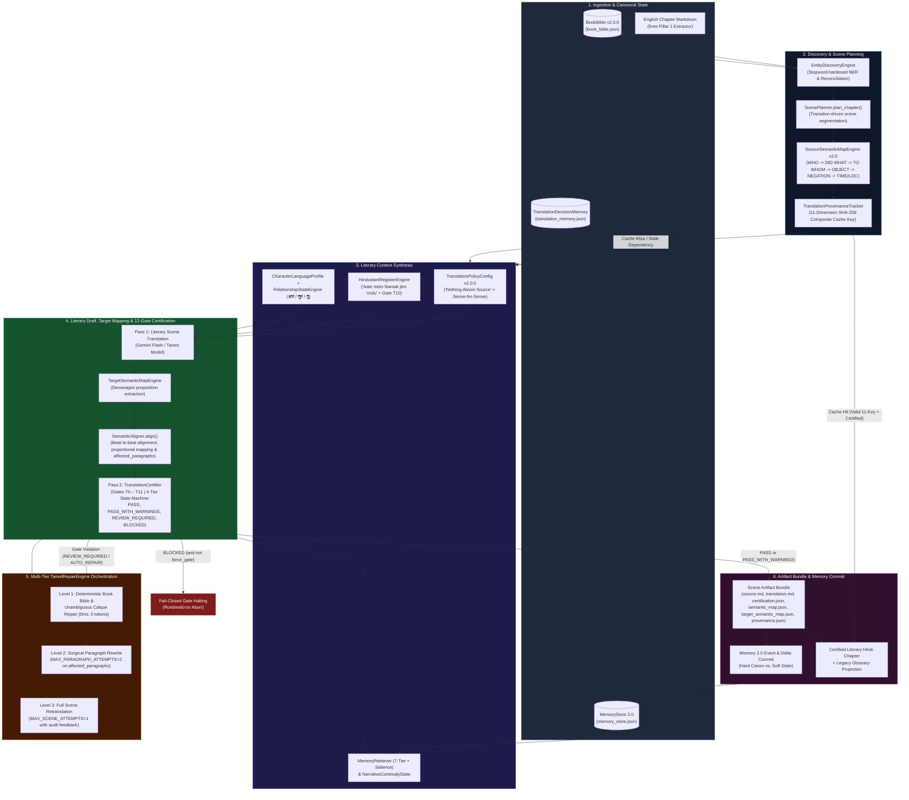
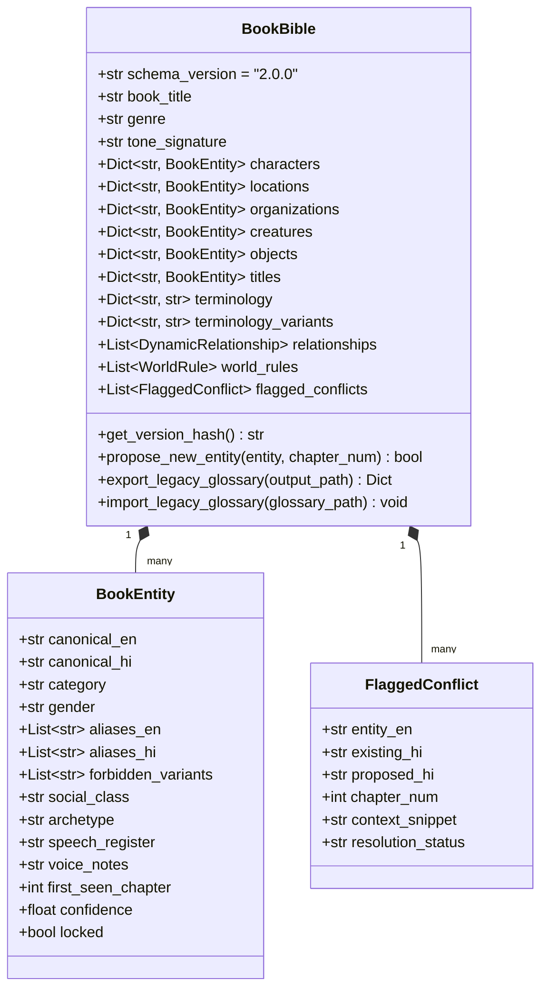
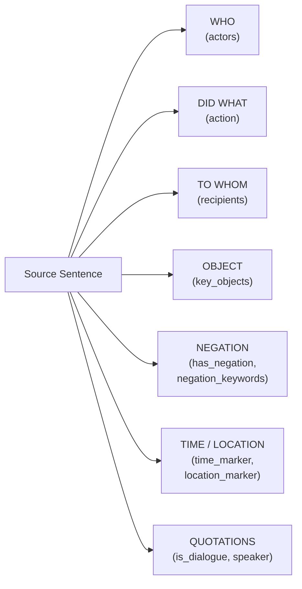
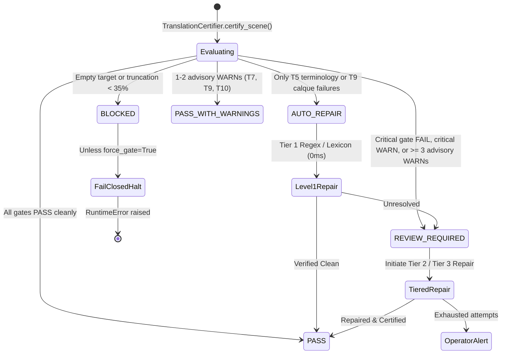
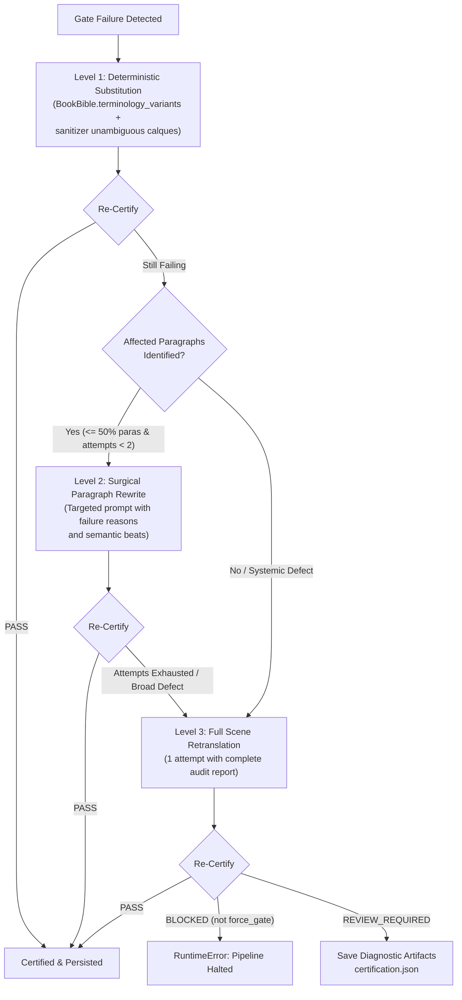
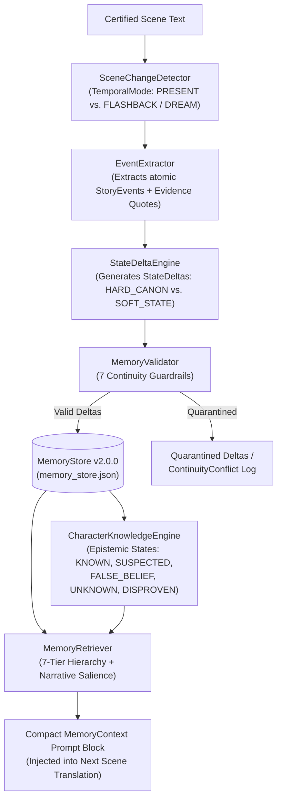

# Literary Translation Intelligence Engine (Pillar 2 Architecture — Translation Hardening v2.0)

The **Literary Translation Intelligence Engine** ([`audiobook_factory/translation/`](file:///c:/Users/Suraj/Documents/Antigravity/Audiobook/audiobook_factory/translation/)) is the multi-pass, context-aware literary translation, semantic alignment, and deterministic certification engine of **The Autonomous Graphic-Audio Studio**.

Upgraded in **Translation Hardening v2.0**, it replaces single-pass, chunk-based LLM translation and brittle heuristic regex quotas with an **autonomous 32-module cognitive translation architecture** spanning:
1. **Persistent Canonical Book Bible & Entity Discovery** ([`book_bible.py`](file:///c:/Users/Suraj/Documents/Antigravity/Audiobook/audiobook_factory/translation/book_bible.py), [`entity_discovery.py`](file:///c:/Users/Suraj/Documents/Antigravity/Audiobook/audiobook_factory/translation/entity_discovery.py))
2. **Contextual Hindustani Register & Universal Character Voice Profiles** ([`translation_policy.py`](file:///c:/Users/Suraj/Documents/Antigravity/Audiobook/audiobook_factory/translation/translation_policy.py), [`hindustani_register.py`](file:///c:/Users/Suraj/Documents/Antigravity/Audiobook/audiobook_factory/translation/hindustani_register.py), [`character_profile.py`](file:///c:/Users/Suraj/Documents/Antigravity/Audiobook/audiobook_factory/translation/character_profile.py), [`relationship_state.py`](file:///c:/Users/Suraj/Documents/Antigravity/Audiobook/audiobook_factory/translation/relationship_state.py), [`intensity_model.py`](file:///c:/Users/Suraj/Documents/Antigravity/Audiobook/audiobook_factory/translation/intensity_model.py))
3. **Transition-Driven Scene Segmentation, Dual Semantic Maps & Semantic Alignment** ([`scene_planner.py`](file:///c:/Users/Suraj/Documents/Antigravity/Audiobook/audiobook_factory/translation/scene_planner.py), [`narrative_state.py`](file:///c:/Users/Suraj/Documents/Antigravity/Audiobook/audiobook_factory/translation/narrative_state.py), [`source_semantic_map.py`](file:///c:/Users/Suraj/Documents/Antigravity/Audiobook/audiobook_factory/translation/source_semantic_map.py))
4. **12-Gate Independent Certification, 4-Tier State Machine & Multi-Tier Repair** ([`certification.py`](file:///c:/Users/Suraj/Documents/Antigravity/Audiobook/audiobook_factory/translation/certification.py), [`terminology_auditor.py`](file:///c:/Users/Suraj/Documents/Antigravity/Audiobook/audiobook_factory/translation/terminology_auditor.py), [`semantic_fidelity.py`](file:///c:/Users/Suraj/Documents/Antigravity/Audiobook/audiobook_factory/translation/semantic_fidelity.py), [`omission_detector.py`](file:///c:/Users/Suraj/Documents/Antigravity/Audiobook/audiobook_factory/translation/omission_detector.py), [`addition_detector.py`](file:///c:/Users/Suraj/Documents/Antigravity/Audiobook/audiobook_factory/translation/addition_detector.py), [`character_voice_auditor.py`](file:///c:/Users/Suraj/Documents/Antigravity/Audiobook/audiobook_factory/translation/character_voice_auditor.py), [`naturalness_auditor.py`](file:///c:/Users/Suraj/Documents/Antigravity/Audiobook/audiobook_factory/translation/naturalness_auditor.py), [`repair_engine.py`](file:///c:/Users/Suraj/Documents/Antigravity/Audiobook/audiobook_factory/translation/repair_engine.py), [`provenance.py`](file:///c:/Users/Suraj/Documents/Antigravity/Audiobook/audiobook_factory/translation/provenance.py), [`translation_memory.py`](file:///c:/Users/Suraj/Documents/Antigravity/Audiobook/audiobook_factory/translation/translation_memory.py))
5. **Non-Destructive Sanitizer Separation & Literary Advisory Lexicon** ([`sanitizer.py`](file:///c:/Users/Suraj/Documents/Antigravity/Audiobook/audiobook_factory/sanitizer.py), [`advisory_lexicon.py`](file:///c:/Users/Suraj/Documents/Antigravity/Audiobook/audiobook_factory/translation/advisory_lexicon.py))
6. **World & Character Memory 2.0 (Event-Driven Epistemic Continuity)** ([`audiobook_factory/translation/memory/`](file:///c:/Users/Suraj/Documents/Antigravity/Audiobook/audiobook_factory/translation/memory/))

---

## 1. Architectural Motivation: Why Single-Pass Translation Fails

Traditional LLM book translators treat chapters as flat strings of text split at arbitrary character boundaries (e.g., 4,000 characters) with a 500-character tail buffer and a monolithic prompt. Across long-form fiction, this causes seven recurring failure modes:

| Legacy Failure Mode | Root Cause | Translation Hardening v2.0 Architectural Solution |
| :--- | :--- | :--- |
| **Mechanical "Translatese" (मशीनी अनुवाद)** | Calqued English syntax (*"A golden girl sat at a table" $\rightarrow$ "एक सुनहरी लड़की मेज़ पर बैठी थी"*) and modern clinical English loanwords (*डिप्रेशन, ट्रॉमा, स्ट्रेस*). | **Sense-for-Sense Literary Restructuring** ([`translation_policy.py`](file:///c:/Users/Suraj/Documents/Antigravity/Audiobook/audiobook_factory/translation/translation_policy.py)) + **Non-Destructive Sanitizer Separation** ([`sanitizer.py`](file:///c:/Users/Suraj/Documents/Antigravity/Audiobook/audiobook_factory/sanitizer.py)) preserving authentic rustic greetings while repairing unambiguous calques in Tier 1. |
| **Artificial Urdu Quota Stuffing** | Enforcing a rigid numeric quota (e.g., "exact 10% Urdu words") forces unnatural vocabulary into every paragraph regardless of tone. | **"Aate mein Namak jitni Urdu" Contextual Register Engine** ([`hindustani_register.py`](file:///c:/Users/Suraj/Documents/Antigravity/Audiobook/audiobook_factory/translation/hindustani_register.py)) — scales naturally across atmosphere, somatics, combat, and courtly registers with Gate `T10` density auditing ($0.2\% - 8.0\%$). |
| **Voice Flattening & Honorific Drift** | Every character speaks in identical textbook Hindi; intimate partners suddenly address each other as `आप` or subordinates use `तू` with kings. | **Universal Character Language Profiles** ([`character_profile.py`](file:///c:/Users/Suraj/Documents/Antigravity/Audiobook/audiobook_factory/translation/character_profile.py)) + **7D Dynamic Relationship State Engine** ([`relationship_state.py`](file:///c:/Users/Suraj/Documents/Antigravity/Audiobook/audiobook_factory/translation/relationship_state.py)) resolving `आप` / `तुम` / `तू`. |
| **Negation Flips & Omissions** | Single-pass generation silently drops short dialogue beats or flips negations (*"neither of them smiled"* $\rightarrow$ *"दोनों मुस्कुराए"*). | **SourceSemanticMap v2.0 Proposition Ledger & TargetSemanticMap Alignment** ([`source_semantic_map.py`](file:///c:/Users/Suraj/Documents/Antigravity/Audiobook/audiobook_factory/translation/source_semantic_map.py)) + **Lexical Negation Parity** (including *नहीं, मत, ना, न, बिना, बग़ैर, कभी नहीं, कुछ नहीं, कोई नहीं, इनकार, रोका, मना, नाकाम*) & **Deterministic Quote Parity** (Gates `T2` & `T3`). |
| **Moral Bowdlerization / Inflation** | Safety-aligned LLMs sanitize dark fantasy grit or gratuitously inflate intimacy/profanity beyond the source text. | **7D Literary Intensity Model** ([`intensity_model.py`](file:///c:/Users/Suraj/Documents/Antigravity/Audiobook/audiobook_factory/translation/intensity_model.py), Gate `T8`) enforcing **"Nothing Above Source"** with calibrated variance ($\pm 0.75$ soft `WARN`, $> 2.0$ hard `FAIL`). |
| **Mid-Scene Chunk Severing** | Splitting chapters at fixed token counts cuts dialogue exchanges in half, losing speaker attribution and emotional subtext. | **Transition-Driven Scene Planner** ([`scene_planner.py`](file:///c:/Users/Suraj/Documents/Antigravity/Audiobook/audiobook_factory/translation/scene_planner.py)) segmenting only at genuine temporal, spatial, or typographic transitions. |
| **Amnesia & Flashback Contamination** | A 500-char tail buffer forgets injuries, dead characters, or secret knowledge from earlier chapters—or treats a flashback as present-tense canon. | **World & Character Memory 2.0** ([`audiobook_factory/translation/memory/`](file:///c:/Users/Suraj/Documents/Antigravity/Audiobook/audiobook_factory/translation/memory/)) with temporal mode isolation (`PRESENT` vs. `FLASHBACK`), epistemic tracking, and 7 continuity guardrails. |

---

## 2. End-to-End Pillar 2 Pipeline Topology

When [`IntelligentTranslationPipeline.translate_chapter()`](file:///c:/Users/Suraj/Documents/Antigravity/Audiobook/audiobook_factory/translation/orchestrator.py#L131-L586) executes, every chapter flows through an 8-stage deterministic and multi-pass cognitive pipeline:



---

## 3. Module Inventory (`audiobook_factory/translation/`)

The Pillar 2 engine is organized into 22 core translation modules and 10 Memory 2.0 modules:

| Module | Primary Classes / Functions | Architectural Role |
| :--- | :--- | :--- |
| [`book_bible.py`](file:///c:/Users/Suraj/Documents/Antigravity/Audiobook/audiobook_factory/translation/book_bible.py) | `BookBible`, `BookEntity`, `DynamicRelationship`, `WorldRule`, `FlaggedConflict` | Persistent canonical repository (`book_bible.json`) with SHA-256 versioning and one-way legacy glossary projection. |
| [`entity_discovery.py`](file:///c:/Users/Suraj/Documents/Antigravity/Audiobook/audiobook_factory/translation/entity_discovery.py) | `EntityDiscoveryEngine` | Stopword-hardened entity discovery (`confidence >= 0.80` auto-commit, conflict flagging). |
| [`translation_policy.py`](file:///c:/Users/Suraj/Documents/Antigravity/Audiobook/audiobook_factory/translation/translation_policy.py) | `TranslationPolicyConfig`, `DEFAULT_LITERARY_HINDI_POLICY` | Central declarative contract enforcing immutable plot facts, sense-for-sense flow, and zero meta-chatter. |
| [`hindustani_register.py`](file:///c:/Users/Suraj/Documents/Antigravity/Audiobook/audiobook_factory/translation/hindustani_register.py) | `HindustaniRegisterEngine`, `HindustaniRegisterSpec`, `HindustaniAuditResult` | Contextual Urdu seasoning engine (*"Aate mein Namak jitni Urdu"*) with genre-adaptive factories and Gate `T10` saturation auditing ($0.2\% - 8.0\%$). |
| [`character_profile.py`](file:///c:/Users/Suraj/Documents/Antigravity/Audiobook/audiobook_factory/translation/character_profile.py) | `CharacterLanguageProfile`, `UNIVERSAL_ARCHETYPE_PRESETS`, `synthesize_character_profile` | Novel-agnostic sociolect, speech tempo, diction, and archetype engine for distinct character voices. |
| [`relationship_state.py`](file:///c:/Users/Suraj/Documents/Antigravity/Audiobook/audiobook_factory/translation/relationship_state.py) | `DynamicRelationshipState`, `RelationshipStateEngine` | 7-dimensional interpersonal matrix dynamically resolving Hindi pronouns (`आप`, `तुम`, `तू`) and event mutations. |
| [`intensity_model.py`](file:///c:/Users/Suraj/Documents/Antigravity/Audiobook/audiobook_factory/translation/intensity_model.py) | `LiteraryIntensityVector`, `IntensityEvaluator`, `IntensityEvaluationResult` | 7-dimensional tone and maturity quantifier enforcing the **"Nothing Above Source"** threshold with calibrated variance ($\pm 0.75$ soft `WARN`, $> 2.0$ hard `FAIL`). |
| [`scene_planner.py`](file:///c:/Users/Suraj/Documents/Antigravity/Audiobook/audiobook_factory/translation/scene_planner.py) | `ScenePlanner`, `ChapterPlan`, `ScenePlan` | Narrative transition detector segmenting chapters into organic dramatic scenes with per-scene intensity vectors. |
| [`narrative_state.py`](file:///c:/Users/Suraj/Documents/Antigravity/Audiobook/audiobook_factory/translation/narrative_state.py) | `NarrativeContinuityState`, `NarrativeStateEngine` | Structured cross-scene state tracker replacing the legacy 500-char tail buffer. |
| [`source_semantic_map.py`](file:///c:/Users/Suraj/Documents/Antigravity/Audiobook/audiobook_factory/translation/source_semantic_map.py) | `SourceSemanticMap`, `TargetSemanticMap`, `SemanticAligner`, `SemanticProposition`, `TargetSemanticProposition`, `ParagraphAlignment`, `SemanticAlignmentResult` | Extracts frozen propositions (WHO $\rightarrow$ DID WHAT $\rightarrow$ TO WHOM $\rightarrow$ OBJECT $\rightarrow$ NEGATION $\rightarrow$ TIME/LOC) with guaranteed actions; conducts beat-to-beat semantic alignment, proportional paragraph mapping, expanded lexical negation parity, and paragraph-indexed auditing (`affected_paragraphs: List[int]`). |
| [`certification.py`](file:///c:/Users/Suraj/Documents/Antigravity/Audiobook/audiobook_factory/translation/certification.py) | `TranslationCertifier`, `GateAuditResult`, `GateResult`, `GateStatus` | Orchestrates independent verification Gates `T0` through `T11` using the **4-Tier Certification State Machine** (`PASS`, `PASS_WITH_WARNINGS`, `REVIEW_REQUIRED`, `BLOCKED`, and deterministic `AUTO_REPAIR`) and enforces fail-closed gate halting. |
| [`terminology_auditor.py`](file:///c:/Users/Suraj/Documents/Antigravity/Audiobook/audiobook_factory/translation/terminology_auditor.py) | `audit_terminology` | **Gates T1 & T5**: Deterministic regex enforcement of `BookBible` canonical terms, forbidden variants, and Latin script leaks. |
| [`semantic_fidelity.py`](file:///c:/Users/Suraj/Documents/Antigravity/Audiobook/audiobook_factory/translation/semantic_fidelity.py) | `deterministic_negation_audit`, `evaluate_semantic_fidelity` | **Gate T2**: Deterministic negation-flip pre-validator + LLM proposition-level meaning fidelity verifier. |
| [`omission_detector.py`](file:///c:/Users/Suraj/Documents/Antigravity/Audiobook/audiobook_factory/translation/omission_detector.py) | `deterministic_omission_check`, `evaluate_omissions` | **Gate T3**: Dialogue quote parity checker + missing beat and paragraph drop detector. |
| [`addition_detector.py`](file:///c:/Users/Suraj/Documents/Antigravity/Audiobook/audiobook_factory/translation/addition_detector.py) | `evaluate_additions` | **Gate T4**: Detects hallucinated actions, invented metaphors, or unsupported narrative embellishments. |
| [`character_voice_auditor.py`](file:///c:/Users/Suraj/Documents/Antigravity/Audiobook/audiobook_factory/translation/character_voice_auditor.py) | `evaluate_character_voices` | **Gates T6 & T7**: Audits dialogue sociolect consistency and pronoun honorific alignment (`आप`/`तुम`/`तू`). |
| [`naturalness_auditor.py`](file:///c:/Users/Suraj/Documents/Antigravity/Audiobook/audiobook_factory/translation/naturalness_auditor.py) | `evaluate_literary_naturalness` | **Gates T9 & T10**: Combines `sanitizer.audit_literary_register` (anachronism blocker) with an LLM translatese critic. |
| [`repair_engine.py`](file:///c:/Users/Suraj/Documents/Antigravity/Audiobook/audiobook_factory/translation/repair_engine.py) | `TieredRepairEngine`, `RepairAction` | Multi-tier self-healing loop: Level 1 (0ms Regex & calque normalization) $\rightarrow$ Level 2 (Surgical Paragraph LLM rewrite, `MAX_PARAGRAPH_ATTEMPTS=2`) $\rightarrow$ Level 3 (Scene Retranslation, `MAX_SCENE_ATTEMPTS=1`). |
| [`provenance.py`](file:///c:/Users/Suraj/Documents/Antigravity/Audiobook/audiobook_factory/translation/provenance.py) | `TranslationProvenanceTracker`, `TranslationProvenance` | **Gate T11**: Computes 24-char SHA-256 `composite_cache_key` across **11 dependencies** to seal certified artifacts and invalidate stale caches automatically. |
| [`sanitizer.py`](file:///c:/Users/Suraj/Documents/Antigravity/Audiobook/audiobook_factory/sanitizer.py) | `audit_literary_register`, `validate_and_sanitize_translation`, `sanitize_screenplay_segment` | **Non-Destructive Sanitizer Separation**: Preserves authentic rustic vocabulary (`नमस्ते`, `राम-राम`, `दारू`, `सोने की लड़की`), while unambiguous calques (`सुनहरी लड़की`, `कुंवारी चोटी`, `डिप्रेशन`) are repaired in Tier 1. |
| [`translation_memory.py`](file:///c:/Users/Suraj/Documents/Antigravity/Audiobook/audiobook_factory/translation/translation_memory.py) | `TranslationDecisionMemory`, `TermDecision` | Persistent cross-chapter ledger (`translation_memory.json`) locking recurring idioms, phrases, and structural choices. |
| [`llm_utils.py`](file:///c:/Users/Suraj/Documents/Antigravity/Audiobook/audiobook_factory/translation/llm_utils.py) | `call_auditor_llm` | Lightweight JSON-schema-enforced LLM caller used by independent evaluation gates (`temperature=0.1`). |
| [`orchestrator.py`](file:///c:/Users/Suraj/Documents/Antigravity/Audiobook/audiobook_factory/translation/orchestrator.py) | `IntelligentTranslationPipeline` | Autonomous top-level orchestrator uniting planning, Memory 2.0 retrieval, drafting, TargetSemanticMap alignment, 12-gate certification, repair, fail-closed blocking, and persistence. Default engine for `translate_book_project`. |

---

## 4. Persistent Canonical Book Bible & Entity Discovery

### 4.1 `BookBible` Schema (`v2.0.0`)
Stored at `<project_dir>/book_bible.json`, `BookBible` (`audiobook_factory/translation/book_bible.py`) is the single source of truth for world lore, replacing ad-hoc flat dictionaries while maintaining backward compatibility via `export_legacy_glossary()`.



Key architectural invariants of `BookBible`:
- **Deterministic Version Hashing**: `get_version_hash()` serializes canonical fields (`characters`, `locations`, `organizations`, `creatures`, `objects`, `titles`, `terminology`, `terminology_variants`) into canonical JSON and returns a 16-character SHA-256 digest. Any change to a character's spelling or forbidden variant changes this hash, which automatically invalidates affected scene caches in `TranslationProvenanceTracker`.
- **Novel-Agnostic Variant Enforcement**: `terminology_variants` maps regex patterns of forbidden Devanagari spellings to their canonical replacement (e.g., `{"वैरिएंट_नाम": "कैनोनिकल_नाम"}`), completely decoupling `sanitizer.py` and `terminology_auditor.py` from hardcoded novel rules.
- **Auto-Commit vs. Conflict Flagging**: `propose_new_entity()` automatically commits newly discovered entities when `confidence >= 0.80`. If an existing unlocked entity receives a conflicting `canonical_hi` spelling, it appends a `FlaggedConflict` record without overwriting locked canon.

### 4.2 Stopword-Hardened `EntityDiscoveryEngine`
`EntityDiscoveryEngine` (`audiobook_factory/translation/entity_discovery.py`) scans English source text prior to translation to identify recurring capitalized proper nouns:
- **Stopword Defense (`ENGLISH_NON_ENTITY_STOPWORDS`)**: Filters out 130+ common sentence-starter pronouns, conjunctions, adverbs, and interjections (*However, Suddenly, Outside, Silence, Chapter, Meanwhile*) so ordinary English words are never polluted into `book_bible.json`.
- **Positional Confidence Scoring**: Proper nouns appearing mid-sentence or as multi-word phrases receive `confidence = 0.85` (eligible for auto-commit when coupled with a Devanagari transliteration), whereas ambiguous sentence-initial single words receive `confidence = 0.50` and are held back from auto-commit.

---

## 5. Literary Register, Character Voice & Dynamic Relationships

### 5.1 Central Translation Policy (`TranslationPolicyConfig`)
Defined in `audiobook_factory/translation/translation_policy.py`, `TranslationPolicyConfig` (`v2.0.0`) codifies five non-negotiable literary mandates injected into every translation prompt:
1. **Immutable Source Truth**: Plot facts, physical actions, dialogue attribution, negations, and causal sequences are strictly immutable.
2. **"Nothing Above Source" Principle**: Preserve the exact darkness, grit, intimacy, and profanity of the original prose—never bowdlerize or sanitize, and never gratuitously exaggerate beyond the source text.
3. **Sense-for-Sense Literary Flow (भावानुवाद)**: Restructure English syntax into natural, rhythmic Hindi prose (`दरवाज़े के पीछे से एक परछाईं उभरी` instead of `एक परछाईं दरवाज़े के पीछे से बाहर आई`).
4. **Contextual Hindustani Seasoning**: Use evocative Urdu/Hindustani vocabulary only where scene atmosphere, emotion, or courtly dialogue calls for it.
5. **Zero Chatter**: Emit pure literary Hindi markdown with zero conversational filler or translator notes.

### 5.2 Contextual Hindustani Register Engine (*"Aate mein Namak jitni Urdu"*)
`HindustaniRegisterEngine` (`audiobook_factory/translation/hindustani_register.py`) replaces the legacy rigid 10% Urdu quota with organic, scene-driven seasoning across four lexical domains:
- **Atmosphere & Mystery (`atmosphere_words`)**: *ख़ामोशी, साया, मंज़र, सन्नाटा, धुंध, वीरान, आहट, दहलीज़, अंधेरा, फ़िज़ा*
- **Passion, Grief & Somatics (`passion_and_somatics`)**: *धड़कन, साँसें, रूह, कशिश, बेचैनी, सिहरन, जज़्बात, दर्द, सुकून, तड़प, नज़ाकत*
- **Combat, Danger & Grit (`combat_and_grit`)**: *ख़ून, ज़ख़्म, वार, लहू, ख़ंजर, साज़िश, क़त्ल, इंतक़ाम, ख़ौफ़, शिकस्त, रफ़्तार*
- **Courtly, Legal & Scholastic (`scholastic_and_courtly`)**: *सल्तनत, हुक्म, तख़्त, दरबार, इजाज़त, गुस्ताख़ी, फ़ैसला, सियासत, अदब, मुकद्दर*

`HindustaniRegisterEngine.from_genre(genre)` adapts the register automatically for **Fantasy / Dark Fantasy**, **Sci-Fi / Cyberpunk**, **Historical / Period Drama**, and **Thriller / Crime Noir**. Its `audit_text()` method computes `seasoning_density` per 100 words, flagging a soft warning only if Urdu markers exceed `8.0%` (over-seasoned poetic melodrama) or drop below `0.2%` on scenes longer than 300 words (overly textbook Sanskritized prose).

### 5.3 Universal Character Language Profiles
`character_profile.py` defines 8 novel-agnostic archetype presets (`UNIVERSAL_ARCHETYPE_PRESETS`) that shape how each character speaks:

| Archetype Key | Sociolect & Register | Tempo & Sentence Length | Signature Hindi Discourse Markers |
| :--- | :--- | :--- | :--- |
| `COLD_CYNIC` | `terse_gritty` | `clipped` / `short` | *हूँ, खैर, छोड़ो, बकवास* |
| `THEATRICAL_WIT` | `poetic_courtly` | `melodic` / `elaborate` | *ओहो!, भला सोचिए, उफ़, क्या बात है* |
| `AUTHORITATIVE_MATRIARCH` | `aristocratic_commanding` | `measured` / `medium` | *सुनो, ध्यान रहे, बिल्कुल नहीं* |
| `RAZOR_ARISTOCRAT` | `aristocratic_commanding` | `measured` / `elaborate` | *दरअसल, ज़ाहिर है, खैर, बेशक* |
| `MILITARY_COMMANDER` | `military_clipped` | `clipped` / `short` | *सावधान, सुनो, तुरंत, बस* |
| `SCHOLAR_INTELLECTUAL` | `scholastic_formal` | `measured` / `elaborate` | *अर्थात, वस्तुतः, ज़रा सोचिए, प्रमाण* |
| `RUSTIC_STREET_SURVIVOR` | `colloquial_rustic` | `hurried` / `short` | *अरे, भई, चल हट, क्या रे* |
| `NEUTRAL` | `standard_literary` | `measured` / `medium` | Context-driven natural flow |

### 5.4 Dynamic 7D Relationship State Engine (`आप` / `तुम` / `तू` Resolution)
`RelationshipStateEngine` (`audiobook_factory/translation/relationship_state.py`) tracks directed interpersonal vectors `(speaker, listener)` across 7 dimensions (`respect`, `familiarity`, `hostility`, `intimacy`, `authority_differential`, `fear`, `trust` on $[-5.0, +5.0]$ or $[0.0, 5.0]$).

Its deterministic `resolve_pronoun_level(state)` algorithm prevents honorific hallucination:
1. **Intimate Override (`तू` or `तुम`)**: If `intimacy >= 4.0` and `familiarity >= 3.5` (e.g., deep lovers in private), resolves to `तू` (if `respect < 2.0`) or intimate `तुम`.
2. **Hostile / Contempt Override (`तू`)**: If `hostility >= 3.5` and `respect <= -2.0` (and `fear < 3.0`), resolves to confrontational `तू`.
3. **High Authority / Reverence / Fear (`आप`)**: If `authority_differential <= -2.0` (speaking to a superior/ruler), `respect >= 2.5`, or `fear >= 3.5`, resolves to formal `आप`.
4. **Superior to Subordinate (`तुम` / `तू`)**: If `authority_differential >= 2.5`, resolves to `तू` (when `respect < 0`) or `तुम`.
5. **Familiar Peers (`तुम`) vs. Strangers (`आप`)**: Peers with `familiarity >= 2.0` use `तुम`; strangers default to `आप`.

---

---

## 6. 7D Literary Intensity Model, Scene Planning & Semantic Maps

### 6.1 7D Literary Intensity Model & Calibrated Variance (`intensity_model.py`)
To prevent moral sanitization or gratuitous tone inflation, every scene is quantified on a $0.0 - 5.0$ scale across seven dimensions using [`LiteraryIntensityVector`](file:///c:/Users/Suraj/Documents/Antigravity/Audiobook/audiobook_factory/translation/intensity_model.py#L17-L25):
$$\mathbf{I} = \bigl[\text{profanity},\ \text{sexual\_intimacy},\ \text{violence},\ \text{emotional\_intensity},\ \text{formality},\ \text{urdu\_register},\ \text{colloquiality}\bigr]$$

In the mature narrative framework, these dimensions map directly to literary dynamics:
- `violence`: Weapon strikes, gore, physical trauma, lethal combat
- `sexual_intimacy` (eroticism): Passion, skin contact, somatic friction, bedroom dialogue
- `profanity`: Earthy Hindustani curses, dark tavern vitriol
- `emotional_intensity` (tension / emotional distress): Dramatic stakes, panic, shouting, crying, grief
- `formality`: Courtly, aristocratic, or bureaucratic distance
- `urdu_register`: Lexical Urdu seasoning density (*Aate mein Namak*)
- `colloquiality`: Earthy folk idioms, rustic tavern slang, informal speech

#### The "Nothing Above Source" Principle & Calibrated Variance (Gate `T8`)
During certification, [`IntensityEvaluator.compare_vectors(source, target)`](file:///c:/Users/Suraj/Documents/Antigravity/Audiobook/audiobook_factory/translation/intensity_model.py#L44-L125) computes the directional delta $\Delta_d = I_{\text{target}, d} - I_{\text{source}, d}$ for each core dimension:
- **Clean Alignment (`PASS`, $|\Delta_d| \le 0.75$)**: The translation preserves source grit, passion, and tension within natural linguistic tolerance.
- **Soft Calibration Notice (`WARN`, `0.75 < |\Delta_d| \le 2.0`, `is_valid=True`)**: Logged as a non-blocking diagnostic. Cross-lingual keyword density between English and Devanagari naturally fluctuates; treating this band as a soft warning avoids brittle false rejections.
- **Hard Rejection (`FAIL`, $|\Delta_d| > 2.0$, `is_valid=False`)**: Triggered only upon extreme distortion:
  - *Critical Sanitization ($\Delta_d < -2.0$)*: Bowdlerizing blood, intimacy, or dark themes.
  - *Unjustified Amplification ($\Delta_d > +2.0$)*: Gratuitously inserting explicit violence or erotica absent from the source.

---

### 6.2 Transition-Driven Scene Planning (`scene_planner.py`)
Traditional chunking splits text at arbitrary character limits, severing dialogue beats. [`ScenePlanner.plan_chapter()`](file:///c:/Users/Suraj/Documents/Antigravity/Audiobook/audiobook_factory/translation/scene_planner.py) inspects paragraph boundaries for:
1. **Explicit Typographic Breaks**: Markdown dividers (`***`, `---`, `* * *`).
2. **Temporal Shifts**: Temporal transition adverbs (`TIME_TRANSITION_PATTERNS` like *"The next morning"*, *"Hours later"*, *"At dawn"*).
3. **Spatial Transitions**: Locative shifts (`LOCATION_TRANSITION_PATTERNS` like *"Inside the castle"*, *"Meanwhile, in the courtyard"*).
Short chapters ($\le 3$ paragraphs and $< 800$ words) remain as a single organic scene.

---

### 6.3 SourceSemanticMap v2.0: Proposition Slot Extraction (`source_semantic_map.py`)
Before translation begins, [`build_source_semantic_map()`](file:///c:/Users/Suraj/Documents/Antigravity/Audiobook/audiobook_factory/translation/source_semantic_map.py#L442-L560) constructs a frozen per-scene ledger of atomic propositions ([`SemanticProposition`](file:///c:/Users/Suraj/Documents/Antigravity/Audiobook/audiobook_factory/translation/source_semantic_map.py#L77-L92)) saved to `semantic_map.json`:



#### Proposition Slot Schema (`SemanticProposition`)
- **WHO (`actors: List[str]`)**: Extracted from proper nouns registered in `BookBible`, generic character roles (*poet, hunter, priestess, elder*), or subject pronouns (*he, she, they*).
- **DID WHAT (`action: str`)**: Extracted from speech attribution verbs (*said, whispered, muttered, roared*) or verb phrase patterns. **Guaranteed Non-Empty Invariant**: If no finite verb is matched, extraction falls back to the first non-stop verb-like token or defaults cleanly to `"stated"`, guaranteeing `action` is never empty.
- **TO WHOM (`recipients: List[str]`)**: Extracted via prepositional phrases (*to / at / with / for / from <Entity/Role/Pronoun>*).
- **OBJECT (`key_objects: List[str]`)**: Concrete direct objects following determiners/possessives, filtered by stop-words.
- **NEGATION (`has_negation: bool`, `negation_keywords: List[str]`)**: Scans against `NEGATION_TOKENS` (*not, never, neither, nor, refused, failed, stopped, without, denied, barely*).
- **TIME / LOCATION (`time_marker: str`, `location_marker: str`)**: Extracted from temporal markers (*yesterday, suddenly, at night*) and locative prepositional phrases (*in the castle, at the tavern*).
- **Quotation Tracking Across Sentences**: Maintains `in_quote` state across multi-sentence dialogue paragraphs, ensuring lines inside split dialogue spans correctly inherit `is_dialogue=True` and attribution.

---

### 6.4 TargetSemanticMap & SemanticAligner (`source_semantic_map.py`)

#### TargetSemanticProposition & TargetSemanticMap
Following scene drafting, [`build_target_semantic_map()`](file:///c:/Users/Suraj/Documents/Antigravity/Audiobook/audiobook_factory/translation/source_semantic_map.py#L562-L639) extracts a Devanagari proposition ledger (`target_semantic_map.json`) across mirror slots:
`actors_hi`, `action_hi`, `recipients_hi`, `has_negation`, `negation_keywords_hi`, `key_objects_hi`, `is_dialogue`, `speaker_hi`, `time_marker_hi`, `location_marker_hi`.

#### Beat-to-Beat Semantic Alignment (`SemanticAligner`)
[`SemanticAligner.align(source_map, target_map)`](file:///c:/Users/Suraj/Documents/Antigravity/Audiobook/audiobook_factory/translation/source_semantic_map.py#L644-L721) compares source and target maps to verify structural narrative fidelity:

1. **Proportional Paragraph Mapping Under Count Divergence**:
   When Hindi prose fuses or expands paragraphs ($total\_src \ne total\_tgt$), the aligner dynamically maps source paragraph index $p$ to target paragraph index $t$:
   $$t = \min\left(\operatorname{round}\left(p \times \frac{total\_tgt}{total\_src}\right),\ total\_tgt - 1\right)$$
   This prevents alignment collapse when natural Hindi cadence adjusts paragraph boundaries.

2. **Expanded Lexical Negation Parity**:
   Audits that any source beat with negation is reflected in the target. Checks `HINDI_NEGATION_TOKENS`:
   $$\{\text{नहीं},\ \text{मत},\ \text{ना},\ \text{न},\ \text{बिना},\ \text{बग़ैर},\ \text{कभी नहीं},\ \text{कुछ नहीं},\ \text{कोई नहीं},\ \text{इनकार},\ \text{रोका},\ \text{मना},\ \text{नाकाम}\}$$
   If a source paragraph contains negations ($s_{negs} > 0$) but the target contains zero ($t_{negs} = 0$), `negation_parity` is flagged as `False`.

3. **Actor Retention & Dialogue Parity**:
   Verifies that named characters present in source beats appear in the target paragraph (cross-referenced against `BookBible` names). Asserts that dialogue quotes in source are matched in the target.

4. **Paragraph-Indexed Auditing (`affected_paragraphs: List[int]`)**:
   Every paragraph generating a `WARN` or `FAIL` status logs its index in `affected_paragraphs`. This enables the **Level 2 Surgical Repair Engine** to target only failing paragraphs without regenerating the entire scene.

---

## 7. Multi-Gate Independent Certification (Gates `T0` – `T11`)

After drafting, [`TranslationCertifier.certify_scene()`](file:///c:/Users/Suraj/Documents/Antigravity/Audiobook/audiobook_factory/translation/certification.py#L88-L375) runs **12 independent verification gates**:

```mermaid
flowchart LR
    DRAFT["Drafted Hindi Scene"] --> T0["Gate T0<br/>Source & Word Sanity"]
    T0 --> T1_5["Gates T1 & T5<br/>Terminology & Entity Audit"]
    T1_5 --> T2["Gate T2<br/>Semantic Fidelity & Negation"]
    T2 --> T3["Gate T3<br/>Omission & Quote Parity"]
    T3 --> T4["Gate T4<br/>Addition / Hallucination"]
    T4 --> T6_7["Gates T6 & T7<br/>Voice & Pronoun Continuity"]
    T6_7 --> T8["Gate T8<br/>7D Calibrated Intensity"]
    T8 --> T9_10["Gates T9 & T10<br/>Literary Naturalness & Register"]
    T9_10 --> T11["Gate T11<br/>Provenance & Cache Seal"]
    T11 --> SM["4-Tier Certification<br/>State Machine"]
    SM --> CERT["SceneCertificationReport<br/>(certification.json)"]
```



### The 12 Verification Gates
| Gate ID | Gate Name | Evaluator Module | Deterministic Check | LLM Auditor Check | Severity Policy |
| :--- | :--- | :--- | :--- | :--- | :--- |
| **Gate T0** | **Source & Length Integrity** | [`certification.py`](file:///c:/Users/Suraj/Documents/Antigravity/Audiobook/audiobook_factory/translation/certification.py) | Verifies target $\ge 5$ words and target word count $\ge 35\%$ of source word count. | — | Hard `FAIL` / `BLOCKED` on severe truncation or empty target |
| **Gate T1** | **Terminology Compliance** | [`terminology_auditor.py`](file:///c:/Users/Suraj/Documents/Antigravity/Audiobook/audiobook_factory/translation/terminology_auditor.py) | Scans against `BookBible.terminology_variants` and entity `forbidden_variants`. | — | Hard `FAIL` if forbidden variant found (eligible for Level 1 auto-repair) |
| **Gate T2** | **Semantic Fidelity & Action Integrity** | [`semantic_fidelity.py`](file:///c:/Users/Suraj/Documents/Antigravity/Audiobook/audiobook_factory/translation/semantic_fidelity.py) | `SemanticAligner.align()`: Verifies negation parity across expanded Hindi tokens and actor retention. | Compares source propositions against Hindi paragraphs for polarity flips, action swaps, or causal inversions. | Hard `FAIL` on meaning distortion; `WARN` on minor phrasing variance |
| **Gate T3** | **Omission & Quote Parity** | [`omission_detector.py`](file:///c:/Users/Suraj/Documents/Antigravity/Audiobook/audiobook_factory/translation/omission_detector.py) | Dialogue quote parity ($\ge 60\%$ quote preservation when source has $\ge 4$ quotes) and paragraph coverage. | Audits whether any narrative beat or dialogue exchange was silently dropped. | Hard `FAIL` on missing story beats; records `affected_paragraphs` |
| **Gate T4** | **Addition & Hallucination Detector** | [`addition_detector.py`](file:///c:/Users/Suraj/Documents/Antigravity/Audiobook/audiobook_factory/translation/addition_detector.py) | — | Audits whether translator invented actions, characters, or lore absent from source. | Hard `FAIL` on fabricated plot facts |
| **Gate T5** | **Entity & Script Purity** | [`terminology_auditor.py`](file:///c:/Users/Suraj/Documents/Antigravity/Audiobook/audiobook_factory/translation/terminology_auditor.py) | Detects untransliterated Latin proper nouns ($\ge 4$ chars) leaked into Devanagari prose. | — | Hard `FAIL` on leaked English names |
| **Gate T6** | **Relationship, Pronoun & Memory Continuity** | [`certification.py`](file:///c:/Users/Suraj/Documents/Antigravity/Audiobook/audiobook_factory/translation/certification.py) | Cross-references dialogue pronouns (`आप`, `तुम`, `तू`) against `MemoryContext` performance guidance. | Audits honorific drift and epistemic boundary preservation. | `WARN` / `FAIL` on unmotivated honorific drift |
| **Gate T7** | **Character Voice Profile Alignment** | [`character_voice_auditor.py`](file:///c:/Users/Suraj/Documents/Antigravity/Audiobook/audiobook_factory/translation/character_voice_auditor.py) | — | Verifies dialogue matches each speaker's [`CharacterLanguageProfile`](file:///c:/Users/Suraj/Documents/Antigravity/Audiobook/audiobook_factory/translation/character_profile.py) archetype. | Advisory `WARN` / `FAIL` on severe voice break |
| **Gate T8** | **7D Intensity Preservation** | [`intensity_model.py`](file:///c:/Users/Suraj/Documents/Antigravity/Audiobook/audiobook_factory/translation/intensity_model.py) | [`IntensityEvaluator.compare_vectors()`](file:///c:/Users/Suraj/Documents/Antigravity/Audiobook/audiobook_factory/translation/intensity_model.py#L44-L125) computes 7D directional delta. | — | Soft `WARN` at $\pm 0.75$; Hard `FAIL` at $> 2.0$ |
| **Gate T9** | **Literary Naturalness & Anachronism Guard** | [`naturalness_auditor.py`](file:///c:/Users/Suraj/Documents/Antigravity/Audiobook/audiobook_factory/translation/naturalness_auditor.py) | Calls `sanitizer.audit_literary_register()` for clinical calques (`डिप्रेशन`, `ट्रॉमा`, `सुनहरी लड़की`). | Evaluates cadence, fluidity, and freedom from mechanical "translatese" (score $\ge 3.5$). | Hard `FAIL` if score $< 3.5$ or clinical loanwords found |
| **Gate T10** | **Hindustani Register Balance** | [`hindustani_register.py`](file:///c:/Users/Suraj/Documents/Antigravity/Audiobook/audiobook_factory/translation/hindustani_register.py) | [`HindustaniRegisterEngine.audit_text()`](file:///c:/Users/Suraj/Documents/Antigravity/Audiobook/audiobook_factory/translation/hindustani_register.py#L112-L135) measures Urdu seasoning per 100 words. | — | Advisory `WARN` if density $> 8.0\%$ or $< 0.2\%$ on scenes $> 300$ words |
| **Gate T11** | **Provenance & Cache Seal** | [`provenance.py`](file:///c:/Users/Suraj/Documents/Antigravity/Audiobook/audiobook_factory/translation/provenance.py) | Seals 11-dimension SHA-256 `composite_cache_key` into `provenance.json`. | — | Always `PASS` on seal |

---

### The 4-Tier Certification State Machine
Certification resolves into one of four deterministic states:



1. **`PASS` (`certified=True`)**:
   All mandatory and advisory gates pass cleanly. The scene is certified, written to cache, and forwarded to downstream screenplay synthesis.

2. **`PASS_WITH_WARNINGS` (`certified=True`)**:
   Zero gate failures and at most 1–2 advisory warnings (from advisory gates `T7_character_voice`, `T9_naturalness`, or `T10_register_balance`). Certified to proceed without triggering expensive LLM repair loops.

3. **`REVIEW_REQUIRED` (`certified=False`)**:
   Triggered by:
   - Any critical gate failure (`T0_source_integrity`, `T2_semantic_fidelity`, `T3_omission`, `T4_addition`, `T5_terminology`, `T6_relationship_memory`, `T8_intensity`).
   - Any warning on a critical gate (e.g. semantic ambiguity or intensity drift $> 0.75$).
   - 3 or more advisory warnings.
   Automatically dispatches the **Multi-Tier TieredRepairEngine**. If attempts are exhausted without passing, logs actionable diagnostic artifacts in `certification.json`.

4. **`BLOCKED` (`certified=False`)**:
   Triggered by fatal structural failure: completely empty translation or severe truncation ($target < 35\%$ of source).
   - **Fail-Closed Gate Halting**: [`orchestrator.py`](file:///c:/Users/Suraj/Documents/Antigravity/Audiobook/audiobook_factory/translation/orchestrator.py#L508-L511) immediately halts pipeline execution with `RuntimeError(f"Scene {scene.scene_id} certification BLOCKED: {audit_result.summary}")` unless `--force-gate` is explicitly passed by the operator.

5. **`AUTO_REPAIR` (`certified=True`)**:
   A transient state when failures are strictly confined to deterministic terminology (`T5`) or registered calques (`T9`), immediately remediable via Tier 1 without LLM re-prompting.

---

## 8. Tiered Self-Healing Repair Engine, Sanitizer & Provenance

### 8.1 Multi-Tier `TieredRepairEngine` Orchestration (`repair_engine.py`)
When certification detects a defect, [`TieredRepairEngine`](file:///c:/Users/Suraj/Documents/Antigravity/Audiobook/audiobook_factory/translation/repair_engine.py) orchestrates an escalating 3-level repair hierarchy:



#### Level 1: Deterministic Book Bible & Calque Repair (0ms Latency, Zero LLM Tokens)
- Applies regex substitutions from `BookBible.terminology_variants`.
- Executes [`sanitizer.audit_literary_register(apply_substitutions=True)`](file:///c:/Users/Suraj/Documents/Antigravity/Audiobook/audiobook_factory/sanitizer.py#L264-L300) to normalize unambiguous calques.
- Instantly resolves `T5` forbidden variants and `T9` mechanical literalisms at zero financial or compute cost.

#### Level 2: Surgical Paragraph LLM Rewrite (`MAX_PARAGRAPH_ATTEMPTS = 2`)
- If failing gates identify specific `affected_paragraphs` (via `SemanticAligner` or gate audits) affecting $\le 50\%$ of the scene's paragraphs, the engine isolates only the failing paragraphs.
- Maps each target paragraph index back to the corresponding source paragraph proportionally.
- Dispatches [`repair_paragraph()`](file:///c:/Users/Suraj/Documents/Antigravity/Audiobook/audiobook_factory/translation/repair_engine.py#L181-L207) with [`build_paragraph_repair_prompt()`](file:///c:/Users/Suraj/Documents/Antigravity/Audiobook/audiobook_factory/translation/repair_engine.py#L146-L179), providing:
  - Exact English source paragraph
  - Current flawed Hindi paragraph
  - Explicit defect descriptions (e.g. *"Source has 1 negation but target has 0"*)
  - Mandatory semantic beats to preserve
- Reassembles the scene, re-runs Level 1 cleanup, rebuilds `TargetSemanticMap`, and re-evaluates certification.

#### Level 3: Full Scene Retranslation (`MAX_SCENE_ATTEMPTS = 1`)
- If Level 2 attempts are exhausted or defects are systemic (omissions spanning multiple paragraphs, structural register drift), the engine escalates to full scene retranslation.
- Dispatches [`build_scene_repair_prompt()`](file:///c:/Users/Suraj/Documents/Antigravity/Audiobook/audiobook_factory/translation/repair_engine.py#L209-L240), injecting the comprehensive list of defect reasons into the system prompt.
- Re-certifies the candidate scene. If the candidate achieves certification or improves paragraph coverage, it replaces the flawed draft.

---

### 8.2 Non-Destructive Sanitizer Separation (`sanitizer.py`)
A critical architectural upgrade in Translation Hardening v2.0 is the clean separation in [`audiobook_factory/sanitizer.py`](file:///c:/Users/Suraj/Documents/Antigravity/Audiobook/audiobook_factory/sanitizer.py) between **Unambiguous Calques** and **Contextual Register Expressions**:

#### 1. Unambiguous Calque Repairs (`UNAMBIGUOUS_CALQUE_REPAIRS`)
Robotic literalisms and modern clinical loanwords that never belong in literary Hindi are deterministically normalized during Tier 1 repair:
- `सुनहरी लड़की` $\rightarrow$ `गोरी-चिट्टी लड़की` *(avoids mechanical "metallic golden" skin)*
- `कुंवारी चोटी` $\rightarrow$ `कमसिन लड़की की चोटी` *(avoids awkward calqued idiom)*
- `डिप्रेशन` $\rightarrow$ `उदासी का साया` *(avoids modern clinical psychiatry loanword)*
- `ट्रॉमा` $\rightarrow$ `गहरा सदमा` *(avoids clinical medical term)*
- `स्ट्रेस` $\rightarrow$ `तनाव` *(avoids clinical jargon)*

#### 2. Contextual Register Advisories (`CONTEXTUAL_REGISTER_ADVISORIES`)
Authentic folk greetings, colloquial peasant terms, and evocative poetic descriptors must **never** be blindly overwritten:
- `नमस्ते` — Contextual greeting; preserved for character voice and respectful dialogues.
- `राम-राम` — Contextual rustic greeting; preserved for tavern, peasant, and elder sociolects.
- `नमस्कार` — Contextual formal greeting; preserved for scholastic and courtly scenes.
- `दारू` — Contextual rustic beverage; preserved for peasant, tavern, and bandit dialogue (never replaced with generic *मदिरा*).
- `सोने की लड़की` — Poetic descriptor; preserved when used metaphorically in folk narration.

#### Non-Destructive Invariant
In default diagnostic mode (`apply_substitutions=False`), `audit_literary_register()` merely reports findings without modifying text. When `apply_substitutions=True` is explicitly requested by Tier 1 repair, **only unambiguous calques are substituted**; contextual advisories are preserved unconditionally.

---

### 8.3 11-Dimension Provenance Cache Sealing (`provenance.py`)
To guarantee that stale translations never survive architecture, policy, or glossary updates, [`TranslationProvenanceTracker`](file:///c:/Users/Suraj/Documents/Antigravity/Audiobook/audiobook_factory/translation/provenance.py#L48-L150) seals every certified scene with an **11-dimension SHA-256 composite cache key**:

$$\text{Payload} = \begin{aligned}
&\text{source\_hash} : \text{bible\_version\_hash} : \text{policy\_version} : \text{prompt\_version} : \\
&\text{translator\_version} : \text{evaluator\_version} : \text{semantic\_map\_version} : \text{semantic\_map\_hash} : \\
&\text{repair\_version} : \text{model} : \text{advisory\_version}
\end{aligned}$$

$$\text{CacheKey} = \text{SHA256}(\text{Payload})_{[0:24]}$$

A cached scene is loaded (`is_cache_valid()`) **if and only if**:
1. `translation.md` and `provenance.json` exist on disk.
2. `provenance.composite_cache_key == current_computed_key`.
3. `provenance.certified == True`.
4. `provenance.certification_status` is in `("PASS", "PASS_WITH_WARNINGS", "AUTO_REPAIR")`.

#### Scene Artifact Bundle Directory
Every scene persists an inspectable forensic bundle at `<project_dir>/translation/scenes/ch_XXX/scene_XXX/`:
- `source.md` — Exact segmented English scene text
- `translation.md` — Certified literary Hindi scene text
- `scene_plan.json` — Transition metadata, active characters, and 7D source intensity vector
- `semantic_map.json` — Frozen `SourceSemanticMap` (propositions, actors, actions, negation markers)
- `target_semantic_map.json` — Extracted `TargetSemanticMap` propositions
- `certification.json` — Complete `GateAuditResult` report across Gates `T0`–`T11`
- `provenance.json` — Cryptographic 11-dimension `TranslationProvenance` record

---

### 8.4 Default Pipeline Integration (`translate_book_project`)
In [`audiobook_factory/translator.py`](file:///c:/Users/Suraj/Documents/Antigravity/Audiobook/audiobook_factory/translator.py#L592-L685), batch chapter translation executes via:

```python
def translate_book_project(
    project_dir: Path,
    model: str = DEFAULT_MODEL,
    use_intelligent_pipeline: bool = True,
    force_gate: bool = False,
) -> Path:
```

- **Default Execution**: `use_intelligent_pipeline=True` defaults directly to [`IntelligentTranslationPipeline`](file:///c:/Users/Suraj/Documents/Antigravity/Audiobook/audiobook_factory/translation/orchestrator.py), automatically invoking Entity Discovery, Scene Planning, Dual Semantic Maps, 12-Gate Certification, Tiered Repair, and Provenance Sealing.
- **Fail-Safe Orchestration**: Integrated directly into Stage 2 of [`PipelineOrchestrator.run_autonomous_pipeline`](file:///c:/Users/Suraj/Documents/Antigravity/Audiobook/audiobook_factory/orchestrator.py#L128-L145), protecting all downstream screenplay and audio synthesis from uncertified translations.

---

---

## 9. World & Character Memory 2.0 (`audiobook_factory/translation/memory/`)

To prevent cross-chapter continuity hallucinations, flashback contamination, and epistemic leaks (characters knowing secrets they never witnessed), Pillar 2 includes **World & Character Memory 2.0**, a 10-module event-driven cognitive memory subsystem:



### 9.1 The Package Architecture (`audiobook_factory/translation/memory/`)
*(See complete specification: [`docs/WORLD_AND_CHARACTER_MEMORY_2_0.md`](file:///c:/Users/Suraj/Documents/Antigravity/Audiobook/docs/WORLD_AND_CHARACTER_MEMORY_2_0.md))*

The production engine is structured across 9 cohesive, strongly-typed modules in `audiobook_factory/translation/memory/`:

1. **[`state.py`](file:///c:/Users/Suraj/Documents/Antigravity/Audiobook/audiobook_factory/translation/memory/state.py)**: Pure deterministic state transition engine executing validated mutations via `apply_character_delta()`, `apply_relationship_delta()`, `apply_knowledge_delta()`, `apply_world_or_narrative_delta()`, and `record_events_on_timeline()`.
2. **[`events.py`](file:///c:/Users/Suraj/Documents/Antigravity/Audiobook/audiobook_factory/translation/memory/events.py)**: Defines `StoryEvent` with deterministic SHA-256 identifiers and `salience_score`, `StoryEventType` (15+ types), `TemporalMode` (`PRESENT`, `FLASHBACK`, `MEMORY_DREAM`, `HISTORICAL_NARRATION`, `NON_LINEAR`), `SceneChangeDetector` (fast 0ms pre-filter with noun/verb trigger matching, intra-scene travel, and transitive attacker vs. victim resolution), and `EventExtractor` (gated LLM proposal with deterministic fallback and LLM-vs-deterministic deduplication).
3. **[`character_memory.py`](file:///c:/Users/Suraj/Documents/Antigravity/Audiobook/audiobook_factory/translation/memory/character_memory.py)**: Defines `CharacterState`, `CharacterArcMemory`, and `CharacterKnowledgeEngine` managing epistemic states (`KNOWN`, `SUSPECTED`, `FALSE_BELIEF`, `UNKNOWN`, `DISPROVEN`). Enforces strict `known_by` membership, scoped `DISPROVEN` transitions, asymmetric secret prioritization, and `MUST_NOT_KNOW` prompt boundaries.
4. **[`world_memory.py`](file:///c:/Users/Suraj/Documents/Antigravity/Audiobook/audiobook_factory/translation/memory/world_memory.py)**: Models dynamic, evolving world state across `LocationState`, `ObjectState`, `OrganizationState`, `NarrativeThreadState`, `TimelinePoint` (dual narrative/chronological timeline), and `WorldState`.
5. **[`memory_delta.py`](file:///c:/Users/Suraj/Documents/Antigravity/Audiobook/audiobook_factory/translation/memory/memory_delta.py)**: Defines `StateDelta`, `DeltaDomain`, `StateMutability` (`HARD_CANON` vs `SOFT_STATE`), and `StateDeltaEngine` projecting StoryEvents into typed deltas while strictly preserving damaged/destroyed location conditions across movement events.
6. **[`memory_validator.py`](file:///c:/Users/Suraj/Documents/Antigravity/Audiobook/audiobook_factory/translation/memory/memory_validator.py)**: Enforces **7 Contradiction Guardrails** before deltas can commit: `canon_contradiction`, `timeline_contradiction`, `dead_character_violation`, `physical_impossibility`, `relationship_jump`, `knowledge_violation`, and `world_rule_violation`. Emits a structured `MemoryValidationReport`.
7. **[`memory_store.py`](file:///c:/Users/Suraj/Documents/Antigravity/Audiobook/audiobook_factory/translation/memory/memory_store.py)**: Versioned store (`memory_store.json`) with deterministic SHA-256 commit hashes, `BookBible` synchronization, and **Ghost Event Isolation** (quarantining rejected contradictory events in `store.rejected_events` to prevent ghost event pollution in active timelines or salience queries).
8. **[`memory_retriever.py`](file:///c:/Users/Suraj/Documents/Antigravity/Audiobook/audiobook_factory/translation/memory/memory_retriever.py)**: Assembles a scene-scoped memory slice using a **7-Tier Priority Hierarchy** combined with a **Narrative Salience (Dramatic Memory)** layer retrieving past turning points, oaths, and betrayals across long novels.
9. **[`memory_context.py`](file:///c:/Users/Suraj/Documents/Antigravity/Audiobook/audiobook_factory/translation/memory/memory_context.py)**: Packages the prompt context under a strict **$\le 800$ token budget ceiling** (`enforce_token_budget()`) and provides conservative performance guidance (`apply_performance_guidance_to_segment()`) respecting explicit director acting directives while enriching neutral lines with `memory_vocal_constraint`, `recommended_pronoun`, and `recommended_register`.

### 9.2 Epistemic Isolation (`MUST_NOT_KNOW`) & Bounded Relationship Priors
- **Epistemic Boundaries**: Readers frequently know secrets that characters on page do not. `CharacterKnowledgeEngine` builds an explicit per-character matrix preventing omniscient leakage by generating hard prompt instructions:
  ```text
  EPISTEMIC ISOLATION (Strict Knowledge Boundaries):
    - Vikram: KNOWS=[Arjun (secret_plan): ambush at gate]
    - Kabir: MUST_NOT_KNOW=[Arjun (secret_plan): ambush at gate]
  ```
- **Bounded Relationship Priors**: The 7D relationship vectors dynamically dictate Hindi second-person pronoun choice (`आप` for high respect/distance, `तुम` for peer familiarity, `तू` for intense intimacy or contempt). Changes are strictly clamped to $\pm 2$ points per scene on standard events and $\pm 3$ points on major turning points, anchored by `TranslationDecisionMemory` (`translation_memory.json`).

---

## 10. Benchmark Calibration & Multi-Script Zero-Hardcoding Contract

### 10.1 The Chapter 9 Benchmark Standard (`audiobooks/standards/`)
To anchor literary quality objectively, the repository preserves a read-only calibration benchmark in `audiobooks/standards/`:
- [`chapter_009_hi_old_canonical.md`](file:///c:/Users/Suraj/Documents/Antigravity/Audiobook/audiobooks/standards/chapter_009_hi_old_canonical.md): Frozen pre-upgrade baseline output.
- [`chapter_009_hi_standard.md`](file:///c:/Users/Suraj/Documents/Antigravity/Audiobook/audiobooks/standards/chapter_009_hi_standard.md): Gold-standard Literary Translation Intelligence output.
- [`chapter_009_benchmark_comparison.md`](file:///c:/Users/Suraj/Documents/Antigravity/Audiobook/audiobooks/standards/chapter_009_benchmark_comparison.md): 12-dimensional side-by-side forensic evaluation demonstrating improvements across syntactic restructuring (`6.0` $\rightarrow$ `9.5`), clinical loanword elimination (`5.0` $\rightarrow$ `9.5`), contextual Urdu register (`6.5` $\rightarrow$ `9.4`), and negation/proposition preservation (`7.5` $\rightarrow$ `9.8`).

### 10.2 Multi-Script Zero-Hardcoding AST Contract
All 32 modules in `audiobook_factory/translation/` and `audiobook_factory/translator.py` are strictly **novel-agnostic**. Enforced by [`tests/test_zero_hardcoding_contracts.py`](file:///c:/Users/Suraj/Documents/Antigravity/Audiobook/tests/test_zero_hardcoding_contracts.py), the test suite scans every Python file in `audiobook_factory/` against:
- **Latin Forbidden Tokens**: Franchise titles, character names, and novel project slugs.
- **Devanagari Forbidden Tokens (`FORBIDDEN_CHARACTERS_DEVANAGARI`)**: Character names and spelling variants in Devanagari script.

All book-specific entities, aliases, and forbidden spelling variants reside exclusively in the runtime project workspace (`<project_dir>/book_bible.json`).

---

## 11. Programmatic Usage

```python
from pathlib import Path
from audiobook_factory.translation import IntelligentTranslationPipeline
from audiobook_factory.translation.book_bible import BookBible

# 1. Load or initialize the project's canonical BookBible
project_dir = Path("audiobooks/projects/my_novel")
bible = BookBible.load(project_dir / "book_bible.json")

# 2. Initialize the Literary Translation Intelligence Pipeline
pipeline = IntelligentTranslationPipeline(
    project_dir=project_dir,
    book_bible=bible,
    model="gemini-3.8-flash",
)

# 3. Translate and certify a chapter end-to-end (Gates T0-T11 + Memory 2.0)
english_text = Path("audiobooks/projects/my_novel/extracted/chapter_001.md").read_text(encoding="utf-8")
certified_hindi, reports = pipeline.translate_chapter(
    chapter_text=english_text,
    chapter_num=1,
    chapter_title="Chapter 1",
)
```
