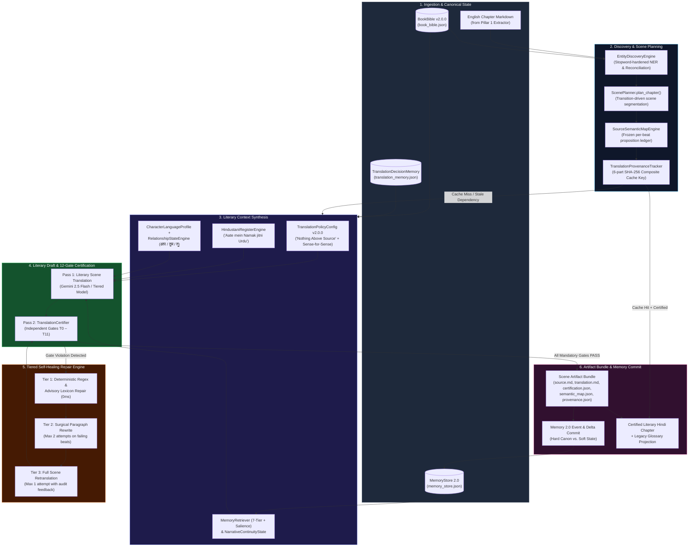
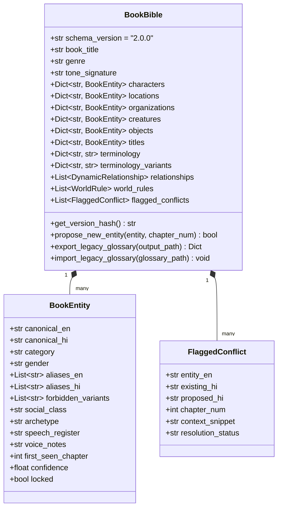
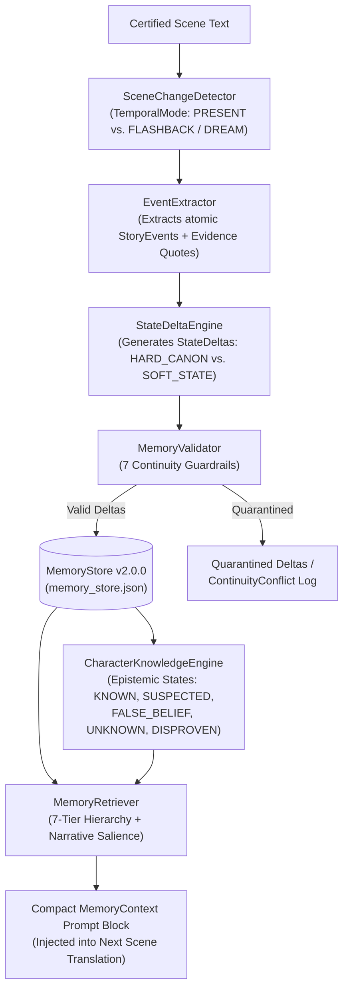

# Literary Translation Intelligence Engine (Pillar 2 Architecture)

The **Literary Translation Intelligence Engine** (`audiobook_factory/translation/`) is the multi-pass, context-aware literary translation and deterministic certification engine of **The Autonomous Graphic-Audio Studio**.

Built during the **Pillar 2 Upgrade**, it replaces single-pass, chunk-based LLM translation and rigid regex quotas with a **32-module literary translation architecture** spanning:
1. **Persistent Canonical Book Bible & Entity Discovery** (`book_bible.py`, `entity_discovery.py`)
2. **Contextual Hindustani Register & Universal Character Voice Profiles** (`translation_policy.py`, `hindustani_register.py`, `character_profile.py`, `relationship_state.py`, `intensity_model.py`)
3. **Transition-Driven Scene Segmentation & Frozen Source Semantic Maps** (`scene_planner.py`, `narrative_state.py`, `source_semantic_map.py`)
4. **12-Gate Independent Certification & Tiered Self-Healing Repair** (`certification.py`, `terminology_auditor.py`, `semantic_fidelity.py`, `omission_detector.py`, `addition_detector.py`, `character_voice_auditor.py`, `naturalness_auditor.py`, `repair_engine.py`, `provenance.py`, `translation_memory.py`)
5. **World & Character Memory 2.0 (Event-Driven Epistemic Continuity)** (`audiobook_factory/translation/memory/`)

---

## 1. Architectural Motivation: Why Single-Pass Translation Fails

Traditional LLM book translators treat chapters as flat strings of text split at arbitrary character boundaries (e.g., 4,000 characters) with a 500-character tail buffer and a monolithic prompt. Across long-form fiction, this causes seven recurring failure modes:

| Legacy Failure Mode | Root Cause | Pillar 2 Architectural Solution |
| :--- | :--- | :--- |
| **Mechanical "Translatese" (मशीनी अनुवाद)** | Calqued English syntax (*"A golden girl sat at a table" $\rightarrow$ "एक सुनहरी लड़की मेज़ पर बैठी थी"*) and modern clinical English loanwords (*डिप्रेशन, ट्रॉमा, स्ट्रेस*). | **Sense-for-Sense Literary Restructuring** (`translation_policy.py`) + **Deterministic Literary Register Auditor** (`sanitizer.py` / `naturalness_auditor.py`). |
| **Artificial Urdu Quota Stuffing** | Enforcing a rigid numeric quota (e.g., "exact 10% Urdu words") forces unnatural vocabulary into every paragraph regardless of tone. | **"Aate mein Namak jitni Urdu" Contextual Register Engine** (`hindustani_register.py`) — scales naturally across atmosphere, somatics, combat, and courtly registers. |
| **Voice Flattening & Honorific Drift** | Every character speaks in identical textbook Hindi; intimate partners suddenly address each other as `आप` or subordinates use `तू` with kings. | **Universal Character Language Profiles** (`character_profile.py`) + **7D Dynamic Relationship State Engine** (`relationship_state.py`) resolving `आप` / `तुम` / `तू`. |
| **Negation Flips & Omissions** | Single-pass generation silently drops short dialogue beats or flips negations (*"neither of them smiled"* $\rightarrow$ *"दोनों मुस्कुराए"*). | **Frozen Source Semantic Map** (`source_semantic_map.py`) + **Deterministic Negation & Quote Parity Auditors** (Gates `T2` & `T3`). |
| **Moral Bowdlerization / Inflation** | Safety-aligned LLMs sanitize dark fantasy grit or gratuitously inflate intimacy/profanity beyond the source text. | **7D Literary Intensity Vector** (`intensity_model.py`, Gate `T8`) enforcing the **"Nothing Above Source"** principle ($\pm 0.75$ soft `WARN`, $> 2.0$ hard `FAIL`). |
| **Mid-Scene Chunk Severing** | Splitting chapters at fixed token counts cuts dialogue exchanges in half, losing speaker attribution and emotional subtext. | **Transition-Driven Scene Planner** (`scene_planner.py`) segmenting only at genuine temporal, spatial, or typographic transitions. |
| **Amnesia & Flashback Contamination** | A 500-char tail buffer forgets injuries, dead characters, or secret knowledge from earlier chapters—or treats a flashback as present-tense canon. | **World & Character Memory 2.0** (`translation/memory/`) with temporal mode isolation (`PRESENT` vs. `FLASHBACK`), epistemic tracking, and 7 continuity guardrails. |

---

## 2. End-to-End Pillar 2 Pipeline Topology

When `IntelligentTranslationPipeline.translate_chapter()` (`audiobook_factory/translation/pipeline.py`) executes, every chapter flows through an 8-stage deterministic and multi-pass cognitive pipeline:



---

## 3. Module Inventory (`audiobook_factory/translation/`)

The Pillar 2 engine is organized into 22 core translation modules and 10 Memory 2.0 modules:

| Module | Primary Classes / Functions | Architectural Role |
| :--- | :--- | :--- |
| `book_bible.py` | `BookBible`, `BookEntity`, `DynamicRelationship`, `WorldRule`, `FlaggedConflict` | Persistent canonical repository (`book_bible.json`) with SHA-256 versioning and one-way legacy glossary projection. |
| `entity_discovery.py` | `EntityDiscoveryEngine` | Stopword-hardened entity discovery (`confidence >= 0.80` auto-commit, conflict flagging). |
| `translation_policy.py` | `TranslationPolicyConfig`, `DEFAULT_LITERARY_HINDI_POLICY` | Central declarative contract enforcing immutable plot facts, sense-for-sense flow, and zero meta-chatter. |
| `hindustani_register.py` | `HindustaniRegisterEngine`, `HindustaniRegisterSpec`, `HindustaniAuditResult` | Contextual Urdu seasoning engine (*"Aate mein Namak jitni Urdu"*) with genre-adaptive factories and saturation auditing. |
| `character_profile.py` | `CharacterLanguageProfile`, `UNIVERSAL_ARCHETYPE_PRESETS`, `synthesize_character_profile` | Novel-agnostic sociolect, speech tempo, diction, and archetype engine for distinct character voices. |
| `relationship_state.py` | `DynamicRelationshipState`, `RelationshipStateEngine` | 7-dimensional interpersonal matrix dynamically resolving Hindi pronouns (`आप`, `तुम`, `तू`) and event mutations. |
| `intensity_model.py` | `LiteraryIntensityVector`, `IntensityEvaluator` | 7-dimensional tone and maturity quantifier enforcing the **"Nothing Above Source"** threshold ($\pm 0.75$ soft / $> 2.0$ hard). |
| `scene_planner.py` | `ScenePlanner`, `ChapterPlan`, `ScenePlan` | Narrative transition detector segmenting chapters into organic dramatic scenes with per-scene intensity vectors. |
| `narrative_state.py` | `NarrativeContinuityState`, `NarrativeStateEngine` | Structured cross-scene state tracker replacing the legacy 500-char tail buffer. |
| `source_semantic_map.py` | `SourceSemanticMap`, `SemanticProposition`, `SourceSemanticMapEngine` | Extracts and freezes atomic narrative propositions, actors, dialogue speakers, and negation markers per scene. |
| `certification.py` | `TranslationCertifier`, `SceneCertificationReport`, `GateAuditResult` | Orchestrates independent verification Gates `T0` through `T11` and writes per-scene diagnostic artifact bundles. |
| `terminology_auditor.py` | `audit_terminology` | **Gates T1 & T5**: Deterministic regex enforcement of `BookBible` canonical terms, forbidden variants, and Latin script leaks. |
| `semantic_fidelity.py` | `deterministic_negation_audit`, `evaluate_semantic_fidelity` | **Gate T2**: Deterministic negation-flip pre-validator + LLM proposition-level meaning fidelity verifier. |
| `omission_detector.py` | `deterministic_omission_check`, `evaluate_omissions` | **Gate T3**: Dialogue quote parity checker + missing beat and paragraph drop detector. |
| `addition_detector.py` | `evaluate_additions` | **Gate T4**: Detects hallucinated actions, invented metaphors, or unsupported narrative embellishments. |
| `character_voice_auditor.py` | `evaluate_character_voices` | **Gates T6 & T7**: Audits dialogue sociolect consistency and pronoun honorific alignment (`आप`/`तुम`/`तू`). |
| `naturalness_auditor.py` | `evaluate_literary_naturalness` | **Gates T9 & T10**: Combines `sanitizer.audit_literary_register` (anachronism blocker) with an LLM translatese critic. |
| `repair_engine.py` | `TieredRepairEngine` | 3-tier self-healing loop: Tier 1 (0ms Regex/Advisory DB) $\rightarrow$ Tier 2 (Surgical Paragraph LLM) $\rightarrow$ Tier 3 (Scene Retranslation). |
| `provenance.py` | `TranslationProvenanceTracker`, `SceneProvenanceRecord` | **Gate T11**: Computes 24-char SHA-256 `composite_cache_key` across 6 dependencies to invalidate stale caches automatically. |
| `translation_memory.py` | `TranslationDecisionMemory`, `TermDecision` | Persistent cross-chapter ledger (`translation_memory.json`) locking recurring idioms, phrases, and structural choices. |
| `llm_utils.py` | `call_auditor_llm` | Lightweight JSON-schema-enforced LLM caller used by independent evaluation gates (`temperature=0.1`). |
| `pipeline.py` | `IntelligentTranslationPipeline` | Top-level orchestrator uniting planning, Memory 2.0 retrieval, drafting, 12-gate certification, repair, and persistence. |

---

## 4. Persistent Canonical Book Bible & Entity Discovery

### 4.1 `BookBible` Schema (`v2.0.0`)
Stored at `<project_dir>/book_bible.json`, `BookBible` (`audiobook_factory/translation/book_bible.py`) is the single source of truth for world lore, replacing ad-hoc flat dictionaries while maintaining backward compatibility via `export_legacy_glossary()`.



Key architectural invariants of `BookBible`:
- **Deterministic Version Hashing**: `get_version_hash()` serializes canonical fields (`characters`, `locations`, `organizations`, `creatures`, `objects`, `titles`, `terminology`, `terminology_variants`) into canonical JSON and returns a 16-character SHA-256 digest. Any change to a character's spelling or forbidden variant changes this hash, which automatically invalidates affected scene caches in `TranslationProvenanceTracker`.
- **Novel-Agnostic Variant Enforcement**: `terminology_variants` maps regex patterns of forbidden Devanagari spellings to their canonical replacement (e.g., `{"गेराल्ड": "गेराल्ट"}`), completely decoupling `sanitizer.py` and `terminology_auditor.py` from hardcoded novel rules.
- **Auto-Commit vs. Conflict Flagging**: `propose_new_entity()` automatically commits newly discovered entities when `confidence >= 0.80`. If an existing unlocked entity receives a conflicting `canonical_hi` spelling, it appends a `FlaggedConflict` record without overwriting locked canon.

### 4.2 Stopword-Hardened `EntityDiscoveryEngine`
`EntityDiscoveryEngine` (`audiobook_factory/translation/entity_discovery.py`) scans English source text prior to translation to identify recurring capitalized proper nouns:
- **Stopword Defense (`ENGLISH_NON_ENTITY_STOPWORDS`)**: Filters out 130+ common sentence-starter pronouns, conjunctions, adverbs, and interjections (*However, Suddenly, Outside, Silence, Chapter, Meanwhile*) so ordinary English words are never polluted into `book_bible.json`.
- **Positional Confidence Scoring**: Proper nouns appearing mid-sentence or as multi-word phrases receive `confidence = 0.85` (eligible for auto-commit when coupled with a Devanagari transliteration), whereas ambiguous sentence-initial single words receive `confidence = 0.50` and are held back from auto-commit.

---

## 5. Literary Register, Character Voice & Dynamic Relationships

### 5.1 Central Translation Policy (`TranslationPolicyConfig`)
Defined in `audiobook_factory/translation/translation_policy.py`, `TranslationPolicyConfig` (`v2.0.0`) codifies five non-negotiable literary mandates injected into every translation prompt:
1. **Immutable Source Truth**: Plot facts, physical actions, dialogue attribution, negations, and causal sequences are strictly immutable.
2. **"Nothing Above Source" Principle**: Preserve the exact darkness, grit, intimacy, and profanity of the original prose—never bowdlerize or sanitize, and never gratuitously exaggerate beyond the source text.
3. **Sense-for-Sense Literary Flow (भावानुवाद)**: Restructure English syntax into natural, rhythmic Hindi prose (`दरवाज़े के पीछे से एक परछाईं उभरी` instead of `एक परछाईं दरवाज़े के पीछे से बाहर आई`).
4. **Contextual Hindustani Seasoning**: Use evocative Urdu/Hindustani vocabulary only where scene atmosphere, emotion, or courtly dialogue calls for it.
5. **Zero Chatter**: Emit pure literary Hindi markdown with zero conversational filler or translator notes.

### 5.2 Contextual Hindustani Register Engine (*"Aate mein Namak jitni Urdu"*)
`HindustaniRegisterEngine` (`audiobook_factory/translation/hindustani_register.py`) replaces the legacy rigid 10% Urdu quota with organic, scene-driven seasoning across four lexical domains:
- **Atmosphere & Mystery (`atmosphere_words`)**: *ख़ामोशी, साया, मंज़र, सन्नाटा, धुंध, वीरान, आहट, दहलीज़, अंधेरा, फ़िज़ा*
- **Passion, Grief & Somatics (`passion_and_somatics`)**: *धड़कन, साँसें, रूह, कशिश, बेचैनी, सिहरन, जज़्बात, दर्द, सुकून, तड़प, नज़ाकत*
- **Combat, Danger & Grit (`combat_and_grit`)**: *ख़ून, ज़ख़्म, वार, लहू, ख़ंजर, साज़िश, क़त्ल, इंतक़ाम, ख़ौफ़, शिकस्त, रफ़्तार*
- **Courtly, Legal & Scholastic (`scholastic_and_courtly`)**: *सल्तनत, हुक्म, तख़्त, दरबार, इजाज़त, गुस्ताख़ी, फ़ैसला, सियासत, अदब, मुकद्दर*

`HindustaniRegisterEngine.from_genre(genre)` adapts the register automatically for **Fantasy / Dark Fantasy**, **Sci-Fi / Cyberpunk**, **Historical / Period Drama**, and **Thriller / Crime Noir**. Its `audit_text()` method computes `seasoning_density` per 100 words, flagging a soft warning only if Urdu markers exceed `8.0%` (over-seasoned poetic melodrama) or drop below `0.2%` on scenes longer than 300 words (overly textbook Sanskritized prose).

### 5.3 Universal Character Language Profiles
`character_profile.py` defines 8 novel-agnostic archetype presets (`UNIVERSAL_ARCHETYPE_PRESETS`) that shape how each character speaks:

| Archetype Key | Sociolect & Register | Tempo & Sentence Length | Signature Hindi Discourse Markers |
| :--- | :--- | :--- | :--- |
| `COLD_CYNIC` | `terse_gritty` | `clipped` / `short` | *हूँ, खैर, छोड़ो, बकवास* |
| `THEATRICAL_WIT` | `poetic_courtly` | `melodic` / `elaborate` | *ओहो!, भला सोचिए, उफ़, क्या बात है* |
| `AUTHORITATIVE_MATRIARCH` | `aristocratic_commanding` | `measured` / `medium` | *सुनो, ध्यान रहे, बिल्कुल नहीं* |
| `RAZOR_ARISTOCRAT` | `aristocratic_commanding` | `measured` / `elaborate` | *दरअसल, ज़ाहिर है, खैर, बेशक* |
| `MILITARY_COMMANDER` | `military_clipped` | `clipped` / `short` | *सावधान, सुनो, तुरंत, बस* |
| `SCHOLAR_INTELLECTUAL` | `scholastic_formal` | `measured` / `elaborate` | *अर्थात, वस्तुतः, ज़रा सोचिए, प्रमाण* |
| `RUSTIC_STREET_SURVIVOR` | `colloquial_rustic` | `hurried` / `short` | *अरे, भई, चल हट, क्या रे* |
| `NEUTRAL` | `standard_literary` | `measured` / `medium` | Context-driven natural flow |

### 5.4 Dynamic 7D Relationship State Engine (`आप` / `तुम` / `तू` Resolution)
`RelationshipStateEngine` (`audiobook_factory/translation/relationship_state.py`) tracks directed interpersonal vectors `(speaker, listener)` across 7 dimensions (`respect`, `familiarity`, `hostility`, `intimacy`, `authority_differential`, `fear`, `trust` on $[-5.0, +5.0]$ or $[0.0, 5.0]$).

Its deterministic `resolve_pronoun_level(state)` algorithm prevents honorific hallucination:
1. **Intimate Override (`तू` or `तुम`)**: If `intimacy >= 4.0` and `familiarity >= 3.5` (e.g., deep lovers in private), resolves to `तू` (if `respect < 2.0`) or intimate `तुम`.
2. **Hostile / Contempt Override (`तू`)**: If `hostility >= 3.5` and `respect <= -2.0` (and `fear < 3.0`), resolves to confrontational `तू`.
3. **High Authority / Reverence / Fear (`आप`)**: If `authority_differential <= -2.0` (speaking to a superior/ruler), `respect >= 2.5`, or `fear >= 3.5`, resolves to formal `आप`.
4. **Superior to Subordinate (`तुम` / `तू`)**: If `authority_differential >= 2.5`, resolves to `तू` (when `respect < 0`) or `तुम`.
5. **Familiar Peers (`तुम`) vs. Strangers (`आप`)**: Peers with `familiarity >= 2.0` use `तुम`; strangers default to `आप`.

---

## 6. 7D Literary Intensity Vector & Scene Planning

### 6.1 `LiteraryIntensityVector` (`intensity_model.py`)
Every scene is scored on a $0.0 - 5.0$ scale across 7 dimensions:
$$\mathbf{I} = \bigl[\text{profanity},\ \text{sexual\_intimacy},\ \text{violence},\ \text{emotional\_intensity},\ \text{formality},\ \text{urdu\_register},\ \text{colloquiality}\bigr]$$

During certification (**Gate T8**), `IntensityEvaluator.compare_vectors(source, target)` computes the directional delta $\Delta_d = I_{\text{target}, d} - I_{\text{source}, d}$ for each core dimension (`profanity`, `sexual_intimacy`, `violence`, `emotional_intensity`):
- **Hard Failure (`FAIL`, `is_valid=False`)**: Triggered only on extreme distortion where $|\Delta_d| > 2.0$ (e.g., severe moral sanitization $\Delta_d < -2.0$ or gratuitous tone inflation $\Delta_d > +2.0$).
- **Soft Calibration Notice (`WARN`, `is_valid=True`)**: Logged as a non-blocking diagnostic when $0.75 < |\Delta_d| \le 2.0$, avoiding brittle false-positive rejections caused by natural cross-lingual keyword density differences between English and Devanagari.

### 6.2 Transition-Driven `ScenePlanner` & `SourceSemanticMap`
- **`ScenePlanner.plan_chapter()` (`scene_planner.py`)**: Scans paragraph boundaries for explicit markdown scene breaks (`***`, `---`), temporal shifts (`TIME_TRANSITION_PATTERNS` like *"The next morning"*, *"Hours later"*), and spatial shifts (`LOCATION_TRANSITION_PATTERNS` like *"Inside the castle"*, *"Meanwhile, in the courtyard"*). Short chapters ($\le 3$ paragraphs and $< 800$ words) are kept as a single organic scene.
- **`SourceSemanticMapEngine.extract_semantic_map()` (`source_semantic_map.py`)**: Freezes a per-scene ledger of `SemanticProposition` records (`beat_id`, `paragraph_idx`, `source_text`, `actors`, `has_negation`, `negation_keywords`, `is_dialogue`, `speaker`) saved to `semantic_map.json` before translation begins.

---

## 7. Multi-Gate Independent Certification (Gates `T0` – `T11`)

After Pass 1 drafts a scene in literary Hindi, `TranslationCertifier.certify_scene()` (`audiobook_factory/translation/certification.py`) runs **12 independent verification gates** (combining 0ms deterministic AST/regex checks with isolated `temperature=0.1` LLM auditors):


| Gate ID | Gate Name | Evaluator Module | Deterministic Check | LLM Auditor Check | Severity Policy |
| :--- | :--- | :--- | :--- | :--- | :--- |
| **Gate T0** | **Source & Length Integrity** | `certification.py` | Verifies target $\ge 5$ words and target word count $\ge 40\%$ of source word count. | — | Hard `FAIL` on truncation |
| **Gate T1** | **Terminology Compliance** | `terminology_auditor.py` | Scans against `BookBible.terminology_variants` and entity `forbidden_variants`. | — | Hard `FAIL` if forbidden variant found |
| **Gate T2** | **Semantic & Negation Fidelity** | `semantic_fidelity.py` | `deterministic_negation_audit()`: Verifies source beats with `has_negation=True` contain Hindi negation markers (`नहीं`, `न`, `मत`, `बिना`, `कभी नहीं`, `कोई नहीं`). | Compares source propositions against Hindi paragraphs for polarity flips or causal inversions. | Hard `FAIL` on LLM-confirmed meaning distortion; `WARN` on heuristic negation rephrasing |
| **Gate T3** | **Omission & Quote Parity** | `omission_detector.py` | `deterministic_omission_check()`: Verifies paragraph ratio $\ge 50\%$ and dialogue quote parity ($\ge 60\%$ when source has $\ge 4$ quotes). | Audits whether any narrative beat or dialogue line was silently dropped. | Hard `FAIL` on missing story beats |
| **Gate T4** | **Addition & Fabrication** | `addition_detector.py` | — | Audits whether translator invented actions, characters, or lore absent from source. | Hard `FAIL` on fabricated plot facts |
| **Gate T5** | **Entity & Script Purity** | `terminology_auditor.py` | Detects untransliterated Latin proper nouns ($\ge 4$ chars) leaked into Devanagari prose. | — | Hard `FAIL` on leaked English names |
| **Gate T6** | **Character Sociolect** | `character_voice_auditor.py` | — | Verifies dialogue matches each speaker's `CharacterLanguageProfile`. | `WARN` / `FAIL` on severe voice break |
| **Gate T7** | **Pronoun Honorifics** | `character_voice_auditor.py` | Checks dialogue against `RelationshipStateEngine` pronoun matrix (`आप` / `तुम` / `तू`). | Audits interpersonal honorific shifts across dialogue exchanges. | `WARN` / `FAIL` on honorific inversion |
| **Gate T8** | **7D Intensity Alignment** | `intensity_model.py` | `IntensityEvaluator.compare_vectors()`: Computes 7D delta between source and Hindi prose. | — | Soft `WARN` at $\pm 0.75$; Hard `FAIL` at $> 2.0$ |
| **Gate T9** | **Literary Naturalness** | `naturalness_auditor.py` | Calls `sanitizer.audit_literary_register()` to flag modern clinical loanwords (`डिप्रेशन`, `ट्रॉमा`, `स्ट्रेस`) and literal calques (`सुनहरी लड़की`). | Evaluates cadence, syntactic fluidity, and freedom from mechanical "translatese". | Hard `FAIL` if score $< 3.5$ or clinical anachronisms present |
| **Gate T10** | **Hindustani Register Balance** | `hindustani_register.py` | `HindustaniRegisterEngine.audit_text()` measures Urdu seasoning density per 100 words. | — | Soft `WARN` if $> 8.0\%$ or $< 0.2\%$ |
| **Gate T11** | **Provenance & Cache Seal** | `provenance.py` | Seals 6-part SHA-256 `composite_cache_key` in `provenance.json`. | — | Always `PASS` on seal |

---

## 8. Tiered Self-Healing Repair Engine & Provenance Caching

### 8.1 3-Tier Escalation Protocol (`TieredRepairEngine`)
When `TranslationCertifier` reports a gate failure, `TieredRepairEngine` (`audiobook_factory/translation/repair_engine.py`) heals the scene without blindly re-running the entire chapter:

1. **Tier 1: Deterministic Regex & Advisory Lexicon Repair (0ms Latency, Zero Tokens)**
   - Applies `BookBible.terminology_variants` regex substitutions.
   - Applies `sanitizer.apply_literary_register_replacements()` (e.g., `डिप्रेशन` $\rightarrow$ `उदासी का साया`, `ट्रॉमा` $\rightarrow$ `गहरा सदमा`, `सुनहरी लड़की` $\rightarrow$ `गोरी-चिट्टी लड़की`, `नमस्ते` $\rightarrow$ `सलाम`).
   - Queries the self-learning SQLite `AdvisoryLexiconDB` (`advisory_lexicon.py`) for known calque replacements.
2. **Tier 2: Surgical Single-Paragraph LLM Rewrite (`MAX_PARAGRAPH_ATTEMPTS = 2`)**
   - If failing gates identify specific `affected_paragraphs` (e.g., paragraph 4 failed Gate T2 negation fidelity), only that paragraph is re-translated with the exact source paragraph, surrounding context, and explicit auditor feedback.
3. **Tier 3: Full Scene Retranslation with Audit Feedback (`MAX_SCENE_ATTEMPTS = 1`)**
   - If surgical repair cannot resolve a structural omission or multi-paragraph voice failure, the scene is re-translated once with the complete failure report injected into the system prompt.

### 8.2 Dependency-Aware Provenance (`TranslationProvenanceTracker`)
`provenance.py` eliminates stale translation caches when glossary terms or policies evolve. A cached scene is valid **if and only if** its 24-character SHA-256 `composite_cache_key` matches across all six inputs:
$$\text{CacheKey} = \text{SHA256}\bigl(\text{source\_hash} : \text{bible\_version\_hash} : \text{policy\_version} : \text{prompt\_version} : \text{model\_name} : \text{advisory\_version}\bigr)_{[0:24]}$$

Every certified scene writes an inspectable artifact bundle to `<project_dir>/translation/scenes/ch_XXX/scene_XXX/`:
- `source.md` — Exact segmented English scene text
- `translation.md` — Certified literary Hindi scene text
- `scene_plan.json` — Transition metadata, active characters, and 7D source intensity vector
- `semantic_map.json` — Frozen `SourceSemanticMap` propositions and negation markers
- `certification.json` — Complete `SceneCertificationReport` across Gates `T0`–`T11`
- `provenance.json` — Cryptographic `SceneProvenanceRecord`

---

## 9. World & Character Memory 2.0 (`audiobook_factory/translation/memory/`)

To prevent cross-chapter continuity hallucinations, flashback contamination, and epistemic leaks (characters knowing secrets they never witnessed), Pillar 2 includes **World & Character Memory 2.0**, a 10-module event-driven cognitive memory subsystem:



### 9.1 The Package Architecture (`audiobook_factory/translation/memory/`)
*(See complete specification: [`docs/WORLD_AND_CHARACTER_MEMORY_2_0.md`](file:///c:/Users/Suraj/Documents/Antigravity/Audiobook/docs/WORLD_AND_CHARACTER_MEMORY_2_0.md))*

The production engine is structured across 9 cohesive, strongly-typed modules in `audiobook_factory/translation/memory/`:

1. **[`state.py`](file:///c:/Users/Suraj/Documents/Antigravity/Audiobook/audiobook_factory/translation/memory/state.py)**: Pure deterministic state transition engine executing validated mutations via `apply_character_delta()`, `apply_relationship_delta()`, `apply_knowledge_delta()`, `apply_world_or_narrative_delta()`, and `record_events_on_timeline()`.
2. **[`events.py`](file:///c:/Users/Suraj/Documents/Antigravity/Audiobook/audiobook_factory/translation/memory/events.py)**: Defines `StoryEvent` with deterministic SHA-256 identifiers and `salience_score`, `StoryEventType` (15+ types), `TemporalMode` (`PRESENT`, `FLASHBACK`, `MEMORY_DREAM`, `HISTORICAL_NARRATION`, `NON_LINEAR`), `SceneChangeDetector` (fast 0ms pre-filter with noun/verb trigger matching, intra-scene travel, and transitive attacker vs. victim resolution), and `EventExtractor` (gated LLM proposal with deterministic fallback and LLM-vs-deterministic deduplication).
3. **[`character_memory.py`](file:///c:/Users/Suraj/Documents/Antigravity/Audiobook/audiobook_factory/translation/memory/character_memory.py)**: Defines `CharacterState`, `CharacterArcMemory`, and `CharacterKnowledgeEngine` managing epistemic states (`KNOWN`, `SUSPECTED`, `FALSE_BELIEF`, `UNKNOWN`, `DISPROVEN`). Enforces strict `known_by` membership, scoped `DISPROVEN` transitions, asymmetric secret prioritization, and `MUST_NOT_KNOW` prompt boundaries.
4. **[`world_memory.py`](file:///c:/Users/Suraj/Documents/Antigravity/Audiobook/audiobook_factory/translation/memory/world_memory.py)**: Models dynamic, evolving world state across `LocationState`, `ObjectState`, `OrganizationState`, `NarrativeThreadState`, `TimelinePoint` (dual narrative/chronological timeline), and `WorldState`.
5. **[`memory_delta.py`](file:///c:/Users/Suraj/Documents/Antigravity/Audiobook/audiobook_factory/translation/memory/memory_delta.py)**: Defines `StateDelta`, `DeltaDomain`, `StateMutability` (`HARD_CANON` vs `SOFT_STATE`), and `StateDeltaEngine` projecting StoryEvents into typed deltas while strictly preserving damaged/destroyed location conditions across movement events.
6. **[`memory_validator.py`](file:///c:/Users/Suraj/Documents/Antigravity/Audiobook/audiobook_factory/translation/memory/memory_validator.py)**: Enforces **7 Contradiction Guardrails** before deltas can commit: `canon_contradiction`, `timeline_contradiction`, `dead_character_violation`, `physical_impossibility`, `relationship_jump`, `knowledge_violation`, and `world_rule_violation`. Emits a structured `MemoryValidationReport`.
7. **[`memory_store.py`](file:///c:/Users/Suraj/Documents/Antigravity/Audiobook/audiobook_factory/translation/memory/memory_store.py)**: Versioned store (`memory_store.json`) with deterministic SHA-256 commit hashes, `BookBible` synchronization, and **Ghost Event Isolation** (quarantining rejected contradictory events in `store.rejected_events` to prevent ghost event pollution in active timelines or salience queries).
8. **[`memory_retriever.py`](file:///c:/Users/Suraj/Documents/Antigravity/Audiobook/audiobook_factory/translation/memory/memory_retriever.py)**: Assembles a scene-scoped memory slice using a **7-Tier Priority Hierarchy** combined with a **Narrative Salience (Dramatic Memory)** layer retrieving past turning points, oaths, and betrayals across long novels.
9. **[`memory_context.py`](file:///c:/Users/Suraj/Documents/Antigravity/Audiobook/audiobook_factory/translation/memory/memory_context.py)**: Packages the prompt context under a strict **$\le 800$ token budget ceiling** (`enforce_token_budget()`) and provides conservative performance guidance (`apply_performance_guidance_to_segment()`) respecting explicit director acting directives while enriching neutral lines with `memory_vocal_constraint`, `recommended_pronoun`, and `recommended_register`.

### 9.2 Epistemic Isolation (`MUST_NOT_KNOW`) & Bounded Relationship Priors
- **Epistemic Boundaries**: Readers frequently know secrets that characters on page do not. `CharacterKnowledgeEngine` builds an explicit per-character matrix preventing omniscient leakage by generating hard prompt instructions:
  ```text
  EPISTEMIC ISOLATION (Strict Knowledge Boundaries):
    - Vikram: KNOWS=[Arjun (secret_plan): ambush at gate]
    - Kabir: MUST_NOT_KNOW=[Arjun (secret_plan): ambush at gate]
  ```
- **Bounded Relationship Priors**: The 7D relationship vectors dynamically dictate Hindi second-person pronoun choice (`आप` for high respect/distance, `तुम` for peer familiarity, `तू` for intense intimacy or contempt). Changes are strictly clamped to $\pm 2$ points per scene on standard events and $\pm 3$ points on major turning points, anchored by `TranslationDecisionMemory` (`translation_memory.json`).

---

## 10. Benchmark Calibration & Multi-Script Zero-Hardcoding Contract

### 10.1 The Chapter 9 Benchmark Standard (`audiobooks/standards/`)
To anchor literary quality objectively, the repository preserves a read-only calibration benchmark in `audiobooks/standards/`:
- [`chapter_009_hi_old_canonical.md`](file:///c:/Users/Suraj/Documents/Antigravity/Audiobook/audiobooks/standards/chapter_009_hi_old_canonical.md): Frozen pre-upgrade baseline output.
- [`chapter_009_hi_standard.md`](file:///c:/Users/Suraj/Documents/Antigravity/Audiobook/audiobooks/standards/chapter_009_hi_standard.md): Gold-standard Literary Translation Intelligence output.
- [`chapter_009_benchmark_comparison.md`](file:///c:/Users/Suraj/Documents/Antigravity/Audiobook/audiobooks/standards/chapter_009_benchmark_comparison.md): 12-dimensional side-by-side forensic evaluation demonstrating improvements across syntactic restructuring (`6.0` $\rightarrow$ `9.5`), clinical loanword elimination (`5.0` $\rightarrow$ `9.5`), contextual Urdu register (`6.5` $\rightarrow$ `9.4`), and negation/proposition preservation (`7.5` $\rightarrow$ `9.8`).

### 10.2 Multi-Script Zero-Hardcoding AST Contract
All 32 modules in `audiobook_factory/translation/` and `audiobook_factory/translator.py` are strictly **novel-agnostic**. Enforced by [`tests/test_zero_hardcoding_contracts.py`](file:///c:/Users/Suraj/Documents/Antigravity/Audiobook/tests/test_zero_hardcoding_contracts.py), the test suite scans every Python file in `audiobook_factory/` against both:
- **Latin Forbidden Tokens**: Book titles, character names, and project slugs (`witcher`, `geralt`, `yennefer`, `ciri`, `dandelion`, `vesemir`, `triss`, `kaer morhen`, `nilfgaard`, etc.).
- **Devanagari Forbidden Tokens (`FORBIDDEN_CHARACTERS_DEVANAGARI`)**: Character names and spelling variants in Devanagari (`गेराल्ट`, `गेराल्ड`, `येनेफर`, `येनिफर`, `सिरी`, `डैंडेलायन`, `वेसेमिर`, `ट्रिस`, `नेनेके`, `इओला`, `फिलिप्पा`, `डेijkstra`).

All book-specific entities, aliases, and forbidden spelling variants reside exclusively in the runtime project workspace (`<project_dir>/book_bible.json`).

---

## 11. Programmatic Usage

```python
from pathlib import Path
from audiobook_factory.translation.pipeline import IntelligentTranslationPipeline
from audiobook_factory.translation.book_bible import BookBible

# 1. Load or initialize the project's canonical BookBible
project_dir = Path("audiobooks/projects/my_novel")
bible = BookBible.load(project_dir / "book_bible.json")

# 2. Initialize the Literary Translation Intelligence Pipeline
pipeline = IntelligentTranslationPipeline(
    project_dir=project_dir,
    book_bible=bible,
    genre="dark_fantasy",
)

# 3. Translate and certify a chapter end-to-end (Gates T0-T11 + Memory 2.0)
english_text = Path("audiobooks/projects/my_novel/extracted/chapter_001.md").read_text(encoding="utf-8")
certified_hindi = pipeline.translate_chapter(
    chapter_text=english_text,
    chapter_num=1,
    chapter_title="Chapter 1",
)
```
