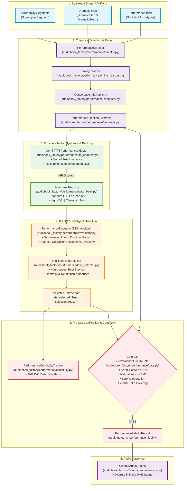

# 🎭 Dramatic Performance Realization Layer & Gate 2.8 (ADR-032)

> **Architectural Specification, 14 Capabilities Reference, Acoustic-Dramatic QC Engine, and Pre-Mix Gatekeeper for Studio-Grade Audio Drama Production.**

---

## 📑 Table of Contents
1. [Executive Overview & Architectural Mission](#-executive-overview--architectural-mission)
2. [Core Architecture & High-Resolution Dataflow](#-core-architecture--high-resolution-dataflow)
3. [The 14 Capabilities Reference](#-the-14-capabilities-reference)
   - [Capability 1: `PerformanceDirection` Contract](#capability-1-performancedirection-first-class-contract)
   - [Capability 2: `TakeVariant` Multi-Take Schema](#capability-2-takevariant-candidate-contract)
   - [Capability 3: `PerformanceEvaluationResult` & 8D Diagnosis](#capability-3-performanceevaluationresult--8-dimension-scoring)
   - [Capability 4: `PerformanceFidelityReport` Pre-Mix Audit Schema](#capability-4-performancefidelityreport-contract)
   - [Capability 5: `TimingRealizer` & Organic Respiration](#capability-5-timingrealizer-humanized-timing--respiration)
   - [Capability 6: `PerformanceDirector` Sociolect Projection](#capability-6-performancedirector-actor-direction--sociolect-projection)
   - [Capability 7: Anti-Emotional Teleportation Defense](#capability-7-anti-emotional-teleportation-defense)
   - [Capability 8: `GeminiTTSPerformanceAdapter` & Style Synthesis](#capability-8-geminittsperformanceadapter--style-synthesis)
   - [Capability 9: `PerformanceEvaluator` 2.0 & Evidence Models](#capability-9-performanceevaluator-20--evidence-models)
   - [Capability 10: `TakeBank` Priority Allocation](#capability-10-takebank-priority-based-multi-take-banking)
   - [Capability 11: `IntelligentTakeSelector` 2.0 & Judicial Deliberation](#capability-11-intelligenttakeselector-20--judicial-deliberation)
   - [Capability 12: `ConversationalChemistry` Turn Coupling](#capability-12-conversationalchemistry-dialogue-turn-coupling)
   - [Capability 13: `PerformanceContinuityTracker` Drift Monitoring](#capability-13-performancecontinuitytracker-actor-continuity)
   - [Capability 14: `PerformanceFidelityGate` (Gate 2.8)](#capability-14-performancefidelitygate-gate-28-pre-mix-gatekeeper)
4. [Sacred Spoken Text Immutability Guarantee](#-sacred-spoken-text-immutability-guarantee)
5. [The Non-Loudest Best Evaluation Principle](#-the-non-loudest-best-evaluation-principle)
6. [Programmatic Usage & CLI Workflows](#-programmatic-usage--cli-workflows)
7. [Verification & Test Matrix](#-verification--test-matrix)

---

## 🏛️ Executive Overview & Architectural Mission

In traditional audiobook pipelines, speech synthesis treats text as an isolated, linear sequence of sentences passed to a single Text-to-Speech (TTS) endpoint. In contrast, **Audiobook Maker v4.0** models cinematic audio drama according to the standards of high-end theatrical productions (e.g., Audible Drama, GraphicAudio).

The **Dramatic Performance Realization Layer** ([`audiobook_factory/performance/`](file:///c:/Users/Suraj/Documents/Antigravity/Audiobook/audiobook_factory/performance/)) serves as the critical bridge connecting high-level narrative intelligence (**Stage 3 Dramaturgy**) to tactile, moment-by-moment vocal acting (**Gemini 3.8 Flash TTS**), multi-take candidate banking, acoustic quality evaluation, and dialogue stem mastering (**CinemaAudioEngine**).

```
┌─────────────────────────┐     ┌─────────────────────────────────────────────────────────────┐     ┌────────────────────────┐
│   Stage 3 Dramaturgy    │     │         Dramatic Performance Realization Layer              │     │   Cinema Audio Engine  │
│  (SceneAnalyzer, Beats, │ ──> │ (PerformanceDirector, Timing, Chemistry, Takes, 8D QC,      │ ──> │ (5-Stem DX/MX/FX/AMB/ME│
│   Performance Bible)    │     │  Intelligent Selection, Gate 2.8 Fidelity Gatekeeper)       │     │  EBU R128 Broadcast)   │
└─────────────────────────┘     └─────────────────────────────────────────────────────────────┘     └────────────────────────┘
```

### The Historical Architectural Deficiencies Solved
Prior to the implementation of the Performance Realization Layer (ADR-032), the pipeline exhibited five subtle dramatic and acoustic limitations:
1. **The Single-Take Lottery:** Dramatic beats—even climactic turning points—depended entirely on the stochastic output of a single TTS generation. If an API call produced a flat or misaligned delivery, the pipeline either accepted bad acting or crashed.
2. **The "Loudest is Best" Acoustic Volume Trap:** Automated audio evaluators historically prioritized peak amplitude and high root-mean-square (RMS) energy, falsely penalizing intimate, whispered, or restrained delivery while rewarding blaring, melodramatic shouting.
3. **Emotional Teleportation:** Characters frequently shifted from tranquil contemplation to screaming rage within a single line turnaround when scenes changed rapidly, breaking listener immersion due to lack of transitional grounding.
4. **Mechanical Conversational Latency:** Adjacent dialogue turns were synthesized in complete isolation. Interrupted lines had unnatural silence before the interrupter began, questions lacked thoughtful hesitation pauses, and intimidated characters responded with machine-like immediacy.
5. **Acoustic vs. Dramatic Decoupling:** Downstream mastering engines lacked access to character restraint, tactical leverage, or emotional subtext, forcing mixing engineers and mastering chains to guess at dynamics.

The Dramatic Performance Realization Layer completely eliminates these gaps through strongly typed Pydantic v2 contracts, multi-take candidate generation, explainable 8-dimensional scoring, and the fail-closed **Gate 2.8: Performance Fidelity Gate**.

---

## 🔄 Core Architecture & High-Resolution Dataflow

The diagram below illustrates the end-to-end execution dataflow through the Dramatic Performance Realization Layer:



---

## 🎛️ The 14 Capabilities Reference

The Dramatic Performance Realization Layer is built around 14 discrete, battle-tested capabilities:

### Capability 1: `PerformanceDirection` First-Class Contract
- **Module:** [`audiobook_factory/performance/contracts.py`](file:///c:/Users/Suraj/Documents/Antigravity/Audiobook/audiobook_factory/performance/contracts.py#L59-L154)
- **Class:** [`PerformanceDirection`](file:///c:/Users/Suraj/Documents/Antigravity/Audiobook/audiobook_factory/performance/contracts.py#L59-L154)

`PerformanceDirection` is a first-class Pydantic v2 contract that decouples the author's verbatim dialogue and the dramaturge's emotional intent from provider-specific speech synthesis engines. It contains 6 distinct operational sections:

```python
class PerformanceDirection(BaseModel):
    # 1. Identity & Provenance
    direction_id: str                      # Deterministic ID (e.g., 'pd_0001_geralt')
    segment_uid: str                       # ScreenplaySegment UID
    index: int                             # 1-indexed monotonic chapter sequence number
    speaker: str                           # Canonical character speaker name
    target_character: Optional[str]        # Direct dialogue recipient
    narrative_mode: str                    # direct_dialogue, narration, internal_monologue
    provenance_mode: PerformanceProvenanceMode # SOURCE_DIRECT, DRAMATIC_CANON, INFERRED_PERFORMANCE, DRAMATIC_INTERPRETATION

    # 2. Dramatic State
    character_state: str                   # Psychological state
    objective: str                         # Immediate tactical beat objective
    actioning: str                         # Active transitive verb (e.g. 'corner', 'soothe')
    surface_emotion: str                   # Outwardly presented emotion
    underlying_emotion: Optional[str]      # Concealed internal emotion
    subtext: Optional[str]                 # Unspoken subtextual reality
    subtext_confidence: float              # Confidence floor [0.0 - 1.0]
    intensity: str                         # low, medium, high, explosive
    tension_before: float                  # Tension entering beat [0.0 - 1.0]
    tension_after: float                   # Tension exiting beat [0.0 - 1.0]

    # 3. Relationship & Social Dynamics
    relationship_to_target: Optional[str]  # Dynamic shift
    power_position: PowerPosition          # dominant, submissive, contested, neutral
    leverage: LeverageLevel                # commanding, holding, equal, vulnerable, none
    vulnerability: float                   # Emotional exposure [0.0 - 1.0]
    trust_level: float                     # Interpersonal trust [0.0 - 1.0]
    social_mask: Optional[str]             # e.g., 'masking_contempt_with_courtesy'
    intimacy_level: IntimacyLevel          # formal, colleague, familiar, intimate, hostile

    # 4. Vocal Behavior
    pace: float                            # Relative speed multiplier [0.5 - 2.0]
    energy: float                          # Vocal projection / adrenaline [0.0 - 1.0]
    pitch_behavior: PitchBehavior          # neutral, low_resonant, high_tense, monotone, wavering, dropping, rising
    articulation: str                      # natural, crisp, colloquial, sluggish, clipped
    resonance: ResonancePlacement          # chest, throat, head, whisper_air
    breath_behavior: BreathBehavior        # steady, sharp_intake, labored, suppressed, trembling, exhausted, holding_breath
    vocal_texture: VocalTexture            # smooth, raspy, brittle, warm, gravelly, harsh
    restraint: float                       # Suppression vs explosion (0.0=raw, 1.0=iron)
    emphasis_words: List[str]              # Organically emphasized words
    de_emphasis_words: List[str]            # Underplayed or swallowed words

    # 5. Timing & Physical Execution
    pause_before_ms: int                   # Lead-in silence (ms)
    pause_after_ms: int                    # Trailing silence (ms)
    pre_roll_breath_ms: int                # Pre-speech breath intake (ms)
    post_roll_breath_ms: int               # Post-speech breath release (ms)
    hesitation_ms: int                     # Internal line hesitation (ms)
    silence_type: SilenceType              # punctuation, breathing, hesitation, dramatic_silence, interruption_cut...
    interruption_behavior: InterruptionBehavior # none, abrupt_cut, overlap_start, fade_under
    turn_taking_behavior: TurnTakingBehavior # immediate, delayed_reaction, reluctant, eager_counter, defensive_parry

    # 6. Priority & Take Allocation
    performance_priority: PerformancePriority # standard (1), focused (2), high (2-3), climactic (3-4)
    required_takes: int                    # Candidate take count [1 - 4]
    delivery_intent_summary: str           # Explainable 1-line human-readable actor directive
```

---

### Capability 2: `TakeVariant` Candidate Contract
- **Module:** [`audiobook_factory/performance/contracts.py`](file:///c:/Users/Suraj/Documents/Antigravity/Audiobook/audiobook_factory/performance/contracts.py#L175-L194)
- **Class:** [`TakeVariant`](file:///c:/Users/Suraj/Documents/Antigravity/Audiobook/audiobook_factory/performance/contracts.py#L175-L194)

Candidate performance takes represent distinct artistic interpretations of the same screenplay line. Rather than random seeds, variations are artistically directed across five distinct avenues:
- `standard`: The baseline performance following primary character sociolect.
- `restraint`: Understated delivery emphasizing internal discipline, vocal suppression, and low resonance.
- `vulnerable`: Composure cracked slightly, revealing subtextual hesitation or emotional exposure.
- `exposed`: Raw adrenaline and unmasked intensity for climatic confrontations.
- `alternative_cadence`: Rhythmic variation with pregnant pauses and altered phrasal cadence.

Each `TakeVariant` records its filesystem path, duration, link to the governing `PerformanceDirection`, evaluation results, and selection audit provenance (`is_selected` and `selection_reason`).

---

### Capability 3: `PerformanceEvaluationResult` & 8-Dimension Scoring
- **Module:** [`audiobook_factory/performance/contracts.py`](file:///c:/Users/Suraj/Documents/Antigravity/Audiobook/audiobook_factory/performance/contracts.py#L252-L273)
- **Class:** [`PerformanceEvaluationResult`](file:///c:/Users/Suraj/Documents/Antigravity/Audiobook/audiobook_factory/performance/contracts.py#L252-L273), [`EvaluationDimensionScore`](file:///c:/Users/Suraj/Documents/Antigravity/Audiobook/audiobook_factory/performance/contracts.py#L145-L153)

Every synthesized take undergoes multidimensional evaluation across 8 discrete axes. `EvaluationDimensionScore` provides an explainable score between $0.0$ and $1.0$, a qualitative rating (`strong`, `moderate`, `weak`, `unacceptable`), and an explainable diagnosis.

In Evaluator 2.0 (Wave B), `PerformanceEvaluationResult` is backed by empirical forensic telemetry:
- `evidence`: Full [`PerformanceEvidence`](file:///c:/Users/Suraj/Documents/Antigravity/Audiobook/audiobook_factory/performance/contracts.py#L108-L122) capturing acoustic, prosodic, pacing, and voice identity measurements.
- `voice_identity_score`: Acoustic similarity score against the reference voice bank.
- `voice_drift_detected`: Boolean flag indicating whether vocal timbre or pitch drifted beyond dynamic tolerances.
- `overall_score`: Weighted sum across active dimensions.
- `passed`: Boolean indicator requiring $overall \ge 0.70$ and $naturalness \ge 0.65$.
- `recommendation`: `accept`, `downgrade`, or `regenerate`.

---

### Capability 4: `PerformanceFidelityReport` Contract
- **Module:** [`audiobook_factory/performance/contracts.py`](file:///c:/Users/Suraj/Documents/Antigravity/Audiobook/audiobook_factory/performance/contracts.py#L196-L212)
- **Class:** [`PerformanceFidelityReport`](file:///c:/Users/Suraj/Documents/Antigravity/Audiobook/audiobook_factory/performance/contracts.py#L196-L212)

The chapter-level audit report emitted by **Gate 2.8**. It summarizes total segments, candidate takes generated, average evaluation scores across all 8 dimensions, zero-tolerance emotional teleportation violations, and unresolved critical issues.

---

### Capability 5: `TimingRealizer`: Humanized Timing & Respiration
- **Module:** [`audiobook_factory/performance/timing_realizer.py`](file:///c:/Users/Suraj/Documents/Antigravity/Audiobook/audiobook_factory/performance/timing_realizer.py)
- **Class:** [`TimingRealizer`](file:///c:/Users/Suraj/Documents/Antigravity/Audiobook/audiobook_factory/performance/timing_realizer.py#L14-L198)

`TimingRealizer` transforms high-level dramatic silence intent and physical blocking into millisecond-accurate acoustic timing cues:
- **Authoritative Dramatic Silence Timing:** Maps Stage 3 dramatic intents into calibrated pause durations:
  $$\text{adjusted\_duration} = \text{base\_duration} \times (0.9 + 0.3 \times \text{tension} + 0.2 \times \text{restraint})$$
  - `shock`: 1600ms (`dramatic_silence`)
  - `realization`: 1400ms (`dramatic_silence`)
  - `grief`: 1800ms (`emotional_freeze`)
  - `emotional_absorption`: 1500ms (`emotional_freeze`)
  - `intimidation`: 1300ms (`reaction_silence`)
  - `hesitation`: 550ms (`hesitation`)
- **Conversational Dynamics:**
  - `interruption`: Sets `pause_after_ms = 80`, `silence_type = 'interruption_cut'`, `interruption_behavior = 'abrupt_cut'`.
  - `deflection_avoidance`: Injects `pause_before_ms = 500`, `pause_after_ms = 550`, `turn_taking_behavior = 'defensive_parry'`.
  - `cross_talk`: Clamps trailing pause to 100ms with `overlap_start`.
- **Text-Driven Hesitation:** Automatically detects ellipsis (`...` or `…`) and injects a minimum 350ms mid-line hesitation and `delayed_reaction` turn taking.
- **Organic Respiration:** Calculates pre-roll breath intake (`pre_roll_breath_ms`) and post-roll release (`post_roll_breath_ms`):
  - Long lines ($\ge 16$ words), extreme tension ($\ge 0.72$), or physical strain (`combat_strain`, `exhausted`, `wounded`) allocate 150ms–280ms breath intake.
  - Grief, heavy realizations, and explicit `[sigh]` or `[gasp]` cues allocate 220ms–250ms post-roll breath release.
- **Power Stance Modulation:** Dominant speakers command the room with unhurried $1.15\times$ longer trailing pauses; submissive speakers shorten pauses by $0.90\times$ or delay responses due to hesitation.

---

### Capability 6: `PerformanceDirector`: Actor Direction & Sociolect Projection
- **Module:** [`audiobook_factory/performance/director.py`](file:///c:/Users/Suraj/Documents/Antigravity/Audiobook/audiobook_factory/performance/director.py)
- **Class:** [`PerformanceDirector`](file:///c:/Users/Suraj/Documents/Antigravity/Audiobook/audiobook_factory/performance/director.py#L41-L432)

`PerformanceDirector` acts as the master audio drama stage director:
- **Sociolect Character Projection:** Pulls character baseline parameters from the [`PerformanceBible`](file:///c:/Users/Suraj/Documents/Antigravity/Audiobook/audiobook_factory/dramaturgy/contracts.py):
  - `COLD_CYNIC`: Baseline pace 0.92, energy 0.70, restraint 0.85, low resonant pitch contour, clipped articulation.
  - `CAUSTIC_ARISTOCRAT`: Deliberate crisp articulation, haughty cadence, chest resonance.
  - `THARKI_BARD`: Dynamic pitch, warmth, colloquial articulation, fast pace 1.15.
  - `Narrator`: Restraint locked to 0.80, crisp articulation, objective framing.
- **Vocal Posture Modulation:** In high-restraint characters ($\ge 0.75$), surface anger is redirected into `low_resonant` pitch, `suppressed` breathing, and `gravelly` texture. Low-restraint characters ($\le 0.40$) express anger via `high_tense` pitch, `throat` resonance, and `labored` breathing.
- **Social Masks & Subtext:** When an underlying emotion differs from the surface presentation (e.g., concealing `contempt` behind `courtesy`), the director generates an explicit social mask (`masking_contempt_with_courtesy`) with elevated vulnerability and subdued energy.

---

### Capability 7: Anti-Emotional Teleportation Defense
- **Module:** [`audiobook_factory/performance/director.py`](file:///c:/Users/Suraj/Documents/Antigravity/Audiobook/audiobook_factory/performance/director.py#L47-L55)
- **Enforcement:** [`PerformanceDirector.direct_segment()`](file:///c:/Users/Suraj/Documents/Antigravity/Audiobook/audiobook_factory/performance/director.py#L215-L230) & [`PerformanceFidelityGate`](file:///c:/Users/Suraj/Documents/Antigravity/Audiobook/audiobook_factory/performance/gate.py#L64-L77)

Screens sequential dialogue segments spoken by the same character for volatile, ungrounded emotional shifts:
- **Registered Volatile Transitions:**
  - `("calm", "bellowing_rage")`
  - `("peaceful", "explosive")`
  - `("gentle_tender", "bellowing_battlecry")`
  - `("whispering", "bellowing_rage")`
  - `("joyous", "despair")`
  - `("calm", "rage")`
- **Automatic Grounding:** If a volatile transition occurs without an explicit `causal_trigger` in the screenplay beat, `PerformanceDirector` intercepts the leap. It dampens the explosion into `suppressed_<emotion>`, elevates restraint by $+0.20$, and anchors the vocal pitch in a `low_resonant` chest register.
- **Gatekeeper Hard Stop:** If an ungrounded teleportation violation escapes to **Gate 2.8**, the gate fails closed and halts chapter mastering.

---

### Capability 8: `GeminiTTSPerformanceAdapter`: Provider-Neutral Bridge & Style Synthesis
- **Module:** [`audiobook_factory/performance/tts_adapter.py`](file:///c:/Users/Suraj/Documents/Antigravity/Audiobook/audiobook_factory/performance/tts_adapter.py)
- **Class:** [`GeminiTTSPerformanceAdapter`](file:///c:/Users/Suraj/Documents/Antigravity/Audiobook/audiobook_factory/performance/tts_adapter.py#L32-L161)

The bridge between `PerformanceDirection` contracts and Google Gemini 3.8 Flash TTS payload formats:
- **Rich Multi-Token Style Descriptors:** Generates natural language `speechMetadata.style` strings synthesizing delivery emotion, tactical actioning, restraint, pitch contour, articulation, and physical staging:
  ```json
  {
    "speechMetadata": {
      "style": "cold menace, acting to threaten, iron restraint, tightly controlled, low resonant chest register, deliberate crisp articulation"
    }
  }
  ```
- **Micro-Entropy Temperature Calibration:** Calibrates generation temperature based on the candidate take variant:
  - `restraint`: $\text{temperature} = 0.65$ (disciplined, deterministic formants).
  - `standard`: $\text{temperature} = 0.70$.
  - `vulnerable`: $\text{temperature} = 0.72$ (micro-hesitation entropy).
  - `exposed`: $\text{temperature} = 0.76$ (raw emotional dynamic range).
- **Sacred Text Invariance:** Guarantees that the author's dialogue is never polluted with inline stage directions or delivery adjectives. Spoken text passes into `part_payload["text"]` completely unaltered.

---

### Capability 9: `PerformanceEvaluator` 2.0 & Evidence Models
- **Module:** [`audiobook_factory/performance/evaluator.py`](file:///c:/Users/Suraj/Documents/Antigravity/Audiobook/audiobook_factory/performance/evaluator.py)
- **Class:** [`PerformanceEvaluator`](file:///c:/Users/Suraj/Documents/Antigravity/Audiobook/audiobook_factory/performance/evaluator.py#L33-L618)
- **Contracts:** [`PerformanceEvidence`](file:///c:/Users/Suraj/Documents/Antigravity/Audiobook/audiobook_factory/performance/contracts.py#L108-L122), [`AcousticEvidence`](file:///c:/Users/Suraj/Documents/Antigravity/Audiobook/audiobook_factory/performance/contracts.py#L49-L64), [`ProsodyEvidence`](file:///c:/Users/Suraj/Documents/Antigravity/Audiobook/audiobook_factory/performance/contracts.py#L65-L79), [`PacingEvidence`](file:///c:/Users/Suraj/Documents/Antigravity/Audiobook/audiobook_factory/performance/contracts.py#L80-L93), [`VoiceIdentityEvidence`](file:///c:/Users/Suraj/Documents/Antigravity/Audiobook/audiobook_factory/performance/contracts.py#L94-L107), [`EvaluatorCalibrationConfig`](file:///c:/Users/Suraj/Documents/Antigravity/Audiobook/audiobook_factory/performance/contracts.py#L123-L144)

In Wave B, the evaluator was completely overhauled into **Performance Evaluator 2.0**, substituting subjective scoring heuristics with empirical signal extraction and mathematical telemetry:

#### 1. Empirical Forensic Extraction
Rather than guessing performance quality, `PerformanceEvaluator` extracts discrete physical metrics:
- **Normalized Autocorrelation Pitch Tracking ($F_0$)**: Analyzes 50ms centered frames with 25ms hops across a $60\text{ Hz} \le F_0 \le 400\text{ Hz}$ search window:
  $$R_{xx}(\tau) = \sum_{n=0}^{N-\tau-1} x[n] \cdot x[n+\tau]$$
  Accepts candidate voiced peaks when $\frac{R_{xx}(\tau_{\text{peak}})}{R_{xx}(0)} > 0.30$ and frame energy $\ge 10^6$. Computes median $F_0$, interquartile range ($F_{0,\text{IQR}} = Q_3 - Q_1$), and standard deviation ($\sigma_{F0}$).
- **Crest Factor Dynamic Range**: Evaluates dynamic acoustic headroom:
  $$\text{Dynamic Range (dB)} = 20 \log_{10}\left(\frac{\max(|x|)}{\text{RMS}(x)}\right)$$
- **Robotic Monotonic Pitch-Lock Detection**: Flags artificial vocoder pitch-locking when $\sigma_{F0} < 5.0\text{ Hz}$ across $\ge 6$ voiced frames. Whispered or close-mic lines (`proximity == "close_mic"`, `resonance == "whisper_air"`) are mathematically exempted to prevent false positives during unvoiced speech.
- **Waveform Hygiene**: Measures exact consecutive clipped samples pinned to the digital rail ($\pm 32760$), DC bias offset, Wiener spectral flatness mean, high-frequency energy ratio ($> 4\text{ kHz}$), and trailing dead air endpoints.

#### 2. Dimensional Evaluation Grounded in Evidence

| Dimension | Weight | Mathematical / Empirical Basis | Diagnostic Check & Thresholds |
|---|:---:|---|---|
| **Naturalness** | **0.20** | Rail pinning, DC offset, dead air, spectral flatness | Max consecutive rail samples $< 6$; DC bias $< 1200.0$; trailing dead air $< 1.5\text{s}$; spectral flatness $< 0.40$. |
| **Intent Match** | **0.15** | Dramatic beat objective & actioning verb delivery | Congruence of acoustic projection with active verb (e.g. commands require $\text{RMS} \ge -28\text{ dBFS}$; soothing requires $\text{RMS} \le -16\text{ dBFS}$). |
| **Emotional Match** | **0.15** | Acoustic energy headroom vs. emotional intensity | Explosive intensity requires $\text{RMS} \ge -24\text{ dBFS}$; intimate/whispered delivery requires $\text{RMS} \le -18\text{ dBFS}$. |
| **Pacing** | **0.15** | Words-per-second (WPS) adherence vs. target pace | Target $\text{WPS} = 3.1 \times \text{direction.pace}$. Ratio error $\le 0.20$ rates strong ($0.95$); $> 0.65$ fails ($0.40$). |
| **Subtext & Restraint** | **0.10** | Character restraint vs. vocal compression | High-restraint characters ($\ge 0.75$) must not shout: $\text{peak} \ge 31,000$ and $\text{RMS} > -15\text{ dBFS}$ docks $-0.30$ on subtext. |
| **Prosody & Cadence** | **0.10** | Melodic pitch inflection & pitch-lock defense | Monotonic pitch lock ($\sigma_{F0} < 5.0\text{ Hz}$) docks $-0.20$; harmonic lock anomaly docks $-0.20$. |
| **Character Consistency** | **0.08** | Acoustic voice identity against reference bank | Probed via `VoiceIdentityAnalyzer`; catastrophic drift triggers hard gate violation. |
| **Relationship Consistency** | **0.07** | Interpersonal leverage & power posture | Dominant power reflects measured, unhurried delivery; submissive posture respects turn latency. |

#### 3. Two-Tier Voice Identity Gates
- **Tier 1 Hard Gate (Catastrophic Drift)**: Similarity score $< 0.45$ or $F_0$ deviation $> 60.0\%$ triggers an immediate hard gate rejection (`is_hard_gate_violation = True`), disqualifying the candidate before take ranking.
- **Tier 2 Soft Preference Gate**: Non-catastrophic drift incurs a $-0.40$ contextual penalty, while robust acoustic signature consistency ($\ge 0.85$) awards a $+0.05$ bonus.

---

### Capability 10: `TakeBank`: Priority-Based Multi-Take Banking
- **Module:** [`audiobook_factory/performance/take_bank.py`](file:///c:/Users/Suraj/Documents/Antigravity/Audiobook/audiobook_factory/performance/take_bank.py)
- **Class:** [`TakeBank`](file:///c:/Users/Suraj/Documents/Antigravity/Audiobook/audiobook_factory/performance/take_bank.py#L19-L94)

`TakeBank` manages candidate performance generation pools, rationing generation costs according to narrative priority:
- `standard`: 1 Take (`standard`). Used for transitional narration and standard dialogue.
- `focused`: 2 Takes (`standard`, `restraint`). Used for tense conversations and tactical negotiations.
- `high`: 3 Takes (`standard`, `restraint`, `vulnerable`). Used for major dramatic turning points.
- `climactic`: 4 Takes (`standard`, `restraint`, `vulnerable`, `exposed`). Reserved for chapter climaxes and fatal clashes.

Takes are registered with sample duration, filesystem paths, and full serializable JSON manifests (`save_manifest()`).

---

### Capability 11: `IntelligentTakeSelector` 2.0 & Judicial Deliberation
- **Module:** [`audiobook_factory/performance/take_selector.py`](file:///c:/Users/Suraj/Documents/Antigravity/Audiobook/audiobook_factory/performance/take_selector.py)
- **Classes:** [`IntelligentTakeSelector`](file:///c:/Users/Suraj/Documents/Antigravity/Audiobook/audiobook_factory/performance/take_selector.py#L250-L795), [`PairwiseTakeJudge`](file:///c:/Users/Suraj/Documents/Antigravity/Audiobook/audiobook_factory/performance/take_selector.py#L34-L248)
- **Contracts:** [`TakeSelectionResult`](file:///c:/Users/Suraj/Documents/Antigravity/Audiobook/audiobook_factory/performance/contracts.py#L374-L390), [`TakeSelectorCalibrationConfig`](file:///c:/Users/Suraj/Documents/Antigravity/Audiobook/audiobook_factory/performance/contracts.py#L330-L353)

In Wave C and Wave D, the selector was expanded into **Take Selection 2.0**, introducing a staged judicial pipeline, whole-scene arc orchestration, and first-class provenance tracking:

#### 1. The Staged Judicial Pipeline
Candidate takes pass through a rigorous 6-stage evaluation before final stem promotion:
1. **Stage 1 (Technical Audio Integrity Hard Gate)**: Rejects corrupt files, truncated durations ($< 0.25\text{s}$), excessive runaways ($> 3.5\times$ target duration), digital rail clipping ($\ge 12$ pinned samples), DC bias ($|bias| > 1500.0$), and dead air violations ($> 2.0\text{s}$).
2. **Stage 2 (Alignment Validity Hard Gate)**: Rejects takes with alignment confidence $< 0.35$, critical alignment diagnostics (`CRITICAL`, `INSUFFICIENT_SPEECH`, `AUDIO_FILE_DEFECT`), or word omission rates $> 50.0\%$. Unverified alignment is tracked as `None` (never defaulted to 1.0).
3. **Stage 3 (Catastrophic Voice Drift Hard Gate)**: Disqualifies takes with similarity $< 0.45$ or explicit catastrophic drift diagnostics.
4. **Stage 4 (6-Mode Contextual Scoring)**: Evaluates qualified takes under specific dramatic modes (Exposition, Climax, Whisper, Anger, Grief, Standard Dialogue), applying dynamic acoustic bonuses and voice drift penalties ($-0.40$).
5. **Stage 5 (Pairwise Judicial Deliberation)**: Triggers when the score margin between top takes $\le 0.05$ or during climactic/iron-restraint moments. [`PairwiseTakeJudge`](file:///c:/Users/Suraj/Documents/Antigravity/Audiobook/audiobook_factory/performance/take_selector.py#L34-L248) breaks ties by deliberating on subtext restraint vs. volume, dramatic pauses vs. dead air, intent alignment, voice identity continuity, and conversational chemistry, safely handling unverified alignment confidences without `TypeError`.
6. **Stage 6 (First-Class Contract Emitted)**: Emits a strongly typed [`TakeSelectionResult`](file:///c:/Users/Suraj/Documents/Antigravity/Audiobook/audiobook_factory/performance/contracts.py#L374-L390) with machine-readable reason codes (`BETTER_RESTRAINT`, `BETTER_DRAMATIC_PAUSE`, `BETTER_SUBTEXT`, `BETTER_VOICE_CONTINUITY`, `BETTER_CHEMISTRY`), runner-up provenance, margin, and review flags. Circular recursion is eliminated with `repr=False` on `TakeVariant.selection_result`.

##### Single-Take Path Gate Integrity
A solitary candidate take is never assumed acceptable by default. It is audited against all three hard gates (Technical, Alignment, Voice Drift) and performance evaluation criteria (`ev.passed`). If any hard gate fails or performance evaluation fails, the single candidate is flagged with `review_required = True`, selection confidence drops to $0.35$, and explicit defect reasons are appended to `selection_reason`. Only pristine single takes passing all gates and evaluation standards receive `review_required = False` and `confidence = 1.0`.

#### 2. Whole-Scene Arc Selection (`select_scene_takes`)
Rather than optimizing each line in isolation, `select_scene_takes()` coordinates candidate takes across entire scenes:
- **Listener Fatigue Defense**: Penalizes consecutive high-energy takes ($\ge 0.80$) after 3+ loud lines, giving listeners acoustic breathing room.
- **Premature Climax Guard**: Suppresses explosive deliveries in the opening 35% of scenes.
- **Climactic Release Reward**: Grants $+0.04$ score bonuses to expressive variants in climactic finales.
- **Continuity Synchronization**: Synchronizes candidate tempos with running character averages in [`PerformanceContinuityTracker`](file:///c:/Users/Suraj/Documents/Antigravity/Audiobook/audiobook_factory/performance/continuity.py).

---

### Capability 12: `ConversationalChemistry`: Dialogue Turn Coupling
- **Module:** [`audiobook_factory/performance/chemistry.py`](file:///c:/Users/Suraj/Documents/Antigravity/Audiobook/audiobook_factory/performance/chemistry.py)
- **Class:** [`ConversationalChemistry`](file:///c:/Users/Suraj/Documents/Antigravity/Audiobook/audiobook_factory/performance/chemistry.py#L13-L75)

Couples adjacent dialogue lines so characters acoustically react to each other across conversational turns:
- **Interruption Snapping:** If Speaker A is cut off abruptly (`abrupt_cut` or `interruption_cut`), Speaker B's onset latency is clamped to `pause_before_ms = 0` with `turn_taking_behavior = 'immediate'`, while Speaker A's trailing pause is reduced to $60\text{ms}$.
- **Threat & Intimidation Dynamics:** When Speaker A threatens or intimidates:
  - Submissive targets experience delayed response latency (`pause_before_ms >= 700`, `vulnerability + 0.20`).
  - Dominant or defiant targets counter immediately (`pause_before_ms <= 200`, `turn_taking_behavior = 'eager_counter'`).
- **Guilt & Hesitation:** When interrogated, characters holding concealed subtext experience guilt hesitation (`hesitation_ms >= 400`, `pause_before_ms >= 650`).
- **Intimate Proximity Coupling:** Adjacent lines with `intimate` social proximity automatically trigger `close_mic` staging, `whisper_air` resonance, capped energy ($\le 0.55$), and gentle pre-roll breath intake ($140\text{ms}$).

---

### Capability 13: `PerformanceContinuityTracker`: Long-Range Actor Telemetry
- **Module:** [`audiobook_factory/performance/continuity.py`](file:///c:/Users/Suraj/Documents/Antigravity/Audiobook/audiobook_factory/performance/continuity.py)
- **Classes:** [`PerformanceContinuityTracker`](file:///c:/Users/Suraj/Documents/Antigravity/Audiobook/audiobook_factory/performance/continuity.py#L41-L107), [`CharacterPerformanceTelemetry`](file:///c:/Users/Suraj/Documents/Antigravity/Audiobook/audiobook_factory/performance/continuity.py#L16-L39)

Monitors running actor performance telemetry across scenes and chapters:
- Tracks total lines delivered, total spoken duration, moving window of pacing, vocal energy, restraint levels, and emotional diversity.
- **Drift Detection:** Audits scene directions against established character baselines. If a character's average scene pace deviates by more than $30\%$ ($|\text{pace}_{\text{scene}} - \text{pace}_{\text{est}}| / \text{pace}_{\text{est}} > 0.30$) without dramatic motivation, emits actionable warnings:
  ```
  [!] Performance Drift Alert: Geralt average pace shifted by 38.5% in scene (established: 0.95, scene: 1.32).
  ```

---

### Capability 14: `PerformanceFidelityGate` (Gate 2.8 Pre-Mix Gatekeeper)
- **Module:** [`audiobook_factory/performance/gate.py`](file:///c:/Users/Suraj/Documents/Antigravity/Audiobook/audiobook_factory/performance/gate.py) & [`audiobook_factory/gate_auditor.py`](file:///c:/Users/Suraj/Documents/Antigravity/Audiobook/audiobook_factory/gate_auditor.py#L373-L418)
- **Class:** [`PerformanceFidelityGate`](file:///c:/Users/Suraj/Documents/Antigravity/Audiobook/audiobook_factory/performance/gate.py#L22-L139)
- **Function:** `audit_gate2_8_performance_fidelity()`

The independent gatekeeper executed prior to dialogue stem mastering in **CinemaAudioEngine**. Fails closed (`GateAuditError`) if bad acting, ungrounded emotional jumps, or corrupted takes attempt to enter the audio master.

---

## 🔒 Sacred Spoken Text Immutability Guarantee

A foundational invariant of Audiobook Maker v4.0 is that **the author's spoken dialogue is sacred and immutable**.

### Architectural Separation of Concerns
1. **Dialogue Verbatim Invariance:** The text delivered to the listener must match the author's prose bit-for-bit (subject only to authorized stage-1 normalizations like quote uncurling and Devanagari script hygiene).
2. **Zero Inline Stage Direction Bleed:** Under no circumstances are parenthetical stage directions or acting adjectives injected into the spoken text.
   - ❌ *Incorrect (Legacy):* `Geralt: "(coldly and with suppressed anger) Step back."` $\rightarrow$ TTS models often read the parenthetical aloud or stumble over cadence.
   - ✅ *Correct (v4.0):*
     - `text`: `"Step back."`
     - `speechMetadata.style`: `"cold menace, acting to threaten, iron restraint, low resonant chest register"`

In [`GeminiTTSPerformanceAdapter.adapt_direction_to_payload`](file:///c:/Users/Suraj/Documents/Antigravity/Audiobook/audiobook_factory/performance/tts_adapter.py#L125-L161), this invariant is enforced mathematically:
```python
clean_text = text.strip()
part_payload: Dict[str, Any] = {"text": clean_text}
if style_desc and style_desc.lower() not in ("neutral", "standard"):
    part_payload["speechMetadata"] = {"style": style_desc}
```
Spoken dialogue is isolated in `part_payload["text"]`, while acting directions reside exclusively within `speechMetadata`.

---

## ⚖️ The Non-Loudest Best Evaluation Principle

In classical machine learning and automated audio engineering, quality metrics often reward maximum loudness, high dynamic power, and elevated RMS energy. In dramatic audio drama, this creates the **Acoustic Volume Trap**:
- An actor shouting melodramatically produces higher signal-to-noise ratios and higher RMS energy than an actor delivering a chilling, restrained whisper.
- Naive evaluators select the shouted take every time, turning nuanced psychological scenes into shouting matches.

### The Multi-Metric Solution
[`IntelligentTakeSelector`](file:///c:/Users/Suraj/Documents/Antigravity/Audiobook/audiobook_factory/performance/take_selector.py) enforces the **Non-Loudest Best Evaluation Principle**:
1. **Restraint as a Dramatic Virtue:** When a character's profile dictates high restraint ($\text{restraint} \ge 0.70$), takes that preserve tight vocal control and deliver high subtext scores receive an explicit $+0.06$ score bonus. Over-acting with $\text{peak} \ge 31,000$ and $\text{RMS} > -15.0\text{ dBFS}$ triggers a $-0.30$ subtext penalty.
2. **Headroom Clamping on Intimacy:** In intimate (`intimacy_level == "intimate"`) or close-mic (`proximity == "close_mic"`) moments, takes with RMS $> -16\text{ dBFS}$ are penalized for violating acoustic intimacy.
3. **Explosive Headroom Verification:** Shouted takes are only rewarded when the screenplay explicitly specifies `intensity == "explosive"`.
4. **Empirical Proof via Golden Benchmarks:** Verified by [`test_01_restraint_beats_loudness`](file:///c:/Users/Suraj/Documents/Antigravity/Audiobook/tests/test_golden_take_selection_benchmark.py#L90-L162) and [`test_07_correct_subtext_intent_beats_generic_aggressive_yell`](file:///c:/Users/Suraj/Documents/Antigravity/Audiobook/tests/test_golden_take_selection_benchmark.py#L425-L487), mathematically proving that controlled menace outranks loud shouting across competitive take pools.

This ensures that a cold, terrifying whisper from a disciplined character consistently outranks an unmotivated shout.

---

## 💻 Programmatic Usage & CLI Workflows

### Programmatic Integration
```python
from pathlib import Path
from audiobook_factory.contracts import ScreenplaySegment
from audiobook_factory.performance import (
    PerformanceDirector,
    ConversationalChemistry,
    TakeBank,
    GeminiTTSPerformanceAdapter,
    PerformanceEvaluator,
    IntelligentTakeSelector,
    PerformanceFidelityGate,
)
from audiobook_factory.gate_auditor import audit_gate2_8_performance_fidelity

# 1. Instantiate Core Agents
director = PerformanceDirector()
adapter = GeminiTTSPerformanceAdapter()
bank = TakeBank(takes_dir=Path("audiobooks/my_project/takes"))
evaluator = PerformanceEvaluator()
selector = IntelligentTakeSelector(evaluator=evaluator)

# 2. Direct Screenplay Segments
segments = [
    ScreenplaySegment(
        index=1,
        speaker="Geralt",
        text="Put the steel away. Now.",
        emotion="cold_menace",
        performance_priority="climactic",
    ),
    ScreenplaySegment(
        index=2,
        speaker="Bandit",
        text="Make us, witcher—",
        emotion="defiance",
        is_interruption=True,
    ),
]

# 3. Direct and Apply Chemistry
directions = director.direct_chapter_script([s.model_dump() for s in segments])
directions = ConversationalChemistry.apply_conversational_chemistry(directions)

# 4. Generate Multi-Take Candidates and Select
selected_takes = []
for d, s in zip(directions, segments):
    variants = bank.get_candidate_variants(d)
    cand_takes = []
    for v in variants:
        # Generate TTS payload with sacred text preservation
        payload = adapter.adapt_direction_to_payload(s.text, d, variant_type=v)
        # Synthesize audio to disk (e.g. via Gemini TTS Dispatcher)
        wav_path = Path(f"audiobooks/my_project/takes/take_{d.index}_{v}.wav")
        # (Audio synthesis executed here...)
        take = bank.create_take(d.segment_uid, d.index, v, wav_path, d)
        cand_takes.append(take)

    winner = selector.select_best_take(cand_takes, s.text, d)
    selected_takes.append(winner)

# 5. Execute Gate 2.8 Pre-Mix Audit
gate_report = audit_gate2_8_performance_fidelity(
    chapter_id="chapter_001",
    directions=directions,
    selected_takes=selected_takes,
)
print(f"Gate 2.8 Audit: {gate_report['status']} (Avg Score: {gate_report['avg_score']})")
```

### CLI Workflows
Gate 2.8 and the Dramatic Performance Realization Layer are integrated into the primary pipeline CLI:

```powershell
# Direct and audit chapter screenplay performance
python audiobook_cli.py script audiobooks/projects/witcher_blood_of_elves --audit-only

# Synthesize dialogue with multi-take allocation and Gate 2.8 validation
python audiobook_cli.py synthesize audiobooks/projects/witcher_blood_of_elves --chapter 1

# Execute full autonomous chapter production with Gate 2.8 pre-mix gating
python audiobook_cli.py produce audiobooks/projects/witcher_blood_of_elves --chapter 1 --auto
```

---

## 🧪 Verification & Test Matrix

The Dramatic Performance Realization Layer is fortified by a comprehensive test suite. All tests pass with 100% green integrity across Windows and POSIX environments.

### Verification Summary
- **Overall Codebase Test Suite:** **581 tests passed, 17 subtests passed (100% green, 0 regressions)**
- **AST Zero-Hardcoding Compliance:** **100% green** ([`tests/test_zero_hardcoding_contracts.py`](file:///c:/Users/Suraj/Documents/Antigravity/Audiobook/tests/test_zero_hardcoding_contracts.py))
- **Commercial Studio Casting & Generation Waves (1-6):** **77 passed in 6.00s**
- **Commercial Studio Quality Upgrade Waves (A-E):** **50 passed in 23.4s**
- **Dedicated Performance Realization Test Suite:** [`tests/test_performance_realization.py`](file:///c:/Users/Suraj/Documents/Antigravity/Audiobook/tests/test_performance_realization.py) — **23 passed in 1.25s**
- **Gate Auditor Test Suite:** [`tests/test_gate_auditor.py`](file:///c:/Users/Suraj/Documents/Antigravity/Audiobook/tests/test_gate_auditor.py) — **5 passed in 35s**

### Performance Realization & Studio Quality Test Breakdown (73 Tests)

| Test Suite File | Tests | Test Method / Focus | Verification Result |
|---|:---:|---|:---:|
| [`tests/test_golden_take_selection_benchmark.py`](file:///c:/Users/Suraj/Documents/Antigravity/Audiobook/tests/test_golden_take_selection_benchmark.py) | 7 | Golden behavioral benchmarks (restraint vs. volume, pause vs. dead air, voice stability, chemistry, scene arc, naturalness, subtext) | ✅ PASSED |
| [`tests/test_take_selection_2.py`](file:///c:/Users/Suraj/Documents/Antigravity/Audiobook/tests/test_take_selection_2.py) | 11 | Staged hard gates (technical, alignment, drift), 6-mode contextual scoring, `PairwiseTakeJudge`, `TakeSelectionResult` reason codes | ✅ PASSED |
| [`tests/test_performance_evidence_and_evaluator_2.py`](file:///c:/Users/Suraj/Documents/Antigravity/Audiobook/tests/test_performance_evidence_and_evaluator_2.py) | 9 | `PerformanceEvidence` extraction, autocorrelation F0 tracking, crest dynamic range, monotonic pitch-lock detection, two-tier voice identity | ✅ PASSED |
| [`tests/test_scene_selection_and_continuity.py`](file:///c:/Users/Suraj/Documents/Antigravity/Audiobook/tests/test_scene_selection_and_continuity.py) | 5 | `select_scene_takes` arc modulation, listener fatigue defense, premature climax guard, character pace continuity tracking | ✅ PASSED |
| [`tests/test_golden_alignment_benchmark.py`](file:///c:/Users/Suraj/Documents/Antigravity/Audiobook/tests/test_golden_alignment_benchmark.py) | 18 | Alignment 2.0 contracts, MMS_FA CTC word token spans, 7 pause classes, multi-signal confidence, energy-valley fallback | ✅ PASSED |
| [`tests/test_performance_realization.py`](file:///c:/Users/Suraj/Documents/Antigravity/Audiobook/tests/test_performance_realization.py) | 23 | 14 core performance capabilities, `TimingRealizer`, `PerformanceDirector`, `Gate 2.8` fidelity audit | ✅ PASSED |
| **Total Performance & Quality Upgrade** | **73** | **100% Comprehensive Theatrical Coverage** | **✅ ALL GREEN** |
