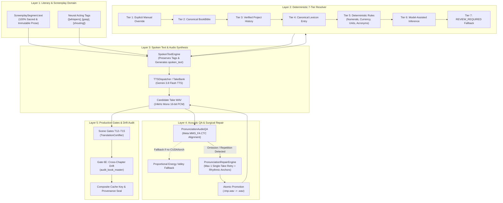
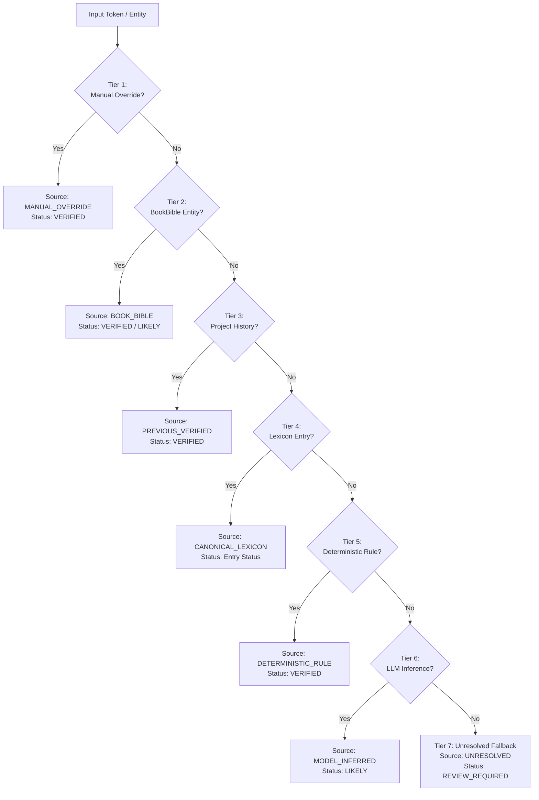
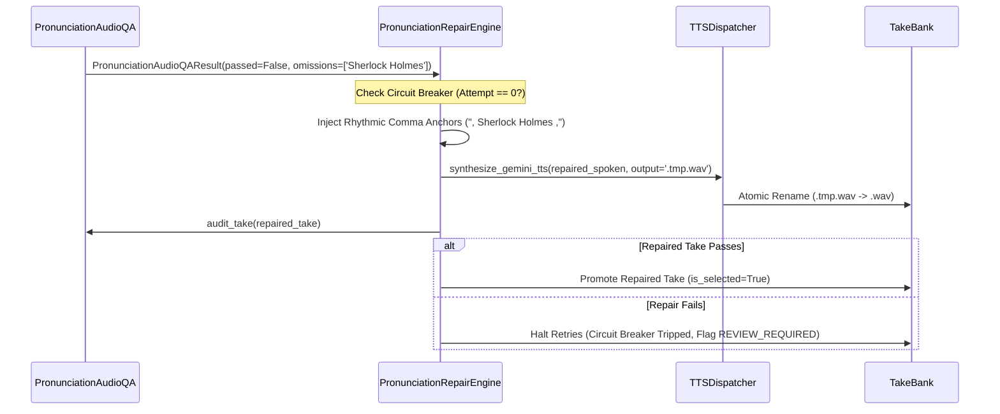

# 🗣️ Pronunciation & Spoken Language QA Subsystem (ADR-022)

> **Architectural Specification, Dual-Layer Text Decoupling, Deterministic 7-Tier Resolution, Acoustic Forced Alignment QA, Single-Take Surgical Repair, and Cross-Chapter Consistency Audit for Studio Audio Drama.**

---

## 📑 Table of Contents
1. [Executive Overview & Architectural Mission](#-executive-overview--architectural-mission)
2. [The 5 Historical Phonetic & Spoken Language Deficiencies Solved](#-the-5-historical-phonetic--spoken-language-deficiencies-solved)
3. [Dual-Layer Text Architecture: Sacred Prose vs. Spoken Text](#-dual-layer-text-architecture-sacred-prose-vs-spoken-text)
4. [Unicode-Safe Script & Language Classification](#-unicode-safe-script--language-classification)
5. [Deterministic 7-Tier Pronunciation Resolver](#-deterministic-7-tier-pronunciation-resolver)
6. [Protection of Neural Performance & Acting Tags](#-protection-of-neural-performance--acting-tags)
7. [Acoustic Pronunciation QA & CTC Forced Alignment](#-acoustic-pronunciation-qa--ctc-forced-alignment)
8. [Targeted Single-Take Repair Engine & Circuit Breaker](#-targeted-single-take-repair-engine--circuit-breaker)
9. [Cross-Chapter Pronunciation Drift Auditor](#-cross-chapter-pronunciation-drift-auditor)
10. [Production Quality Gates: Gates T12–T15 & Gate 6E](#-production-quality-gates-gates-t12t15--gate-6e)
11. [Lexicon Provenance & Composite Cache Invalidation](#-lexicon-provenance--composite-cache-invalidation)
12. [The Golden Pronunciation Regression Bank (20 Cases)](#-the-golden-pronunciation-regression-bank-20-cases)
13. [Verification & Test Matrix](#-verification--test-matrix)

---

## 🏛️ Executive Overview & Architectural Mission

In cinematic audio drama production, spoken intelligibility is as crucial as narrative adaptation and acoustic mixing. While Text-to-Speech (TTS) neural models like Google Gemini 3.8 Flash TTS exhibit remarkable natural prosody, they present acute phonetic challenges when handling multilingual, code-switched, historical, or fantasy literature:
- Non-standard foreign proper nouns (e.g. *Sherlock Holmes*, *Kaer Morhen*, *Xylopharius*) are often swallowed, misstressed, or mutilated into unintelligible phonemes.
- Numerals, compound units, percentages, and currencies (`₹500`, `$100`, `10km`, `25%`, `५००`) fail to expand or are read out in robotic digit-by-digit cadences.
- Acronyms (`FBI`, `CBI`, `VIP`) are pronounced as single unvoiced words (*"fbee"*, *"sbee"*) rather than initialisms.
- Complex Indian language textures—specifically the delicate boundary between **Perso-Arabic loanwords** (*nukta* consonants like क़, ख़, ग़, ज़, फ़) and **native Hindi retroflex flaps/Sanskrit conjuncts** (क्ष, त्र, ज्ञ, श्र)—are flattened or mispronounced.
- Prior attempts to solve pronunciation by mutating the underlying screenplay text corrupted reader-facing text, broken subtitles, and degraded literary fidelity.

The **Pronunciation & Spoken Language QA Subsystem** ([`audiobook_factory/pronunciation/`](file:///c:/Users/Suraj/Documents/Antigravity/Audiobook/audiobook_factory/pronunciation/)) resolves these challenges with zero literary corruption. It establishes an absolute architectural decoupling between **sacred literary text** and **TTS spoken text**, enforces an auditable **Deterministic 7-Tier Resolver**, verifies synthesized WAV audio via **Meta MMS_FA CTC Forced Alignment**, executes **targeted single-take repairs** bounded by circuit breakers, and seals project-wide consistency with **Gates T12–T15** and **Gate 6E**.



---

## 🚫 The 5 Historical Phonetic & Spoken Language Deficiencies Solved

Prior to this subsystem (ADR-022), production encountered five critical failure modes:

| Defect # | Historical Failure Mode | Production Impact | How It Is Resolved in ADR-022 |
|:---:|---|---|---|
| **D1** | **Text-Pronunciation Conflation** | Mutating screenplay text to help TTS (e.g. changing `"Sherlock Holmes"` to `"शरलॉक होम्स"` in the screenplay) corrupted reader-facing subtitles, TOC displays, and original authorial prose. | **Dual-Layer Text Decoupling**: `ScreenplaySegment.text` remains 100% immutable. A distinct `ScreenplaySegment.spoken_text` and `pronunciation_metadata` ledger are generated strictly for TTS payload delivery. |
| **D2** | **Script & Phonetic Flattening** | Perso-Arabic loanword phonemes (*nukta* like ज़, ख़, ग़) and Sanskrit conjuncts (ज्ञ, त्र) were stripped or improperly assimilated by naive regexes, eroding authentic Hindustani literary texture. | **Unicode-Safe Script Classifier & Option 1A Hybrid Mode**: Precise classification of Devanagari, Latin, and Nukta patterns with character-level protection. |
| **D3** | **Neural Acting Tag Corruption** | Brittle phonemizers and transliterators attempted to translate or phonetically expand bracketed theatrical directives like `[whispers]` into spoken dialogue (*"विस्पर्स"*). | **Acting Tag Verbatim Pass-Through**: Regex chunking isolates bracketed acting tags (`ACTING_TAG_PATTERN`), shielding them from phonetic mutation. |
| **D4** | **Acoustic Blindness & Swallowed Tokens** | TTS models occasionally swallowed unfamiliar foreign words or entered infinite stutter loops (>1.5s per syllable) without any automated detection. | **Meta MMS_FA CTC Alignment QA**: Frame-accurate token duration calculation detects swallowed tokens ($< \max(60, \text{syllables} \times 45)\text{ms}$) or stutter repetitions ($> \max(1200, \text{syllables} \times 350)\text{ms}$). |
| **D5** | **Cross-Chapter Phonetic Drift** | A recurring character or lore entity was pronounced differently across chapters (e.g., Chapter 1: *गेराल्ट*, Chapter 4: *जेराल्ड*), destroying narrative continuity. | **Cross-Chapter Pronunciation Consistency Auditor (Gate 6E)**: Cross-examines all script segments across the entire book, flagging any unauthorized phonetic variance. |

---

## 📄 Dual-Layer Text Architecture: Sacred Prose vs. Spoken Text

A cardinal principle of **Audiobook Maker v4.0** is the **Sacred Spoken Text Immutability Guarantee**. Screenplay scripts serve dual consumers:
1. **Visual / Archival Consumers:** Subtitles, Table of Contents, screen displays, and human readers require pristine, verbatim literary prose matching the source translation.
2. **Audio Synthesis Consumers:** Generative neural vocoders require phonetic guides, Devanagari transliterations for foreign names, expanded numerals, and micro-pause anchors.

To reconcile these requirements without compromise, [`contracts.py`](file:///c:/Users/Suraj/Documents/Antigravity/Audiobook/audiobook_factory/pronunciation/contracts.py) and [`spoken_text.py`](file:///c:/Users/Suraj/Documents/Antigravity/Audiobook/audiobook_factory/pronunciation/spoken_text.py) implement a decoupled dual-layer text model:

```python
class SpokenTextResult(BaseModel):
    literary_text: str           # Original literary prose (strictly immutable)
    display_text: str            # Clean text stripped of neural acting tags (for subtitles/TOC)
    spoken_text: str             # Normalized and phonetically resolved string sent to TTS
    resolutions: List[PronunciationResolutionResult]  # Audit records for every resolved token
    has_unresolved_critical: bool
    requires_review: bool
```

### Invariant Guarantees
1. **Prose Immutability:** `ScreenplaySegment.text == original_text` is mathematically proven by assertion across all transformations.
2. **Dedicated Delivery Target:** `ScreenplaySegment.spoken_text` is populated with the resolved spoken form. If no transformation is applied, `spoken_text` defaults safely to `text`.
3. **Traceable Metadata Ledger:** `ScreenplaySegment.pronunciation_metadata` records the exact origin tier, confidence status, and explanation for every transformed token.

---

## 🔤 Unicode-Safe Script & Language Classification

Language identification operates at both token and sentence levels via [`language_detector.py`](file:///c:/Users/Suraj/Documents/Antigravity/Audiobook/audiobook_factory/pronunciation/language_detector.py) and [`code_switch.py`](file:///c:/Users/Suraj/Documents/Antigravity/Audiobook/audiobook_factory/pronunciation/code_switch.py):

### 1. Unicode Range Mapping
- **Devanagari Range:** `re.compile(r"[\u0900-\u097F]")`
- **Latin Range:** `re.compile(r"[a-zA-Z]")`
- **Nukta Combining Mark:** `\u093c` (combining dot below)

### 2. Lexical & Dialectal Texture Classification
Devanagari words are analyzed for origin texture:
- **Urdu / Perso-Arabic Loanwords:** Detected via nukta characters (`क़`, `ख़`, `ग़`, `ज़`, `फ़`) and high-frequency lexical markers (`"ख़ुद"`, `"ज़िंदगी"`, `"इश्क़"`, `"वक़्त"`, `"ग़म"`, `"महफ़िल"`, `"तस्वीर"`). Classified as [`SpokenLanguage.URDU`](file:///c:/Users/Suraj/Documents/Antigravity/Audiobook/audiobook_factory/pronunciation/contracts.py#L48).
- **Sanskrit Tatsama & Conjuncts:** Detected via conjunct patterns (`क्ष`, `त्र`, `ज्ञ`, `श्र`, `ऋ`, `ष`) and philosophical markers (`"प्रतीक्षा"`, `"दृष्टि"`, `"क्षण"`, `"समस्त"`, `"मोक्ष"`, `"अस्तित्व"`). Classified as [`SpokenLanguage.SANSKRIT`](file:///c:/Users/Suraj/Documents/Antigravity/Audiobook/audiobook_factory/pronunciation/contracts.py#L47).
- **Native Hindi:** General Devanagari vocabulary containing standard retroflex consonants (`ड़`, `ढ़`, `ट`, `ठ`, `ड`, `ढ`). Classified as [`SpokenLanguage.HINDI`](file:///c:/Users/Suraj/Documents/Antigravity/Audiobook/audiobook_factory/pronunciation/contracts.py#L44).

### 3. Option 1A Hybrid Code-Switch Policy
For mixed Hindi-English sentences, [`CodeSwitchEngine`](file:///c:/Users/Suraj/Documents/Antigravity/Audiobook/audiobook_factory/pronunciation/code_switch.py#L23-L83) enforces **Option 1A Hybrid Mode**:
- **Foreign Proper Nouns:** Rendered with phonetic Devanagari guide in `spoken_text` (`"Sherlock Holmes"` $\rightarrow$ `"शरलॉक होम्स"`) while literary prose in `text` retains `"Sherlock Holmes"`. Policy: `PronunciationPolicy.PHONETIC_RESPELLED`.
- **Integrated Hindustani Loanwords:** Familiar terms (`doctor`, `hospital`, `police`, `captain`, `whiskey`, `station`, `road`) pass through with colloquial natural cadence without forced artificial Sanskritization. Policy: `PronunciationPolicy.DESI_COLLOQUIAL`.
- **Pure Target Tokens:** Delivered strictly as written. Policy: `PronunciationPolicy.STRICT_CANONICAL`.

---

## 🎯 Deterministic 7-Tier Pronunciation Resolver

The [`PronunciationResolver`](file:///c:/Users/Suraj/Documents/Antigravity/Audiobook/audiobook_factory/pronunciation/resolver.py#L92-L336) operates across a strict 7-tier precedence hierarchy. The resolver stops at the first successful match, logging explicit provenance:



### The 7 Resolution Tiers in Detail

#### Tier 1: Explicit Manual / Book-Level Override
- **Origin:** Project-level overrides in `lexicon.overrides`.
- **Authority:** Absolute priority. Overrides all automated inferences and BookBible defaults.
- **Status:** [`PronunciationStatus.VERIFIED`](file:///c:/Users/Suraj/Documents/Antigravity/Audiobook/audiobook_factory/pronunciation/contracts.py#L20).

#### Tier 2: Canonical Book Bible Entity
- **Origin:** Synchronized from [`BookBible`](file:///c:/Users/Suraj/Documents/Antigravity/Audiobook/audiobook_factory/translation/book_bible.py) characters, locations, organizations, creatures, and terminology.
- **Authority:** Resolves canonical names and aliases established during story worldbuilding.
- **Status:** `VERIFIED` if explicit `pronunciation_hint` is set; `LIKELY` otherwise.

#### Tier 3: Previously Verified Pronunciation in Project History
- **Origin:** Dynamic in-memory project history cache (`resolver.verified_history`).
- **Authority:** Reuses verified pronunciations from earlier chapters or scenes in the same book, ensuring immediate inter-chapter consistency.
- **Status:** `VERIFIED`.

#### Tier 4: Known Pronunciation Lexicon Entry
- **Origin:** Project canonical dictionary loaded from `pronunciation_lexicon.json`.
- **Authority:** Matches canonical IDs, exact text, aliases, or normalized surface forms.
- **Status:** Inherits entry status (`VERIFIED`, `LIKELY`, `UNCERTAIN`).

#### Tier 5: Language-Specific Deterministic Rules
Executes mathematical expansion without LLM non-determinism:
1. **Currencies:**
   - `₹500` $\rightarrow$ `"पाँच सौ रुपये"`
   - `$100` $\rightarrow$ `"सौ डॉलर"`
2. **Percentages:**
   - `25%` $\rightarrow$ `"पच्चीस प्रतिशत"`
3. **Devanagari Numerals:**
   - `५००` $\rightarrow$ Latin `500` $\rightarrow$ `"पाँच सौ"`
4. **Latin Numerals:**
   - Integers up to 100,000,000 expanded via [`number_to_hindi_words()`](file:///c:/Users/Suraj/Documents/Antigravity/Audiobook/audiobook_factory/pronunciation/resolver.py#L58-L90) (`25` $\rightarrow$ `"पच्चीस"`, `100000000` $\rightarrow$ `"दस करोड़"`).
5. **Compound Units:**
   - `10km` $\rightarrow$ `"दस किलोमीटर"`
   - `5kg` $\rightarrow$ `"पाँच किलोग्राम"`
   - `2hr` $\rightarrow$ `"दो घंटे"`
6. **Acronyms & Initialisms:**
   - `FBI` $\rightarrow$ `"एफ़.बी.आई."`
   - `CBI` $\rightarrow$ `"सी.बी.आई."`
   - `VIP` $\rightarrow$ `"वी.आई.पी."`

#### Tier 6: Model-Assisted Inference
- **Origin:** Optional LLM callable invoked strictly when an unknown foreign/complex proper noun ($> 3$ chars) appears in Hindi narrative.
- **Prompting:** Instructs model to emit *only* the phonetic Devanagari spelling optimized for Google Gemini Hindi TTS.
- **Status:** [`PronunciationStatus.LIKELY`](file:///c:/Users/Suraj/Documents/Antigravity/Audiobook/audiobook_factory/pronunciation/contracts.py#L21).

#### Tier 7: Unresolved Fallback (Review Required)
- **Origin:** Unknown complex or foreign tokens that cannot be resolved deterministically.
- **Safety Guarantee:** Emits [`PronunciationStatus.REVIEW_REQUIRED`](file:///c:/Users/Suraj/Documents/Antigravity/Audiobook/audiobook_factory/pronunciation/contracts.py#L24) and sets `requires_review=True`.
- **Zero Silent Failure:** Never silently marks unverified foreign tokens as certified.

---

## 🛡️ Protection of Neural Performance & Acting Tags

Generative TTS models like Gemini 3.8 Flash interpret bracketed acting cues (e.g., `[whispers]`, `[gasp]`, `[shouting]`, `[sighs]`, `[growl]`) as non-verbal vocal directives rather than spoken words. Naive phoneticizers often mutilate these tags into spoken text.

[`SpokenTextEngine`](file:///c:/Users/Suraj/Documents/Antigravity/Audiobook/audiobook_factory/pronunciation/spoken_text.py#L25-L121) deploys the **Acting Tag Protection Pattern**:
```python
ACTING_TAG_PATTERN = re.compile(r"(\[[^\]]+\])")
```
- The text is split into alternating `[acting_tag, non_tag, acting_tag]` tokens.
- Bracketed segments are passed through **verbatim** with zero phonetic substitution or delimiter stripping.
- Only the pure non-tag dialogue chunks undergo token resolution.
- Display text generation (`display_text`) cleanly strips acting tags for subtitle and reading use.

---

## 🎧 Acoustic Pronunciation QA & CTC Forced Alignment

Generating the correct phonetic plan in text is only half the battle; the TTS model must actually vocalize the phonemes accurately. The [`PronunciationAudioQA`](file:///c:/Users/Suraj/Documents/Antigravity/Audiobook/audiobook_factory/pronunciation/auditor.py#L30-L217) auditor performs post-synthesis acoustic verification.

### Alignment Architecture
1. **Primary CTC Alignment (Meta MMS_FA):**
   - Transliterates spoken Devanagari text to Roman phonetic tokens via [`transliterate_devanagari_to_roman()`](file:///c:/Users/Suraj/Documents/Antigravity/Audiobook/audiobook_factory/forced_aligner.py#L21-L22).
   - Loads audio waveform tensor and runs CTC inference via [`WorkstationForcedAligner`](file:///c:/Users/Suraj/Documents/Antigravity/Audiobook/audiobook_factory/forced_aligner.py) on GPU (or CPU).
   - Extracts frame-level start and end spans (`start_ms`, `end_ms`, `duration_ms`) for each spoken word.
2. **Proportional Energy Valley Fallback:**
   - If PyTorch or MMS_FA models are unavailable, or if CTC emissions fail, gracefully falls back to duration-weighted energy valley approximation, ensuring 100% offline testability.

### Forensic Telemetry Evaluators
For each sensitive entity, `PronunciationAudioQA` evaluates:
- **Swallowed / Omitted Token Floor:**
  $$\text{min\_expected\_duration\_ms} = \max(60, \text{syllable\_count} \times 45)$$
  If the observed duration falls below this threshold, the token was swallowed or dropped by the TTS vocoder. Emits failure: `omissions.append(...)`.
- **Stutter / Repetition Ceiling:**
  $$\text{max\_expected\_duration\_ms} = \max(1200, \text{syllable\_count} \times 350)$$
  If the observed duration exceeds this ceiling, the vocoder entered an unnatural repeating or dragging stutter. Emits failure: `repetitions.append(...)`.
- **Overall Speech Cadence:**
  Flags dialogue rushed at $> 6.0\text{ words/sec}$ or dragged at $< 1.0\text{ words/sec}$.

---

## 🔧 Targeted Single-Take Repair Engine & Circuit Breaker

When `PronunciationAudioQA` detects an omission or duration anomaly, regeneration of the entire chapter or even the entire scene would waste expensive API quota. The [`PronunciationRepairEngine`](file:///c:/Users/Suraj/Documents/Antigravity/Audiobook/audiobook_factory/pronunciation/repair.py#L25-L188) coordinates a surgical single-take retry.



### Key Engineering Safeguards
1. **Strict Circuit Breaker (Max 1 Retry):**
   - The repair engine checks `failed_take.take_id.endswith("_repair_pron")` or `variant_type == "alternative_cadence"`.
   - If a take is already a repair attempt, the circuit breaker trips immediately. Zero infinite retry loops.
2. **Rhythmic Acoustic Anchor Injection:**
   - Swallowed tokens are buffered with gentle micro-pauses (breathing commas): `re.sub(r"(?<!,)\b(token)\b(?!,)", r", \1 ,", text)`.
   - Punctuation collisions (e.g. `", ."`, `", !"`, `",,"`) are sanitized cleanly.
   - This provides the neural vocoder with the acoustic onset time necessary to articulate the initial consonant.
3. **Atomic WAV Synthesis:**
   - Repaired audio synthesizes to `cXXX_sXXXX_repair_pron.tmp.wav`.
   - The file is promoted to `.wav` via `tmp_repair_path.replace(repair_take_path)` only after synthesis succeeds, preventing orphan partial files.
4. **Selective Take Promotion:**
   - The repaired take is evaluated with `PronunciationAudioQA`. If it passes or reduces omissions, it replaces the failed take in `TakeBank`. Otherwise, the baseline take is retained with status `REVIEW_REQUIRED`.

---

## 🔍 Cross-Chapter Pronunciation Drift Auditor

Narrative continuity requires that names and proper nouns retain identical pronunciation throughout the entire book. The [`CrossChapterConsistencyAuditor`](file:///c:/Users/Suraj/Documents/Antigravity/Audiobook/audiobook_factory/pronunciation/consistency.py#L18-L119) verifies this requirement across all chapters:

### Audit Operation
1. Scans all `scripts/chapter_*_script.json` files in the project.
2. Aggregates all occurrences of entities from `segment.pronunciation_metadata`.
3. If an entity appears across multiple chapters with differing `resolved_spoken` strings (e.g. Chapter 1: `"गेराल्ट"` vs Chapter 4: `"गेराल्ड"`), it is flagged as a drift defect.
4. **Intentional Contextual Exceptions:**
   Supports an `allowed_exceptions: Dict[str, str]` registry. For example, if a character intentionally disguises their name in Chapter 3, an exception is recorded with documented rationale, preventing false failures.

---

## 🛡️ Production Quality Gates: Gates T12–T15 & Gate 6E

The Pronunciation Subsystem integrates directly into the production certification suite at both scene and whole-book levels:

| Gate | Name | Level | Scope | Mandatory vs. Advisory | Audit Logic & Criteria |
|:---:|---|:---:|:---:|:---:|---|
| **Gate T12** | **Spoken Language & Code-Switch QA** | Scene | Pre-Synthesis | Advisory (`WARN`) | Evaluates sentence script balance (`classify_sentence_language`). Emits `WARN` if Latin script ratio $> 45\%$ in translated Hindi narrative without justified code-switching. |
| **Gate T13** | **Pronunciation Plan & Entity Determinism** | Scene | Pre-Synthesis | **Critical Mandatory** (`FAIL` / `BLOCKED`) | Resolves all sensitive tokens against the 7-tier hierarchy. If any entity has status `FAILED`, fails closed (`FAIL`). If entities are unresolved or require human review, issues `WARN`. Blocks certification if unhealed. |
| **Gate T14** | **Pronunciation Audio QA & Acoustic Alignment** | Scene / Take | Post-Synthesis Pre-Mix | Advisory (`WARN`) | Executes `PronunciationAudioQA.audit_take()` on synthesized audio takes. Flags omissions, swallowed tokens, vocoder stutter loops, and rushed cadences. |
| **Gate T15** | **Cross-Chapter Pronunciation Consistency (Scene)** | Scene | Post-Synthesis | Advisory (`WARN`) | Scans project history to ensure entities in the current scene do not conflict with earlier chapters. Emits `WARN` on unexempted drifts. |
| **Gate 6E** | **Cross-Chapter Pronunciation Consistency (Master)** | Book Master | Pre-Packaging | **Critical Mandatory** (`FAIL`) | Audits all chapters across the completed project via [`audit_book_master()`](file:///c:/Users/Suraj/Documents/Antigravity/Audiobook/audiobook_factory/gate_auditor.py#L1623-L1647). Any unexempted pronunciation drift fails closed, halting `.m4b` container packaging. |

---

## 🔐 Lexicon Provenance & Composite Cache Invalidation

To guarantee reproducible builds, modifications to pronunciation rules must cleanly invalidate downstream cached takes without requiring full re-translations of unrelated scenes.

[`PronunciationProvenanceTracker`](file:///c:/Users/Suraj/Documents/Antigravity/Audiobook/audiobook_factory/pronunciation/provenance.py#L18-L71) computes a deterministic 16-character SHA-256 hash across all active lexicon entries:
```python
clean_state = {
    cid: {
        "canonical_text": e.canonical_text,
        "spoken_form": e.spoken_form,
        "pronunciation_hint": e.pronunciation_hint,
        "status": e.status.value,
        "source": e.source.value,
        "version": e.version,
    }
    for cid, e in sorted(lexicon_entries.items())
}
lexicon_hash = hashlib.sha256(json.dumps(clean_state, sort_keys=True).encode("utf-8")).hexdigest()[:16]
```

This hash is sealed into the 11-dimension Translation Provenance composite cache key:
$$\text{key} = \text{SHA256}(\dots : \text{bible\_version\_hash} : \text{pronunciation\_hash} : \text{repair\_version} : \dots)$$
If a director alters an entity's spoken form in `pronunciation_lexicon.json`, the composite cache key mutates automatically, invalidating stale downstream audio takes while preserving cached upstream translation maps.

---

## 🏆 The Golden Pronunciation Regression Bank (20 Cases)

The repository maintains a permanent, regression-tested Golden Pronunciation Suite ([`golden_set.py`](file:///c:/Users/Suraj/Documents/Antigravity/Audiobook/audiobook_factory/pronunciation/golden_set.py)) covering all 8 sensitive linguistic categories:

| ID | Category | Literary Input Text | Expected Spoken Representation | Language |
|:---:|---|---|---|:---:|
| `gold_01` | Indian Mythological | युधिष्ठिर ने मौन धारण कर लिया। | `"युधिष्ठिर"` | `HINDI` |
| `gold_02` | Indian Mythological | अश्वत्थामा ने प्रतिज्ञा ली। | `"अश्वत्थामा"` | `HINDI` |
| `gold_03` | English in Hindi Dialogue | उसने कहा, “Sherlock Holmes यहाँ आया था।” | `"शरलॉक होम्स"` | `ENGLISH` |
| `gold_04` | English in Hindi Dialogue | कमरे में Dr. Watson बैठे थे। | `"डॉक्टर वॉटसन"` | `ENGLISH` |
| `gold_05` | Sanskrit Tatsama | उसे मोक्ष की प्राप्ति नहीं हुई। | `"मोक्ष"` | `SANSKRIT` |
| `gold_06` | Sanskrit Tatsama | संपूर्ण अस्तित्व उस एक क्षण पर टिका था। | `"अस्तित्व"` | `SANSKRIT` |
| `gold_07` | Urdu Nukta Preservation | यह ज़िंदगी बहुत अजीब है। | `"ज़िंदगी"` | `URDU` |
| `gold_08` | Urdu Nukta Preservation | वक़्त किसी का इंतज़ार नहीं करता। | `"वक़्त"` | `URDU` |
| `gold_09` | Foreign Fantasy Place | वे Kaer Morhen की ओर बढ़े। | `"केर मॉरहेन"` | `FOREIGN` |
| `gold_10` | Acronym Initialism | FBI के एजेंट बाहर खड़े थे। | `"एफ़.बी.आई."` | `ENGLISH` |
| `gold_11` | Acronym Initialism | मामला CBI को सौंप दिया गया। | `"सी.बी.आई."` | `HINDI` |
| `gold_12` | Acronym Initialism | वह एक VIP मेहमान था। | `"वी.आई.पी."` | `ENGLISH` |
| `gold_13` | Currency (Rupee) | उसने ₹500 दिए। | `"पाँच सौ रुपये"` | `HINDI` |
| `gold_14` | Currency (Dollar) | कीमत $100 थी। | `"सौ डॉलर"` | `HINDI` |
| `gold_15` | Percentage | मुनाफ़ा 25% बढ़ गया। | `"पच्चीस प्रतिशत"` | `HINDI` |
| `gold_16` | Compound Units | किला यहाँ से 10km दूर है। | `"दस किलोमीटर"` | `HINDI` |
| `gold_17` | Devanagari Numerals | अध्याय ५ समाप्त हुआ। | `"पाँच"` | `HINDI` |
| `gold_18` | Code-Switching | Doctor ने कहा कि वह बच जाएगा। | `"Doctor"` | `ENGLISH` |
| `gold_19` | Code-Switching | गाड़ी Station पर रुक गई। | `"Station"` | `ENGLISH` |
| `gold_20` | Acting Tag Protection | [whispers] वह चुपके से बोला। | `"[whispers]"` | `HINDI` |

The test suite [`tests/pronunciation/test_golden_pronunciation_cases.py`](file:///c:/Users/Suraj/Documents/Antigravity/Audiobook/tests/pronunciation/test_golden_pronunciation_cases.py) runs on every CI/commit, asserting 20/20 cases pass with 100% precision.

---

## 🧪 Verification & Test Matrix

The Pronunciation & Spoken Language QA subsystem is validated across 6 dedicated test modules:

| Test Module | Coverage Scope | Status |
|---|---|:---:|
| [`tests/pronunciation/test_end_to_end_pronunciation_integration.py`](file:///c:/Users/Suraj/Documents/Antigravity/Audiobook/tests/pronunciation/test_end_to_end_pronunciation_integration.py) | Full 6-stage lifecycle (BookBible $\rightarrow$ Lexicon $\rightarrow$ Resolver $\rightarrow$ SpokenTextEngine $\rightarrow$ TTSDispatcher $\rightarrow$ Audio QA $\rightarrow$ Repair $\rightarrow$ Gates T0–T15 $\rightarrow$ Gate 6E) | **PASSED** |
| [`tests/pronunciation/test_golden_pronunciation_cases.py`](file:///c:/Users/Suraj/Documents/Antigravity/Audiobook/tests/pronunciation/test_golden_pronunciation_cases.py) | The 20 golden regression cases covering all 8 linguistic dimensions | **PASSED (20/20)** |
| [`tests/pronunciation/test_pronunciation_contracts.py`](file:///c:/Users/Suraj/Documents/Antigravity/Audiobook/tests/pronunciation/test_pronunciation_contracts.py) | Pydantic v2 schemas, immutability guarantees, serializations | **PASSED** |
| [`tests/pronunciation/test_pronunciation_nlp_audit.py`](file:///c:/Users/Suraj/Documents/Antigravity/Audiobook/tests/pronunciation/test_pronunciation_nlp_audit.py) | Script detection, nukta phonemes, Sanskrit conjuncts, multi-word matching order | **PASSED** |
| [`tests/pronunciation/test_pronunciation_resolver.py`](file:///c:/Users/Suraj/Documents/Antigravity/Audiobook/tests/pronunciation/test_pronunciation_resolver.py) | 7-tier deterministic resolver precedence, currencies, numerals, units, acronyms | **PASSED** |
| [`tests/pronunciation/test_certification_gates.py`](file:///c:/Users/Suraj/Documents/Antigravity/Audiobook/tests/pronunciation/test_certification_gates.py) | TranslationCertifier integration for Gates T12, T13, T14, T15 | **PASSED** |

---

## 🚀 Programmatic Usage Reference

```python
from audiobook_factory.pronunciation import (
    PronunciationLexicon,
    PronunciationResolver,
    SpokenTextEngine,
    PronunciationAudioQA,
    PronunciationRepairEngine,
)

# 1. Initialize Lexicon & Resolver
lexicon = PronunciationLexicon.load_or_create(project_dir, book_bible=bible)
resolver = PronunciationResolver(lexicon=lexicon, book_bible=bible)
spoken_engine = SpokenTextEngine(resolver=resolver)

# 2. Transform screenplay segment (Leaves segment.text 100% immutable)
segment_res = spoken_engine.resolve_screenplay_segment(segment)
tts_payload_text = segment_res.spoken_text

# 3. Post-synthesis acoustic audit
auditor = PronunciationAudioQA()
qa_report = auditor.audit_take(take_path, spoken_result=segment_res)

# 4. Surgical single-take repair if needed
if not qa_report.passed:
    repair_engine = PronunciationRepairEngine(auditor=auditor)
    repaired_take = repair_engine.attempt_repair(
        dispatcher=dispatcher,
        segment=segment,
        failed_take=winning_take,
        qa_result=qa_report,
        chapter_num=1,
        seg_num=1,
    )
```
