# 🛡️ Quality Gates: The Independent Verification Protocol

## Overview

A core pillar of **Audiobook Maker v4.0** is the **Multi-Gate Independent Verification Protocol**. In production audio engineering, catching defects early prevents expensive downstream rework and saves generative AI API quota.

The verification system spans **Gates 0 through 6D**, auditing every artifact from raw translated text to final chapterized `.m4b` delivery.

```mermaid
flowchart LR
    G0["Gate 0:<br/>Translation"] --> G1["Gate 1:<br/>Voice Roster"]
    G1 --> G2["Gate 2:<br/>Screenplay"]
    G2 --> G3["Gate 3 / 3.5:<br/>Manifest Feasibility"]
    G3 --> G45["Gate 4.5:<br/>Timeline Ledger"]
    G45 --> G52["Gate 5.2:<br/>Spectral Masking"]
    G52 --> G53["Gate 5.3:<br/>Stereo Phase"]
    G53 --> G5["Gate 5:<br/>Broadcast Master"]
    G5 --> G6A["Gate 6A:<br/>Voice Continuity"]
    G6A --> G6B["Gate 6B:<br/>Loudness Continuity"]
    G6B --> G6C["Gate 6C:<br/>TOC Monotonicity"]
    G6C --> G6D["Gate 6D:<br/>M4B Specs"]
```



---

## 📋 Comprehensive Quality Gate Specifications

### Gate 0: Source Text & Translation Coverage
- **Function**: `audit_gate0_translation(extracted_file: Path, translation_file: Path) -> Dict[str, Any]`
- **Module**: [`audiobook_factory/gate_auditor.py`](file:///c:/Users/Suraj/Documents/Antigravity/Audiobook/audiobook_factory/gate_auditor.py)
- **Pipeline Stage**: Inline execution after Stage 2 (Translation).
- **Audit Rules**:
  - Both source and target text files must exist and exceed minimum word count ($> 50$ words).
  - Character and word count ratio between translation and source must fall within $0.50$ and $2.20$.
  - Catches empty translations, truncated chapters, or hallucinated runaway text loops.
- **Fail Condition**: Raises `GateAuditError` if text is truncated or missing.

---

### Gate 1: Character Voice Casting & Collision Elimination
- **Function**: `audit_gate1_roster(roster_file, registry_file, active_characters=None) -> Dict[str, Any]`
- **Module**: [`audiobook_factory/gate_auditor.py`](file:///c:/Users/Suraj/Documents/Antigravity/Audiobook/audiobook_factory/gate_auditor.py)
- **Pipeline Stage**: Inline execution after Stage 3 (Screenplay Script Generation).
- **Audit Rules**:
  - Every character present in the chapter screenplay must have an entry in `character_roster.json` and `voice_registry.json`.
  - Computes acoustic voice signature: `sig = f"{voice}_p{pitch:.2f}_s{speed:.2f}"`.
  - **Zero Voice Collision Mandate**: No two active characters in the same project can share the exact same voice signature unless explicitly configured as ensemble crowd voices.
- **Fail Condition**: Raises `GateAuditError` detailing conflicting characters (e.g. `Harry vs Ron (Puck_p1.00_s1.00)`).

---

### Gate 2: Screenplay Scripting Schema & Prosody
- **Functions**: `audit_gate2_script(script_file) -> Dict[str, Any]`, `audit_gate2_prosody(script_file) -> Dict[str, Any]`
- **Module**: [`audiobook_factory/gate_auditor.py`](file:///c:/Users/Suraj/Documents/Antigravity/Audiobook/audiobook_factory/gate_auditor.py)
- **Pipeline Stage**: Executed at beginning of `produce_chapter`.
- **Audit Rules**:
  - Validates full Pydantic v2 schema compliance with `ScreenplayScript`.
  - Asserts that all segment indices are monotonically sequential starting at 1.
  - Ensures no segment text is empty or whitespace-only.
  - Evaluates emotional prosody: checks that emotional lines possess either punctuation cadence (`...`, `!`, `—`), SSML vocal tags, or acting delivery style instructions.
- **Fail Condition**: Raises `GateAuditError` on schema corruption or missing keys.

---

### Gate 3 & Gate 3.5: Dynamic Manifest Feasibility & Scene Coverage
- **Functions**: `audit_chapter_gates(project_dir: Path, chapter_num: int)`, `audit_gate3_5_acoustic_feasibility(manifest: CreativeManifest, sound_bank: Optional[SoundBank] = None) -> AuditResult`, `audit_gate3_scenes(scenes_file: Path, script_file: Path) -> Dict[str, Any]`
- **Module**: [`audiobook_factory/gate_auditor.py`](file:///c:/Users/Suraj/Documents/Antigravity/Audiobook/audiobook_factory/gate_auditor.py)
- **Pipeline Stage**: Executed immediately after `AgentDirector` emits a `CreativeManifest` or scene breakdown, before any FFmpeg audio rendering begins.
- **Dynamic Resolution Logic**:
  - **Modern Manifest Path**: If `manifests/chapter_XXX_manifest.json` exists, validates acoustic silence ($\ge 60.0\%$), asset file availability on disk in Sound Bank, and timeline monotonicity.
  - **Legacy Scene Source Path**: If `chapter_XXX_scenes_source.json` exists, verifies dramatic acts and segment coverage against the script.
  - **Director-Managed Autonomous Path**: If neither legacy file exists, verifies script segment coverage and emits `status: PASS` with `type: "director_managed"`. This eliminates brittle pipeline failures when running modern agent-directed workflows.
- **Fail Condition**: Raises `GateAuditError` if silence mandate is violated, missing assets exceed threshold, or dramatic segments are discontinuous.

---

### Gate 4.5: Master Timeline & Audio Transcript Ledger
- **Function**: `audit_gate4_ledger(ledger_file: Path, script_file: Path, audio_dir: Path) -> Dict[str, Any]`
- **Module**: [`audiobook_factory/gate_auditor.py`](file:///c:/Users/Suraj/Documents/Antigravity/Audiobook/audiobook_factory/gate_auditor.py)
- **Pipeline Stage**: Executed during timeline assembly and certified in `produce_chapter`.
- **Audit Rules**:
  - Inspects canonical `scripts/chapter_XXX_timeline_ledger.json` (mirrored to `soundscapes/`).
  - **Monotonicity**: Asserts that each segment's `start_ms` is strictly greater than or equal to the previous segment's `end_ms`.
  - **Text Preservation**: Compares speech transcripts in the ledger with the screenplay script, flagging any text truncation or divergence.
  - **Physical Chunk Validation**: Verifies that every referenced `cXXX_sYYYY_voice.wav` chunk exists on disk in `audio_chunks/` and exceeds $1,000$ bytes (not corrupt or 0-byte header).
- **Fail Condition**: Raises `GateAuditError` on overlapping timestamps, text divergence, or missing WAV chunks.

---

### Gate 5: Broadcast Master EBU R128 Probe
- **Function**: `audit_gate5_master(master_file: Path, target_lufs: float = -19.0, tolerance_lu: float = 1.0, max_true_peak: float = -1.4) -> Dict[str, Any]`
- **Module**: [`audiobook_factory/gate_auditor.py`](file:///c:/Users/Suraj/Documents/Antigravity/Audiobook/audiobook_factory/gate_auditor.py)
- **Pipeline Stage**: Executed after chapter mastering.
- **Audit Rules**:
  - Probes the rendered master file using FFmpeg `ebur128=framelog=verbose`.
  - Measures Integrated Loudness ($I$ in LUFS) and True Peak ($TP$ in dBTP).
  - Asserts integrated loudness is within $target\_lufs \pm tolerance\_lu$ (standardized to $-19.0 \pm 1.0\text{ LU}$ across Gate 5 and Gate 6B).
  - Asserts true peak does not exceed ceiling $-1.4\text{ dBTP}$ (preventing inter-sample clipping on MP3/AAC encoders).
- **Fail Condition**: Raises `GateAuditError` if probe fails or audio violates loudness/peak ceilings.

---

### Gate 5.2: Spectral Masking (Dialogue-to-Music Ratio)
- **Function**: `audit_gate5_2_spectral_masking(dialogue_stem: Path, music_stem: Path, min_dmr_db: float = 12.0) -> AuditResult`
- **Module**: [`audiobook_factory/gate_auditor.py`](file:///c:/Users/Suraj/Documents/Antigravity/Audiobook/audiobook_factory/gate_auditor.py)
- **Pipeline Stage**: Executed on discrete stems in `produce_chapter`.
- **Audit Rules**:
  - Measures integrated loudness of both `stem_DX.wav` and `stem_MX.wav` within the critical human speech vocal corridor ($300\text{ Hz} - 3500\text{ Hz}$).
  - Computes Dialogue-to-Music Ratio: $\text{DMR} = \text{LUFS}_{\text{vocal}} - \text{LUFS}_{\text{music}}$.
  - Mandates $\text{DMR} \ge +12.0\text{ dB}$ whenever music underscores dialogue.
- **Fail Condition**: Returns `AuditResult(passed=False)` if music is loud enough in the mid-frequencies to mask voice intelligibility.

---

### Gate 5.3: Stereo Phase Correlation & Mono Compatibility Guard
- **Function**: `audit_gate5_3_stereo_phase(audio_file: Path, min_phase_correlation: float = 0.20) -> AuditResult`
- **Module**: [`audiobook_factory/gate_auditor.py`](file:///c:/Users/Suraj/Documents/Antigravity/Audiobook/audiobook_factory/gate_auditor.py)
- **Pipeline Stage**: Executed on final master and spatial dialogue stem.
- **Audit Rules**:
  - Probes stereo audio using FFmpeg `aphasemeter` filter.
  - Computes Pearson correlation coefficient $r \in [-1.0, +1.0]$ between Left and Right channels across all frames.
  - Mandates mean phase correlation $r \ge +0.20$ ($r \ge +0.85$ for spatial dialogue).
  - Prevents disastrous phase cancellation when listeners hear the audiobook on mono smart speakers, mobile phones, or single earbuds.
- **Fail Condition**: Returns `AuditResult(passed=False)` on negative correlation or phase inversion.

---

### Gate 6A: Voice Continuity Across Chapters
- **Function**: `audit_gate6a_voice_continuity(project_dir: Path) -> AuditResult`
- **Module**: [`audiobook_factory/gate_auditor.py`](file:///c:/Users/Suraj/Documents/Antigravity/Audiobook/audiobook_factory/gate_auditor.py)
- **Pipeline Stage**: Inline execution after screenplay generation across all chapters.
- **Audit Rules**:
  - Maps every character that speaks across multiple chapters.
  - Ensures the character has a persistent canonical voice assignment that does not mutate between Chapter 1, Chapter 2, etc.
- **Fail Condition**: Returns `AuditResult(passed=False)` if a character changes voice mid-book.

---

### Gate 6B: Loudness Continuity
- **Function**: `audit_gate6b_loudness_continuity(chapter_files: List[Path], target_lufs: float = -19.0, max_variance: float = 1.0, strict: bool = False) -> AuditResult`
- **Module**: [`audiobook_factory/gate_auditor.py`](file:///c:/Users/Suraj/Documents/Antigravity/Audiobook/audiobook_factory/gate_auditor.py)
- **Audit Rules**:
  - Probes all mastered chapter audio files.
  - Calculates inter-chapter variance: max deviation cannot exceed $1.0\text{ LU}$.
  - When `strict=True`, any probe failure or corrupt file fails-closed immediately.
- **Fail Condition**: Fails if volume jumps noticeably between consecutive chapters.

---

### Gate 6C: Table of Contents & Timeline Monotonicity
- **Function**: `audit_gate6c_toc_monotonicity(chapter_files_or_project_dir, toc=None) -> AuditResult`
- **Module**: [`audiobook_factory/gate_auditor.py`](file:///c:/Users/Suraj/Documents/Antigravity/Audiobook/audiobook_factory/gate_auditor.py)
- **Pipeline Stage**: Inline execution after Stage 6 M4B packaging.
- **Audit Rules**:
  - Verifies that chapter file counts match Table of Contents markers.
  - Validates strict timeline monotonicity: chapter start timestamps must be strictly non-overlapping ($start\_ms_{i+1} \ge end\_ms_i$).
  - Asserts that total duration matches the sum of individual chapter durations within $\pm 500\text{ ms}$.
- **Fail Condition**: Fails on overlapping markers, negative durations, or desynced seek tables.

---

### Gate 6D: Packaging & Container Specifications
- **Function**: `audit_gate6d_packaging_specs(cover_image: Optional[Path], specs: Optional[BookPackagingSpecs] = None) -> AuditResult`
- **Module**: [`audiobook_factory/gate_auditor.py`](file:///c:/Users/Suraj/Documents/Antigravity/Audiobook/audiobook_factory/gate_auditor.py)
- **Audit Rules**:
  - Verifies audio container settings: codec (`aac`), sample rate ($48,000\text{ Hz}$), channels ($2$ stereo).
  - Checks cover artwork resolution: minimum $1400 \times 1400$ square JPEG/PNG (Audible standard).
- **Fail Condition**: Fails on invalid image dimensions, aspect ratio distortion, or non-standard codecs.

---

## 🏃 Running Quality Gate Audits via CLI

You can audit any active project directory directly using the unified CLI:

```bash
# Full project master certification (Gates 6A, 6B, 6C, 6D)
python audiobook_cli.py audit audiobooks/projects/witcher1

# Verify individual chapter script compliance (Gate 2)
python audiobook_cli.py script audiobooks/projects/witcher1 --audit-only
```
