# 🛡️ Quality Gates: The Independent Verification Protocol

## Overview

A core pillar of **Audiobook Maker v4.0** is the **Multi-Gate Independent Verification Protocol**. In production audio engineering, catching defects early prevents expensive downstream rework and saves generative AI API quota.

The verification system spans **Gate 0.1**, **Translation & Spoken Language Gates T0 through T15**, and **Gates 0 through 6E**, auditing every artifact from raw source documents and canonical AST models through multi-pass literary translation, pronunciation planning, and performance realization to final chapterized `.m4b` delivery.

```mermaid
flowchart LR
    G01["Gate 0.1:<br/>Forensic Ingestion"] --> GT["Gates T0–T15:<br/>Translation & Spoken QA"]
    GT --> G0["Gate 0:<br/>Translation Parity"]
    G0 --> G1["Gate 1:<br/>Voice Roster"]
    G1 --> G2["Gate 2:<br/>Screenplay"]
    G2 --> G25["Gate 2.5:<br/>Dramatic Fidelity"]
    G25 --> G28["Gate 2.8:<br/>Performance Fidelity"]
    G28 --> G3["Gate 3 / 3.5:<br/>Manifest Feasibility"]
    G3 --> G45["Gate 4.5:<br/>Timeline Ledger"]
    G45 --> G52["Gate 5.2:<br/>Spectral Masking"]
    G52 --> G53["Gate 5.3:<br/>Stereo Phase"]
    G53 --> G5["Gate 5:<br/>Broadcast Master"]
    G5 --> G6A["Gate 6A:<br/>Voice Continuity"]
    G6A --> G6B["Gate 6B:<br/>Loudness Continuity"]
    G6B --> G6C["Gate 6C:<br/>TOC Monotonicity"]
    G6C --> G6D["Gate 6D:<br/>M4B Specs"]
    G6D --> G6E["Gate 6E:<br/>Pronunciation Consistency"]
```



---

## 📋 Comprehensive Quality Gate Specifications

### Gate 0.1: Forensic Document Extraction Quality Gate (Pillar 1)
- **Function**: `ExtractionQualityAuditor.audit(book: CanonicalBook, force_gate: bool = False) -> ExtractionQualityReport`
- **Modules**: [`audiobook_factory/quality_gate.py`](file:///c:/Users/Suraj/Documents/Antigravity/Audiobook/audiobook_factory/quality_gate.py), [`pdf_engine.py`](file:///c:/Users/Suraj/Documents/Antigravity/Audiobook/audiobook_factory/pdf_engine.py)
- **Data Models**: [`CanonicalBook`](file:///c:/Users/Suraj/Documents/Antigravity/Audiobook/audiobook_factory/book_model.py#L236-L355), [`ExtractionQualityReport`](file:///c:/Users/Suraj/Documents/Antigravity/Audiobook/audiobook_factory/book_model.py#L174-L235), [`ExtractionGateAuditError`](file:///c:/Users/Suraj/Documents/Antigravity/Audiobook/audiobook_factory/book_model.py#L43-L52), [`SourceProvenance`](file:///c:/Users/Suraj/Documents/Antigravity/Audiobook/audiobook_factory/book_model.py#L54-L74)
- **Pipeline Stage**: Executed immediately during Stage 1 (`process_book_file`) before canonical serialization and markdown projection.
- **Audit Rules & Evaluators**:
  - **Document Completeness**: Verifies at least one chapter was detected ($total\_chapters \ge 1$).
  - **Minimum Text Coverage Floor**: Total extracted words must exceed $50$ words for EPUB and PDF documents.
  - **Empty Chapter Guard**: Flags any chapter containing fewer than $5$ words as a critical defect.
  - **Page Layout & OCR Defect Ratio**: Analyzes PDF page audits (`PDFQualityAnalyzer`). If suspicious pages (low density, OCR noise ratio $> 8\%$, Unicode replacement `\ufffd`, multi-column line wrap) exceed $25\%$ of total pages ($\frac{\text{suspicious}}{\text{total}} > 0.25$), fails closed.
  - **Multi-Signal Candidate Comparison Gate ([`PDFQualityAnalyzer.compare_extraction_candidates`](file:///c:/Users/Suraj/Documents/Antigravity/Audiobook/audiobook_factory/pdf_engine.py#L819-L960))**:
    - Evaluates local pypdf extraction vs. Gemini Vision escalation across composite scoring ($0.40 \times \text{Reading Order} + 0.45 \times \text{Text Integrity} + 0.15 \times \text{Sentence Coherence}$) with full support for ASCII, Accented Latin (`\u00C0-\u024F\u1E00-\u1EFF`), and Devanagari (`\u0900-\u097F`).
    - Disqualifies Gemini candidates exhibiting LLM refusal / conversational preamble leakage, 4-gram repetition loops ($\ge 5\times$, $> 30\%$ words), replacement char (`\ufffd`) regressions, low integrity ($< 0.65$), or prose truncation ($> 45\%$ clean word loss vs. clean local text).
  - **Literary Chapter vs. Production Chunk Telemetry**: Audits `detected_literary_chapters`, `production_chunks`, and `used_fallback_chunking`. When no literary chapter headings are found and fallback chunking is used, issues a non-fatal warning to `quality_report.warnings`.
  - **Status Resolution**: Resolves audit to `PASS` (clean), `WARN` (minor issues $< 25\%$ healed or non-fatal fallback chunking), or `REVIEW` (critical defects present).
- **Fail Condition**: Raises [`ExtractionGateAuditError`](file:///c:/Users/Suraj/Documents/Antigravity/Audiobook/audiobook_factory/book_model.py#L43-L52) with an actionable diagnostic report (affected chapters/pages and remediation options) if status is `REVIEW`.
- **Operator Override**: Bypassed when `--force-gate` is supplied to `extract` or `auto`.

---

### Gates T0 – T15: Literary Translation Intelligence & Spoken Language Certification Suite (Pillar 2 — Hardening v2.0)
*(See full architectural manuals: [`docs/LITERARY_TRANSLATION_INTELLIGENCE.md`](file:///c:/Users/Suraj/Documents/Antigravity/Audiobook/docs/LITERARY_TRANSLATION_INTELLIGENCE.md) and [`docs/PRONUNCIATION_AND_SPOKEN_LANGUAGE_QA.md`](file:///c:/Users/Suraj/Documents/Antigravity/Audiobook/docs/PRONUNCIATION_AND_SPOKEN_LANGUAGE_QA.md))*
- **Function**: `TranslationCertifier.certify_scene(...) -> GateAuditResult`
- **Modules**: [`audiobook_factory/translation/certification.py`](file:///c:/Users/Suraj/Documents/Antigravity/Audiobook/audiobook_factory/translation/certification.py), [`source_semantic_map.py`](file:///c:/Users/Suraj/Documents/Antigravity/Audiobook/audiobook_factory/translation/source_semantic_map.py), [`terminology_auditor.py`](file:///c:/Users/Suraj/Documents/Antigravity/Audiobook/audiobook_factory/translation/terminology_auditor.py), [`semantic_fidelity.py`](file:///c:/Users/Suraj/Documents/Antigravity/Audiobook/audiobook_factory/translation/semantic_fidelity.py), [`omission_detector.py`](file:///c:/Users/Suraj/Documents/Antigravity/Audiobook/audiobook_factory/translation/omission_detector.py), [`addition_detector.py`](file:///c:/Users/Suraj/Documents/Antigravity/Audiobook/audiobook_factory/translation/addition_detector.py), [`character_voice_auditor.py`](file:///c:/Users/Suraj/Documents/Antigravity/Audiobook/audiobook_factory/translation/character_voice_auditor.py), [`intensity_model.py`](file:///c:/Users/Suraj/Documents/Antigravity/Audiobook/audiobook_factory/translation/intensity_model.py), [`naturalness_auditor.py`](file:///c:/Users/Suraj/Documents/Antigravity/Audiobook/audiobook_factory/translation/naturalness_auditor.py), [`hindustani_register.py`](file:///c:/Users/Suraj/Documents/Antigravity/Audiobook/audiobook_factory/translation/hindustani_register.py), [`repair_engine.py`](file:///c:/Users/Suraj/Documents/Antigravity/Audiobook/audiobook_factory/translation/repair_engine.py), [`provenance.py`](file:///c:/Users/Suraj/Documents/Antigravity/Audiobook/audiobook_factory/translation/provenance.py), [`pronunciation/`](file:///c:/Users/Suraj/Documents/Antigravity/Audiobook/audiobook_factory/pronunciation/)
- **Pipeline Stage**: Executed per scene inside [`IntelligentTranslationPipeline.translate_chapter()`](file:///c:/Users/Suraj/Documents/Antigravity/Audiobook/audiobook_factory/translation/orchestrator.py). Any failed mandatory gate triggers the 3-tier [`TieredRepairEngine`](file:///c:/Users/Suraj/Documents/Antigravity/Audiobook/audiobook_factory/translation/repair_engine.py) (Level 1: 0ms deterministic regex & calque normalization $\rightarrow$ Level 2: surgical paragraph rewrite on `affected_paragraphs` $\rightarrow$ Level 3: full scene retranslation).
- **The 16 Scene Certification Gates**:
  - **Gate T0 (Source Text Integrity & Word Count Sanity)**: Target translation must contain $\ge 5$ words and achieve $\ge 35\%$ of source word count. Empty translations or severe truncation trigger immediate `FAIL` and resolve status to `BLOCKED`.
  - **Gate T1 (Terminology Compliance)**: Deterministic regex audit against `BookBible.terminology_variants` and entity `forbidden_variants`. Triggers `FAIL` on forbidden spelling variants (eligible for Level 1 auto-repair).
  - **Gate T2 (Semantic Fidelity & Action Integrity)**: Employs `SemanticAligner.align()` to compare `SourceSemanticMap` against `TargetSemanticMap` at paragraph and beat levels. Audits expanded lexical negation parity (including *नहीं, मत, ना, न, बिना, बग़ैर, कभी नहीं, कुछ नहीं, कोई नहीं, इनकार, रोका, मना, नाकाम*), actor retention, and action continuity. Confirmed meaning distortion triggers `FAIL`; localized discrepancies record paragraph indices in `affected_paragraphs`.
  - **Gate T3 (Omission & Quote Parity)**: Runs `deterministic_omission_check()` verifying paragraph ratio $\ge 50\%$ and dialogue quote parity ($\ge 60\%$ when source has $\ge 4$ quotes), followed by LLM beat omission detection. Missing story beats trigger `FAIL` and index `affected_paragraphs`.
  - **Gate T4 (Addition & Hallucination Detector)**: Audits whether translator invented actions, characters, or lore absent from the English source. Emits `FAIL` on fabricated plot facts.
  - **Gate T5 (Entity & Script Purity)**: Scans for untransliterated Latin proper nouns ($\ge 4$ chars) leaked into Devanagari narrative prose. Emits `FAIL` on leaked Latin strings.
  - **Gate T6 (Relationship, Pronoun & Memory Continuity - `T6_relationship_memory`)**: Audits active speaker/target pairs against `MemoryContext.get_character_performance_guidance()`, verifying that recommended Hindi pronouns (`आप`, `तुम`, `तू`) and socio-linguistic registers match established narrative relationships without unmotivated honorific drift.
  - **Gate T7 (Character Language Profile Alignment - `T7_character_voice`)**: Audits dialogue lines against each speaker's [`CharacterLanguageProfile`](file:///c:/Users/Suraj/Documents/Antigravity/Audiobook/audiobook_factory/translation/character_profile.py) archetype. Advisory gate emitting `WARN` on minor voice breaks and `FAIL` on severe character drift.
  - **Gate T8 (7D Literary Intensity Preservation)**: Quantifies source and target scenes across 7 dimensions (`violence`, `sexual_intimacy`, `profanity`, `emotional_intensity`, `formality`, `urdu_register`, `colloquiality`) via [`LiteraryIntensityVector`](file:///c:/Users/Suraj/Documents/Antigravity/Audiobook/audiobook_factory/translation/intensity_model.py#L17-L25). Enforces **"Nothing Above Source"** with calibrated variance:
    - Directional delta $|\Delta| \le 0.75$: Clean `PASS`.
    - Soft heuristic band $0.75 < |\Delta| \le 2.0$: Emits `WARN` (`is_valid=True`), accommodating natural Devanagari keyword density without brittle false rejections.
    - Extreme distortion $|\Delta| > 2.0$: Hard failure `FAIL` (`is_valid=False`), halting critical moral sanitization ($\Delta < -2.0$) or gratuitous amplification ($\Delta > +2.0$).
  - **Gate T9 (Literary Naturalness & Anachronism Guard)**: Enforces **Non-Destructive Sanitizer Separation** ([`sanitizer.py`](file:///c:/Users/Suraj/Documents/Antigravity/Audiobook/audiobook_factory/sanitizer.py)): blocks modern clinical English loanwords (`डिप्रेशन`, `ट्रॉमा`, `स्ट्रेस`) and literal calques (`सुनहरी लड़की`, `कुंवारी चोटी`) while preserving authentic rustic vocabulary (`नमस्ते`, `राम-राम`, `दारू`, `सोने की लड़की`). Paired with an LLM translatese critic (minimum score $3.5 / 5.0$).
  - **Gate T10 (Hindustani Register Balance)**: [`HindustaniRegisterEngine.audit_text()`](file:///c:/Users/Suraj/Documents/Antigravity/Audiobook/audiobook_factory/translation/hindustani_register.py#L112-L135) verifies contextual Urdu seasoning density stays within organic bounds ($0.2\% - 8.0\%$ per 100 words on scenes $> 300$ words). Advisory gate emitting `WARN` if over- or under-seasoned.
  - **Gate T11 (Provenance & Cache Seal)**: Cryptographically seals an 11-dimension SHA-256 composite cache key (`source_hash:bible_version_hash:policy_version:prompt_version:translator_version:evaluator_version:semantic_map_version:semantic_map_hash:repair_version:model:advisory_version`) into `provenance.json`.
  - **Gate T12 (Spoken Language & Code-Switch QA - `T12_spoken_language`)**: Advisory gate evaluating sentence script balance and code-switching naturalness via [`classify_sentence_language()`](file:///c:/Users/Suraj/Documents/Antigravity/Audiobook/audiobook_factory/pronunciation/language_detector.py). Emits `WARN` if Latin script ratio exceeds $45\%$ in translated Hindi narrative without justified code-switching.
  - **Gate T13 (Pronunciation Plan QA - `T13_pronunciation_plan`)**: **Critical Mandatory Gate** executing the Deterministic 7-Tier Resolver ([`PronunciationResolver`](file:///c:/Users/Suraj/Documents/Antigravity/Audiobook/audiobook_factory/pronunciation/resolver.py)) and [`SpokenTextEngine`](file:///c:/Users/Suraj/Documents/Antigravity/Audiobook/audiobook_factory/pronunciation/spoken_text.py) across all sensitive tokens and entities. Emits `FAIL` on `PronunciationStatus.FAILED` (halting certification), and `WARN` on `REVIEW_REQUIRED`, `UNCERTAIN`, or `LIKELY` unverified entities. Critical gate warnings prevent silent `PASS` and escalate to `REVIEW_REQUIRED`.
  - **Gate T14 (Pronunciation Audio QA & Acoustic Alignment - `T14_pronunciation_audio`)**: Advisory pre-mix gate executing [`PronunciationAudioQA.audit_take()`](file:///c:/Users/Suraj/Documents/Antigravity/Audiobook/audiobook_factory/pronunciation/auditor.py) on synthesized candidate audio takes. Emits `WARN` if Meta MMS_FA CTC forced alignment detects swallowed tokens ($< \max(60, \text{syllables} \times 45)\text{ms}$), stutter repetitions ($> \max(1200, \text{syllables} \times 350)\text{ms}$), or cadence anomalies ($> 6.0$ or $< 1.0$ words/sec).
  - **Gate T15 (Cross-Chapter Pronunciation Consistency - `T15_pronunciation_consistency`)**: Advisory scene gate cross-checking scene entities against [`CrossChapterConsistencyAuditor`](file:///c:/Users/Suraj/Documents/Antigravity/Audiobook/audiobook_factory/pronunciation/consistency.py). Emits `WARN` if unexempted pronunciation drift is detected against earlier chapters.
- **The Critical vs. Advisory Gate Boundary**:
  - **Critical Gates (`CRITICAL_GATES`)**: `T0_integrity`, `T1_terminology`, `T2_semantic`, `T3_omission`, `T4_addition`, `T5_terminology`, `T6_relationship_memory`, `T8_intensity`, `T13_pronunciation_plan`. Any failure or warning on a critical gate halts certification and forces `REVIEW_REQUIRED` or `BLOCKED`.
  - **Advisory Gates (`ADVISORY_GATES`)**: `T7_character_voice`, `T9_naturalness`, `T10_register_balance`, `T12_spoken_language`, `T14_pronunciation_audio`, `T15_pronunciation_consistency`.
- **The 4-Tier Certification State Machine**:
  - `PASS` (`certified=True`): All gates pass cleanly; ready for downstream screenplay synthesis.
  - `PASS_WITH_WARNINGS` (`certified=True`): Zero gate failures and at most 1–2 advisory warnings (from advisory gates `T7`, `T9`, `T10`, `T12`, `T14`, or `T15`). Certified to proceed without expensive regeneration loops.
  - `AUTO_REPAIR` (`certified=True`): Failures isolated strictly to deterministic terminology (`T5`) or registered calques (`T9`), immediately resolved by Level 1 repair without LLM re-prompting.
  - `REVIEW_REQUIRED` (`certified=False`): Critical gate failures (`T0`, `T1`, `T2`, `T3`, `T4`, `T5`, `T6`, `T8`, `T13`), any critical gate warning, or $\ge 3$ advisory warnings. Automatically triggers Level 2 surgical paragraph rewrite or Level 3 scene retranslation.
  - `BLOCKED` (`certified=False`): Fatal structural defect (completely empty translation or severe truncation $< 35\%$).
- **Fail-Closed Gate Halting**:
  - When a scene reaches `BLOCKED` status, the pipeline raises `RuntimeError(f"Scene {scene.scene_id} certification BLOCKED: ...")` in [`orchestrator.py`](file:///c:/Users/Suraj/Documents/Antigravity/Audiobook/audiobook_factory/translation/orchestrator.py#L508-L511), immediately halting chapter production before corrupted text reaches screenplay or TTS stages.
  - Operator override is permitted only via `--force-gate`.
  - When `REVIEW_REQUIRED` persists after all repair levels, actionable diagnostics are written to `certification.json` to enable human-in-the-loop review.

---

### MemoryValidator: The 7 Continuity Contradiction Guardrails (Memory 2.0)
*(See complete specification: [`docs/WORLD_AND_CHARACTER_MEMORY_2_0.md`](file:///c:/Users/Suraj/Documents/Antigravity/Audiobook/docs/WORLD_AND_CHARACTER_MEMORY_2_0.md))*
- **Function**: `MemoryValidator.validate_deltas(deltas, book_bible, character_states, relationships, facts_registry, world_state, events_by_id) -> MemoryValidationReport`
- **Module**: [`audiobook_factory/translation/memory/memory_validator.py`](file:///c:/Users/Suraj/Documents/Antigravity/Audiobook/audiobook_factory/translation/memory/memory_validator.py)
- **Pipeline Stage**: Executed during Stage 5 of the scene memory lifecycle before committing any deltas to `MemoryStore`.
- **The 7 Contradiction Guardrails**:
  1. **`CANON_IMMUTABILITY_VIOLATION` (`canon_contradiction`)**: Blocks mutations to locked BookBible attributes (`canonical_name`, `gender`, `canonical_role`, `voice_id`, `locked_pronoun`, `locked_register`) or deltas flagged `HARD_CANON`.
  2. **`TIMELINE_CONTRADICTION`**: Rejects retrograde present-tense chapter mutations or events asserting negative story epochs in `TemporalMode.PRESENT`. Directs past memories to `FLASHBACK`.
  3. **`DEAD_CHARACTER_ACTION` (`dead_character_violation`)**: Prohibits deceased characters (`is_alive=False`) from moving, acting, or recovering in `PRESENT` timeline unless an explicit resurrection `WorldRule` exists in BookBible.
  4. **`PHYSICAL_IMPOSSIBILITY` & `IMPOSSIBLE_LOCATION_TRANSITION`**: Prevents simultaneous presence of a character in two distinct locations within the same scene (unless marked as intra-scene travel) and blocks actions while incapacitated.
  5. **`OBJECT_CUSTODY_CONFLICT`**: Rejects ownership transfer of objects held by a different character or objects marked `status="destroyed"`.
  6. **`ABRUPT_RELATIONSHIP_JUMP` (`relationship_jump`)**: Clamps single-scene relationship jumps to $\pm 2$ points on standard events and $\pm 3$ on major turning points, requiring explicit `StoryEvent` provenance.
  7. **`KNOWLEDGE_LEAKAGE` (`knowledge_violation`)**: Prohibits characters from acting upon or mentioning secrets where their epistemic status is `UNKNOWN`.
- **Fail Condition & Isolation**: Produces `MemoryValidationReport(outcome=ValidationOutcome.CONFLICT)`. Conflicting deltas are rejected and recorded as `FlaggedConflict` records; rejected events are permanently quarantined in `store.rejected_events` (preventing ghost event pollution in active timelines or salience queries).

---

### Gate 0: Source Text & Translation Coverage
- **Function**: `audit_gate0_translation(extracted_file: Path, translation_file: Path) -> Dict[str, Any]`
- **Module**: [`audiobook_factory/gate_auditor.py`](file:///c:/Users/Suraj/Documents/Antigravity/Audiobook/audiobook_factory/gate_auditor.py)
- **Pipeline Stage**: Inline execution after Stage 2 (Translation).
- **Audit Rules**:
  - Both source and target text files must exist and exceed minimum word count ($> 50$ words).
  - Character and word count ratio between translation and source must fall within $0.50$ and $2.20$.
  - Catches empty translations, truncated chapters, or hallucinated runaway text loops.
- **Fail Condition**: Raises `GateAuditError` if text is truncated or missing.

---

### Gate 1: Character Voice Casting, Collision Elimination & Acoustic Gender Alignment (ADR-021)
- **Function**: `audit_gate1_roster(roster_file, registry_file, active_characters=None) -> Dict[str, Any]`
- **Module**: [`audiobook_factory/gate_auditor.py`](file:///c:/Users/Suraj/Documents/Antigravity/Audiobook/audiobook_factory/gate_auditor.py)
- **Pipeline Stage**: Inline execution after Stage 3 (Screenplay Script Generation).
- **Audit Rules**:
  - Every character present in the chapter screenplay must have an entry in `character_roster.json` and `voice_registry.json`. Non-vocal action tags (`Foley`, `SFX`) are automatically excluded from vocal requirements.
  - Computes acoustic voice signature: `sig = f"{voice}_p{pitch:.2f}_s{speed:.2f}"`.
  - **Zero Voice Collision Mandate**: No two active characters in the same project can share the exact same voice signature unless explicitly configured as ensemble crowd voices.
  - **Cast Lock Priority (ADR-023)**: If `cast_lock.json` is present, authoritative locked voice attributions take absolute precedence over legacy registries, verifying that locked characters are assigned their certified voices.
  - **Acoustic Gender Alignment Check (ADR-021)**: Cross-references roster `gender` with known Gemini persona gender profiles (`FEMALE_PERSONAS = {"aoede", "kore", "leda", "zephyr"}`, `MALE_PERSONAS = {"charon", "fenrir", "puck", "zeus", "orpheus", "achilles"}`). Emits clear acoustic gender warning logs if male roles are assigned female personas or vice versa.
- **Fail Condition**: Raises `GateAuditError` detailing conflicting characters (e.g. `Harry vs Ron (Puck_p1.00_s1.00)`).

---

### Gate 2: Screenplay Scripting Schema, Prosody & Canonical Whitelist Enforcement (ADR-021)
- **Functions**: `audit_gate2_script(script_file, allowed_speakers=None, project_dir=None) -> Dict[str, Any]`, `audit_gate2_prosody(script_file) -> Dict[str, Any]`
- **Module**: [`audiobook_factory/gate_auditor.py`](file:///c:/Users/Suraj/Documents/Antigravity/Audiobook/audiobook_factory/gate_auditor.py)
- **Pipeline Stage**: Executed at beginning of `produce_chapter`.
- **Audit Rules**:
  - Validates full Pydantic v2 schema compliance with `ScreenplayScript`.
  - Asserts that all segment indices are monotonically sequential starting at 1.
  - Ensures no segment text is empty or whitespace-only.
  - Evaluates emotional prosody: checks that emotional lines possess either punctuation cadence (`...`, `!`, `—`), SSML vocal tags, or acting delivery style instructions.
  - **Auto-Discovery of Canonical Roster & Whitelist Enforcement (ADR-021)**: If `allowed_speakers` is not explicitly provided, auto-discovers `character_roster.json` and `voice_registry.json` from `project_dir`. Dynamically indexes English names, Devanagari transliterations, underscore/space variants, and character aliases.
  - **Fail-Closed Drift Prevention**: Screens every segment's `speaker` against the whitelist. Any non-canonical character or hallucinated role triggers a fail-closed `GateAuditError`, halting chapter synthesis in `orchestrator.py` before external TTS API calls are initiated.
- **Fail Condition**: Raises `GateAuditError` on schema corruption, missing keys, or unauthorized non-canonical speakers.

---

### Gate 2.5: Dramatic Fidelity & Character Arc Validator (Stage 3 Dramaturgy)
*(See full architectural manual: [`docs/DRAMATIC_ADAPTATION_AND_SCREENPLAY.md`](file:///c:/Users/Suraj/Documents/Antigravity/Audiobook/docs/DRAMATIC_ADAPTATION_AND_SCREENPLAY.md))*
- **Function**: `audit_gate2_5_dramatic_fidelity(script_file: Path, dramatic_plan_file: Optional[Path] = None, source_file: Optional[Path] = None, project_dir: Optional[Path] = None) -> Dict[str, Any]`
- **Modules**: [`audiobook_factory/gate_auditor.py`](file:///c:/Users/Suraj/Documents/Antigravity/Audiobook/audiobook_factory/gate_auditor.py), [`audiobook_factory/dramaturgy/dramatic_validator.py`](file:///c:/Users/Suraj/Documents/Antigravity/Audiobook/audiobook_factory/dramaturgy/dramatic_validator.py)
- **Data Models**: [`DramaticPlan`](file:///c:/Users/Suraj/Documents/Antigravity/Audiobook/audiobook_factory/dramaturgy/contracts.py#L149-L202), [`DramaticValidationResult`](file:///c:/Users/Suraj/Documents/Antigravity/Audiobook/audiobook_factory/dramaturgy/contracts.py#L290-L323), [`DramaticValidationIssue`](file:///c:/Users/Suraj/Documents/Antigravity/Audiobook/audiobook_factory/dramaturgy/contracts.py#L278-L289), [`ScreenplayScript`](file:///c:/Users/Suraj/Documents/Antigravity/Audiobook/audiobook_factory/contracts.py)
- **Pipeline Stage**: Executed during Stage 3 after screenplay generation and `clean_screenplay_pass2` dramatic metadata enrichment, prior to Stage 4 `AgentDirector` manifest synthesis.
- **The 8 Audit Pillars**:
  1. **Pillar 1: Structural & Index Integrity**: Enforces strict 1-based monotonic numbering (`index = 1, 2, 3...`) across all screenplay segments (`NON_MONOTONIC_INDEX`). Verifies that all referenced `scene_id` and `beat_id` attributes exist within the enclosing `DramaticPlan` (`ORPHAN_SCENE_REF`, `ORPHAN_BEAT_REF`).
  2. **Pillar 2: Character Epistemics & Objective Guidance**: Verifies that character dialogues carry explicit actioning verbs (`actioning`) or tactical goals (`character_objective`). Enforces **Strict Epistemic Isolation**: cross-references spoken text against `MemoryContext.epistemic_constraints` (`UNKNOWN` bucket); any unmotivated disclosure of unpossessed secrets triggers a fail-closed `EPISTEMIC_ISOLATION_BREACH` error.
  3. **Pillar 3: Dramatic Arc Continuity & Anti-Emotional Teleportation**: Screens consecutive dialogue lines by the same character for volatile emotional leaps without intermediate dramatic bridges (`EMOTIONAL_TELEPORTATION`), such as `calm` $\rightarrow$ `bellowing_rage` or `whispering` $\rightarrow$ `bellowing_rage`.
  4. **Pillar 4: Dramatic Fidelity Guard**: Compares dialogue coverage against source narrative quotes ($\ge 12$ characters). Flags dropped or mutated dialogue (`DROPPED_SOURCE_DIALOGUE`) if $\ge 3$ quotes are lost.
  5. **Pillar 5: Creative Overreach Guard**: Enforces the **"Nothing Above Source"** invariant. Flags high-confidence unsupported subtext (`CREATIVE_OVERREACH_SUBTEXT` with confidence $> 0.60$) and fabricated physical action SFX cues (`CREATIVE_OVERREACH_ACTION`, e.g. explosions or gunshots absent from source text).
  6. **Pillar 6: Beat Causality & Continuous Chain Guard**: Audits multi-beat scenes to verify continuous causal chains (`therefore`/`but`), flagging broken trigger-response links (`BROKEN_BEAT_CAUSALITY`).
  7. **Pillar 7: Dramatic State Delta Audit**: Enforces that high/critical complexity scenes produce a measurable transformation in `DramaticStateDelta` across knowledge, relationships, danger, or decisions (`STATIC_SCENE_NO_DELTA`).
  8. **Pillar 8: Adaptation & Fidelity Policy (Gate 2.5 Tiered Strictness)**: Enforces immutable source invariants via `AdaptationFidelityPolicy`. Blatant ungrounded plot revelations trigger a hard-failing `FABRICATED_REVEAL_BREACH` error, while unauthorized narrator perspective shifts trigger `NARRATIVE_POV_VIOLATION`.
- **Fail Condition**: Raises `GateAuditError` if `val_res.passed is False` (any issue with severity `ERROR`). Emits actionable warnings for non-critical advisories.
- **CLI & API Integration**:
  - API: `audit_gate2_5_dramatic_fidelity(script_file, dramatic_plan_file=..., source_file=..., project_dir=...)`
  - CLI: Audited via `python audiobook_cli.py script audiobooks/projects/my_project --audit-only` and integrated into the autonomous chapter pipeline.

---

### Gate 2.8: Dramatic Performance Fidelity Pre-Mix Gate (ADR-032)
*(See full architectural manual: [`docs/PERFORMANCE_REALIZATION_AND_ACTOR_DIRECTION.md`](file:///c:/Users/Suraj/Documents/Antigravity/Audiobook/docs/PERFORMANCE_REALIZATION_AND_ACTOR_DIRECTION.md))*
- **Function**: `audit_gate2_8_performance_fidelity(chapter_id: str, directions: List[Any], selected_takes: List[Any], allow_warnings: bool = True) -> Dict[str, Any]`
- **Modules**: [`audiobook_factory/gate_auditor.py`](file:///c:/Users/Suraj/Documents/Antigravity/Audiobook/audiobook_factory/gate_auditor.py), [`audiobook_factory/performance/gate.py`](file:///c:/Users/Suraj/Documents/Antigravity/Audiobook/audiobook_factory/performance/gate.py)
- **Data Models**: [`PerformanceDirection`](file:///c:/Users/Suraj/Documents/Antigravity/Audiobook/audiobook_factory/performance/contracts.py#L59-L154), [`TakeVariant`](file:///c:/Users/Suraj/Documents/Antigravity/Audiobook/audiobook_factory/performance/contracts.py#L175-L194), [`PerformanceEvaluationResult`](file:///c:/Users/Suraj/Documents/Antigravity/Audiobook/audiobook_factory/performance/contracts.py#L156-L173), [`PerformanceFidelityReport`](file:///c:/Users/Suraj/Documents/Antigravity/Audiobook/audiobook_factory/performance/contracts.py#L196-L212)
- **Pipeline Stage**: Executed immediately following multi-take speech synthesis, 8-dimensional QC evaluation, and intelligent take selection, prior to locking dialogue stems into `CinemaAudioEngine` and timeline ledger mastering.
- **Audit Rules & Evaluators**:
  - **Minimum Composite Overall Quality Floor**: The chapter average composite evaluation score across all selected takes must meet or exceed $0.70$ ($\text{avg\_score} \ge 0.70$).
  - **Acoustic Naturalness Floor**: Every candidate take must satisfy a minimum naturalness threshold of $0.65$ ($\text{naturalness\_score} \ge 0.65$) without hard clipping ($\ge 6$ consecutive rail samples), DC offset bias ($> 1200$), dead air ($> 1.5\text{s}$), or elevated white-noise vocoder static ($> 0.40$).
  - **Zero Emotional Teleportation**: Zero tolerance for ungrounded volatile emotional transitions across consecutive lines by the same character without explicit causal triggers (e.g. `calm` $\rightarrow$ `bellowing_rage`, `peaceful` $\rightarrow$ `explosive`, `whispering` $\rightarrow$ `bellowing_rage`, `joyous` $\rightarrow$ `despair`, `calm` $\rightarrow$ `rage`). Any violation increments `teleportation_violations` and immediately fails the gate.
  - **Sacred Spoken Text Immutability Guarantee**: Dialogue text passed to speech synthesis must remain 100% sacred and unmutated (`payload["part_payload"]["text"] == original_text`). The gate asserts that no parenthetical stage directions or acting adjectives have bled into the spoken dialogue buffer.
  - **Take Coverage & Registry Integrity**: At least $90\%$ of all screenplay directions must have a validated, winning take variant registered in the take bank ($\frac{\text{selected\_takes}}{\text{directions}} \ge 0.90$). Takes below the $0.65$ critical threshold or lacking explainable selection rationale strings (`selection_reason`) are flagged as critical defects.
- **Fail Condition**: Fails closed and raises [`GateAuditError`](file:///c:/Users/Suraj/Documents/Antigravity/Audiobook/audiobook_factory/gate_auditor.py#L38-L46) if `teleportation_violations > 0`, take coverage is below $90\%$, or critical unresolved issues persist. Halts dialogue mastering before unverified audio enters the 5-stem broadcast master.
- **CLI & API Integration**:
  - API: `audit_gate2_8_performance_fidelity(chapter_id, directions=..., selected_takes=..., allow_warnings=...)`
  - CLI: Audited during `python audiobook_cli.py produce <project> --chapter <N>` and validated in end-to-end performance test suite ([`tests/test_performance_realization.py`](file:///c:/Users/Suraj/Documents/Antigravity/Audiobook/tests/test_performance_realization.py)).

---

### Gate 3 & Gate 3.5: Dynamic Manifest Feasibility & Scene Coverage
- **Functions**: `audit_chapter_gates(project_dir: Path, chapter_num: int)`, `audit_gate3_5_acoustic_feasibility(manifest: CreativeManifest, sound_bank: Optional[SoundBank] = None) -> AuditResult`, `audit_gate3_scenes(scenes_file: Path, script_file: Path) -> Dict[str, Any]`
- **Module**: [`audiobook_factory/gate_auditor.py`](file:///c:/Users/Suraj/Documents/Antigravity/Audiobook/audiobook_factory/gate_auditor.py) & [`audiobook_factory/scene_acoustics.py`](file:///c:/Users/Suraj/Documents/Antigravity/Audiobook/audiobook_factory/scene_acoustics.py)
- **Pipeline Stage**: Executed immediately after `AgentDirector` emits a `CreativeManifest` or scene breakdown, before any FFmpeg audio rendering begins.
- **Dynamic Resolution Logic**:
  - **Modern Manifest Path**: If `manifests/chapter_XXX_manifest.json` exists, validates acoustic silence ($\ge 60.0\%$), asset file availability on disk in Sound Bank, and timeline monotonicity.
  - **Asset Extension Resolution Fallback (ADR-020)**: If direct file path lookup fails for cue references ending with audio extensions (`.wav`, `.mp3`, etc.), the auditor seamlessly falls back to querying the SQLite FTS5 catalog via `bank.resolve_sound(asset_ref, category="SFX")`, eliminating false failures for catalog assets without explicit absolute paths.
  - **Level 2 Scene Acoustics Integrity Audit (ADR-018)**: When `scene_acoustics` is present, executes `audit_scene_acoustics_integrity()` to verify decoupled 4-stem layers (base room tone, weather, crowd wallah, stochastic spots), asset existence in Sound Bank, and barrier occlusion cutoff frequencies.
  - **Legacy Scene Source Path**: If `chapter_XXX_scenes_source.json` exists, verifies dramatic acts and segment coverage against the script.
  - **Director-Managed Autonomous Path**: If neither legacy file exists, verifies script segment coverage and emits `status: PASS` with `type: "director_managed"`. This eliminates brittle pipeline failures when running modern agent-directed workflows.
- **Fail Condition**: Raises `GateAuditError` if silence mandate is violated, missing assets exceed threshold, or dramatic segments are discontinuous.

---

### Gate 4.5: Master Timeline & Audio Transcript Ledger
- **Function**: `audit_gate4_ledger(ledger_file: Path, script_file: Path, audio_dir: Path) -> Dict[str, Any]`
- **Module**: [`audiobook_factory/gate_auditor.py`](file:///c:/Users/Suraj/Documents/Antigravity/Audiobook/audiobook_factory/gate_auditor.py)
- **Pipeline Stage**: Executed during timeline assembly and certified in `produce_chapter`.
- **Audit Rules**:
  - Inspects canonical `scripts/chapter_XXX_timeline_ledger.json` (mirrored to `soundscapes/`).
  - **Monotonicity**: Asserts that each segment's `start_ms` is strictly greater than or equal to the previous segment's `end_ms`.
  - **Text Preservation**: Compares speech transcripts in the ledger with the screenplay script, flagging any text truncation or divergence.
  - **Physical Chunk Validation & Action Beat Exemption (ADR-020)**: Verifies that every referenced audio chunk exists on disk in `audio_chunks/`. Standard spoken dialogue chunks must exceed $1,000$ bytes; silent choreography pacing chunks (`speaker: "Foley"` or text containing `[ACTION]`) are validated against a 44-byte WAV header floor (`st_size > 44`), preventing false empty-chunk failures on valid kinetic pacing beats.
- **Fail Condition**: Raises `GateAuditError` on overlapping timestamps, text divergence, or missing WAV chunks.

---

### Gate 5: Broadcast Master EBU R128 Probe
- **Function**: `audit_gate5_master(master_file: Path, target_lufs: float = -19.0, tolerance_lu: float = 1.0, max_true_peak: float = -1.4) -> Dict[str, Any]`
- **Module**: [`audiobook_factory/gate_auditor.py`](file:///c:/Users/Suraj/Documents/Antigravity/Audiobook/audiobook_factory/gate_auditor.py)
- **Pipeline Stage**: Executed after chapter mastering.
- **Audit Rules**:
  - Probes the rendered master file using FFmpeg `ebur128=framelog=verbose`.
  - Measures Integrated Loudness ($I$ in LUFS) and True Peak ($TP$ in dBTP).
  - Asserts integrated loudness is within $target\_lufs \pm tolerance\_lu$ (standardized to $-19.0 \pm 1.0\text{ LU}$ across Gate 5 and Gate 6B).
  - Asserts true peak does not exceed ceiling $-1.4\text{ dBTP}$ (preventing inter-sample clipping on MP3/AAC encoders).
- **Fail Condition**: Raises `GateAuditError` if probe fails or audio violates loudness/peak ceilings.

---

### Gate 5.2: Spectral Masking (Dialogue-to-Music & Dialogue-to-Masking Ratio)
- **Function**: `audit_gate5_2_spectral_masking(dialogue_stem: Path, music_stem: Path, min_dmr_db: float = 12.0) -> AuditResult`
- **Module**: [`audiobook_factory/gate_auditor.py`](file:///c:/Users/Suraj/Documents/Antigravity/Audiobook/audiobook_factory/gate_auditor.py) & [`audiobook_factory/cinema_audio_engine.py`](file:///c:/Users/Suraj/Documents/Antigravity/Audiobook/audiobook_factory/cinema_audio_engine.py)
- **Pipeline Stage**: Executed on discrete stems in `produce_chapter` and recorded in `chapter_XXX_stem_ledger.json`.
- **Audit Rules**:
  - Measures integrated loudness of both `stem_DX.wav` and `stem_MX.wav` within the critical human speech vocal corridor ($300\text{ Hz} - 3500\text{ Hz}$).
  - Computes Dialogue-to-Music Ratio: $\text{DMR} = \text{LUFS}_{\text{vocal}} - \text{LUFS}_{\text{music}}$. Mandates $\text{DMR} \ge +12.0\text{ dB}$ whenever music underscores dialogue.
  - **Discrete Stem DMR Proxy (ADR-018)**: Computes overall Dialogue-to-Masking Ratio $\text{DMR}_{\text{stem}} = \text{LUFS}_{\text{DX}} - \text{LUFS}_{\text{ME}}$. Asserts that $\text{DMR}_{\text{stem}} \ge +10.0\text{ dB}$ (or $\text{LUFS}_{\text{ME}} \le -35.0\text{ LUFS}$), certifying that the combined Music + Foley + Ambience bed does not mask the dialogue track.
- **Fail Condition**: Returns `AuditResult(passed=False)` if music or background bed is loud enough in the mid-frequencies to mask voice intelligibility.

---

### Gate 5.3: Stereo Phase Correlation & Mono Compatibility Guard
- **Function**: `audit_gate5_3_stereo_phase(audio_file: Path, min_phase_correlation: float = 0.20) -> AuditResult`
- **Module**: [`audiobook_factory/gate_auditor.py`](file:///c:/Users/Suraj/Documents/Antigravity/Audiobook/audiobook_factory/gate_auditor.py)
- **Pipeline Stage**: Executed on final master and spatial dialogue stem.
- **Audit Rules**:
  - Probes stereo audio using FFmpeg `aphasemeter` filter.
  - Computes Pearson correlation coefficient $r \in [-1.0, +1.0]$ between Left and Right channels across all frames.
  - Mandates mean phase correlation $r \ge +0.20$ ($r \ge +0.85$ for spatial dialogue).
  - Prevents disastrous phase cancellation when listeners hear the audiobook on mono smart speakers, mobile phones, or single earbuds.
- **Fail Condition**: Returns `AuditResult(passed=False)` on negative correlation or phase inversion.

---

### Gate 6A: Voice Continuity Across Chapters
- **Function**: `audit_gate6a_voice_continuity(project_dir: Path) -> AuditResult`
- **Module**: [`audiobook_factory/gate_auditor.py`](file:///c:/Users/Suraj/Documents/Antigravity/Audiobook/audiobook_factory/gate_auditor.py)
- **Pipeline Stage**: Inline execution after screenplay generation across all chapters.
- **Audit Rules**:
  - Maps every character that speaks across multiple chapters.
  - Ensures the character has a persistent canonical voice assignment that does not mutate between Chapter 1, Chapter 2, etc.
  - **Cast Lock Invariant (ADR-023)**: If `cast_lock.json` is present, verifies that character voice assignments strictly match locked voice IDs. Recasting requires explicit invalidation of affected chapter audio chunks.
- **Fail Condition**: Returns `AuditResult(passed=False)` if a character changes voice mid-book without explicit recast invalidation.

---

### Gate 6B: Loudness Continuity
- **Function**: `audit_gate6b_loudness_continuity(chapter_files: List[Path], target_lufs: float = -19.0, max_variance: float = 1.0, strict: bool = False) -> AuditResult`
- **Module**: [`audiobook_factory/gate_auditor.py`](file:///c:/Users/Suraj/Documents/Antigravity/Audiobook/audiobook_factory/gate_auditor.py)
- **Audit Rules**:
  - Probes all mastered chapter audio files.
  - Calculates inter-chapter variance: max deviation cannot exceed $1.0\text{ LU}$.
  - When `strict=True`, any probe failure or corrupt file fails-closed immediately.
- **Fail Condition**: Fails if volume jumps noticeably between consecutive chapters.

---

### Gate 6C: Table of Contents & Timeline Monotonicity
- **Function**: `audit_gate6c_toc_monotonicity(chapter_files_or_project_dir, toc=None) -> AuditResult`
- **Module**: [`audiobook_factory/gate_auditor.py`](file:///c:/Users/Suraj/Documents/Antigravity/Audiobook/audiobook_factory/gate_auditor.py)
- **Pipeline Stage**: Inline execution after Stage 6 M4B packaging.
- **Audit Rules**:
  - Verifies that chapter file counts match Table of Contents markers.
  - Validates strict timeline monotonicity: chapter start timestamps must be strictly non-overlapping ($start\_ms_{i+1} \ge end\_ms_i$).
  - Asserts that total duration matches the sum of individual chapter durations within $\pm 500\text{ ms}$.
- **Fail Condition**: Fails on overlapping markers, negative durations, or desynced seek tables.

---

### Gate 6D: Packaging & Container Specifications
- **Function**: `audit_gate6d_packaging_specs(cover_image: Optional[Path], specs: Optional[BookPackagingSpecs] = None) -> AuditResult`
- **Module**: [`audiobook_factory/gate_auditor.py`](file:///c:/Users/Suraj/Documents/Antigravity/Audiobook/audiobook_factory/gate_auditor.py)
- **Audit Rules**:
  - Verifies audio container settings: codec (`aac`), sample rate ($48,000\text{ Hz}$), channels ($2$ stereo).
  - Checks cover artwork resolution: minimum $1400 \times 1400$ square JPEG/PNG (Audible standard).
- **Fail Condition**: Fails on invalid image dimensions, aspect ratio distortion, or non-standard codecs.

---

### Gate 6E: Cross-Chapter Pronunciation Consistency (Book Master)
*(See full architectural manual: [`docs/PRONUNCIATION_AND_SPOKEN_LANGUAGE_QA.md`](file:///c:/Users/Suraj/Documents/Antigravity/Audiobook/docs/PRONUNCIATION_AND_SPOKEN_LANGUAGE_QA.md))*
- **Function**: `CrossChapterConsistencyAuditor.audit_project(project_dir) -> List[CrossChapterPronunciationDrift]`
- **Modules**: [`audiobook_factory/pronunciation/consistency.py`](file:///c:/Users/Suraj/Documents/Antigravity/Audiobook/audiobook_factory/pronunciation/consistency.py), [`audiobook_factory/gate_auditor.py`](file:///c:/Users/Suraj/Documents/Antigravity/Audiobook/audiobook_factory/gate_auditor.py#L1623-L1647)
- **Pipeline Stage**: Executed during Stage 6 book master audit (`audit_book_master`) before final `.m4b` container release.
- **Audit Rules**:
  - Scans all generated screenplay script files in `project_dir/scripts/chapter_*_script.json`.
  - Aggregates all character and lore entity occurrences recorded in `segment.pronunciation_metadata`.
  - Evaluates every entity appearing across $\ge 2$ chapters for phonetic variation in `resolved_spoken` (e.g. Chapter 1: `"गेराल्ट"` vs Chapter 4: `"गेराल्ड"`).
  - Cross-references detected variances against `allowed_exceptions` registry (e.g. intentional disguise, dialect shift, or alias adoption).
  - Fails closed if any unexempted pronunciation drift is detected (`unexempted_drifts == 0`).
- **Fail Condition**: Fails `audit_book_master` with `gate_6e_pronunciation_consistency: {"passed": False, "drifts_detected": N, "errors": [...]}` and blocks master release.

---

## 🏃 Running Quality Gate Audits via CLI

You can audit any active project directory or document extraction directly using the unified CLI:

```bash
# Ingestion extraction audit with fail-closed Gate 0.1 enforcement
python audiobook_cli.py extract books/sample_novel.epub

# Ingestion extraction with Gate 0.1 override (bypass REVIEW failure)
python audiobook_cli.py extract books/sample_novel.epub --force-gate

# Full project master certification (Gates 6A, 6B, 6C, 6D, 6E)
python audiobook_cli.py audit audiobooks/projects/my_project

# Verify individual chapter script compliance (Gate 2 & Gate 2.5 Dramatic Fidelity)
python audiobook_cli.py script audiobooks/projects/my_project --audit-only

# Execute full dramatized screenplay generation with Gate 2.5 validation
python audiobook_cli.py script audiobooks/projects/my_project --dramatized
```
