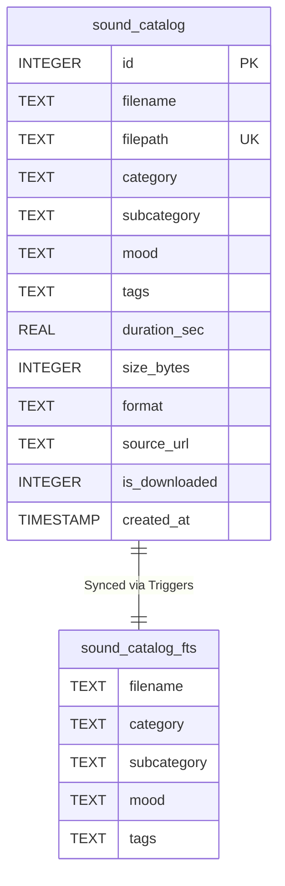

# 🎹 Sound Bank: SQLite FTS5 Audio Catalog & Asset Architecture

## 📖 Overview

A major bottleneck in automated audio drama production is sound asset retrieval. Passing gigabytes of audio file listings or embeddings into LLM context windows causes severe latency, context bloat, and hallucinations of nonexistent filenames.

**Audiobook Maker v4.0** solves this with an embedded **SQLite FTS5 (Full-Text Search) Sound Bank**. The Sound Bank operates locally on disk with zero external API dependencies, sub-millisecond query latency, and BM25 relevance ranking.

---

## 🏛️ Database Schema

The database resides at `audiobooks/sound_bank/sound_bank.db` and utilizes SQLite Write-Ahead Logging (`PRAGMA journal_mode=WAL`) for concurrent reading during synthesis.



### Table Definition: `sound_catalog`
```sql
CREATE TABLE sound_catalog (
    id INTEGER PRIMARY KEY AUTOINCREMENT,
    filename TEXT NOT NULL,
    filepath TEXT UNIQUE NOT NULL,
    category TEXT,       -- AMB (Ambience), FOL (Foley), SFX (Sound FX), MUS (Music)
    subcategory TEXT,    -- Weather, Tavern, Steps, Magic, Combat, Drone, Nature
    mood TEXT,           -- mysterious, tense, peaceful, epic, emotional, default
    tags TEXT,           -- Space-separated searchable tokens
    duration_sec REAL DEFAULT 0.0,
    size_bytes INTEGER DEFAULT 0,
    format TEXT,
    source_url TEXT,
    is_downloaded INTEGER DEFAULT 1,
    created_at TIMESTAMP DEFAULT CURRENT_TIMESTAMP
);
```

### FTS5 Virtual Table & Synchronization
```sql
CREATE VIRTUAL TABLE sound_catalog_fts USING fts5(
    filename,
    category,
    subcategory,
    mood,
    tags,
    content='sound_catalog',
    content_rowid='id'
);
```
Automatic `AFTER INSERT`, `AFTER UPDATE`, and `AFTER DELETE` triggers keep the FTS5 index strictly synchronized with the relational metadata table.

---

## 🏷️ Asset Categories & Universal Category System (UCS)

Audio assets are classified into 4 primary functional categories:

| Category Code | Description | Subcategories | Typical Usage |
|:---:|---|---|---|
| `AMB` | Environmental Ambience Bed | Rain, Wind, Tavern, Forest, Dungeon, Crypt, Sea | Continuous background layer (-32 LUFS). |
| `MUS` | Musical Score & Cues | Battle, Sorrow, Suspense, Majestic, Romance | Dynamic underscore with sidechain ducking (-18 dBFS). |
| `FOL` | Tactile Foley | Footsteps, Cloth rustle, Door creak, Breathing | Dialogue-anchored physical movement sounds. |
| `SFX` | Dramatic Sound FX | Sword clash, Explosion, Spell cast, Monster roar | High-intensity impact audio events. |

Assets also support **Universal Category System (UCS)** 7-character naming conventions (e.g. `WATRRain`, `BLDNGate`, `DOORWood`, `WEAPSwd`).

### Domestic Tableware & Anatomical Gore UCS Isolation (ADR-022)
To prevent dining banquet scenes from triggering violent sword clatter:
- **`DOMETabl` (Domestic Tableware)**: Explicitly categorizes plates, dishes, bowls, cups, spoons, forks, trays, and tankards (`थाली`, `कटोरा`, `चम्मच`, `बर्तन`, `प्याला`, `plate`, `dish`, `bowl`, `ceramic`, `wood_tankard`).
- **`GOREAnat` (Anatomical & Organic Gore)**: Isolates bone fractures, cartilage, and flesh squelches (`हड्डी`, `मांस`, `bone`, `cartilage`, `flesh`).
- **`WEAPSwd` / `WEAPKnf` (Combat Weaponry)**: Isolated strictly to blades, swords, parries, and daggers. Direct dining keywords are strictly barred from resolving to combat weaponry.

---

## 🧬 The Sonic Genome: Acoustic & Emotional Indexing

Assets ingested into the Sound Bank receive an acoustic profile known as the **Sonic Genome**:

1. **Acoustic Invariants (Deterministic DSP)**:
   - **Integrated Loudness**: Calibrated in LUFS using FFmpeg `ebur128`.
   - **True Peak**: Maximum inter-sample peak in dBTP.
   - **Speech Corridor Density ($300\text{ Hz} - 3.5\text{ kHz}$)**: Energy ratio in the human vocal intelligibility range to predict vocal masking risk.
   - **Tempo (BPM)**: Rhythmic cadence detection for seamless transition slicing.
   - **Transient Drop Points**: Exact timestamps where explosive action drops occur.

2. **Semantic & Emotional Annotations**:
   - **Valence** ($-1.0$ to $+1.0$): Emotional positivity vs tragic despair.
   - **Arousal** ($0.0$ to $1.0$): Energetic adrenaline intensity.
   - **Tension** ($0.0$ to $1.0$): Narrative suspense and dread.

---

## 📥 Ingestion & Cataloging

### Universal Multi-Threaded Ingestion
The [`UniversalSoundBankIngester`](file:///c:/Users/Suraj/Documents/Antigravity/Audiobook/audiobook_factory/sound_bank_ingest.py) scans directories of WAV, MP3, OGG, or FLAC files, probes acoustic parameters using FFmpeg, generates searchable tags, and commits them in transactions.

```bash
# Ingest local audio assets into Sound Bank:
python audiobook_cli.py bank ingest /path/to/my_audio_library/ --workers 4
```

### Seeding CC0 Virtual Assets
The [`CatalogSeeder`](file:///c:/Users/Suraj/Documents/Antigravity/Audiobook/audiobook_factory/catalog_seeder.py) can seed pre-verified royalty-free, public domain CC0 audio entries from online archives:
```bash
# Seed CC0 virtual catalog:
python audiobook_cli.py bank seed
```

### Pre-Baked Composite Asset Baker (ADR-018)
Multi-phase sound design events (such as Harry Potter wand spells or complex tactile props) require multiple acoustic stages:
1. **Phase A (Gesture Pre-Roll):** Air whoosh or wand flick ($0 - 100\text{ ms}$).
2. **Phase B (Arcane Exciter):** Electric ionization spark or high chime ($100 - 300\text{ ms}$).
3. **Phase C (Diegetic Impact / Dissipation):** Tuned 52Hz sub-bass thump and acoustic reverb tail.

Rather than synthesizing these dynamically inside runtime FFmpeg graphs during chapter mastering (which risks filter graph overflows and process stalls), the offline composite baker pre-renders them:
```bash
python scripts/bake_foley_composites.py
```
This utility:
- Renders high-fidelity composites using FFmpeg lavfi synthesizers (`magic_lumos_light.wav`, `magic_expelliarmus_kinetic.wav`, `tactile_parchment_quill_scratch.wav`).
- Automatically ingests and indexes them into the local SQLite FTS5 Sound Bank catalog with tags (`magic`, `tactile`, `composite`, `lumos`, `quill`).
- Guarantees sub-millisecond retrieval latency with zero runtime filter graph bloat.

### Layer 4 Stochastic Spot Transients
Environmental realism requires subtle, non-repetitive micro-events (distant owls, candle sparks, floor creaks, clock ticks, dripping water).
- These assets are cataloged under the `FOL` and `AMB` categories with dedicated UCS tags (e.g. `DOORWood`, `WATRDrip`, `ANMLBird`).
- The `generate_stochastic_cues` algorithm in `SceneSoundscapeManifest` queries the Sound Bank for candidate assets and strategically places them during speech pauses ($\ge 600\text{ ms}$) without consuming LLM tokens.

---

## 🔍 Querying the Sound Bank

### 1. Command-Line Search
```bash
# Search for battle music:
python audiobook_cli.py bank search "dark battle drums orchestral" --limit 5

# Search for ambient weather:
python audiobook_cli.py bank search "rain thunderstorm howling wind" --limit 3
```

### 2. Python API
```python
from audiobook_factory.sound_bank import SoundBank

bank = SoundBank()

# Execute BM25 search
matches = bank.search_sounds(
    query="cathedral eerie choir",
    category="AMB",
    limit=5,
)

for m in matches:
    print(f"[{m['category']}] {m['filename']} (Duration: {m['duration_sec']:.1f}s)")
```

### 3. AgentDirector Integration
During Pass 2 of [`AgentDirector`](file:///c:/Users/Suraj/Documents/Antigravity/Audiobook/audiobook_factory/agent_director.py), the director constructs dynamic FTS5 queries derived from the chapter's narrative mood:
```python
query_str = f"{scene_mood} {acting_intensity} {character_archetype}"
candidate_cues = sound_bank.search_sounds(query_str, category="MUS", limit=3)
```
If no audio asset matches the dramatic criteria, the engine safely resolves to pure acoustic silence, strictly eliminating hardcoded audio file paths.

---

## 🛡️ Pre-Flight Verification (Gate 3.5)

Before any FFmpeg audio rendering begins, **Gate 3.5** checks every cue in the `CreativeManifest` against the Sound Bank on disk:
- Missing audio files trigger a hard failure before expensive mastering starts.
- Audio durations are verified against chapter boundaries to prevent negative loop offsets.
- Music cue durations are summed to verify the $\ge 60.0\%$ acoustic silence mandate.
