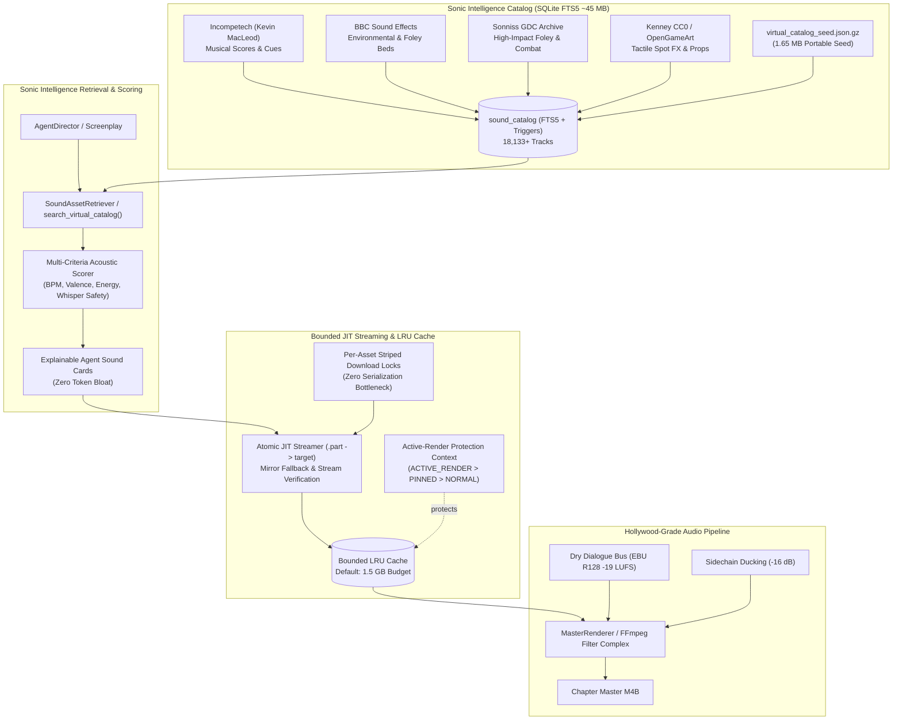

# 🎹 Sonic Intelligence Catalog & Virtual JIT Sound Bank

## 📖 Overview & Core Philosophy

In studio-grade automated audio drama production, sound asset retrieval is traditionally plagued by two extremes:
1. **Disk Bloat**: Storing hundreds of gigabytes (e.g. 200+ GB) of high-fidelity Foley, ambiences, and musical stems exhausts local storage and makes cloud distribution impractical.
2. **Context Bloat & LLM Hallucinations**: Passing large raw file manifests or embeddings into LLM context windows causes severe token consumption, latency, and hallucinations of nonexistent audio filenames.

**Audiobook Maker v4.0** solves this with the **Sonic Intelligence Catalog & Virtual JIT Sound Bank**:
- **0% Raw Audio Disk Bloat**: Ingests and indexes **18,133+ open-source, royalty-free audio tracks** (Incompetech, BBC Sound Effects, Sonniss GDC, Kenney CC0 / OpenGameArt) as rich metadata-only records in a compact SQLite FTS5 database (~45 MB database, 1.65 MB compressed seed).
- **Sonic Genome v2.0**: A 9-dimensional acoustic and dramatic taxonomy separating measured DSP ground-truth facts from inferred narrative semantics.
- **Bounded LRU Cache with Active-Render Protection**: A strict, configurable local cache (default 1.5 GB via `MAX_SOUND_BANK_CACHE_MB`) that preserves 100% of catalog metadata while evicting unneeded local files. Tracks currently in active rendering passes are locked and immune to eviction.
- **Just-In-Time (JIT) Remote Audio Streaming**: Fetches remote assets atomically on demand with `.part` staging, mirror fallback, retry backoff, corruption checks, and per-asset lock striping for maximum concurrent chapter throughput.
- **Sub-Millisecond Explainable Hybrid Retrieval**: Combines BM25 full-text indexing, multi-dimensional taxonomy filtering, and weighted acoustic scoring to generate LLM-ready **Agent Sound Cards** with transparent `why_matched` explanations.

---

## 🏛️ System Architecture



---

## 🧬 Sonic Genome v2.0: Unified Acoustic Taxonomy

The **Sonic Genome v2.0** enforces clean architectural separation between **measured physical DSP facts** and **inferred narrative semantics**:

### 1. Physical & Acoustic Dimensions
- **`PhysicalGenome`**: Physical sound source mechanics.
  - `exciter`: Striking agent (e.g. `leather_boot`, `iron_hammer`, `wooden_spoon`, `steel_blade`).
  - `resonator`: Resonance body (e.g. `hollow_wood`, `cavern_rock`, `parchment`, `crystal_glass`).
  - `action_type`: Dynamic verb (e.g. `scrape`, `impact`, `friction`, `whoosh`, `creak`).
  - `surface`: Target material (e.g. `gravel`, `mud`, `marble`, `cobblestone`).
- **`TemporalWaveGenome`**: Time and rhythm envelope.
  - `wave_style`: Continuous wave character (e.g. `loopable_continuous`, `transient_stinger`, `rhythmic_pulse`).
  - `temporal_character`: Time evolution (e.g. `percussive`, `evolving`, `granular`, `drone`).
  - `attack_decay_ratio`: Relative sharpness of transient onset.
- **`SpatialGenome` & `EnvironmentalGenome`**:
  - `perspective`: Acoustic proximity (`intimate`, `close`, `medium`, `distant`, `diffuse`).
  - `acoustic_space`: Room character (`cathedral`, `tavern`, `dungeon`, `dense_forest`, `empty_hall`).
  - `reverb_character`: Room tail (`dry`, `metallic_echo`, `lush_hall`, `cavernous`).

### 2. Narrative, Dramatic & Mix Compatibility Dimensions
- **`DramaticGenome`**:
  - `dramatic_role`: Role in narrative (`foreshadowing`, `action_punctuation`, `emotional_swell`, `tension_bed`).
  - `narrative_weight`: Importance ranking ($0.0$ to $1.0$).
  - `emotional_valence` ($-1.0$ to $+1.0$), `arousal` ($0.0$ to $1.0$), `tension` ($0.0$ to $1.0$).
- **`MixCompatibilityGenome`**:
  - `foreground_strength`: Staging dominance ($0.0$ to $1.0$).
  - `voice_masking_risk`: Risk of obscuring speech (`LOW`, `MEDIUM`, `HIGH`).
  - `whisper_compatibility`: Safety multiplier during quiet, intimate dialogue ($0.0$ to $1.0$).
- **`RemoteAssetMetadata`**:
  - `source_url`, `mirror_url`, `source_page_url`.
  - `url_status`: (`verified`, `unverified`, `broken`, `rate_limited`).
  - `last_verified_at`, `measurement_confidence` ($0.0$ to $1.0$).

---

## 🗄️ Database Schema & Indexes

The Sound Bank resides at `audiobooks/sound_bank/sound_bank.db` and operates under SQLite Write-Ahead Logging (`PRAGMA journal_mode=WAL`) with busy timeouts.

### 1. `sound_catalog` Table
```sql
CREATE TABLE IF NOT EXISTS sound_catalog (
    id INTEGER PRIMARY KEY AUTOINCREMENT,
    filename TEXT NOT NULL,
    filepath TEXT,                          -- NULL if not currently downloaded (virtual)
    category TEXT,                          -- AMB, FOL, SFX, MUS, LEITMOTIF, DYNAMIC_STEM
    subcategory TEXT,                       -- Weather, Tavern, Footsteps, Combat, Drone
    mood TEXT,                              -- mysterious, tense, peaceful, epic, emotional
    tags TEXT,                              -- Searchable space-separated tokens
    duration_sec REAL DEFAULT 0.0,
    size_bytes INTEGER DEFAULT 0,
    format TEXT,
    title TEXT DEFAULT '',
    description TEXT DEFAULT '',
    source_collection TEXT DEFAULT '',      -- incompetech, bbc_sound_effects, sonniss_gdc, kenney
    license TEXT DEFAULT 'Royalty-Free',    -- CC0, CC-BY, Incompetech, Sonniss-Royalty-Free
    creator_attribution TEXT DEFAULT '',
    source_url TEXT DEFAULT NULL,           -- Primary CDN/stream URL
    mirror_url TEXT DEFAULT NULL,           -- Failover mirror URL
    source_page_url TEXT DEFAULT NULL,      -- Human verification page URL
    url_status TEXT DEFAULT 'unverified',
    last_verified_at TIMESTAMP DEFAULT NULL,
    is_downloaded INTEGER DEFAULT 1,        -- 1 = cached on disk, 0 = virtual catalog entry
    tempo_bpm REAL DEFAULT 0.0,
    key_tonality TEXT DEFAULT '',
    time_signature TEXT DEFAULT '4/4',
    wave_style TEXT DEFAULT 'general',
    temporal_character TEXT DEFAULT 'transient',
    energy_profile TEXT DEFAULT 'medium',
    texture_profile TEXT DEFAULT 'organic',
    exciter TEXT DEFAULT '',
    resonator TEXT DEFAULT '',
    action_type TEXT DEFAULT '',
    surface TEXT DEFAULT '',
    perspective TEXT DEFAULT 'medium',
    acoustic_space TEXT DEFAULT '',
    reverb_character TEXT DEFAULT '',
    dramatic_role TEXT DEFAULT 'general',
    foreground_strength REAL DEFAULT 0.5,
    voice_masking_risk TEXT DEFAULT 'LOW',
    whisper_compatibility REAL DEFAULT 0.5,
    last_accessed_at TIMESTAMP DEFAULT NULL,
    cache_pin_status TEXT DEFAULT 'normal', -- normal, pinned, active_render
    sonic_genome TEXT DEFAULT '{}',         -- Complete JSON serialization of SonicGenome
    created_at TIMESTAMP DEFAULT CURRENT_TIMESTAMP
);

-- Fast LRU composite index for O(1) candidate pruning
CREATE INDEX IF NOT EXISTS idx_sound_catalog_lru 
ON sound_catalog(is_downloaded, cache_pin_status, last_accessed_at);
```

### 2. `sound_catalog_fts` Virtual Table
```sql
CREATE VIRTUAL TABLE IF NOT EXISTS sound_catalog_fts USING fts5(
    filename,
    category,
    subcategory,
    mood,
    tags,
    title,
    description,
    wave_style,
    exciter,
    resonator,
    action_type,
    dramatic_role,
    content='sound_catalog',
    content_rowid='id'
);
```

---

## 🛡️ Bounded LRU Cache Manager (`SoundBankCacheManager`)

The [`SoundBankCacheManager`](file:///c:/Users/Suraj/Documents/Antigravity/Audiobook/audiobook_factory/sound_bank_cache.py) enforces strict disk usage caps and eliminates disk leaks:

### 1. Hard Capacity Budget
- **Default Budget**: 1,536 MB (1.5 GB). Configurable at runtime via `MAX_SOUND_BANK_CACHE_MB` environment variable or CLI argument.
- **Fast $O(1)$ Accounting**: Queries SQLite database (`SELECT COALESCE(SUM(size_bytes), 0) FROM sound_catalog WHERE is_downloaded = 1`) to eliminate blocking filesystem walks during routine cache queries.

### 2. Active-Render Protection & Self-Healing
Stems utilized by an ongoing chapter render are protected by the `protect_active_render` context manager:
```python
with cache_manager.protect_active_render(asset_ids=[101, 204, 509]):
    # These tracks are pinned with status 'active_render'
    # LRU pruning is mathematically prohibited from deleting them
    master_renderer.render_chapter(chapter_cues)
```
- **Crash Recovery**: If an external process or task runner terminates unexpectedly, [`_recover_stale_active_renders()`](file:///c:/Users/Suraj/Documents/Antigravity/Audiobook/audiobook_factory/sound_bank_cache.py) runs on initialization, resetting orphaned `active_render` pins to `normal`.

### 3. Non-Destructive Eviction Invariant
When cache pruning occurs:
- The local audio file is unlinked from disk (`cache_dir`).
- In SQLite, `is_downloaded` is set to `0` and `filepath` to `NULL`.
- **100% of Sonic Genome metadata, DSP metrics, attribution, and FTS5 tokens are preserved**. The track remains fully searchable and can be JIT re-downloaded at any time.

---

## ⚡ JIT Remote Streaming & Concurrency Hardening

Remote tracks are streamed on-demand when resolved by `SoundBank.resolve_sound()` or `SoundAssetRetriever`:

1. **Per-Asset Striped Download Locks**:
   - Replaced global download locks with keyed mutexes (`_get_asset_download_lock(sound_id)`).
   - Distinct audio stems download completely concurrently across worker threads.
   - Duplicate concurrent requests for the exact same track automatically wait and share the single download result.
2. **Atomic Swap with Unique Parts**:
   - Streams are written to unique temp files: `<filename>.<uuid>.part`.
   - Streams are validated: zero-byte files or HTTP error pages (HTML containing `<!doctype html` or `404 Not Found`) are immediately discarded.
   - Atomic rename via `temp_path.replace(target_path)` ensures the renderer never reads a partially written file.
3. **Mirror Failover & ENOSPC Protection**:
   - If the primary `source_url` fails, the streamer automatically attempts `mirror_url` with exponential backoff.
   - If disk space is exhausted (`errno.ENOSPC`), the streamer aborts immediately with an error log rather than entering infinite retry loops.

---

## 🔍 Explainable Hybrid Search & Agent Sound Cards

LLMs cannot listen to audio waveforms. The Sound Bank generates **Agent Sound Cards** formatted in clear markdown, providing the exact acoustic attributes and an explainable `why_matched` ledger:

```python
from audiobook_factory.sound_bank import get_sound_bank

bank = get_sound_bank()
cards = bank.search_virtual_catalog(
    query="ancient heavy wooden door opening",
    category="FOL",
    action_type="creak",
    limit=1
)
print(bank.format_agent_sound_card(cards[0]))
```

### Example Agent Sound Card Output:
```markdown
### 🎵 Sound Asset Card: [FOL] Ancient Wooden Dungeon Door Creak (ID: 4120)
- **File / Source**: `kenney_door_heavy_creak_02.wav` | Kenney CC0
- **Duration**: 4.2s | **BPM**: 0.0 | **Key**: N/A
- **Status**: ⚡ Virtual (JIT Stream Available)
- **Sonic Genome**:
  - Exciter: `hinge_friction` | Resonator: `hollow_aged_wood`
  - Action: `creak` | Surface: `iron_hinge`
  - Spatial: `medium` perspective | Reverb: `dry`
  - Voice Masking Risk: `LOW` (Whisper Safe: 0.90)
- **Why Matched**:
  - Matched FTS terms: ancient*, wooden*, door*, creak*
  - Action type 'creak' matched query criteria exactly (+0.25)
  - Whisper-safe compatibility bonus (+0.10)
```

---

## 💻 CLI Command Reference

The `audiobook_cli.py bank` interface provides comprehensive tools for managing the virtual catalog and cache:

### 1. View Virtual Catalog & Cache Status
```bash
python audiobook_cli.py bank virtual-status
```
Outputs total tracks in catalog, total represented duration, downloaded files count, LRU cache budget, used disk space, and active render protections.

### 2. Search Sound Catalog
```bash
python audiobook_cli.py bank search "dark battle drums cello" --limit 5
```
Performs hybrid FTS5 and Sonic Genome scoring. Displays download status, duration, category, and score.

### 3. Inspect Complete Sonic Genome
```bash
python audiobook_cli.py bank inspect 8563
```
Prints the complete 9-dimensional Sonic Genome, measured DSP metrics, licensing attribution, and remote CDN/mirror URLs for a specific sound ID.

### 4. Prune LRU Cache to Target Budget
```bash
# Prune to default budget (1.5 GB):
python audiobook_cli.py bank prune-cache

# Prune to custom budget (500 MB):
python audiobook_cli.py bank prune-cache --target-mb 500
```

### 5. Prefetch Audio Assets for Chapter
```bash
# Pre-download stems matching query before starting offline rendering:
python audiobook_cli.py bank prefetch "tavern crowd chatter fire" --limit 3
```

### 6. Ingest Third-Party Source Collection
```bash
python audiobook_cli.py bank ingest-source /path/to/archive/ --source sonniss
```
Normalizes and indexes third-party collections with source-specific adapter logic and batch database transactions.

---

## 🛡️ Pre-Flight Verification & Quality Gates

1. **Gate 3.5 (Asset Realization Pre-Flight)**:
   - Validates that every audio cue specified in the screenplay `CreativeManifest` resolves to either an existing local file or a verified virtual catalog track.
   - Automatically JIT-prefetches required tracks before FFmpeg graph synthesis begins.
2. **Gate 4.5 (Foley Pacing & Acoustic Floor)**:
   - Enforces a minimum 44-byte WAV header floor for `[ACTION]` pacing segments, preventing zero-audio beats from stalling the audio master renderer.
3. **AST Zero-Hardcoding Contracts**:
   - Automated regression test suite (`tests/test_zero_hardcoding_contracts.py`) continuously guarantees zero hardcoded character names, chapter branches, or static soundtrack paths in the core engine.
