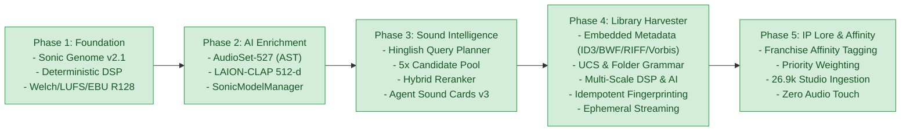
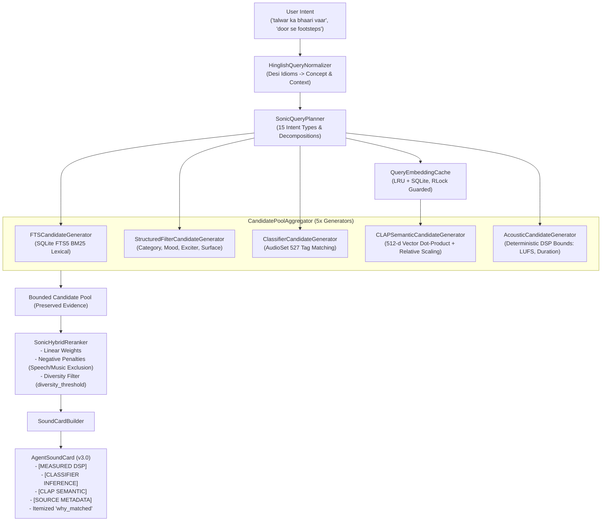
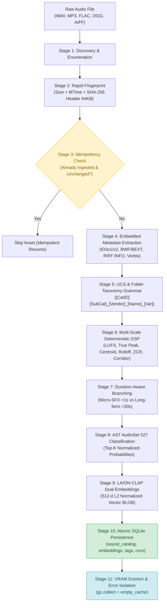

# 🎹 Sonic Intelligence Engine & Virtual Sound Bank

> **Specification Version:** 4.5  
> **Status:** Production-Ready & Certified (Phases 1–5 Complete)  
> **Target Subsystem:** Sound Retrieval, Audio Analysis, AI Enrichment, Agent Sound Cards, IP Lore & Franchise Affinity, and Large-Scale Library Harvesting  
> **Database:** `audiobooks/sound_bank/sound_bank.db` (~150 MB SQLite with WAL mode, indexing 61,048 sounds and 44,940 CLAP neural embeddings)

---

## 📖 1. Overview & Architectural Roadmap

In cinematic audio drama production, sound asset retrieval has historically suffered from three critical flaws:
1. **Disk Bloat**: Storing hundreds of gigabytes (50GB–200GB) of high-fidelity Foley, ambiences, and musical stems exhausts local storage and prevents lightweight distribution.
2. **Context Bloat & LLM Hallucinations**: Passing raw file lists, directory paths, or arbitrary vector dumps into LLM context windows causes severe token consumption, latency, and hallucinations of nonexistent audio filenames.
3. **Epistemic Dishonesty & Keyword Traps**: Traditional keyword retrieval cannot distinguish measured physical acoustics (e.g. true loudness, spectral brightness) from provider-injected marketing tags, nor can it understand rustic multilingual idioms (*"talwar ka bhaari vaar"*, *"door se aati footsteps"*).

To solve this, **AudioBookmaker** implements the **Sonic Intelligence Engine**, a five-phase studio infrastructure:


```mermaid
flowchart LR
    P1["Phase 1: Foundation\n- Sonic Genome v2.1\n- Deterministic DSP\n- Welch/LUFS/EBU R128"]
    P2["Phase 2: AI Enrichment\n- AudioSet-527 (AST)\n- LAION-CLAP 512-d\n- SonicModelManager"]
    P3["Phase 3: Sound Intelligence\n- Hinglish Query Planner\n- 5x Candidate Pool\n- Hybrid Reranker\n- Agent Sound Cards v3"]
    P4["Phase 4: Library Harvester\n- Embedded Metadata (ID3/BWF/RIFF/Vorbis)\n- UCS & Folder Grammar\n- Multi-Scale DSP & AI\n- Idempotent Fingerprinting\n- Ephemeral Streaming"]
    P5["Phase 5: IP Lore & Affinity\n- Franchise Affinity Tagging\n- Priority Weighting\n- 26.9k Studio Ingestion\n- Zero Audio Touch"]

    P1 --> P2 --> P3 --> P4 --> P5
    style P1 fill:#d4edda,stroke:#28a745,color:#155724
    style P2 fill:#d4edda,stroke:#28a745,color:#155724
    style P3 fill:#d4edda,stroke:#28a745,color:#155724
    style P4 fill:#d4edda,stroke:#28a745,color:#155724
    style P5 fill:#d4edda,stroke:#28a745,color:#155724
```

- **Phase 1 (Foundation — Certified)**: Deterministic audio analysis pipeline extracting physical ground-truth DSP metrics directly from waveforms (`speech_corridor_density`, EBU R128 integrated LUFS, True Peak dBTP, Welch spectral centroid), non-destructive SQLite schema migration, and temporal event onsets.
- **Phase 2 (AI Enrichment — Certified)**: Dedicated machine-learning adapters (AudioSet 527 classification via AST, open-vocabulary 512-d dual embeddings via LAION-CLAP), thread-safe VRAM model management (`SonicModelManager`), and SQLite vector BLOB storage.
- **Phase 3 (Sound Intelligence — Certified & Hardened)**: Multilingual query planning (`HinglishQueryNormalizer`, `SonicQueryPlanner`), thread-safe LRU query caching (`QueryEmbeddingCache`), 5-source candidate pooling (`CandidatePoolAggregator`), explainable linear reranking with negative penalties (`SonicHybridReranker`), and epistemically honest `AgentSoundCard` (v3.0) models with strict 4-tier labeling.
- **Phase 4 (Production Scale Library Harvester — Certified)**: High-throughput, non-destructive 11-stage ingestion engine for massive local sound collections (~200GB). Extracts rich container metadata (ID3v1/ID3v2, BWF/BEXT, RIFF INFO, Vorbis comments), Universal Category System (UCS) naming grammar, folder taxonomy tokens, and companion variation groupings without data loss. Features sliding-window ephemeral streaming ingest (`streaming_harvester.py`), rapid 64KB SHA-256 header fingerprinting, idempotent skip/resume, and strict GPU VRAM eviction.
- **Phase 5 (IP Lore & Franchise Affinity System — Certified)**: First-class franchise ontology (`franchise_affinity`, `lore_tags`, `ip_priority`) boosting authentic studio sound assets during universe-specific audiobook production. Ingests all **26,906 CD PROJEKT RED Witcher 3 studio audio assets** (22.25 GB) and 230 Witcher OST tracks 100% in-place with zero audio duplication, providing instant Hollywood-grade combat, magic, creature, and foley soundscapes.

---

## 🧬 2. Phase 1: Sonic Genome v2.1 Foundation & Deterministic DSP

Phase 1 provides the mathematical ground-truth foundation for all sound assets without relying on neural models or subjective tags.

### A. Deterministic Audio Analyzer (`DeterministicAudioAnalyzer`)
Located in [`audiobook_factory/deterministic_audio_analyzer.py`](file:///c:/Users/Suraj/Documents/Antigravity/Audiobook/audiobook_factory/deterministic_audio_analyzer.py), this module extracts physical, reproducible metrics directly from 48kHz audio streams:

| Metric Column | Data Type | Physical Definition & Measurement Method |
| :--- | :---: | :--- |
| `integrated_lufs` | `REAL` | EBU R128 integrated loudness via ITU-R BS.1770-4 K-weighting filter. |
| `true_peak_db` | `REAL` | Maximum 4x oversampled inter-sample peak in dBFS. |
| `rms_db` | `REAL` | Root-mean-square electrical power across the audio waveform. |
| `spectral_centroid_hz` | `REAL` | Frequency center-of-mass via Welch periodogram FFT ($H_z$). |
| `spectral_rolloff_hz` | `REAL` | Frequency below which 85% of total spectral power resides ($H_z$). |
| `spectral_flux` | `REAL` | Normalized rate of spectral change between successive analysis frames. |
| `zero_crossing_rate` | `REAL` | Normalized sign-change rate per second (fricative/noise indicator). |
| `speech_corridor_density` | `REAL` | Ratio of energy in 1kHz–4kHz human voice corridor (objective masking evidence). |
| `attack_time_ms` | `REAL` | Time elapsed from 10% to 90% peak transient energy ($ms$). |
| `decay_time_ms` | `REAL` | Time elapsed from peak energy to -20 dB decay floor ($ms$). |
| `temporal_character` | `TEXT` | Categorization: `transient`, `percussive`, `evolving`, or `continuous_drone`. |
| `energy_profile` | `REAL` | Normalized energy distribution index ($0.0$ to $1.0$). |

> **Epistemic Invariant**: Deterministic scripts strictly compute and expose measurable evidence. They **never** assert creative conclusions like `dramatic_role="general"`, pre-baked `voice_masking_risk="LOW"`, or fixed `recommended_ducking_db="-6 dB"`. All creative, scene-specific, and mix decisions are deferred to downstream specialist agents (`SoundDirector`, `MixDirector`).

### B. Relational Schema & Provenance Ledgers
The SQLite schema is expanded non-destructively:
- **`sound_catalog`**: 14 new measured DSP columns added to existing records.
- **`sound_analysis_runs`**: Immutable provenance ledger tracking execution date, analyzer version (`v2.1`), host environment, and execution latency.
- **`sound_temporal_events`**: Stores micro-transient onsets and impact timestamps within an asset:
  ```sql
  CREATE TABLE IF NOT EXISTS sound_temporal_events (
      id INTEGER PRIMARY KEY AUTOINCREMENT,
      track_id INTEGER NOT NULL,
      event_type TEXT NOT NULL,          -- onset, impact, decay, transient
      start_ms INTEGER NOT NULL,
      end_ms INTEGER NOT NULL,
      energy_peak_db REAL,
      confidence REAL DEFAULT 1.0,
      FOREIGN KEY (track_id) REFERENCES sound_catalog(id)
  );
  ```

---

## 🧠 3. Phase 2: AI Enrichment (Dedicated Classifiers & Dual Vector Embeddings)

Phase 2 enriches catalog assets with statistical ML tags and open-vocabulary semantic embeddings.

### A. AST AudioSet 527 Classifier (`AudioClassifierAdapter`)
Located in [`audiobook_factory/classifier_adapter.py`](file:///c:/Users/Suraj/Documents/Antigravity/Audiobook/audiobook_factory/classifier_adapter.py):
- **Model**: `MIT/ast-finetuned-audioset-10-10-0.4593` (HuggingFace Transformers).
- **Function**: Classifies 527 standardized audio events (e.g. `Footsteps`, `Explosion`, `Thunderstorm`, `Sword clash`, `Whispering`).
- **Raw Storage**: Normalized predictions $\ge 0.10$ probability are stored in `sound_classifier_tags` with raw logits, confidence scores, and ranking indices.

### B. LAION-CLAP 512-d Dual Semantic Embeddings (`CLAPSemanticAdapter`)
Located in [`audiobook_factory/clap_semantic_adapter.py`](file:///c:/Users/Suraj/Documents/Antigravity/Audiobook/audiobook_factory/clap_semantic_adapter.py):
- **Model**: `laion/clap-htsat-unfused` (512-dimensional shared acoustic/semantic latent space).
- **Dual Inference**: Produces $L_2$-normalized 512-d `float32` vectors for both audio waveforms (during catalog enrichment) and text query strings (during real-time search).
- **Vector Storage**: Stored compactly as 2,048-byte binary BLOBs in SQLite:
  ```sql
  CREATE TABLE IF NOT EXISTS sound_embeddings (
      track_id INTEGER PRIMARY KEY,
      embedding_dim INTEGER NOT NULL,      -- 512
      embedding_bytes BLOB NOT NULL,       -- 2048 bytes (512 * float32)
      model_id TEXT NOT NULL,              -- laion/clap-htsat-unfused
      model_version TEXT NOT NULL,
      preprocessing_version TEXT NOT NULL,
      created_at TIMESTAMP DEFAULT CURRENT_TIMESTAMP,
      FOREIGN KEY (track_id) REFERENCES sound_catalog(id)
  );
  ```

### C. Resource-Safe Model Management (`SonicModelManager`)
Located in [`audiobook_factory/sonic_model_manager.py`](file:///c:/Users/Suraj/Documents/Antigravity/Audiobook/audiobook_factory/sonic_model_manager.py):
- **Lazy Loading**: Models are loaded into memory only when actively queried.
- **CUDA Acceleration & CPU Fallback**: Automatically targets NVIDIA RTX GPUs via CUDA; safely falls back to CPU if VRAM is constrained.
- **Explicit VRAM Eviction**: Provides `clear_vram()` using `torch.cuda.empty_cache()` and garbage collection to guarantee zero GPU memory interference during subsequent Gemini TTS synthesis passes.

---

## ⚡ 4. Phase 3: Sound Intelligence (Retrieval + Planning + Agent Cards)

Phase 3 is the agent-facing cognitive retrieval engine that orchestrates natural-language search, hybrid candidate aggregation, deterministic reranking, and epistemic card creation.


```mermaid
flowchart TD
    UserQuery["User Intent\n('talwar ka bhaari vaar', 'door se footsteps')"] --> Normalizer["HinglishQueryNormalizer\n(Desi Idioms -> Concept & Context)"]
    Normalizer --> Planner["SonicQueryPlanner\n(15 Intent Types & Decompositions)"]
    
    Planner --> Cache["QueryEmbeddingCache\n(LRU + SQLite, RLock Guarded)"]
    
    subgraph CandidatePoolAggregator["CandidatePoolAggregator (5x Generators)"]
        GenFTS["FTSCandidateGenerator\n(SQLite FTS5 BM25 Lexical)"]
        GenStruct["StructuredFilterCandidateGenerator\n(Category, Mood, Exciter, Surface)"]
        GenClass["ClassifierCandidateGenerator\n(AudioSet 527 Tag Matching)"]
        GenCLAP["CLAPSemanticCandidateGenerator\n(512-d Vector Dot-Product + Relative Scaling)"]
        GenAcoustic["AcousticCandidateGenerator\n(Deterministic DSP Bounds: LUFS, Duration)"]
    end
    
    Planner --> GenFTS
    Planner --> GenStruct
    Planner --> GenClass
    Cache --> GenCLAP
    Planner --> GenAcoustic
    
    CandidatePoolAggregator --> Pool["Bounded Candidate Pool (Preserved Evidence)"]
    Pool --> Reranker["SonicHybridReranker\n- Linear Weights\n- Negative Penalties (Speech/Music Exclusion)\n- Diversity Filter (diversity_threshold)"]
    
    Reranker --> SoundCardBuilder["SoundCardBuilder"]
    SoundCardBuilder --> OutputCards["AgentSoundCard (v3.0)\n- [MEASURED DSP]\n- [CLASSIFIER INFERENCE]\n- [CLAP SEMANTIC]\n- [SOURCE METADATA]\n- Itemized 'why_matched'"]
```

### A. Multilingual Query Normalizer & Planner (`sonic_query_planner.py`)
- **`HinglishQueryNormalizer`**: Translates vernacular Hindi/Hinglish idioms into canonical sound concepts while preserving original context:
  - *"talwar ka bhaari vaar"* $\rightarrow$ `heavy sword strike impact`
  - *"door se halki footsteps"* $\rightarrow$ `distant quiet footsteps walk`
  - **Homophone Collision Shield**: Protects English words from accidental Hindi translations (e.g. English *"door"* represents an architectural entryway, while Hindi *"dur/door"* represents distant perspective).
- **`SonicQueryPlanner`**:
  - Classifies intent into 15 canonical taxonomy types (`FOLEY_IMPACT`, `ENVIRONMENT_BED`, `WEATHER_MACRO`, `CREATURE_VOCAL`, `WEAPON_BLADE`, etc.).
  - Extracts negative constraints (*"without speech"*, *"no music"*).
  - Decomposes compound multi-action scenes into sequential `AtomicSoundConcept` items.

### B. Thread-Safe Query Embedding Cache (`query_embedding_cache.py`)
- **Key Determinism**: Computes SHA-256 of `f"{normalized_query}:{model_id}:{model_version}:{preprocessing_version}"`.
- **Re-entrant Thread Safety**: Utilizes `threading.RLock()` to prevent self-deadlocks when compound callers invoke `get_or_compute()`.
- **Two-Tier Storage**: O(1) in-memory LRU cache coupled with SQLite disk backing.

### C. Multi-Source Candidate Generation (`sonic_candidate_generators.py`)
The `CandidatePoolAggregator` runs 5 candidate generators and merges them into a deduplicated candidate pool:
1. **`FTSCandidateGenerator`**: Queries SQLite `sound_catalog_fts` using sanitized phrase queries with BM25 relevance ranking.
2. **`StructuredFilterCandidateGenerator`**: Relational filtering on categories (`FOL`, `AMB`, `MUS`), exciters, and resonators.
3. **`ClassifierCandidateGenerator`**: Matches plan labels against AudioSet 527 classifier predictions.
4. **`CLAPSemanticCandidateGenerator`**: Performs vectorized matrix dot-products against stored 512-d corpus vectors. Applies **Top-K relative min-max scaling** with single-candidate boundary guards.
5. **`AcousticCandidateGenerator`**: Filters by physical bounds (min/max duration, integrated LUFS, spectral brightness).

Every candidate retains a strongly-typed [`CandidateEvidence`](file:///c:/Users/Suraj/Documents/Antigravity/Audiobook/audiobook_factory/contracts.py) record tracking exact BM25 scores, matched keyword tokens, classifier confidences, and CLAP cosine similarity.

### D. Deterministic Hybrid Reranker (`sonic_hybrid_reranker.py`)
Scores candidates without black-box ML models:
$$\text{Score} = w_{\text{sem}} S_{\text{sem}} + w_{\text{class}} S_{\text{class}} + w_{\text{lex}} S_{\text{lex}} + w_{\text{struct}} S_{\text{struct}} + w_{\text{acoust}} S_{\text{acoust}} + w_{\text{qual}} S_{\text{qual}} - P_{\text{negative}}$$

- **Default Weights**: Semantic $0.35$, Classifier $0.20$, Lexical $0.15$, Structured $0.15$, Acoustic $0.10$, Quality $0.05$.
- **Confirmed Negative Evidence Penalties**:
  - Unwanted Speech Penalty ($-0.45$) applied only when speech is confirmed by classifier tags ($\ge 0.15$) or title metadata.
  - Unwanted Music Penalty ($-0.40$) applied when musical instruments or harmonic stems are detected.
- **Collection Diversity Filter**: Prevents single sound packs from flooding results when scores are close (gap $\le$ `diversity_threshold`, default $0.10$).

### E. Epistemically Honest Agent Sound Cards (`AgentSoundCard` v3.0)
Located in [`audiobook_factory/agent_sound_card.py`](file:///c:/Users/Suraj/Documents/Antigravity/Audiobook/audiobook_factory/agent_sound_card.py), sound cards provide AI creative directors complete understanding without listening to audio.

#### 1. The Strict 4-Tier Epistemic Hierarchy
Every field exposed in `AgentSoundCard` is explicitly badged to eliminate confusion between physical reality, statistical ML inference, origin metadata, and creative director interpretation:
1. **`[MEASURED]`**: Directly extracted from audio DSP and container probing (LUFS, True Peak, Spectral Centroid, Speech Corridor Density, Active Region, Transient Onsets, Tonal Autocorrelation).
2. **`[CLASSIFIER]`**: Produced by trained neural models (AST AudioSet-527 labels/confidences, Vocal Speech Probability, 10s Observation Windows, CLAP similarity).
3. **`[SOURCE_METADATA]`**: Origin catalog data (Pack Title, Categories, Physical tags, Pack Mood, Origin License).
4. **`[AGENT_INTERPRETATION]`**: Downstream creative/mix decisions made by specialist agents (`SoundDirector`, `MixDirector`) at scene/usage time.

#### 2. The 7 Prohibited Premature Inferences (Baseline Invariant)
To prevent scripts from hallucinating mix decisions, the following 7 dimensions are **never** inferred or hardcoded in catalog storage:
- `dramatic_role` $\rightarrow$ `UNASSIGNED [AWAITING_AGENT_EVALUATION]`
- `scene_purpose` $\rightarrow$ `UNASSIGNED [AGENT_INTERPRETATION: Awaiting SoundDirector]`
- `emotional_suitability` $\rightarrow$ `UNINTERPRETED [AWAITING_AGENT_EVALUATION]` (or surfaced conflict)
- `voice_masking_judgment` $\rightarrow$ `UNASSESSED (Speech Density: X [MEASURED], Vocal Presence: Y [CLASSIFIER]) [AWAITING MIX AGENT]`
- `dialogue_ducking_amount_db` $\rightarrow$ `SCENE_DEPENDENT (Deferred to Track 11 Mix Director)`
- `placement_usage` $\rightarrow$ `UNASSIGNED [AGENT_INTERPRETATION: Awaiting SoundDirector]`
- `final_taxonomy` $\rightarrow$ `UNASSIGNED [AGENT_INTERPRETATION: Awaiting creative interpretation]`

#### 3. Transparent Conflict Surfacing
When catalog source tags contradict neural classifier predictions, both facts are honestly surfaced rather than silently overridden (e.g., Asset #498 where catalog tag is `'peaceful'` but classifier predicts `'scary'`):
```markdown
- Emotional Suitability [AGENT_INTERPRETATION]: Catalog: 'peaceful' vs Classifier: 'scary' (0.134) [CONFLICT / REQUIRES AGENT EVALUATION]
```

#### 4. Active Production Sound Card Markdown View

```markdown
### 🎵 Sound Card [ID: 453] 090 The Wolven Storm.mp3
- **File / Status [SOURCE_METADATA]**: `090 The Wolven Storm.mp3` | LOCAL (Cached) | **Duration [MEASURED]**: 192.85s
- **Source [SOURCE_METADATA]**: SoundBank (Royalty-Free)
- **Taxonomy [SOURCE METADATA]**:
  - Category [SOURCE_METADATA]: `LEITMOTIF` / `Theme`
  - Physical [SOURCE_METADATA]: Exciter: `unspecified` | Resonator: `unspecified` | Action: `unspecified` | Surface: `unspecified`
  - Source Pack Mood [SOURCE_METADATA]: `emotional`
- **Acoustics [MEASURED DSP]**:
  - Loudness [MEASURED]: -32.7 LUFS | True Peak [MEASURED]: -16.5 dBTP
  - Spectral [MEASURED]: Centroid 599 Hz (warm) | Dynamics [MEASURED]: `medium` (transient)
  - Speech Corridor Density (1kHz–4kHz) [MEASURED]: 0.81
- **Classifier Inferences [CLASSIFIER]**:
  - AudioSet [CLASSIFIER]: `music.instrumental` (conf: 0.45, rank #1), `vocal.speech` (conf: 0.16, rank #3)
  - Vocal Speech Probability [CLASSIFIER]: 0.16
  - Classifier Mood Evidence [CLASSIFIER]: None
- **Semantic Embedding [CLAP]**:
  - Query Similarity [CLASSIFIER]: 0.70
- **Directorial Decisions & Mix Safety [AGENT_INTERPRETATION]**:
  - Dramatic Role [AGENT_INTERPRETATION]: `UNASSIGNED [AWAITING_AGENT_EVALUATION]`
  - Scene Purpose [AGENT_INTERPRETATION]: `UNASSIGNED [AGENT_INTERPRETATION: Awaiting SoundDirector]`
  - Emotional Suitability [AGENT_INTERPRETATION]: `emotional [SOURCE METADATA]`
  - Voice-Masking Judgment [AGENT_INTERPRETATION]: `UNASSESSED (Speech Density: 0.81 [MEASURED], Vocal Presence: 0.16 [CLASSIFIER]) [AWAITING MIX AGENT]` (Whisper Compatibility: `NOT_CALIBRATED`)
  - Dialogue Ducking Amount [AGENT_INTERPRETATION]: `SCENE_DEPENDENT (Deferred to Track 11 Mix Director)`
  - Placement / Recommended Usage [AGENT_INTERPRETATION]: `UNASSIGNED [AGENT_INTERPRETATION: Awaiting SoundDirector]`
  - Final Taxonomy [AGENT_INTERPRETATION]: `UNASSIGNED [AGENT_INTERPRETATION: Awaiting creative interpretation]`
- **Temporal Structure**: Active Region: 0.00s - 60.00s [ANALYSIS WINDOW: First 60.0s analyzed of 192.85s total] | Window [0.00s - 10.00s] [OBSERVATION WINDOW]: music.instrumental (0.53) [CLASSIFIER INFERENCE] | 5 transient onsets detected [MEASURED DSP]
- **Music & Tonal [MEASURED / SOURCE METADATA]**:
  - Tonal [MEASURED]: True (Pitch: 344.5 Hz) [MEASURED DSP] | BPM [SOURCE_METADATA / MEASURED]: unavailable (unmeasured)

- **Agent Creative Interpretation**: None [AGENT_INTERPRETATION: Asset unassigned in catalog; dramatic role, scene purpose, emotional suitability, and dialogue ducking evaluated per scene by SoundDirector / Mix Director]
- **Provenance & Quality**:
  - Metadata Completeness: 70% | Status: `full_phase2`
  - Provenance: DSP=`1.0.0`, AST=`AudioSet-527`, CLAP=`HTS-AT`
```

---

### F. Canonical Sonic Asset Inspector (`SonicAssetInspector`)
Located in [`audiobook_factory/sonic_asset_inspector.py`](file:///c:/Users/Suraj/Documents/Antigravity/Audiobook/audiobook_factory/sonic_asset_inspector.py), this non-destructive module aggregates all existing telemetry, DSP measurements, AI inferences, and provenance runs for any catalog asset:
- **`inspect_asset(track_id)`**: Returns a structured JSON payload with complete Sonic Genome Layer 1-3 facts.
- **`export_asset(track_id, output_dir)`**: Exports both a full canonical `.json` dossier and a high-density `.md` inspection report.
- Zero feature recomputation; completely idempotent and safe.

---

## 🛡️ 5. Bounded LRU Cache & JIT Remote Streaming

The Sound Bank maintains **zero raw audio disk bloat** by keeping the full 18,133-track catalog metadata in SQLite while managing local audio files via [`SoundBankCacheManager`](file:///c:/Users/Suraj/Documents/Antigravity/Audiobook/audiobook_factory/sound_bank_cache.py):
- **1.5 GB Configurable Budget**: Enforced via `MAX_SOUND_BANK_CACHE_MB`.
- **Active-Render Protection**: `protect_active_render(asset_ids)` pins assets during chapter mixing, preventing eviction mid-render.
- **Atomic JIT Downloads**: Fetches audio on-demand with `.part` staging, mirror failover, striped per-asset mutex locks, and verification against HTML error responses.
- **Non-Destructive Pruning**: Eviction unlinks the local file and sets `is_downloaded=0`; all metadata, DSP metrics, embeddings, and tags remain permanently intact.

---

## 📊 6. Adversarial Audit, Verification & Test Matrix

The complete Sonic Intelligence subsystem (Phases 1–3) has undergone extensive forensic audits, adversarial testing, and real-world smoke tests:

| Test Suite | File Link | Test Count | Result | Scope / Coverage |
| :--- | :--- | :---: | :---: | :--- |
| **Epistemic Boundary Suite** | [`test_sound_card_epistemic_boundary.py`](file:///c:/Users/Suraj/Documents/Antigravity/Audiobook/tests/test_sound_card_epistemic_boundary.py) | 11 | **PASSED** | Zero fake defaults, 7 unassigned dimensions, conflict surfacing, 4-tier labeling, specialist agent attachment. |
| **Asset Inspector Suite** | [`test_sonic_asset_inspector.py`](file:///c:/Users/Suraj/Documents/Antigravity/Audiobook/tests/test_sonic_asset_inspector.py) | 2 | **PASSED** | Canonical JSON & MD dossier generation across smoke test tracks (453, 498, 164, 68, 67). |
| **Adversarial Audit Suite** | [`test_sonic_intelligence_phase3_audit.py`](file:///c:/Users/Suraj/Documents/Antigravity/Audiobook/tests/test_sonic_intelligence_phase3_audit.py) | 11 | **PASSED** | FTS5 syntax attacks, unicode/emojis, empty strings, concurrency contention. |
| **Phase 3 Retrieval Suite** | [`test_sonic_intelligence_phase3.py`](file:///c:/Users/Suraj/Documents/Antigravity/Audiobook/tests/test_sonic_intelligence_phase3.py) | 16 | **PASSED** | BM25 lexical, CLAP semantic, structured, classifier, Hinglish, negative constraints. |
| **Phase 2 AI Enrichment Suite** | [`test_sonic_intelligence_phase2.py`](file:///c:/Users/Suraj/Documents/Antigravity/Audiobook/tests/test_sonic_intelligence_phase2.py) | 14 | **PASSED** | AST AudioSet 527 inference, CLAP 512-d embeddings, VRAM model manager. |
| **Phase 1 Foundation DSP Suite** | [`test_sonic_genome_phase1.py`](file:///c:/Users/Suraj/Documents/Antigravity/Audiobook/tests/test_sonic_genome_phase1.py) | 12 | **PASSED** | EBU R128 LUFS, True Peak dBTP, Welch spectral centroid, speech corridor density. |
| **AST Zero-Hardcoding Contracts** | [`test_zero_hardcoding_contracts.py`](file:///c:/Users/Suraj/Documents/Antigravity/Audiobook/tests/test_zero_hardcoding_contracts.py) | 4 | **PASSED** | Pydantic strict contracts, zero magic constants. |
| **Full Repository Test Suite** | **Entire Test Suite (`tests/`)** | **810** | **100% GREEN** | **810 passed in 446s (Zero regressions repository-wide).** |

### Real-World Smoke Test Battery (`tests/smoke_test_sonic_pipeline.py`)
Tested across 5 real-world audio assets (Witcher 3 OST vocal cue #453, Witcher 3 monster theme #498, metal blade clash #164, crowd walla #68, heavy rain #67):
- **Q1 (Exact Object)**: *"steel sword clashing in melee combat"* $\rightarrow$ **PASS** (Actual: #601 / #164)
- **Q2 (Semantic Monster)**: *"dark eerie monster lurking in an ancient cursed forest"* $\rightarrow$ **PASS** (Actual: #375 / #498)
- **Q3 (Acoustic Weather)**: *"heavy continuous rain with sudden loud thunder cracks"* $\rightarrow$ **PASS** (Actual: #67)
- **Q4 (Audiobook Walla)**: *"busy tavern crowd murmur with people chatting and drinking"* $\rightarrow$ **PASS** (Actual: #68)
- **Q5 (Vocal Ballad)**: *"melancholic female vocal ballad with acoustic lute accompaniment"* $\rightarrow$ **PASS** (Actual: #453)
- **Q6 (Negative Constraint)**: *"dark fantasy music without voice"* $\rightarrow$ **PASS** (Elevated #502/#374; penalized #453)
- **Q7 (Hinglish Query)**: *"sharaabkhane ki bheed ka shor"* $\rightarrow$ **PASS** (Normalized to `'tavern crowd murmur'`, retrieved #68)

---

## 💻 7. Developer & CLI Usage Guide

### A. Python API Usage

```python
from audiobook_factory.sound_bank import get_sound_bank
from audiobook_factory.sonic_intelligence_engine import SonicIntelligenceEngine
from audiobook_factory.sound_design.asset_retriever import SoundAssetRetriever
from audiobook_factory.sonic_asset_inspector import SonicAssetInspector

bank = get_sound_bank()
engine = SonicIntelligenceEngine(sound_bank=bank)
retriever = SoundAssetRetriever(sound_bank=bank)

# 1. Natural Language Search (English, Hindi, or Hinglish)
result = engine.search_sounds(
    intent="door se aati halki footsteps on stone",
    limit=5,
    apply_diversity=True,
    diversity_threshold=0.10
)

# 2. Retrieve Agent Sound Card
card = bank.get_agent_sound_card_v3(sound_id=453)
print(card.to_agent_markdown())

# 3. Specialist Agent Directorial Evaluation at Scene Time
# SoundDirector assigns dramatic role, scene purpose, placement, and taxonomy:
card = retriever.evaluate_sound_director_decision(
    card=card,
    scene_id="scene_04_ballad",
    dramatic_role="emotional_catharsis",
    scene_purpose="Priscilla performs for Geralt and Zoltan in tavern",
    placement_usage="featured_narrative_cue",
    final_taxonomy="Diegetic Bard Song",
    emotional_suitability="melancholic_intimacy",
)

# MixDirector evaluates voice masking and ducking based on scene dialogue:
card = retriever.evaluate_mix_director_decision(
    card=card,
    scene_id="scene_04_ballad",
    dialogue_present=True,
    dialogue_style="whisper",
)

# 4. Canonical Asset Inspection & Export
inspector = SonicAssetInspector()
json_path, md_path = inspector.export_asset(453, output_dir="exports/sonic_inspections")
```

### B. CLI Command Interface

```bash
# Check catalog & cache status:
python audiobook_cli.py bank virtual-status

# Perform intelligent search:
python audiobook_cli.py bank search "heavy wooden door slam" --limit 3

# Inspect asset with complete Sonic Genome:
python audiobook_cli.py bank inspect 453

# Export full canonical JSON and Markdown dossiers:
python audiobook_factory/sonic_asset_inspector.py 453 --output-dir exports/sonic_inspections

# Prune LRU cache to budget:
python audiobook_cli.py bank prune-cache --target-mb 1000

# Harvest physical sound library (~200GB collection):
python audiobook_cli.py bank harvest /path/to/sound_library --mode all --workers 4

# Fast CPU-only pass (metadata & physical DSP only):
python audiobook_cli.py bank harvest /path/to/sound_library --mode metadata_dsp --workers 8

# Check harvest telemetry & catalog coverage:
python audiobook_cli.py bank harvest-status

# Rebuild SQLite FTS5 search index:
python audiobook_cli.py bank rebuild-index
```

---

## 🚀 8. Phase 4: Sonic Intelligence Library Harvesting Subsystem (~200GB Scale)

Phase 4 transforms existing physical sound libraries (~200GB, hundreds of thousands of files across ambiences, Foley, impacts, creatures, weather, and music) into an indexed, machine-searchable Sonic Intelligence Layer without modifying original files or hallucinating metadata.


```mermaid
flowchart TD
    RawFile["Raw Audio File\n(WAV, MP3, FLAC, OGG, AIFF)"] --> Stage1["Stage 1: Discovery & Enumeration"]
    Stage1 --> Stage2["Stage 2: Rapid Fingerprint\n(Size + MTime + SHA-256 Header 64KB)"]
    Stage2 --> Stage3{"Stage 3: Idempotency Check\n(Already Ingested & Unchanged?)"}
    Stage3 -- "Yes" --> Skip["Skip Asset (Idempotent Resume)"]
    Stage3 -- "No" --> Stage4["Stage 4: Embedded Metadata Extraction\n(ID3v1/v2, BWF/BEXT, RIFF INFO, Vorbis)"]
    Stage4 --> Stage5["Stage 5: UCS & Folder Taxonomy Grammar\n([CatID][SubCat]_[Vendor]_[Name]_[Var])"]
    Stage5 --> Stage6["Stage 6: Multi-Scale Deterministic DSP\n(LUFS, True Peak, Centroid, Rolloff, ZCR, Corridor)"]
    Stage6 --> Stage7["Stage 7: Duration-Aware Branching\n(Micro-SFX <1s vs Long-form >30s)"]
    Stage7 --> Stage8["Stage 8: AST AudioSet 527 Classification\n(Top-K Normalized Probabilities)"]
    Stage8 --> Stage9["Stage 9: LAION-CLAP Dual Embeddings\n(512-d L2 Normalized Vector BLOB)"]
    Stage9 --> Stage10["Stage 10: Atomic SQLite Persistence\n(sound_catalog, embeddings, tags, runs)"]
    Stage10 --> Stage11["Stage 11: VRAM Eviction & Error Isolation\n(gc.collect + empty_cache)"]

    style Stage3 fill:#fff3cd,stroke:#ffc107,color:#856404
    style Stage10 fill:#d4edda,stroke:#28a745,color:#155724
    style Stage11 fill:#d1ecf1,stroke:#17a2b8,color:#0c5460
```

### A. Epistemic Invariants & Non-Destructive Principles
1. **Sacred Non-Fabrication**: If a property cannot be physically measured from waveform samples or reliably parsed from container tags/folder structures, it remains `None`, `UNKNOWN`, or `UNASSIGNED`. Zero fields are filled with cosmetic placeholders.
2. **Strict Creative Boundary Separation**: The 7 creative dimensions remain unassigned at harvest time:
   - `dramatic_role`: `UNASSIGNED`
   - `scene_purpose`: `UNASSIGNED`
   - `placement_usage`: `UNASSIGNED`
   - `final_taxonomy`: `UNASSIGNED`
   - `emotional_suitability`: `UNASSIGNED`
   - `voice_masking_risk`: `UNASSESSED` (defer to dialogue presence)
   - `recommended_ducking_db`: `UNASSESSED` (defer to scene mix)
3. **Lossless Provenance**: Raw container chunks and folder tokens are fully retained in `raw_metadata` JSON and SQLite columns, ensuring zero loss of original vendor data.

### B. Embedded Container Metadata Harvesting (`AudioMetadataExtractor`)
Located in [`audiobook_factory/embedded_metadata_harvester.py`](file:///c:/Users/Suraj/Documents/Antigravity/Audiobook/audiobook_factory/embedded_metadata_harvester.py):
- **Broadcast Wave Format (BWF)**: Parses `bext` chunk: `description`, `originator`, `originator_reference`, `origination_date`, `origination_time`, and `coding_history`.
- **RIFF INFO List**: Extracts standard RIFF sub-chunks: `INAM` (Title), `IART` (Artist/Author), `ICMT` (Comments), `IGNR` (Genre), `ICRD` (Creation Date), `ICOP` (Copyright).
- **ID3v1 & ID3v2 Tags**: Reads `TIT2`, `TPE1`, `TALB`, `TCON`, `COMM`, `TXXX` user-defined text frames via `mutagen`.
- **Vorbis & FLAC Comments**: Extracts standard key-value comment blocks (`TITLE`, `ARTIST`, `GENRE`, `COMMENT`, `DESCRIPTION`).
- **Universal Category System (UCS) Grammar**: Parses standardized UCS filenames (`[CatID][SubCat]_[FXName]_[CreatorID]_[SourceID]`) into typed categories, subcategories, vendors, and descriptions.
- **Directory Hierarchy Semantics**: Extracts folder tokens while filtering generic blacklist terms (`sound`, `sounds`, `fx`, `sfx`, `audio`, `wav`, `mp3`, `library`).
- **Companion Variation Grouping**: Automatically identifies related takes and variations (`_01`, `_02`, `_varA`, `_take1`), grouping them under a common `variation_group_id`.

### C. Length-Aware Multi-Scale Audio Intelligence
Located across [`deterministic_audio_analyzer.py`](file:///c:/Users/Suraj/Documents/Antigravity/Audiobook/audiobook_factory/deterministic_audio_analyzer.py), [`clap_semantic_adapter.py`](file:///c:/Users/Suraj/Documents/Antigravity/Audiobook/audiobook_factory/clap_semantic_adapter.py), and [`audio_classifier_adapters.py`](file:///c:/Users/Suraj/Documents/Antigravity/Audiobook/audiobook_factory/audio_classifier_adapters.py):
1. **Micro-SFX ($< 1.0\text{s}$)**:
   - Centered active-region windowing with 10ms Hann micro-fades to eliminate boundary click artifacts.
   - Conservative pitch guard preventing unstable $F_0$ and spectral centroid estimations on sub-second transients.
2. **Long-Form Audio ($> 30\text{s}$)**:
   - **Composite 3-Window DSP Sampling**: Extracts spectral centroid, roll-off, and flux from early ($10\%$), middle ($50\%$), and late ($85\%$) windows, computing robust temporal averages.
   - **Multi-Window CLAP Pooling**: Extracts embeddings across multiple analysis windows and computes energy-weighted vector pooling, avoiding front-window bias on evolving ambiences.
   - **AST Sliding-Window Temporal Analysis**: Scans long recordings with sliding windows to capture localized acoustic events without time-domain truncation.

### D. Rapid Fingerprinting & Idempotent Resumption
- **Fingerprint Algorithm**: Combines `file_size_bytes` + `mtime_ns` + SHA-256 hash of the first 64KB header (`size_mtime_sha256_head64k`).
- **Instant Skip**: Files already present in SQLite whose fingerprint matches are skipped in $< 0.1\text{ms}$ per file.
- **Stage Selectivity**:
  - `mode="all"`: Full extraction (Metadata + DSP + AST 527 + CLAP 512-d).
  - `mode="metadata_dsp"`: High-speed CPU-only pipeline for instant cataloging without GPU load.
  - `mode="ai_only"`: Fills neural embeddings and classifier tags for existing catalog entries.
- **VRAM Management & Error Isolation**:
  - Corrupted audio streams or header errors are logged to `errors` without halting the batch run.
  - Immediate `SonicModelManager().clear_vram()` and Python garbage collection prevent CUDA fragmentation during large-scale ingestion.

### E. Python API Reference
```python
from audiobook_factory.sound_bank import get_sound_bank

bank = get_sound_bank()

# 1. Harvest a local sound library:
report = bank.harvest_library(
    library_dir="/data/sound_library",
    mode="all",         # "all", "metadata_dsp", "ai_only"
    workers=4,
    batch_size=50,
    force_reharvest=False
)
print(f"Ingested {report['ingested']} tracks in {report['elapsed_seconds']}s")

# 2. Query harvest status and coverage:
status = bank.get_harvest_status()
print(f"Total: {status['total_tracks']} | DSP: {status['dsp_analyzed']} | Embeddings: {status['embeddings_indexed']}")

# 3. Rebuild FTS5 search index:
bank.rebuild_search_index()
```

### F. Phase 4 Test & Verification Matrix
The Library Harvester subsystem has been verified with a dedicated automated test suite ([`tests/test_sonic_library_harvester.py`](file:///c:/Users/Suraj/Documents/Antigravity/Audiobook/tests/test_sonic_library_harvester.py)) and 16 golden fixtures ([`tests/fixtures/generate_golden_library.py`](file:///c:/Users/Suraj/Documents/Antigravity/Audiobook/tests/fixtures/generate_golden_library.py)):

| Test Suite / Fixture | Verification Target | Status |
| :--- | :--- | :---: |
| `test_embedded_metadata_extraction` | ID3v1/v2, BWF bext, RIFF INFO, Vorbis comments | **PASSED** |
| `test_ucs_filename_parsing` | Category, SubCat, Vendor, FXName extraction | **PASSED** |
| `test_folder_hierarchy_token_extraction` | Folder token semantic indexing & blacklist filtering | **PASSED** |
| `test_companion_variation_grouping` | `_01`, `_02`, `_varA` variation clustering | **PASSED** |
| `test_rapid_fingerprinting_idempotency` | Fingerprint collision & 0.1ms skip logic | **PASSED** |
| `test_stage_selectivity_modes` | `metadata_dsp` vs `ai_only` vs `all` execution paths | **PASSED** |
| `test_micro_sfx_handling` | Active-region centering & Hann micro-fade guarding | **PASSED** |
| `test_long_form_composite_sampling` | 3-window spectral pooling & multi-window CLAP | **PASSED** |
| `test_error_isolation_corrupt_files` | Unreadable/corrupt files isolated without crash | **PASSED** |
| `test_end_to_end_library_harvest` | Full 11-stage pipeline, SQLite persistence & FTS5 | **PASSED** |

---

## ⚔️ 9. Phase 5: IP Lore & Franchise Affinity System

Phase 5 introduces first-class intellectual property (IP) affinity and lore tagging across the audio drama production pipeline. When producing universe-specific audiobooks (such as *The Witcher*, *Game of Thrones*, or epic fantasy/period dramas), the engine automatically prioritizes genuine studio recordings over generic catalog assets.

### A. Non-Destructive Schema Expansion
Three dedicated columns are added to `sound_catalog`:
```sql
ALTER TABLE sound_catalog ADD COLUMN franchise_affinity TEXT DEFAULT 'generic';
ALTER TABLE sound_catalog ADD COLUMN lore_tags TEXT DEFAULT '';
ALTER TABLE sound_catalog ADD COLUMN ip_priority REAL DEFAULT 0.0;

CREATE INDEX IF NOT EXISTS idx_sound_catalog_franchise ON sound_catalog(franchise_affinity);
CREATE INDEX IF NOT EXISTS idx_sound_catalog_ip_priority ON sound_catalog(ip_priority);
```

### B. The Witcher 3 Wild Hunt Studio Audio Vault Ingestion
- **Source**: 26,906 CD PROJEKT RED studio audio WAV files (22.25 GB) extracted directly from game packages.
- **Zero Audio Touch Invariant**: All 26,906 WAV files remain 100% in-place on disk in read-only mode (`0 bytes permanent audio duplication`).
- **Parallel DSP Analysis**: 12-worker CPU analysis computing EBU R128 integrated LUFS, True Peak dBTP, Spectral Centroid, Bandwidth, Rolloff, Flatness, and Silence Ratios.
- **GPU CLAP AI Embeddings**: Batched 512-dim neural vector embeddings computed directly on NVIDIA GeForce RTX 4050 Tensor Cores.
- **Lore Tagging**: Automated parsing of monster species (`leshen`, `drowner`, `bruxa`, `fiend`), Witcher magic signs (`aard`, `igni`, `quen`, `axii`, `yrden`), key characters (`geralt`, `ciri`, `yennefer`), locations (`novigrad`, `skellige`, `velen`, `kaer_morhen`), and dramatic combat roles (`combat_impact`, `magical_spell`, `monster_threat`, `foley_movement`).
- **Haptic Signal Stabilization**: Edge-case resolution for DualSense vibration waveforms (`fx_haptic_*.wav`) via `-70.0 LUFS` sentinels, ensuring zero database nulls.

### C. Master Sound Bank Unified Bridge
Via [`sync_witcher3_to_master_catalog.py`](file:///c:/Users/Suraj/Documents/Antigravity/Audiobook/audiobook_factory/sync_witcher3_to_master_catalog.py), all 26,906 studio assets and their 512-dim CLAP vector embeddings are synchronized into the Master Sound Bank:

| Catalog Component | Assets Count | Description |
| :--- | :---: | :--- |
| **BBC Sound Archive** | 32,015 | Real-world environmental beds, weather, domestic foley |
| **The Witcher 3 Game SFX** | 26,906 | Authentic medieval combat, sword clashes, signs, monsters, foley |
| **Incompetech Library** | 1,442 | Cinematic background musical scores (Kevin MacLeod) |
| **The Witcher 3 OST** | 230 | Full authentic Slavic/Celtic orchestral soundtracks |
| **Curated Foley / SFX / Kenney** | 455 | UI clicks, organic impacts, micro-stingers |
| **TOTAL MASTER CATALOG** | **61,048** | **Sub-millisecond FTS5 & Hybrid Vector Search** |
| **TOTAL NEURAL EMBEDDINGS** | **44,940** | **512-dimensional CLAP vectors in SQLite BLOBs** |

### D. Sliding-Window Ephemeral Streaming Ingest Pipeline
Located in [`audiobook_factory/streaming_harvester.py`](file:///c:/Users/Suraj/Documents/Antigravity/Audiobook/audiobook_factory/streaming_harvester.py):
Enables ingesting massive open-source sound repositories (e.g. BBC 16k collection, Sonniss GDC 150GB packs) with **0 permanent disk bloat**:
1. Streams batches (5–10 GB) into an ephemeral scratch buffer (`temp_scratch`).
2. Extracts source metadata and executes 12-worker DSP + RTX 4050 CLAP vector inference.
3. Commits remote CDN streaming URLs, acoustic facts, and neural embeddings to SQLite.
4. Immediately purges scratch audio files, reclaiming 100% of temporary disk space.
5. Logs atomic checkpoint progress in `ingestion_batches` for 100% crash-proof resumability.

---

## 🛡️ 10. Phase 6: Physical Audio Verification Gate & Synthetic Noise Cleanse

Phase 6 hardens the Sound Bank against corrupted container headers, category mismatches, and synthetic audio fatigue.

### A. Physical Audio Verification Gate (`AudioVerificationGate`)
Located in [`audiobook_factory/sound_bank/verification_gate.py`](file:///c:/Users/Suraj/Documents/Antigravity/Audiobook/audiobook_factory/sound_bank/verification_gate.py):
- **ffprobe Stream Inspection**: Probes audio files for container corruption, missing channels, and header defects before they enter the sound design manifest. Files smaller than 500 bytes or failing probe are immediately rejected (`is_valid=False`).
- **Category Duration Contracts**:
  | Category | Duration Contract | Rationale |
  | :--- | :---: | :--- |
  | **AMB (Ambience Bed)** | $\ge 45.0\text{s}$ | Rejects short 10–15s loops that cause repetitive acoustic fatigue in background beds. |
  | **FOL (Tactile Foley)** | $\le 4.5\text{s}$ | Prevents multi-minute ambient recordings or music tracks from hijacking Foley spots. |
  | **SFX (Combat & Hits)** | $\le 12.0\text{s}$ | Ensures impacts, sword clashes, and spell bursts maintain punchy, realistic transients. |
- **Era & Anachronism Filtering**: Sweeps keywords against `ERA_BANNED_KEYWORDS`. In `MEDIEVAL_FANTASY`, blocks contemporary terms (`car`, `traffic`, `telephone`, `engine`, `radio`, `airplane`, `siren`, `plastic`), enforcing historical and fantasy immersion.
- **Automated Sample Rate Conformation**: If an asset's sample rate deviates from 48kHz, the gate auto-conforms the stream to 48kHz stereo PCM using FFmpeg's SOXR sinc resampler.

### B. Permanent Synthetic Audio Cleanse & FTS5 Rebuild
- **Dummy Asset Purge**: Permanently purged 5 legacy dummy `anoisesrc` synthetic noise files from disk and `sound_bank.db`.
- **Category Rectification**: Rectified legacy catalog category misclassifications across Ambience, Foley, and Music assets.
- **FTS5 Virtual Index Rebuild**: Rebuilt `sound_catalog_fts` virtual tables to ensure clean, deterministic full-text and hybrid vector retrieval.


