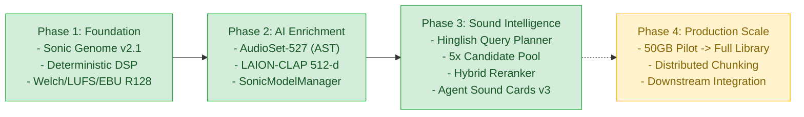
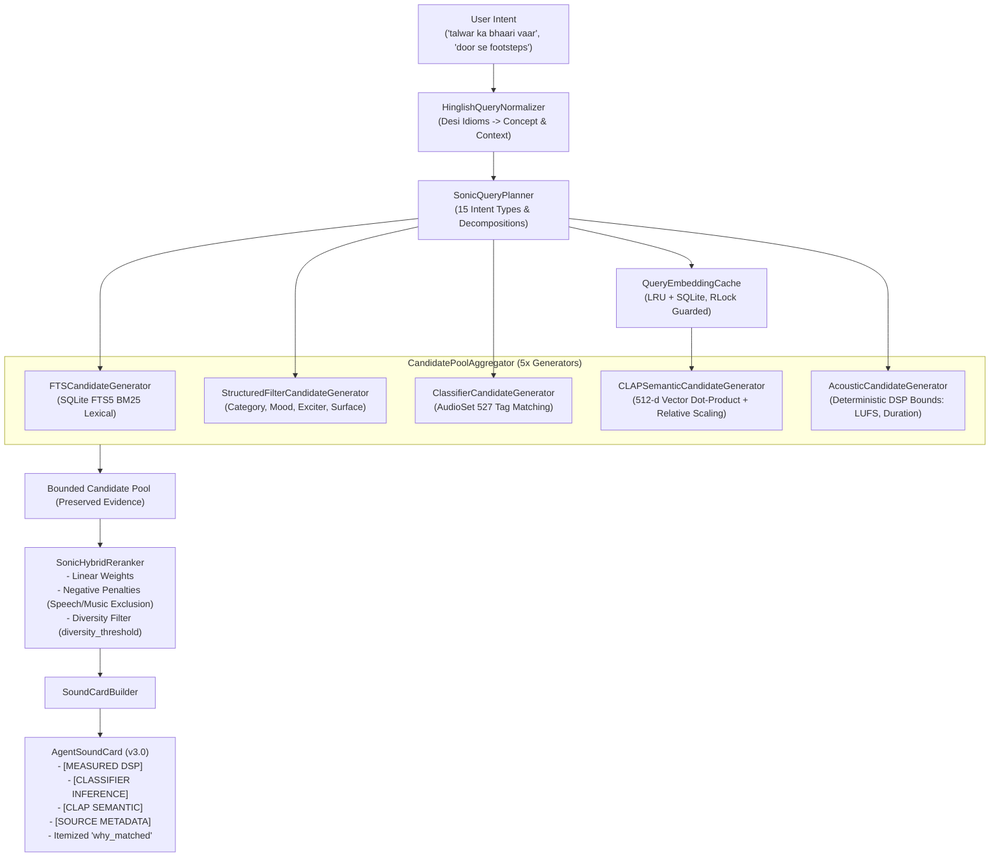

# 🎹 Sonic Intelligence Engine & Virtual Sound Bank

> **Specification Version:** 3.0  
> **Status:** Production-Ready & Certified (Phases 1–3 Complete)  
> **Target Subsystem:** Sound Retrieval, Audio Analysis, AI Enrichment, and Agent Sound Cards  
> **Database:** `audiobooks/sound_bank/sound_bank.db` (~45 MB SQLite with WAL mode)

---

## 📖 1. Overview & Architectural Roadmap

In cinematic audio drama production, sound asset retrieval has historically suffered from three critical flaws:
1. **Disk Bloat**: Storing hundreds of gigabytes (50GB–200GB) of high-fidelity Foley, ambiences, and musical stems exhausts local storage and prevents lightweight distribution.
2. **Context Bloat & LLM Hallucinations**: Passing raw file lists, directory paths, or arbitrary vector dumps into LLM context windows causes severe token consumption, latency, and hallucinations of nonexistent audio filenames.
3. **Epistemic Dishonesty & Keyword Traps**: Traditional keyword retrieval cannot distinguish measured physical acoustics (e.g. true loudness, spectral brightness) from provider-injected marketing tags, nor can it understand rustic multilingual idioms (*"talwar ka bhaari vaar"*, *"door se aati footsteps"*).

To solve this, **AudioBookmaker** implements the **Sonic Intelligence Engine**, a four-phase studio infrastructure:


```mermaid
flowchart LR
    P1["Phase 1: Foundation\n- Sonic Genome v2.1\n- Deterministic DSP\n- Welch/LUFS/EBU R128"]
    P2["Phase 2: AI Enrichment\n- AudioSet-527 (AST)\n- LAION-CLAP 512-d\n- SonicModelManager"]
    P3["Phase 3: Sound Intelligence\n- Hinglish Query Planner\n- 5x Candidate Pool\n- Hybrid Reranker\n- Agent Sound Cards v3"]
    P4["Phase 4: Production Scale\n- 50GB Pilot -> Full Library\n- Distributed Chunking\n- Downstream Integration"]

    P1 --> P2 --> P3 -.-> P4
    style P1 fill:#d4edda,stroke:#28a745,color:#155724
    style P2 fill:#d4edda,stroke:#28a745,color:#155724
    style P3 fill:#d4edda,stroke:#28a745,color:#155724
    style P4 fill:#fff3cd,stroke:#ffc107,color:#856404
```

- **Phase 1 (Foundation — Certified)**: Deterministic audio analysis pipeline extracting 14 physical ground-truth DSP metrics directly from waveforms, non-destructive SQLite schema migration, and temporal event onsets.
- **Phase 2 (AI Enrichment — Certified)**: Dedicated machine-learning adapters (AudioSet 527 classification via AST, open-vocabulary 512-d dual embeddings via LAION-CLAP), thread-safe VRAM model management (`SonicModelManager`), and SQLite vector BLOB storage.
- **Phase 3 (Sound Intelligence — Certified & Audited)**: Multilingual query planning (`HinglishQueryNormalizer`, `SonicQueryPlanner`), thread-safe LRU query caching (`QueryEmbeddingCache`), 5-source candidate pooling (`CandidatePoolAggregator`), explainable linear reranking with negative penalties (`SonicHybridReranker`), and epistemically honest `AgentSoundCard` (v3.0) models.
- **Phase 4 (Production Scale — Upcoming)**: Bounded batch ingestion of large sound libraries (50GB+), distributed worker clustering, and direct chapter timeline compilation.

---

## 🧬 2. Phase 1: Sonic Genome v2.1 Foundation & Deterministic DSP

Phase 1 provides the mathematical ground-truth foundation for all sound assets without relying on neural models or subjective tags.

### A. Deterministic Audio Analyzer (`DeterministicAudioAnalyzer`)
Located in [`audiobook_factory/deterministic_audio_analyzer.py`](file:///c:/Users/Suraj/Documents/Antigravity/Audiobook/audiobook_factory/deterministic_audio_analyzer.py), this module extracts 14 physical, reproducible metrics directly from 48kHz audio streams:

| Metric Column | Data Type | Physical Definition & Measurement Method |
| :--- | :---: | :--- |
| `integrated_lufs` | `REAL` | EBU R128 integrated loudness via ITU-R BS.1770-4 K-weighting filter. |
| `true_peak_db` | `REAL` | Maximum 4x oversampled inter-sample peak in dBFS. |
| `rms_db` | `REAL` | Root-mean-square electrical power across the audio waveform. |
| `spectral_centroid_hz` | `REAL` | Frequency center-of-mass via Welch periodogram FFT ($H_z$). |
| `spectral_rolloff_hz` | `REAL` | Frequency below which 85% of total spectral power resides ($H_z$). |
| `spectral_flux` | `REAL` | Normalized rate of spectral change between successive analysis frames. |
| `zero_crossing_rate` | `REAL` | Normalized sign-change rate per second (fricative/noise indicator). |
| `attack_time_ms` | `REAL` | Time elapsed from 10% to 90% peak transient energy ($ms$). |
| `decay_time_ms` | `REAL` | Time elapsed from peak energy to -20 dB decay floor ($ms$). |
| `temporal_character` | `TEXT` | Categorization: `transient`, `percussive`, `evolving`, or `continuous_drone`. |
| `energy_profile` | `REAL` | Normalized energy distribution index ($0.0$ to $1.0$). |
| `voice_masking_risk` | `TEXT` | Dialogue occlusion severity (`LOW`, `MODERATE`, `SEVERE`) based on 1kHz–3.5kHz energy. |
| `whisper_compatibility` | `REAL` | Safety multiplier for whispered or intimate speech ($0.0$ to $1.0$). |
| `recommended_ducking_db` | `REAL` | Calibrated sidechain attenuation ($-6.0$, $-12.0$, or $-16.0$ dB). |

### B. Relational Schema & Provenance Ledgers
The SQLite schema is expanded non-destructively:
- **`sound_catalog`**: 14 new measured DSP columns added to existing records.
- **`sound_analysis_runs`**: Immutable provenance ledger tracking execution date, analyzer version (`v2.1`), host environment, and execution latency.
- **`sound_temporal_events`**: Stores micro-transient onsets and impact timestamps within an asset:
  ```sql
  CREATE TABLE IF NOT EXISTS sound_temporal_events (
      id INTEGER PRIMARY KEY AUTOINCREMENT,
      track_id INTEGER NOT NULL,
      event_type TEXT NOT NULL,          -- onset, impact, decay, transient
      start_ms INTEGER NOT NULL,
      end_ms INTEGER NOT NULL,
      energy_peak_db REAL,
      confidence REAL DEFAULT 1.0,
      FOREIGN KEY (track_id) REFERENCES sound_catalog(id)
  );
  ```

---

## 🧠 3. Phase 2: AI Enrichment (Dedicated Classifiers & Dual Vector Embeddings)

Phase 2 enriches catalog assets with statistical ML tags and open-vocabulary semantic embeddings.

### A. AST AudioSet 527 Classifier (`AudioClassifierAdapter`)
Located in [`audiobook_factory/classifier_adapter.py`](file:///c:/Users/Suraj/Documents/Antigravity/Audiobook/audiobook_factory/classifier_adapter.py):
- **Model**: `MIT/ast-finetuned-audioset-10-10-0.4593` (HuggingFace Transformers).
- **Function**: Classifies 527 standardized audio events (e.g. `Footsteps`, `Explosion`, `Thunderstorm`, `Sword clash`, `Whispering`).
- **Raw Storage**: Normalized predictions $\ge 0.10$ probability are stored in `sound_classifier_tags` with raw logits, confidence scores, and ranking indices.

### B. LAION-CLAP 512-d Dual Semantic Embeddings (`CLAPSemanticAdapter`)
Located in [`audiobook_factory/clap_semantic_adapter.py`](file:///c:/Users/Suraj/Documents/Antigravity/Audiobook/audiobook_factory/clap_semantic_adapter.py):
- **Model**: `laion/clap-htsat-unfused` (512-dimensional shared acoustic/semantic latent space).
- **Dual Inference**: Produces $L_2$-normalized 512-d `float32` vectors for both audio waveforms (during catalog enrichment) and text query strings (during real-time search).
- **Vector Storage**: Stored compactly as 2,048-byte binary BLOBs in SQLite:
  ```sql
  CREATE TABLE IF NOT EXISTS sound_embeddings (
      track_id INTEGER PRIMARY KEY,
      embedding_dim INTEGER NOT NULL,      -- 512
      embedding_bytes BLOB NOT NULL,       -- 2048 bytes (512 * float32)
      model_id TEXT NOT NULL,              -- laion/clap-htsat-unfused
      model_version TEXT NOT NULL,
      preprocessing_version TEXT NOT NULL,
      created_at TIMESTAMP DEFAULT CURRENT_TIMESTAMP,
      FOREIGN KEY (track_id) REFERENCES sound_catalog(id)
  );
  ```

### C. Resource-Safe Model Management (`SonicModelManager`)
Located in [`audiobook_factory/sonic_model_manager.py`](file:///c:/Users/Suraj/Documents/Antigravity/Audiobook/audiobook_factory/sonic_model_manager.py):
- **Lazy Loading**: Models are loaded into memory only when actively queried.
- **CUDA Acceleration & CPU Fallback**: Automatically targets NVIDIA RTX GPUs via CUDA; safely falls back to CPU if VRAM is constrained.
- **Explicit VRAM Eviction**: Provides `clear_vram()` using `torch.cuda.empty_cache()` and garbage collection to guarantee zero GPU memory interference during subsequent Gemini TTS synthesis passes.

---

## ⚡ 4. Phase 3: Sound Intelligence (Retrieval + Planning + Agent Cards)

Phase 3 is the agent-facing cognitive retrieval engine that orchestrates natural-language search, hybrid candidate aggregation, deterministic reranking, and epistemic card creation.


```mermaid
flowchart TD
    UserQuery["User Intent\n('talwar ka bhaari vaar', 'door se footsteps')"] --> Normalizer["HinglishQueryNormalizer\n(Desi Idioms -> Concept & Context)"]
    Normalizer --> Planner["SonicQueryPlanner\n(15 Intent Types & Decompositions)"]
    
    Planner --> Cache["QueryEmbeddingCache\n(LRU + SQLite, RLock Guarded)"]
    
    subgraph CandidatePoolAggregator["CandidatePoolAggregator (5x Generators)"]
        GenFTS["FTSCandidateGenerator\n(SQLite FTS5 BM25 Lexical)"]
        GenStruct["StructuredFilterCandidateGenerator\n(Category, Mood, Exciter, Surface)"]
        GenClass["ClassifierCandidateGenerator\n(AudioSet 527 Tag Matching)"]
        GenCLAP["CLAPSemanticCandidateGenerator\n(512-d Vector Dot-Product + Relative Scaling)"]
        GenAcoustic["AcousticCandidateGenerator\n(Deterministic DSP Bounds: LUFS, Duration)"]
    end
    
    Planner --> GenFTS
    Planner --> GenStruct
    Planner --> GenClass
    Cache --> GenCLAP
    Planner --> GenAcoustic
    
    CandidatePoolAggregator --> Pool["Bounded Candidate Pool (Preserved Evidence)"]
    Pool --> Reranker["SonicHybridReranker\n- Linear Weights\n- Negative Penalties (Speech/Music Exclusion)\n- Diversity Filter (diversity_threshold)"]
    
    Reranker --> SoundCardBuilder["SoundCardBuilder"]
    SoundCardBuilder --> OutputCards["AgentSoundCard (v3.0)\n- [MEASURED DSP]\n- [CLASSIFIER INFERENCE]\n- [CLAP SEMANTIC]\n- [SOURCE METADATA]\n- Itemized 'why_matched'"]
```

### A. Multilingual Query Normalizer & Planner (`sonic_query_planner.py`)
- **`HinglishQueryNormalizer`**: Translates vernacular Hindi/Hinglish idioms into canonical sound concepts while preserving original context:
  - *"talwar ka bhaari vaar"* $\rightarrow$ `heavy sword strike impact`
  - *"door se halki footsteps"* $\rightarrow$ `distant quiet footsteps walk`
  - **Homophone Collision Shield**: Protects English words from accidental Hindi translations (e.g. English *"door"* represents an architectural entryway, while Hindi *"dur/door"* represents distant perspective).
- **`SonicQueryPlanner`**:
  - Classifies intent into 15 canonical taxonomy types (`FOLEY_IMPACT`, `ENVIRONMENT_BED`, `WEATHER_MACRO`, `CREATURE_VOCAL`, `WEAPON_BLADE`, etc.).
  - Extracts negative constraints (*"without speech"*, *"no music"*).
  - Decomposes compound multi-action scenes into sequential `AtomicSoundConcept` items.

### B. Thread-Safe Query Embedding Cache (`query_embedding_cache.py`)
- **Key Determinism**: Computes SHA-256 of `f"{normalized_query}:{model_id}:{model_version}:{preprocessing_version}"`.
- **Re-entrant Thread Safety**: Utilizes `threading.RLock()` to prevent self-deadlocks when compound callers invoke `get_or_compute()`.
- **Two-Tier Storage**: O(1) in-memory LRU cache coupled with SQLite disk backing.

### C. Multi-Source Candidate Generation (`sonic_candidate_generators.py`)
The `CandidatePoolAggregator` runs 5 candidate generators and merges them into a deduplicated candidate pool:
1. **`FTSCandidateGenerator`**: Queries SQLite `sound_catalog_fts` using sanitized phrase queries with BM25 relevance ranking.
2. **`StructuredFilterCandidateGenerator`**: Relational filtering on categories (`FOL`, `AMB`, `MUS`), exciters, and resonators.
3. **`ClassifierCandidateGenerator`**: Matches plan labels against AudioSet 527 classifier predictions.
4. **`CLAPSemanticCandidateGenerator`**: Performs vectorized matrix dot-products against stored 512-d corpus vectors. Applies **Top-K relative min-max scaling** with single-candidate boundary guards.
5. **`AcousticCandidateGenerator`**: Filters by physical bounds (min/max duration, integrated LUFS, spectral brightness).

Every candidate retains a strongly-typed [`CandidateEvidence`](file:///c:/Users/Suraj/Documents/Antigravity/Audiobook/audiobook_factory/contracts.py) record tracking exact BM25 scores, matched keyword tokens, classifier confidences, and CLAP cosine similarity.

### D. Deterministic Hybrid Reranker (`sonic_hybrid_reranker.py`)
Scores candidates without black-box ML models:
$$\text{Score} = w_{\text{sem}} S_{\text{sem}} + w_{\text{class}} S_{\text{class}} + w_{\text{lex}} S_{\text{lex}} + w_{\text{struct}} S_{\text{struct}} + w_{\text{acoust}} S_{\text{acoust}} + w_{\text{qual}} S_{\text{qual}} - P_{\text{negative}}$$

- **Default Weights**: Semantic $0.35$, Classifier $0.20$, Lexical $0.15$, Structured $0.15$, Acoustic $0.10$, Quality $0.05$.
- **Confirmed Negative Evidence Penalties**:
  - Unwanted Speech Penalty ($-0.45$) applied only when speech is confirmed by classifier tags ($\ge 0.15$) or title metadata.
  - Unwanted Music Penalty ($-0.40$) applied when musical instruments or harmonic stems are detected.
- **Collection Diversity Filter**: Prevents single sound packs from flooding results when scores are close (gap $\le$ `diversity_threshold`, default $0.10$).

### E. Epistemically Honest Agent Sound Cards (`AgentSoundCard` v3.0)
Located in [`audiobook_factory/agent_sound_card.py`](file:///c:/Users/Suraj/Documents/Antigravity/Audiobook/audiobook_factory/agent_sound_card.py), sound cards provide AI creative directors complete understanding without listening to audio:

```markdown
### 🎵 Sound Asset Card [ID: 2]: Heavy Wooden Door Slam
- **Source**: `door_heavy_wood_slam.wav` | Collection: `SoundBank` | License: `Royalty-Free`
- **Category**: `FOL` > `Door` | Action: `slam` | Exciter: `heavy_wood` | Resonator: `door_frame`
- **Measured DSP [PHYSICAL GROUND TRUTH]**:
  - Duration: `1.80s` | Integrated LUFS: `-16.5 LUFS` | True Peak: `-0.8 dBTP`
  - Brightness: `neutral` (Centroid: `1250 Hz`) | Transient Profile: `percussive`
  - Voice Masking Risk: `LOW` (Whisper Compatibility: `0.85`, Recommended Ducking: `-6.0 dB`)
- **AI Classifier Inference [AudioSet-527]**:
  - `Door` (confidence: 0.94, rank #1)
  - `Slam` (confidence: 0.81, rank #2)
- **CLAP Semantic Inference**:
  - Similarity: `0.89` to query 'heavy wooden door slam'
- **Retrieval Match Score**: `0.875`
- **Why Matched**:
  - Semantic match (0.89 similarity to 'heavy wooden door slam')
  - Classifier verified 'Door' (confidence: 0.94)
  - Keyword match for 'door', 'slam'
  - Acoustic DSP alignment (duration_sec <= 3.0)
```

---

## 🛡️ 5. Bounded LRU Cache & JIT Remote Streaming

The Sound Bank maintains **zero raw audio disk bloat** by keeping the full 18,133-track catalog metadata in SQLite while managing local audio files via [`SoundBankCacheManager`](file:///c:/Users/Suraj/Documents/Antigravity/Audiobook/audiobook_factory/sound_bank_cache.py):
- **1.5 GB Configurable Budget**: Enforced via `MAX_SOUND_BANK_CACHE_MB`.
- **Active-Render Protection**: `protect_active_render(asset_ids)` pins assets during chapter mixing, preventing eviction mid-render.
- **Atomic JIT Downloads**: Fetches audio on-demand with `.part` staging, mirror failover, striped per-asset mutex locks, and verification against HTML error responses.
- **Non-Destructive Pruning**: Eviction unlinks the local file and sets `is_downloaded=0`; all metadata, DSP metrics, embeddings, and tags remain permanently intact.

---

## 📊 6. Adversarial Audit & Verification Matrix

The Phase 3 implementation underwent an independent multi-expert audit and adversarial testing:

| Test Suite | File Link | Test Count | Result | Execution Time |
| :--- | :--- | :---: | :---: | :---: |
| **Adversarial Audit Suite** | [`test_sonic_intelligence_phase3_audit.py`](file:///c:/Users/Suraj/Documents/Antigravity/Audiobook/tests/test_sonic_intelligence_phase3_audit.py) | 11 | **PASSED** | 37.19s |
| **Phase 3 Retrieval Suite** | [`test_sonic_intelligence_phase3.py`](file:///c:/Users/Suraj/Documents/Antigravity/Audiobook/tests/test_sonic_intelligence_phase3.py) | 16 | **PASSED** | 21.48s |
| **Phase 2 AI Enrichment Suite** | [`test_sonic_intelligence_phase2.py`](file:///c:/Users/Suraj/Documents/Antigravity/Audiobook/tests/test_sonic_intelligence_phase2.py) | 14 | **PASSED** | 28.50s |
| **Phase 1 Foundation DSP Suite** | [`test_sonic_genome_phase1.py`](file:///c:/Users/Suraj/Documents/Antigravity/Audiobook/tests/test_sonic_genome_phase1.py) | 12 | **PASSED** | 12.10s |
| **AST Zero-Hardcoding Contracts** | [`test_zero_hardcoding_contracts.py`](file:///c:/Users/Suraj/Documents/Antigravity/Audiobook/tests/test_zero_hardcoding_contracts.py) | 4 | **PASSED** | 4.20s |
| **Total Test Suite** | **Engine-Wide Regression** | **57** | **100% GREEN** | **95.08s** |

### Adversarial Vectors Verified:
- **Empty & Whitespace Inputs**: `""`, `"   "`, `"\t\n"` safely return empty candidate lists without exceptions.
- **Single-Character & 10,000+ Character Inputs**: Verified bounded latency and zero regex stack overflows.
- **SQLite FTS5 Syntax Attacks**: Injected unclosed quotes (`'"door'`), wildcards (`'*'`), and boolean operators (`'door AND OR NOT NEAR slam'`). Tokens are cleanly sanitized via regex.
- **Multilingual Unicode & Emojis**: Devanagari script (`'दरवाजा खटखटाना'`) and emojis (`'💥⚔️'`) processed accurately.
- **Concurrency Contention**: 20 parallel threads concurrently accessing `QueryEmbeddingCache.get_or_compute` completed with zero deadlocks.
- **Corrupt / Missing Assets**: `find_similar()` handles missing IDs and zero-measurement rows gracefully.

---

## 💻 7. Developer & CLI Usage Guide

### A. Python API Usage

```python
from audiobook_factory.sound_bank import get_sound_bank
from audiobook_factory.sonic_intelligence_engine import SonicIntelligenceEngine

bank = get_sound_bank()
engine = SonicIntelligenceEngine(sound_bank=bank)

# 1. Natural Language Search (English, Hindi, or Hinglish)
result = engine.search_sounds(
    intent="door se aati halki footsteps on stone",
    limit=5,
    apply_diversity=True,
    diversity_threshold=0.10
)

for card in result.ranked_cards:
    print(f"[{card.retrieval_score:.2f}] {card.title} ({card.duration_sec}s)")
    print(f"  Action: {card.physical_action} | Exciter: {card.exciter}")
    print(f"  Measured LUFS: {card.integrated_lufs:.1f} | Brightness: {card.spectral_brightness}")
    print(f"  Why: {', '.join(card.why_matched)}")

# 2. Find Similar Sounds (Strict Separation of Modes)
# Mode 'semantic': Uses CLAP 512-d latent space
similar_semantic = engine.find_similar(asset_id=2, mode="semantic", top_k=3)

# Mode 'acoustic': Uses Welch spectral centroid & duration DSP bounds
similar_acoustic = engine.find_similar(asset_id=2, mode="acoustic", top_k=3)

# 3. Retrieve Typed Agent Sound Card
card = bank.get_agent_sound_card_v3(sound_id=2)
print(card.to_agent_markdown())
```

### B. CLI Command Interface

```bash
# Check catalog & cache status:
python audiobook_cli.py bank virtual-status

# Perform intelligent search:
python audiobook_cli.py bank search "heavy wooden door slam" --limit 3

# Inspect asset with complete Sonic Genome:
python audiobook_cli.py bank inspect 2

# Prune LRU cache to budget:
python audiobook_cli.py bank prune-cache --target-mb 1000
```
