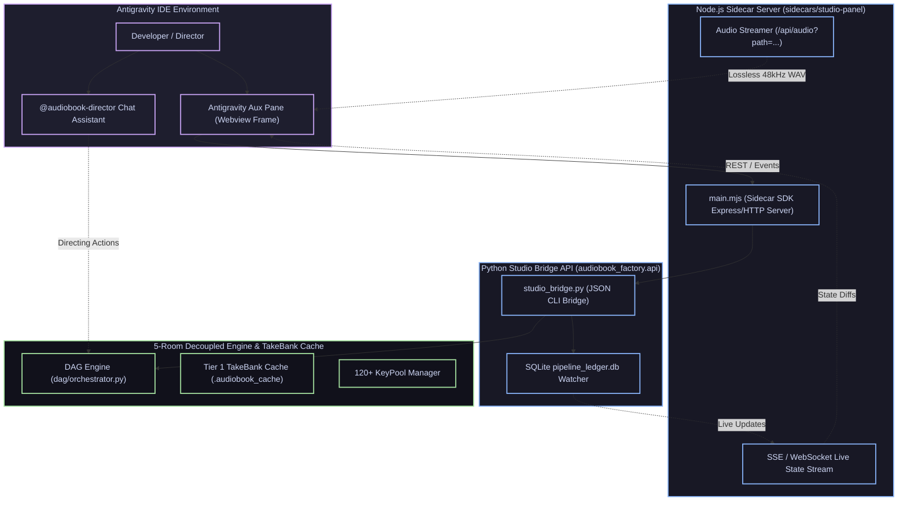
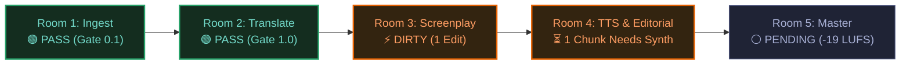
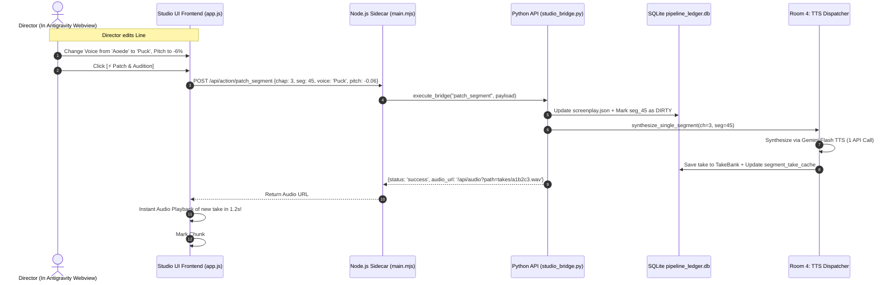

# 🎛️ Antigravity Plugin UI & Studio Sidecar Architecture Specification

**Plugin**: `audiobook-studio`  
**Component**: UI Extension & Sidecar Panel  
**Standard**: `v6.0-STUDIO-UI`  
**Host Environment**: Google Antigravity IDE (Windows 11 Workstation)  
**Classification**: Real-Time Visual Studio Control Surface & Interactive DAG Workspace  

---

## 1. Executive Summary & UI Design Philosophy

The **Audiobook Studio UI** transforms the backend 5-Room Decoupled DAG into an interactive visual control surface inside the Antigravity IDE (embedded as an Aux Pane / Webview Sidecar). 

### Core UI Philosophy: "Surgical Control with Zero Lag"
1. **Visual Fault Isolation**: Every room's state is visually decoupled. If translation requires adjustments, the director edits the sentence directly in the Room 2 panel to surgically patch the single beat without freezing or corrupting adjacent views.
2. **1-Click Audition & Instant Feedback**: Clicking any sentence card or character avatar instantly generates and plays single-segment audio in $< 1.5$ seconds.
3. **Real-Time Telemetry & Metering**: Live 120+ KeyPool health monitor, token-bucket concurrency meters, and Broadcast EBU R128 (-19.0 LUFS / -1.5 dBTP) visual meters.
4. **Stitch-Grade Studio Dark Aesthetic**: Obsidian-black chassis (`#0c0d14`), electric blue (`#7aa2f7`), emerald green (`#73daca`), amber warnings (`#ff9e64`), and studio typography (Inter + JetBrains Mono).

---

## 2. Global UI Topology & Antigravity Host Bridge



---

## 3. UI Layout & Component Hierarchy

The UI is structured into 4 persistent visual zones:

```
┌────────────────────────────────────────────────────────────────────────────────────────┐
│ ZONE 1: TOP NAVIGATION & GLOBAL TELEMETRY BAR                                          │
│ [Logo] Audiobook Studio v6.0 | [Project Selector ▼] | [Preset: Novel ▼] | [124 Keys 🟢]│
├────────────────────────────────────────────────────────────────────────────────────────┤
│ ZONE 2: 5-ROOM INTERACTIVE DAG STEPPER                                                 │
│ [ 1. Ingest (PASS) ] -> [ 2. Translate (PASS) ] -> [ 3. Screenplay (ACTIVE) ] -> ...  │
├────────────────────────────────────────────────────────────────────────────────────────┤
│ ZONE 3: FOCUSED WORKSPACE (TABBED ACCORDING TO ACTIVE ROOM)                           │
│                                                                                        │
│  ┌──────────────────────────────────────────────────────────────────────────────────┐  │
│  │ TAB 1: Translation Dual-Column Editor (English Source <-> Hindi Translation)      │  │
│  │ TAB 2: Screenplay & Anti-Swap Cast Board (Speaker, 4D Formants, Acting Prompts)  │  │
│  │ TAB 3: TTS Chunks & Dialogue Editorial Timeline (Waveform, Micro-Fades, TakeBank)│  │
│  │ TAB 4: Cast Audition Soundboard (114 Curated Personas)                           │  │
│  └──────────────────────────────────────────────────────────────────────────────────┘  │
├────────────────────────────────────────────────────────────────────────────────────────┤
│ ZONE 4: BROADCAST MASTER AUDIO DOCK (STICKY BOTTOM)                                    │
│ [ ▶ Play/Pause ] [ 03:24 / 18:44 ━━━━━●──────── ] [-19.0 LUFS 🟢] [-1.8 dBTP] [Export M4B] │
└────────────────────────────────────────────────────────────────────────────────────────┘
```

---

## 4. Detailed Specification of UI Functional Views

### 4.1 Zone 1: Top Navigation & Preset Switcher
- **Project Selector**: Switches between active novel projects in `./projects/` or creates a new project via EPUB drop.
- **Preset Selector**:
  - `AUDIOBOOK_STUDIO` (Full 5-Room Hindi Novel Factory)
  - `ENGLISH_AUDIOBOOK` (English-Only Novel, Bypasses Room 2)
  - `MULTI_HOST_PODCAST` (Research Ingestion $\to$ Banter Script $\to$ -16 LUFS Master)
  - `STANDALONE_TRANSLATION` (Document Ingestion $\to$ Hindi Collective)
- **KeyPool Health Pill**: Real-time counter showing `Active Keys` (green), `Cooling` (amber), and `Daily Exhausted` (red). Hovering opens a tooltip with per-key RPM telemetry.

---

### 4.2 Zone 2: Interactive 5-Room DAG Stepper


- **Click Interaction**: Clicking any step immediately activates that room's specialized workspace in Zone 3.
- **Action Triggers**: Each step header contains direct action icons (e.g. `[Re-run Room 3]`, `[Audit Gate 2]`, `[Lock All Segments]`).

---

### 4.3 Zone 3: Room Workspace Views

#### View A: Room 2 Translation Dual-Column Studio
- **Dual-Pane Parallel Alignment**: Left side English source text; Right side Devanagari Hindustani translation.
- **Surgical In-Place Editor**: Click any translated line to modify dialogue or narrative text.
- **Inline Action Button**: `[⚡ Patch Beat]`: Modifies single beat in `chapter_XXX_translation.json`, recalculates Gate 1.0, and marks downstream Room 3/4 as `DIRTY` without touching other 120+ chunks.

#### View B: Room 3 Screenplay & 4D Formant Cast Board
- **Segment Cards**:
  - **Speaker Tag**: Assigned character name (*Geralt*, *Yennefer*, *Narrator*).
  - **Voice Pill**: Assigned voice (`Puck`, `Aoede`, `Charon`).
  - **4D Formant Controls**: Interactive sliders for **Pitch Shift** ($-12\%$ to $+12\%$) and **Speed Multiplier** ($0.85\times$ to $1.15\times$).
  - **Acting Directive**: Badge with prompt (e.g. *"understated natural dialogue (never theatrical)"*).
  - **User Lock Toggle**: `[🔒 Lock Segment]` sets `provenance.user_locked: true` so automated pipeline never overwrites human casting.
  - **1-Click Audition**: `[🔊 Audition Line]` generates and plays that single sentence in $<1.5$s.

#### View C: Room 4 TTS Chunks & Editorial Waveform
- **Chunk Matrix**: Grid showing all segments with visual color coding:
  - 🟢 **Green (Cached)**: Audio exists in TakeBank. Zero API tokens needed.
  - ⚡ **Orange (Dirty)**: Script changed; ready to synthesize.
  - ⚪ **Gray (Pending)**: Not yet synthesized.
- **One-Click Actions**:
  - `[⚡ Synthesize Dirty Chunks Only]` (Calls Gemini Flash TTS for only un-cached chunks).
  - `[🎛️ Re-Stitch Dialogue Stem]` (Runs Tier 2 assembly graph in 1.8 seconds).
- **Hann Micro-Fade Visualizer**: Displays 12ms pre-speech / 18ms post-speech transition points and detected breaths.

#### View D: Cast Audition Soundboard
- **114 Studio Personas**: Interactive soundboard filtered by gender, age, and dramatic archetype (*Gravelly Hero, Caustic Mage, Warm Narrator, Menacing Villain*).
- **Instant Audition Button**: Plays pre-rendered Devanagari and English voice samples.

---

### 4.4 Zone 4: Broadcast Master Audio Dock (Sticky Footer)
- **Continuous Playback Engine**: Seamlessly streams `chapter_XXX_mastered.m4a` or raw `dialogue.wav`.
- **EBU R128 Broadcast Metering Badge**:
  - **Integrated Loudness**: Real-time read-out (Target: `-19.0 LUFS ±0.5`). Color changes to green if certified, red if breaching.
  - **True Peak Meter**: Ceiling gauge (Target: $\le -1.5\text{ dBTP}$).
  - **LRA (Dynamic Range)**: $\le 6.5\text{ LU}$.
- **One-Click Mastering Triggers**:
  - `[🎛️ Run Two-Pass Loudnorm]`
  - `[📦 Package Full M4B with Cover]`

---

## 5. UI-to-Engine IPC Sequence Flows



---

## 6. Sidecar API Endpoints Specification

The Node.js sidecar (`main.mjs`) provides standard REST/SSE endpoints:

| Endpoint | Method | Payload / Query | Description |
| :--- | :--- | :--- | :--- |
| `/api/status` | `GET` | None | Returns Sidecar uptime, Python engine health, and active KeyPool count. |
| `/api/projects` | `GET` | None | Scans and lists all active and mastered book/podcast projects. |
| `/api/project/detail`| `GET` | `?slug=sword_of_destiny` | Returns full chapter list, stage ledger status, and cast roster. |
| `/api/project/screenplay` | `GET` | `?slug=sword&chap=3` | Returns all screenplay segments with 4D formants and provenance. |
| `/api/action/patch_segment` | `POST` | `{slug, chap, seg_id, text, voice, pitch}` | Surgically updates a single segment and invalidates its take hash. |
| `/api/action/run_stage` | `POST` | `{slug, chap, room_name, mode}` | Triggers standalone execution of Room 1, 2, 3, 4, or 5. |
| `/api/action/audition` | `POST` | `{voice, text, pitch, speed}` | Generates an instant scratch audio take for live voice audition. |
| `/api/audio` | `GET` | `?path=projects/sword/mastered/ch03.m4a` | Streams lossless 48kHz audio buffer with range-request support. |
| `/api/events` | `GET` | `SSE Stream` | Real-time event stream broadcasting DAG progress and gate results. |

---

## 7. Stitch-Grade Aesthetic & Styling Tokens

The UI uses standard CSS variables aligned with the Antigravity design system:

```css
:root {
  --bg-base: #0c0d14;         /* Obsidian deep background */
  --bg-surface: #161822;      /* Card and panel background */
  --bg-elevated: #1f2335;     /* Interactive elements and hover state */
  --border-subtle: #292e42;   /* Subtle divider border */
  --border-focus: #7aa2f7;    /* Active element border */
  
  --text-primary: #c0caf5;    /* High contrast reading text */
  --text-secondary: #7982a9;  /* Metadata and labels */
  --text-muted: #565f89;      /* Disabled and placeholder text */
  
  --accent-blue: #7aa2f7;     /* Primary action buttons and indicators */
  --accent-green: #73daca;    /* Passed gates, cached hits, certified LUFS */
  --accent-amber: #ff9e64;    /* Dirty segments, review warnings */
  --accent-ruby: #f7768e;     /* Key exhaustion, failed gates */
  --accent-gold: #e0af68;     /* Mastered deliverables, Hindustani badge */

  --font-sans: 'Inter', system-ui, -apple-system, sans-serif;
  --font-mono: 'JetBrains Mono', 'Fira Code', monospace;
}
```
