# 🚪 Subsystems Specification Suite (Rooms 1 through 5)

**Standard**: `v6.0-ENTERPRISE-DAG`  
**Schema Version**: `"2.0"`  
**Classification**: Standalone Decoupled Production Rooms  

---

## 1. Architectural Topology Overview

Each room operates as an independent, testable subsystem that ingests strictly validated JSON artifacts, performs deterministic domain transformations, and emits immutable outbound artifacts verified by quality gates.

```mermaid
flowchart TD
    subgraph Room1["Room 1: Forensic Ingestion (room1_ingest)"]
        R1_In["Raw Novel (PDF/EPUB/TXT)"] --> R1_Proc["Geometric XY-Cut Extraction<br/>Lore & Entity Harvester"]
        R1_Proc --> R1_Out["Artifacts:<br/>• raw_book_manifest.json<br/>• book_bible.json<br/>• cast_lock.json"]
        R1_Out --> Gate01{"Gate 0.1 AST Monotonicity"}
    end

    subgraph Room2["Room 2: Translation Collective (room2_translate)"]
        R2_In["Artifacts from Room 1"] --> R2_Proc["4-Agent Translation Collective<br/>(Dual-Rule Invariant + Tri-Partite Names)"]
        R2_Proc --> R2_Out["Artifact:<br/>• chapter_XXX_translation.json"]
        R2_Out --> Gate10{"Gate 1.0 Translation Fidelity"}
    end

    subgraph Room3["Room 3: Screenplay & Anti-Swap (room3_screenplay)"]
        R3_In["Artifacts from Room 2 & CastLock"] --> R3_Proc["Dramaturgy & 4D Formants<br/>Anti-Swap Attribution Auditor"]
        R3_Proc --> R3_Out["Artifact:<br/>• chapter_XXX_screenplay.json"]
        R3_Out --> Gate20{"Gate 2.0 Anti-Swap Gate (0% Flips)"}
    end

    subgraph Room4["Room 4: Multi-Cast TTS & Editorial (room4_synth)"]
        R4_In["Artifacts from Room 3 & TakeBank"] --> R4_Proc["Gemini Flash TTS + TakeBank Cache<br/>DE-01 - DE-07 DSP Assembly"]
        R4_Proc --> R4_Out["Artifacts:<br/>• chapter_XXX_dialogue.wav<br/>• timeline_ledger.json"]
        R4_Out --> Gate40{"Gate 4.0 Audio Integrity"}
    end

    subgraph Room5["Room 5: Broadcast Mastering (room5_master)"]
        R5_In["Artifacts from Room 4 & Cover Art"] --> R5_Proc["Two-Pass Linear Loudnorm (-19 LUFS)<br/>Kaiser Sinc 48kHz & M4B Packaging"]
        R5_Proc --> R5_Out["Deliverables:<br/>• chapter_XXX_mastered.m4a<br/>• final_audiobook.m4b"]
        R5_Out --> Gate50{"Gate 5.0 Broadcast EBU R128"}
    end

    Gate01 -->|"PASSED"| R2_In
    Gate10 -->|"PASSED"| R3_In
    Gate20 -->|"PASSED"| R4_In
    Gate40 -->|"PASSED"| R5_In

    classDef rStyle fill:#1e1e2e,stroke:#89b4fa,stroke-width:2px,color:#cdd6f4;
    classDef gateStyle fill:#181825,stroke:#a6e3a1,stroke-width:2px,color:#cdd6f4;
    class Room1,Room2,Room3,Room4,Room5 rStyle;
    class Gate01,Gate10,Gate20,Gate40,Gate50 gateStyle;
```



---

## 2. Room 1 Specification: Ingestion & Forensic Lore (`room1_ingest`)

### 2.1 Responsibilities & Guarantees
- **Geometric Reading Order**: Parses complex multi-column digital PDFs and EPUBs using XY-cut bounding box sorting (`PDFLayoutReconstructor`).
- **Character-Accurate Provenance**: Invariant preservation of raw text spans and character offsets (`SourceProvenance`).
- **Entity & Lore Extraction**: Extracts characters, phonetic Devanagari transliterations, and world facts into `book_bible.json` and `cast_lock.json`.
- **Gate 0.1 Invariant**: Guarantees zero sentence duplication, monotonic token ordering, and valid AST structure.

### 2.2 Inbound & Outbound Data Contracts
- **Inbound**: Source digital file (`.epub`, `.pdf`, `.txt`, `.md`).
- **Outbound**: `RawBookManifest`, `BookBible`, `CastLock`.

### 2.3 Standalone CLI Invocation
```bash
# Ingest full novel
python -m audiobook_factory.cli.ingest \
    --source "books/Sword_of_Destiny.epub" \
    --project-dir "./projects/sword_of_destiny" \
    --fidelity-tier "RAW_UNRATED"
```

### 2.4 Standalone Python API
```python
from audiobook_factory.rooms.room1_ingest import IngestionEngine

engine = IngestionEngine(project_dir="./projects/sword_of_destiny")
manifest, bible, cast_lock = engine.process_source("books/Sword_of_Destiny.epub")
print(f"Ingested {len(manifest.chapters)} chapters. Book ID: {manifest.book_id}")
```

---

## 3. Room 2 Specification: Translation Collective (`room2_translate`)

### 3.1 Responsibilities & Guarantees
- **4-Agent Collective Architecture**:
  1. `LiteraryDraftTranslator`: Translates source prose into dramatic, sense-for-sense Hindustani.
  2. `HindustaniCadenceSpecialist`: Tunes spoken pacing, natural pauses (`—`, `,`), and dynamic honorifics.
  3. `SubtextAndIdiomDramaturge`: Crafts authentic Hindustani idioms, gritty metaphors, and unrated dialogue.
  4. `TranslationQualityCritic`: Audits anti-omission parity and checks `BookBible` terminology.
- **Dual-Rule Invariant**:
  - `CLASSIC_REVERENT`: Authorial dignity and sacred literary pathos.
  - `RAW_UNRATED`: Visceral combat gore, rustic profanity, and somatic realism.
- **Tri-Partite Entity Partition**:
  - Proper Names & Heraldic Monikers: Phonetically transliterated into Devanagari (*सिल्वर फाल्कन*).
  - Occupational Roles: Naturally localized into spoken Hindustani (*अजनबी, कसाई, सरायवाला*).
- **Surgical Beat Patching**: Re-translates individual beats without invalidating unchanged chapter beats.

### 3.2 Inbound & Outbound Data Contracts
- **Inbound**: `RawBookManifest` (or individual `RawChapterRecord`) + `BookBible`.
- **Outbound**: `TranslationManifest` containing ordered `TranslationBeatRecord` items.

### 3.3 Standalone CLI Invocation
```bash
# Translate full chapter
python -m audiobook_factory.cli.translate \
    --chapter 3 \
    --mode RAW_UNRATED \
    --project-dir "./projects/sword_of_destiny"

# Surgical single-beat patch
python -m audiobook_factory.cli.translate \
    --chapter 3 \
    --patch-beat "ch03_beat012" \
    --text "विचर ने तलवार म्यान से खींची और धीमी आवाज़ में बोला।" \
    --project-dir "./projects/sword_of_destiny"
```

### 3.4 Standalone Python API
```python
from audiobook_factory.rooms.room2_translate import TranslationCollective

collective = TranslationCollective(project_dir="./projects/sword_of_destiny")
translation_manifest = collective.translate_chapter(chapter_id=3, mode="RAW_UNRATED")
```

---

## 4. Room 3 Specification: Screenplay & Anti-Swap Dramaturgy (`room3_screenplay`)

### 4.1 Responsibilities & Guarantees
- **Prose-to-Screenplay Parsing**: Parses translated text into dialogue turns and narration blocks.
- **Gate 2.0 Anti-Swap Attribution Auditor**:
  - Guarantees **0% speaker turn inversion** ($A \leftrightarrow B$).
  - Guarantees **0 quote leakage** into Narrator blocks.
  - Strips residual speech tags (`"उसने कहा"`, `"उसने चिल्ला कर जवाब दिया"`).
- **4D Acoustic Formant Staging**:
  - Assigns character voices from `cast_lock.json`.
  - Calculates pitch shifts ($\pm 4-12\%$), tempo multipliers ($0.85-1.15\times$), and parametric EQ profiles to ensure same-gender voice uniqueness.
- **Directing Restraint & Temperature Clamping**:
  - Lead Narrator: Locked to temperature `0.32` and directive `"calm, steady, articulate, measured audiobook delivery"`.
  - Dialogue Characters: Clamped to temperature `0.35 - 0.42` (max `0.50` in extreme climax).
- **Human Director Override Preservation**: Segments with `user_locked: true` are strictly preserved during reconciliation passes.

### 4.2 Inbound & Outbound Data Contracts
- **Inbound**: `TranslationManifest` + `CastLock`.
- **Outbound**: `ScreenplayScript` containing `ScreenplaySegment` records.

### 4.3 Standalone CLI Invocation
```bash
# Generate screenplay for chapter
python -m audiobook_factory.cli.screenplay \
    --chapter 3 \
    --project-dir "./projects/sword_of_destiny"

# Reconcile dirty screenplay segments without touching locked segments
python -m audiobook_factory.cli.screenplay \
    --chapter 3 \
    --reconcile-dirty \
    --project-dir "./projects/sword_of_destiny"
```

### 4.4 Standalone Python API
```python
from audiobook_factory.rooms.room3_screenplay import ScreenplayDramaturge

dramaturge = ScreenplayDramaturge(project_dir="./projects/sword_of_destiny")
screenplay_script = dramaturge.build_screenplay(chapter_id=3)
```

---

## 5. Room 4 Specification: Multi-Cast TTS & Dialogue Editorial (`room4_synth`)

### 5.1 Responsibilities & Guarantees
- **Tier 1 TakeBank Cache Lookup**: Resolves existing takes via SHA-256 hash ($0\text{ms}$ delay, 0 API quota used).
- **Concurrent Gemini Flash TTS Dispatch**: Parallel synthesis for uncached segments using rotating token-bucket key pools.
- **Dialogue Editorial Layer (DE-01 - DE-07)**:
  - 12ms pre-speech fade-in and 18ms post-speech fade-out at -52 dBFS zero-crossings.
  - Contextual pause realization (60ms–2200ms) and conversational overlap (-100ms to -350ms).
  - Highpass DC offset filtering at 40 Hz and relative breath attenuation (-6.0 dB).
- **Tier 2 Local Assembly Graph**: Stitches audio clips locally in $< 2.0$ seconds, producing a lossless 48kHz/24-bit master dialogue stem.

### 5.2 Inbound & Outbound Data Contracts
- **Inbound**: `ScreenplayScript` + TakeBank cache.
- **Outbound**: `ChapterDialogueManifest` (`chapter_XXX_dialogue.wav` + `timeline_ledger.json`).

### 5.3 Standalone CLI Invocation
```bash
# Synthesize and assemble dialogue stem
python -m audiobook_factory.cli.synth \
    --chapter 3 \
    --workers 4 \
    --editorial-preset "natural" \
    --project-dir "./projects/sword_of_destiny"
```

### 5.4 Standalone Python API
```python
from audiobook_factory.rooms.room4_synth import SynthesisAndEditorialEngine

engine = SynthesisAndEditorialEngine(project_dir="./projects/sword_of_destiny")
dialogue_manifest = engine.synthesize_chapter(chapter_id=3, max_workers=4)
print(f"Dialogue Stem WAV generated at: {dialogue_manifest.lossless_dialogue_wav_path}")
```

---

## 6. Room 5 Specification: Broadcast Vocal Mastering (`room5_master`)

### 6.1 Responsibilities & Guarantees
- **Audible / EBU R128 Broadcast Compliance**:
  - Integrated Vocal Target: **-19.0 LUFS $\pm 0.5$ LUFS**.
  - True Peak Hard Ceiling: **$\le -1.5$ dBTP**.
  - Dynamic Range (LRA): **$\le 6.5$ LU**.
- **Two-Pass Measured Linear Loudnorm**: Pass 1 measurement with `-f null -`, Pass 2 linear application (`linear=true`) with measured stats offset.
- **Zero De-Esser Invariant**: Eliminates sibilance distortion while preserving crisp Hindi dental consonants.
- **Kaiser Sinc 48kHz / 24-bit Resampling**.
- **Container Packaging**: Packages `.m4b` container with FFMETADATA1 chapter markers, TOC navigation, and embedded high-resolution cover artwork.

### 6.2 Inbound & Outbound Data Contracts
- **Inbound**: `ChapterDialogueManifest` (or list of dialogue stems) + Cover art image (`.jpg`/`.png`).
- **Outbound**: `MasterArtifact` (`chapter_XXX_mastered.m4a`) and `ContainerM4BManifest` (`final_audiobook.m4b`).

### 6.3 Standalone CLI Invocation
```bash
# Master single chapter
python -m audiobook_factory.cli.master \
    --chapter 3 \
    --target-lufs -19.0 \
    --project-dir "./projects/sword_of_destiny"

# Package complete novel into chaptered M4B
python -m audiobook_factory.cli.package \
    --cover "assets/cover.jpg" \
    --project-dir "./projects/sword_of_destiny"
```

### 6.4 Standalone Python API
```python
from audiobook_factory.rooms.room5_master import BroadcastMasteringEngine

mastering_engine = BroadcastMasteringEngine(project_dir="./projects/sword_of_destiny")

# Master single chapter
master_artifact = mastering_engine.master_chapter(chapter_id=3, target_lufs=-19.0)

# Package all mastered chapters
m4b_manifest = mastering_engine.package_audiobook(
    cover_image_path="assets/cover.jpg",
    output_filename="Sword_of_Destiny.m4b"
)
```
