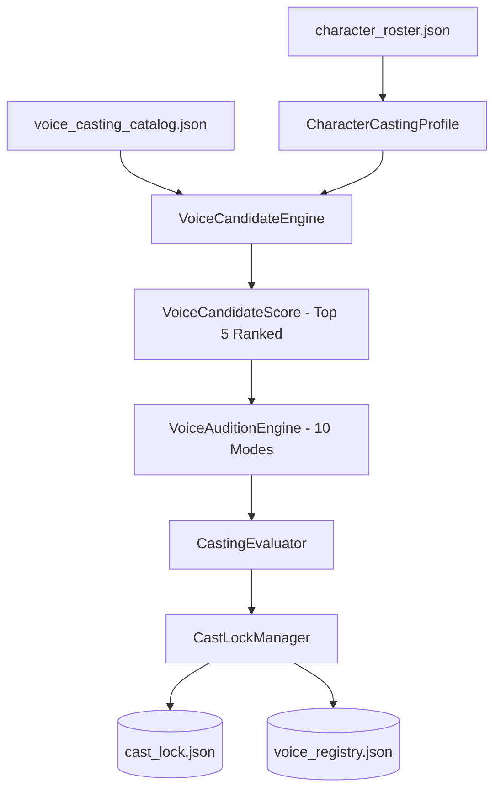

# TTS Voice Casting Subsystem Architecture

## 1. Overview & Principles

The **TTS Voice Casting Subsystem** provides commercial audiobook-grade voice selection, empirical auditioning, and authoritative locking. Built according to ADR-021 and ADR-032, it replaces subjective guesswork with an explainable 10-dimension match engine, standardized 10-mode auditioning, and immutable cast locks.

### Core Architecture Invariants
- **Evolution, Not Replacement**: Integrates seamlessly with existing character rosters and `voice_registry.json`.
- **Authoritative Priority**: `cast_lock.json` overrides raw registry configurations. If a character is locked, downstream TTS synthesis strictly respects the lock.
- **AST Zero-Hardcoding**: Engine files contain zero book-specific character names or chapter branching conditions. All logic operates on typed contracts.
- **Full Traceability & Invalidation**: Recasting a character automatically archives previous takes and updates the manifest history.

---

## 2. Contracts & Data Schemas

Located in [`audiobook_factory/casting/contracts.py`](file:///c:/Users/Suraj/Documents/Antigravity/Audiobook/audiobook_factory/casting/contracts.py).

### `CharacterCastingProfile`
Derived non-destructively from `BookEntity`, `CharacterLanguageProfile`, and `CharacterPerformanceProfile`:
```python
class CharacterCastingProfile(BaseModel):
    character_id: str
    canonical_name: str
    gender: CastingGender  # "male", "female", "neutral"
    perceived_age: PerceivedAgeCategory  # "child", "youth", "young_adult", "prime_adult", "mature_adult", "elder"
    sociolect_archetype: str
    warmth: float  # 0.0 to 1.0
    aggression: float  # 0.0 to 1.0
    authority: float  # 0.0 to 1.0
    restraint: float  # 0.0 to 1.0
    vocal_weight: VocalWeight  # "light", "medium", "heavy"
    timbre_preference: TimbreType  # "gravelly", "smooth", "raspy", "warm", "sharp", "resonant"
    pitch_preference: PitchBand  # "low", "medium_low", "medium", "medium_high", "high"
```

### `CastLock` & `CastLockManifest`
Persistent state stored in `cast_lock.json`:
```python
class CastLock(BaseModel):
    character_id: str
    character_name: str
    voice_id: str
    casting_version: str = "1.0.0"
    locked: bool = True
    locked_at: str
    locked_by: str = "Director"
    selection_rank: int = 1
    selection_rationale: str
    casting_evidence: Dict[str, Any]
    calibration_overrides: Dict[str, Any]
```

---

## 3. Subsystem Components



### 3.1 Voice Candidate Engine
[`VoiceCandidateEngine`](file:///c:/Users/Suraj/Documents/Antigravity/Audiobook/audiobook_factory/casting/candidate_engine.py):
- Evaluates 12 Gemini TTS catalog voices (`charon`, `fenrir`, `puck`, `aoede`, `kore`, `leda`, `zephyr`, `achernar`, `achird`, `algenib`, `alnilam`, `orus`).
- Computes dimensional match across:
  1. Gender compatibility (hard filter)
  2. Perceived age alignment
  3. Pitch band compatibility
  4. Timbre & vocal weight resonance
  5. Sociolect archetype affinity
  6. Ensemble distinctiveness (penalizes voice collisions with already-cast characters)
- Generates human-readable, explainable recommendations.

### 3.2 Standardized 10-Mode Audition Engine
[`VoiceAuditionEngine`](file:///c:/Users/Suraj/Documents/Antigravity/Audiobook/audiobook_factory/casting/audition_engine.py):
Rigorously tests candidate voices across 10 expressive extremes before casting is finalized:
1. `neutral`: Baseline atmospheric pacing and cadence.
2. `conversational`: Natural, unhurried dialogue exchanges.
3. `authority`: Commanding vocal weight, chest resonance, absolute certainty.
4. `anger`: Controlled, fierce fury without shrill distortion.
5. `vulnerability`: Softened weight, cracked composure, intimate subtext.
6. `fear`: Suppressed panic, rapid respiratory catches.
7. `whisper`: Air-to-tone close-mic delivery with zero clipping.
8. `humor`: Dry irony, sarcastic inflection, comedic timing.
9. `action`: High adrenaline, exertion breaths, staccato delivery.
10. `transition`: Shift from calm certainty to explosive intensity across a single line.

### 3.3 Cast Lock Manager & Recast Invalidation
[`CastLockManager`](file:///c:/Users/Suraj/Documents/Antigravity/Audiobook/audiobook_factory/casting/cast_lock.py):
- Maintains atomic state in `cast_lock.json`.
- Synchronizes backward-compatible `voice_registry.json`.
- When recasting occurs via `recast_character()`, existing audio takes for the character are flagged as obsolete and relocated to `takes/.archived/`.

---

## 4. Human Casting Console (CLI)

Interactive CLI tool located at [`scripts/casting_console.py`](file:///c:/Users/Suraj/Documents/Antigravity/Audiobook/scripts/casting_console.py).

### Commands
```powershell
# 1. List all catalog voices with acoustic attributes
.\.venv\Scripts\python.exe scripts/casting_console.py --list-voices

# 2. View current casting status of the project
.\.venv\Scripts\python.exe scripts/casting_console.py --status

# 3. Get candidate recommendations for a character
.\.venv\Scripts\python.exe scripts/casting_console.py --recommend "Captain" --top 5

# 4. Generate 10-mode audition pack
.\.venv\Scripts\python.exe scripts/casting_console.py --audition "Captain" --all-modes

# 5. Lock character voice assignment
.\.venv\Scripts\python.exe scripts/casting_console.py --lock "Captain" "charon" --reason "Approved by director"

# 6. Recast character with audio invalidation
.\.venv\Scripts\python.exe scripts/casting_console.py --recast "Captain" "fenrir" --reason "Required deeper vocal weight"
```

---

## 5. Quality Gate Audits

- **Gate 1 (Voice Casting & Collision Elimination)**: Verifies that no two active speaking characters share identical acoustic signatures, and validates `voice_registry.json` against `cast_lock.json`.
- **Gate 6A (Cross-Chapter Voice Continuity)**: Enforces that characters speaking across multiple chapters retain identical voice IDs anchored by `cast_lock.json`.
