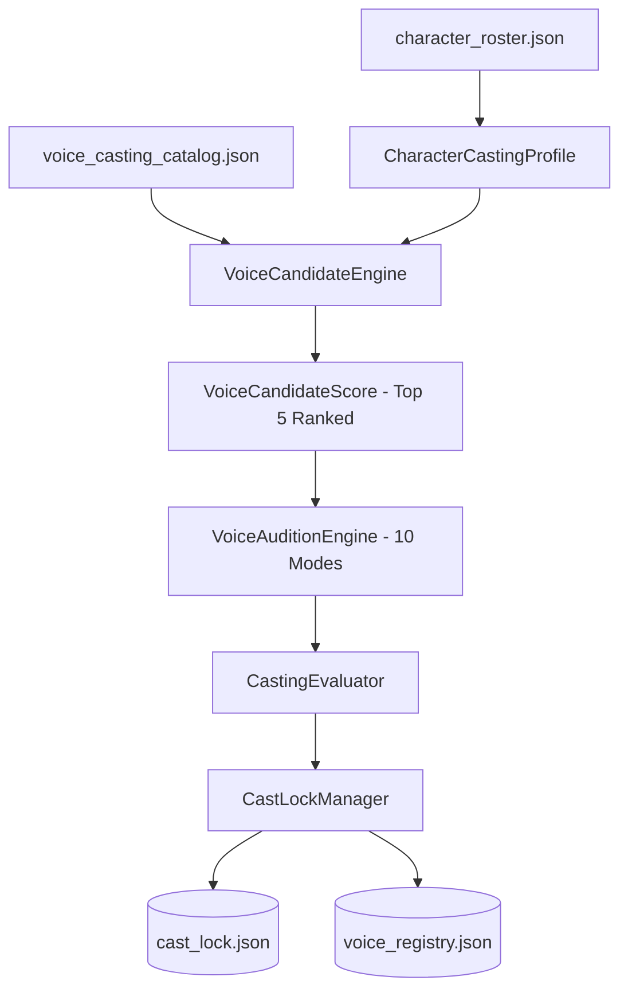

# TTS Voice Casting Subsystem Architecture

## 1. Overview & Principles

The **TTS Voice Casting Subsystem** provides commercial audiobook-grade voice selection, empirical auditioning, and authoritative locking. Built according to ADR-021 and ADR-032, it replaces subjective guesswork with an explainable 10-dimension match engine, standardized 10-mode auditioning, and immutable cast locks.

### Core Architecture Invariants
- **Evolution, Not Replacement**: Integrates seamlessly with existing character rosters and `voice_registry.json`.
- **Authoritative Priority**: `cast_lock.json` overrides raw registry configurations. If a character is locked, downstream TTS synthesis strictly respects the lock.
- **AST Zero-Hardcoding**: Engine files contain zero book-specific character names or chapter branching conditions. All logic operates on typed contracts.
- **Full Traceability & Invalidation**: Recasting a character automatically archives previous takes and updates the manifest history.

---

## 2. Contracts & Data Schemas

Located in [`audiobook_factory/casting/contracts.py`](file:///c:/Users/Suraj/Documents/Antigravity/Audiobook/audiobook_factory/casting/contracts.py).

### `CharacterCastingProfile`
Derived non-destructively from `BookEntity`, `CharacterLanguageProfile`, and `CharacterPerformanceProfile`:
```python
class CharacterCastingProfile(BaseModel):
    character_id: str
    canonical_name: str
    gender: CastingGender  # "male", "female", "neutral"
    perceived_age: PerceivedAgeCategory  # "child", "youth", "young_adult", "prime_adult", "mature_adult", "elder"
    sociolect_archetype: str
    warmth: float  # 0.0 to 1.0
    aggression: float  # 0.0 to 1.0
    authority: float  # 0.0 to 1.0
    restraint: float  # 0.0 to 1.0
    vocal_weight: VocalWeight  # "light", "medium", "heavy"
    timbre_preference: TimbreType  # "gravelly", "smooth", "raspy", "warm", "sharp", "resonant"
    pitch_preference: PitchBand  # "low", "medium_low", "medium", "medium_high", "high"
```

### `CastLock` & `CastLockManifest`
Persistent state stored in `cast_lock.json`:
```python
class CastLock(BaseModel):
    character_id: str
    character_name: str
    voice_id: str
    casting_version: str = "1.0.0"
    locked: bool = True
    locked_at: str
    locked_by: str = "Director"
    selection_rank: int = 1
    selection_rationale: str
    casting_evidence: Dict[str, Any]
    calibration_overrides: Dict[str, Any]
```

---

## 3. Subsystem Components


```mermaid
flowchart TD
    CR[character_roster.json] --> CCP[CharacterCastingProfile]
    VCC[voice_casting_catalog.json] --> VCE[VoiceCandidateEngine]
    CCP --> VCE
    VCE --> VCS[VoiceCandidateScore - Top 5 Ranked]
    VCS --> VAE[VoiceAuditionEngine - 10 Modes]
    VAE --> CE[CastingEvaluator]
    CE --> CLM[CastLockManager]
    CLM --> CLJ[(cast_lock.json)]
    CLM --> VRJ[(voice_registry.json)]
```

### 3.1 Voice Candidate Engine
[`VoiceCandidateEngine`](file:///c:/Users/Suraj/Documents/Antigravity/Audiobook/audiobook_factory/casting/candidate_engine.py):
- Evaluates 12 Gemini TTS catalog voices (`charon`, `fenrir`, `puck`, `aoede`, `kore`, `leda`, `zephyr`, `achernar`, `achird`, `algenib`, `alnilam`, `orus`).
- Computes dimensional match across:
  1. Gender compatibility (hard filter)
  2. Perceived age alignment
  3. Pitch band compatibility
  4. Timbre & vocal weight resonance
  5. Sociolect archetype affinity
  6. Ensemble distinctiveness (penalizes voice collisions with already-cast characters)
- Generates human-readable, explainable recommendations.

### 3.2 Standardized 10-Mode Audition Engine
[`VoiceAuditionEngine`](file:///c:/Users/Suraj/Documents/Antigravity/Audiobook/audiobook_factory/casting/audition_engine.py):
Rigorously tests candidate voices across 10 expressive extremes before casting is finalized:
1. `neutral`: Baseline atmospheric pacing and cadence.
2. `conversational`: Natural, unhurried dialogue exchanges.
3. `authority`: Commanding vocal weight, chest resonance, absolute certainty.
4. `anger`: Controlled, fierce fury without shrill distortion.
5. `vulnerability`: Softened weight, cracked composure, intimate subtext.
6. `fear`: Suppressed panic, rapid respiratory catches.
7. `whisper`: Air-to-tone close-mic delivery with zero clipping.
8. `humor`: Dry irony, sarcastic inflection, comedic timing.
9. `action`: High adrenaline, exertion breaths, staccato delivery.
10. `transition`: Shift from calm certainty to explosive intensity across a single line.

**Synthesis & Forensic Telemetry Integration**:
- Works natively with callable synthesis functions, `TTSDispatcher` instances, or standalone module functions.
- Generates dynamic acoustic evaluations via [`MathematicalAcousticAnalyzer`](file:///c:/Users/Suraj/Documents/Antigravity/Audiobook/audiobook_factory/forensic_analyzer.py), deriving real `overall_score` from RMS loudness, duration stability, and spectral flatness purity.

### 3.3 Cast Lock Manager & Recast Invalidation
[`CastLockManager`](file:///c:/Users/Suraj/Documents/Antigravity/Audiobook/audiobook_factory/casting/cast_lock.py):
- Maintains atomic state in `cast_lock.json`.
- Synchronizes backward-compatible `voice_registry.json`.
- When recasting occurs via `recast_character()`, existing audio takes for the character are flagged as obsolete and relocated to `takes/.archived/`.

---

## 4. Human Casting Console (CLI)

Interactive CLI tool located at [`scripts/casting_console.py`](file:///c:/Users/Suraj/Documents/Antigravity/Audiobook/scripts/casting_console.py).

### Commands
```powershell
# 1. List all catalog voices with acoustic attributes
.\.venv\Scripts\python.exe scripts/casting_console.py --list-voices

# 2. View current casting status of the project
.\.venv\Scripts\python.exe scripts/casting_console.py --status

# 3. Get candidate recommendations for a character
.\.venv\Scripts\python.exe scripts/casting_console.py --recommend "Captain" --top 5

# 4. Generate 10-mode audition pack
.\.venv\Scripts\python.exe scripts/casting_console.py --audition "Captain" --all-modes

# 5. Lock character voice assignment
.\.venv\Scripts\python.exe scripts/casting_console.py --lock "Captain" "charon" --reason "Approved by director"

# 6. Recast character with audio invalidation
.\.venv\Scripts\python.exe scripts/casting_console.py --recast "Captain" "fenrir" --reason "Required deeper vocal weight"
```

---

## 5. Quality Gate Audits

- **Gate 1 (Voice Casting & Collision Elimination)**: Verifies that no two active speaking characters share identical acoustic signatures, and validates `voice_registry.json` against `cast_lock.json`. Dynamically validates all 2,089 catalog voices with Seiyū child exceptions.
- **Gate 6A (Cross-Chapter Voice Continuity)**: Enforces that characters speaking across multiple chapters retain identical voice IDs anchored by `cast_lock.json`.

---

## 6. Dynamic 2,089 Voice Catalog (`VoiceCatalog`)

Starting in v4.0, casting extends beyond the initial 12 studio voices:
- **Comprehensive Voice Universe**: [`audiobook_factory/tts/voice_catalog.py`](file:///c:/Users/Suraj/Documents/antigravity/optimistic-kepler/audiobook_factory/tts/voice_catalog.py) manages all 2,089 verified voices across Gemini 3.8 Flash TTS.
  - 114 native Hindi voices (`hi-IN`) across diverse regional dialects.
  - 120 regional Indian English personas (`en-IN`).
  - 215 English Gemini studio voices (`en-US`, `en-GB`, `en-AU`).
- **Dynamic Dialect Resolution**:
  Instead of static mapping, LLM character profiles indicate target regional dialects:
  - `Awadhi Hindi` (UP)
  - `Bhojpuri Hindi` (Bihar)
  - `Haryanvi Hindi` (Haryana)
  - `Bundeli Hindi` (MP)
  - `Urdu / Delhi Hindi`
  - `Mumbaiya / Tapori Hindi`
  - `Dakhini Hindi` (Deccan)
  `CharacterCaster` searches the catalog dynamically for matching dialect and gender tags.

---

## 7. Child & Adolescent Voice Architecture

Due to the absence of native child voices in the underlying TTS API, a dual-tier acoustic architecture is implemented:

### 1. The Anime Seiyū Child Engine (Girls & Young Boys <14yo)
- **Principle**: Modeled after Japanese anime voice acting (where adult female seiyū voice young boys like Naruto, Luffy, Goku):
- **Base Voice**: Young, high-pitch female voices (`hi-in-commercial-5`, `hi-in-commercial-7`, `Kore`).
- **Acoustic Modulation**:
  - Pitch Shift: $+10\text{--}15\%$ via `asetrate` and `aresample`.
  - Child Resonance EQ: High-shelf brightness boost (+2.5dB @ 3.2kHz), low-cut chest attenuation (-4dB @ 200Hz).
  - Pacing: Agile, energetic cadence ($1.05\text{--}1.10\times$).

### 2. Young Rustic Fighter Profile (Adolescent Boys 14–17yo)
- **Problem**: Pitch-shifting adult males produces synthetic chipmunk artifacts; using female voices sounds overly feminine.
- **Solution**: Dynamic casting pairs adolescent male roles with 22–23yo rustic young male bases (`hi-in-podcaster-12`, `hi-in-commercial-8`, `hi-in-techagent-6`) with subtle physical EQ rather than pitch warping.

---

## 8. Narrator POV & Gate 1 Dynamic Contracts

- **Third-Person Narratives**: `Aoede` remains the immutable default for omniscient, elegant storytelling.
- **First-Person POV Protagonists**: If the novel is written from a male protagonist's first-person perspective, `CharacterCaster` dynamically aligns the Narrator voice with the protagonist's gender and vocal archetype.
- **Zero-Hardcoding Gate 1**: Gate 1 literary verification dynamically queries `VoiceCatalog` to validate gender and persona matching, supporting child seiyū casting exceptions without static whitelist clamps.

