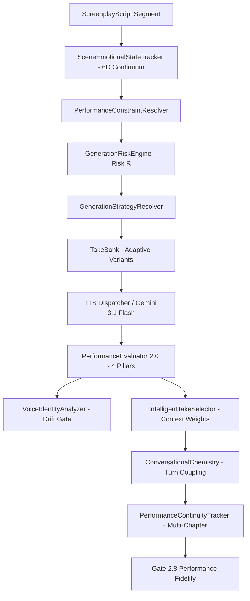

# TTS Generation & Acting Intelligence Architecture

## 1. Overview & Core Directives

The **TTS Generation & Acting Intelligence Subsystem** elevates audiobook vocal synthesis to commercial cinematic standards (Harry Potter / Pottermore caliber). It models human dramatic acting through continuous emotional spaces, prioritized vocal constraint resolution, adaptive take banking, acoustic voice drift defense, and cross-turn dialogue chemistry.

### Core Architectural Invariants
1. **Evolution, Not Replacement**: Preserves existing `TTSDispatcher` synthesis contracts while layering advanced performance directing, dynamic take generation, and multidimensional evaluation.
2. **Sacred Text Immutability**: Literary script dialogue is 100% sacred and never modified, pruned, or rewritten during synthesis.
3. **AST Zero-Hardcoding**: Engine files contain zero book-specific character tokens or chapter branch hacks. All operations execute through strongly typed Pydantic v2 schemas.
4. **Fail-Closed Quality Gates**: Pre-Mix Gate 2.8 guarantees that poor acting, emotional teleportation, or acoustic drift cannot enter audio mastering.

---

## 2. Pipeline Architecture

---

## 3. Subsystem Layers

### 3.1 Voice DNA & Acoustic Baseline
- **Voice DNA Model ([`VoiceDNA`](file:///c:/Users/Suraj/Documents/Antigravity/Audiobook/audiobook_factory/identity/voice_dna.py)):**
  4-layer model defining:
  1. *Identity Layer*: Baseline timbre, pitch band, perceived age, resonance placement, vocal weight, accent.
  2. *Behavior Layer*: Baseline pace, projection energy, articulation style, pause style, breath behavior, restraint.
  3. *Emotional Tendencies*: Character-specific style shifts for anger, fear, grief, joy, intimacy, exhaustion.
  4. *Forbidden Layer*: Boundary rules preventing uncharacteristic delivery styles.
- **Reference Voice Bank ([`ReferenceVoiceBank`](file:///c:/Users/Suraj/Documents/Antigravity/Audiobook/audiobook_factory/identity/reference_bank.py)):**
  Maintains golden reference recordings and extracts 4-dimensional acoustic signatures (Median F0, Spectral Centroid, Spectral Flatness, RMS dBFS).
- **Voice Identity Analyzer ([`VoiceIdentityAnalyzer`](file:///c:/Users/Suraj/Documents/Antigravity/Audiobook/audiobook_factory/identity/voice_drift_analyzer.py)):**
  Evaluates synthesized takes against reference acoustic signatures using dynamic tolerance that widens gracefully during extreme dramatic expressions (crying, rage).

### 3.2 Acting Intelligence & Constraint Resolution
- **Scene Emotional Continuum ([`SceneEmotionalStateTracker`](file:///c:/Users/Suraj/Documents/Antigravity/Audiobook/audiobook_factory/performance/scene_emotional_state.py)):**
  Tracks a 6-dimensional continuous emotional vector:
  $$\mathbf{V} = (\text{valence}, \text{arousal}, \text{tension}, \text{restraint}, \text{vulnerability}, \text{energy}) \in [0.0, 1.0]^6$$
  Applies exponential smoothing ($\alpha = 0.35$) and flags unmotivated volatile ruptures.
- **Performance Constraint Resolver ([`PerformanceConstraintResolver`](file:///c:/Users/Suraj/Documents/Antigravity/Audiobook/audiobook_factory/performance/constraint_resolver.py)):**
  Resolves complex screenplay metadata into:
  - *Primary Intention*: 1 dominant active transitive verb objective.
  - *Secondary Modifiers*: Maximum 2–3 essential delivery nuances.
  - *Forbidden Behaviors*: Explicit boundary constraints.
  - *Clean Style Descriptor*: Concise, non-contradictory prompt descriptor for TTS providers.

### 3.3 Generation Strategy & Risk Allocation
- **Generation Risk Engine ([`GenerationRiskEngine`](file:///c:/Users/Suraj/Documents/Antigravity/Audiobook/audiobook_factory/performance/risk_engine.py)):**
  Calculates continuous segment risk $R \in [0.0, 1.0]$ based on emotional extremity, whispering, shouting, crying, rapid pace, subtext complexity, and pronunciation flags.
- **Generation Strategy Resolver ([`GenerationStrategyResolver`](file:///c:/Users/Suraj/Documents/Antigravity/Audiobook/audiobook_factory/performance/strategy_resolver.py)):**
  Allocates generation mode dynamically:
  - `CHUNKED_NARRATION`: Routine low-risk narration ($R < 0.30$, 1 take).
  - `ISOLATED_SINGLE_TAKE`: Standard dialogue ($R < 0.40$, 1 take).
  - `ISOLATED_MULTI_TAKE`: Moderate dramatic risk ($0.40 \le R < 0.70$, 2 takes).
  - `CRITICAL_SCENE_TAKE`: High-stakes dramatic moment ($R \ge 0.70$, 3 takes with adaptive variations: `more_restrained`, `more_vulnerable`, `slower_heavier`, `colder`, `more_urgent`).

### 3.4 Multi-Pillar Dimensional QC & Intelligent Take Selection
- **Evaluator 2.0 ([`PerformanceEvaluator`](file:///c:/Users/Suraj/Documents/Antigravity/Audiobook/audiobook_factory/performance/evaluator.py)):**
  Rigorously assesses candidate takes across 4 pillars:
  1. *Acoustic Pillar*: Clipping, DC bias, spectral flatness, high-frequency ratio, dead air endpoints.
  2. *Performance Pillar*: Emotional match, pacing fidelity, restraint vs explosion, prosody.
  3. *Voice Identity Pillar*: Acoustic drift detection against golden reference signatures.
  4. *Relational Pillar*: Power positioning, subtextual nuance, trust and intimacy.
- **Intelligent Take Selector ([`IntelligentTakeSelector`](file:///c:/Users/Suraj/Documents/Antigravity/Audiobook/audiobook_factory/performance/take_selector.py)):**
  Applies context-aware weighting (Exposition vs Climax vs Whisper vs Confrontation) and automatically penalizes drifted takes by $-0.40$.

### 3.5 Ensemble Dialogue Chemistry & Inter-Chapter Continuity
- **Conversational Chemistry ([`ConversationalChemistry`](file:///c:/Users/Suraj/Documents/Antigravity/Audiobook/audiobook_factory/performance/chemistry.py)):**
  - Couples adjacent dialogue turns across characters:
    - *Interruption Snapping*: Near-zero onset latency ($\le 40\text{ ms}$) on abrupt cuts.
    - *Intimidation Hesitation*: Submissive characters exhibit realistic response delays ($\ge 700\text{ ms}$).
    - *Intimate Whisper Proximity*: Enforces soft vocal projection and close-mic acoustic resonance.
  - Post-synthesis acoustic evaluation via `evaluate_dialogue_chemistry()` measuring pause fidelity, interruption sharpness, and dynamic energy contrast.
- **Long-Form Performance Continuity ([`PerformanceContinuityTracker`](file:///c:/Users/Suraj/Documents/Antigravity/Audiobook/audiobook_factory/performance/continuity.py)):**
  Tracks character metrics across scenes and chapters, persisting state to `character_continuity.json`. Detects inter-chapter physical recovery anomalies (e.g. wounded to combat strain without recovery beat) and unbuffered energy leaps.

---

## 4. Verification & Testing

The subsystem is continuously validated by three layers of automated testing:
1. **AST Zero-Hardcoding Contracts ([`tests/test_zero_hardcoding_contracts.py`](file:///c:/Users/Suraj/Documents/Antigravity/Audiobook/tests/test_zero_hardcoding_contracts.py))**:
   Ensures zero character names, chapter branching conditions, or soundtrack filenames in engine files.
2. **Subsystem Wave Suites**:
   - [`tests/test_wave1_casting.py`](file:///c:/Users/Suraj/Documents/Antigravity/Audiobook/tests/test_wave1_casting.py) (Casting)
   - [`tests/test_wave2_voice_identity.py`](file:///c:/Users/Suraj/Documents/Antigravity/Audiobook/tests/test_wave2_voice_identity.py) (Voice Identity & Drift)
   - [`tests/test_wave3_acting_intelligence.py`](file:///c:/Users/Suraj/Documents/Antigravity/Audiobook/tests/test_wave3_acting_intelligence.py) (Acting Intelligence)
   - [`tests/test_wave4_generation_quality.py`](file:///c:/Users/Suraj/Documents/Antigravity/Audiobook/tests/test_wave4_generation_quality.py) (Take Banking & Evaluator 2.0)
   - [`tests/test_wave5_ensemble_performance.py`](file:///c:/Users/Suraj/Documents/Antigravity/Audiobook/tests/test_wave5_ensemble_performance.py) (Ensemble & Continuity)
3. **Golden Audio Regression Suite ([`tests/test_golden_audio_regression_suite.py`](file:///c:/Users/Suraj/Documents/Antigravity/Audiobook/tests/test_golden_audio_regression_suite.py))**:
   Runs 18 distinct dramatic scenarios offline with synthetic audio fixtures, asserting complete pipeline integrity in < 2 seconds.
