# TTS Generation & Commercial Studio Quality Architecture (Waves 1–6 & Waves A–E)

## 1. Overview & Core Directives

The **TTS Generation & Acting Intelligence Subsystem** elevates synthetic vocal performance to the commercial standards of high-end audio drama productions (e.g., Pottermore, GraphicAudio, Audible Full-Cast Drama). Rather than treating Text-to-Speech (TTS) as isolated, linear line rendering, the architecture models theatrical acting through continuous 6D emotional vectors, prioritized vocal constraint resolution, adaptive take banking, acoustic voice drift defense, millisecond-accurate CTC forced alignment, evidence-grounded performance evaluation, pairwise judicial take selection, and whole-scene dramatic arcs.

```
┌─────────────────────────────────────────────────────────────────────────────────────────────────────────────┐
│                                 COMMERCIAL STUDIO QUALITY PIPELINE                                          │
│                                                                                                             │
│  [Screenplay Segment]                                                                                       │
│           │                                                                                                 │
│           ▼ (Waves 1-3)                                                                                     │
│  [SceneEmotionalStateTracker] ──> [ConstraintResolver] ──> [RiskEngine] ──> [StrategyResolver]              │
│                                                                                    │                        │
│                                                                                    ▼ (Wave 4)               │
│                                                                          [TakeBank Multi-Take]              │
│                                                                                    │                        │
│                                                                                    ▼                        │
│                                                                      [TTS Dispatcher / Gemini 3.8]          │
│                                                                                    │                        │
│           ┌────────────────────────────────────────────────────────────────────────┴─────────────┐          │
│           ▼ (Wave A: Alignment 2.0)                                                             ▼          │
│  [WorkstationForcedAligner]                                                      [Raw WAV Output]           │
│   • MMS_FA CTC Word Spans                                                                 │                 │
│   • 7-Class Pause Intelligence                                                            │                 │
│   • Multi-Signal Confidence                                                               │                 │
│           │                                                                               │                 │
│           └───────────────────────────────────┬───────────────────────────────────────────┘                 │
│                                               ▼ (Wave B: Evaluator 2.0)                                     │
│                                   [PerformanceEvaluator]                                                    │
│                                    • PerformanceEvidence Extraction                                         │
│                                    • Normalized Autocorrelation F0                                          │
│                                    • Monotonic Pitch Lock Defense                                           │
│                                    • Restraint vs. Loudness Audit                                           │
│                                    • 2-Tier Voice Identity Gates                                            │
│                                               │                                                             │
│                                               ▼ (Wave C: Take Selection 2.0)                                │
│                                   [IntelligentTakeSelector]                                                 │
│                                    • Stage 1-3 Hard Gates                                                   │
│                                    • Stage 4: 6-Mode Contextual Scoring                                     │
│                                    • Stage 5: PairwiseTakeJudge Deliberation                                │
│                                    • Stage 6: TakeSelectionResult Contract                                  │
│                                               │                                                             │
│                                               ▼ (Wave D: Scene & Chemistry)                                 │
│                                   [select_scene_takes Orchestrator]                                         │
│                                    • Whole-Scene Performance Arc                                            │
│                                    • Conversational Chemistry Turn Coupling                                 │
│                                    • Character Pace Continuity Tracking                                     │
│                                               │                                                             │
│                                               ▼ (Wave 6 / Gate 2.8)                                         │
│                                   [Pre-Mix Gate 2.8 Performance Fidelity]                                   │
│                                               │                                                             │
│                                               ▼                                                             │
│                                   [CinemaAudioEngine 5-Stem Master]                                         │
└─────────────────────────────────────────────────────────────────────────────────────────────────────────────┘
```

### Core Architectural Invariants
1. **Sacred Literary Text Immutability**: Spoken dialogue text is strictly invariant. TTS provider directives, acting descriptors, and prosodic hints reside exclusively in separate metadata payloads (`speechMetadata.style`) and are never injected into spoken dialogue strings.
2. **AST Zero-Hardcoding**: Engine modules contain 0 hardcoded character names, book titles, or chapter branch conditionals. All operations execute through strongly typed Pydantic v2 schemas validated by static AST test suites.
3. **Evidence-Grounded Evaluation**: Subjective impressions are replaced by empirical acoustic, prosodic, pacing, alignment, and vocal identity measurements (`PerformanceEvidence`).
4. **The Non-Loudest Best Principle**: Shouting, aggressive projection, and unmotivated loudness are actively penalized when scene direction calls for cold menace, quiet grief, intimacy, or iron restraint.
5. **Fail-Closed Quality Gates**: Pre-Mix Gate 2.8 and staged take selection hard gates reject audio artifacts, catastrophic voice drift, or severe alignment failures before dialogue enters mastering.

---

## 2. Subsystem Architecture Overview

The subsystem integrates two complementary development cycles:
- **Waves 1–6 (Theatrical Foundation)**: Empirical casting, cast locking, 4-layer Voice DNA, 6D scene emotional trajectories, constraint resolution, dynamic risk allocation, priority take banking, turn coupling, and long-form continuity tracking.
- **Waves A–E (Commercial Studio Quality Upgrade)**:
  - **Wave A**: Forced Alignment 2.0 (`WordAlignment`, `PauseInterval`, `SpeechRegion`, MMS_FA CTC token spans, 7 pause classes, energy-valley fallback).
  - **Wave B**: Performance Evidence (`PerformanceEvidence`, `AcousticEvidence`, `ProsodyEvidence`, `PacingEvidence`, `VoiceIdentityEvidence`, autocorrelation F0 tracking, monotonic pitch-lock detection, restraint enforcement, two-tier voice identity gates).
  - **Wave C**: Take Selection 2.0 (`IntelligentTakeSelector`, `TakeSelectionResult`, `PairwiseTakeJudge`, 3-stage hard gates, 6-mode contextual scoring, reason codes).
  - **Wave D**: Scene Selection & Continuity (`select_scene_takes`, whole-scene performance arc, listener fatigue defense, premature climax defense, conversational chemistry coupling).
  - **Wave E**: Golden Behavioral Benchmark Suite (`test_golden_take_selection_benchmark.py`, 7 scenario proofs).

```mermaid
flowchart TD
    subgraph PreTTS["Pre-TTS: Theatrical Directing & Banking"]
        Seg["ScreenplaySegment (contracts.py)"] --> SEST["SceneEmotionalStateTracker<br/>(6D Continuous Continuum)"]
        SEST --> PCR["PerformanceConstraintResolver<br/>(Primary + Modifiers)"]
        PCR --> GRE["GenerationRiskEngine<br/>(Continuous Risk R in [0, 1])"]
        GRE --> GSR["GenerationStrategyResolver<br/>(Mode Allocation)"]
        GSR --> TB["TakeBank<br/>(Adaptive Variant Pooling)"]
    end

    subgraph TTSExec["Speech Synthesis"]
        TB --> Dispatcher["TTSDispatcher / Gemini 3.8 Flash<br/>(speechMetadata.style)"]
        Dispatcher --> Audio["Raw Candidate WAV Takes"]
    end

    subgraph WaveA["Wave A: Alignment 2.0 (forced_aligner.py)"]
        Audio --> MMS["WorkstationForcedAligner<br/>(TorchAudio MMS_FA CTC on CUDA)"]
        MMS --> AlignRes["AlignmentResult Contract<br/>• Word Token Spans<br/>• 7 Pause Classes<br/>• Calibrated Confidence"]
    end

    subgraph WaveB["Wave B: Evidence & Evaluator 2.0 (evaluator.py)"]
        Audio & AlignRes --> PE["PerformanceEvaluator<br/>• Autocorrelation F0 Tracking<br/>• Pitch Variance & Monotonic Check<br/>• Crest Dynamic Range (dB)<br/>• Restraint vs. Loudness Audit<br/>• 2-Tier Voice Identity Probe"]
        PE --> PerfEv["PerformanceEvidence Contract"]
        PerfEv --> EvalRes["PerformanceEvaluationResult<br/>(8 Dimensional Scores)"]
    end

    subgraph WaveC["Wave C: Take Selection 2.0 (take_selector.py)"]
        EvalRes --> HardGates{"Stage 1-3 Hard Gates<br/>1. Technical Audio Integrity<br/>2. Alignment Validity<br/>3. Voice Identity Safety"}
        HardGates -->|Pass| ContextScore["Stage 4: 6-Mode Contextual Scoring<br/>(Exposition / Climax / Whisper / Anger / Grief / Standard)"]
        HardGates -->|Fail All| ReviewFlag["review_required = True"]
        ContextScore --> PairwiseJudge{"Stage 5: Close Margin?<br/>(Delta <= 0.05 or Climax / Restraint)"}
        PairwiseJudge -->|Yes| PTJ["PairwiseTakeJudge.deliberate()<br/>• Forensic Evidence Comparison"]
        PairwiseJudge -->|No| TopTake["Top Scored Take"]
        PTJ & TopTake --> TSR["Stage 6: TakeSelectionResult<br/>• Winner & Runner-Up<br/>• Machine Reason Codes<br/>• Confidence & Review Flags"]
    end

    subgraph WaveD["Wave D: Scene Arc & Ensemble Coupling"]
        TSR --> SceneArc["select_scene_takes()<br/>• Energy / Pace / Tension Arc<br/>• Fatigue Defense<br/>• Premature Climax Guard"]
        SceneArc --> CC["ConversationalChemistry<br/>(Turn Coupling & Interruption Snapping)"]
        CC --> PCT["PerformanceContinuityTracker<br/>(Character Pace Telemetry)"]
    end

    subgraph GateCertification["Pre-Mix Certification"]
        PCT --> Gate28["Gate 2.8: Performance Fidelity Gate"]
        Gate28 --> Cinema["CinemaAudioEngine (5-Stem Master)"]
    end
```



---

## 3. Wave A: Forced Alignment 2.0 & Token Spans

Wave A establishes frame-accurate phonetic synchronization, pause classification, and diagnostic reporting via [`audiobook_factory/forced_aligner.py`](file:///c:/Users/Suraj/Documents/Antigravity/Audiobook/audiobook_factory/forced_aligner.py) and typed contracts in [`audiobook_factory/alignment_contracts.py`](file:///c:/Users/Suraj/Documents/Antigravity/Audiobook/audiobook_factory/alignment_contracts.py).

### 3.1 TorchAudio MMS_FA CTC Alignment
The aligner utilizes Meta's Multilingual Speech Forced Aligner (`MMS_FA`) executing natively on workstation CUDA hardware (NVIDIA RTX 4050 GPU) or CPU fallback:
- **Audio Preprocessing**: WAV waveforms are loaded via a standard library wave-tensor loader (`_load_wav_tensor_safely`) to avoid external C++ runtime dependencies (`soundfile`/`sox`) on Windows. Waveforms are normalized to 16kHz mono.
- **CTC Emission Matrix**: Generates token emission posteriors:
  $$\mathbf{E} \in \mathbb{R}^{B \times T \times V}$$
  where $T$ represents acoustic frames (approximately 20ms per frame) and $V$ represents the CTC token vocabulary.
- **Trellis Dynamic Programming**: The aligner computes the optimal path through the emission trellis aligning phonetic characters to frame spans.

### 3.2 Token Normalization & Devanagari Mapping
To support bilingual Hindi, Hindustani, and Hinglish dialogue without acoustic degradation, text undergoes language-aware transliteration before tokenization:
- Neural acting tags (`[whispers]`, `[gasp]`, `[sighs]`) are stripped prior to phonetic token generation.
- Unicode NFC normalization is applied.
- Complete Devanagari transliteration table ([`DEVA_TO_ROMAN_MAP`](file:///c:/Users/Suraj/Documents/Antigravity/Audiobook/audiobook_factory/forced_aligner.py#L37-L50)) maps consonants, aspirated consonants (`ख` $\rightarrow$ `kh`), conjuncts, matras, nuktas (`क़` $\rightarrow$ `q`, `फ़` $\rightarrow$ `f`), and Chandrabindu (`ँ` $\rightarrow$ `n`) into romanized CTC vocabulary `[a-z'\-\s]`.
- [`normalize_text_for_alignment`](file:///c:/Users/Suraj/Documents/Antigravity/Audiobook/audiobook_factory/forced_aligner.py#L76-L100) produces paired source and phonetic tokens, maintaining guaranteed $1:1$ correspondence for [`WordAlignment`](file:///c:/Users/Suraj/Documents/Antigravity/Audiobook/audiobook_factory/alignment_contracts.py#L130-L146).

### 3.3 7-Class Pause Intelligence
Speech silences are classified into 7 discrete acoustic and dramatic categories:

| Pause Class | Duration Window | Acoustic / Contextual Criteria | Pipeline Action |
|---|:---:|---|---|
| `natural_pause` | $150\text{ ms} \le t < 650\text{ ms}$ | Grammatical or inter-phrase breathing space | Preserved as normal conversational flow |
| `dramatic_pause` | $650\text{ ms} \le t \le 1800\text{ ms}$ | Intentional dramatic silence; or $t \ge 1800\text{ ms}$ with restraint $\ge 0.80$ or climactic priority | Protected from dead-air clamping; rewarded in scoring |
| `hesitation` | $< 150\text{ ms}$ (intra-line) | Micro-hesitation without terminal punctuation | Preserves conversational uncertainty |
| `interruption_gap` | $\le 100\text{ ms}$ | Dialogue cutoff triggered by `interruption_behavior != 'none'` | Snapped to next turn onset |
| `breath_pause` | $\le 350\text{ ms}$ (initial) | Pre-speech respiratory intake window | Synchronized with `TimelineSegment.pre_roll_breath_ms` |
| `dead_air` | $> 1800\text{ ms}$ | Trailing or unmotivated silence without dramatic priority | Triggers diagnostic `UNEXPECTED_LONG_SILENCE`; penalized |
| `synthetic_gap` | $\ge 50\text{ ms}$ | RMS level $< -65.0\text{ dBFS}$ (digital zero step dropout) | Flagged as vocoder drop anomaly |

### 3.4 Multi-Signal Calibrated Confidence Formula
Rather than relying solely on raw CTC posterior averages, alignment confidence is computed across 5 independent signals:

$$C_{\text{align}} = w_p C_{\text{phonetic}} + w_c C_{\text{coverage}} + w_t C_{\text{timing}} + w_s C_{\text{speech}} + w_b C_{\text{boundary}}$$

Default calibration weights ([`AlignmentCalibrationConfig`](file:///c:/Users/Suraj/Documents/Antigravity/Audiobook/audiobook_factory/alignment_contracts.py#L48-L85)):
- $w_p = 0.35$ (Phonetic CTC posterior score mapped monotonically)
- $w_c = 0.25$ (Word coverage ratio: aligned tokens / expected tokens)
- $w_t = 0.20$ (Timing plausibility: words within $40\text{ ms} \le t \le 2500\text{ ms}$)
- $w_s = 0.10$ (Speech activity ratio: total voiced duration / audio duration $\ge 0.25$)
- $w_b = 0.10$ (Boundary stability: absence of temporal overlapping boundaries)

Categorization thresholds:
- $\text{HIGH}: C_{\text{align}} \ge 0.85$
- $\text{MEDIUM}: 0.65 \le C_{\text{align}} < 0.85$
- $\text{LOW}: 0.40 \le C_{\text{align}} < 0.65$
- $\text{FAILED\_REVIEW\_REQUIRED}: C_{\text{align}} < 0.40$

### 3.5 Transparent Energy-Valley Fallback & Batch Honesty
When CUDA TorchAudio is unavailable or CTC trellis decoding fails, [`_align_single_with_energy_fallback`](file:///c:/Users/Suraj/Documents/Antigravity/Audiobook/audiobook_factory/forced_aligner.py#L445-L504) computes speech boundaries via true root-mean-square (RMS) energy valleys. Fallback alignments carry `method="energy_fallback"`, a score cap penalty ($0.45$), and diagnostic code `FALLBACK_ALIGNMENT`.

In multi-segment batch alignment ([`align_batch_detailed`](file:///c:/Users/Suraj/Documents/Antigravity/Audiobook/audiobook_factory/forced_aligner.py#L250-L330)), the engine extracts real phoneme token spans, CTC confidence scores, inter-word pauses, and multi-signal diagnostics for each segment when MMS_FA is active. If MMS_FA is unavailable or fails, it executes [`_align_batch_detailed_with_energy_fallback`](file:///c:/Users/Suraj/Documents/Antigravity/Audiobook/audiobook_factory/forced_aligner.py#L332-L390), setting `method="energy_fallback"`, `source="energy_proportional"`, `confidence <= 0.50`, `confidence_category="LOW"`, and `FALLBACK_ALIGNMENT` diagnostics. The engine strictly forbids fabricating linear word durations, hardcoded $0.88$ confidence, or fake `mms_fa_ctc` provenance.

---

## 4. Wave B: Performance Evidence & Evaluator 2.0

Wave B replaces static, heuristic performance ratings with empirical forensic extraction models in [`audiobook_factory/performance/evaluator.py`](file:///c:/Users/Suraj/Documents/Antigravity/Audiobook/audiobook_factory/performance/evaluator.py).

### 4.1 First-Class Evidence Models
All telemetry is captured into typed contracts in [`audiobook_factory/performance/contracts.py`](file:///c:/Users/Suraj/Documents/Antigravity/Audiobook/audiobook_factory/performance/contracts.py):
- **[`AcousticEvidence`](file:///c:/Users/Suraj/Documents/Antigravity/Audiobook/audiobook_factory/performance/contracts.py#L49-L64)**: Peak sample amplitude $[0, 32768]$, RMS in dBFS, DC offset bias, consecutive clipped samples pinned to rail, Wiener spectral flatness mean, high-frequency energy ratio ($> 4\text{ kHz}$), measured dead air (s), and estimated SNR (dB).
- **[`ProsodyEvidence`](file:///c:/Users/Suraj/Documents/Antigravity/Audiobook/audiobook_factory/performance/contracts.py#L65-L79)**: Fundamental frequency ($F_0$) median (Hz), $F_0$ interquartile range (IQR), $F_0$ minimum/maximum, $F_0$ standard deviation ($\sigma_{F0}$), crest factor dynamic range (dB), energy variance, and robotic monotonic pitch lock indicator.
- **[`PacingEvidence`](file:///c:/Users/Suraj/Documents/Antigravity/Audiobook/audiobook_factory/performance/contracts.py#L80-L93)**: Speaking rate in words/second (WPS), target WPS, WPS ratio, active speech duration, pause duration, pause count, and dramatic timing adherence.
- **[`VoiceIdentityEvidence`](file:///c:/Users/Suraj/Documents/Antigravity/Audiobook/audiobook_factory/performance/contracts.py#L94-L107)**: Measured $F_0$ vs. baseline, $F_0$ deviation percentage, measured spectral centroid vs. baseline, acoustic similarity score $[0.0, 1.0]$, drift detection flag, and catastrophic drift hard gate flag.
- **[`PerformanceEvidence`](file:///c:/Users/Suraj/Documents/Antigravity/Audiobook/audiobook_factory/performance/contracts.py#L108-L122)**: Master aggregate encapsulating acoustic, prosodic, pacing, voice identity, and alignment evidence. `alignment_confidence: Optional[float] = None` — unverified alignment is never assumed to be 1.0; low alignment confidence ($< 0.35$) and critical alignment diagnostics fail take evaluation (`passed = False`), while confidence $< 0.40$ applies a $-0.25$ penalty.

---

### 4.8 Alignment Wiring to Evaluator and Hard Gates
When candidate takes are evaluated:
1. `TakeVariant.alignment_result` propagates directly into `PerformanceEvidence.alignment_confidence` and `alignment_diagnostics`.
2. Missing alignment records `[ALIGNMENT] Speech alignment unverified` without fabricating perfection.
3. If alignment confidence falls below $0.35$ or critical diagnostics appear (`INSUFFICIENT_SPEECH`, `AUDIO_FILE_DEFECT`), `align_hard_gate_failure` triggers, forcing `passed = False` and `recommendation = "regenerate"`.

---

#### Stage 1: Technical Audio Integrity Hard Gate
Rejects corrupt or defective takes:
- Audio file missing or size $\le 44$ bytes (empty WAV header).
- Duration $< 0.25\text{ s}$.
- Excessive duration: $> 3.5\times$ target duration and $> 4.0\text{ s}$.
- Rail clipping: $\ge 12$ consecutive samples pinned to digital rail.
- DC bias anomaly: $|bias| > 1500.0$.
- Dead air violation: trailing silence $> 2.0\text{ s}$.

#### Stage 2: Alignment Validity Hard Gate
- Alignment confidence $< 0.35$ ([`alignment_confidence_hard_gate`](file:///c:/Users/Suraj/Documents/Antigravity/Audiobook/audiobook_factory/performance/contracts.py#L343)) or critical diagnostic (`CRITICAL`, `INSUFFICIENT_SPEECH`, `AUDIO_FILE_DEFECT`).
- Word omission ratio $> 50.0\%$.

#### Stage 3: Catastrophic Voice Identity Hard Gate
- Acoustic similarity $< 0.45$ against golden reference signature.
- Explicit `is_hard_gate_violation == True` from `VoiceIdentityEvidence`.

#### Single-Take Path Gate Integrity
A solitary candidate take is never assumed acceptable by default. It is audited against all three hard gates (Technical, Alignment, Voice Drift) and performance evaluation criteria (`ev.passed`). If any hard gate fails or performance evaluation fails, the single candidate is flagged with `review_required = True`, selection confidence drops to $0.35$, and explicit defect reasons are appended to `selection_reason`. Only pristine single takes passing all gates and evaluation standards receive `review_required = False` and `confidence = 1.0`.

*Fail-Safe Behavior*: If all candidate takes violate hard gates, the engine does not abort; it enters a fail-safe review mode, selecting the best available take, marking `review_required = True`, and prepending `[REVIEW REQUIRED - ALL TAKES FAILED HARD GATES]`.

### 4.2 Normalized Autocorrelation F0 Tracking
To track vocal pitch without external heavy pitch estimation libraries, `PerformanceEvaluator` runs a normalized autocorrelation method on 50ms centered audio frames with 25ms hops:

$$R_{xx}(\tau) = \sum_{n=0}^{N-\tau-1} x[n] \cdot x[n+\tau]$$

- Pitch lags are constrained between $\tau_{\min} = \frac{f_s}{400\text{ Hz}}$ and $\tau_{\max} = \frac{f_s}{60\text{ Hz}}$ ($60\text{ Hz} \le F_0 \le 400\text{ Hz}$).
- Frames are accepted as voiced if frame energy exceeds $10^6$ and the peak correlation normalized to $R_{xx}(0)$ exceeds $0.30$.
- Extracted values provide $F_{0,\text{median}}$, $F_{0,\text{IQR}}$ ($75^{\text{th}} - 25^{\text{th}}$ percentile), and $\sigma_{F0}$.

### 4.3 Monotonic Pitch-Lock Detection
Synthetic vocoders occasionally exhibit unnatural robotic flat-lining. The engine flags pitch locking when:
$$\sigma_{F0} < 5.0\text{ Hz} \quad \text{across} \ge 6 \text{ voiced frames}$$
Whispered or close-mic lines (`proximity == 'close_mic'`, `resonance == 'whisper_air'`) are explicitly exempted, preventing false penalties during unvoiced whispering.

### 4.4 Crest Factor Dynamic Range
Dynamic expression is evaluated via the crest factor:
$$\text{Dynamic Range (dB)} = 20 \log_{10}\left(\frac{\max(|x|)}{\text{RMS}(x)}\right)$$
This measures the headroom between vocal peaks and continuous voice body, validating expressive acting vs. hyper-compressed vocoder output.

### 4.5 Restraint vs. Loudness Audit
In high-restraint moments ($\text{restraint} \ge 0.75$), over-acting is strictly penalized:
- If $\text{peak\_amplitude} \ge 31,000$ and $\text{RMS} > -15.0\text{ dBFS}$, the evaluator docks $-0.30$ on the subtext dimension with diagnostic:
  `"Over-acted delivery: high volume breaks character restraint"`.
- Controlled vocal compression is rewarded with strong subtext ratings.

### 4.6 Two-Tier Voice Identity Gates
1. **Hard Gate (Catastrophic Drift)**:
   - Evaluated during take filtering: similarity score $< 0.45$ or $F_0$ deviation $> 60.0\%$.
   - Rejects the take before scoring.
2. **Soft Preference Gate**:
   - Detected non-catastrophic drift applies a $-0.40$ contextual penalty.
   - Rock-solid identity match ($\text{similarity} \ge 0.85$) receives a $+0.05$ bonus.

### 4.7 Evaluator Calibration Parameters

```python
class EvaluatorCalibrationConfig(BaseModel):
    base_neutral_score: float = 0.75
    target_wps_nominal: float = 3.1
    clipping_pinned_threshold: int = 6           # Consec pinned samples
    dc_bias_threshold: float = 1200.0            # Max DC offset
    dead_air_threshold_sec: float = 1.5          # Trailing silence limit
    vocoder_flatness_threshold: float = 0.40     # Spectral noise floor
    monotonic_f0_var_threshold: float = 5.0      # Hz standard deviation floor
    explosive_min_rms_dbfs: float = -24.0        # RMS floor for shouting
    intimate_max_rms_dbfs: float = -18.0         # RMS ceiling for whispers
    restraint_overacting_peak: float = 31000.0   # Restraint ceiling
    restraint_overacting_rms: float = -15.0      # Restraint RMS ceiling
    catastrophic_drift_similarity: float = 0.45  # Hard gate threshold
    catastrophic_f0_dev_pct: float = 60.0        # Hard gate pitch delta %
```

---

## 5. Wave C: Take Selection 2.0 & Judicial Deliberation

Wave C implements a 6-stage decision pipeline in [`audiobook_factory/performance/take_selector.py`](file:///c:/Users/Suraj/Documents/Antigravity/Audiobook/audiobook_factory/performance/take_selector.py).

### 5.1 The 6-Stage Take Selection Pipeline

```
Takes ──> [Stage 1: Technical Gate] ──> [Stage 2: Alignment Gate] ──> [Stage 3: Voice Identity Gate]
                                                                                │
                                                                       (Qualified Takes)
                                                                                │
                                                                                ▼
[Stage 6: TakeSelectionResult] <── [Stage 5: Pairwise Judge] <── [Stage 4: 6-Mode Scoring]
```

#### Stage 1: Technical Audio Integrity Hard Gate
Rejects corrupt or defective takes:
- Audio file missing or size $\le 44$ bytes (empty WAV header).
- Duration $< 0.25\text{ s}$.
- Excessive duration: $> 3.5\times$ target duration and $> 4.0\text{ s}$.
- Rail clipping: $\ge 12$ consecutive samples pinned to digital rail.
- DC bias anomaly: $|bias| > 1500.0$.
- Dead air violation: trailing silence $> 2.0\text{ s}$.

#### Stage 2: Alignment Validity Hard Gate
- Alignment confidence $< 0.35$ ([`alignment_confidence_hard_gate`](file:///c:/Users/Suraj/Documents/Antigravity/Audiobook/audiobook_factory/performance/contracts.py#L343)).
- Word omission ratio $> 50.0\%$.

#### Stage 3: Catastrophic Voice Identity Hard Gate
- Acoustic similarity $< 0.45$ against golden reference signature.
- Explicit `is_hard_gate_violation == True` from `VoiceIdentityEvidence`.

*Fail-Safe Behavior*: If all candidate takes violate hard gates, the engine does not abort; it enters a fail-safe review mode, selecting the best available take, marking `review_required = True`, and prepending `[REVIEW REQUIRED - ALL TAKES FAILED HARD GATES]`.

#### Stage 4: 6-Mode Contextual Scoring
Applies dynamic weight bonuses based on narrative context:
1. **Exposition Mode** (Narrator / World-Building):
   - Naturalness bonus $+0.08$ (if score $\ge 0.85$); Pacing bonus $+0.04$.
2. **Climax Mode** (High / Explosive Priority):
   - Emotional intensity bonus $+0.08$; Restraint subtext bonus $+0.06$.
3. **Whisper / Intimacy Mode** (`intimate_close` / `whisper`):
   - Variant bonus $+0.08$ for `more_intimate`, `vulnerable`, `restraint`; Naturalness bonus $+0.04$.
4. **Anger / Menace Mode**:
   - Intent match bonus $+0.06$; Controlled restraint bonus $+0.06$.
5. **Grief / Vulnerability Mode**:
   - Emotional match bonus $+0.06$; Subtext depth bonus $+0.05$.
6. **Standard Dialogue**:
   - Restrained subtext bonus $+0.05$; Relationship consistency bonus $+0.04$.

*Global Adjustments*:
- Voice drift penalty: $-0.40$
- Voice identity match bonus: $+0.05$
- Unnaturalness penalty: $-0.15$ if naturalness $< 0.70$

#### Stage 5: Pairwise Judicial Deliberation ([`PairwiseTakeJudge`](file:///c:/Users/Suraj/Documents/Antigravity/Audiobook/audiobook_factory/performance/take_selector.py#L34-L248))
Pairwise deliberation triggers when:
- Score margin between top two takes $\le 0.05$ (`pairwise_margin_threshold`).
- Performance priority is `climactic` or `high`.
- Direction restraint $\ge 0.65$.
- Emotional match and naturalness diverge significantly ($|\Delta| \ge 0.12$).

Deliberation evaluates 8 forensic dimensions, applying micro-adjustments:
1. Restraint vs. Loudness: $+0.04$ for superior subtext under restraint; $+0.03$ for zero clipping.
2. Dramatic Pause vs. Dead Air: $+0.04$ for compact trailing silence ($< 0.6\text{s}$) over bloated dead air ($> 1.2\text{s}$).
3. Subtextual Reality: $+0.03$ for higher subtext control.
4. Emotional Delivery & Intent: $+0.03$ for higher emotional alignment.
5. Voice Identity Continuity: $+0.04$ for superior baseline signature match.
6. Pacing & Cadence: $+0.02$ for closer target tempo alignment.
7. Conversational Chemistry: $+0.05$ for superior turn-taking coupling.
8. Alignment Uncertainty: $+0.02$ for higher phonetic alignment confidence.

#### Stage 6: First-Class Contract Emitted ([`TakeSelectionResult`](file:///c:/Users/Suraj/Documents/Antigravity/Audiobook/audiobook_factory/performance/contracts.py#L374-L390))
Returns a complete audit model:
- `winner`: Selected [`TakeVariant`](file:///c:/Users/Suraj/Documents/Antigravity/Audiobook/audiobook_factory/performance/contracts.py#L295-L329).
- `runner_up`: Closest competing candidate.
- `winner_score`, `runner_up_score`, `margin`.
- `confidence`: Calibrated certainty $[0.0, 1.0]$.
- `reason_codes`: Machine-readable audit codes (e.g. `BETTER_RESTRAINT`, `BETTER_SUBTEXT`, `BETTER_VOICE_CONTINUITY`, `BETTER_CHEMISTRY`).
- `review_required`: Boolean flag for audio engineer attention.

*Circular-Repr Protection*: `TakeVariant.selection_result` is declared with `repr=False` to prevent infinite recursion during logging or string serializations.

---

## 6. Wave D: Scene Selection, Performance Arcs & Chemistry

Wave D extends take selection from isolated segments to whole-scene dramatic progressions via [`select_scene_takes`](file:///c:/Users/Suraj/Documents/Antigravity/Audiobook/audiobook_factory/performance/take_selector.py#L684-L795).

### 6.1 Whole-Scene Dramatic Arc Modulation
A continuous scene performance arc tracking `progress = i / (N - 1)` dynamically adjusts candidate scores:
- **Listener Fatigue Defense**:
  If 3+ preceding lines maintained high vocal energy ($\ge 0.80$), subsequent takes with energy $\ge 0.80$ or `exposed` variants receive a $-0.06$ penalty, while controlled, quiet takes receive $+0.04$. This enforces acoustic breathing room.
- **Premature Climax Defense**:
  In the opening 35% of a scene (`progress < 0.35`), unmotivated explosive energy ($\ge 0.85$) is penalized by $-0.05$, preventing scenes from peaking prematurely.
- **Climactic Release Reward**:
  In the final 30% of a climactic scene (`progress >= 0.70`, `priority == 'climactic'`), expressive variants (`more_restrained`, `vulnerable`, `exposed`) receive a $+0.04$ arc bonus.

### 6.2 Conversational Chemistry Turn Coupling
Adjacent dialogue lines between different speakers are evaluated using [`ConversationalChemistry`](file:///c:/Users/Suraj/Documents/Antigravity/Audiobook/audiobook_factory/performance/chemistry.py):
- Calculates dynamic response latency based on power hierarchy.
- Evaluates interruption sharpness ($\le 40\text{ms}$ snapping).
- Emits a composite chemistry score $[0.0, 1.0]$ injected directly into candidate take selection as:
  $$\text{Bonus}_{\text{chem}} = (\text{Score}_{\text{chem}} - 0.70) \times 0.15$$

### 6.3 Actor Continuity Tracking Integration
[`PerformanceContinuityTracker`](file:///c:/Users/Suraj/Documents/Antigravity/Audiobook/audiobook_factory/performance/continuity.py) maintains a running history of character pace and energy:
- Candidates within $\pm 0.15$ of established character pace receive $+0.03$.
- Unmotivated pacing anomalies ($|\Delta| > 0.40$ in standard dialogue) receive a $-0.04$ penalty.
- Selected winning takes automatically update running character telemetry.

---

## 7. Wave E: Golden Behavioral Benchmark Suite

The behavioral correctness of the take selection engine is proven by 7 dedicated benchmark scenarios in [`tests/test_golden_take_selection_benchmark.py`](file:///c:/Users/Suraj/Documents/Antigravity/Audiobook/tests/test_golden_take_selection_benchmark.py):

| Benchmark Scenario | Competitor A | Competitor B | Deciding Evidence | Winning Selection |
|---|---|---|---|---|
| **1. Restraint Beats Loudness** | Shouting take ($RMS = -13.5\text{ dBFS}$, clipping) | Restrained take ($RMS = -22.0\text{ dBFS}$, high subtext) | `restraint=0.85`, Subtext $0.92$ vs $0.68$, 0 clipping | **Restrained Take** (`BETTER_RESTRAINT`) |
| **2. Dramatic Pause Beats Dead Air** | Dead-air take ($1.6\text{s}$ trailing unmotivated silence) | Dramatic pause take ($0.4\text{s}$ clean pause) | Dead air $1.6\text{s} > 1.2\text{s}$ penalty | **Compact Pause Take** (`BETTER_DRAMATIC_PAUSE`) |
| **3. Voice Stability Beats Pitch Drift** | Pitch-drifted take ($F_0$ shift $35\%$, similarity $0.62$) | Stable take ($F_0$ shift $3\%$, similarity $0.94$) | Similarity delta $0.94$ vs $0.62$ exceeds $0.06$ | **Stable Take** (`BETTER_VOICE_CONTINUITY`) |
| **4. Chemistry Beats Isolated Score** | High isolated score take, poor turn coupling ($chem = 0.52$) | Slightly lower isolated score take, superior coupling ($chem = 0.92$) | Chemistry delta $0.92$ vs $0.52$ | **Chemistry-Coupled Take** (`BETTER_CHEMISTRY`) |
| **5. Scene Arc Beats Segment Score** | Explosive screaming take in scene opening | Moderate controlled take in scene opening | Scene fatigue defense and premature climax guard | **Controlled Arc Take** |
| **6. Naturalness Beats Distorted Intensity** | High-energy take with digital clipping | Pristine acoustic take with natural dynamics | Hard clipping gate ($\ge 12$ pinned samples) | **Natural Clean Take** (`LOWER_ARTIFACT_RISK`) |
| **7. Subtext Beats Aggressive Yelling** | Aggressive yelling take, low subtext ($0.65$) | Chilling cold menace take, high subtext ($0.94$) | Subtextual authority alignment | **Subtextual Menace Take** (`BETTER_SUBTEXT`) |

---

## 8. Verification & Test Matrix

The entire subsystem is verified by an extensive, non-regressing test suite executing across all platforms:
- **Total Repository Test Suite**: **616 passed tests, 17 subtests (100% green in 209.20s)**
- **Regressions**: **0 regressions**
- **AST Zero-Hardcoding Compliance**: 100% verified by [`tests/test_zero_hardcoding_contracts.py`](file:///c:/Users/Suraj/Documents/Antigravity/Audiobook/tests/test_zero_hardcoding_contracts.py) (0 hardcoded character names, soundtrack titles, or chapter branches in engine files).

### Detailed Test Suite Matrix

| Test Suite File | Tests | Focus Area |
|---|:---:|---|
| [`tests/test_golden_performance_qc_2.py`](file:///c:/Users/Suraj/Documents/Antigravity/Audiobook/tests/test_golden_performance_qc_2.py) | **18** | 18-Category golden dramatic benchmarks: clipping, dead air, dramatic silence, emphasis, breath, chemistry, panic, pairwise, gate fail-closed |
| [`tests/test_human_calibration_schema.py`](file:///c:/Users/Suraj/Documents/Antigravity/Audiobook/tests/test_human_calibration_schema.py) | **5** | Genuine human calibration rating schema, Pearson $r$, Spearman $\rho$, False Acceptance Rate (FAR), False Rejection Rate (FRR) |
| [`tests/test_golden_take_selection_benchmark.py`](file:///c:/Users/Suraj/Documents/Antigravity/Audiobook/tests/test_golden_take_selection_benchmark.py) | **7** | Golden behavioral scenarios (restraint, pause, voice stability, chemistry, scene arc, naturalness, subtext) |
| [`tests/test_take_selection_2.py`](file:///c:/Users/Suraj/Documents/Antigravity/Audiobook/tests/test_take_selection_2.py) | **11** | Staged hard gates, 6-mode scoring, PairwiseTakeJudge, reason codes, review flags |
| [`tests/test_performance_evidence_and_evaluator_2.py`](file:///c:/Users/Suraj/Documents/Antigravity/Audiobook/tests/test_performance_evidence_and_evaluator_2.py) | **9** | Autocorrelation F0, dynamic range, monotonic pitch-lock, restraint enforcement, two-tier voice identity |
| [`tests/test_alignment_and_take_selection_fixes.py`](file:///c:/Users/Suraj/Documents/Antigravity/Audiobook/tests/test_alignment_and_take_selection_fixes.py) | **10** | Real alignment confidence propagation, hard gate fail-closed audits, sole candidate degraded flag hardening |
| [`tests/test_scene_selection_and_continuity.py`](file:///c:/Users/Suraj/Documents/Antigravity/Audiobook/tests/test_scene_selection_and_continuity.py) | **5** | `select_scene_takes`, performance arc curves, fatigue defense, premature climax guard |
| [`tests/test_golden_alignment_benchmark.py`](file:///c:/Users/Suraj/Documents/Antigravity/Audiobook/tests/test_golden_alignment_benchmark.py) | **18** | MMS_FA CTC token spans, 7 pause classes, multi-signal confidence, energy fallback |
| [`tests/test_performance_realization.py`](file:///c:/Users/Suraj/Documents/Antigravity/Audiobook/tests/test_performance_realization.py) | **23** | 14 performance capabilities, TimingRealizer, Gate 2.8, contracts |
| [`tests/test_zero_hardcoding_contracts.py`](file:///c:/Users/Suraj/Documents/Antigravity/Audiobook/tests/test_zero_hardcoding_contracts.py) | **4** | AST zero-hardcoding compliance across all 119 source files in `audiobook_factory/` |
| [`tests/test_wave1_casting.py`](file:///c:/Users/Suraj/Documents/Antigravity/Audiobook/tests/test_wave1_casting.py) | **15** | Character casting profiles, voice candidate engine, audition engine, cast locks |
| [`tests/test_wave2_voice_identity.py`](file:///c:/Users/Suraj/Documents/Antigravity/Audiobook/tests/test_wave2_voice_identity.py) | **12** | Voice DNA, reference voice signatures, voice drift analyzer |
| [`tests/test_wave3_acting_intelligence.py`](file:///c:/Users/Suraj/Documents/Antigravity/Audiobook/tests/test_wave3_acting_intelligence.py) | **18** | Scene emotional state tracker (6D), constraint resolver, generation risk engine |
| [`tests/test_wave4_generation_quality.py`](file:///c:/Users/Suraj/Documents/Antigravity/Audiobook/tests/test_wave4_generation_quality.py) | **16** | Strategy resolver, adaptive take banking, 4-pillar evaluation |
| [`tests/test_wave5_ensemble_performance.py`](file:///c:/Users/Suraj/Documents/Antigravity/Audiobook/tests/test_wave5_ensemble_performance.py) | **16** | Interpersonal chemistry, turn coupling, multi-chapter continuity persistence |
| [`tests/test_golden_audio_regression_suite.py`](file:///c:/Users/Suraj/Documents/Antigravity/Audiobook/tests/test_golden_audio_regression_suite.py) | **18** | Offline synthetic WAV regression across dramatic modes |
| [`tests/test_tts_integration_remediation.py`](file:///c:/Users/Suraj/Documents/Antigravity/Audiobook/tests/test_tts_integration_remediation.py) | **10** | End-to-end integration remediation matrix |
