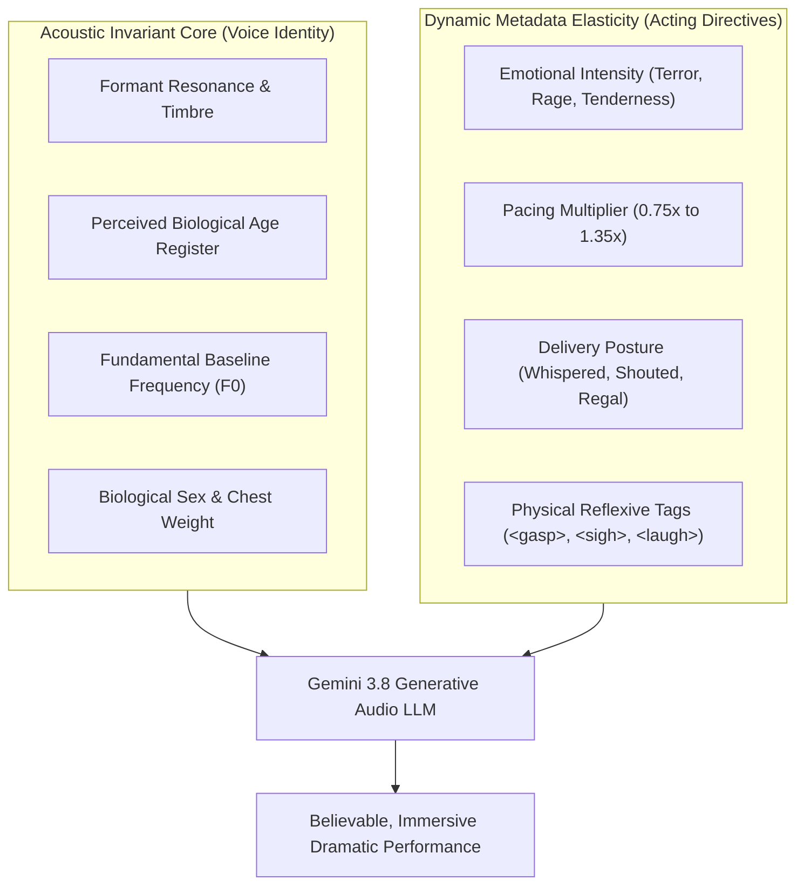

# 🎭 Voice Casting Director Manual & Character Matrix (Stage 4 / Pillar 3)

> **Architectural Status**: Verified Casting Matrix for Google Gemini 3.8 Flash TTS (`models/gemini-3.8-flash-tts` & `/v1beta/voices`).  
> **Target Audience**: Audio Drama Casting Directors, Dramaturges, NLP Scriptwriters, Multi-Cast System Engineers.  
> **Core Deliverables**: Acoustic Invariance Laws, Top 12 Production Voice Dossiers, 30-Voice Studio Roster, 120 Regional Indian Personas (`en-IN`), Novel Archetype Matrix, and Scene Directing Recipes.

---

## 🏛️ The Casting Director's Mandate: Invariance vs. Elasticity

In full-cast audio dramas and cinematic audiobooks, casting synthetic voices is fundamentally an acoustic science. While Gemini 3.8 Flash TTS provides rich dynamic control via `speechMetadata.style` (whispers, shouts, panic, emotional breakdowns, pacing), a synthetic voice's **fundamental acoustic core is physically invariant**.



> [!IMPORTANT]
> **The Law of Voice Invariance**:
> - **Invariant Acoustics (Cannot be altered via metadata)**: A voice's biological formant structure, baseline pitch floor, and vocal tract volume cannot be morphed without acoustic distortion. For example, `Algenib` will always possess a mature, low-pitch gravelly baritone; `Puck` will always sound like an agile, upbeat youthful tenor; `Kore` will always have a firm, commanding mid-pitch resonance. Attempting to prompt `Algenib` to sound like a delicate 8-year-old child produces grotesque, uncanny-valley artifacts.
> - **Elastic Directives (Dynamically driven per turn via `speechMetadata.style`)**: Scene-level emotional states (grief, triumph, panic), delivery posture (close-mic whisper, commanding bark, caustic irony), rhythmic pacing, and biological reflexes (`<laugh>`, `<gasp>`, `<sob>`).

---

## 🔍 Gemini Voice Discovery Endpoint (`/v1beta/voices`)

The Gemini API exposes an official voice discovery catalog at:
```http
GET https://generativelanguage.googleapis.com/v1beta/voices?pageSize=1000&key={{GEMINI_API_KEY}}
```

### Discovery Response Schema:
```json
{
  "voices": [
    {
      "id": "algenib",
      "display_name": "Algenib",
      "language_code": "en-US",
      "accent": "General American",
      "persona": "Storyteller & Narrator",
      "gender": "male",
      "pitch": "low",
      "description": "Gravelly, grounded, and hard-hitting voice with a low pitch. Recommended for dramatic narration or intense stories."
    },
    {
      "id": "puck",
      "display_name": "Puck",
      "language_code": "en-US",
      "accent": "General American",
      "persona": "Charismatic Companion",
      "gender": "male",
      "pitch": "medium",
      "description": "Upbeat, energetic tenor with agile articulation. Ideal for witty rogues, youth protagonists, and theatrical bards."
    }
  ]
}
```

---

## 🏆 Top 12 Production Voices: In-Depth Dossiers

The following 12 voices represent the premier production roster for multi-cast dramatic productions:

---

### 1. `Algenib` (The Hardened Veteran)
- **Biological Sex**: Male | **Pitch Category**: Low (Baritone / Bass)
- **Perceived Age**: Mature Adult (40–58 years)
- **Accent & Tone**: General American / Gritty Cinematic
- **Invariant Timbre**: Gravelly, raspy chest resonance, heavy vocal weight, deeply grounded, world-weary.
- **Dynamic Elasticity**:
  - *Supported Styles*: `"whispered urgently"`, `"cold suppressed menace"`, `"weary melancholic drawl"`, `"gravelly battle roar"`, `"laconic sarcasm"`.
  - *Pacing Range*: 0.75x to 1.15x.
  - *Forbidden Styles*: High-pitched bubbly youth, sweet melodic romance, cartoon panic.
- **Best Inline Tags**: `<sigh>`, `<throat-clearing>`, `<short pause>`, `<pant>`.
- **Ideal Archetypes**: Witcher / Geralt, Hardboiled Noir Detective, Veteran Mercenary, Grimdark Narrator, Mob Boss.

---

### 2. `Puck` (The Theatrical Rogue)
- **Biological Sex**: Male | **Pitch Category**: Mid (Tenor)
- **Perceived Age**: Young Adult (20–32 years)
- **Accent & Tone**: General American / Theatrical & Expressive
- **Invariant Timbre**: Agile, upbeat tenor, bright formant resonance, crisp consonants, highly rhythmic.
- **Dynamic Elasticity**:
  - *Supported Styles*: `"terrified stammering"`, `"witty boastful banter"`, `"panicked frantic pleading"`, `"theatrical romantic charm"`, `"fast tavern gossip"`.
  - *Pacing Range*: 0.85x to 1.35x.
  - *Forbidden Styles*: Sub-bass guttural growl, stoic ancient elder, flat lifeless monotone.
- **Best Inline Tags**: `<laugh>`, `<laughter>`, `<gasp>`, `<snicker>`, `<short pause>`.
- **Ideal Archetypes**: Bard / Dandelion / Jaskier, Charming Thief, Witty Sidekick, Young Hero, Comic Relief.

---

### 3. `Kore` (The Stoic Commander)
- **Biological Sex**: Female | **Pitch Category**: Mid-Low (Mezzo / Contralto)
- **Perceived Age**: Prime Adult (28–42 years)
- **Accent & Tone**: General American / Crisp Continental
- **Invariant Timbre**: Firm, resolute, rich chest resonance, commanding composure, razor-sharp diction.
- **Dynamic Elasticity**:
  - *Supported Styles*: `"steely commanding authority"`, `"fierce defiance"`, `"restrained grief"`, `"urgent tactical warning"`, `"cold aristocratic dismissal"`.
  - *Pacing Range*: 0.80x to 1.20x.
  - *Forbidden Styles*: Squeaky fragile child, giggling flirt, exaggerated melodrama.
- **Best Inline Tags**: `<pant>`, `<gasp>`, `<breath>`, `<short pause>`.
- **Ideal Archetypes**: Warrior Heroine / Adult Ciri, Sorceress / Yennefer, Rebel Commander, Matriarch Leader.

---

### 4. `Fenrir` (The Wild Berserker)
- **Biological Sex**: Male | **Pitch Category**: Mid-Low
- **Perceived Age**: Prime Adult (25–40 years)
- **Accent & Tone**: Aggressive / Raw / Explosive
- **Invariant Timbre**: Fierce, husky, explosive attack transients, raw vocal cord friction, aggressive drive.
- **Dynamic Elasticity**:
  - *Supported Styles*: `"explosive combat rage"`, `"guttural battle shout"`, `"rough taunting laughter"`, `"breathing heavily in exhaustion"`.
  - *Pacing Range*: 0.85x to 1.30x.
  - *Forbidden Styles*: Whispered delicate scholar, courtly etiquette, soothing nursery tale.
- **Best Inline Tags**: `<pant>`, `<cough>`, `<snort>`, `<pff>`, `<laugh>`.
- **Ideal Archetypes**: Berserker Warrior, Ruthless Pirate, Street Thug, Aggressive Antagonist.

---

### 5. `Aoede` (The Lyrical Storyteller)
- **Biological Sex**: Female | **Pitch Category**: Mid
- **Perceived Age**: Prime Adult (25–38 years)
- **Accent & Tone**: Melodic / Continental / Narrative Flow
- **Invariant Timbre**: Breezy, lyrical cadence, crystal-clear vowel projection, silky, highly engaging.
- **Dynamic Elasticity**:
  - *Supported Styles*: `"warm captivating narration"`, `"gentle nostalgic reflection"`, `"mysterious wonder"`, `"philosophical exposition"`.
  - *Pacing Range*: 0.80x to 1.25x.
  - *Forbidden Styles*: Guttural demonic roar, frantic screeching.
- **Best Inline Tags**: `<breath>`, `<sigh>`, `<short pause>`.
- **Ideal Archetypes**: Default Third-Person Narrator, Wise Sorceress, Worldly Chronicler, High Priestess.

---

### 6. `Charon` (The Resonant Scholar)
- **Biological Sex**: Male | **Pitch Category**: Low-Mid (Deep Baritone)
- **Perceived Age**: Mature / Elder (48–68 years)
- **Accent & Tone**: Measured / Oxford / Formal Resonance
- **Invariant Timbre**: Resonant, calm, academic weight, measured cadence, authoritative composure.
- **Dynamic Elasticity**:
  - *Supported Styles*: `"slow philosophical observation"`, `"foreboding warning"`, `"somber historical delivery"`, `"calm courtroom authority"`.
  - *Pacing Range*: 0.75x to 1.10x.
  - *Forbidden Styles*: Fast teenage slang, frantic screaming comedy.
- **Best Inline Tags**: `<throat-clearing>`, `<sigh>`, `<short pause>`.
- **Ideal Archetypes**: Ancient Elder, Court Wizard / Mentor, High Judge, Arcane Scholar, Dark Narrative Host.

---

### 7. `Alnilam` (The Sovereign General)
- **Biological Sex**: Male | **Pitch Category**: Low-Mid
- **Perceived Age**: Mature Adult (35–52 years)
- **Accent & Tone**: Regal / Command Presence
- **Invariant Timbre**: Resolute, unyielding, deep chest resonance with crisp regal articulation.
- **Dynamic Elasticity**:
  - *Supported Styles*: `"commanding battlefield general"`, `"regal imperial decree"`, `"cold calculating interrogation"`.
  - *Pacing Range*: 0.80x to 1.15x.
  - *Forbidden Styles*: Timid stammering, subservient whining.
- **Best Inline Tags**: `<short pause>`, `<throat-clearing>`.
- **Ideal Archetypes**: Emperor, Field Marshal, High Inquisitor, Sovereign King.

---

### 8. `Zephyr` (The Spirited Protagonist)
- **Biological Sex**: Female | **Pitch Category**: Mid-High
- **Perceived Age**: Youth / Young Adult (18–26 years)
- **Accent & Tone**: Bright / Energetic / Curious
- **Invariant Timbre**: Clear, forward formant placement, vibrant, breathy agility.
- **Dynamic Elasticity**:
  - *Supported Styles*: `"curious and determined"`, `"breathless excitement"`, `"sharp witty retort"`, `"frightened but brave"`.
  - *Pacing Range*: 0.90x to 1.35x.
  - *Forbidden Styles*: Gravelly old grandmother, heavy soldier bass.
- **Best Inline Tags**: `<gasp>`, `<laugh>`, `<pant>`, `<breath>`.
- **Ideal Archetypes**: Young Heroine, Sorcery Apprentice, Clever Investigator, Spirited Princess.

---

### 9. `Achernar` (The Tragic Muse)
- **Biological Sex**: Female | **Pitch Category**: High-Mid (Soft Soprano)
- **Perceived Age**: Young Adult / Mature (22–35 years)
- **Accent & Tone**: Gentle / Intimate / Melancholic
- **Invariant Timbre**: Soft, air-rich, delicate harmonic overtone, profound emotional vulnerability.
- **Dynamic Elasticity**:
  - *Supported Styles*: `"tearful whispered confession"`, `"fragile melancholy"`, `"tender maternal comfort"`, `"pleading with trembling voice"`.
  - *Pacing Range*: 0.75x to 1.10x.
  - *Forbidden Styles*: Barking military orders, aggressive vulgar taunts.
- **Best Inline Tags**: `<sob>`, `<sigh>`, `<breath>`, `<short pause>`.
- **Ideal Archetypes**: Tragic Heroine, Loving Mother, Gentle Healer, Dying Romantic Lead.

---

### 10. `Achird` (The Scheming Courtier)
- **Biological Sex**: Male | **Pitch Category**: Mid
- **Perceived Age**: Mature (35–50 years)
- **Accent & Tone**: Smooth / Sibilant / Aristocratic
- **Invariant Timbre**: Velvety, slight nasal resonance, precise sibilants, razor-sharp condescension.
- **Dynamic Elasticity**:
  - *Supported Styles*: `"silky patronizing condescension"`, `"whispered palace intrigue"`, `"mocking false courtesy"`.
  - *Pacing Range*: 0.85x to 1.20x.
  - *Forbidden Styles*: Honest farmhand bluster, explosive barbarian rage.
- **Best Inline Tags**: `<snicker>`, `<pff>`, `<short pause>`.
- **Ideal Archetypes**: Court Chancellor, Corrupt Diplomat, Treacherous Advisor, Poisoner.

---

### 11. `Leda` (The Rebel Explorer)
- **Biological Sex**: Female | **Pitch Category**: Mid-High
- **Perceived Age**: Young Adult (20–30 years)
- **Accent & Tone**: Confident / Playful / Defiant
- **Invariant Timbre**: Crisp, athletic cadence, warm midrange, agile tone shifts.
- **Dynamic Elasticity**:
  - *Supported Styles*: `"defiant sarcastic smirk"`, `"urgent scout report"`, `"playful competitive banter"`.
  - *Pacing Range*: 0.90x to 1.30x.
  - *Forbidden Styles*: Feeble dying elder, submissive courtier.
- **Best Inline Tags**: `<laugh>`, `<pff>`, `<gasp>`, `<short pause>`.
- **Ideal Archetypes**: Tomb Raider, Rebel Scout, Gunslinger Heroine, Outlaw Pilot.

---

### 12. `Orus` (The Brooding Enforcer)
- **Biological Sex**: Male | **Pitch Category**: Low
- **Perceived Age**: Prime Adult (30–45 years)
- **Accent & Tone**: Deep / Monosyllabic / Intimidating
- **Invariant Timbre**: Heavy sub-bass weight, slow envelope attack, laconic and blunt.
- **Dynamic Elasticity**:
  - *Supported Styles*: `"threatening low growl"`, `"blunt monosyllabic reply"`, `"calm professional killer"`.
  - *Pacing Range*: 0.70x to 1.05x.
  - *Forbidden Styles*: High frantic screaming, cheerful bard songs.
- **Best Inline Tags**: `<throat-clearing>`, `<sigh>`, `<short pause>`.
- **Ideal Archetypes**: Bounty Hunter, Silent Bodyguard, Executioner, Criminal Enforcer.

---

## 📋 Comprehensive 30-Voice Studio Roster

| Voice ID | Gender | Pitch Range | Dominant Character Archetype | Best Dramatic Setting |
|---|:---:|:---:|---|---|
| **Algenib** | Male | Low | Gravelly Veteran, Hardboiled Detective | Grimdark, Noir, Mystery |
| **Puck** | Male | Mid | Theatrical Bard, Charming Rogue, Sidekick | Fantasy, Adventure, Comedy |
| **Kore** | Female | Mid-Low | Warrior Commander, Stoic Sorceress | Dark Fantasy, War, Drama |
| **Fenrir** | Male | Mid-Low | Aggressive Berserker, Rebel Warrior | Combat, Action Thriller |
| **Aoede** | Female | Mid | Melodic Narrator, Worldly Chronicler | Universal Narration, Epic Prose |
| **Charon** | Male | Low-Mid | Resonant Scholar, Ancient Elder, Judge | Historical, Grim Mystery |
| **Alnilam** | Male | Low-Mid | Authoritative King, Imperial General | Military, Political Intrigue |
| **Zephyr** | Female | Mid-High | Curious Apprentice, Spirited Youth | Fantasy, Sci-Fi, YA Drama |
| **Achernar** | Female | High-Mid | Tragic Heroine, Soothing Mother | Melodrama, Tragedy, Romance |
| **Achird** | Male | Mid | Silky Diplomat, Scheming Courtier | Historical Intrigue, Espionage |
| **Leda** | Female | Mid-High | Agile Scout, Defiant Outlaw | Action, Cyberpunk, Heist |
| **Orus** | Male | Low | Heavy Enforcer, Silent Bodyguard | Crime, Thriller, Western |
| **Mira** | Female | Mid | Warm Confidante, Village Elder | Folk Tale, Cozy Mystery |
| **Sirius** | Male | Mid-High | Eager Cadet, Young Officer | Sci-Fi, High Fantasy, War |
| **Vega** | Female | Mid | Rational Scientist, Ship AI | Hard Sci-Fi, Cyberpunk |
| **Rigel** | Male | Low-Mid | Steadfast Paladin, Noble Knight | Classical Fantasy, Arthurian |
| **Capella** | Female | Mid-High | Sarcastic Reporter, Modern Sleuth | Contemporary Noir, Detective |
| **Deneb** | Male | Mid | Cynical Merchant, Tavern Keeper | Low Fantasy, Urban Fiction |
| **Castor** | Male | Mid-Low | Twin Brother, Reliable Companion | Drama, Adventure Rallies |
| **Pollux** | Male | Mid | Quick-Witted Infiltrator | Espionage, Tactical Clashes |
| **Canopus** | Male | Low | Cosmic Entity, Voice of Fate | Cosmic Horror, Prologues |
| **Antares** | Male | Mid-Low | Fanatical Cultist, Zealot Commander | Horror, Dark Fantasy |
| **Spica** | Female | High | Innocent Child, Fragile Maiden | Fairy Tales, Tragic Epilogues |
| **Polaris** | Female | Mid-Low | High Empress, Celestial Guardian | High Fantasy, Regal Dramas |
| **Altair** | Male | Mid | Agile Assassin, Stealthy Ranger | Sword & Sorcery, Thrillers |
| **Aldebaran** | Male | Low | Thunderous Giant, Blacksmith | Epic Fantasy, Nordic Lore |
| **Betelgeuse**| Male | Low-Mid | Mad Prophet, Unhinged Alchemist | Weird Fiction, Gothic Horror |
| **Bellatrix** | Female | Mid | Ruthless Inquisitress, Dark Sorceress | Villain Dialogue, Gothic |
| **Fomalhaut** | Male | Low | Deep Ocean Mariner, Old Captain | Nautical Fiction, Ghost Tales |
| **Regulus** | Male | Mid | Proud Prince, Flawed Heir | Courtly Romance, Tragedy |

---

## 🇮🇳 Regional Indian Voice Roster (`en-IN`)

For Indian literature, South Asian historical fiction, and nuanced bilingual Hinglish dialogues, Gemini indexes **120 dedicated Indian persona voices**:

```text
en-in-advisor-1  through  en-in-advisor-12   (Financial, Legal, Authoritative)
en-in-agent-1    through  en-in-agent-12     (Direct, Operational, Modern Urban)
en-in-story-1    through  en-in-story-12     (Rich Cultural Storytellers)
```

### Strategic Use Cases in Audiobook Maker:
1. **Rustic Thakurs, Police Inspectors & Village Elders**: While core voices like `Algenib` pronounce Devanagari accurately, Indian personas provide the authentic subcontinental cadence, retroflex dental stress, and vernacular tempo.
2. **Bilingual Hinglish Dialogue**: Seamless code-switching between Hindi idioms and English technical terms without acoustic jarring.
3. **Bilingual Rallies**: Pairing an `en-IN` narrator with flagship character voices maintains clear contrast between third-person exposition and dramatized character acting.

---

## 🧬 Universal Character-to-Voice Matrix

This matrix maps the sociolect archetypes in [`audiobook_factory/translation/character_profile.py`](file:///c:/Users/Suraj/Documents/Antigravity/Audiobook/audiobook_factory/translation/character_profile.py) to Gemini voices:

| Universal Archetype (`character_profile.py`) | Primary Gemini Voice | Alternate / Gender Swap | Invariant Acoustic Match | Recommended `speechMetadata.style` |
|---|---|---|---|---|
| **`COLD_CYNIC`** | **Algenib** | Kore (Female) | Gravelly, raspy, heavy weight | `"gravelly dry baritone, laconic sarcasm, heavy pauses, suppressed emotion"` |
| **`THEATRICAL_WIT`** | **Puck** | Zephyr (Female) | Upbeat tenor, agile articulation | `"theatrical upbeat cadence, lively tavern banter, cheeky boastfulness, fast pace"` |
| **`AUTHORITATIVE_MATRIARCH`** | **Kore** | Alnilam (Male) | Resolute, rich chest resonance | `"firm commanding authority, steely composure, protective sharpness"` |
| **`RAZOR_ARISTOCRAT`** | **Achird** | Kore (Female) | Silky, crisp sibilants, cold | `"silky patronizing condescension, cold regal elegance, razor-sharp precision"` |
| **`MILITARY_COMMANDER`** | **Fenrir** | Alnilam (Male) | Barked attack, aggressive | `"barked staccato tactical cadence, direct blunt soldier tone, zero hesitation"` |
| **`SCHOLAR_INTELLECTUAL`** | **Charon** | Vega (Female) | Measured, deep resonant | `"measured bookish cadence, calm analytical delivery, slow deliberate pauses"` |
| **`RUSTIC_STREET_SURVIVOR`** | **Fenrir** | en-in-advisor-3 | Raw, earthy friction | `"raw earthy rasp, aggressive survivalist slang, cynical sneer"` |
| **`YOUTHFUL_HEROINE`** | **Zephyr** | Leda (Female) | Vibrant, forward formant | `"bright youthful curiosity, breathless determination, sharp defiance"` |
| **`TRAGIC_STORYTELLER`** | **Achernar** | Charon (Male) | Soft, air-rich, vulnerable | `"fragile melancholy, soft breathy delivery, suppressed tears, intimate proximity"` |

---

## 🎬 Screenplay Directing Cookbook (Scene Recipes)

Pre-built directing recipes for `ScreenplaySegment.acting` and `speechMetadata.style`:

### 1. High-Stakes Combat & Duel
- **Cast**: `Fenrir` (Attacker) vs. `Algenib` (Defender)
- **Text & Tag Pattern**:
  ```text
  "Die, you butcher! <pant> You won't leave this bog alive!"
  "<throat-clearing> You talk too much. <short pause> Draw your steel."
  ```
- **Directing Metadata**:
  ```json
  [
    {
      "speaker": "Attacker",
      "style": "explosive breathless combat shout, heavy panting, furious adrenaline"
    },
    {
      "speaker": "Defender",
      "style": "gravelly calm monotone, cold combat focus, low breathy growl"
    }
  ]
  ```

---

### 2. Intimate Bedroom ASMR ("The Erotic Silence")
- **Cast**: `Achernar` & `Algenib`
- **Text & Tag Pattern**:
  ```text
  "Stay... <breath> just until dawn. <short pause> Don't look at me like that."
  "<sigh> I told you once before... <short pause> witchers don't stay."
  ```
- **Directing Metadata**:
  ```json
  [
    {
      "speaker": "Woman",
      "style": "soft breathy whisper, extremely close-mic ASMR proximity, trembling vulnerability, slow tempo"
    },
    {
      "speaker": "Witcher",
      "style": "deep hushed baritone, intimate close proximity, gentle world-weary sigh"
    }
  ]
  ```

---

### 3. Cosmic Horror & Unfolding Madness
- **Cast**: `Charon` (Scholar) & `Betelgeuse` (Mad Hermit)
- **Text & Tag Pattern**:
  ```text
  "The seals are intact... <short pause> yet what is that scratching beneath the crypt?"
  "<laugh> Seals?! <gasp> They don't keep them out... <sob> they keep us in!"
  ```
- **Directing Metadata**:
  ```json
  [
    {
      "speaker": "Scholar",
      "style": "hushed academic dread, tense controlled whisper, trembling jaw"
    },
    {
      "speaker": "Hermit",
      "style": "unhinged frantic babble, erratic pitch leaps, terrifying hysterical laughter"
    }
  ]
  ```

---

### 4. Courtly Sarcasm & High Intrigue
- **Cast**: `Achird` (Chancellor) & `Kore` (Duchess)
- **Text & Tag Pattern**:
  ```text
  "Your Grace's generosity to the border lords is... <snicker> remarkably touching."
  "<pff> Keep your flattery for the banquet hall, Chancellor. <short pause> The army marches tomorrow."
  ```
- **Directing Metadata**:
  ```json
  [
    {
      "speaker": "Chancellor",
      "style": "silky razor-sharp condescension, polite sneer, mocking deference"
    },
    {
      "speaker": "Duchess",
      "style": "steely regal dismissal, cold commanding gaze, crisp staccato consonants"
    }
  ]
  ```

---

### 5. Final Breath / Deathbed Monologue
- **Cast**: `Algenib` or `Achernar`
- **Text & Tag Pattern**:
  ```text
  "Tell her... <gasp> I kept the promise. <pant> The silver sword... is hers."
  ```
- **Directing Metadata**:
  ```json
  {
    "speaker": "DyingWarrior",
    "style": "shallow ragged breathing, breaking voice, fading chest resonance, slow dying cadence"
  }
  ```

---

## 🛡️ Voice Drift Elimination & Project Configuration (ADR-021)

To prevent voice drift—where a male warlord accidentally speaks in the default female narrator's voice—[`TTSDispatcher`](file:///c:/Users/Suraj/Documents/Antigravity/Audiobook/audiobook_factory/tts_dispatcher.py) enforces two persistent JSON configurations per project:

```
my_audiobook_project/
├── voice_registry.json     # Concrete voice mappings and EQ calibration
└── character_roster.json   # Canonical names, aliases, and gender markers
```

### 1. `voice_registry.json` Schema
```json
{
  "Narrator": {
    "backend": "gemini_tts",
    "voice": "Aoede",
    "speed": 1.0,
    "presence_boost_db": 1.5
  },
  "Geralt": {
    "backend": "gemini_tts",
    "voice": "Algenib",
    "speed": 0.95,
    "bass_boost_db": 2.5
  },
  "Jaskier": {
    "backend": "gemini_tts",
    "voice": "Puck",
    "speed": 1.05
  },
  "Ciri": {
    "backend": "gemini_tts",
    "voice": "Kore",
    "speed": 1.0
  }
}
```

### 2. `character_roster.json` Schema
```json
{
  "characters": {
    "Geralt": {
      "gender": "male",
      "aliases": ["Witcher", "White Wolf", "गेराल्ट", "विचर", "Geralt of Rivia"]
    },
    "Jaskier": {
      "gender": "male",
      "aliases": ["Dandelion", "जaskier", "डैंडेलियन", "Bard"]
    },
    "Ciri": {
      "gender": "female",
      "aliases": ["Cirilla", "Swallow", "सिरी", "Princess"]
    }
  }
}
```

### 3. Fail-Closed Zero-Voice-Drift Guarantee
1. **Multi-Script Alias Normalization**: When a script segment arrives with `"speaker": "विचर"` or `"speaker": "White_Wolf"`, `TTSDispatcher` automatically normalizes it to `"Geralt"`, extracting the canonical `Algenib` voice.
2. **Zero-Tolerance Pre-Flight Sweep**: Before a single API request is dispatched, `TTSDispatcher.synthesize_chapter_script()` sweeps all segments. If an unmapped character name is discovered, execution immediately halts with `UnregisteredSpeakerError`, shielding Gemini quotas from broken partial chapters.
