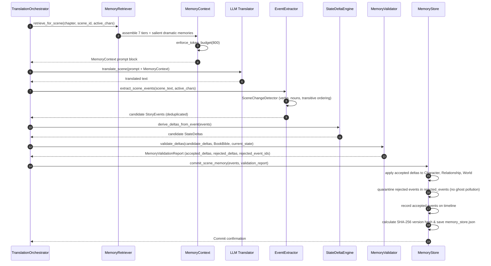
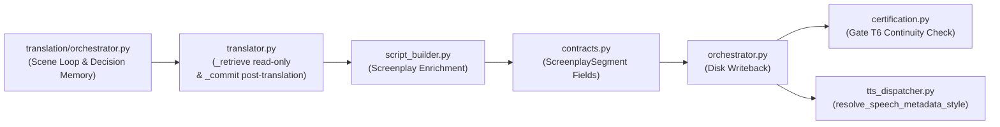

# 🧠 World + Character Memory 2.0

> **Deterministic, Event-Driven Narrative Continuity, Epistemic Knowledge Isolation, Dual-Chronology Validation, and Dramatic Performance Guidance for Long-Form Audio Drama Production.**

[](file:///c:/Users/Suraj/Documents/Antigravity/Audiobook/audiobook_factory/translation/memory/)
[](file:///c:/Users/Suraj/Documents/Antigravity/Audiobook/docs/ARCHITECTURE.md)
[-brightgreen.svg)](file:///c:/Users/Suraj/Documents/Antigravity/Audiobook/tests/translation/memory/)
[](#7-token-budget-enforcement--tiered-memory-retrieval)

---

## 📑 Table of Contents

1. [Executive Overview & Core Invariants](#1-executive-overview--core-invariants)
2. [The 4 Architectural Refinements](#2-the-4-architectural-refinements)
3. [The 6-Stage Scene Memory Lifecycle](#3-the-6-stage-scene-memory-lifecycle)
4. [Module-by-Module Technical Reference](#4-module-by-module-technical-reference)
   - [4.1 `state.py`: Pure Deterministic State Transition Engine](#41-statepy-pure-deterministic-state-transition-engine)
   - [4.2 `events.py`: Story Events, Detection & Extraction](#42-eventspy-story-events-detection--extraction)
   - [4.3 `character_memory.py`: Character State, Epistemic Engine & Arc Memory](#43-character_memorypy-character-state-epistemic-engine--arc-memory)
   - [4.4 `world_memory.py`: Dynamic World State & Dual Chronology](#44-world_memorypy-dynamic-world-state--dual-chronology)
   - [4.5 `memory_delta.py`: Explicit & Auditable State Deltas](#45-memory_deltapy-explicit--auditable-state-deltas)
   - [4.6 `memory_validator.py`: The 7 Contradiction Classes](#46-memory_validatorpy-the-7-contradiction-classes)
   - [4.7 `memory_store.py`: Versioned Store & Ghost Event Isolation](#47-memory_storepy-versioned-store--ghost-event-isolation)
   - [4.8 `memory_retriever.py` & `memory_context.py`: 7-Tier Retrieval & Token Budget](#48-memory_retrieverpy--memory_contextpy-7-tier-retrieval--token-budget)
5. [Downstream Consumer Wiring & Pipeline Integration](#5-downstream-consumer-wiring--pipeline-integration)
   - [5.1 Translation Pipeline Orchestrator](#51-translation-pipeline-orchestrator)
   - [5.2 Standalone Translator Integration](#52-standalone-translator-integration)
   - [5.3 Screenplay Builder & Acting Guidance Injection](#53-screenplay-builder--acting-guidance-injection)
   - [5.4 ScreenplaySegment Contracts & TTS Dispatcher](#54-screenplaysegment-contracts--tts-dispatcher)
   - [5.5 Translation Certification (Gate `T6_relationship_memory`)](#55-translation-certification-gate-t6_relationship_memory)
   - [5.6 Top-Level Orchestrator Disk Persistence](#56-top-level-orchestrator-disk-persistence)
6. [Verification, Audit Remediation & Stress Testing Suite](#6-verification-audit-remediation--stress-testing-suite)

---

## 1. Executive Overview & Core Invariants

Generating a multi-hour audio drama from a 100+ chapter novel requires an unbreakable sense of temporal, physical, relationship, and epistemic continuity. Traditional LLM translation and screenplay generation engines suffer from **context window amnesia**:
- A character injured in Chapter 2 suddenly sprints in Chapter 3 with no mention of recovery.
- A character murdered in Chapter 10 speaks in present tense in Chapter 12 because an LLM confused a flashback for present events.
- Character B reveals a dark secret that Character A holds, even though Character B was never present when the secret was revealed (omniscient knowledge leakage).
- Two mortal enemies suddenly address each other with warm familiar pronouns (`तुम` or `तू`) rather than distant formal honorifics (`आप`).
- Background world conditions (such as a castle damaged in an assault) reset back to pristine "normal" condition simply because a subsequent movement event did not mention the damage.

**World + Character Memory 2.0** (`audiobook_factory/translation/memory/`) solves these failure modes by decoupling **Hard Canon** (immutable character names, baseline voice signatures, permanent lore rules in `BookBible`) from **Dynamic Narrative State** (evolving injuries, physical locations, relationship vectors, epistemic constraints, and narrative threads).

### The Invariants of Memory 2.0
1. **Deterministic State Invariant**: State transitions are 100% deterministic functions of validated `StateDelta` objects applied to current state. The LLM only *proposes* candidate events; pure Python code calculates deltas and validates invariants.
2. **Zero Ghost Event Pollution Invariant**: Rejected contradictory events are permanently quarantined in `store.rejected_events` and recorded in `MemoryValidationReport.flagged_conflicts`. They never pollute active event ledgers (`store.events`), timeline points (`world_state.timeline`), character recent event logs, or high-salience dramatic memory queries.
3. **Hard Canon Immutability Invariant**: No dynamic event or delta can mutate locked BookBible attributes (`canonical_name`, `gender`, `canonical_role`, `voice_id`, `locked_pronoun`, `locked_register`) without raising a `canon_contradiction` conflict.
4. **Epistemic Isolation Invariant**: What the listener/reader knows is strictly partitioned from what individual characters know. A character cannot act upon or reference unlearned secrets without triggering a `knowledge_violation`.
5. **Acoustic Performance Respect Invariant**: Performance guidance injected by Memory 2.0 conservatively supplies physical context (`memory_vocal_constraint`, `recommended_pronoun`, `recommended_register`) but **never blindly overrides explicit screenplay acting directives** (`acting.delivery_style` or bracketed tags).

---

## 2. The 4 Architectural Refinements

During the Pass 1 and Pass 2 Forensic Audits, four fundamental refinements were established and validated across the test suite:

### Refinement 1: Deterministic `SceneChangeDetector` Pre-Filter Before Gated LLM Extraction
Invoking LLMs on every single scene burns expensive API quota and introduces stochastic variance. `SceneChangeDetector` runs first in 0ms using compiled regex patterns for:
- **Intra-scene movement** (`entered`, `arrived at`, `walked into`, `departed from`, `left the`).
- **Noun & verb injuries** (matching nouns like `"injury"` as well as verbs like `"stabbed"`, `"bleeding"`, `"fractured"`).
- **Transitive attacker vs. victim disambiguation**: In clauses like `"Arjun stabbed Vikram in the Courtyard"`, Vikram is deterministically recognized as the injured victim and Arjun as the instigator. When multiple characters appear in the clause, the detector marks `is_ambiguous = True`, safely triggering selective semantic LLM extraction for precision refinement.
- **Pure dialogue/dialogue-free scenes**: If no triggers match, extraction completes with **0 LLM calls**.

### Refinement 2: Conservative Performance Guidance Respecting Nested `acting.delivery_style`
Early iterations risked overwriting nuanced director or screenplay acting intent. Refinement 2 establishes that `MemoryContext.apply_performance_guidance_to_segment()`:
- Inspects both top-level `seg["delivery_style"]` and nested `seg["acting"]["delivery_style"]`.
- If an explicit delivery style exists (e.g., `"whispering"`, `"bellowing"`, `"sarcastic"`), it is **strictly preserved**.
- If the delivery style is neutral (`""`, `"normal"`, `"neutral"`, `"standard"`), Memory 2.0 injects physical constraints (e.g. `memory_vocal_constraint = "strained_breath"` for injured characters, or `"fatigued_low_energy"` for exhausted characters).

### Refinement 3: Bounded Relationship Priors (`आप` / `तुम` / `तू`)
Relationship shifts between characters are bounded:
- A standard interaction cannot jump more than $\pm 2$ points on any 7D interpersonal dimension (`respect`, `familiarity`, `tension`, `trust`, etc.) in a single scene.
- A high-importance turning point (`importance >= 4`, such as a major betrayal or romantic confession) cannot jump more than $\pm 3$ points.
- Relationship changes require explicit `StoryEvent` provenance; unmotivated "silent" jumps trigger `relationship_jump` rejections.

### Refinement 4: Dual-Chronology `TemporalMode` Timeline Validation
Flashbacks, dream sequences, and ancient legends frequently mention dead characters or past physical locations. Treating these as present-day events would corrupt state. Memory 2.0 introduces `TemporalMode`:
- `PRESENT`: Active story timeline; strictly enforces physical presence, monotonic chapter progression, and non-resurrection of deceased characters.
- `FLASHBACK`, `MEMORY_DREAM`, `HISTORICAL_NARRATION`, `NON_LINEAR`: Enriches character arcs, belief systems, and turning points without overwriting present physical survival, active injuries, or current spatial locations.

---

## 3. The 6-Stage Scene Memory Lifecycle

The end-to-end memory pipeline executes a strict 6-stage lifecycle for every scene:

```mermaid
flowchart TD
    subgraph S1["1. READ (Pre-Translation)"]
        StoreLoad["Load MemoryStore & Seed BookBible"]
        Retriever["MemoryRetriever.retrieve_for_scene()<br/>(7-Tier + Narrative Salience)"]
        Budget["MemoryContext.enforce_token_budget(800)"]
        StoreLoad --> Retriever --> Budget
    end

    subgraph S2["2. ACT (Translation & Screenplay)"]
        PromptInj["Inject MemoryContext Prompt Block<br/>(Epistemic MUST_NOT_KNOW + Performance Context)"]
        Translate["LLM Literary Translation / Screenplay Generation"]
        CertAudit["Gate T6 Relationship & Pronoun Audit"]
        Budget --> PromptInj --> Translate --> CertAudit
    end

    subgraph S3["3. EXTRACT (Change Detection)"]
        ChangeDet["SceneChangeDetector.assess_scene()<br/>(Noun/Verb Triggers, Attacker/Victim Ordering)"]
        GatedLLM{"Requires LLM?<br/>(is_ambiguous or force_llm)"}
        Deterministic["Deterministic Event Extractor (0 tokens)"]
        LLMPropose["propose_events_llm()<br/>(Semantic Candidate Proposal)"]
        Dedupe["LLM vs Deterministic Deduplication"]
        CertAudit --> ChangeDet --> GatedLLM
        GatedLLM -- No --> Deterministic --> Dedupe
        GatedLLM -- Yes --> LLMPropose --> Dedupe
    end

    subgraph S4["4. CALCULATE DELTAS (Projection)"]
        DeltaEngine["StateDeltaEngine.derive_deltas_from_event()"]
        ProjectDeltas["Project to 5 Domains:<br/>CHARACTER, RELATIONSHIP, KNOWLEDGE, WORLD, NARRATIVE"]
        PreserveCond["Preserve Damaged/Destroyed Location Conditions"]
        Dedupe --> DeltaEngine --> ProjectDeltas --> PreserveCond
    end

    subgraph S5["5. VALIDATE (Contradiction Guardrails)"]
        Validator["MemoryValidator.validate_deltas()"]
        Guardrails{"Check 7 Contradiction Classes:<br/>CANON, TIMELINE, DEAD_CHAR, PHYSICAL,<br/>RELATIONSHIP, KNOWLEDGE, WORLD_RULE"}
        PreserveCond --> Validator --> Guardrails
    end

    subgraph S6["6. COMMIT (Persistence & Quarantine)"]
        Partition["Partition Accepted Deltas vs Rejected Conflicts"]
        ApplyState["Apply Deltas Deterministically to States"]
        IsolateGhost["Quarantine Rejected Events to store.rejected_events"]
        TimelineUpdate["Append Accepted Events to world_state.timeline"]
        AtomicSave["Atomic Disk Commit to memory_store.json"]
        Guardrails -- PASS / WARN --> Partition
        Guardrails -- CONFLICT --> Partition
        Partition --> ApplyState --> TimelineUpdate --> AtomicSave
        Partition --> IsolateGhost --> AtomicSave
    end
```



### Complete Sequence Diagram



---

## 4. Module-by-Module Technical Reference

### 4.1 `state.py`: Pure Deterministic State Transition Engine
[`audiobook_factory/translation/memory/state.py`](file:///c:/Users/Suraj/Documents/Antigravity/Audiobook/audiobook_factory/translation/memory/state.py)

Contains the pure deterministic transition functions that mutate memory objects when given validated `StateDelta` objects.

#### Key Functions
- `apply_character_delta(character_states, world_state, delta) -> CharacterState`:
  - Mutates `current_location`, `physical_condition`, `active_injuries`, `energy`, `is_alive`, `current_emotion`, `emotion_intensity`, and `arc_state`.
  - Automatically updates `world_state.location_states` character presence (removing from old location, adding to new location).
  - Enforces `TemporalMode` protection: non-present events (flashbacks, memories) cannot alter present physical condition or location.
- `apply_relationship_delta(relationships, delta) -> DynamicRelationshipState`:
  - Delegates to `RelationshipStateEngine.apply_relationship_mutation` with event provenance tracking.
- `apply_knowledge_delta(facts_registry, character_states, delta) -> KnowledgeFact`:
  - Registers or updates facts using `CharacterKnowledgeEngine`.
- `apply_world_or_narrative_delta(world_state, character_states, delta) -> None`:
  - Handles object custody, location physical conditions, organization dispositions, discovered rules, and open narrative threads (`NarrativeThreadState`).
- `record_events_on_timeline(world_state, events, chapter, scene, location, time_marker) -> None`:
  - Appends or updates `TimelinePoint` records distinguishing PRESENT story chronology from non-linear epochs.

---

### 4.2 `events.py`: Story Events, Detection & Extraction
[`audiobook_factory/translation/memory/events.py`](file:///c:/Users/Suraj/Documents/Antigravity/Audiobook/audiobook_factory/translation/memory/events.py)

#### `StoryEventType` (All 15+ Core Types)
```python
class StoryEventType(str, Enum):
    CHARACTER_INTRODUCED = "CHARACTER_INTRODUCED"
    CHARACTER_MOVED      = "CHARACTER_MOVED"
    CHARACTER_INJURED    = "CHARACTER_INJURED"
    CHARACTER_RECOVERED  = "CHARACTER_RECOVERED"
    CHARACTER_DIED       = "CHARACTER_DIED"
    SECRET_REVEALED      = "SECRET_REVEALED"
    FACT_LEARNED         = "FACT_LEARNED"
    FACT_DISPROVEN       = "FACT_DISPROVEN"
    RELATIONSHIP_CHANGED = "RELATIONSHIP_CHANGED"
    BETRAYAL             = "BETRAYAL"
    RECONCILIATION       = "RECONCILIATION"
    ROMANTIC_CONFESSION  = "ROMANTIC_CONFESSION"
    SHARED_DANGER        = "SHARED_DANGER"
    THREAT_ISSUED        = "THREAT_ISSUED"
    OBJECT_ACQUIRED      = "OBJECT_ACQUIRED"
    OBJECT_TRANSFERRED   = "OBJECT_TRANSFERRED"
    OBJECT_LOST          = "OBJECT_LOST"
    LOCATION_CHANGED     = "LOCATION_CHANGED"
    PROMISE_CREATED      = "PROMISE_CREATED"
    PROMISE_BROKEN       = "PROMISE_BROKEN"
    MYSTERY_INTRODUCED   = "MYSTERY_INTRODUCED"
    MYSTERY_RESOLVED     = "MYSTERY_RESOLVED"
    GOAL_CHANGED         = "GOAL_CHANGED"
    BELIEF_CHANGED       = "BELIEF_CHANGED"
    WORLD_STATE_CHANGED  = "WORLD_STATE_CHANGED"
    OTHER                = "OTHER"
```

#### `TemporalMode`
- `PRESENT`: Active, ongoing story timeline.
- `FLASHBACK`: In-universe past timeline (epoch $< 0$).
- `MEMORY_DREAM`: Mental or dream representations.
- `HISTORICAL_NARRATION`: Historical background or lore.
- `NON_LINEAR`: Out-of-order narrative sequencing.

#### Deterministic Event ID & Salience Computation
In `StoryEvent.ensure_deterministic_id_and_salience()`, each event gets a deterministic SHA-256 identifier:
$$\text{digest} = \text{SHA256}(\text{chapter} : \text{scene} : \text{event\_type} : \text{participants} : \text{description})[:8]$$
$$\text{event\_id} = \text{evt\_c}\{\text{chapter:03d}\}\_\{\text{clean\_scene}\}\_\{\text{digest}\}$$
Salience is computed from event importance, event category floors (`HIGH_SALIENCE_EVENT_TYPES`), and unresolved state (ranging from $0.1$ to $1.0$).

#### `SceneChangeDetector`
Pre-analyzes scene text for state mutations:
1. **Transitive Attacker vs. Victim Disambiguation**: `_resolve_victim_and_instigator(sent, sent_chars, chars, verb_match)` differentiates active clauses (*"Arjun stabbed Vikram"*) from passive clauses (*"Vikram was stabbed by Arjun"*), identifying the victim and instigator while flagging multiple character encounters for LLM refinement.
2. **Noun and Verb Trigger Matching**: Detects injuries, recoveries, deaths, secrets, oaths, and object transfers using precompiled regexes.
3. **Intra-Scene Travel**: Extracts both `from_location` and `to_location` across departure/arrival sentences.

#### `EventExtractor`
1. Runs `SceneChangeDetector.assess_scene()`.
2. If `requires_llm_extraction` is `True` and `call_llm_fn` is provided, dispatches `propose_events_llm()`.
3. Performs **LLM-vs-Deterministic Deduplication**: If an LLM event matches the `event_type` of a deterministic event, the richer LLM event is preferred, eliminating redundant duplicate deltas.

---

### 4.3 `character_memory.py`: Character State, Epistemic Engine & Arc Memory
[`audiobook_factory/translation/memory/character_memory.py`](file:///c:/Users/Suraj/Documents/Antigravity/Audiobook/audiobook_factory/translation/memory/character_memory.py)

#### Core Models
- `KnowledgeStatus`: `KNOWN`, `SUSPECTED`, `FALSE_BELIEF`, `UNKNOWN`, `DISPROVEN`.
- `KnowledgeFact`: Represents a discrete epistemic fact (`subject`, `predicate`, `value`, `confidence`, `source_event`, `learned_at`, `known_by`, `status`, `character_statuses`).
- `CharacterArcMemory`: Tracks `primary_goal`, `secondary_goals`, `core_fear`, `core_desire`, `current_arc_phase`, `belief_state`, `internal_conflict`, `unresolved_threads`, `turning_points`, and `completed_arcs`.
- `CharacterState`: Represents the dynamic condition of a character (`is_alive`, `current_location`, `current_emotion`, `emotion_intensity`, `physical_condition`, `active_injuries`, `energy`, `immediate_goal`, `known_facts`, `suspected_facts`, `false_beliefs`, `recent_events`, `arc_state`).

#### `CharacterKnowledgeEngine`
- **Strict `known_by` Membership**: A character is only added to a fact's `known_by` list if their epistemic status is `KnowledgeStatus.KNOWN`. If a character merely suspects a fact (`SUSPECTED`), they are stored in `character_statuses` and `character_state.suspected_facts`, but **not** in global `known_by`.
- **Scoped `DISPROVEN` Transitions**: If Character A disproves a rumor, only Character A's status transitions to `DISPROVEN`. Global fact status and other characters' knowledge remain intact unless all learners disprove it.
- **Asymmetric Secret Prioritization**: When building epistemic constraints for a scene via `build_epistemic_constraints_for_scene()`, facts known by one active character but unknown to another are prioritized at the top of the context to prevent accidental leaks.
- **`MUST_NOT_KNOW` Injection**: Renders explicit prompt directives specifying what characters must **not** know during the scene:
  ```text
  EPISTEMIC ISOLATION (Strict Knowledge Boundaries):
    - Vikram: KNOWS=[Arjun (secret_plan): ambush at gate]
    - Kabir: MUST_NOT_KNOW=[Arjun (secret_plan): ambush at gate]
  ```

---

### 4.4 `world_memory.py`: Dynamic World State & Dual Chronology
[`audiobook_factory/translation/memory/world_memory.py`](file:///c:/Users/Suraj/Documents/Antigravity/Audiobook/audiobook_factory/translation/world_memory.py)

#### Core Models
- `LocationState`: Tracks condition (`normal`, `damaged`, `destroyed`), atmosphere, acoustic environment preset, present characters, active environmental conditions, and provenance events.
- `ObjectState`: Tracks current owner, current location, condition, status (`owned`, `present`, `lost`, `destroyed`), and provenance events.
- `OrganizationState`: Tracks status, disposition, leader, and allegiances.
- `NarrativeThreadState`: Tracks category (`secret`, `promise`, `mystery`, `unresolved_thread`), summary, participants, status (`open`, `resolved`, `broken`), and creation/resolution event IDs.
- `TimelinePoint`: Dual-chronology anchor recording:
  - Narrative sequence index (order in the book).
  - Chapter and scene identifier.
  - Dominant `TemporalMode` (`PRESENT`, `FLASHBACK`, etc.).
  - In-universe `chronological_epoch` and `story_time_reference`.
  - Associated event IDs.
- `WorldState`: Central container for all dynamic locations, objects, organizations, discovered rules, historical lore, timeline points, and open threads.

---

### 4.5 `memory_delta.py`: Explicit & Auditable State Deltas
[`audiobook_factory/translation/memory/memory_delta.py`](file:///c:/Users/Suraj/Documents/Antigravity/Audiobook/audiobook_factory/translation/memory/memory_delta.py)

#### `DeltaDomain` & `StateMutability`
- `DeltaDomain`: `CHARACTER`, `RELATIONSHIP`, `KNOWLEDGE`, `WORLD`, `NARRATIVE`.
- `StateMutability`:
  - `HARD_CANON`: Immutable attributes locked in BookBible.
  - `SOFT_STATE`: Dynamic attributes that evolve over time.

#### `StateDelta` Model
Every mutation has strict provenance:
```python
class StateDelta(BaseModel):
    delta_id: str = ""
    source_event_id: str
    chapter: int = 1
    scene: str = "scene_001"
    domain: DeltaDomain
    mutability: StateMutability = StateMutability.SOFT_STATE
    target_entity: str
    field_name: str
    operation: Literal["set", "add", "remove", "adjust"] = "set"
    old_value: Optional[Any] = None
    new_value: Any = None
    numeric_delta: Optional[float] = None
    temporal_mode: TemporalMode = TemporalMode.PRESENT
    rationale: str = ""
    metadata: Dict[str, Any] = Field(default_factory=dict)
```

#### Location Condition Preservation Fix (Audit Remediation)
In `StateDeltaEngine.derive_deltas_from_event()`, when a `CHARACTER_MOVED` event occurs without explicit `location_condition` in its metadata, `loc_payload` **omits the condition key**. It does not reset existing conditions:
```python
loc_payload: Dict[str, Any] = {
    "present_characters": list(event.participants),
}
if meta.get("location_condition"):
    loc_payload["condition"] = str(meta["location_condition"])
```
This guarantees that a castle reduced to `damaged` or `destroyed` in Chapter 5 remains `damaged` when a new character arrives in Chapter 6.

---

### 4.6 `memory_validator.py`: The 7 Contradiction Classes
[`audiobook_factory/translation/memory/memory_validator.py`](file:///c:/Users/Suraj/Documents/Antigravity/Audiobook/audiobook_factory/translation/memory/memory_validator.py)

Before any delta is applied to memory, `MemoryValidator.validate_deltas()` evaluates it against current memory and BookBible canon. It enforces 7 distinct contradiction classes:

| Class | Contradiction Type | Trigger Condition | Automated Remediation / Diagnostic |
|---|---|---|---|
| **1** | `CANON_IMMUTABILITY_VIOLATION`<br/>(`canon_contradiction`) | Attempting to mutate locked fields (`canonical_name`, `gender`, `canonical_role`, `voice_id`, `locked_pronoun`) or delta marked `HARD_CANON`. | Delta rejected; `FlaggedConflict` logged. Preserves BookBible canonical identity. |
| **2** | `DEAD_CHARACTER_ACTION`<br/>(`dead_character_violation`) | Deceased character (`is_alive=False`) attempting physical actions, movements, or ordinary recovery in `PRESENT` timeline. | Rejected unless explicit resurrection WorldRule exists; suggests `FLASHBACK` mode if line is a memory. |
| **3** | `SEVERE_INJURY_VIOLATION` & `IMPOSSIBLE_LOCATION_TRANSITION`<br/>(`physical_impossibility`) | Character placed simultaneously at two different locations in the same scene without marked travel, or acting while physically incapacitated. | Rejects simultaneous presence; prompts travel beat or scene splitting. |
| **4** | `KNOWLEDGE_LEAKAGE`<br/>(`knowledge_violation`) | Character acting on, speaking of, or reacting to a secret fact where status is `UNKNOWN`. | Rejects knowledge delta; enforces character epistemic isolation until secret is explicitly witnessed. |
| **5** | `OBJECT_CUSTODY_CONFLICT`<br/>(`physical_impossibility`) | Attempting to transfer an object currently held by another character, or transferring a `destroyed` object. | Rejects transfer; preserves physical possession ledger. |
| **6** | `ABRUPT_RELATIONSHIP_JUMP`<br/>(`relationship_jump`) | Mutating relationship without event provenance, jumping $> \pm 2$ points on standard events, or jumping $> \pm 3$ points on turning points. | Rejects unmotivated jump or clamps magnitude to permitted thresholds. |
| **7** | `TIMELINE_CONTRADICTION` & `WORLD_RULE_VIOLATION` | Event claiming `PRESENT` mode while having `chronological_epoch < 0`, retrograde chapter commit, or violating an immutable BookBible world rule. | Flags contradiction; directs marking as `FLASHBACK` or rewriting action violating world law. |

#### `MemoryValidationReport`
Returns an explicit summary:
- `outcome`: `ValidationOutcome.PASS`, `WARN`, or `CONFLICT`.
- `accepted_deltas`: List of safe deltas cleared for commit.
- `rejected_deltas`: List of conflicting deltas blocked from execution.
- `rejected_event_ids`: IDs of events whose deltas were completely rejected.
- `repair_instructions`: Human- and agent-readable repair guidance.
- `flagged_conflicts`: Detailed records appended to `store.flagged_conflicts`.

---

### 4.7 `memory_store.py`: Versioned Store & Ghost Event Isolation
[`audiobook_factory/translation/memory/memory_store.py`](file:///c:/Users/Suraj/Documents/Antigravity/Audiobook/audiobook_factory/translation/memory/memory_store.py)

`MemoryStore` is the persistent container (`<project_dir>/memory/memory_store.json`).

#### Ghost Event Isolation (Audit Remediation)
When `commit_scene_memory()` runs:
```python
rejected_set = set(validation_report.rejected_event_ids)
accepted_events: List[StoryEvent] = []
for ev in events:
    if ev.event_id in rejected_set:
        self.rejected_events[ev.event_id] = ev
    else:
        self.events[ev.event_id] = ev
        accepted_events.append(ev)
```
- Contradictory events are stored in `rejected_events` for auditing.
- Only `accepted_events` enter `store.events`.
- Only `accepted_events` update `world_state.timeline`.
- Only `accepted_deltas` are applied to character, relationship, and world states.
- As verified in `test_audit_remediation.py`, ghost events can never reappear in subsequent recent event or high-salience dramatic memory queries.

#### Versioning & Hashing
Every commit generates a cryptographic SHA-256 version hash:
$$\text{ver\_hash} = \text{SHA256}(\text{prev\_hash} \,|\, \text{ver} \,|\, \text{ch} \,|\, \text{scene} \,|\, \text{src\_hash} \,|\, \text{deltas\_json})[:16]$$
A full `MemoryCommitRecord` is appended to `commit_history`, guaranteeing auditable provenance.

---

### 4.8 `memory_retriever.py` & `memory_context.py`: 7-Tier Retrieval & Token Budget
[`audiobook_factory/translation/memory/memory_retriever.py`](file:///c:/Users/Suraj/Documents/Antigravity/Audiobook/audiobook_factory/translation/memory/memory_retriever.py)
[`audiobook_factory/translation/memory/memory_context.py`](file:///c:/Users/Suraj/Documents/Antigravity/Audiobook/audiobook_factory/translation/memory/memory_context.py)

#### The 7-Tier Retrieval Hierarchy
When preparing context for a scene, `MemoryRetriever.retrieve_for_scene()` selectively extracts **only** scene-relevant entities:
- **Tier 1 (Canonical Identities & Rules)**: Locked names, genders, and world rules relevant to the scene text.
- **Tier 2 (Active Character States)**: Dynamic physical conditions, injuries, energy, and emotions of present characters only.
- **Tier 3 (Active Relationships)**: Interpersonal dynamics and pronoun preferences between present characters only.
- **Tier 4 (Epistemic Constraints)**: Asymmetric `KNOWS`, `SUSPECTS`, and `MUST_NOT_KNOW` matrices for active characters.
- **Tier 5 (Active Location & Relevant Objects)**: Current atmospheric and acoustic settings of the location, plus objects held by present characters or located on-scene.
- **Tier 6 (Recent Continuity & Narrative Salience)**:
  - *Recent Slice*: The latest $N$ narrative events.
  - *Dramatic Memory Slice*: High-salience past events ($\text{salience} \ge 0.65$, unresolved, ranked by character overlap) spanning turning points, traumas, betrayals, and oaths from many chapters earlier.
- **Tier 7 (Unresolved Narrative Threads)**: Open mysteries, promises, and secrets involving active participants.

#### 800-Token Budget Enforcement
To prevent prompt bloat in long novels, `MemoryContext.enforce_token_budget(max_token_budget=800)` progressively trims lower-priority elements in 4 graceful tiers:
1. Trims epistemic constraint buckets to top 2 items per category.
2. Trims unresolved threads to top 2 and objects to top 3.
3. Trims epistemic `UNKNOWN` to top 1, recent events to top 3, and salient events to top 3.
4. Performs aggressive emergency trimming if necessary while strictly preserving active character physical states and active relationships.

#### Performance Guidance Enrichment
`MemoryContext.apply_performance_guidance_to_segment(seg_dict)` enriches screenplay segments conservatively:
- If a character is injured (`physical_condition in ("injured", "critical")`):
  - Injects `seg["memory_vocal_constraint"] = "strained_breath"` if existing delivery style is neutral.
  - Injects `seg["emotion"] = "strained"` if existing emotion is neutral.
- If a character is exhausted (`energy <= 0.3`):
  - Injects `seg["memory_vocal_constraint"] = "fatigued_low_energy"`.
- Injects `recommended_pronoun` and `recommended_register` resolved from `DynamicRelationshipState`.
- **Preserves existing explicit tags and nested `seg["acting"]["delivery_style"]`**.

---

## 5. Downstream Consumer Wiring & Pipeline Integration

World + Character Memory 2.0 is deeply wired across all 6 consumer modules in the audiobook production pipeline:



### 5.1 Translation Pipeline Orchestrator
[`audiobook_factory/translation/orchestrator.py`](file:///c:/Users/Suraj/Documents/Antigravity/Audiobook/audiobook_factory/translation/orchestrator.py#L50-L120)
- Manages `self.memory_store` alongside `TranslationDecisionMemory`.
- Retrieves `MemoryContext` before each scene translation.
- Executes `_extract_and_commit_scene_memory()` **after** translation succeeds.
- Syncs `NarrativeStateEngine` with updated character and world state.

### 5.2 Standalone Translator Integration
[`audiobook_factory/translator.py`](file:///c:/Users/Suraj/Documents/Antigravity/Audiobook/audiobook_factory/translator.py#L313-L450)
- `_retrieve_chapter_memory_in_translator()`: Strictly read-only pre-translation retrieval; guarantees that aborted or failed translation runs never leave uncommitted or corrupted state on disk.
- `_commit_chapter_memory_in_translator()`: Post-translation execution calling `EventExtractor.extract_scene_events()`, `store.commit_scene_memory()`, and `store.save()`.

### 5.3 Screenplay Builder & Acting Guidance Injection
[`audiobook_factory/script_builder.py`](file:///c:/Users/Suraj/Documents/Antigravity/Audiobook/audiobook_factory/script_builder.py#L644-L750)
- Injects `MemoryContext` prompt block into the screenplay extraction LLM prompt.
- Passes generated screenplay segments through `apply_performance_guidance_to_segment()`.

### 5.4 ScreenplaySegment Contracts & TTS Dispatcher
[`audiobook_factory/contracts.py`](file:///c:/Users/Suraj/Documents/Antigravity/Audiobook/audiobook_factory/contracts.py#L197-L200)
[`audiobook_factory/tts_dispatcher.py`](file:///c:/Users/Suraj/Documents/Antigravity/Audiobook/audiobook_factory/tts_dispatcher.py#L163-L203)
- `ScreenplaySegment` defines three dedicated fields:
  ```python
  memory_vocal_constraint: Optional[str] = Field(default=None, description="Conservative physical vocal constraint from Memory 2.0")
  recommended_pronoun: Optional[str] = Field(default=None, description="Recommended Hindi pronoun from DynamicRelationshipState")
  recommended_register: Optional[str] = Field(default=None, description="Recommended socio-linguistic register from DynamicRelationshipState")
  ```
- `resolve_speech_metadata_style()` consumes `memory_vocal_constraint`, formatting it into natural language speech descriptors (e.g. `"strained breath"`, `"fatigued low energy"`) appended to Gemini TTS `speechMetadata.style`.

### 5.5 Translation Certification (Gate `T6_relationship_memory`)
[`audiobook_factory/translation/certification.py`](file:///c:/Users/Suraj/Documents/Antigravity/Audiobook/audiobook_factory/translation/certification.py#L152-L171)
- Gate `T6_relationship_memory` inspects `MemoryContext.get_character_performance_guidance()` for every active speaker/target pair in the scene.
- Audits second-person pronoun continuity and vocabulary register, flagging warnings or failures on unmotivated honorific drift.

### 5.6 Top-Level Orchestrator Disk Persistence
[`audiobook_factory/orchestrator.py`](file:///c:/Users/Suraj/Documents/Antigravity/Audiobook/audiobook_factory/orchestrator.py#L278-L302)
- Prior to executing Gate 2 audits and launching `TTSDispatcher`, `PipelineOrchestrator` loads `MemoryStore`, retrieves `MemoryContext` for active speakers, applies performance guidance to all segments in `script_data`, and **writes the enriched script back to disk** (`script_file`).
- This guarantees that downstream TTS workers read persisted `memory_vocal_constraint` tags directly from the JSON script on disk.

---

## 6. Verification, Audit Remediation & Stress Testing Suite

The Memory 2.0 system is verified by 7 dedicated test suites in [`tests/translation/memory/`](file:///c:/Users/Suraj/Documents/Antigravity/Audiobook/tests/translation/memory/) contributing to the project's **340 passed unit tests (17 subtests passed)**:

```text
tests/translation/memory/
├── test_audit_remediation.py           # 5 independent audit probes + Pass 2 polish items
├── test_character_and_knowledge.py     # Epistemic boundaries, MUST_NOT_KNOW, arc tracking
├── test_events_and_deltas.py           # StoryEvent hashing, delta projection, location conditions
├── test_golden_novel_continuity.py     # 10-chapter Golden Novel end-to-end continuity test
├── test_relationships_and_register.py  # 7D relationship mutations, pronoun resolution
├── test_retriever_and_store.py         # 7-tier retrieval, atomic persistence, version hashing
└── test_world_and_validator.py         # WorldState, timeline, 7 contradiction classes
```

### Key Verification Highlights

#### 1. The 100-Chapter Stress & Token Budget Test (`test_audit_remediation.py`)
Simulates an epic 100-chapter novel containing:
- **600 StoryEvents**
- **55 Characters**
- **105 Locations**
- **105 Objects**
- **Results**: Verified that even after 100 chapters and 600 events, `MemoryRetriever.retrieve_for_scene()` strictly enforces the **$\le 800$ token budget limit**, while successfully retrieving a high-salience betrayal from Chapter 5.

#### 2. The 10-Chapter Golden Novel Continuity Test (`test_golden_novel_continuity.py`)
Executes a multi-character dark-fantasy novel across 10 contiguous chapters:
- Chapter 1: Introduction of protagonist and mentor.
- Chapter 3: Severe injury sustained in battle; vocal constraints verified.
- Chapter 5: Secret oath and discovery of a hidden artifact.
- Chapter 7: Death of mentor; verifies dead-character action prohibition in present time.
- Chapter 8: Flashback to mentor's youth; verifies deceased mentor *can* speak in `FLASHBACK` mode without raising contradictions.
- Chapter 10: Final confrontation; verifies dramatic memory retrieval of Chapter 5 oath.

#### 3. Execution Commands
```powershell
# Run the entire Memory 2.0 test suite
python -m unittest discover tests/translation/memory -p "test_*.py"

# Run the 5 Forensic Audit Remediation probes
python -m unittest tests/translation/memory/test_audit_remediation.py

# Run the full project regression test suite (340 tests)
python -m unittest discover tests -p "test_*.py"
```

---

*Authored by the Lead Technical Documentation Specialist (`tech-writer`) for `audiobook-maker`.*
