# Canonical Production Path Graph & Architecture Trace (Post-Remediation)

This document defines the single authoritative production path of the `audiobook-maker` repository as verified through forensic code analysis of `audiobook_factory/orchestrator.py` (`ProductionOrchestrator.produce_chapter`), its submodules, and verified production disk artifacts (e.g., `audiobooks/projects/dastan_e_hastinapur_gemini_ch1/`).

---

## 1. High-Level Master Architecture Graph

```mermaid
flowchart TD
    subgraph S1["Stage 1: Forensic Ingestion & Extraction"]
        A1["Source Novel (.pdf, .epub, .txt)"] --> B1["PDFLayoutReconstructor / Extractor<br/>(audiobook_factory/pdf_engine.py & extractor.py)"]
        B1 --> C1["Gate 0.1: Structural Extraction Gate<br/>(PDFQualityAnalyzer)"]
        C1 --> D1["Raw Chapter Markdown / Plaintext<br/>(artifacts/chapters/chapter_XXX.md)"]
    end

    subgraph S2["Stage 2: Translation & Memory (Optional)"]
        D1 --> A2["IntelligentTranslationPipeline<br/>(audiobook_factory/translation/orchestrator.py)"]
        A2 <--> B2["Entity MemoryStore & Glossary<br/>(audiobook_factory/translation/memory/store.py)"]
        A2 --> C2["Gate 1.5: Cultural & Literary Fidelity Gate<br/>(audit_gate1_5_translation_fidelity)"]
        C2 --> D2["Translated Literary Chapter<br/>(artifacts/translated/chapter_XXX.md)"]
    end

    subgraph S3["Stage 3: Dramaturgy & Screenplay Conversion"]
        D2 --> A3["ScriptBuilder / Screenplay Engine<br/>(audiobook_factory/script_builder.py)"]
        A3 --> B3["Dramaturgy Engine & Beat Analysis<br/>(audiobook_factory/dramaturgy/engine.py)"]
        B3 --> C3["Gate 2.5: Dramatic Intent & Beat Validator<br/>(audit_gate2_5_dramatic_fidelity - WIRED & ENFORCED)"]
        C3 --> D3["Production Screenplay JSON<br/>(ScreenplayChunk / ScreenplaySegment with source_hash)"]
    end

    subgraph S4["Stage 4: Performance Direction & TTS Dispatch"]
        D3 --> A4["TTSDispatcher<br/>(audiobook_factory/tts_dispatcher.py)"]
        A4 --> B4["Canonical Performance Pipeline<br/>(DEFAULT_BATCHING_ENABLED=False)"]
        B4 --> C4["PerformanceDirector & GenerationStrategyResolver<br/>(audiobook_factory/performance/director.py)"]
        C4 --> D4["GeminiTTSPerformanceAdapter<br/>(Calibrated Director Temperature Preserved)"]
        D4 --> E4["TakeBank & Multi-Take Generation<br/>(audiobook_factory/performance/take_bank.py)"]
        E4 --> F4["TakeSelector & PairwiseTakeJudge<br/>(Fail-Closed on Unacceptable Takes)"]
        F4 --> G4["PronunciationAuditor & Repair<br/>(audiobook_factory/pronunciation/)"]
        G4 --> H4["Selected Raw Vocal Chunks (.wav)<br/>(Content-Hash Cache Validation)"]
        H4 --> I4["Gate 2.8: Pre-Mix Performance Fidelity Gate<br/>(FAIL-CLOSED ENFORCED)"]
    end

    subgraph S5["Stage 5: Dialogue Editorial & Forensic Vocal Master"]
        I4 --> A5["DialogueEditor<br/>(audiobook_factory/dialogue_editing/editor.py)"]
        A5 --> B5["EndpointEditor, BreathEditor, PauseEditor<br/>(Hann 12ms/18ms micro-fades)"]
        B5 --> C5["DialogueEditingQC<br/>(FAIL-CLOSED on Acoustic Corruption)"]
        C5 --> D5["Forensic Vocal Master Concatenation<br/>(audiobook_factory/mastering.py)"]
        D5 --> E5["Vocal Master File<br/>(chapter_XXX_dialogue.wav)"]
    end

    subgraph S6["Stage 6: Sound Design & Acoustic Bus Matrix"]
        E5 --> A6["AgentDirector<br/>(audiobook_factory/agent_director.py)"]
        A6 <--> B6["SoundBank / SonicIntelligenceEngine<br/>(audiobook_factory/sound_bank.py - SQLite FTS5)"]
        A6 --> C6["SoundManifest JSON<br/>(Cues: Ambience, Foley FX, Music MX)"]
        C6 --> D6["Acoustic Bus Matrix / Stem Renderer<br/>(audiobook_factory/cinema_audio_engine.py)"]
        D6 --> E6["5 Discrete Broadcast Stems<br/>(DX.wav, FX.wav, MX.wav, AMB.wav, ME.wav)"]
    end

    subgraph S7["Stage 7: Cinematic Mix & Dynamic Ducking"]
        E6 --> A7["CinemaAudioEngine / Stage 11 Mix<br/>(audiobook_factory/cinema_audio_engine.py)"]
        A7 --> B7["Dynamic Sidechain Ducking<br/>(-16dB sidechain, -5.5dB spectral carve @ 2.2kHz)"]
        B7 --> C7["Gate 4.5: MixJudge & Spectral Verification<br/>(audiobook_factory/cinematic_mix/mix_judge.py)"]
        C7 --> D7["Stage 11 Automated Remix Loop<br/>(RemixController - ENABLED)"]
        D7 --> E7["Unmastered Multitrack Mixdown<br/>(chapter_XXX_unmastered_mix.wav)"]
    end

    subgraph S8["Stage 8: Broadcast Mastering & Delivery"]
        E7 --> A8["MasteringEngineV2 / Stage 12 Mastering<br/>(audiobook_factory/mastering_engine.py)"]
        A8 --> B8["EBU R128 Dual-Pass Loudnorm & True-Peak Limiting<br/>(-19.4 LUFS target, -1.7 dBTP lookahead)"]
        B8 --> C8["MasteringQualityGate / QualityReport<br/>(audiobook_factory/mastering_analyzer.py)"]
        C8 --> D8["Mastered Final 24-bit PCM WAV<br/>(chapter_XXX_mastered.wav)"]
        D8 --> E8["M4B Packager<br/>(audiobook_factory/packager.py)"]
        E8 --> F8["Chaptered M4B Audiobook Container<br/>(artifacts/output/audiobook.m4b)"]
    end
```

---

## 2. Concrete Component Reference Table (Post-Remediation)

The table below maps each logical stage of the canonical pipeline to its exact Python implementation class, public entry function, primary caller, input artifacts, output artifacts, and post-Prompt-2 status.

| Stage # | Logical Pipeline Stage | Implementation Class | File Location | Public Entry Point | Direct Caller | Input Artifact | Output Artifact | Integration Status |
|---|---|---|---|---|---|---|---|---|
| **1.1** | Ingestion & XY-Cut Layout | `PDFLayoutReconstructor` | [`audiobook_factory/pdf_engine.py`](file:///c:/Users/Suraj/Documents/Antigravity/Audiobook/audiobook_factory/pdf_engine.py) | `reconstruct_reading_order()` | `extractor.py:extract_from_pdf` | Raw PDF binary stream | Reading-ordered text blocks & bounding boxes | **VERIFIED** |
| **1.2** | Text Extraction & Partitioning | `BookExtractor` | [`audiobook_factory/extractor.py`](file:///c:/Users/Suraj/Documents/Antigravity/Audiobook/audiobook_factory/extractor.py) | `extract_chapters()` | `orchestrator.py:run_ingestion` | Ingested PDF/EPUB/TXT | `artifacts/chapters/chapter_XXX.md` | **VERIFIED** |
| **1.3** | Gate 0.1 Ingestion Gate | `PDFQualityAnalyzer` | [`audiobook_factory/pdf_engine.py`](file:///c:/Users/Suraj/Documents/Antigravity/Audiobook/audiobook_factory/pdf_engine.py) | `audit_gate0_1_ingestion()` | `gate_auditor.py` | Extracted text & provenance spans | Pass/Fail audit report JSON | **VERIFIED** |
| **2.1** | Intelligent Translation | `IntelligentTranslationPipeline` | [`audiobook_factory/translation/orchestrator.py`](file:///c:/Users/Suraj/Documents/Antigravity/Audiobook/audiobook_factory/translation/orchestrator.py) | `translate_chapter()` | `orchestrator.py:run_translation` | Source chapter markdown | Translated Hindustani text | **VERIFIED** |
| **2.2** | Entity Memory & Consistency | `MemoryStore` | [`audiobook_factory/translation/memory/store.py`](file:///c:/Users/Suraj/Documents/Antigravity/Audiobook/audiobook_factory/translation/memory/store.py) | `get_entity()`, `upsert_entity()` | `IntelligentTranslationPipeline` | Character profiles, terms | Persistent SQLite DB / JSON | **VERIFIED** |
| **2.3** | Gate 1.5 Translation Fidelity | `TranslationFidelityGate` | [`audiobook_factory/gate_auditor.py`](file:///c:/Users/Suraj/Documents/Antigravity/Audiobook/audiobook_factory/gate_auditor.py) | `audit_gate1_5_translation_fidelity()` | `orchestrator.py:run_translation` | Source text vs. Translated text | Translation QC audit JSON | **VERIFIED** |
| **3.1** | Screenplay Structuring | `ScriptBuilder` | [`audiobook_factory/script_builder.py`](file:///c:/Users/Suraj/Documents/Antigravity/Audiobook/audiobook_factory/script_builder.py) | `build_screenplay()` | `orchestrator.py:run_screenplay` | Chapter text (raw/translated) | `ScreenplayChunk` array JSON (with `source_hash`) | **REPAIRED & VERIFIED** |
| **3.2** | Dramaturgy & Beat Analysis | `DramaturgyEngine` | [`audiobook_factory/dramaturgy/engine.py`](file:///c:/Users/Suraj/Documents/Antigravity/Audiobook/audiobook_factory/dramaturgy/engine.py) | `analyze_dramatic_structure()` | `ScriptBuilder` | Scene dialogue & narrative | Dramatic beats, subtext, tension curve | **VERIFIED** |
| **3.3** | Gate 2.5 Dramatic Intent | `DramaticValidator` | [`audiobook_factory/gate_auditor.py`](file:///c:/Users/Suraj/Documents/Antigravity/Audiobook/audiobook_factory/gate_auditor.py) | `audit_gate2_5_dramatic_fidelity()` | `orchestrator.py:produce_chapter` | Screenplay JSON + Beats | Dramatic fidelity audit JSON | **WIRED & ENFORCED** |
| **4.1** | TTS Orchestration & Dispatch | `TTSDispatcher` | [`audiobook_factory/tts_dispatcher.py`](file:///c:/Users/Suraj/Documents/Antigravity/Audiobook/audiobook_factory/tts_dispatcher.py) | `dispatch_chapter_screenplay()` | `orchestrator.py:produce_chapter` | Screenplay JSON chunks | Individual audio segments (.wav) | **REPAIRED (Default Single-Unit)** |
| **4.2** | Performance Direction | `PerformanceDirector` | [`audiobook_factory/performance/director.py`](file:///c:/Users/Suraj/Documents/Antigravity/Audiobook/audiobook_factory/performance/director.py) | `direct_segment()` | `tts_dispatcher.py:synthesize_segment` | Single `ScreenplaySegment` | `PerformanceDirection` object | **CANONICAL & VERIFIED** |
| **4.3** | Multi-Take Synthesis | `TakeBank` | [`audiobook_factory/performance/take_bank.py`](file:///c:/Users/Suraj/Documents/Antigravity/Audiobook/audiobook_factory/performance/take_bank.py) | `synthesize_and_store_takes()` | `tts_dispatcher.py:synthesize_segment` | `PerformanceDirection` | Candidate Take WAVs + Metadata | **CANONICAL & VERIFIED** |
| **4.4** | Take Selection & Evaluation | `TakeSelector` | [`audiobook_factory/performance/take_selector.py`](file:///c:/Users/Suraj/Documents/Antigravity/Audiobook/audiobook_factory/performance/take_selector.py) | `select_best_take()` | `tts_dispatcher.py:synthesize_segment` | Candidate Takes | Winning Take WAV + Selection Record | **HARDENED (Fail-Closed)** |
| **4.5** | Pronunciation Audit & Repair | `PronunciationAuditor` | [`audiobook_factory/pronunciation/auditor.py`](file:///c:/Users/Suraj/Documents/Antigravity/Audiobook/audiobook_factory/pronunciation/auditor.py) | `audit_take()` | `tts_dispatcher.py:synthesize_segment` | Audio WAV + Text | Pronunciation score + phonetic hints | **CANONICAL & VERIFIED** |
| **4.6** | Batch Narration Synthesis | `TTSDispatcher` (Batched) | [`audiobook_factory/tts_dispatcher.py`](file:///c:/Users/Suraj/Documents/Antigravity/Audiobook/audiobook_factory/tts_dispatcher.py) | `_dispatch_batch()` | Opt-in via env `TTS_BATCHING_ENABLED=true` | Batched dialogue/narrator segments | Multi-segment WAV | **REPAIRED (TakeBank Linked)** |
| **4.7** | Gate 2.8 Performance Fidelity | `PerformanceGate` | [`audiobook_factory/gate_auditor.py`](file:///c:/Users/Suraj/Documents/Antigravity/Audiobook/audiobook_factory/gate_auditor.py) | `audit_gate2_8_performance_fidelity()` | `orchestrator.py:produce_chapter` | `chapter_XXX_performance_report.json` | Gate 2.8 pass/fail log | **FAIL-CLOSED ENFORCED** |
| **5.1** | Dialogue Editing | `DialogueEditor` | [`audiobook_factory/dialogue_editing/editor.py`](file:///c:/Users/Suraj/Documents/Antigravity/Audiobook/audiobook_factory/dialogue_editing/editor.py) | `process_chapter()` | `orchestrator.py:produce_chapter` | Unedited segment WAVs | Cleaned segment WAVs (Hann micro-fades) | **VERIFIED** |
| **5.2** | Editorial Quality Gate | `DialogueEditingQC` | [`audiobook_factory/dialogue_editing/qc.py`](file:///c:/Users/Suraj/Documents/Antigravity/Audiobook/audiobook_factory/dialogue_editing/qc.py) | `audit_chapter_plans()` | `DialogueEditor.process_chapter` | Cleaned WAV vs. Original | QC report | **HARDENED (Fail-Closed on Corruption)** |
| **5.3** | Vocal Master Concatenation | `MasteringEngine` (Vocals) | [`audiobook_factory/mastering.py`](file:///c:/Users/Suraj/Documents/Antigravity/Audiobook/audiobook_factory/mastering.py) | `concatenate_and_master_chapter()` | `orchestrator.py:produce_chapter` | Cleaned segment WAVs | `chapter_XXX_dialogue.wav` | **VERIFIED** |
| **6.1** | Sound Directing & Scoring | `AgentDirector` | [`audiobook_factory/agent_director.py`](file:///c:/Users/Suraj/Documents/Antigravity/Audiobook/audiobook_factory/agent_director.py) | `direct_chapter_manifest()` | `orchestrator.py:produce_chapter` | Screenplay JSON + Vocals Master | `sound_manifest.json` | **VERIFIED** |
| **6.2** | Sound Bank Retrieval | `SoundBank` | [`audiobook_factory/sound_bank.py`](file:///c:/Users/Suraj/Documents/Antigravity/Audiobook/audiobook_factory/sound_bank.py) | `search_sound()`, `resolve_cue()` | `AgentDirector` | Cue semantic tags | Cached WAV SFX / Ambience assets | **VERIFIED** |
| **6.3** | 5-Stem Bus Matrix Rendering | `CinemaAudioEngine` | [`audiobook_factory/cinema_audio_engine.py`](file:///c:/Users/Suraj/Documents/Antigravity/Audiobook/audiobook_factory/cinema_audio_engine.py) | `render_discrete_stems()` | `orchestrator.py:produce_chapter` | Vocals Master + `sound_manifest.json` | DX.wav, FX.wav, MX.wav, AMB.wav, ME.wav | **VERIFIED** |
| **7.1** | Multitrack Cinematic Mix | `CinemaAudioEngine` | [`audiobook_factory/cinema_audio_engine.py`](file:///c:/Users/Suraj/Documents/Antigravity/Audiobook/audiobook_factory/cinema_audio_engine.py) | `mix_chapter()` | `orchestrator.py:produce_chapter` | 5 Discrete Bus Stems | `chapter_XXX_unmastered_mix.wav` | **VERIFIED** |
| **7.2** | Dynamic Sidechain Ducking | `DynamicSidechainDucker` | [`audiobook_factory/cinema_audio_engine.py`](file:///c:/Users/Suraj/Documents/Antigravity/Audiobook/audiobook_factory/cinema_audio_engine.py) | `apply_ducking()` | `CinemaAudioEngine.mix_chapter` | DX vocal bus + Ambience/Music buses | Ducked Multitrack Mix (-16dB ducking) | **VERIFIED** |
| **7.3** | Gate 4.5 Mix Integrity | `MixJudge` | [`audiobook_factory/cinematic_mix/mix_judge.py`](file:///c:/Users/Suraj/Documents/Antigravity/Audiobook/audiobook_factory/cinematic_mix/mix_judge.py) | `evaluate_mix()` | `orchestrator.py:produce_chapter` | Unmastered mix + Stem audio | `mix_judge_report.json` | **VERIFIED** |
| **7.4** | Stage 11 Automated Remix Loop | `RemixController` | [`audiobook_factory/cinematic_mix/remix_controller.py`](file:///c:/Users/Suraj/Documents/Antigravity/Audiobook/audiobook_factory/cinematic_mix/remix_controller.py) | `remediate_mix()` | `render_discrete_stems` | Remediation request + Stems | Rebalanced Stems | **ENABLED & VERIFIED** |
| **8.1** | Broadcast EBU R128 Mastering | `MasteringEngineV2` | [`audiobook_factory/mastering_engine.py`](file:///c:/Users/Suraj/Documents/Antigravity/Audiobook/audiobook_factory/mastering_engine.py) | `master()` | `orchestrator.py:produce_chapter` | `chapter_XXX_unmastered_mix.wav` | `chapter_XXX_mastered.wav` (24-bit PCM) | **VERIFIED** |
| **8.2** | Gate 5.0 Mastering Certification | `MasteringAnalyzer` | [`audiobook_factory/mastering_analyzer.py`](file:///c:/Users/Suraj/Documents/Antigravity/Audiobook/audiobook_factory/mastering_analyzer.py) | `analyze_loudness_and_peaks()` | `MasteringEngineV2.master` | Mastered WAV | `mastering_report.json` (-19.4 LUFS) | **VERIFIED** |
| **8.3** | M4B Container Packaging | `M4BPackager` | [`audiobook_factory/packager.py`](file:///c:/Users/Suraj/Documents/Antigravity/Audiobook/audiobook_factory/packager.py) | `package_m4b_audiobook()` | `orchestrator.py:produce_audiobook` | Mastered Chapter WAVs + Cover Art | `artifacts/output/audiobook.m4b` | **VERIFIED** |

---

## 3. Disjoint / Competing Entry Points (Post-Remediation Status)

1. **Canonical Production Orchestrator**:
   - File: [`audiobook_factory/orchestrator.py`](file:///c:/Users/Suraj/Documents/Antigravity/Audiobook/audiobook_factory/orchestrator.py)
   - Method: `ProductionOrchestrator.produce_chapter()` / `produce_audiobook()`
   - Features: Full 8-stage canonical pipeline with Dialogue Editing, Sound Design, 5-Stem Bus Matrix, Stage 11 Cinema Mix (remix loop enabled), Stage 12 Mastering Engine V2, fail-closed Gates 2.5, 2.8, 5.0.
   - Status: **CANONICAL PRODUCTION ENGINE (ACTIVE & HARDENED)**.

2. **Standalone Runner**:
   - File: [`standalone_pipeline.py`](file:///c:/Users/Suraj/Documents/Antigravity/Audiobook/standalone_pipeline.py)
   - Method: `run_standalone_pipeline()`
   - Status: **EXPLICITLY DEPRECATED**. Emits high-visibility deprecation notice instructing users to invoke `ProductionOrchestrator` or `python -m audiobook_factory.cli produce`.
