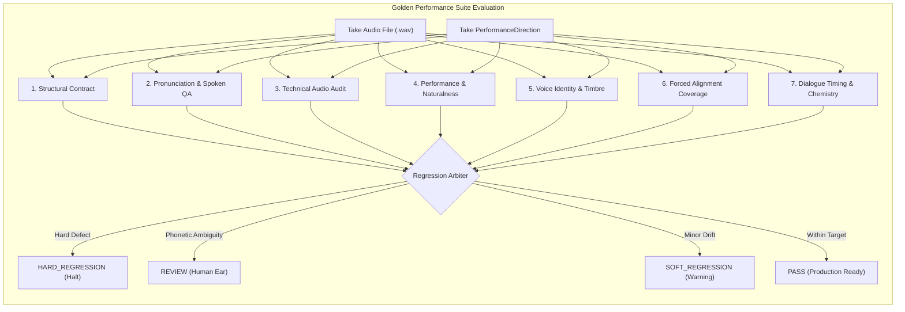

# Golden Performance Benchmark Suite v1.0

## 1. Executive Summary & Purpose

The **Golden Performance Suite** is a permanent, deterministic, reproducible regression testing and benchmark framework for the Studio Audiobook Production Engine (`audiobook-maker`). 

Its primary purpose is to definitively answer the question:
> **"Did a change to the audiobook system make the actual listening experience worse?"**

Unlike standard unit tests that only verify code paths, schema validation, and exit codes, the Golden Performance Suite evaluates end-to-end dramatic, linguistic, acoustic, and conversational fidelity. It detects subtle performance degradation—such as acting collapse, voice identity drift, swallowed syllables, misaligned phonemes, robotic pitch-locking, clipped dynamic peaks, or conversational timing errors—even when code tests, type checks, and builds pass cleanly.

---

## 2. Benchmark Design Principles

1. **Anti-Degradation Guarantee**: Every pipeline component that touches dramatic performance, acoustic mastering, pronunciation, or conversational chemistry must preserve or improve baseline benchmark scores.
2. **Multi-Dimensional Quality Preservation**: Quality is never collapsed into a single scalar "magic number" that could mask catastrophic failures (e.g., great pitch contour cannot hide a swallowed character name or DC offset bias).
3. **Multi-State Regression Grammar**: Clear separation between:
   - `HARD_REGRESSION`: Immediate production-halting defect (clipping, missing words, voice identity drift $< 0.55$, dead air $> 300\text{ms}$, severe alignment failure $< 0.35$).
   - `SOFT_REGRESSION`: Minor audible drift within warning thresholds (mild loudness drift, subtle timbre shift).
   - `REVIEW`: Ambiguous linguistic or phonetic items requiring human ear verification.
   - `PASS`: Baseline conformance across all 6 core quality dimensions.
4. **Deterministic Reproducibility**: All 18 benchmark scenes utilize fixed text, explicit performance parameters, calibrated acoustic bands, and deterministic synthetic audio generators simulating organic human vocal formants.

---

## 3. The 18 Canonical Golden Scenes

The benchmark comprises 18 canonical scenes spanning the 20 fundamental dramatic, linguistic, and acoustic dimensions:

| Scene ID | Title | Category | Language | Speaker | Key Dramatic / Acoustic Dimension | Target Emotional State |
| :--- | :--- | :--- | :--- | :--- | :--- | :--- |
| **GS-01** | Worldbuilding Neutral Exposition | Narration | English | Narrator | Steady, unforced exposition, clear diction | `neutral` |
| **GS-02** | Somber Tragic Tone | Narration | English | Narrator | Slow, weighted cadence, grave resonance | `somber` |
| **GS-03** | Iron-Restraint Grief Monologue | Performance | English | Geralt | Aposiopesis, suppressed agony, tight throat | `grief` |
| **GS-04** | Confrontational Outrage | Performance | English | Baron | Explosive vocal force, dominant attack | `anger` |
| **GS-05** | Running for Life | Performance | English | Ciri | Hyperventilation, sharp intake, breathless panic | `panic` |
| **GS-06** | Battlefield Victory Shouting | Performance | English | Soldier | Triumphant exultation, high vocal effort | `triumph` |
| **GS-07** | Intimate Beside Hospital Bed | Performance | English | Yennefer | Sub-glottal close-mic whisper, tender warmth | `tenderness` |
| **GS-08** | Battlefield Tactical Order | Performance | English | General | Projective acoustic power, hall resonance | `authority` |
| **GS-09** | Solitary Moral Calculation | Dialogue | English | Geralt | Interior cynical contemplation, subtextual irony | `cynical_contemplation`|
| **GS-10** | Lord and Pleading Servant | Dialogue | English | Servant | Submissive pleading, trembling deference | `supplication` |
| **GS-11** | High-Stakes Verbal Duel | Dialogue | English | Yennefer | Rapid counter-retort, 120ms turn-taking gap | `defiance` |
| **GS-12** | Interrogation Room Escalation | Dialogue | English | Interrogator | Progressive dynamic intensity, tempo tightening | `suspicion` |
| **GS-13** | Mid-Sentence Interruption Cutoff| Dialogue | Hindi | Dandelion | Abrupt 2ms micro-fade zero-crossing, 35ms pause| `surprise` |
| **GS-14** | Dramatic Hindustani Nuance | Pronunciation | Hindi | Sultan | Proper Urdu nuktas (*ग़ुरूर*, *ख़ामोशी*, *फ़ैसला*) | `regal_command` |
| **GS-15** | Metropolitan Emergency | Pronunciation | Hinglish | Inspector | Organic code-switching loanwords (*Doctor*, *Hospital*) | `urgency` |
| **GS-16** | Complex Fantasy Proper Names | Pronunciation | Hindi | Narrator | Fantasy lexicon overrides (*Geralt* $\to$ *गेराल्ट*) | `neutral` |
| **GS-17** | Currency and Numeral Expansion | Pronunciation | Hindi | Merchant | Deterministic symbol phonetization (*₹500*, *25%*) | `satisfaction` |
| **GS-18** | Narration to Dialogue Transition| Transition | Hindi | Geralt | Spatial acoustic contrast, proximity switch | `warning` |

---

## 4. Evaluated Quality Dimensions

Every take evaluated by the suite is analyzed across 6 distinct dimensions:



### 1. Structural Verification
- Validates presence of `PerformanceDirection` contracts.
- Confirms speaker matching between character casting and generated audio.
- Ensures narrative mode is explicitly defined.

### 2. Pronunciation & Spoken Text Resolution
- Verifies that all expected phonetic tokens (including foreign proper names, acronyms, and expanded numerals) are present in the resolved spoken text.
- Executes `PronunciationAudioQA` to detect dropped or swallowed syllables and rushed deliveries ($< 40\text{ms}$ anomalies).

### 3. Technical Audio Quality Audit
- **Digital Clipping**: Detects rail-pinned samples ($\ge 32766$). Max allowed is constrained per scene (e.g., 0 for quiet prose, max 3 for shouted projections).
- **RMS Acoustic Loudness**: Verifies the audio's RMS level falls strictly within the calibrated dynamic band (e.g., $[-34, -22]\text{ dBFS}$ for whisper, $[-20, -10]\text{ dBFS}$ for projections). Deviations $> 4.0\text{ dB}$ trigger hard regressions.
- **DC Offset Bias**: Verifies DC offset bias is below $0.05$ (5%).

### 4. Performance & Naturalness
- Verifies emotional state realization against intended `surface_emotion` and `intensity`.
- Evaluates pitch variance and jitter to detect robotic "pitch-locking" ($< 3.0\text{ Hz}$).
- Scores acting believability and naturalness ($> 0.70$ required for PASS).

### 5. Voice Identity & Speaker Continuity
- Uses acoustic embeddings to verify character timbre stability.
- Scores $< 0.55$ trigger immediate `HARD_REGRESSION` for catastrophic voice drift.

### 6. Forced Alignment Verification
- Uses `WorkstationForcedAligner` (TorchAudio CTC MMS_FA with fallback) to verify character-accurate word alignment.
- Aligned confidence hard gate: $< 0.35$ triggers `HARD_REGRESSION`; $< 0.65$ triggers `SOFT_REGRESSION`.

### 7. Dialogue Timing & Conversational Chemistry
- Evaluates pause realization via `PauseEditor` against intended timing contracts.
- Dead air check: pause exceeding `max_turn_gap_ms` by $> 300\text{ms}$ triggers `Dead air violation`.
- Truncation check: pause shortened below `min_pause_ms` by $> 250\text{ms}$ triggers `Emotional pause truncated`.
- Evaluates multi-turn `ConversationalChemistry` (intensity trajectory, turn dynamics, pacing contrast).

---

## 5. Failure Injection & Regression Safety Cycle

To prevent the suite from becoming a "silent rubber stamp", the suite includes `GoldenPerformanceSuite.inject_failure()`. This utility injects 8 controlled real-world audio drama faults:

1. `wrong_speaker`: Cast intruder speaker into scene.
2. `dropped_word`: Truncates audio to 40ms to simulate swallowed syllables.
3. `missing_direction`: Strips `PerformanceDirection` contract.
4. `clipping`: Pins 25 consecutive samples to $+32767$ rail.
5. `dc_offset`: Injects $0.15$ hardware DC offset bias.
6. `pitch_lock`: Sets pitch modulation to $0.0\text{ Hz}$ (robotic monotone).
7. `dead_air`: Injects $1800\text{ms}$ latency into high-speed banter.
8. `truncated_pause`: Clamps aposiopesis grief pause from $1250\text{ms}$ to $50\text{ms}$.

The mandatory **Break $\to$ Catch $\to$ Restore $\to$ Pass** test cycle validates that:
1. Every injected failure is unambiguously caught as a `HARD_REGRESSION`.
2. Restoring clean take audio immediately restores `PASS` status.

---

## 6. Execution & Benchmark CLI

The suite can be executed programmatically or via pytest:

```bash
# Run all golden performance suite tests
pytest tests/test_golden_performance_suite.py -v

# Run full baseline benchmark
python -c "from audiobook_factory.performance.golden_suite import GoldenPerformanceSuite; from pathlib import Path; suite = GoldenPerformanceSuite(); rep = suite.run_suite(Path('output/benchmarks')); print(rep.model_dump_json(indent=2))"
```
