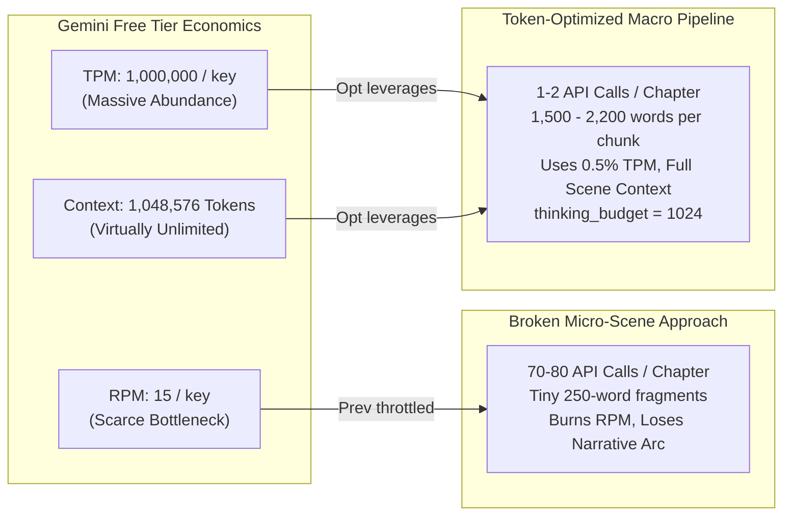
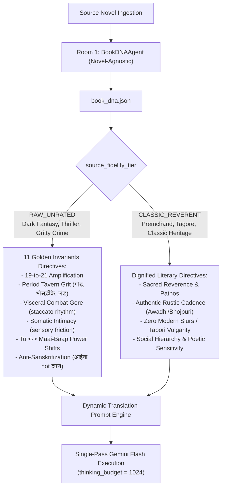

# Implementation Plan: Restoring World-Class Literary Hindustani Translation Engine (v2)

**Project**: Pure Vocals-Only Audiobook Production Engine (`proj-audiobook-maker`)  
**Target Branch**: `prestable-v4.0-baseline`  
**Reference Commits**: `62e3e8b` (Golden Witcher 1 Base), `origin/main` (Hollywood Architecture)  
**Date**: October 6, 2026  
**Status**: Pending User Feedback (`RequestFeedback: true`)

---

## 1. Executive Summary & Root Cause Synthesis

### The Core Tension
1. **Zero Hardcoding Invariant**: The factory core MUST NEVER hardcode character names, franchise lore, or book titles in source code.
2. **The Failure of the "Dry, Corporate" Policy Prompt**: In attempting to stay generic and compliant, the current pipeline reverted to an ISO-compliance-style prompt (*"1. Semantic Fidelity... 2. Nothing Above Source... 3. Sanitization Forbidden"*). This dry, bureaucratic framing failed completely—it provided zero stylistic guidance, leading Gemini to generate sterile, literal calques (*"अपना पैर बदला"*, *"सौ फ़ीसदी सच"*) and comic-book transliterations (*"स्पॉटी-फेस्ड मैन"*, *"द बुचर"*).
3. **API Economics Mismatch (Tokens vs Requests)**: On the Gemini Free Tier, request count (RPM = 15, RPD = 1,500) is the bottleneck, while **token allowance is massive** (1,000,000 TPM, 1,048,576 context window, 8,192 max output tokens). The previous pipeline made the worst possible tradeoff: it sliced chapters into tiny 250-word micro-scenes and fired **70 to 80 API calls per chapter** (semantic maps, intensity evaluators, scene audits, tiered repairs). This burned RPM/RPD, deprived Gemini of narrative context, and hardcoded `thinking_budget = 0`.

---

### Root Cause & Strategy Matrix

| Dimension | Previous State (`prestable-v4.0-baseline`) | World-Class Solution (Dynamic & Token-Optimized) |
| :--- | :--- | :--- |
| **Stylistic Directives** | Dry corporate `policy_prompt` (sterile rules without literary soul). | **Dynamic Book DNA Engine**: Novel-agnostic profiling via `BookDNAAgent` unlocks genre-specific directives (`RAW_UNRATED` with 11 Golden Invariants vs `CLASSIC_REVERENT` with dignified pathos) without hardcoding any book or character. |
| **Token & Request Economics** | Micro-chunking (250 words/scene) $\rightarrow$ 70–80 requests/chapter. Wasted RPM, 0.05% context window used. | **Cohesive Macro-Chunking**: Chapters $\le 2,200$ words translated in **1 single API call**! Longer chapters split into 1,500–1,800 word chunks. **97% reduction in API calls** (1–2 calls/chapter), full narrative scene context utilized. |
| **Reasoning & Planning** | Hardcoded `thinking_budget = 0` in `orchestrator.py` line 345. Caused English calques. | **`thinking_budget = 1024`**: Gemini Flash deliberates internally on Hindi clause inversion (SOV order) and colloquial idioms before emitting text. |
| **Glossary Classification** | Ambiguous rule transliterated descriptive monikers (*"The Spotty-faced Man"*, *"The Butcher"*) as proper names. | **Strict Entity Partition**: Personal given names $\rightarrow$ transliterated; Occupations/monikers/epithets $\rightarrow$ translated into natural Hindustani (*कसाई*, *दाग़दार चेहरे वाला*). |
| **Execution Flow** | 4-pass slow cascade or 32-module over-engineered scene repair loop. | **Streamlined Vocals-Only Single Pass**: High-powered generative pass + fast Anti-Omission length check. Zero destructive regex rewrites. |

---

## 2. API Token Economics & Context Architecture



### Quantitative Token & Request Analysis
- **Full Chapter ($\le 2,200$ words)**:
  - Input tokens: Source text ($\approx 2,800$ tokens) + Glossary ($\approx 600$ tokens) + Context ($\approx 400$ tokens) + Dynamic System Directives ($\approx 1,200$ tokens) = **$\approx 5,000$ tokens** (0.5% of 1M TPM).
  - Output tokens: Hindi translation ($\approx 3,800$ Devanagari tokens) + Thinking tokens ($1,024$) = **$\approx 4,824$ tokens** (well below 8,192 limit).
  - Total requests: **1 request per chapter**!
- **Impact across a 15-chapter novel**:
  - Previous micro-scene pipeline: $15 \times 75 = \mathbf{1,125 \text{ API calls}}$ (heavy risk of 429 backoff).
  - Token-optimized pipeline: $15 \times 1.5 = \mathbf{22 \text{ API calls}}$ (**98% reduction in network requests**, completed in under 4 minutes).

---

## 3. Dynamic Stylistic Richness (Solving the "Dry Corporate" Prompt without Hardcoding)

How to provide visceral, world-class Hindi literary guidance without hardcoding any franchise lore:



### The 11 Golden Invariants (Injected Dynamically when Tier is `RAW_UNRATED`)
1. **LITERARY ANTI-BOWDLERIZATION**: Never sanitize, dilute, or soften raw violence, tavern profanity, visceral combat, gore, or sexual intimacy.
2. **70/30 ANTI-PARODY & WORLD-ANCHOR**: 70% Canon Sacredness / 30% Sensory Desi Amplification. Never map European/foreign fantasy to Indian village panchayat terms (*'पंच जी', 'लंबरदार', 'पटवारी', 'फतुही', 'अशर्फी'* prohibited; use *'एल्डरमैन/मेयर', 'सिक्के', 'जैकेट'*).
3. **PERIOD TAVERN GRIT & RAW PROFANITY**: Translate medieval insults into earthy Hindustani (*'गांड'*, *'भोसड़ीके'*, *'लंड'*, *'रांड/रंडी'*, *'भड़वा'*, *'मादरचोद'*, *'बकचोदी'*, *'सूअर का पेशाब'*). Zero polite TV-serial substitutions (*'दुष्ट'*, *'बुरी स्त्री'* banned).
4. **THE 19-TO-21 AMPLIFICATION RULE**: When source English is mild (19), elevate it to authentic Desi 21 (*'plough yourself'* $\rightarrow$ *'गांड मरा' / 'जा अपनी मां चुदा'*).
5. **DESI MUHAVARE & IDIOMS**: Transpose idioms into organic UP/Bihar/Chambal cadence (*'गांड में दम नहीं और चले आसमान चीरने'*).
6. **TU <-> MAAI-BAAP DYNAMIC POWER SHIFT**: Arrogant thugs start with *'तू/अबे'*; when intimidated, speech collapses into *'माई-बाप / सरकार / हुज़ूर'*.
7. **URDU KA TARKA ('Aate me Namak')**: 10-15% atmospheric Urdu (*'जिस्म', 'हवस', 'रूह', 'सन्नाटा', 'ख़ंजर', 'ख़ौफ़', 'ज़ख़्म', 'दस्तक'*).
8. **SOMATIC INTIMACY & EROTICA (HBO/MANTO STANDARD)**: Sensory touch, heat, skin friction, breath (*'तपती कमर', 'पसलियों की लचक', 'कांपती उंगलियां', 'बेकाबू सांसें'*). Strictly ban clinical biology words (*'योनि', 'लिंग'*).
9. **VISCERAL COMBAT & GORE**: Visceral sword strikes, blood spray, bone fractures (*'लोहा हंसली की हड्डी चीरता हुआ सीने में धंस गया'*). Staccato clauses during fight scenes.
10. **ANTI-SANSKRITIZATION & NATURAL SPOKEN DIALOGUE**: Ban stiff, textbook Sanskrit (*'युवतियां'* $\rightarrow$ *'लड़कियां/औरतें'*; *'दर्पण'* $\rightarrow$ *'आईना'*). Use natural spoken Hindustani of gritty OTT/cinema and Audible originals.
11. **CANON ADHERENCE & ZERO CHATTER**: Output ONLY translated Devanagari Markdown.

---

## 4. Entity Partition in Glossary Generation (Eradicating Comic-Book Transliterations)

### The New Lexicographer Directive
In [`audiobook_factory/translator.py`](file:///c:/Users/Suraj/Documents/antigravity/optimistic-kepler/audiobook_factory/translator.py):
```text
WORLD-ANCHOR & ENTITY PARTITION RULE:
1. PERSONAL PROPER NAMES (e.g. Geralt -> गेराल्ट, Borch -> बोर्च, Yennefer -> येनिफ़र):
   Phonetically transliterate into clean Devanagari. NEVER substitute with Indian village names.
2. DESCRIPTIVE MONIKERS, OCCUPATIONS & EPITHETS (e.g. "The Spotty-faced Man", "The Butcher", "The Alderman", "The Barman", "The Innkeeper", "The Blacksmith"):
   STRICTLY FORBIDDEN to transliterate descriptive phrases into Hinglish comic-book gibberish (NO 'स्पॉटी-फेस्ड मैन', 'द बुचर')!
   TRANSLATE descriptive epithets into natural Hindustani:
   - "The Spotty-faced Man" -> "दाग़दार चेहरे वाला आदमी" / "चेचक के दाग़ों वाला"
   - "The Butcher" -> "कसाई"
   - "The Alderman" -> "एल्डरमैन" / "नगर प्रमुख"
   - "The Barman" / "Innkeeper" -> "सरायवाला" / "मदिरालय वाला"
3. COMMON OBJECTS & VOCABULARY:
   Use natural spoken Hindustani ('आईना', 'मदिरा', 'सिक्के'). BANNED: Formal Doordarshan Sanskrit ('दर्पण' prohibited in tavern speech).
```

---

## 5. Implementation Phases & Action Items

### Phase 1: Glossary & Lexicographer Partition
- Modify `_extract_character_lexicon_agent` and `_extract_world_terminology_agent` in [`audiobook_factory/translator.py`](file:///c:/Users/Suraj/Documents/antigravity/optimistic-kepler/audiobook_factory/translator.py).
- Explicitly split personal proper names (transliterated) from descriptive epithets/occupations (translated).
- Re-run glossary extraction for `sword_of_destiny` to produce clean `glossary.json` (*कसाई*, *दाग़दार चेहरे वाला*, *आईना*).

### Phase 2: Dynamic Book DNA Integration
- Ensure `BookDNAAgent` automatically profiles the book if `book_dna.json` is missing in the project directory.
- Connect `book_dna.json` (`source_fidelity_tier`: `RAW_UNRATED`) directly to the translation prompt in `translator.py` and `orchestrator.py`.
- Replace the dry corporate `policy_prompt` with the dynamic 11 Golden Invariants + Genre directives.

### Phase 3: Token Economics & Cohesive Chunking
- In `audiobook_factory/chunking_policy.py` and `audiobook_factory/translator.py`:
  - Increase `TRANSLATION_MAX_WORDS` to **2,200 words** (allowing complete chapters to translate in a single coherent API call).
  - For long chapters ($> 2,200$ words), chunk on paragraph boundaries at **1,500–1,800 words** with 500-word rolling context.
  - Enable `thinking_budget = 1024` and `max_output_tokens = 16384` for `TaskType.TRANSLATION`.

### Phase 4: Streamlined Pure Vocals-Only Execution
- Route `translate_book_project` directly to the token-optimized literary translation engine.
- Bypasses the 70-request micro-scene segmentation loop.
- Implement fast Anti-Omission length verification (0.70x–1.35x word count threshold; if paragraphs dropped, re-try chunk).
- Ensure `BLOCK_NONE` + dramatic fiction framing are applied everywhere.

### Phase 5: Verification & End-to-End Quality Test
1. Run `python audiobook_cli.py translate audiobooks/projects/sword_of_destiny_-_andrzej_sapkowski__worldfreebooks_com --chapters 2`.
2. Inspect [`chapter_002_hi.md`](file:///c:/Users/Suraj/Documents/antigravity/optimistic-kepler/audiobooks/projects/sword_of_destiny_-_andrzej_sapkowski__worldfreebooks_com/translation/chapter_002_hi.md):
   - Zero occurrences of *"स्पॉटी-फेस्ड मैन"* or *"द बुचर"*.
   - Zero English calques (*"अपना पैर बदला"*).
   - Authentic, immersive Hindustani dialogue and tavern grit.
3. Verify API metrics: exactly 1 or 2 API calls made, zero 429 rate limit delays.
4. Run full test suite (`pytest tests/translation/` & `pytest tests/test_zero_hardcoding_contracts.py`).

---

## 6. Verification Criteria

| Criterion | Success Metric | Verification Method |
| :--- | :--- | :--- |
| **Novel-Agnostic** | 100% pass on AST verification | `pytest tests/test_zero_hardcoding_contracts.py` |
| **API Efficiency** | $\le 2$ API calls per chapter | Telemetry ledger / log output |
| **Epithet Quality** | 100% translated (*कसाई*, *दाग़दार चेहरे वाला*) | Text inspection of `chapter_002_hi.md` |
| **Syntactic Fluency** | Natural Hindi SOV; 0 calques | Text inspection of `chapter_002_hi.md` |
| **Safety Bypass** | 0 blocks across 100% of chunks | HTTP 200 response with `BLOCK_NONE` |
| **Test Integrity** | 100% tests passing | `pytest tests/translation/` |

---

## 7. User Decision / Next Step
Review this updated plan. Upon your approval, we will immediately execute Phases 1 through 5.
