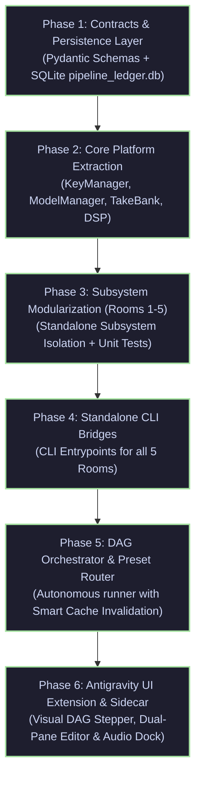

# 🗺️ Implementation, Migration & Testing Blueprint (v6.0-ENTERPRISE-DAG)

**System**: Studio Audio Production & Vocal Mastering Engine  
**Target Architecture**: Contract-Driven Decoupled 5-Room DAG Platform  
**Standard**: `v6.0-ENTERPRISE-DAG`  
**Classification**: Implementation Roadmap & Engineering Plan  

---

## 1. Target Directory & Package Structure

```
audiobook_factory/
├── contracts/                      # Pydantic v2 Schema Definitions (schema_version: "2.0")
│   ├── __init__.py
│   ├── base.py                     # ContractBaseModel & deterministic SHA-256 serialization
│   ├── ingestion.py                # RawBookManifest, RawChapterRecord, RawSentenceRecord
│   ├── lore.py                     # BookBible, CastLock, CharacterDossier
│   ├── translation.py              # TranslationManifest, TranslationBeatRecord
│   ├── screenplay.py               # ScreenplayScript, ScreenplaySegment, SegmentProvenance
│   ├── editorial.py                # TimelineLedger, TimelineCueRecord, DialogueEditPlan
│   ├── mastering.py                # MasterArtifact, LoudnessComplianceReport, ContainerM4BManifest
│   └── ledger.py                   # ChapterStageRecord, StageArtifactRecord, GateAuditRecord
│
├── core/                           # Shared Decoupled Platform Libraries (audio_platform_core)
│   ├── __init__.py
│   ├── key_manager.py              # 120+ KeyPool, SQLite rotation, cool-down, concurrency
│   ├── model_manager.py            # Model Tier Routing & BLOCK_NONE permissive config
│   ├── cache/
│   │   ├── __init__.py
│   │   ├── ledger.py               # SQLite pipeline_ledger.db Manager (WAL mode)
│   │   └── take_bank.py            # Content-addressed SHA-256 Audio Take Cache (LRU cleanup)
│   ├── dialogue_editorial/         # DE-01 - DE-07 DSP Fades, Breaths, and Overlaps
│   │   ├── __init__.py
│   │   ├── dsp.py
│   │   └── editor.py
│   └── mastering/                  # Studio Mastering Suite
│       ├── __init__.py
│       ├── loudnorm.py             # Two-Pass Measured Linear EBU R128 (-19 LUFS)
│       ├── resampler.py            # Kaiser Sinc 48kHz / 24-bit PCM
│       └── packager.py             # FFMETADATA1 & Single-Pass M4B Container Packager
│
├── rooms/                          # 5 Standalone Decoupled Subsystems
│   ├── __init__.py
│   ├── room1_ingest/               # Forensic Ingestion Engine (XY-cut, AST, Lore Harvester)
│   ├── room2_translate/            # Translation Collective (4-Agent Hindustani Ensemble)
│   ├── room3_screenplay/           # Screenplay & Anti-Swap Attribution Dramaturgy
│   ├── room4_synth/                # Multi-Cast TTS & TakeBank Assembly Engine
│   └── room5_master/               # Broadcast Loudness & M4B Packaging Subsystem
│
├── dag/                            # Top-Level Orchestration & Invalidation
│   ├── __init__.py
│   ├── orchestrator.py             # DAG Runner & Preset Dispatcher
│   ├── presets.py                  # Preset Definitions (A, B, C, D)
│   └── diff_reconciler.py          # Smart Diff & Stage Invalidation Engine
│
├── api/                            # IPC Studio Bridge for Antigravity Sidecar
│   ├── __init__.py
│   └── studio_bridge.py            # JSON-over-stdout CLI IPC Bridge for Node.js Sidecar
│
└── cli/                            # Standalone Command-Line Entrypoints
    ├── __init__.py
    ├── ingest.py                   # python -m audiobook_factory.cli.ingest
    ├── translate.py                # python -m audiobook_factory.cli.translate
    ├── screenplay.py               # python -m audiobook_factory.cli.screenplay
    ├── synth.py                    # python -m audiobook_factory.cli.synth
    ├── master.py                   # python -m audiobook_factory.cli.master
    ├── package.py                  # python -m audiobook_factory.cli.package
    └── run.py                      # python -m audiobook_factory.cli.run

sidecars/
└── studio-panel/                   # Antigravity Embedded Webview Sidecar
    ├── sidecar.json                # Sidecar lifecycle & UI entrypoint
    ├── main.mjs                    # Node.js sidecar server & SSE event hub
    ├── index.html                  # Stitch-grade studio interface
    ├── app.js                      # UI state manager & waveform soundboard
    └── styles.css                  # Obsidian dark studio theme
```

---

## 2. Phased Migration Sequence



---

## 3. Step-by-Step Phase Breakdown

### Phase 1: Contracts & Persistence Layer
- **Deliverables**:
  - Implement Pydantic v2 data models in `audiobook_factory/contracts/`.
  - Implement SQLite WAL persistence layer in `audiobook_factory/core/cache/ledger.py` with tables: `project_metadata`, `chapter_stage_ledger`, `stage_artifacts`, `segment_take_cache`, `gate_audit_records`.
  - Add contract round-trip serialization tests.
- **Acceptance Criteria**:
  - 100% schema validation on boundary models.
  - Deterministic SHA-256 serialization matching expected test vectors.
  - Zero schema drift across runs.

### Phase 2: Core Platform Extraction (`audio_platform_core`)
- **Deliverables**:
  - Refactor `key_manager.py` and `model_manager.py` into `audiobook_factory/core/`.
  - Implement `TakeBank` in `audiobook_factory/core/cache/take_bank.py` with content-addressed SHA-256 storage and LRU disk cleanup.
  - Extract and harden `dialogue_editorial/` DSP rules (DE-01 through DE-07).
  - Extract `mastering/` engine with two-pass linear loudnorm and M4B packager.
- **Acceptance Criteria**:
  - All core components testable standalone without importing orchestrator modules.
  - TakeBank lookup returns $< 1\text{ms}$ on cache hit.
  - Loudnorm passes verify $\pm 0.1\text{ LUFS}$ target accuracy.

### Phase 3: Subsystem Modularization (Rooms 1 through 5)
- **Deliverables**:
  - Package each Room into its dedicated package under `audiobook_factory/rooms/`.
  - Ensure each room accepts only inbound contract instances and writes valid outbound contract files.
  - Implement standalone quality gate checks for each room (Gate 0.1, 1.0, 2.0, 4.0, 5.0).
- **Acceptance Criteria**:
  - Every room can be executed in isolation via its public `process(...)` method.
  - Quality gates enforce fail-closed invariants before persisting artifacts.

### Phase 4: Standalone CLI Bridges
- **Deliverables**:
  - Implement dedicated CLI modules in `audiobook_factory/cli/` (`ingest.py`, `translate.py`, `screenplay.py`, `synth.py`, `master.py`, `package.py`).
  - Support fine-grained developer flags (`--chapter`, `--patch-beat`, `--workers`, `--target-lufs`, `--reconcile-dirty`).
- **Acceptance Criteria**:
  - Developers can run any single room from the terminal with standardized `--help` and intuitive arguments.

### Phase 5: DAG Orchestration & Smart Diff Invalidation
- **Deliverables**:
  - Implement DAG dependency graph and preset router in `audiobook_factory/dag/orchestrator.py`.
  - Implement `diff_reconciler.py` to compare inbound contract hashes with ledger state and compute dirty stages.
  - Implement master CLI runner in `audiobook_factory/cli/run.py`.
- **Acceptance Criteria**:
  - Editing a single translated beat and executing `--reconcile-dirty` only synthesizes that single dirty segment and regenerates the master WAV in $< 15$ seconds.
  - 100% of pipeline presets (`AUDIOBOOK_STUDIO`, `ENGLISH_AUDIOBOOK`, `MULTI_HOST_PODCAST`, `STANDALONE_TRANSLATION`, `STANDALONE_TTS_API`) execute reliably.

### Phase 6: Antigravity UI Extension & Sidecar Bridge
- **Deliverables**:
  - Implement `audiobook_factory/api/studio_bridge.py` supporting CLI subcommands: `status`, `list-projects`, `project-detail`, `patch-segment`, `run-stage`, `audition`.
  - Upgrade Node.js sidecar `sidecars/studio-panel/main.mjs` with SSE live ledger watcher and lossless 48kHz audio streamer.
  - Refactor `app.js` and `index.html` to integrate the 4 persistent visual zones: Top Navigation Bar, Interactive 5-Room DAG Stepper, Focused Room Workspaces (Dual-Pane Translation, 4D Cast Board, TakeBank Waveform Grid, 114 Voice Soundboard), and Sticky Broadcast Master Dock.
- **Acceptance Criteria**:
  - Clicking `[⚡ Patch & Audition]` generates and plays single segment take in $< 1.5$ seconds inside Antigravity Webview.
  - Real-time EBU R128 (-19.0 LUFS) and True Peak meter displays dynamic compliance.
  - 0% UI lag or crash on background DAG execution.

---

## 4. Comprehensive Testing & Verification Matrix

| Test Suite | File Location | Coverage Scope | Target Benchmark |
| :--- | :--- | :--- | :--- |
| **Contracts & Schemas** | `tests/contracts/test_schemas.py` | Pydantic v2 parsing, validation, and SHA-256 determinism | 100% Validations |
| **TakeBank & Ledger** | `tests/core/test_take_bank.py` | Content-addressed caching, SQLite WAL operations, LRU pruning | $< 5\text{ms}$ operations |
| **Editorial DSP** | `tests/core/test_editorial_dsp.py` | DE-01 - DE-07 Hann micro-fades, speech floor, silence clipping | Zero audio clipping |
| **Broadcast Mastering**| `tests/core/test_mastering.py` | Two-pass loudnorm, EBU R128 -19 LUFS, Kaiser 48kHz | -19.0 LUFS $\pm 0.5$, $\le -1.5$ dBTP |
| **Room 1 Ingest** | `tests/rooms/test_room1_ingest.py`| Geometric XY-cut extraction, AST monotonicity, Gate 0.1 | 0 duplicate sentences |
| **Room 2 Translate** | `tests/rooms/test_room2_translate.py`| 4-Agent Collective, surgical beat patching, Gate 1.0 | Dual-Rule compliant |
| **Room 3 Screenplay** | `tests/rooms/test_room3_screenplay.py`| Gate 2.0 Anti-Swap attribution, 4D formants, user lock | 0% turn inversions |
| **Room 4 Synth** | `tests/rooms/test_room4_synth.py` | TakeBank cache hits, Gemini Flash TTS dispatch, assembly | Lossless 48kHz stem |
| **Room 5 Master** | `tests/rooms/test_room5_master.py` | M4B container packaging, MP4 markers, embedded cover | Valid M4B stream |
| **DAG Orchestration** | `tests/dag/test_orchestrator.py` | Preset execution, diff reconciliation, dirty stage runs | 0 unnecessary API calls |

---

## 5. Definition of Done (DoD)

A phase or subsystem is considered **Done** when:
1. All Pydantic v2 schemas pass strict validation.
2. SQLite ledger transactions execute cleanly in WAL mode with zero database locks.
3. Quality gates emit deterministic `GateAuditRecord` entries.
4. Standalone CLI and Python API examples run end-to-end without errors.
5. All unit, integration, and regression tests pass (100% green).
